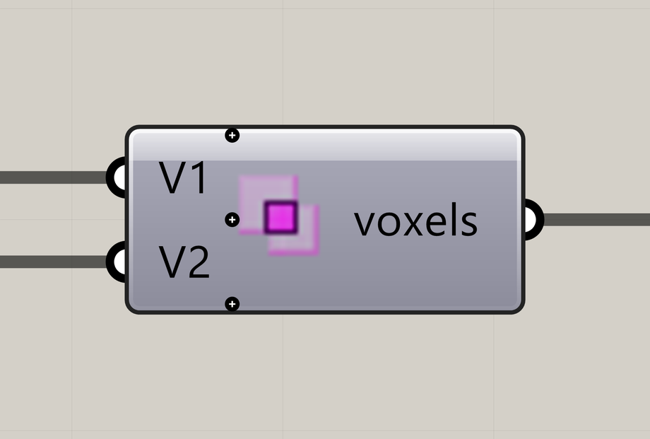

# Voxel Selection Intersection

Keep only voxels shared by all connected selections.

**Location:** Nuclei4 → Environment



## Use it

Connect selections from the same voxel field to **V1** and **V2**. The **voxels** output is their overlap.

Zoom in on the component to add more input ports when comparing additional selections.

## Inputs

Defaults describe a newly placed component.

| Input            | Type / access       | Default  | Meaning                 |
| ---------------- | ------------------- | -------- | ----------------------- |
| **Voxel** (`V1`) | Generic Data / item | Required | First voxel selection.  |
| **Voxel** (`V2`) | Generic Data / item | Required | Second voxel selection. |

## Output

| Output                       | Type / access       | Meaning                           |
| ---------------------------- | ------------------- | --------------------------------- |
| **Output Voxels** (`voxels`) | Generic Data / item | Selected or modified voxel field. |

## Overlapping values

Right-click to choose **Minimum**, **Maximum**, or **Average** for values in the overlap.

## If something is wrong

| Symptom                      | Action                                                 |
| ---------------------------- | ------------------------------------------------------ |
| Output is empty              | Check whether the two selections overlap.              |
| Values in the overlap differ | Check the component’s right-click combination setting. |

## Continue

[Component reference](./)

<details>

<summary>Machine-readable reference (JSON)</summary>

[Download JSON](../reference/components/voxel-selection-intersection.json) · [JSON Schema](../reference/component.schema.json) · [How to read this JSON](../reference/reading-json.md)

Component metadata for scripts and AI tools. Indices are zero-based; defaults are display strings. [Full catalog](../reference/component-contracts.json).

```json
{
  "$schema": "../component.schema.json",
  "schemaVersion": 1,
  "pluginVersion": "4.1.0.0",
  "ghaSha256": "700C1620FD839DD1511E67359961787C8EC08EA595812B2EDED27828F96800C5",
  "component": {
    "name": "Voxel Selection Intersection",
    "category": "Nuclei4",
    "subcategory": " Environment",
    "componentGuid": "e1c26fa2-35ea-4c83-8f1b-df7d90280196",
    "dotnetType": "Nuclei4.Voxels_AND",
    "inputs": [
      {
        "index": 0,
        "name": "Voxel",
        "nickname": "V1",
        "ghType": "Generic Data",
        "access": "item",
        "optional": false,
        "mapping": "None",
        "defaults": []
      },
      {
        "index": 1,
        "name": "Voxel",
        "nickname": "V2",
        "ghType": "Generic Data",
        "access": "item",
        "optional": false,
        "mapping": "None",
        "defaults": []
      }
    ],
    "outputs": [
      {
        "index": 0,
        "name": "Output Voxels",
        "nickname": "voxels",
        "ghType": "Generic Data",
        "access": "item",
        "optional": false,
        "mapping": "None",
        "defaults": []
      }
    ]
  }
}
```

</details>
