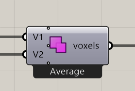

# Voxel Selection Union

Combine voxel selections, keeping cells found in any of them.

**Location:** Nuclei4 → Environment



## Use it

Connect selections from the same voxel field to **V1** and **V2**. Send **voxels** into the next mapping component or the solver.

Zoom in on the component to add more input ports when combining additional selections.

## Inputs

Defaults describe a newly placed component.

| Input | Type / access | Default | Meaning |
| --- | --- | --- | --- |
| **Voxel** (`V1`) | Generic Data / item | Required | First voxel selection. |
| **Voxel** (`V2`) | Generic Data / item | Required | Second voxel selection. |

## Output

| Output | Type / access | Meaning |
| --- | --- | --- |
| **Output Voxels** (`voxels`) | Generic Data / item | Selected or modified voxel field. |

## Overlapping values

Right-click to choose **Minimum**, **Maximum**, or **Average** for values where the selections overlap. Average is the initial choice.

## If something is wrong

| Symptom | Action |
| --- | --- |
| Combined field is unexpected | Check that both selections come from the same grid and inspect the overlap setting. |

## Continue

[Minimizing Transport Networks 1](../examples/03-minimizing-transport-networks-1.md) · [Minimizing Transport Networks 2](../examples/04-minimizing-transport-networks-2.md) · [City Map](../examples/05-city-map.md) · [Component reference](README.md)

<details>
<summary>Machine-readable reference (JSON)</summary>

[Download JSON](../reference/components/voxel-selection-union.json) · [JSON Schema](../reference/component.schema.json) · [How to read this JSON](../reference/reading-json.md)

Component metadata for scripts and AI tools. Indices are zero-based; defaults are display strings. [Full catalog](../reference/component-contracts.json).

```json
{
  "$schema": "../component.schema.json",
  "schemaVersion": 1,
  "pluginVersion": "4.1.0.0",
  "ghaSha256": "700C1620FD839DD1511E67359961787C8EC08EA595812B2EDED27828F96800C5",
  "component": {
    "name": "Voxel Selection Union",
    "category": "Nuclei4",
    "subcategory": " Environment",
    "componentGuid": "0e3c0d1c-1057-4f08-9368-a0078a3d9d35",
    "dotnetType": "Nuclei4.Voxels_OR",
    "inputs": [
      {
        "index": 0,
        "name": "Voxel",
        "nickname": "V1",
        "ghType": "Generic Data",
        "access": "item",
        "optional": false,
        "mapping": "None",
        "defaults": []
      },
      {
        "index": 1,
        "name": "Voxel",
        "nickname": "V2",
        "ghType": "Generic Data",
        "access": "item",
        "optional": false,
        "mapping": "None",
        "defaults": []
      }
    ],
    "outputs": [
      {
        "index": 0,
        "name": "Output Voxels",
        "nickname": "voxels",
        "ghType": "Generic Data",
        "access": "item",
        "optional": false,
        "mapping": "None",
        "defaults": []
      }
    ]
  }
}
```

</details>
