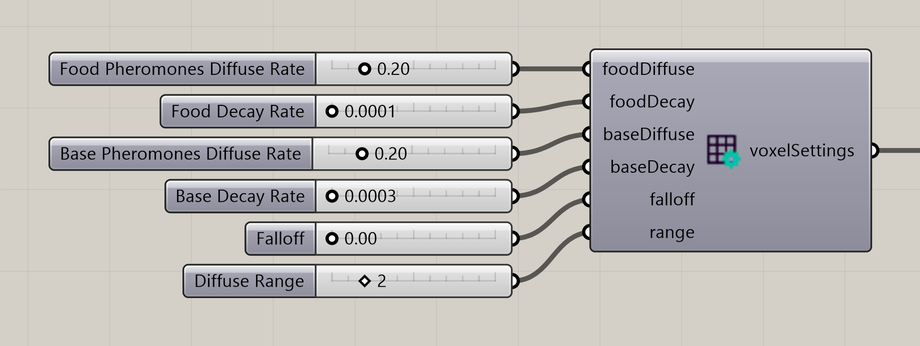

# Voxel Settings Ant

Control the spread and decay of ant food and home pheromones.

**Location:** Nuclei4 → Environment



## Use it

Connect **voxelSettings** to the solver’s **settings** input. Food pheromones guide searching ants toward food; base pheromones guide returning ants home. Each has its own diffusion and decay rates. Both share **Falloff** and **Diffuse Range**, in 2D and 3D.

Lower Falloff keeps diffusion more concentrated around nearby voxels. Higher Falloff spreads the pheromones more evenly across the neighborhood. **Diffuse Range** sets how far that neighborhood extends. This applies to both food and base pheromones.

Ant Food stays in place. Its emitted scent uses the food-pheromone settings, including the shared Falloff.

## Inputs

Defaults describe a newly placed component.

| Input | Type / access | Default | Meaning |
| --- | --- | --- | --- |
| **Food Pheromones Diffuse Rate** (`foodDiffuse`) | Number / item | Optional; 0.05 | Rate at which food pheromones spread. |
| **Food Decay Rate** (`foodDecay`) | Number / item | Optional; 0.005 | Rate at which food pheromones fade. |
| **Base Pheromones Diffuse Rate** (`baseDiffuse`) | Number / item | Optional; 0.1 | Rate at which home pheromones spread. |
| **Base Decay Rate** (`baseDecay`) | Number / item | Optional; 0.01 | Rate at which home pheromones fade. |
| **Falloff** (`falloff`) | Number / item | Optional; 0 | At **0**, diffusion gives more weight to nearby voxels. At **1**, it spreads evenly across the neighborhood set by **Diffuse Range**. Values between 0 and 1 gradually blend these effects. Applies to both food and base pheromones. |
| **Diffuse Range** (`range`) | Integer / item | Optional; 1 | Neighborhood range in voxel cells. |

## Output

| Output | Type / access | Meaning |
| --- | --- | --- |
| **Voxel Settings** (`voxelSettings`) | Text / list | Field behavior settings for the solver. |

## If something is wrong

| Symptom | Action |
| --- | --- |
| Pheromone trails disappear quickly | Check the decay rate for the signal you are viewing. |
| Ants do not find food | Check the Ant Food map as well as the food-pheromone settings. |

## Continue

[Ants Intro — 3D](../examples/13-ants-intro-3d.md) · [Ants Intro](../examples/13-ants-intro.md) · [Ants Complex](../examples/14-ants-complex.md) · [Component reference](README.md)

<details>
<summary>Machine-readable reference (JSON)</summary>

[Download JSON](../reference/components/voxel-settings-ant.json) · [JSON Schema](../reference/component.schema.json) · [How to read this JSON](../reference/reading-json.md)

Component metadata for scripts and AI tools. Indices are zero-based; defaults are display strings. [Full catalog](../reference/component-contracts.json).

```json
{
  "$schema": "../component.schema.json",
  "schemaVersion": 1,
  "pluginVersion": "4.1.0.0",
  "ghaSha256": "700C1620FD839DD1511E67359961787C8EC08EA595812B2EDED27828F96800C5",
  "component": {
    "name": "Voxel Settings Ant",
    "category": "Nuclei4",
    "subcategory": " Environment",
    "componentGuid": "3486cda4-b3f3-47a1-886b-f047d6d7a13a",
    "dotnetType": "Nuclei4.EnivronmentSettings_Ant",
    "inputs": [
      {
        "index": 0,
        "name": "Food Pheromones Diffuse Rate",
        "nickname": "foodDiffuse",
        "ghType": "Number",
        "access": "item",
        "optional": true,
        "mapping": "None",
        "defaults": [
          "0.05"
        ]
      },
      {
        "index": 1,
        "name": "Food Decay Rate",
        "nickname": "foodDecay",
        "ghType": "Number",
        "access": "item",
        "optional": true,
        "mapping": "None",
        "defaults": [
          "0.005"
        ]
      },
      {
        "index": 2,
        "name": "Base Pheromones Diffuse Rate",
        "nickname": "baseDiffuse",
        "ghType": "Number",
        "access": "item",
        "optional": true,
        "mapping": "None",
        "defaults": [
          "0.1"
        ]
      },
      {
        "index": 3,
        "name": "Base Decay Rate",
        "nickname": "baseDecay",
        "ghType": "Number",
        "access": "item",
        "optional": true,
        "mapping": "None",
        "defaults": [
          "0.01"
        ]
      },
      {
        "index": 4,
        "name": "Falloff",
        "nickname": "falloff",
        "ghType": "Number",
        "access": "item",
        "optional": true,
        "mapping": "None",
        "defaults": [
          "0"
        ]
      },
      {
        "index": 5,
        "name": "Diffuse Range",
        "nickname": "range",
        "ghType": "Integer",
        "access": "item",
        "optional": true,
        "mapping": "None",
        "defaults": [
          "1"
        ]
      }
    ],
    "outputs": [
      {
        "index": 0,
        "name": "Voxel Settings",
        "nickname": "voxelSettings",
        "ghType": "Text",
        "access": "list",
        "optional": false,
        "mapping": "None",
        "defaults": []
      }
    ]
  }
}
```

</details>
