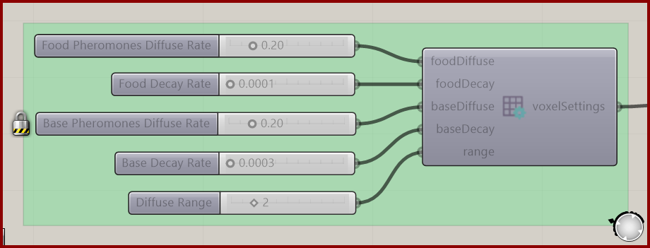

# Voxel Settings Ant

Control the diffusion and decay of food and base pheromones.

**Location:** Nuclei4 → Environment

*Captured from 13_Ants Intro_3D.gh, preserving its component position and connected controls. Example values can differ from the fresh-component defaults below.*

## Use it

Connect the settings to the solver. Food and base pheromones have separate rates but share the diffusion range. Ant Food is a source of food pheromone; it is a different field from the pheromone itself.

## Inputs

| Input | Data | Default | Purpose |
| --- | --- | --- | --- |
| **Food Pheromones Diffuse Rate** (`foodDiffuse`) | Number; item | 0.05 | The Rate of Diffusion of the Pheromones that Guide Particles Towards Food |
| **Food Decay Rate** (`foodDecay`) | Number; item | 0.005 | The Rate of Decay of the Pheromones that Guide Particles Towards Food |
| **Base Pheromones Diffuse Rate** (`baseDiffuse`) | Number; item | 0.1 | The Rate of Diffusion of the Pheromones that Guide Particles Back To Base |
| **Base Decay Rate** (`baseDecay`) | Number; item | 0.01 | The Rate of Decay of the Pheromones that Guide Particles Back To Base |
| **Diffuse Range** (`range`) | Integer; item | 1 | The Range of Diffusion of the Deposited Values |

Defaults describe a newly placed component. A saved definition can store other values on an unconnected input.

## Outputs

| Output | Data | Purpose |
| --- | --- | --- |
| **Voxel Settings** (`voxelSettings`) | Text; list | Settings For How The Environment and Data Is Interpreted |

## In the example collection

- [13_Ants Intro_3D](../examples/13-ants-intro-3d.md)
- [13_Ants Intro](../examples/13-ants-intro.md)
- [14_Ants Complex](../examples/14-ants-complex.md)

[Back to the component reference](README.md)
