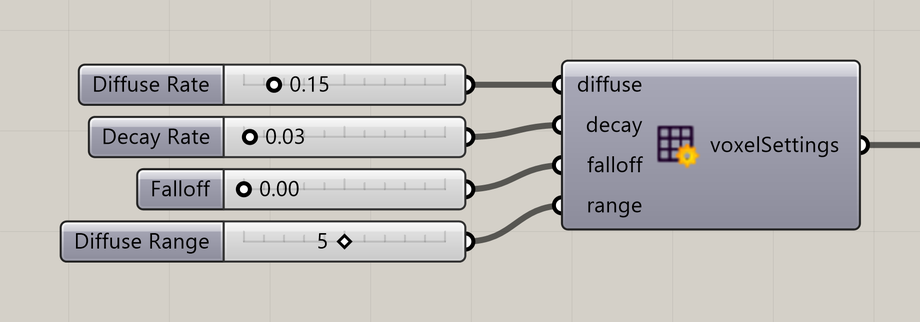

# Voxel Settings Slime

Control how the slime signal spreads and fades.

**Location:** Nuclei4 → Environment



## Use it

Connect **voxelSettings** to the solver’s **settings** input. Diffuse Rate spreads deposited signal into nearby cells; Decay Rate reduces it over time.

Lower Falloff keeps diffusion more concentrated around nearby voxels. Higher Falloff spreads the signal more evenly across the neighborhood. **Diffuse Range** sets how far that neighborhood extends.

## Inputs

Defaults describe a newly placed component.

| Input                        | Type / access  | Default        | Meaning                                                                                                                                                                                     |
| ---------------------------- | -------------- | -------------- | ------------------------------------------------------------------------------------------------------------------------------------------------------------------------------------------- |
| **Diffuse Rate** (`diffuse`) | Number / item  | Optional; 0.1  | Rate at which slime signal spreads to neighboring voxels.                                                                                                                                   |
| **Decay Rate** (`decay`)     | Number / item  | Optional; 0.03 | Rate at which slime signal fades.                                                                                                                                                           |
| **Falloff** (`falloff`)      | Number / item  | Optional; 0    | At **0**, diffusion gives more weight to nearby voxels. At **1**, it spreads evenly across the neighborhood set by **Diffuse Range**. Values between 0 and 1 gradually blend these effects. |
| **Diffuse Range** (`range`)  | Integer / item | Optional; 1    | Neighborhood range in voxel cells.                                                                                                                                                          |

## Output

| Output                               | Type / access | Meaning                                 |
| ------------------------------------ | ------------- | --------------------------------------- |
| **Voxel Settings** (`voxelSettings`) | Text / list   | Field behavior settings for the solver. |

## If something is wrong

| Symptom                    | Action                                 |
| -------------------------- | -------------------------------------- |
| Signal disappears quickly  | Check Decay Rate and particle Deposit. |
| Signal spreads too broadly | Check Diffuse Rate and Diffuse Range.  |

## Continue

[Slime Intro](../examples/01-slime-intro.md) · [Gradient Map](../examples/02-gradient-map.md) · [Minimizing Transport Networks 1](../examples/03-minimizing-transport-networks-1.md) · [Component reference](./)

<details>

<summary>Machine-readable reference (JSON)</summary>

[Download JSON](../reference/components/voxel-settings-slime.json) · [JSON Schema](../reference/component.schema.json) · [How to read this JSON](../reference/reading-json.md)

Component metadata for scripts and AI tools. Indices are zero-based; defaults are display strings. [Full catalog](../reference/component-contracts.json).

```json
{
  "$schema": "../component.schema.json",
  "schemaVersion": 1,
  "pluginVersion": "4.1.0.0",
  "ghaSha256": "700C1620FD839DD1511E67359961787C8EC08EA595812B2EDED27828F96800C5",
  "component": {
    "name": "Voxel Settings Slime",
    "category": "Nuclei4",
    "subcategory": " Environment",
    "componentGuid": "dc1f1c7b-2376-487d-a4ac-d14d9cad856d",
    "dotnetType": "Nuclei4.EnivronmentSettings",
    "inputs": [
      {
        "index": 0,
        "name": "Diffuse Rate",
        "nickname": "diffuse",
        "ghType": "Number",
        "access": "item",
        "optional": true,
        "mapping": "None",
        "defaults": [
          "0.1"
        ]
      },
      {
        "index": 1,
        "name": "Decay Rate",
        "nickname": "decay",
        "ghType": "Number",
        "access": "item",
        "optional": true,
        "mapping": "None",
        "defaults": [
          "0.03"
        ]
      },
      {
        "index": 2,
        "name": "Falloff",
        "nickname": "falloff",
        "ghType": "Number",
        "access": "item",
        "optional": true,
        "mapping": "None",
        "defaults": [
          "0"
        ]
      },
      {
        "index": 3,
        "name": "Diffuse Range",
        "nickname": "range",
        "ghType": "Integer",
        "access": "item",
        "optional": true,
        "mapping": "None",
        "defaults": [
          "1"
        ]
      }
    ],
    "outputs": [
      {
        "index": 0,
        "name": "Voxel Settings",
        "nickname": "voxelSettings",
        "ghType": "Text",
        "access": "list",
        "optional": false,
        "mapping": "None",
        "defaults": []
      }
    ]
  }
}
```

</details>
