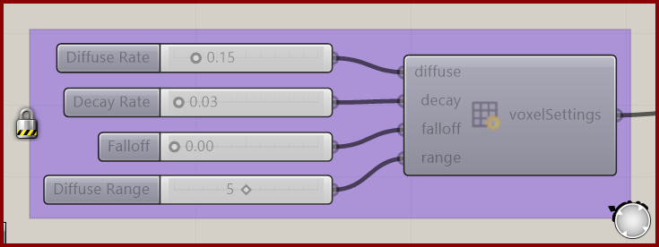

# Voxel Settings Slime

Control how the slime signal spreads and fades.

**Location:** Nuclei4 → Environment

*Captured from 01_Slime Intro.gh, preserving its component position and connected controls. Example values can differ from the fresh-component defaults below.*

## Use it

Connect the settings to the solver. Diffuse Rate, Decay Rate, Falloff, and Diffuse Range act together. The saved Slime Intro values differ from fresh-component defaults; use the example table when reproducing that definition.

## Inputs

| Input | Data | Default | Purpose |
| --- | --- | --- | --- |
| **Diffuse Rate** (`diffuse`) | Number; item | 0.1 | The rate of diffusion of the deposited values |
| **Decay Rate** (`decay`) | Number; item | 0.03 | The rate of decay of the deposited values |
| **Falloff** (`falloff`) | Number; item | 0 | The rate at which the diffusion is spread around the nearby voxels. VALUES FROM 0 TO 1 |
| **Diffuse Range** (`range`) | Integer; item | 1 | The range of diffusion of the deposited values |

Defaults describe a newly placed component. A saved definition can store other values on an unconnected input.

## Outputs

| Output | Data | Purpose |
| --- | --- | --- |
| **Voxel Settings** (`voxelSettings`) | Text; list | Settings For How The Environment and Data Is Interpreted |

## In the example collection

- [01_Slime Intro](../examples/01-slime-intro.md)
- [02_Gradient Map](../examples/02-gradient-map.md)
- [03_Minimizing Transport Networks 1](../examples/03-minimizing-transport-networks-1.md)

[Back to the component reference](README.md)
