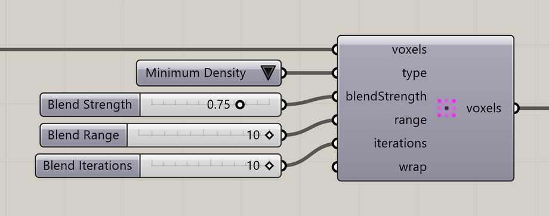

# Voxel Values Blend

Smooth a chosen property across nearby voxels.

**Location:** Nuclei4 → Environment



## Use it

Connect the mapped field, choose **Type**, and set Blend Strength, Blend Range, and Blend Iterations. Send the resulting **voxels** to the solver or preview.

This changes the input map. The solver’s diffusion and decay settings control how signals evolve during simulation.

## Inputs

Defaults describe a newly placed component.

| Input                                | Type / access       | Default         | Meaning                                        |
| ------------------------------------ | ------------------- | --------------- | ---------------------------------------------- |
| **Voxels** (`voxels`)                | Generic Data / item | Required        | Voxel field or selection to use.               |
| **Type** (`type`)                    | Integer / item      | 0               | Property to use; see **Type choices** below.   |
| **Blend Strength** (`blendStrength`) | Number / item       | Optional; 0.25  | Amount of smoothing, from 0 to 1.              |
| **Blend Range** (`range`)            | Integer / item      | Optional; 1     | Neighborhood range in voxel cells.             |
| **Blend Iterations** (`iterations`)  | Integer / item      | Optional; 1     | Number of smoothing passes.                    |
| **Wrap Blend** (`wrap`)              | Boolean / item      | Optional; False | Wrap the operation across opposite grid edges. |

### Type choices

| Value | Choice          |
| ----- | --------------- |
| 0     | Minimum Density |
| 1     | Maximum Density |
| 2     | Speed           |
| 3     | Sensor Distance |
| 4     | Sensor Angle    |
| 5     | Rotation Angle  |
| 6     | Slime Food      |
| 13    | Ant Food        |

## Output

| Output                       | Type / access       | Meaning                           |
| ---------------------------- | ------------------- | --------------------------------- |
| **Output Voxels** (`voxels`) | Generic Data / item | Selected or modified voxel field. |

## If something is wrong

| Symptom            | Action                                                         |
| ------------------ | -------------------------------------------------------------- |
| No visible change  | Check that Type matches the property you mapped and previewed. |
| Too much smoothing | Reduce Blend Strength or Blend Iterations.                     |

## Continue

[Attractor Curves 2](../examples/07-attractor-curves-2.md) · [Component reference](./)

<details>

<summary>Machine-readable reference (JSON)</summary>

[Download JSON](../reference/components/voxel-values-blend.json) · [JSON Schema](../reference/component.schema.json) · [How to read this JSON](../reference/reading-json.md)

Component metadata for scripts and AI tools. Indices are zero-based; defaults are display strings. [Full catalog](../reference/component-contracts.json).

```json
{
  "$schema": "../component.schema.json",
  "schemaVersion": 1,
  "pluginVersion": "4.1.0.0",
  "ghaSha256": "700C1620FD839DD1511E67359961787C8EC08EA595812B2EDED27828F96800C5",
  "component": {
    "name": "Voxel Values Blend",
    "category": "Nuclei4",
    "subcategory": " Environment",
    "componentGuid": "0a968da4-646c-41fb-b48c-7e1d6c258d94",
    "dotnetType": "Nuclei4.Voxel_Values_BlendAll",
    "inputs": [
      {
        "index": 0,
        "name": "Voxels",
        "nickname": "voxels",
        "ghType": "Generic Data",
        "access": "item",
        "optional": false,
        "mapping": "None",
        "defaults": []
      },
      {
        "index": 1,
        "name": "Type",
        "nickname": "type",
        "ghType": "Integer",
        "access": "item",
        "optional": false,
        "mapping": "None",
        "defaults": [
          "0"
        ]
      },
      {
        "index": 2,
        "name": "Blend Strength",
        "nickname": "blendStrength",
        "ghType": "Number",
        "access": "item",
        "optional": true,
        "mapping": "None",
        "defaults": [
          "0.25"
        ]
      },
      {
        "index": 3,
        "name": "Blend Range",
        "nickname": "range",
        "ghType": "Integer",
        "access": "item",
        "optional": true,
        "mapping": "None",
        "defaults": [
          "1"
        ]
      },
      {
        "index": 4,
        "name": "Blend Iterations",
        "nickname": "iterations",
        "ghType": "Integer",
        "access": "item",
        "optional": true,
        "mapping": "None",
        "defaults": [
          "1"
        ]
      },
      {
        "index": 5,
        "name": "Wrap Blend",
        "nickname": "wrap",
        "ghType": "Boolean",
        "access": "item",
        "optional": true,
        "mapping": "None",
        "defaults": [
          "False"
        ]
      }
    ],
    "outputs": [
      {
        "index": 0,
        "name": "Output Voxels",
        "nickname": "voxels",
        "ghType": "Generic Data",
        "access": "item",
        "optional": false,
        "mapping": "None",
        "defaults": []
      }
    ]
  }
}
```

</details>
