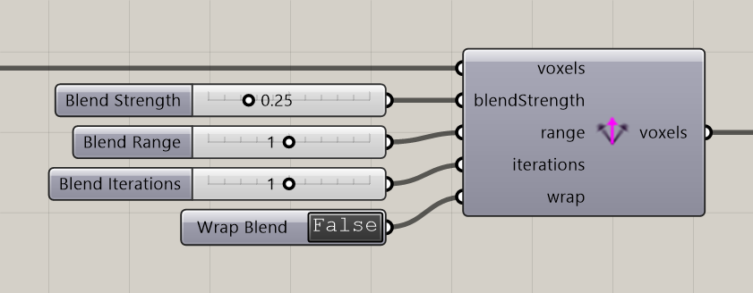

# Voxel Vectors Blend

Blend neighboring voxel vectors to smooth a mapped direction field.

**Location:** Nuclei4 → Environment

## Use it

Connect a field that already has vectors, then set blend strength, range, and iterations. Inspect the resulting directions before comparing simulations.

## Inputs

| Input | Data | Default | Purpose |
| --- | --- | --- | --- |
| **Voxels** (`voxels`) | Generic Data; item | Supply input | Connects to Voxel Constructor |
| **Blend Strength** (`blendStrength`) | Number; item | 0.25 | Strength of Blend |
| **Blend Range** (`range`) | Integer; item | 1 | The Range of Blend |
| **Blend Iterations** (`iterations`) | Integer; item | 1 | Blend Number of Iterations |
| **Wrap Blend** (`wrap`) | Boolean; item | False | Boundary conditions |

Defaults describe a newly placed component. A saved definition can store other values on an unconnected input.

## Outputs

| Output | Data | Purpose |
| --- | --- | --- |
| **Output Voxels** (`voxels`) | Generic Data; item | Output Voxels |

## Related workflow

Use the input and output roles above with the [voxel-field](../core-concepts/voxels-and-fields.md) or [particle](../core-concepts/particles-and-populations.md) workflow.

[Back to the component reference](README.md)
