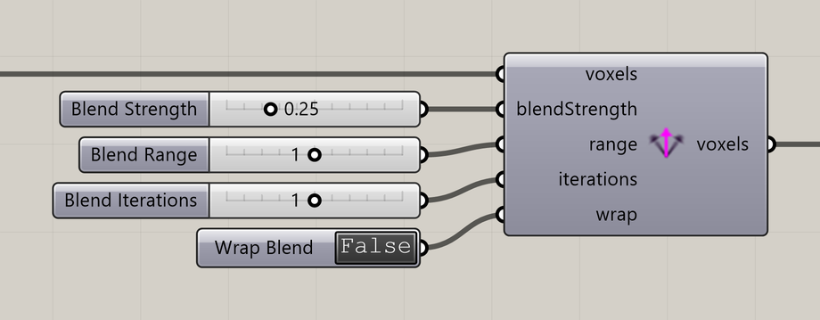

# Voxel Vectors Blend

Smooth directions across nearby voxels.

**Location:** Nuclei4 → Environment



## Use it

Connect a field that already contains vectors. Set Blend Strength, Blend Range, and Blend Iterations, then send the output field to the solver.

Use [Extract Voxel Vector](extract-voxel-vector.md) to inspect the result.

## Inputs

Defaults describe a newly placed component.

| Input                                | Type / access       | Default         | Meaning                                        |
| ------------------------------------ | ------------------- | --------------- | ---------------------------------------------- |
| **Voxels** (`voxels`)                | Generic Data / item | Required        | Voxel field or selection to use.               |
| **Blend Strength** (`blendStrength`) | Number / item       | Optional; 0.25  | Amount of smoothing, from 0 to 1.              |
| **Blend Range** (`range`)            | Integer / item      | Optional; 1     | Neighborhood range in voxel cells.             |
| **Blend Iterations** (`iterations`)  | Integer / item      | Optional; 1     | Number of smoothing passes.                    |
| **Wrap Blend** (`wrap`)              | Boolean / item      | Optional; False | Wrap the operation across opposite grid edges. |

## Output

| Output                       | Type / access       | Meaning                           |
| ---------------------------- | ------------------- | --------------------------------- |
| **Output Voxels** (`voxels`) | Generic Data / item | Selected or modified voxel field. |

## If something is wrong

| Symptom                    | Action                                              |
| -------------------------- | --------------------------------------------------- |
| No change                  | Check that the input field contains mapped vectors. |
| Directions are too uniform | Reduce Blend Strength or Blend Iterations.          |

## Continue

[Component reference](./)

<details>

<summary>Machine-readable reference (JSON)</summary>

[Download JSON](../reference/components/voxel-vectors-blend.json) · [JSON Schema](../reference/component.schema.json) · [How to read this JSON](../reference/reading-json.md)

Component metadata for scripts and AI tools. Indices are zero-based; defaults are display strings. [Full catalog](../reference/component-contracts.json).

```json
{
  "$schema": "../component.schema.json",
  "schemaVersion": 1,
  "pluginVersion": "4.1.0.0",
  "ghaSha256": "700C1620FD839DD1511E67359961787C8EC08EA595812B2EDED27828F96800C5",
  "component": {
    "name": "Voxel Vectors Blend",
    "category": "Nuclei4",
    "subcategory": " Environment",
    "componentGuid": "ee2dadbd-e610-457d-8a08-e603062c4a45",
    "dotnetType": "Nuclei4.Voxel_Vectors_BlendAll",
    "inputs": [
      {
        "index": 0,
        "name": "Voxels",
        "nickname": "voxels",
        "ghType": "Generic Data",
        "access": "item",
        "optional": false,
        "mapping": "None",
        "defaults": []
      },
      {
        "index": 1,
        "name": "Blend Strength",
        "nickname": "blendStrength",
        "ghType": "Number",
        "access": "item",
        "optional": true,
        "mapping": "None",
        "defaults": [
          "0.25"
        ]
      },
      {
        "index": 2,
        "name": "Blend Range",
        "nickname": "range",
        "ghType": "Integer",
        "access": "item",
        "optional": true,
        "mapping": "None",
        "defaults": [
          "1"
        ]
      },
      {
        "index": 3,
        "name": "Blend Iterations",
        "nickname": "iterations",
        "ghType": "Integer",
        "access": "item",
        "optional": true,
        "mapping": "None",
        "defaults": [
          "1"
        ]
      },
      {
        "index": 4,
        "name": "Wrap Blend",
        "nickname": "wrap",
        "ghType": "Boolean",
        "access": "item",
        "optional": true,
        "mapping": "None",
        "defaults": [
          "False"
        ]
      }
    ],
    "outputs": [
      {
        "index": 0,
        "name": "Output Voxels",
        "nickname": "voxels",
        "ghType": "Generic Data",
        "access": "item",
        "optional": false,
        "mapping": "None",
        "defaults": []
      }
    ]
  }
}
```

</details>
