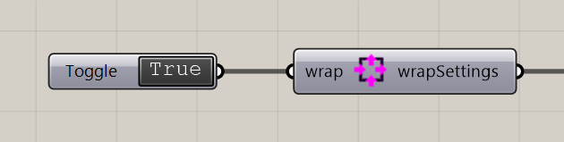

# Voxel Wrap Settings

Choose whether particles wrap around the field boundaries.

**Location:** Nuclei4 → Environment



## Use it

Connect **wrapSettings** to the solver’s **settings** input. With Wrap True, movement crossing one edge continues at the opposite edge. With Wrap False, boundaries reflect movement.

## Inputs

Defaults describe a newly placed component.

| Input | Type / access | Default | Meaning |
| --- | --- | --- | --- |
| **Wrap** (`wrap`) | Boolean / item | Optional; False | True wraps movement across edges; False uses reflective boundaries. |

## Output

| Output | Type / access | Meaning |
| --- | --- | --- |
| **Wrap Settings** (`wrapSettings`) | Text / list | Boundary settings for the solver. |

## If something is wrong

| Symptom | Action |
| --- | --- |
| Unexpected movement at the edge | Check Wrap and reset after changing it. |

## Continue

[Gradient Map](../examples/02-gradient-map.md) · [City Map](../examples/05-city-map.md) · [City Map — alternate definition](../examples/05-city-map2.md) · [Component reference](README.md)

<details>
<summary>Machine-readable reference (JSON)</summary>

[Download JSON](../reference/components/voxel-wrap-settings.json) · [JSON Schema](../reference/component.schema.json) · [How to read this JSON](../reference/reading-json.md)

Component metadata for scripts and AI tools. Indices are zero-based; defaults are display strings. [Full catalog](../reference/component-contracts.json).

```json
{
  "$schema": "../component.schema.json",
  "schemaVersion": 1,
  "pluginVersion": "4.1.0.0",
  "ghaSha256": "700C1620FD839DD1511E67359961787C8EC08EA595812B2EDED27828F96800C5",
  "component": {
    "name": "Voxel Wrap Settings",
    "category": "Nuclei4",
    "subcategory": " Environment",
    "componentGuid": "43b61a51-6086-4cea-98f9-e482a7b6d57f",
    "dotnetType": "Nuclei4.Voxel_Settings_Wrap",
    "inputs": [
      {
        "index": 0,
        "name": "Wrap",
        "nickname": "wrap",
        "ghType": "Boolean",
        "access": "item",
        "optional": true,
        "mapping": "None",
        "defaults": [
          "False"
        ]
      }
    ],
    "outputs": [
      {
        "index": 0,
        "name": "Wrap Settings",
        "nickname": "wrapSettings",
        "ghType": "Text",
        "access": "list",
        "optional": false,
        "mapping": "None",
        "defaults": []
      }
    ]
  }
}
```

</details>
