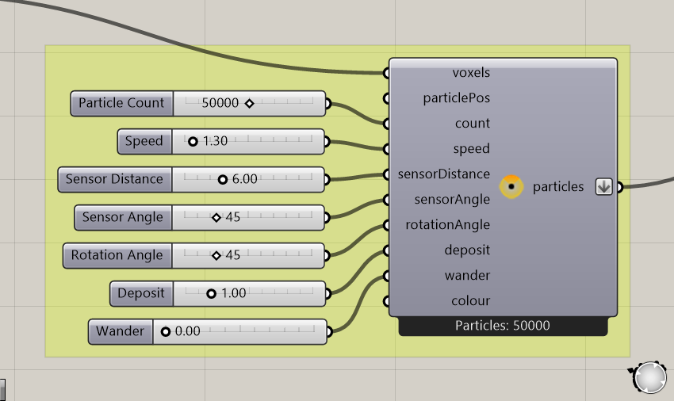

# Particles and populations

A particle is a moving agent. A **particle group** collects agents that share behavior settings, such as speed, sensor distance, deposit, and color.

## Create a group

Use **Construct Slime Particles** or **Construct Ant Particles**. Connect the voxel field, then supply either initial positions or a positive particle count for generated positions. An unconnected count starts at zero.

The constructor defines starting conditions. The solver's **particles** output carries the evolving simulation. Connect previews and particle extractors to that output.

## What particles sense

Sensor Distance controls how far ahead particles sample. Sensor Angle controls the spread of their sensing directions. Rotation Angle controls their steering response. Changing any one can alter the emerging pattern; compare one setting at a time.

**Deposit** sets the signal added after a successful move into another voxel. **Wander** introduces random changes of direction. Slime and ants interpret their environments differently; read [Slime behavior](slime-behavior.md) and [Ant behavior](ant-behavior.md) for the full loops.

## Multiple groups

Several particle constructors can feed the same solver. Keep their shared voxel environment consistent. Different colors help you identify groups in previews, while different sensing and movement settings let you compare behaviors within one field.

## Population changes

Division, death, and population settings are separate controls. Division and death use local conditions, while population settings include population bounds and random division/death controls. Feed their settings outputs to the solver along with the environment settings.

A larger starting count is not always a better result. V4 enforces exclusive voxel occupancy, and crowding affects movement. Begin with the example's values, then change the population while keeping the environment fixed.

## Particle trails and deposited signals

A particle trail is its recent movement history. The deposited field is shared environmental data. Trail Size changes the visible history; diffusion and decay change the shared signal. They serve different purposes and have separate settings.

Pause before extracting large numbers of points or trails. Geometry extraction brings data into ordinary Grasshopper outputs and can add work beyond the simulation itself.
