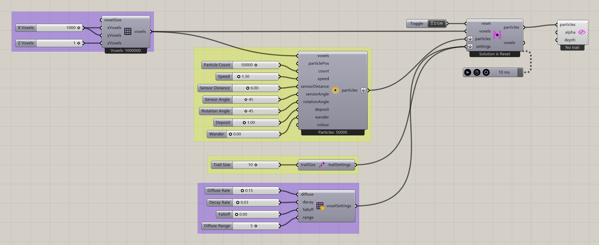
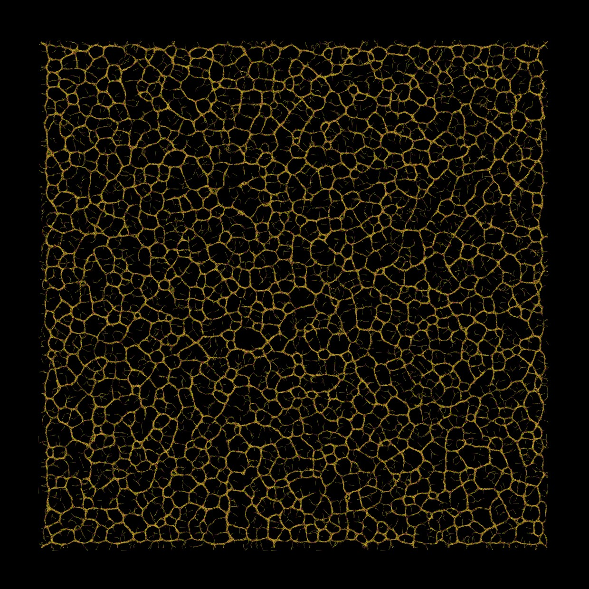

# Slime Intro

Follow a complete slime setup from a flat field to a visible particle network.

[Download 01_Slime Intro.gh](files/01-slime-intro.gh)

*The saved definition, with its layout, groups, and values preserved. Group descriptions are hidden for clarity. The capture is a canvas reference, not a newly simulated result.*

## Follow the definition

Start with the [first slime simulation walkthrough](../getting-started/first-slime-simulation.md), which explains each saved group in detail.

## Components to inspect

- [Construct Voxels](../components/construct-voxels.md)
- [Nuclei4 Solver GPU](../components/nuclei4-solver-gpu.md)
- [Construct Slime Particles](../components/construct-slime-particles.md)
- [Voxel Settings Slime](../components/voxel-settings-slime.md)
- [Particle Trail Preview](../components/particle-trail-preview.md)
- [Particle Trail Settings](../components/particle-trail-settings.md)

## Saved controls

These are directly connected slider and value-list settings read from this file. Other inputs may come from geometry, expressions, or values stored on the component. Repeated rows refer to separate instances.

| Component | Input | Saved control |
| --- | --- | --- |
| Construct Voxels | X Voxels | 1000 |
| Construct Voxels | Y Voxels | 1000 |
| Construct Voxels | Z Voxels | 1 |
| Nuclei4 Solver GPU | Reset | True |
| Construct Slime Particles | Particle Count | 50000 |
| Construct Slime Particles | Speed | 1.3 |
| Construct Slime Particles | Sensor Distance | 6 |
| Construct Slime Particles | Sensor Angle | 45 |
| Construct Slime Particles | Rotation Angle | 45 |
| Construct Slime Particles | Deposit | 1 |
| Construct Slime Particles | Wander | 0 |
| Voxel Settings Slime | Diffuse Rate | 0.15 |
| Voxel Settings Slime | Decay Rate | 0.03 |
| Voxel Settings Slime | Falloff | 0 |
| Voxel Settings Slime | Diffuse Range | 5 |
| Particle Trail Settings | Trail Size | 10 |

## Run the example

Open it in Rhino 9 with Nuclei V4, pause the existing Trigger, and inspect the mapped field. Reset once with True, return reset to False, and start the Trigger. Pause before editing several inputs or extracting a large result.

## Try a comparison

Compare Sensor Distance while keeping the other sliders fixed. Look for changes in the organization of local paths.

## Example result

*Original result image supplied with this example. Your result depends on initial conditions and simulation duration.*

[Back to examples](README.md)
