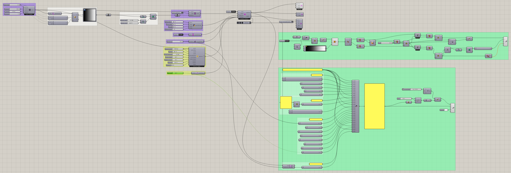
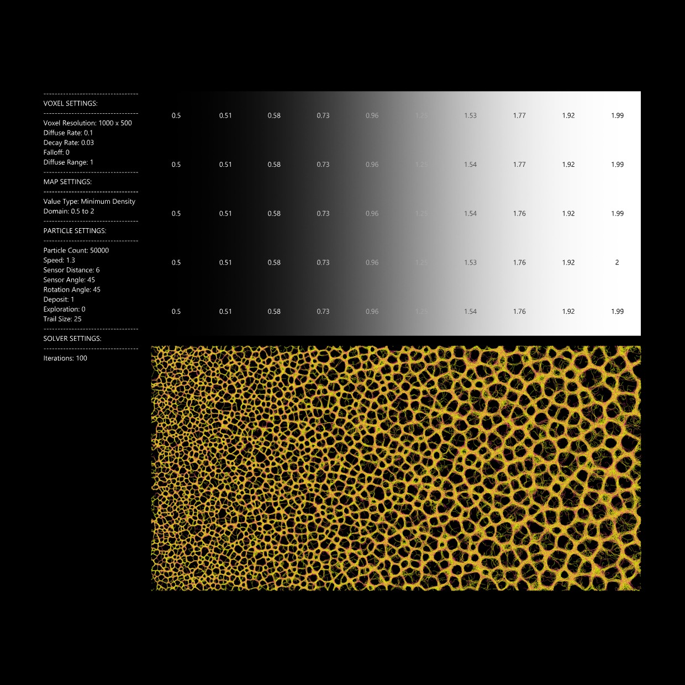

# Gradient Map

Vary sensing across the environment rather than giving every location the same conditions.

[Download 02_Gradient Map.gh](files/02-gradient-map.gh)

*The saved definition, with its layout, groups, and values preserved. Group descriptions are hidden for clarity. The capture is a canvas reference, not a newly simulated result.*

## Follow the definition

Follow the voxel positions through the remapping chain into **Define Voxel Values**. The saved Type is **Sensor Distance**. Inspect the mapped field before comparing particle behavior across it.

## Components to inspect

- [Construct Voxels](../components/construct-voxels.md)
- [Extract Voxel Positions](../components/extract-voxel-positions.md)
- [Define Voxel Values](../components/define-voxel-values.md)
- [Voxel Wrap Settings](../components/voxel-wrap-settings.md)
- [Nuclei4 Solver Iterations](../components/nuclei4-solver-iterations.md)
- [Particle Trail Settings](../components/particle-trail-settings.md)
- [Nuclei4 Solver GPU](../components/nuclei4-solver-gpu.md)
- [Particle Preview](../components/particle-preview.md)
- [Voxel Preview](../components/voxel-preview.md)
- [Voxel Settings Slime](../components/voxel-settings-slime.md)
- [Construct Slime Particles](../components/construct-slime-particles.md)
- [Particle Trail Preview](../components/particle-trail-preview.md)

## Saved controls

These are directly connected slider and value-list settings read from this file. Other inputs may come from geometry, expressions, or values stored on the component. Repeated rows refer to separate instances.

| Component | Input | Saved control |
| --- | --- | --- |
| Construct Voxels | Voxel Size | 1 |
| Construct Voxels | X Voxels | 1000 |
| Construct Voxels | Y Voxels | 500 |
| Construct Voxels | Z Voxels | 1 |
| Define Voxel Values | Type | Sensor Distance |
| Voxel Wrap Settings | Wrap | True |
| Nuclei4 Solver Iterations | Iterations | 100 |
| Particle Trail Settings | Trail Size | 25 |
| Nuclei4 Solver GPU | Reset | True |
| Voxel Preview | Type | Slime Chemoattractants |
| Voxel Settings Slime | Diffuse Rate | 0.1 |
| Voxel Settings Slime | Decay Rate | 0.03 |
| Voxel Settings Slime | Falloff | 0 |
| Voxel Settings Slime | Diffuse Range | 1 |
| Construct Slime Particles | Particle Count | 50000 |
| Construct Slime Particles | Speed | 1.3 |
| Construct Slime Particles | Sensor Distance | 6 |
| Construct Slime Particles | Sensor Angle | 45 |
| Construct Slime Particles | Rotation Angle | 45 |
| Construct Slime Particles | Deposit | 1 |
| Construct Slime Particles | Wander | 0 |

## Run the example

Open it in Rhino 9 with Nuclei V4, pause the existing Trigger, and inspect the mapped field. Reset once with True, return reset to False, and start the Trigger. Pause before editing several inputs or extracting a large result.

This definition contains saved script components. If Rhino reports a script error, inspect that component’s message before interpreting the simulation output.

## Try a comparison

Change the remapped range while retaining its spatial ordering. Compare how particles organize in different regions of the field.

## Example result

*Original result image supplied with this example. Your result depends on initial conditions and simulation duration.*

[Back to examples](README.md)
