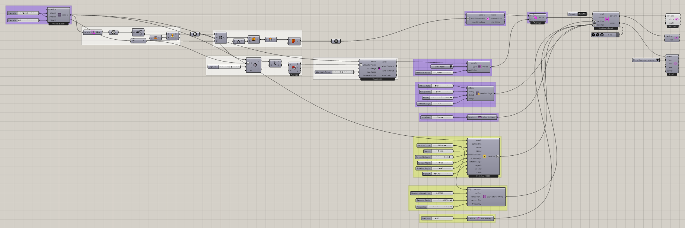
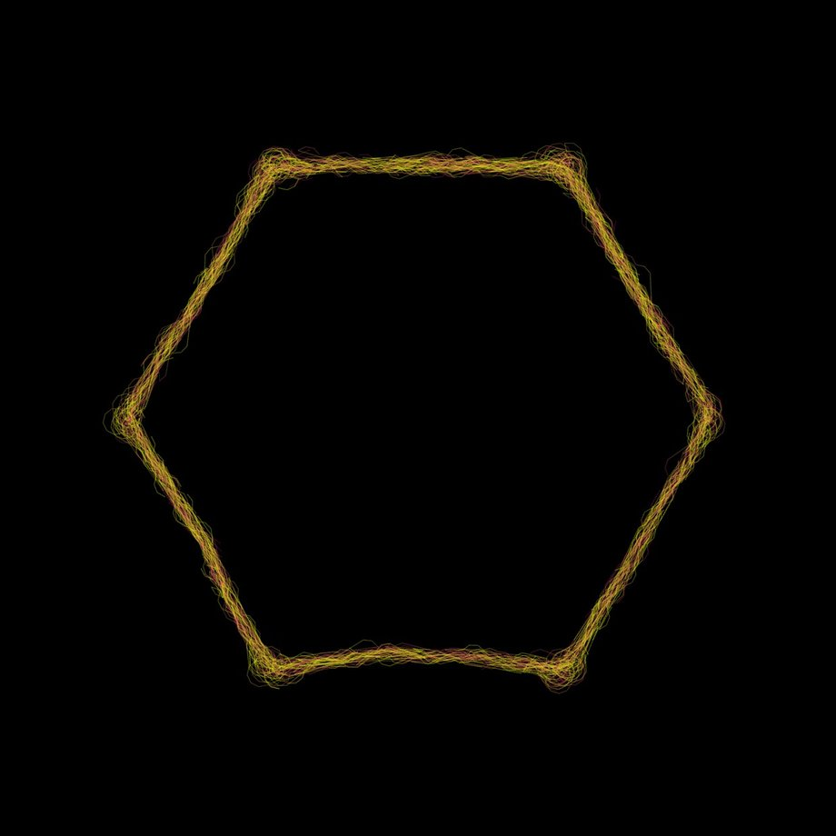

# Minimizing Transport Networks 1

Explore slime paths around selected food regions in a bounded environment.

[Download 03_Minimizing Transport Networks 1.gh](files/03-minimizing-transport-networks-1.gh)

## Follow the definition

The definition combines point-attractor and mesh-inclusion selections with **Voxel Selection Union**. **Define Voxel Values** assigns **Slime Food** with a saved multiplier of 2. Follow the resulting field into the solver.

## Components to inspect

- [Particle Population Settings](../components/particle-population-settings.md)
- [Voxel Preview](../components/voxel-preview.md)
- [Define Voxel Values](../components/define-voxel-values.md)
- [Particle Preview](../components/particle-preview.md)
- [Nuclei4 Solver GPU](../components/nuclei4-solver-gpu.md)
- [Voxel Selection Union](../components/voxel-selection-union.md)
- [Voxel Inclusion in Mesh](../components/voxel-inclusion-in-mesh.md)
- [Point Attractor for Voxels](../components/point-attractor-for-voxels.md)
- [Extract Voxel Bounding Box](../components/extract-voxel-bounding-box.md)
- [Construct Voxels](../components/construct-voxels.md)
- [Voxel Settings Slime](../components/voxel-settings-slime.md)
- [Construct Slime Particles](../components/construct-slime-particles.md)
- [Nuclei4 Solver Iterations](../components/nuclei4-solver-iterations.md)
- [Particle Trail Preview](../components/particle-trail-preview.md)
- [Particle Trail Settings](../components/particle-trail-settings.md)

## Saved controls

These are directly connected slider and value-list settings read from this file. Other inputs may come from geometry, expressions, or values stored on the component. Repeated rows refer to separate instances.

| Component | Input | Saved control |
| --- | --- | --- |
| Particle Population Settings | Minimum Population | 20000 |
| Particle Population Settings | Maximum Population | 20000 |
| Particle Population Settings | Random Death | 0.025 |
| Particle Population Settings | Frequency | 1 |
| Voxel Preview | Type | Slime Chemoattractants |
| Define Voxel Values | Type | Slime Food |
| Define Voxel Values | Multiplier Value | 2 |
| Nuclei4 Solver GPU | Reset | True |
| Point Attractor for Voxels | Maximum Range | 5 |
| Construct Voxels | X Voxels | 250 |
| Construct Voxels | Y Voxels | 250 |
| Construct Voxels | Z Voxels | 1 |
| Voxel Settings Slime | Diffuse Rate | 0.15 |
| Voxel Settings Slime | Decay Rate | 0.01 |
| Voxel Settings Slime | Falloff | 1 |
| Voxel Settings Slime | Diffuse Range | 3 |
| Construct Slime Particles | Particle Count | 20000 |
| Construct Slime Particles | Speed | 3 |
| Construct Slime Particles | Sensor Distance | 9 |
| Construct Slime Particles | Sensor Angle | 45 |
| Construct Slime Particles | Rotation Angle | 45 |
| Construct Slime Particles | Deposit | 1.1 |
| Nuclei4 Solver Iterations | Iterations | 500 |
| Particle Trail Settings | Trail Size | 15 |

## Run the example

Open it in Rhino 9 with Nuclei V4, pause the existing Trigger, and inspect the mapped field. Reset once with True, return reset to False, and start the Trigger. Pause before editing several inputs or extracting a large result.

## Try a comparison

Compare food strength while keeping the source geometry fixed. Observe which connections persist as the simulation evolves; this is an emergent network study, not a guaranteed shortest-path solver.

## Example result

[Back to examples](README.md)
