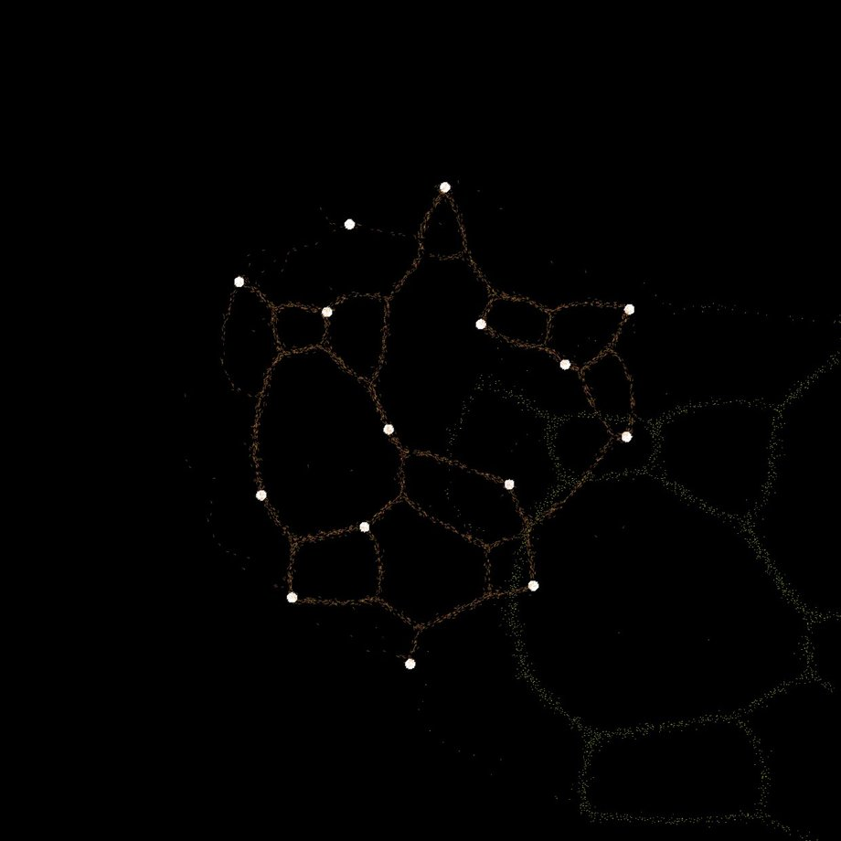
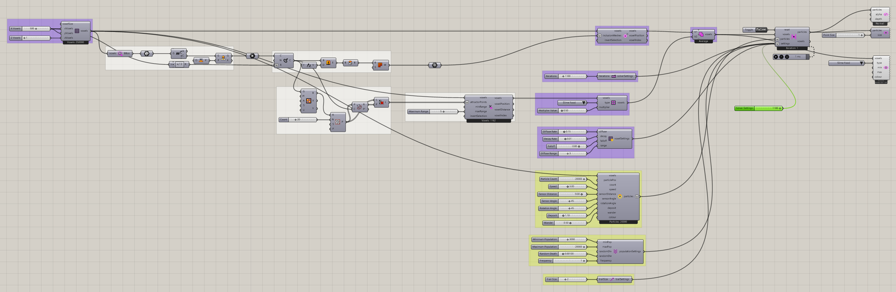

# Minimizing Transport Networks 2

Explore a second arrangement of food regions and the networks that emerge between them.

[Download 04_Minimizing Transport Networks 2.gh](files/04-minimizing-transport-networks-2.gh)

## Follow the definition

This definition uses a point-population and region-filtering chain before its attractor mapping. Its saved Slime Food multiplier is 0.5. Compare the mapped sources with the first transport example before running.

Components used

- [Particle Population Settings](../components/particle-population-settings.md)
- [Voxel Preview](../components/voxel-preview.md)
- [Define Voxel Values](../components/define-voxel-values.md)
- [Particle Preview](../components/particle-preview.md)
- [Nuclei4 Solver GPU](../components/nuclei4-solver-gpu.md)
- [Voxel Selection Union](../components/voxel-selection-union.md)
- [Voxel Inclusion in Mesh](../components/voxel-inclusion-in-mesh.md)
- [Point Attractor for Voxels](../components/point-attractor-for-voxels.md)
- [Extract Voxel Bounding Box](../components/extract-voxel-bounding-box.md)
- [Construct Voxels](../components/construct-voxels.md)
- [Construct Slime Particles](../components/construct-slime-particles.md)
- [Voxel Settings Slime](../components/voxel-settings-slime.md)
- [Particle Trail Preview](../components/particle-trail-preview.md)
- [Particle Trail Settings](../components/particle-trail-settings.md)
- [Nuclei4 Solver Iterations](../components/nuclei4-solver-iterations.md)

Saved controls

Slider and value-list settings saved in this definition. Repeated rows belong to different component instances.

| Component | Input | Saved control |
| --- | --- | --- |
| Particle Population Settings | Minimum Population | 3000 |
| Particle Population Settings | Maximum Population | 20000 |
| Particle Population Settings | Random Death | 0.001 |
| Particle Population Settings | Frequency | 1 |
| Voxel Preview | Type | Slime Food |
| Define Voxel Values | Type | Slime Food |
| Define Voxel Values | Multiplier Value | 0.5 |
| Particle Preview | Point Size | 1 |
| Nuclei4 Solver GPU | Reset | False |
| Nuclei4 Solver GPU | Solver Settings | 1100 |
| Point Attractor for Voxels | Maximum Range | 5 |
| Construct Voxels | X Voxels | 500 |
| Construct Voxels | Y Voxels | 500 |
| Construct Voxels | Z Voxels | 1 |
| Construct Slime Particles | Particle Count | 20000 |
| Construct Slime Particles | Speed | 3 |
| Construct Slime Particles | Sensor Distance | 9 |
| Construct Slime Particles | Sensor Angle | 45 |
| Construct Slime Particles | Rotation Angle | 45 |
| Construct Slime Particles | Deposit | 1.1 |
| Construct Slime Particles | Wander | 0.5 |
| Voxel Settings Slime | Diffuse Rate | 0.15 |
| Voxel Settings Slime | Decay Rate | 0.01 |
| Voxel Settings Slime | Falloff | 0.8 |
| Voxel Settings Slime | Diffuse Range | 3 |
| Particle Trail Settings | Trail Size | 2 |
| Nuclei4 Solver Iterations | Iterations | 1100 |

## Run the example

Open it in Rhino 9 with Nuclei V4, pause the existing Trigger, and inspect the mapped field. Reset once with True, return reset to False, and start the Trigger. Pause before editing several inputs or extracting a large result.

## Try a comparison

Change the point arrangement while keeping particle behavior constant. Compare the resulting connectivity without treating a visual network as a proven optimum.

## Example result

[Back to examples](README.md)
