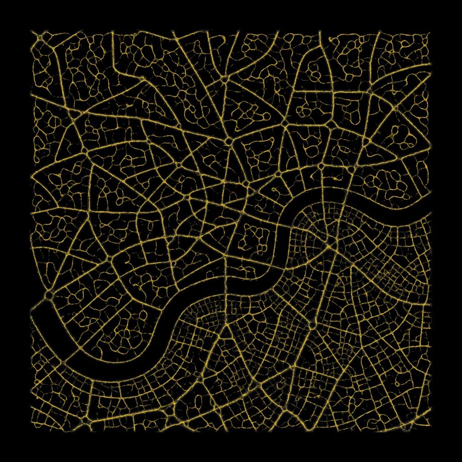
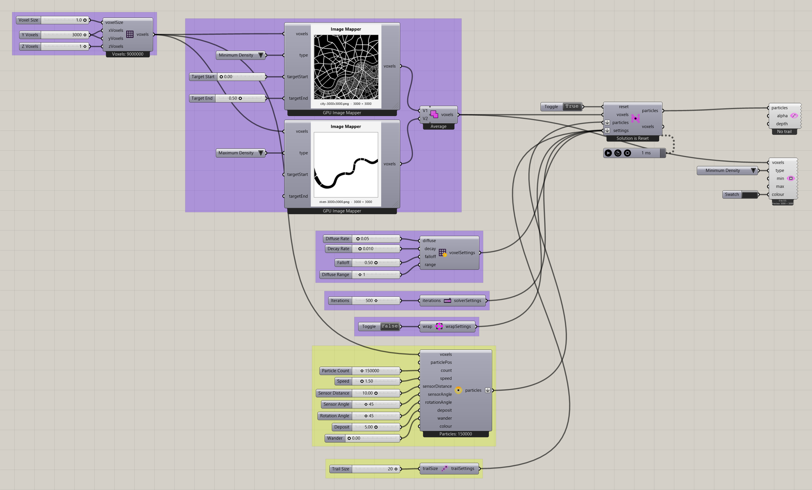

# City Map

Use image brightness to shape a planar simulation environment.

[Download 05_City Map.gh](files/05-city-map.gh)

## Follow the definition

Locate [Image Mapper for Voxels](../components/image-mapper-for-voxels.md) and inspect its saved image and Type. Follow the mapper outputs and union into the solver. The original grid is 3000 × 3000 × 1, so pause the Trigger while inspecting the inputs.

Components used

- [Construct Voxels](../components/construct-voxels.md)
- [Particle Trail Settings](../components/particle-trail-settings.md)
- [Nuclei4 Solver GPU](../components/nuclei4-solver-gpu.md)
- [Voxel Wrap Settings](../components/voxel-wrap-settings.md)
- [Voxel Settings Slime](../components/voxel-settings-slime.md)
- [Voxel Preview](../components/voxel-preview.md)
- [Construct Slime Particles](../components/construct-slime-particles.md)
- [Particle Trail Preview](../components/particle-trail-preview.md)
- [Nuclei4 Solver Iterations](../components/nuclei4-solver-iterations.md)
- [Image Mapper for Voxels](../components/image-mapper-for-voxels.md)
- [Voxel Selection Union](../components/voxel-selection-union.md)

Saved controls

Slider and value-list settings saved in this definition. Repeated rows belong to different component instances.

| Component | Input | Saved control |
| --- | --- | --- |
| Construct Voxels | Voxel Size | 1 |
| Construct Voxels | X Voxels | 3000 |
| Construct Voxels | Y Voxels | 3000 |
| Construct Voxels | Z Voxels | 1 |
| Particle Trail Settings | Trail Size | 20 |
| Nuclei4 Solver GPU | Reset | True |
| Voxel Wrap Settings | Wrap | False |
| Voxel Settings Slime | Diffuse Rate | 0.05 |
| Voxel Settings Slime | Decay Rate | 0.01 |
| Voxel Settings Slime | Falloff | 0.5 |
| Voxel Settings Slime | Diffuse Range | 1 |
| Voxel Preview | Type | Minimum Density |
| Construct Slime Particles | Particle Count | 150000 |
| Construct Slime Particles | Speed | 1.5 |
| Construct Slime Particles | Sensor Distance | 10 |
| Construct Slime Particles | Sensor Angle | 45 |
| Construct Slime Particles | Rotation Angle | 45 |
| Construct Slime Particles | Deposit | 5 |
| Construct Slime Particles | Wander | 0 |
| Nuclei4 Solver Iterations | Iterations | 500 |
| Image Mapper for Voxels | Type | Minimum Density |
| Image Mapper for Voxels | Target Start | 0 |
| Image Mapper for Voxels | Target End | 0.5 |
| Image Mapper for Voxels | Type | Maximum Density |

## Run the example

Open it in Rhino 9 with Nuclei V4, pause the existing Trigger, and inspect the mapped field. Reset once with True, return reset to False, and start the Trigger. Pause before editing several inputs or extracting a large result.

## Try a comparison

Compare the mapper target range first. Keep the source image fixed so the change comes from remapping, then test another image in a copy.

## Example result

[Back to examples](README.md)
