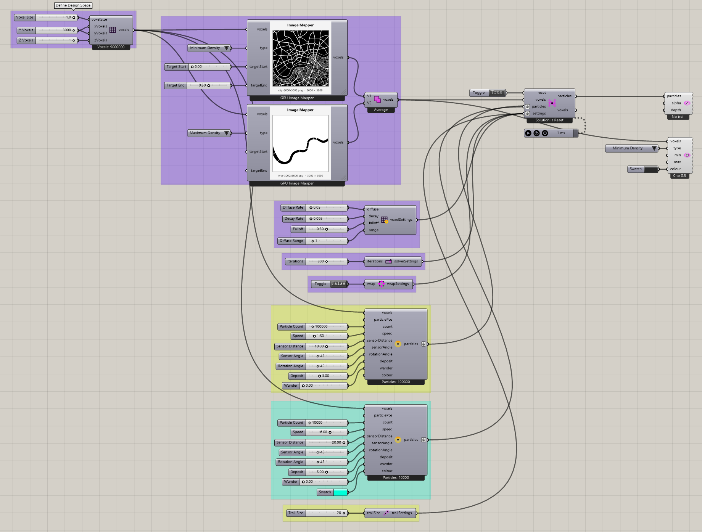

# City Map — alternate definition

Inspect the alternate saved city-map definition using image-based voxel mapping.

[Download 05_City Map2.gh](files/05-city-map2.gh)

## Follow the definition

This is a separate supplied file. Compare its mapped values and wiring with City Map rather than assuming the two produce identical results. Both use the image mapper and a planar 3000 × 3000 field.

## Components to inspect

- [Construct Voxels](../components/construct-voxels.md)
- [Particle Trail Settings](../components/particle-trail-settings.md)
- [Nuclei4 Solver GPU](../components/nuclei4-solver-gpu.md)
- [Voxel Wrap Settings](../components/voxel-wrap-settings.md)
- [Voxel Settings Slime](../components/voxel-settings-slime.md)
- [Voxel Preview](../components/voxel-preview.md)
- [Construct Slime Particles](../components/construct-slime-particles.md)
- [Particle Trail Preview](../components/particle-trail-preview.md)
- [Nuclei4 Solver Iterations](../components/nuclei4-solver-iterations.md)
- [Image Mapper for Voxels](../components/image-mapper-for-voxels.md)
- [Voxel Selection Union](../components/voxel-selection-union.md)

## Saved controls

These are directly connected slider and value-list settings read from this file. Other inputs may come from geometry, expressions, or values stored on the component. Repeated rows refer to separate instances.

| Component | Input | Saved control |
| --- | --- | --- |
| Construct Voxels | Voxel Size | 1 |
| Construct Voxels | X Voxels | 3000 |
| Construct Voxels | Y Voxels | 3000 |
| Construct Voxels | Z Voxels | 1 |
| Particle Trail Settings | Trail Size | 20 |
| Nuclei4 Solver GPU | Reset | True |
| Voxel Wrap Settings | Wrap | False |
| Voxel Settings Slime | Diffuse Rate | 0.05 |
| Voxel Settings Slime | Decay Rate | 0.005 |
| Voxel Settings Slime | Falloff | 0.5 |
| Voxel Settings Slime | Diffuse Range | 1 |
| Voxel Preview | Type | Minimum Density |
| Construct Slime Particles | Particle Count | 100000 |
| Construct Slime Particles | Speed | 1.5 |
| Construct Slime Particles | Sensor Distance | 10 |
| Construct Slime Particles | Sensor Angle | 45 |
| Construct Slime Particles | Rotation Angle | 45 |
| Construct Slime Particles | Deposit | 3 |
| Construct Slime Particles | Wander | 0 |
| Nuclei4 Solver Iterations | Iterations | 500 |
| Image Mapper for Voxels | Type | Minimum Density |
| Image Mapper for Voxels | Target Start | 0 |
| Image Mapper for Voxels | Target End | 0.5 |
| Image Mapper for Voxels | Type | Maximum Density |
| Construct Slime Particles | Particle Count | 10000 |
| Construct Slime Particles | Speed | 6 |
| Construct Slime Particles | Sensor Distance | 20 |
| Construct Slime Particles | Sensor Angle | 45 |
| Construct Slime Particles | Rotation Angle | 45 |
| Construct Slime Particles | Deposit | 5 |
| Construct Slime Particles | Wander | 0 |

## Run the example

Open it in Rhino 9 with Nuclei V4, pause the existing Trigger, and inspect the mapped field. Reset once with True, return reset to False, and start the Trigger. Pause before editing several inputs or extracting a large result.

## Try a comparison

Open the two files separately and compare their saved mapping controls. Change one range in a working copy and observe its effect.

[Back to examples](README.md)
