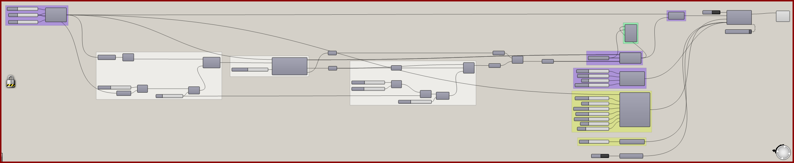

# Attractor Curves 1

Use curve-distance selections to organize local density conditions.

[Download 06_Attractor Curves 1.gh](files/06-attractor-curves-1.gh)

*The saved definition, with its layout and values preserved. The capture is a canvas reference, not a newly simulated result.*

## Follow the definition

The curve attractors feed remapping and **Define Voxel Values** components set to **Minimum Density**. Follow each branch through the union into the solver; the curves select where the map is applied.

## Components to inspect

- [Construct Voxels](../components/construct-voxels.md)
- [Curve Attractor for Voxels](../components/curve-attractor-for-voxels.md)
- [Extract Voxel Bounding Box](../components/extract-voxel-bounding-box.md)
- [Voxel Preview](../components/voxel-preview.md)
- [Define Voxel Values](../components/define-voxel-values.md)
- [Particle Trail Settings](../components/particle-trail-settings.md)
- [Voxel Selection Union](../components/voxel-selection-union.md)
- [Nuclei4 Solver GPU](../components/nuclei4-solver-gpu.md)
- [Voxel Settings Slime](../components/voxel-settings-slime.md)
- [Construct Slime Particles](../components/construct-slime-particles.md)
- [Particle Trail Preview](../components/particle-trail-preview.md)
- [Voxel Wrap Settings](../components/voxel-wrap-settings.md)

## Saved controls

These are directly connected slider and value-list settings read from this file. Other inputs may come from geometry, expressions, or values stored on the component. Repeated rows refer to separate instances.

| Component | Input | Saved control |
| --- | --- | --- |
| Construct Voxels | Voxel Size | 1 |
| Construct Voxels | X Voxels | 1000 |
| Construct Voxels | Y Voxels | 1000 |
| Construct Voxels | Z Voxels | 1 |
| Curve Attractor for Voxels | Maximum Range | 5 |
| Voxel Preview | Type | Minimum Density |
| Define Voxel Values | Type | Minimum Density |
| Define Voxel Values | Type | Minimum Density |
| Particle Trail Settings | Trail Size | 15 |
| Nuclei4 Solver GPU | Reset | True |
| Voxel Settings Slime | Diffuse Rate | 0.1 |
| Voxel Settings Slime | Decay Rate | 0.03 |
| Voxel Settings Slime | Falloff | 0.5 |
| Voxel Settings Slime | Diffuse Range | 1 |
| Construct Slime Particles | Particle Count | 30000 |
| Construct Slime Particles | Speed | 1.3 |
| Construct Slime Particles | Sensor Distance | 6 |
| Construct Slime Particles | Sensor Angle | 45 |
| Construct Slime Particles | Rotation Angle | 60 |
| Construct Slime Particles | Deposit | 2 |
| Construct Slime Particles | Wander | 0 |
| Voxel Wrap Settings | Wrap | True |

## Run the example

Open it in Rhino 9 with Nuclei V4, pause the existing Trigger, and inspect the mapped field. Reset once with True, return reset to False, and start the Trigger. Pause before editing several inputs or extracting a large result.

## Try a comparison

Change the attractor range or curve geometry separately. Inspect the voxel map before comparing the particle result.

## Example result

*Original result image supplied with this example. Your result depends on initial conditions and simulation duration.*

[Back to examples](README.md)
