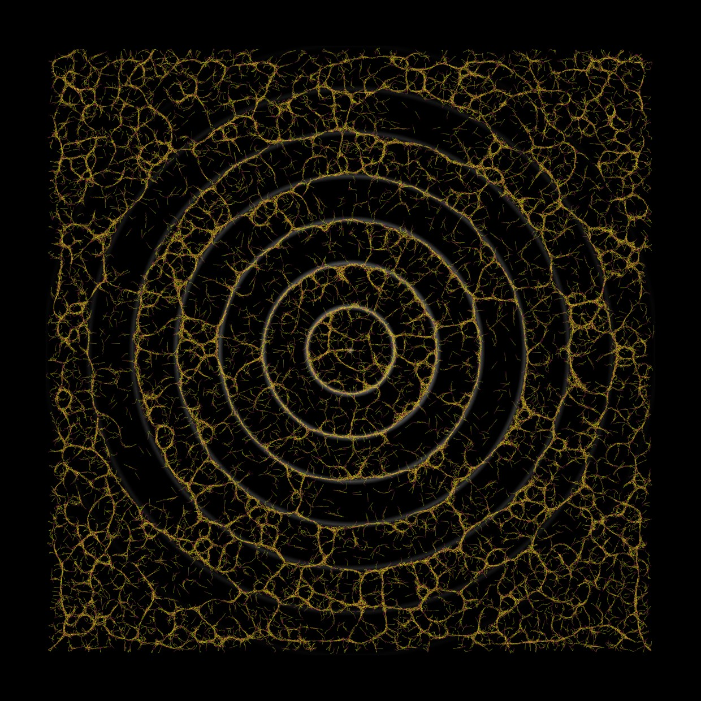
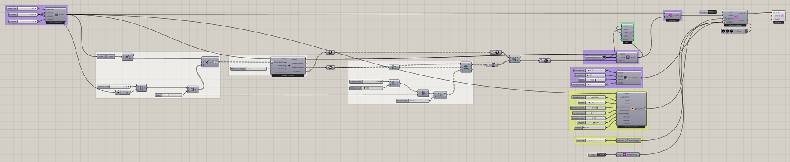

# Attractor Curves 1

Use curves to guide where a slime network develops. Curve attractors select voxels according to their distance from the supplied curves. The selected regions receive minimum chemoattractant density values, creating a persistent signal that draws particles toward parts of the environment shaped by that geometry.

The curves establish the attraction pattern, while particles add their own signal as they move. Watch how the trails respond to the mapped regions and develop connections around them. Use this example to explore how changing a curve or the selection distance changes the area of influence and the resulting particle network.



[Download 10_Attractor Curves 1.gh](files/06-attractor-curves-1.gh)



## Follow the definition

The curve attractors feed remapping and [Define Voxel Values](../components/define-voxel-values.md) components set to **Minimum Density**. Follow each branch through the union into the solver; the curves select where the map is applied.

<details>
<summary>Components used</summary>

- [Construct Voxels](../components/construct-voxels.md)
- [Curve Attractor for Voxels](../components/curve-attractor-for-voxels.md)
- [Extract Voxel Bounding Box](../components/extract-voxel-bounding-box.md)
- [Voxel Preview](../components/voxel-preview.md)
- [Define Voxel Values](../components/define-voxel-values.md)
- [Particle Trail Settings](../components/particle-trail-settings.md)
- [Voxel Selection Union](../components/voxel-selection-union.md)
- [Nuclei4 Solver GPU](../components/nuclei4-solver-gpu.md)
- [Voxel Settings Slime](../components/voxel-settings-slime.md)
- [Construct Slime Particles](../components/construct-slime-particles.md)
- [Particle Trail Preview](../components/particle-trail-preview.md)
- [Voxel Wrap Settings](../components/voxel-wrap-settings.md)

</details>

<details>
<summary>Saved controls</summary>

Slider and value-list settings saved in this definition. Repeated rows belong to different component instances.

| Component | Input | Saved control |
| --- | --- | --- |
| Construct Voxels | Voxel Size | 1 |
| Construct Voxels | X Voxels | 1000 |
| Construct Voxels | Y Voxels | 1000 |
| Construct Voxels | Z Voxels | 1 |
| Curve Attractor for Voxels | Maximum Range | 5 |
| Voxel Preview | Type | Minimum Density |
| Define Voxel Values | Type | Minimum Density |
| Define Voxel Values | Type | Minimum Density |
| Particle Trail Settings | Trail Size | 15 |
| Nuclei4 Solver GPU | Reset | True |
| Voxel Settings Slime | Diffuse Rate | 0.1 |
| Voxel Settings Slime | Decay Rate | 0.03 |
| Voxel Settings Slime | Falloff | 0.5 |
| Voxel Settings Slime | Diffuse Range | 1 |
| Construct Slime Particles | Particle Count | 30000 |
| Construct Slime Particles | Speed | 1.3 |
| Construct Slime Particles | Sensor Distance | 6 |
| Construct Slime Particles | Sensor Angle | 45 |
| Construct Slime Particles | Rotation Angle | 60 |
| Construct Slime Particles | Deposit | 2 |
| Construct Slime Particles | Wander | 0 |
| Voxel Wrap Settings | Wrap | True |

</details>

## Run the example

Open it in Rhino 9 with Nuclei V4, pause the existing Trigger, and inspect the mapped field. Reset once with True, return reset to False, and start the Trigger. Pause before editing several inputs or extracting a large result.

## Try a comparison

Change the attractor range or curve geometry separately. Inspect the voxel map before comparing the particle result.

## Example result


[Back to examples](README.md)

<details>
<summary>Grasshopper definition (JSON)</summary>

[Download JSON](data/06-attractor-curves-1.json) · [JSON Schema](../reference/definition.schema.json) · [How to read this JSON](../reference/reading-json.md)

This records the saved definition. Geometry and other binary payloads remain in the original `.gh` file.

```json
{
  "$schema": "../../reference/definition.schema.json",
  "schemaVersion": 1,
  "title": "Attractor Curves 1",
  "source": {"file":"../files/06-attractor-curves-1.gh","sha256":"b11d89fa09a2197b7949e07af30ebcc6841aea6705296eb247bc124e155c48c9","documentId":"81a09eac-6d40-4cfc-a471-227e24b1a80b"},
  "extraction": {"method":"GH_IO archive read without loading components or solving","coverage":"All saved top-level objects and Source wires; not an executable replacement for the .gh file","limitations":["Binary geometry and image payloads are omitted and identified by archive XML hashes.","External files and Rhino document geometry are not bundled. Inspect saved paths and references.","Runtime outputs, nested cluster internals and plugin-specific behavior are not reconstructed.","Saved library versions describe the archive, not a guarantee of compatibility with newer components."],"omittedBinaryPaths":[],"unresolvedGroupMembers":[{"groupId":"961bfa32-2f05-4948-b992-508b67c97721","memberId":"d8662514-0f1c-41e3-8b97-c2f2f3f3d514"},{"groupId":"961bfa32-2f05-4948-b992-508b67c97721","memberId":"5f28944f-454f-4a36-8bc8-2191eca8b34a"},{"groupId":"961bfa32-2f05-4948-b992-508b67c97721","memberId":"79d85415-b3f8-4319-97eb-38898064b036"},{"groupId":"961bfa32-2f05-4948-b992-508b67c97721","memberId":"2814556d-c60e-4bd2-b6b7-c2966871337a"},{"groupId":"961bfa32-2f05-4948-b992-508b67c97721","memberId":"a2206c5d-021a-4fcd-aadd-ac6eba0e9e07"},{"groupId":"961bfa32-2f05-4948-b992-508b67c97721","memberId":"d2aaba1d-bee9-44c4-994e-1f67c13042e3"},{"groupId":"961bfa32-2f05-4948-b992-508b67c97721","memberId":"7509dd07-8290-4156-b9d6-dcde5b12a070"},{"groupId":"961bfa32-2f05-4948-b992-508b67c97721","memberId":"491ea2c5-525d-4410-a7ac-2d4009cc753b"},{"groupId":"961bfa32-2f05-4948-b992-508b67c97721","memberId":"5baa64ff-f06a-4ad4-a77b-0e1ccba1d61d"},{"groupId":"961bfa32-2f05-4948-b992-508b67c97721","memberId":"3fb3769e-87dd-42c6-a443-e359caedd348"},{"groupId":"cd7bf4b2-11ae-48f1-88ab-d8875079263e","memberId":"7db02d1d-97a3-491f-ae12-fe6753ebcaa7"},{"groupId":"cd7bf4b2-11ae-48f1-88ab-d8875079263e","memberId":"a186c748-c06f-431a-9a49-228f7c98099c"},{"groupId":"cd7bf4b2-11ae-48f1-88ab-d8875079263e","memberId":"b17fd58a-6042-4107-9bd2-32cf639b802c"},{"groupId":"cd7bf4b2-11ae-48f1-88ab-d8875079263e","memberId":"403f9ed5-1f47-42da-820c-caf13676f324"},{"groupId":"cd7bf4b2-11ae-48f1-88ab-d8875079263e","memberId":"967a9f68-599f-47f2-9480-ec8cef2fa4c5"},{"groupId":"cd7bf4b2-11ae-48f1-88ab-d8875079263e","memberId":"957c8091-50d0-4bf4-88d4-9534acfae725"},{"groupId":"cd7bf4b2-11ae-48f1-88ab-d8875079263e","memberId":"b35559e1-3661-436d-98f4-12f724d9009d"},{"groupId":"cd7bf4b2-11ae-48f1-88ab-d8875079263e","memberId":"f8ef995f-11d7-4d1b-8278-31ce1bdbcb8a"},{"groupId":"cd7bf4b2-11ae-48f1-88ab-d8875079263e","memberId":"95eb1dbb-0019-4f05-b14c-b4886a9f2bad"},{"groupId":"cd7bf4b2-11ae-48f1-88ab-d8875079263e","memberId":"b59e8596-1324-4d46-86a2-bb2ee87abd7f"},{"groupId":"cd7bf4b2-11ae-48f1-88ab-d8875079263e","memberId":"508d7add-9c32-4173-9768-963abeee55f4"},{"groupId":"cd7bf4b2-11ae-48f1-88ab-d8875079263e","memberId":"de41bc6d-d739-43ed-bb71-f74d8fb4a23a"},{"groupId":"cd7bf4b2-11ae-48f1-88ab-d8875079263e","memberId":"9f6a1976-cc11-4539-a2c7-0d7fd3884890"},{"groupId":"cd7bf4b2-11ae-48f1-88ab-d8875079263e","memberId":"76109ee6-71e3-4ebd-a649-7e934c0f8b14"},{"groupId":"cd7bf4b2-11ae-48f1-88ab-d8875079263e","memberId":"9db308ce-f864-4606-9e1f-ff8333fefdba"},{"groupId":"cd7bf4b2-11ae-48f1-88ab-d8875079263e","memberId":"2c346ffa-2df4-4627-b751-9dbab8c6ee6b"},{"groupId":"cd7bf4b2-11ae-48f1-88ab-d8875079263e","memberId":"41476855-83a1-4326-a346-d59c1fe57979"},{"groupId":"cd7bf4b2-11ae-48f1-88ab-d8875079263e","memberId":"421fcfe9-2c0b-4d39-9720-8e2bd2e3a591"},{"groupId":"cd7bf4b2-11ae-48f1-88ab-d8875079263e","memberId":"69ee172d-9456-44f0-b40c-235998c6796f"},{"groupId":"cd7bf4b2-11ae-48f1-88ab-d8875079263e","memberId":"67f8004a-c78b-4e5a-aa1f-9bd63e612de1"},{"groupId":"cd7bf4b2-11ae-48f1-88ab-d8875079263e","memberId":"6b66a5fe-b452-4762-b050-f2ea44033d83"},{"groupId":"cd7bf4b2-11ae-48f1-88ab-d8875079263e","memberId":"62cfdb9c-aed5-47dd-bbea-516ba090c632"},{"groupId":"cd7bf4b2-11ae-48f1-88ab-d8875079263e","memberId":"d1ff9a55-3773-49cb-8065-72a322a7bdcd"},{"groupId":"cd7bf4b2-11ae-48f1-88ab-d8875079263e","memberId":"ce5a27fb-ceca-4cfc-a3b9-83a0cc60a045"},{"groupId":"cd7bf4b2-11ae-48f1-88ab-d8875079263e","memberId":"a883ccdc-2bb0-424b-8d9d-8d70bae73b6b"},{"groupId":"cd7bf4b2-11ae-48f1-88ab-d8875079263e","memberId":"0348db5e-a825-4ea0-9317-e5a9f0fbb9bd"},{"groupId":"2710e17b-3866-4fdf-b073-290a6a2bacc9","memberId":"892ef3bf-c4fc-4480-95c4-37f8bc5c0edc"},{"groupId":"2710e17b-3866-4fdf-b073-290a6a2bacc9","memberId":"0a3734ca-8c91-41d9-aa56-ea78228b38b8"},{"groupId":"2710e17b-3866-4fdf-b073-290a6a2bacc9","memberId":"b837f762-6744-4046-9adf-9d83ea46b6b1"},{"groupId":"2710e17b-3866-4fdf-b073-290a6a2bacc9","memberId":"01d8c06b-377e-42c4-b62d-31dd49eb9289"},{"groupId":"2710e17b-3866-4fdf-b073-290a6a2bacc9","memberId":"2175040c-7a59-4364-961c-b917fded89de"},{"groupId":"2710e17b-3866-4fdf-b073-290a6a2bacc9","memberId":"0fec45a1-da6f-4f8f-848f-c66d02c24e8b"},{"groupId":"2710e17b-3866-4fdf-b073-290a6a2bacc9","memberId":"bdd9d322-643c-46aa-b221-97f8f20290f1"},{"groupId":"2187f6d4-544d-4b90-a64d-29ff9533eceb","memberId":"c1e5a7bd-9597-4867-a4bd-a5ec1050acbc"},{"groupId":"2187f6d4-544d-4b90-a64d-29ff9533eceb","memberId":"5075d6f3-b5a1-47a8-905d-0cb4e813f5c1"},{"groupId":"2187f6d4-544d-4b90-a64d-29ff9533eceb","memberId":"b8243137-42ab-4f18-873f-54cd9d9b086c"},{"groupId":"2187f6d4-544d-4b90-a64d-29ff9533eceb","memberId":"890144b7-edf6-4edf-97e5-561eef4088ae"},{"groupId":"2187f6d4-544d-4b90-a64d-29ff9533eceb","memberId":"551ba1e4-2537-446b-8615-600effc3c09c"},{"groupId":"2187f6d4-544d-4b90-a64d-29ff9533eceb","memberId":"82afd9c8-dc05-4346-8dee-91abc272a85f"},{"groupId":"2187f6d4-544d-4b90-a64d-29ff9533eceb","memberId":"cb6e96ca-2d14-43b6-9c61-8b59ffdb5daf"},{"groupId":"2187f6d4-544d-4b90-a64d-29ff9533eceb","memberId":"f17e0640-9165-4102-854f-cf017f8ea62f"},{"groupId":"b202ee35-7fae-4e8f-ab6f-d5a077f9b7a6","memberId":"faac7721-db9c-468b-8906-6900e3eea207"},{"groupId":"b202ee35-7fae-4e8f-ab6f-d5a077f9b7a6","memberId":"379c7a7d-5e06-40ec-91d9-8b932958c467"},{"groupId":"b202ee35-7fae-4e8f-ab6f-d5a077f9b7a6","memberId":"3c34396b-f62a-4c86-92ff-92cd93c44497"},{"groupId":"b202ee35-7fae-4e8f-ab6f-d5a077f9b7a6","memberId":"2a78054a-4d37-4bdb-bb20-0e0b8ecd25cd"},{"groupId":"b202ee35-7fae-4e8f-ab6f-d5a077f9b7a6","memberId":"bbe45d08-d16e-49a6-938f-b37be39aba60"},{"groupId":"b202ee35-7fae-4e8f-ab6f-d5a077f9b7a6","memberId":"536c8725-400b-49ce-85df-e8438b07fe6f"},{"groupId":"b202ee35-7fae-4e8f-ab6f-d5a077f9b7a6","memberId":"8c155dba-3f20-4039-98c2-4c88af1b3aeb"},{"groupId":"b202ee35-7fae-4e8f-ab6f-d5a077f9b7a6","memberId":"b1a8adc9-fac8-4c3d-b029-6b0834fe66d4"},{"groupId":"46a32c07-fb98-420f-b71c-9419bdffafda","memberId":"84b64d3e-83d6-4c96-903d-e99e63c622b9"},{"groupId":"46a32c07-fb98-420f-b71c-9419bdffafda","memberId":"c4df1705-3ec1-4d3a-ae74-fa4e45d72f9f"},{"groupId":"46a32c07-fb98-420f-b71c-9419bdffafda","memberId":"7ab586e3-2958-4bbf-b1fc-ea16ab4f7f94"},{"groupId":"46a32c07-fb98-420f-b71c-9419bdffafda","memberId":"d5b83ee4-3414-40e2-aee1-60e6adfa2b7f"},{"groupId":"46a32c07-fb98-420f-b71c-9419bdffafda","memberId":"209bdf77-84bd-4b7b-9c5a-9f9e958f802c"},{"groupId":"61ba392b-2599-481b-a04d-0377518bb531","memberId":"0bc0d236-4e42-488f-bcc3-c6c2d6019b4f"},{"groupId":"f087f138-8315-4aa9-b5bc-ce5a6c9f55be","memberId":"d08536e2-9eeb-4860-b9bf-4e03cedd3b51"},{"groupId":"f087f138-8315-4aa9-b5bc-ce5a6c9f55be","memberId":"24908b81-93e8-4a41-b37d-9194ee02ef13"},{"groupId":"f087f138-8315-4aa9-b5bc-ce5a6c9f55be","memberId":"ee0124d1-1536-4194-b3f8-6e647fd0860b"},{"groupId":"f087f138-8315-4aa9-b5bc-ce5a6c9f55be","memberId":"d495d13b-7282-4a1d-9a48-dae4dc4424ad"},{"groupId":"f087f138-8315-4aa9-b5bc-ce5a6c9f55be","memberId":"f6d433c6-d4a3-4a8c-bfc8-0065f38271b4"},{"groupId":"b1ac0d59-3fd5-440a-a576-14b20d383b6b","memberId":"f5de1bfa-b426-4acf-9d33-1aadd572cde2"},{"groupId":"b1ac0d59-3fd5-440a-a576-14b20d383b6b","memberId":"928a0dc0-6dd8-417e-9421-5694da52c10d"},{"groupId":"b1ac0d59-3fd5-440a-a576-14b20d383b6b","memberId":"7059c0f9-df0b-4b20-9e2b-2548b8cb68e9"},{"groupId":"b1ac0d59-3fd5-440a-a576-14b20d383b6b","memberId":"573c721a-2733-4b76-b94f-27ac9b712644"},{"groupId":"b1ac0d59-3fd5-440a-a576-14b20d383b6b","memberId":"e3ede568-e3ba-4ddb-8a47-a0d239a3f42d"},{"groupId":"b1ac0d59-3fd5-440a-a576-14b20d383b6b","memberId":"c71fbd82-fe0e-4095-b4fc-3a8131971da2"},{"groupId":"e7c5f242-75e3-484b-90d3-a05c55b488f7","memberId":"ec514c14-9231-46d3-9dc5-2f8f1c5843e5"},{"groupId":"440a108e-9231-4483-8dd1-922b09cf70b1","memberId":"42185ca0-29e7-4795-a285-d6fc3f4e6d6a"},{"groupId":"ec1933f0-9f57-48ba-9cbd-6b96f5156198","memberId":"c9c7724b-0d6a-47a4-a35d-aa0b3845d0a1"},{"groupId":"4744947a-dd67-42cd-9bfa-88225c1bb045","memberId":"2517c759-5718-4700-9da6-74c1aaa7c9bf"},{"groupId":"29aff438-2087-47a3-a6ec-bf39c5d05120","memberId":"dae952a6-007a-495d-9f35-a0608ab2e630"},{"groupId":"486d2cfd-c8be-41ca-acaf-228a289ff50f","memberId":"86bc64f8-9ce7-448f-988b-cc271eb61f9b"},{"groupId":"c5ddd96e-3584-4025-9077-ffc3ed25afb6","memberId":"b36e4128-4780-4fb4-a7c0-1b29bbefcca4"},{"groupId":"336444aa-34b1-4298-ae6a-ea1e7e5f9506","memberId":"e7465ca4-1523-4e1b-b8d9-fb99e70464d6"},{"groupId":"112cb85f-f308-4b95-aa5a-a58b03cc2065","memberId":"5bf5f5e0-a4cc-4fa7-b5ca-e867abfe6826"},{"groupId":"737425dd-4fe1-4b17-aecb-c28156493d86","memberId":"b17fd58a-6042-4107-9bd2-32cf639b802c"},{"groupId":"bae4e0f5-2020-424e-908c-ea33777d0e5c","memberId":"403f9ed5-1f47-42da-820c-caf13676f324"},{"groupId":"e62560e0-3a09-4379-b19c-43eb50ff2597","memberId":"16627bc9-08f9-4ee1-806a-170f609e64be"},{"groupId":"bbeb6a77-c6ba-4dee-803e-d61acabe657e","memberId":"a226e507-3303-4bb4-9494-8a6a05f888f8"},{"groupId":"9f45fb98-43b9-44fd-88b6-7bb1d969b28a","memberId":"e1cadda0-93f3-4e75-960a-ac283cd7670d"},{"groupId":"9f45fb98-43b9-44fd-88b6-7bb1d969b28a","memberId":"fed94690-5d6a-41f5-8004-45b65dab45f8"},{"groupId":"9f45fb98-43b9-44fd-88b6-7bb1d969b28a","memberId":"8f75fc84-92b3-478e-be84-b3bc16380b7e"},{"groupId":"9f45fb98-43b9-44fd-88b6-7bb1d969b28a","memberId":"4e16795c-51e0-4317-b0b8-e36facd255b3"},{"groupId":"9f45fb98-43b9-44fd-88b6-7bb1d969b28a","memberId":"8e2da099-e350-48df-a679-c0ea25641d2d"},{"groupId":"9f45fb98-43b9-44fd-88b6-7bb1d969b28a","memberId":"26bb31f3-d9f3-496a-be06-0c22cac754a6"},{"groupId":"9f45fb98-43b9-44fd-88b6-7bb1d969b28a","memberId":"f2f13eb4-d2a9-4800-87d4-f08519c3348c"},{"groupId":"9f45fb98-43b9-44fd-88b6-7bb1d969b28a","memberId":"b7c0ad4a-1d21-4853-960d-8ffd2b54307c"},{"groupId":"9f45fb98-43b9-44fd-88b6-7bb1d969b28a","memberId":"ab5602af-a9fe-400b-99c7-6081fe0f235e"},{"groupId":"9f45fb98-43b9-44fd-88b6-7bb1d969b28a","memberId":"79f298b4-4af5-4d0c-9d61-eeb313122659"},{"groupId":"9f45fb98-43b9-44fd-88b6-7bb1d969b28a","memberId":"65be6055-3537-4682-9138-e8b73e56762e"},{"groupId":"9f45fb98-43b9-44fd-88b6-7bb1d969b28a","memberId":"7356eb6a-a380-4685-9737-41210065713b"},{"groupId":"9f45fb98-43b9-44fd-88b6-7bb1d969b28a","memberId":"59c70537-3dfb-49d9-9945-593313632d55"},{"groupId":"9f45fb98-43b9-44fd-88b6-7bb1d969b28a","memberId":"3a672ac9-483b-4050-9584-2da2c809520e"},{"groupId":"a4503733-7024-475d-bd31-f9fc2f2ef62b","memberId":"d69fa426-00c7-44fd-9cc7-c32bcaed5dbc"},{"groupId":"19cdd650-cc55-426b-b7eb-691fc996685e","memberId":"84b64d3e-83d6-4c96-903d-e99e63c622b9"},{"groupId":"cf5d2bc3-d21e-4046-9cd5-18542e7268cb","memberId":"b837f762-6744-4046-9adf-9d83ea46b6b1"},{"groupId":"966000bf-7259-43fd-abc4-cc4279f4b7d3","memberId":"95eb1dbb-0019-4f05-b14c-b4886a9f2bad"},{"groupId":"ffe776dd-33c0-4eb3-95c3-d1c60a928a7d","memberId":"508d7add-9c32-4173-9768-963abeee55f4"},{"groupId":"5cd40c5b-c376-4c72-b46c-a379db4d294a","memberId":"9f6a1976-cc11-4539-a2c7-0d7fd3884890"},{"groupId":"c326a652-911d-4ffb-8500-507f5c9386e1","memberId":"9db308ce-f864-4606-9e1f-ff8333fefdba"},{"groupId":"bee0c471-d727-4765-b109-591f644a74d8","memberId":"41476855-83a1-4326-a346-d59c1fe57979"},{"groupId":"a6509f5b-2a3e-4e48-ad50-67b1d8b32076","memberId":"a38df64b-f74b-459f-971a-75db023bb3f9"},{"groupId":"584fb878-3c44-4f35-a98e-bc6ccd311ec6","memberId":"67f8004a-c78b-4e5a-aa1f-9bd63e612de1"},{"groupId":"110ffa47-cb48-4249-8dc7-a6bba4a3dbbd","memberId":"6b66a5fe-b452-4762-b050-f2ea44033d83"},{"groupId":"e0de4637-198e-4997-b5b9-4f4b14ca6b17","memberId":"62cfdb9c-aed5-47dd-bbea-516ba090c632"},{"groupId":"39d2c245-2de9-4722-b314-32c40bccb874","memberId":"b635cf9c-0756-46f2-bd50-1dbfa736ea7b"},{"groupId":"8c86306c-bf36-4c87-8b9c-7b0826465a34","memberId":"e0d37f62-351e-42da-92f4-00f242c03eff"},{"groupId":"63b3f9b2-b679-49de-9743-6e0b5405a16f","memberId":"e295b9d3-2d95-4902-b89c-fd27e3ea4713"},{"groupId":"44b08005-0c3f-46cf-9a7b-9291aec08f86","memberId":"88ae751e-daad-4c6f-82d6-4e84c3c6ffa7"},{"groupId":"17953869-26e0-4f22-bb2d-6318a65b0041","memberId":"e0d37f62-351e-42da-92f4-00f242c03eff"},{"groupId":"f0dd43b5-c0d6-483a-80d4-6f1cc27c8eb5","memberId":"fc1155a7-d7cf-4cfc-aa74-ffdb2aa52c84"},{"groupId":"f0dd43b5-c0d6-483a-80d4-6f1cc27c8eb5","memberId":"1c4f42f8-63b9-4a7c-9804-419a324910a5"},{"groupId":"095459f4-31b0-49a4-9c93-1ae503d6d63c","memberId":"9c205942-f322-459c-ab38-dae2ed060d42"},{"groupId":"40e9decb-65c7-4401-8009-f42b0be0ce14","memberId":"aae68631-b532-4354-bf8c-ba61534c33bf"},{"groupId":"fd96452d-9297-403b-ac48-4762b47f2fd8","memberId":"c72c6857-07e2-4580-b95b-02f705f84cfd"},{"groupId":"16060ba6-af95-4380-8532-4660679e756f","memberId":"03027f5b-c683-477f-a221-c29152848f5b"},{"groupId":"00cbc798-37b3-435c-a1b8-e28fd1cf4edf","memberId":"2f5b8bc3-d1e0-49ff-8f3c-c21f0c5da7e1"}]},
  "libraries": [{"name":"Library","items":[{"name":"Author","type":"gh_string","value":"Robert McNeel & Associates"},{"name":"Id","type":"gh_guid","value":"00000000-0000-0000-0000-000000000000"},{"name":"Name","type":"gh_string","value":"Grasshopper"},{"name":"Version","type":"gh_string","value":"9.0.26251.12303"}],"chunks":[],"index":0},{"name":"Library","items":[{"name":"Author","type":"gh_string","value":"Robert McNeel & Associates"},{"name":"Id","type":"gh_guid","value":"00000000-0000-0000-0000-000000000000"},{"name":"Name","type":"gh_string","value":"Grasshopper"},{"name":"Version","type":"gh_string","value":"9.0.26251.12303"}],"chunks":[],"index":1},{"name":"Library","items":[{"name":"Author","type":"gh_string","value":"Robert McNeel & Associates"},{"name":"Id","type":"gh_guid","value":"00000000-0000-0000-0000-000000000000"},{"name":"Name","type":"gh_string","value":"Grasshopper"},{"name":"Version","type":"gh_string","value":"9.0.26251.12303"}],"chunks":[],"index":2},{"name":"Library","items":[{"name":"Author","type":"gh_string","value":"Robert McNeel & Associates"},{"name":"Id","type":"gh_guid","value":"00000000-0000-0000-0000-000000000000"},{"name":"Name","type":"gh_string","value":"Grasshopper"},{"name":"Version","type":"gh_string","value":"9.0.26251.12303"}],"chunks":[],"index":3},{"name":"Library","items":[{"name":"AssemblyFullName","type":"gh_string","value":"Nuclei4, Version=4.1.0.0, Culture=neutral, PublicKeyToken=null"},{"name":"AssemblyVersion","type":"gh_string","value":"4.1.0.0"},{"name":"Author","type":"gh_string","value":"Madalin Gheorghe"},{"name":"Id","type":"gh_guid","value":"a4810f34-10b6-480c-a6d0-607aac4e8d2a"},{"name":"Name","type":"gh_string","value":"Nuclei4"},{"name":"Version","type":"gh_string","value":""}],"chunks":[],"index":4}],
  "nodes": [
    {"id":"961bfa32-2f05-4948-b992-508b67c97721","componentGuid":"c552a431-af5b-46a9-a8a4-0fcbc27ef596","name":"Group","nickname":"Create Concentric Circles","libraryId":null,"inputs":[],"outputs":[],"savedState":{"name":"Container","items":[{"name":"Border","type":"gh_int32","value":"1"},{"name":"Colour","type":"gh_drawing_color","xmlValue":"<item name=\"Colour\" type_name=\"gh_drawing_color\" type_code=\"36\">\n                      <ARGB>150;255;255;255</ARGB>\n                    </item>"},{"name":"Description","type":"gh_string","value":"A group of Grasshopper objects"},{"name":"ID","type":"gh_guid","index":0,"value":"d8662514-0f1c-41e3-8b97-c2f2f3f3d514"},{"name":"ID","type":"gh_guid","index":1,"value":"5f28944f-454f-4a36-8bc8-2191eca8b34a"},{"name":"ID","type":"gh_guid","index":2,"value":"79d85415-b3f8-4319-97eb-38898064b036"},{"name":"ID","type":"gh_guid","index":3,"value":"2814556d-c60e-4bd2-b6b7-c2966871337a"},{"name":"ID","type":"gh_guid","index":4,"value":"298c68e7-e3b2-4358-a713-30613c325e35"},{"name":"ID","type":"gh_guid","index":5,"value":"a2206c5d-021a-4fcd-aadd-ac6eba0e9e07"},{"name":"ID","type":"gh_guid","index":6,"value":"fc5037af-5469-4eaa-ba39-125f799d3c45"},{"name":"ID","type":"gh_guid","index":7,"value":"d2aaba1d-bee9-44c4-994e-1f67c13042e3"},{"name":"ID","type":"gh_guid","index":8,"value":"84092987-a469-40ba-beb5-91103f985f0c"},{"name":"ID","type":"gh_guid","index":9,"value":"7509dd07-8290-4156-b9d6-dcde5b12a070"},{"name":"ID","type":"gh_guid","index":10,"value":"c2809b23-db38-454c-b658-b6e2aedcfb91"},{"name":"ID","type":"gh_guid","index":11,"value":"491ea2c5-525d-4410-a7ac-2d4009cc753b"},{"name":"ID","type":"gh_guid","index":12,"value":"84269606-22fc-4691-9e38-aad263b273e8"},{"name":"ID","type":"gh_guid","index":13,"value":"dee4180b-20b2-425d-a628-1ead49f6c14d"},{"name":"ID","type":"gh_guid","index":14,"value":"5baa64ff-f06a-4ad4-a77b-0e1ccba1d61d"},{"name":"ID","type":"gh_guid","index":15,"value":"3fb3769e-87dd-42c6-a443-e359caedd348"},{"name":"ID","type":"gh_guid","index":16,"value":"010e3491-a305-400b-982b-29070669d922"},{"name":"ID","type":"gh_guid","index":17,"value":"5e9d74fb-1f68-4b70-93bc-71defc997a7f"},{"name":"ID_Count","type":"gh_int32","value":"18"},{"name":"InstanceGuid","type":"gh_guid","value":"961bfa32-2f05-4948-b992-508b67c97721"},{"name":"Name","type":"gh_string","value":"Group"},{"name":"NickName","type":"gh_string","value":"Create Concentric Circles"}],"chunks":[]},"canvas":{"name":"Attributes","items":[],"chunks":[]},"groupMembers":["d8662514-0f1c-41e3-8b97-c2f2f3f3d514","5f28944f-454f-4a36-8bc8-2191eca8b34a","79d85415-b3f8-4319-97eb-38898064b036","2814556d-c60e-4bd2-b6b7-c2966871337a","298c68e7-e3b2-4358-a713-30613c325e35","a2206c5d-021a-4fcd-aadd-ac6eba0e9e07","fc5037af-5469-4eaa-ba39-125f799d3c45","d2aaba1d-bee9-44c4-994e-1f67c13042e3","84092987-a469-40ba-beb5-91103f985f0c","7509dd07-8290-4156-b9d6-dcde5b12a070","c2809b23-db38-454c-b658-b6e2aedcfb91","491ea2c5-525d-4410-a7ac-2d4009cc753b","84269606-22fc-4691-9e38-aad263b273e8","dee4180b-20b2-425d-a628-1ead49f6c14d","5baa64ff-f06a-4ad4-a77b-0e1ccba1d61d","3fb3769e-87dd-42c6-a443-e359caedd348","010e3491-a305-400b-982b-29070669d922","5e9d74fb-1f68-4b70-93bc-71defc997a7f"]},
    {"id":"cd7bf4b2-11ae-48f1-88ab-d8875079263e","componentGuid":"c552a431-af5b-46a9-a8a4-0fcbc27ef596","name":"Group","nickname":"Extract Voxels Depending On Closest Curve","libraryId":null,"inputs":[],"outputs":[],"savedState":{"name":"Container","items":[{"name":"Border","type":"gh_int32","value":"1"},{"name":"Colour","type":"gh_drawing_color","xmlValue":"<item name=\"Colour\" type_name=\"gh_drawing_color\" type_code=\"36\">\n                      <ARGB>150;255;255;255</ARGB>\n                    </item>"},{"name":"Description","type":"gh_string","value":"A group of Grasshopper objects"},{"name":"ID","type":"gh_guid","index":0,"value":"7db02d1d-97a3-491f-ae12-fe6753ebcaa7"},{"name":"ID","type":"gh_guid","index":1,"value":"a186c748-c06f-431a-9a49-228f7c98099c"},{"name":"ID","type":"gh_guid","index":2,"value":"b17fd58a-6042-4107-9bd2-32cf639b802c"},{"name":"ID","type":"gh_guid","index":3,"value":"737425dd-4fe1-4b17-aecb-c28156493d86"},{"name":"ID","type":"gh_guid","index":4,"value":"39bba0f3-fc80-4f1c-92c3-e8d1144e1fb7"},{"name":"ID","type":"gh_guid","index":5,"value":"403f9ed5-1f47-42da-820c-caf13676f324"},{"name":"ID","type":"gh_guid","index":6,"value":"bae4e0f5-2020-424e-908c-ea33777d0e5c"},{"name":"ID","type":"gh_guid","index":7,"value":"967a9f68-599f-47f2-9480-ec8cef2fa4c5"},{"name":"ID","type":"gh_guid","index":8,"value":"957c8091-50d0-4bf4-88d4-9534acfae725"},{"name":"ID","type":"gh_guid","index":9,"value":"b35559e1-3661-436d-98f4-12f724d9009d"},{"name":"ID","type":"gh_guid","index":10,"value":"f8ef995f-11d7-4d1b-8278-31ce1bdbcb8a"},{"name":"ID","type":"gh_guid","index":11,"value":"95eb1dbb-0019-4f05-b14c-b4886a9f2bad"},{"name":"ID","type":"gh_guid","index":12,"value":"b59e8596-1324-4d46-86a2-bb2ee87abd7f"},{"name":"ID","type":"gh_guid","index":13,"value":"508d7add-9c32-4173-9768-963abeee55f4"},{"name":"ID","type":"gh_guid","index":14,"value":"de41bc6d-d739-43ed-bb71-f74d8fb4a23a"},{"name":"ID","type":"gh_guid","index":15,"value":"9f6a1976-cc11-4539-a2c7-0d7fd3884890"},{"name":"ID","type":"gh_guid","index":16,"value":"76109ee6-71e3-4ebd-a649-7e934c0f8b14"},{"name":"ID","type":"gh_guid","index":17,"value":"9db308ce-f864-4606-9e1f-ff8333fefdba"},{"name":"ID","type":"gh_guid","index":18,"value":"2c346ffa-2df4-4627-b751-9dbab8c6ee6b"},{"name":"ID","type":"gh_guid","index":19,"value":"41476855-83a1-4326-a346-d59c1fe57979"},{"name":"ID","type":"gh_guid","index":20,"value":"421fcfe9-2c0b-4d39-9720-8e2bd2e3a591"},{"name":"ID","type":"gh_guid","index":21,"value":"69ee172d-9456-44f0-b40c-235998c6796f"},{"name":"ID","type":"gh_guid","index":22,"value":"67f8004a-c78b-4e5a-aa1f-9bd63e612de1"},{"name":"ID","type":"gh_guid","index":23,"value":"6b66a5fe-b452-4762-b050-f2ea44033d83"},{"name":"ID","type":"gh_guid","index":24,"value":"62cfdb9c-aed5-47dd-bbea-516ba090c632"},{"name":"ID","type":"gh_guid","index":25,"value":"d1ff9a55-3773-49cb-8065-72a322a7bdcd"},{"name":"ID","type":"gh_guid","index":26,"value":"ce5a27fb-ceca-4cfc-a3b9-83a0cc60a045"},{"name":"ID","type":"gh_guid","index":27,"value":"a883ccdc-2bb0-424b-8d9d-8d70bae73b6b"},{"name":"ID","type":"gh_guid","index":28,"value":"0348db5e-a825-4ea0-9317-e5a9f0fbb9bd"},{"name":"ID","type":"gh_guid","index":29,"value":"167edab1-ec46-4368-a004-8becdfaebee5"},{"name":"ID_Count","type":"gh_int32","value":"30"},{"name":"InstanceGuid","type":"gh_guid","value":"cd7bf4b2-11ae-48f1-88ab-d8875079263e"},{"name":"Name","type":"gh_string","value":"Group"},{"name":"NickName","type":"gh_string","value":"Extract Voxels Depending On Closest Curve"}],"chunks":[]},"canvas":{"name":"Attributes","items":[],"chunks":[]},"groupMembers":["7db02d1d-97a3-491f-ae12-fe6753ebcaa7","a186c748-c06f-431a-9a49-228f7c98099c","b17fd58a-6042-4107-9bd2-32cf639b802c","737425dd-4fe1-4b17-aecb-c28156493d86","39bba0f3-fc80-4f1c-92c3-e8d1144e1fb7","403f9ed5-1f47-42da-820c-caf13676f324","bae4e0f5-2020-424e-908c-ea33777d0e5c","967a9f68-599f-47f2-9480-ec8cef2fa4c5","957c8091-50d0-4bf4-88d4-9534acfae725","b35559e1-3661-436d-98f4-12f724d9009d","f8ef995f-11d7-4d1b-8278-31ce1bdbcb8a","95eb1dbb-0019-4f05-b14c-b4886a9f2bad","b59e8596-1324-4d46-86a2-bb2ee87abd7f","508d7add-9c32-4173-9768-963abeee55f4","de41bc6d-d739-43ed-bb71-f74d8fb4a23a","9f6a1976-cc11-4539-a2c7-0d7fd3884890","76109ee6-71e3-4ebd-a649-7e934c0f8b14","9db308ce-f864-4606-9e1f-ff8333fefdba","2c346ffa-2df4-4627-b751-9dbab8c6ee6b","41476855-83a1-4326-a346-d59c1fe57979","421fcfe9-2c0b-4d39-9720-8e2bd2e3a591","69ee172d-9456-44f0-b40c-235998c6796f","67f8004a-c78b-4e5a-aa1f-9bd63e612de1","6b66a5fe-b452-4762-b050-f2ea44033d83","62cfdb9c-aed5-47dd-bbea-516ba090c632","d1ff9a55-3773-49cb-8065-72a322a7bdcd","ce5a27fb-ceca-4cfc-a3b9-83a0cc60a045","a883ccdc-2bb0-424b-8d9d-8d70bae73b6b","0348db5e-a825-4ea0-9317-e5a9f0fbb9bd","167edab1-ec46-4368-a004-8becdfaebee5"]},
    {"id":"2710e17b-3866-4fdf-b073-290a6a2bacc9","componentGuid":"c552a431-af5b-46a9-a8a4-0fcbc27ef596","name":"Group","nickname":"","libraryId":null,"inputs":[],"outputs":[],"savedState":{"name":"Container","items":[{"name":"Border","type":"gh_int32","value":"1"},{"name":"Colour","type":"gh_drawing_color","xmlValue":"<item name=\"Colour\" type_name=\"gh_drawing_color\" type_code=\"36\">\n                      <ARGB>150;107;255;164</ARGB>\n                    </item>"},{"name":"Description","type":"gh_string","value":"A group of Grasshopper objects"},{"name":"ID","type":"gh_guid","index":0,"value":"892ef3bf-c4fc-4480-95c4-37f8bc5c0edc"},{"name":"ID","type":"gh_guid","index":1,"value":"0a3734ca-8c91-41d9-aa56-ea78228b38b8"},{"name":"ID","type":"gh_guid","index":2,"value":"b837f762-6744-4046-9adf-9d83ea46b6b1"},{"name":"ID","type":"gh_guid","index":3,"value":"01d8c06b-377e-42c4-b62d-31dd49eb9289"},{"name":"ID","type":"gh_guid","index":4,"value":"2175040c-7a59-4364-961c-b917fded89de"},{"name":"ID","type":"gh_guid","index":5,"value":"0fec45a1-da6f-4f8f-848f-c66d02c24e8b"},{"name":"ID","type":"gh_guid","index":6,"value":"bdd9d322-643c-46aa-b221-97f8f20290f1"},{"name":"ID","type":"gh_guid","index":7,"value":"1ffa42cf-f44b-4f49-a779-3639fc224cff"},{"name":"ID_Count","type":"gh_int32","value":"8"},{"name":"InstanceGuid","type":"gh_guid","value":"2710e17b-3866-4fdf-b073-290a6a2bacc9"},{"name":"Name","type":"gh_string","value":"Group"},{"name":"NickName","type":"gh_string","value":""}],"chunks":[]},"canvas":{"name":"Attributes","items":[],"chunks":[]},"groupMembers":["892ef3bf-c4fc-4480-95c4-37f8bc5c0edc","0a3734ca-8c91-41d9-aa56-ea78228b38b8","b837f762-6744-4046-9adf-9d83ea46b6b1","01d8c06b-377e-42c4-b62d-31dd49eb9289","2175040c-7a59-4364-961c-b917fded89de","0fec45a1-da6f-4f8f-848f-c66d02c24e8b","bdd9d322-643c-46aa-b221-97f8f20290f1","1ffa42cf-f44b-4f49-a779-3639fc224cff"]},
    {"id":"2187f6d4-544d-4b90-a64d-29ff9533eceb","componentGuid":"c552a431-af5b-46a9-a8a4-0fcbc27ef596","name":"Group","nickname":"","libraryId":null,"inputs":[],"outputs":[],"savedState":{"name":"Container","items":[{"name":"Border","type":"gh_int32","value":"1"},{"name":"Colour","type":"gh_drawing_color","xmlValue":"<item name=\"Colour\" type_name=\"gh_drawing_color\" type_code=\"36\">\n                      <ARGB>75;76;0;255</ARGB>\n                    </item>"},{"name":"Description","type":"gh_string","value":"A group of Grasshopper objects"},{"name":"ID","type":"gh_guid","index":0,"value":"c1e5a7bd-9597-4867-a4bd-a5ec1050acbc"},{"name":"ID","type":"gh_guid","index":1,"value":"5075d6f3-b5a1-47a8-905d-0cb4e813f5c1"},{"name":"ID","type":"gh_guid","index":2,"value":"4af89105-e259-4f71-8189-e9364990ec79"},{"name":"ID","type":"gh_guid","index":3,"value":"b8243137-42ab-4f18-873f-54cd9d9b086c"},{"name":"ID","type":"gh_guid","index":4,"value":"890144b7-edf6-4edf-97e5-561eef4088ae"},{"name":"ID","type":"gh_guid","index":5,"value":"551ba1e4-2537-446b-8615-600effc3c09c"},{"name":"ID","type":"gh_guid","index":6,"value":"82afd9c8-dc05-4346-8dee-91abc272a85f"},{"name":"ID","type":"gh_guid","index":7,"value":"cb6e96ca-2d14-43b6-9c61-8b59ffdb5daf"},{"name":"ID","type":"gh_guid","index":8,"value":"f17e0640-9165-4102-854f-cf017f8ea62f"},{"name":"ID","type":"gh_guid","index":9,"value":"340786e7-6257-427e-aace-4850fb9f63ae"},{"name":"ID_Count","type":"gh_int32","value":"10"},{"name":"InstanceGuid","type":"gh_guid","value":"2187f6d4-544d-4b90-a64d-29ff9533eceb"},{"name":"Name","type":"gh_string","value":"Group"},{"name":"NickName","type":"gh_string","value":""}],"chunks":[]},"canvas":{"name":"Attributes","items":[],"chunks":[]},"groupMembers":["c1e5a7bd-9597-4867-a4bd-a5ec1050acbc","5075d6f3-b5a1-47a8-905d-0cb4e813f5c1","4af89105-e259-4f71-8189-e9364990ec79","b8243137-42ab-4f18-873f-54cd9d9b086c","890144b7-edf6-4edf-97e5-561eef4088ae","551ba1e4-2537-446b-8615-600effc3c09c","82afd9c8-dc05-4346-8dee-91abc272a85f","cb6e96ca-2d14-43b6-9c61-8b59ffdb5daf","f17e0640-9165-4102-854f-cf017f8ea62f","340786e7-6257-427e-aace-4850fb9f63ae"]},
    {"id":"b202ee35-7fae-4e8f-ab6f-d5a077f9b7a6","componentGuid":"c552a431-af5b-46a9-a8a4-0fcbc27ef596","name":"Group","nickname":"Define Design Space","libraryId":null,"inputs":[],"outputs":[],"savedState":{"name":"Container","items":[{"name":"Border","type":"gh_int32","value":"1"},{"name":"Colour","type":"gh_drawing_color","xmlValue":"<item name=\"Colour\" type_name=\"gh_drawing_color\" type_code=\"36\">\n                      <ARGB>75;76;0;255</ARGB>\n                    </item>"},{"name":"Description","type":"gh_string","value":"A group of Grasshopper objects"},{"name":"ID","type":"gh_guid","index":0,"value":"faac7721-db9c-468b-8906-6900e3eea207"},{"name":"ID","type":"gh_guid","index":1,"value":"69fcf759-a74d-43e9-a617-7e6839371c95"},{"name":"ID","type":"gh_guid","index":2,"value":"379c7a7d-5e06-40ec-91d9-8b932958c467"},{"name":"ID","type":"gh_guid","index":3,"value":"278699b3-65f9-425a-987e-52998062ab20"},{"name":"ID","type":"gh_guid","index":4,"value":"3c34396b-f62a-4c86-92ff-92cd93c44497"},{"name":"ID","type":"gh_guid","index":5,"value":"2a78054a-4d37-4bdb-bb20-0e0b8ecd25cd"},{"name":"ID","type":"gh_guid","index":6,"value":"bbe45d08-d16e-49a6-938f-b37be39aba60"},{"name":"ID","type":"gh_guid","index":7,"value":"e0188d80-5caa-45e0-825b-2eff2845e023"},{"name":"ID","type":"gh_guid","index":8,"value":"536c8725-400b-49ce-85df-e8438b07fe6f"},{"name":"ID","type":"gh_guid","index":9,"value":"8c155dba-3f20-4039-98c2-4c88af1b3aeb"},{"name":"ID","type":"gh_guid","index":10,"value":"b1a8adc9-fac8-4c3d-b029-6b0834fe66d4"},{"name":"ID","type":"gh_guid","index":11,"value":"b7d2bfdc-66be-43f2-b7d2-8752f2297d35"},{"name":"ID_Count","type":"gh_int32","value":"12"},{"name":"InstanceGuid","type":"gh_guid","value":"b202ee35-7fae-4e8f-ab6f-d5a077f9b7a6"},{"name":"Name","type":"gh_string","value":"Group"},{"name":"NickName","type":"gh_string","value":"Define Design Space"}],"chunks":[]},"canvas":{"name":"Attributes","items":[],"chunks":[]},"groupMembers":["faac7721-db9c-468b-8906-6900e3eea207","69fcf759-a74d-43e9-a617-7e6839371c95","379c7a7d-5e06-40ec-91d9-8b932958c467","278699b3-65f9-425a-987e-52998062ab20","3c34396b-f62a-4c86-92ff-92cd93c44497","2a78054a-4d37-4bdb-bb20-0e0b8ecd25cd","bbe45d08-d16e-49a6-938f-b37be39aba60","e0188d80-5caa-45e0-825b-2eff2845e023","536c8725-400b-49ce-85df-e8438b07fe6f","8c155dba-3f20-4039-98c2-4c88af1b3aeb","b1a8adc9-fac8-4c3d-b029-6b0834fe66d4","b7d2bfdc-66be-43f2-b7d2-8752f2297d35"]},
    {"id":"69fcf759-a74d-43e9-a617-7e6839371c95","componentGuid":"57da07bd-ecab-415d-9d86-af36d7073abc","name":"Number Slider","nickname":"","libraryId":null,"inputs":[],"outputs":[],"savedState":{"name":"Container","items":[{"name":"Description","type":"gh_string","value":"Numeric slider for single values"},{"name":"InstanceGuid","type":"gh_guid","value":"69fcf759-a74d-43e9-a617-7e6839371c95"},{"name":"Name","type":"gh_string","value":"Number Slider"},{"name":"NickName","type":"gh_string","value":""},{"name":"Optional","type":"gh_bool","value":"false"},{"name":"SourceCount","type":"gh_int32","value":"0"}],"chunks":[{"name":"Slider","items":[{"name":"Digits","type":"gh_int32","value":"3"},{"name":"GripDisplay","type":"gh_int32","value":"1"},{"name":"Interval","type":"gh_int32","value":"1"},{"name":"Max","type":"gh_double","value":"1000"},{"name":"Min","type":"gh_double","value":"0"},{"name":"SnapCount","type":"gh_int32","value":"0"},{"name":"Value","type":"gh_double","value":"1000"}],"chunks":[]}]},"canvas":{"name":"Attributes","items":[{"name":"Bounds","type":"gh_drawing_rectanglef","xmlValue":"<item name=\"Bounds\" type_name=\"gh_drawing_rectanglef\" type_code=\"35\">\n                          <X>169</X>\n                          <Y>102</Y>\n                          <W>174</W>\n                          <H>20</H>\n                        </item>"},{"name":"Pivot","type":"gh_drawing_pointf","xmlValue":"<item name=\"Pivot\" type_name=\"gh_drawing_pointf\" type_code=\"31\">\n                          <X>169.51755</X>\n                          <Y>102.74631</Y>\n                        </item>"}],"chunks":[]},"groupMembers":[]},
    {"id":"278699b3-65f9-425a-987e-52998062ab20","componentGuid":"57da07bd-ecab-415d-9d86-af36d7073abc","name":"Number Slider","nickname":"","libraryId":null,"inputs":[],"outputs":[],"savedState":{"name":"Container","items":[{"name":"Description","type":"gh_string","value":"Numeric slider for single values"},{"name":"InstanceGuid","type":"gh_guid","value":"278699b3-65f9-425a-987e-52998062ab20"},{"name":"Name","type":"gh_string","value":"Number Slider"},{"name":"NickName","type":"gh_string","value":""},{"name":"Optional","type":"gh_bool","value":"false"},{"name":"SourceCount","type":"gh_int32","value":"0"}],"chunks":[{"name":"Slider","items":[{"name":"Digits","type":"gh_int32","value":"3"},{"name":"GripDisplay","type":"gh_int32","value":"1"},{"name":"Interval","type":"gh_int32","value":"1"},{"name":"Max","type":"gh_double","value":"1"},{"name":"Min","type":"gh_double","value":"0"},{"name":"SnapCount","type":"gh_int32","value":"0"},{"name":"Value","type":"gh_double","value":"1"}],"chunks":[]}]},"canvas":{"name":"Attributes","items":[{"name":"Bounds","type":"gh_drawing_rectanglef","xmlValue":"<item name=\"Bounds\" type_name=\"gh_drawing_rectanglef\" type_code=\"35\">\n                          <X>169</X>\n                          <Y>144</Y>\n                          <W>174</W>\n                          <H>20</H>\n                        </item>"},{"name":"Pivot","type":"gh_drawing_pointf","xmlValue":"<item name=\"Pivot\" type_name=\"gh_drawing_pointf\" type_code=\"31\">\n                          <X>169.51755</X>\n                          <Y>144.7468</Y>\n                        </item>"}],"chunks":[]},"groupMembers":[]},
    {"id":"46a32c07-fb98-420f-b71c-9419bdffafda","componentGuid":"c552a431-af5b-46a9-a8a4-0fcbc27ef596","name":"Group","nickname":"","libraryId":null,"inputs":[],"outputs":[],"savedState":{"name":"Container","items":[{"name":"Border","type":"gh_int32","value":"1"},{"name":"Colour","type":"gh_drawing_color","xmlValue":"<item name=\"Colour\" type_name=\"gh_drawing_color\" type_code=\"36\">\n                      <ARGB>75;76;0;255</ARGB>\n                    </item>"},{"name":"Description","type":"gh_string","value":"A group of Grasshopper objects"},{"name":"ID","type":"gh_guid","index":0,"value":"84b64d3e-83d6-4c96-903d-e99e63c622b9"},{"name":"ID","type":"gh_guid","index":1,"value":"6113dc0e-7871-48a3-abdf-989a0f66ecc0"},{"name":"ID","type":"gh_guid","index":2,"value":"ffb8185d-29fa-4a51-a282-04e443abe071"},{"name":"ID","type":"gh_guid","index":3,"value":"921a4b65-c6a7-4fbc-9750-c8420a77f0bb"},{"name":"ID","type":"gh_guid","index":4,"value":"c4df1705-3ec1-4d3a-ae74-fa4e45d72f9f"},{"name":"ID","type":"gh_guid","index":5,"value":"19cdd650-cc55-426b-b7eb-691fc996685e"},{"name":"ID","type":"gh_guid","index":6,"value":"7ab586e3-2958-4bbf-b1fc-ea16ab4f7f94"},{"name":"ID","type":"gh_guid","index":7,"value":"d5b83ee4-3414-40e2-aee1-60e6adfa2b7f"},{"name":"ID","type":"gh_guid","index":8,"value":"209bdf77-84bd-4b7b-9c5a-9f9e958f802c"},{"name":"ID","type":"gh_guid","index":9,"value":"411fb761-c544-4409-8418-c6050255b85a"},{"name":"ID_Count","type":"gh_int32","value":"10"},{"name":"InstanceGuid","type":"gh_guid","value":"46a32c07-fb98-420f-b71c-9419bdffafda"},{"name":"Name","type":"gh_string","value":"Group"},{"name":"NickName","type":"gh_string","value":""}],"chunks":[]},"canvas":{"name":"Attributes","items":[],"chunks":[]},"groupMembers":["84b64d3e-83d6-4c96-903d-e99e63c622b9","6113dc0e-7871-48a3-abdf-989a0f66ecc0","ffb8185d-29fa-4a51-a282-04e443abe071","921a4b65-c6a7-4fbc-9750-c8420a77f0bb","c4df1705-3ec1-4d3a-ae74-fa4e45d72f9f","19cdd650-cc55-426b-b7eb-691fc996685e","7ab586e3-2958-4bbf-b1fc-ea16ab4f7f94","d5b83ee4-3414-40e2-aee1-60e6adfa2b7f","209bdf77-84bd-4b7b-9c5a-9f9e958f802c","411fb761-c544-4409-8418-c6050255b85a"]},
    {"id":"6113dc0e-7871-48a3-abdf-989a0f66ecc0","componentGuid":"57da07bd-ecab-415d-9d86-af36d7073abc","name":"Number Slider","nickname":"","libraryId":null,"inputs":[],"outputs":[],"savedState":{"name":"Container","items":[{"name":"Description","type":"gh_string","value":"Numeric slider for single values"},{"name":"InstanceGuid","type":"gh_guid","value":"6113dc0e-7871-48a3-abdf-989a0f66ecc0"},{"name":"Name","type":"gh_string","value":"Number Slider"},{"name":"NickName","type":"gh_string","value":""},{"name":"Optional","type":"gh_bool","value":"false"},{"name":"SourceCount","type":"gh_int32","value":"0"}],"chunks":[{"name":"Slider","items":[{"name":"Digits","type":"gh_int32","value":"2"},{"name":"GripDisplay","type":"gh_int32","value":"1"},{"name":"Interval","type":"gh_int32","value":"0"},{"name":"Max","type":"gh_double","value":"1"},{"name":"Min","type":"gh_double","value":"0"},{"name":"SnapCount","type":"gh_int32","value":"0"},{"name":"Value","type":"gh_double","value":"0.1"}],"chunks":[]}]},"canvas":{"name":"Attributes","items":[{"name":"Bounds","type":"gh_drawing_rectanglef","xmlValue":"<item name=\"Bounds\" type_name=\"gh_drawing_rectanglef\" type_code=\"35\">\n                          <X>3537</X>\n                          <Y>437</Y>\n                          <W>192</W>\n                          <H>20</H>\n                        </item>"},{"name":"Pivot","type":"gh_drawing_pointf","xmlValue":"<item name=\"Pivot\" type_name=\"gh_drawing_pointf\" type_code=\"31\">\n                          <X>3537.7705</X>\n                          <Y>437.60464</Y>\n                        </item>"}],"chunks":[]},"groupMembers":[]},
    {"id":"ffb8185d-29fa-4a51-a282-04e443abe071","componentGuid":"57da07bd-ecab-415d-9d86-af36d7073abc","name":"Number Slider","nickname":"","libraryId":null,"inputs":[],"outputs":[],"savedState":{"name":"Container","items":[{"name":"Description","type":"gh_string","value":"Numeric slider for single values"},{"name":"InstanceGuid","type":"gh_guid","value":"ffb8185d-29fa-4a51-a282-04e443abe071"},{"name":"Name","type":"gh_string","value":"Number Slider"},{"name":"NickName","type":"gh_string","value":""},{"name":"Optional","type":"gh_bool","value":"false"},{"name":"SourceCount","type":"gh_int32","value":"0"}],"chunks":[{"name":"Slider","items":[{"name":"Digits","type":"gh_int32","value":"3"},{"name":"GripDisplay","type":"gh_int32","value":"1"},{"name":"Interval","type":"gh_int32","value":"1"},{"name":"Max","type":"gh_double","value":"10"},{"name":"Min","type":"gh_double","value":"0"},{"name":"SnapCount","type":"gh_int32","value":"0"},{"name":"Value","type":"gh_double","value":"1"}],"chunks":[]}]},"canvas":{"name":"Attributes","items":[{"name":"Bounds","type":"gh_drawing_rectanglef","xmlValue":"<item name=\"Bounds\" type_name=\"gh_drawing_rectanglef\" type_code=\"35\">\n                          <X>3528</X>\n                          <Y>520</Y>\n                          <W>201</W>\n                          <H>20</H>\n                        </item>"},{"name":"Pivot","type":"gh_drawing_pointf","xmlValue":"<item name=\"Pivot\" type_name=\"gh_drawing_pointf\" type_code=\"31\">\n                          <X>3528.7705</X>\n                          <Y>520.8339</Y>\n                        </item>"}],"chunks":[]},"groupMembers":[]},
    {"id":"921a4b65-c6a7-4fbc-9750-c8420a77f0bb","componentGuid":"57da07bd-ecab-415d-9d86-af36d7073abc","name":"Number Slider","nickname":"","libraryId":null,"inputs":[],"outputs":[],"savedState":{"name":"Container","items":[{"name":"Description","type":"gh_string","value":"Numeric slider for single values"},{"name":"InstanceGuid","type":"gh_guid","value":"921a4b65-c6a7-4fbc-9750-c8420a77f0bb"},{"name":"Name","type":"gh_string","value":"Number Slider"},{"name":"NickName","type":"gh_string","value":""},{"name":"Optional","type":"gh_bool","value":"false"},{"name":"SourceCount","type":"gh_int32","value":"0"}],"chunks":[{"name":"Slider","items":[{"name":"Digits","type":"gh_int32","value":"2"},{"name":"GripDisplay","type":"gh_int32","value":"1"},{"name":"Interval","type":"gh_int32","value":"0"},{"name":"Max","type":"gh_double","value":"1"},{"name":"Min","type":"gh_double","value":"0"},{"name":"SnapCount","type":"gh_int32","value":"0"},{"name":"Value","type":"gh_double","value":"0.03"}],"chunks":[]}]},"canvas":{"name":"Attributes","items":[{"name":"Bounds","type":"gh_drawing_rectanglef","xmlValue":"<item name=\"Bounds\" type_name=\"gh_drawing_rectanglef\" type_code=\"35\">\n                          <X>3542</X>\n                          <Y>465</Y>\n                          <W>187</W>\n                          <H>20</H>\n                        </item>"},{"name":"Pivot","type":"gh_drawing_pointf","xmlValue":"<item name=\"Pivot\" type_name=\"gh_drawing_pointf\" type_code=\"31\">\n                          <X>3542.858</X>\n                          <Y>465.54077</Y>\n                        </item>"}],"chunks":[]},"groupMembers":[]},
    {"id":"61ba392b-2599-481b-a04d-0377518bb531","componentGuid":"c552a431-af5b-46a9-a8a4-0fcbc27ef596","name":"Group","nickname":"Image Sampler","libraryId":null,"inputs":[],"outputs":[],"savedState":{"name":"Container","items":[{"name":"Border","type":"gh_int32","value":"1"},{"name":"Colour","type":"gh_drawing_color","xmlValue":"<item name=\"Colour\" type_name=\"gh_drawing_color\" type_code=\"36\">\n                      <ARGB>0;100;150;75</ARGB>\n                    </item>"},{"name":"Description","type":"gh_string","value":"A group of Grasshopper objects"},{"name":"ID","type":"gh_guid","index":0,"value":"0bc0d236-4e42-488f-bcc3-c6c2d6019b4f"},{"name":"ID_Count","type":"gh_int32","value":"1"},{"name":"InstanceGuid","type":"gh_guid","value":"61ba392b-2599-481b-a04d-0377518bb531"},{"name":"Name","type":"gh_string","value":"Group"},{"name":"NickName","type":"gh_string","value":"Image Sampler"}],"chunks":[]},"canvas":{"name":"Attributes","items":[],"chunks":[]},"groupMembers":["0bc0d236-4e42-488f-bcc3-c6c2d6019b4f"]},
    {"id":"e0188d80-5caa-45e0-825b-2eff2845e023","componentGuid":"57da07bd-ecab-415d-9d86-af36d7073abc","name":"Number Slider","nickname":"","libraryId":null,"inputs":[],"outputs":[],"savedState":{"name":"Container","items":[{"name":"Description","type":"gh_string","value":"Numeric slider for single values"},{"name":"InstanceGuid","type":"gh_guid","value":"e0188d80-5caa-45e0-825b-2eff2845e023"},{"name":"Name","type":"gh_string","value":"Number Slider"},{"name":"NickName","type":"gh_string","value":""},{"name":"Optional","type":"gh_bool","value":"false"},{"name":"SourceCount","type":"gh_int32","value":"0"}],"chunks":[{"name":"Slider","items":[{"name":"Digits","type":"gh_int32","value":"1"},{"name":"GripDisplay","type":"gh_int32","value":"1"},{"name":"Interval","type":"gh_int32","value":"0"},{"name":"Max","type":"gh_double","value":"1"},{"name":"Min","type":"gh_double","value":"0"},{"name":"SnapCount","type":"gh_int32","value":"0"},{"name":"Value","type":"gh_double","value":"1"}],"chunks":[]}]},"canvas":{"name":"Attributes","items":[{"name":"Bounds","type":"gh_drawing_rectanglef","xmlValue":"<item name=\"Bounds\" type_name=\"gh_drawing_rectanglef\" type_code=\"35\">\n                          <X>161</X>\n                          <Y>65</Y>\n                          <W>182</W>\n                          <H>20</H>\n                        </item>"},{"name":"Pivot","type":"gh_drawing_pointf","xmlValue":"<item name=\"Pivot\" type_name=\"gh_drawing_pointf\" type_code=\"31\">\n                          <X>161.74979</X>\n                          <Y>65.879265</Y>\n                        </item>"}],"chunks":[]},"groupMembers":[]},
    {"id":"6c0696d2-919e-4f0c-ad19-24485bec7573","componentGuid":"d1a28e95-cf96-4936-bf34-8bf142d731bf","name":"Construct Domain","nickname":"Dom","libraryId":null,"inputs":[{"id":"9b130fb7-9101-4df5-9545-5bbc5e7644ca","index":0,"name":"Domain start","nickname":"A","savedState":{"name":"param_input","items":[{"name":"Description","type":"gh_string","value":"Start value of numeric domain"},{"name":"InstanceGuid","type":"gh_guid","value":"9b130fb7-9101-4df5-9545-5bbc5e7644ca"},{"name":"Name","type":"gh_string","value":"Domain start"},{"name":"NickName","type":"gh_string","value":"A"},{"name":"Optional","type":"gh_bool","value":"false"},{"name":"Source","type":"gh_guid","index":0,"value":"6c1dbf59-eebb-439d-bd38-ebadb337bd37"},{"name":"SourceCount","type":"gh_int32","value":"1"}],"chunks":[{"name":"PersistentData","items":[{"name":"Count","type":"gh_int32","value":"1"}],"chunks":[{"name":"Branch","items":[{"name":"Count","type":"gh_int32","value":"1"},{"name":"Path","type":"gh_string","value":"{0}"}],"chunks":[{"name":"Item","items":[{"name":"number","type":"gh_double","value":"0"}],"chunks":[],"index":0}],"index":0}]}],"index":0}},{"id":"37041959-d807-49b8-a6ea-f37bcc07ace2","index":1,"name":"Domain end","nickname":"B","savedState":{"name":"param_input","items":[{"name":"Description","type":"gh_string","value":"End value of numeric domain"},{"name":"InstanceGuid","type":"gh_guid","value":"37041959-d807-49b8-a6ea-f37bcc07ace2"},{"name":"Name","type":"gh_string","value":"Domain end"},{"name":"NickName","type":"gh_string","value":"B"},{"name":"Optional","type":"gh_bool","value":"false"},{"name":"Source","type":"gh_guid","index":0,"value":"0f33a238-0532-44f4-9346-dc4ee188d0a4"},{"name":"SourceCount","type":"gh_int32","value":"1"}],"chunks":[{"name":"PersistentData","items":[{"name":"Count","type":"gh_int32","value":"1"}],"chunks":[{"name":"Branch","items":[{"name":"Count","type":"gh_int32","value":"1"},{"name":"Path","type":"gh_string","value":"{0}"}],"chunks":[{"name":"Item","items":[{"name":"number","type":"gh_double","value":"1"}],"chunks":[],"index":0}],"index":0}]}],"index":1}}],"outputs":[{"id":"01c59777-2815-412a-b3d3-1fd5d8a7c9f3","index":0,"name":"Domain","nickname":"I","savedState":{"name":"param_output","items":[{"name":"Description","type":"gh_string","value":"Numeric domain between {A} and {B}"},{"name":"InstanceGuid","type":"gh_guid","value":"01c59777-2815-412a-b3d3-1fd5d8a7c9f3"},{"name":"Name","type":"gh_string","value":"Domain"},{"name":"NickName","type":"gh_string","value":"I"},{"name":"Optional","type":"gh_bool","value":"false"},{"name":"SourceCount","type":"gh_int32","value":"0"}],"chunks":[],"index":0}}],"savedState":{"name":"Container","items":[{"name":"Description","type":"gh_string","value":"Create a numeric domain from two numeric extremes."},{"name":"Hidden","type":"gh_bool","value":"true"},{"name":"InstanceGuid","type":"gh_guid","value":"6c0696d2-919e-4f0c-ad19-24485bec7573"},{"name":"Name","type":"gh_string","value":"Construct Domain"},{"name":"NickName","type":"gh_string","value":"Dom"}],"chunks":[]},"canvas":{"name":"Attributes","items":[{"name":"Bounds","type":"gh_drawing_rectanglef","xmlValue":"<item name=\"Bounds\" type_name=\"gh_drawing_rectanglef\" type_code=\"35\">\n                          <X>2439</X>\n                          <Y>502</Y>\n                          <W>61</W>\n                          <H>44</H>\n                        </item>"},{"name":"Pivot","type":"gh_drawing_pointf","xmlValue":"<item name=\"Pivot\" type_name=\"gh_drawing_pointf\" type_code=\"31\">\n                          <X>2470</X>\n                          <Y>524</Y>\n                        </item>"}],"chunks":[]},"groupMembers":[]},
    {"id":"0f33a238-0532-44f4-9346-dc4ee188d0a4","componentGuid":"57da07bd-ecab-415d-9d86-af36d7073abc","name":"Number Slider","nickname":"","libraryId":null,"inputs":[],"outputs":[],"savedState":{"name":"Container","items":[{"name":"Description","type":"gh_string","value":"Numeric slider for single values"},{"name":"InstanceGuid","type":"gh_guid","value":"0f33a238-0532-44f4-9346-dc4ee188d0a4"},{"name":"Name","type":"gh_string","value":"Number Slider"},{"name":"NickName","type":"gh_string","value":""},{"name":"Optional","type":"gh_bool","value":"false"},{"name":"SourceCount","type":"gh_int32","value":"0"}],"chunks":[{"name":"Slider","items":[{"name":"Digits","type":"gh_int32","value":"2"},{"name":"GripDisplay","type":"gh_int32","value":"1"},{"name":"Interval","type":"gh_int32","value":"0"},{"name":"Max","type":"gh_double","value":"1"},{"name":"Min","type":"gh_double","value":"0"},{"name":"SnapCount","type":"gh_int32","value":"0"},{"name":"Value","type":"gh_double","value":"0.05"}],"chunks":[]}]},"canvas":{"name":"Attributes","items":[{"name":"Bounds","type":"gh_drawing_rectanglef","xmlValue":"<item name=\"Bounds\" type_name=\"gh_drawing_rectanglef\" type_code=\"35\">\n                          <X>2204</X>\n                          <Y>542</Y>\n                          <W>196</W>\n                          <H>20</H>\n                        </item>"},{"name":"Pivot","type":"gh_drawing_pointf","xmlValue":"<item name=\"Pivot\" type_name=\"gh_drawing_pointf\" type_code=\"31\">\n                          <X>2204.1597</X>\n                          <Y>542.5074</Y>\n                        </item>"}],"chunks":[]},"groupMembers":[]},
    {"id":"6c1dbf59-eebb-439d-bd38-ebadb337bd37","componentGuid":"57da07bd-ecab-415d-9d86-af36d7073abc","name":"Number Slider","nickname":"","libraryId":null,"inputs":[],"outputs":[],"savedState":{"name":"Container","items":[{"name":"Description","type":"gh_string","value":"Numeric slider for single values"},{"name":"InstanceGuid","type":"gh_guid","value":"6c1dbf59-eebb-439d-bd38-ebadb337bd37"},{"name":"Name","type":"gh_string","value":"Number Slider"},{"name":"NickName","type":"gh_string","value":""},{"name":"Optional","type":"gh_bool","value":"false"},{"name":"SourceCount","type":"gh_int32","value":"0"}],"chunks":[{"name":"Slider","items":[{"name":"Digits","type":"gh_int32","value":"2"},{"name":"GripDisplay","type":"gh_int32","value":"1"},{"name":"Interval","type":"gh_int32","value":"0"},{"name":"Max","type":"gh_double","value":"1"},{"name":"Min","type":"gh_double","value":"0"},{"name":"SnapCount","type":"gh_int32","value":"0"},{"name":"Value","type":"gh_double","value":"1"}],"chunks":[]}]},"canvas":{"name":"Attributes","items":[{"name":"Bounds","type":"gh_drawing_rectanglef","xmlValue":"<item name=\"Bounds\" type_name=\"gh_drawing_rectanglef\" type_code=\"35\">\n                          <X>2204</X>\n                          <Y>504</Y>\n                          <W>196</W>\n                          <H>20</H>\n                        </item>"},{"name":"Pivot","type":"gh_drawing_pointf","xmlValue":"<item name=\"Pivot\" type_name=\"gh_drawing_pointf\" type_code=\"31\">\n                          <X>2204.1572</X>\n                          <Y>504.29153</Y>\n                        </item>"}],"chunks":[]},"groupMembers":[]},
    {"id":"4af89105-e259-4f71-8189-e9364990ec79","componentGuid":"00027467-0d24-4fa7-b178-8dc0ac5f42ec","name":"Value List","nickname":"List","libraryId":null,"inputs":[],"outputs":[],"savedState":{"name":"Container","items":[{"name":"Description","type":"gh_string","value":"Provides a list of preset values to choose from"},{"name":"Hidden","type":"gh_bool","value":"true"},{"name":"InstanceGuid","type":"gh_guid","value":"4af89105-e259-4f71-8189-e9364990ec79"},{"name":"ListCount","type":"gh_int32","value":"8"},{"name":"ListMode","type":"gh_int32","value":"1"},{"name":"Name","type":"gh_string","value":"Value List"},{"name":"NickName","type":"gh_string","value":"List"},{"name":"Optional","type":"gh_bool","value":"false"},{"name":"SourceCount","type":"gh_int32","value":"0"}],"chunks":[{"name":"ListItem","items":[{"name":"Expression","type":"gh_string","value":"0"},{"name":"Name","type":"gh_string","value":"Minimum Density"},{"name":"Selected","type":"gh_bool","value":"true"}],"chunks":[],"index":0},{"name":"ListItem","items":[{"name":"Expression","type":"gh_string","value":"1"},{"name":"Name","type":"gh_string","value":"Maximum Density"},{"name":"Selected","type":"gh_bool","value":"false"}],"chunks":[],"index":1},{"name":"ListItem","items":[{"name":"Expression","type":"gh_string","value":"2"},{"name":"Name","type":"gh_string","value":"Speed"},{"name":"Selected","type":"gh_bool","value":"false"}],"chunks":[],"index":2},{"name":"ListItem","items":[{"name":"Expression","type":"gh_string","value":"3"},{"name":"Name","type":"gh_string","value":"Sensor Distance"},{"name":"Selected","type":"gh_bool","value":"false"}],"chunks":[],"index":3},{"name":"ListItem","items":[{"name":"Expression","type":"gh_string","value":"4"},{"name":"Name","type":"gh_string","value":"Sensor Angle"},{"name":"Selected","type":"gh_bool","value":"false"}],"chunks":[],"index":4},{"name":"ListItem","items":[{"name":"Expression","type":"gh_string","value":"5"},{"name":"Name","type":"gh_string","value":"Rotation Angle"},{"name":"Selected","type":"gh_bool","value":"false"}],"chunks":[],"index":5},{"name":"ListItem","items":[{"name":"Expression","type":"gh_string","value":"6"},{"name":"Name","type":"gh_string","value":"Slime Food"},{"name":"Selected","type":"gh_bool","value":"false"}],"chunks":[],"index":6},{"name":"ListItem","items":[{"name":"Expression","type":"gh_string","value":"13"},{"name":"Name","type":"gh_string","value":"Ant Food"},{"name":"Selected","type":"gh_bool","value":"false"}],"chunks":[],"index":7}]},"canvas":{"name":"Attributes","items":[{"name":"Bounds","type":"gh_drawing_rectanglef","xmlValue":"<item name=\"Bounds\" type_name=\"gh_drawing_rectanglef\" type_code=\"35\">\n                          <X>3606</X>\n                          <Y>357</Y>\n                          <W>123</W>\n                          <H>22</H>\n                        </item>"}],"chunks":[]},"groupMembers":[]},
    {"id":"7990404b-c571-4210-9e83-722de2083aaf","componentGuid":"3e8ca6be-fda8-4aaf-b5c0-3c54c8bb7312","name":"Number","nickname":"Remapped Voxel Value","libraryId":null,"inputs":[],"outputs":[],"savedState":{"name":"Container","items":[{"name":"Description","type":"gh_string","value":"Contains a collection of floating point numbers"},{"name":"IconDisplay","type":"gh_int32","value":"1"},{"name":"InstanceGuid","type":"gh_guid","value":"7990404b-c571-4210-9e83-722de2083aaf"},{"name":"Mapping","type":"gh_int32","value":"1"},{"name":"Name","type":"gh_string","value":"Number"},{"name":"NickName","type":"gh_string","value":"Remapped Voxel Value"},{"name":"Optional","type":"gh_bool","value":"false"},{"name":"Source","type":"gh_guid","index":0,"value":"b196edea-9c58-47a0-9858-1a4a5c359dbe"},{"name":"SourceCount","type":"gh_int32","value":"1"}],"chunks":[]},"canvas":{"name":"Attributes","items":[{"name":"Bounds","type":"gh_drawing_rectanglef","xmlValue":"<item name=\"Bounds\" type_name=\"gh_drawing_rectanglef\" type_code=\"35\">\n                          <X>2979</X>\n                          <Y>403</Y>\n                          <W>144</W>\n                          <H>20</H>\n                        </item>"},{"name":"Pivot","type":"gh_drawing_pointf","xmlValue":"<item name=\"Pivot\" type_name=\"gh_drawing_pointf\" type_code=\"31\">\n                          <X>3061.096</X>\n                          <Y>413.90683</Y>\n                        </item>"}],"chunks":[]},"groupMembers":[]},
    {"id":"f087f138-8315-4aa9-b5bc-ce5a6c9f55be","componentGuid":"c552a431-af5b-46a9-a8a4-0fcbc27ef596","name":"Group","nickname":"","libraryId":null,"inputs":[],"outputs":[],"savedState":{"name":"Container","items":[{"name":"Border","type":"gh_int32","value":"1"},{"name":"Colour","type":"gh_drawing_color","xmlValue":"<item name=\"Colour\" type_name=\"gh_drawing_color\" type_code=\"36\">\n                      <ARGB>75;221;255;0</ARGB>\n                    </item>"},{"name":"Description","type":"gh_string","value":"A group of Grasshopper objects"},{"name":"ID","type":"gh_guid","index":0,"value":"d08536e2-9eeb-4860-b9bf-4e03cedd3b51"},{"name":"ID","type":"gh_guid","index":1,"value":"24908b81-93e8-4a41-b37d-9194ee02ef13"},{"name":"ID","type":"gh_guid","index":2,"value":"24567762-390a-45a1-952c-c012baea54d2"},{"name":"ID","type":"gh_guid","index":3,"value":"2ca777c7-fc83-43de-9066-aa2071192bd4"},{"name":"ID","type":"gh_guid","index":4,"value":"c8f65412-bfe7-4555-9a86-1d52976afeac"},{"name":"ID","type":"gh_guid","index":5,"value":"cce896f8-9b41-4bbb-b419-2963bbb599ba"},{"name":"ID","type":"gh_guid","index":6,"value":"88861183-5c5d-4956-9c39-aff7747dd44f"},{"name":"ID","type":"gh_guid","index":7,"value":"de4b4649-77ca-4565-a262-6a20c22f50ea"},{"name":"ID","type":"gh_guid","index":8,"value":"ee0124d1-1536-4194-b3f8-6e647fd0860b"},{"name":"ID","type":"gh_guid","index":9,"value":"d495d13b-7282-4a1d-9a48-dae4dc4424ad"},{"name":"ID","type":"gh_guid","index":10,"value":"34ee8ac0-0f02-4dc1-a8af-7301102bd9b6"},{"name":"ID","type":"gh_guid","index":11,"value":"f6d433c6-d4a3-4a8c-bfc8-0065f38271b4"},{"name":"ID","type":"gh_guid","index":12,"value":"7265ceb8-e0d4-430b-bce9-22ec8449b09e"},{"name":"ID_Count","type":"gh_int32","value":"13"},{"name":"InstanceGuid","type":"gh_guid","value":"f087f138-8315-4aa9-b5bc-ce5a6c9f55be"},{"name":"Name","type":"gh_string","value":"Group"},{"name":"NickName","type":"gh_string","value":""}],"chunks":[]},"canvas":{"name":"Attributes","items":[],"chunks":[]},"groupMembers":["d08536e2-9eeb-4860-b9bf-4e03cedd3b51","24908b81-93e8-4a41-b37d-9194ee02ef13","24567762-390a-45a1-952c-c012baea54d2","2ca777c7-fc83-43de-9066-aa2071192bd4","c8f65412-bfe7-4555-9a86-1d52976afeac","cce896f8-9b41-4bbb-b419-2963bbb599ba","88861183-5c5d-4956-9c39-aff7747dd44f","de4b4649-77ca-4565-a262-6a20c22f50ea","ee0124d1-1536-4194-b3f8-6e647fd0860b","d495d13b-7282-4a1d-9a48-dae4dc4424ad","34ee8ac0-0f02-4dc1-a8af-7301102bd9b6","f6d433c6-d4a3-4a8c-bfc8-0065f38271b4","7265ceb8-e0d4-430b-bce9-22ec8449b09e"]},
    {"id":"24567762-390a-45a1-952c-c012baea54d2","componentGuid":"57da07bd-ecab-415d-9d86-af36d7073abc","name":"Number Slider","nickname":"","libraryId":null,"inputs":[],"outputs":[],"savedState":{"name":"Container","items":[{"name":"Description","type":"gh_string","value":"Numeric slider for single values"},{"name":"InstanceGuid","type":"gh_guid","value":"24567762-390a-45a1-952c-c012baea54d2"},{"name":"Name","type":"gh_string","value":"Number Slider"},{"name":"NickName","type":"gh_string","value":""},{"name":"Optional","type":"gh_bool","value":"false"},{"name":"SourceCount","type":"gh_int32","value":"0"}],"chunks":[{"name":"Slider","items":[{"name":"Digits","type":"gh_int32","value":"2"},{"name":"GripDisplay","type":"gh_int32","value":"1"},{"name":"Interval","type":"gh_int32","value":"0"},{"name":"Max","type":"gh_double","value":"5"},{"name":"Min","type":"gh_double","value":"0"},{"name":"SnapCount","type":"gh_int32","value":"0"},{"name":"Value","type":"gh_double","value":"2"}],"chunks":[]}]},"canvas":{"name":"Attributes","items":[{"name":"Bounds","type":"gh_drawing_rectanglef","xmlValue":"<item name=\"Bounds\" type_name=\"gh_drawing_rectanglef\" type_code=\"35\">\n                          <X>3559</X>\n                          <Y>750</Y>\n                          <W>170</W>\n                          <H>20</H>\n                        </item>"},{"name":"Pivot","type":"gh_drawing_pointf","xmlValue":"<item name=\"Pivot\" type_name=\"gh_drawing_pointf\" type_code=\"31\">\n                          <X>3559.0225</X>\n                          <Y>750.979</Y>\n                        </item>"}],"chunks":[]},"groupMembers":[]},
    {"id":"2ca777c7-fc83-43de-9066-aa2071192bd4","componentGuid":"57da07bd-ecab-415d-9d86-af36d7073abc","name":"Number Slider","nickname":"","libraryId":null,"inputs":[],"outputs":[],"savedState":{"name":"Container","items":[{"name":"Description","type":"gh_string","value":"Numeric slider for single values"},{"name":"InstanceGuid","type":"gh_guid","value":"2ca777c7-fc83-43de-9066-aa2071192bd4"},{"name":"Name","type":"gh_string","value":"Number Slider"},{"name":"NickName","type":"gh_string","value":""},{"name":"Optional","type":"gh_bool","value":"false"},{"name":"SourceCount","type":"gh_int32","value":"0"}],"chunks":[{"name":"Slider","items":[{"name":"Digits","type":"gh_int32","value":"2"},{"name":"GripDisplay","type":"gh_int32","value":"1"},{"name":"Interval","type":"gh_int32","value":"0"},{"name":"Max","type":"gh_double","value":"1"},{"name":"Min","type":"gh_double","value":"0"},{"name":"SnapCount","type":"gh_int32","value":"0"},{"name":"Value","type":"gh_double","value":"0"}],"chunks":[]}]},"canvas":{"name":"Attributes","items":[{"name":"Bounds","type":"gh_drawing_rectanglef","xmlValue":"<item name=\"Bounds\" type_name=\"gh_drawing_rectanglef\" type_code=\"35\">\n                          <X>3541</X>\n                          <Y>780</Y>\n                          <W>188</W>\n                          <H>20</H>\n                        </item>"},{"name":"Pivot","type":"gh_drawing_pointf","xmlValue":"<item name=\"Pivot\" type_name=\"gh_drawing_pointf\" type_code=\"31\">\n                          <X>3541.2964</X>\n                          <Y>780.4888</Y>\n                        </item>"}],"chunks":[]},"groupMembers":[]},
    {"id":"c8f65412-bfe7-4555-9a86-1d52976afeac","componentGuid":"57da07bd-ecab-415d-9d86-af36d7073abc","name":"Number Slider","nickname":"","libraryId":null,"inputs":[],"outputs":[],"savedState":{"name":"Container","items":[{"name":"Description","type":"gh_string","value":"Numeric slider for single values"},{"name":"InstanceGuid","type":"gh_guid","value":"c8f65412-bfe7-4555-9a86-1d52976afeac"},{"name":"Name","type":"gh_string","value":"Number Slider"},{"name":"NickName","type":"gh_string","value":""},{"name":"Optional","type":"gh_bool","value":"false"},{"name":"SourceCount","type":"gh_int32","value":"0"}],"chunks":[{"name":"Slider","items":[{"name":"Digits","type":"gh_int32","value":"3"},{"name":"GripDisplay","type":"gh_int32","value":"1"},{"name":"Interval","type":"gh_int32","value":"1"},{"name":"Max","type":"gh_double","value":"180"},{"name":"Min","type":"gh_double","value":"0"},{"name":"SnapCount","type":"gh_int32","value":"0"},{"name":"Value","type":"gh_double","value":"60"}],"chunks":[]}]},"canvas":{"name":"Attributes","items":[{"name":"Bounds","type":"gh_drawing_rectanglef","xmlValue":"<item name=\"Bounds\" type_name=\"gh_drawing_rectanglef\" type_code=\"35\">\n                          <X>3523</X>\n                          <Y>723</Y>\n                          <W>206</W>\n                          <H>20</H>\n                        </item>"},{"name":"Pivot","type":"gh_drawing_pointf","xmlValue":"<item name=\"Pivot\" type_name=\"gh_drawing_pointf\" type_code=\"31\">\n                          <X>3523.2524</X>\n                          <Y>723.7864</Y>\n                        </item>"}],"chunks":[]},"groupMembers":[]},
    {"id":"cce896f8-9b41-4bbb-b419-2963bbb599ba","componentGuid":"57da07bd-ecab-415d-9d86-af36d7073abc","name":"Number Slider","nickname":"","libraryId":null,"inputs":[],"outputs":[],"savedState":{"name":"Container","items":[{"name":"Description","type":"gh_string","value":"Numeric slider for single values"},{"name":"InstanceGuid","type":"gh_guid","value":"cce896f8-9b41-4bbb-b419-2963bbb599ba"},{"name":"Name","type":"gh_string","value":"Number Slider"},{"name":"NickName","type":"gh_string","value":""},{"name":"Optional","type":"gh_bool","value":"false"},{"name":"SourceCount","type":"gh_int32","value":"0"}],"chunks":[{"name":"Slider","items":[{"name":"Digits","type":"gh_int32","value":"3"},{"name":"GripDisplay","type":"gh_int32","value":"1"},{"name":"Interval","type":"gh_int32","value":"1"},{"name":"Max","type":"gh_double","value":"180"},{"name":"Min","type":"gh_double","value":"0"},{"name":"SnapCount","type":"gh_int32","value":"0"},{"name":"Value","type":"gh_double","value":"45"}],"chunks":[]}]},"canvas":{"name":"Attributes","items":[{"name":"Bounds","type":"gh_drawing_rectanglef","xmlValue":"<item name=\"Bounds\" type_name=\"gh_drawing_rectanglef\" type_code=\"35\">\n                          <X>3532</X>\n                          <Y>692</Y>\n                          <W>197</W>\n                          <H>20</H>\n                        </item>"},{"name":"Pivot","type":"gh_drawing_pointf","xmlValue":"<item name=\"Pivot\" type_name=\"gh_drawing_pointf\" type_code=\"31\">\n                          <X>3532.162</X>\n                          <Y>692.65405</Y>\n                        </item>"}],"chunks":[]},"groupMembers":[]},
    {"id":"88861183-5c5d-4956-9c39-aff7747dd44f","componentGuid":"57da07bd-ecab-415d-9d86-af36d7073abc","name":"Number Slider","nickname":"","libraryId":null,"inputs":[],"outputs":[],"savedState":{"name":"Container","items":[{"name":"Description","type":"gh_string","value":"Numeric slider for single values"},{"name":"InstanceGuid","type":"gh_guid","value":"88861183-5c5d-4956-9c39-aff7747dd44f"},{"name":"Name","type":"gh_string","value":"Number Slider"},{"name":"NickName","type":"gh_string","value":""},{"name":"Optional","type":"gh_bool","value":"false"},{"name":"SourceCount","type":"gh_int32","value":"0"}],"chunks":[{"name":"Slider","items":[{"name":"Digits","type":"gh_int32","value":"2"},{"name":"GripDisplay","type":"gh_int32","value":"1"},{"name":"Interval","type":"gh_int32","value":"0"},{"name":"Max","type":"gh_double","value":"10"},{"name":"Min","type":"gh_double","value":"0"},{"name":"SnapCount","type":"gh_int32","value":"0"},{"name":"Value","type":"gh_double","value":"6"}],"chunks":[]}]},"canvas":{"name":"Attributes","items":[{"name":"Bounds","type":"gh_drawing_rectanglef","xmlValue":"<item name=\"Bounds\" type_name=\"gh_drawing_rectanglef\" type_code=\"35\">\n                          <X>3519</X>\n                          <Y>661</Y>\n                          <W>210</W>\n                          <H>20</H>\n                        </item>"},{"name":"Pivot","type":"gh_drawing_pointf","xmlValue":"<item name=\"Pivot\" type_name=\"gh_drawing_pointf\" type_code=\"31\">\n                          <X>3519.517</X>\n                          <Y>661.7552</Y>\n                        </item>"}],"chunks":[]},"groupMembers":[]},
    {"id":"de4b4649-77ca-4565-a262-6a20c22f50ea","componentGuid":"57da07bd-ecab-415d-9d86-af36d7073abc","name":"Number Slider","nickname":"","libraryId":null,"inputs":[],"outputs":[],"savedState":{"name":"Container","items":[{"name":"Description","type":"gh_string","value":"Numeric slider for single values"},{"name":"InstanceGuid","type":"gh_guid","value":"de4b4649-77ca-4565-a262-6a20c22f50ea"},{"name":"Name","type":"gh_string","value":"Number Slider"},{"name":"NickName","type":"gh_string","value":""},{"name":"Optional","type":"gh_bool","value":"false"},{"name":"SourceCount","type":"gh_int32","value":"0"}],"chunks":[{"name":"Slider","items":[{"name":"Digits","type":"gh_int32","value":"2"},{"name":"GripDisplay","type":"gh_int32","value":"1"},{"name":"Interval","type":"gh_int32","value":"0"},{"name":"Max","type":"gh_double","value":"10"},{"name":"Min","type":"gh_double","value":"0"},{"name":"SnapCount","type":"gh_int32","value":"0"},{"name":"Value","type":"gh_double","value":"1.3"}],"chunks":[]}]},"canvas":{"name":"Attributes","items":[{"name":"Bounds","type":"gh_drawing_rectanglef","xmlValue":"<item name=\"Bounds\" type_name=\"gh_drawing_rectanglef\" type_code=\"35\">\n                          <X>3566</X>\n                          <Y>630</Y>\n                          <W>163</W>\n                          <H>20</H>\n                        </item>"},{"name":"Pivot","type":"gh_drawing_pointf","xmlValue":"<item name=\"Pivot\" type_name=\"gh_drawing_pointf\" type_code=\"31\">\n                          <X>3566.2595</X>\n                          <Y>630.4327</Y>\n                        </item>"}],"chunks":[]},"groupMembers":[]},
    {"id":"aeb5fc81-fd0a-4db9-9cd2-02c7e198633d","componentGuid":"2e78987b-9dfb-42a2-8b76-3923ac8bd91a","name":"Boolean Toggle","nickname":"Toggle","libraryId":null,"inputs":[],"outputs":[],"savedState":{"name":"Container","items":[{"name":"Description","type":"gh_string","value":"Boolean (true/false) toggle"},{"name":"InstanceGuid","type":"gh_guid","value":"aeb5fc81-fd0a-4db9-9cd2-02c7e198633d"},{"name":"Name","type":"gh_string","value":"Boolean Toggle"},{"name":"NickName","type":"gh_string","value":"Toggle"},{"name":"Optional","type":"gh_bool","value":"false"},{"name":"SourceCount","type":"gh_int32","value":"0"},{"name":"ToggleValue","type":"gh_bool","value":"true"}],"chunks":[]},"canvas":{"name":"Attributes","items":[{"name":"Bounds","type":"gh_drawing_rectanglef","xmlValue":"<item name=\"Bounds\" type_name=\"gh_drawing_rectanglef\" type_code=\"35\">\n                          <X>4285</X>\n                          <Y>85</Y>\n                          <W>104</W>\n                          <H>22</H>\n                        </item>"}],"chunks":[]},"groupMembers":[]},
    {"id":"7ce8f557-7e00-4ddf-bfd0-033061ed0b50","componentGuid":"5a2b0735-ba98-4b7d-a7d3-c1dfc04475ad","name":"Trigger","nickname":"","libraryId":null,"inputs":[],"outputs":[],"savedState":{"name":"Container","items":[{"name":"Description","type":"gh_string","value":"Manually or cyclically trigger updates of certain components."},{"name":"InstanceGuid","type":"gh_guid","value":"7ce8f557-7e00-4ddf-bfd0-033061ed0b50"},{"name":"Interval","type":"gh_int32","value":"10"},{"name":"LockTargets","type":"gh_bool","value":"false"},{"name":"Locked","type":"gh_bool","value":"true"},{"name":"Name","type":"gh_string","value":"Trigger"},{"name":"NickName","type":"gh_string","value":""},{"name":"Target","type":"gh_guid","index":0,"value":"232c0878-9ed0-4c05-9af9-96153654944f"},{"name":"Target","type":"gh_guid","index":1,"value":"aa17753d-76ef-4267-829c-c3df6beb77b1"},{"name":"Target","type":"gh_guid","index":2,"value":"100302b9-cee2-4743-96ad-768b08dcc257"},{"name":"Target","type":"gh_guid","index":3,"value":"d811ae79-ed80-4a1b-a559-9f588afa8164"},{"name":"TargetCount","type":"gh_int32","value":"4"},{"name":"TimerInterval","type":"gh_int32","value":"10"}],"chunks":[]},"canvas":{"name":"Attributes","items":[{"name":"Bounds","type":"gh_drawing_rectanglef","xmlValue":"<item name=\"Bounds\" type_name=\"gh_drawing_rectanglef\" type_code=\"35\">\n                          <X>4419</X>\n                          <Y>199</Y>\n                          <W>156</W>\n                          <H>24</H>\n                        </item>"}],"chunks":[]},"groupMembers":[]},
    {"id":"45cc3168-e7e2-431f-93f5-3e5494c35606","componentGuid":"57da07bd-ecab-415d-9d86-af36d7073abc","name":"Number Slider","nickname":"","libraryId":null,"inputs":[],"outputs":[],"savedState":{"name":"Container","items":[{"name":"Description","type":"gh_string","value":"Numeric slider for single values"},{"name":"InstanceGuid","type":"gh_guid","value":"45cc3168-e7e2-431f-93f5-3e5494c35606"},{"name":"Name","type":"gh_string","value":"Number Slider"},{"name":"NickName","type":"gh_string","value":""},{"name":"Optional","type":"gh_bool","value":"false"},{"name":"SourceCount","type":"gh_int32","value":"0"}],"chunks":[{"name":"Slider","items":[{"name":"Digits","type":"gh_int32","value":"3"},{"name":"GripDisplay","type":"gh_int32","value":"1"},{"name":"Interval","type":"gh_int32","value":"1"},{"name":"Max","type":"gh_double","value":"100"},{"name":"Min","type":"gh_double","value":"0"},{"name":"SnapCount","type":"gh_int32","value":"0"},{"name":"Value","type":"gh_double","value":"15"}],"chunks":[]}]},"canvas":{"name":"Attributes","items":[{"name":"Bounds","type":"gh_drawing_rectanglef","xmlValue":"<item name=\"Bounds\" type_name=\"gh_drawing_rectanglef\" type_code=\"35\">\n                          <X>3553</X>\n                          <Y>857</Y>\n                          <W>176</W>\n                          <H>20</H>\n                        </item>"},{"name":"Pivot","type":"gh_drawing_pointf","xmlValue":"<item name=\"Pivot\" type_name=\"gh_drawing_pointf\" type_code=\"31\">\n                          <X>3553.0225</X>\n                          <Y>857.7213</Y>\n                        </item>"}],"chunks":[]},"groupMembers":[]},
    {"id":"b1ac0d59-3fd5-440a-a576-14b20d383b6b","componentGuid":"c552a431-af5b-46a9-a8a4-0fcbc27ef596","name":"Group","nickname":"","libraryId":null,"inputs":[],"outputs":[],"savedState":{"name":"Container","items":[{"name":"Border","type":"gh_int32","value":"1"},{"name":"Colour","type":"gh_drawing_color","xmlValue":"<item name=\"Colour\" type_name=\"gh_drawing_color\" type_code=\"36\">\n                      <ARGB>75;221;255;0</ARGB>\n                    </item>"},{"name":"Description","type":"gh_string","value":"A group of Grasshopper objects"},{"name":"ID","type":"gh_guid","index":0,"value":"f5de1bfa-b426-4acf-9d33-1aadd572cde2"},{"name":"ID","type":"gh_guid","index":1,"value":"45cc3168-e7e2-431f-93f5-3e5494c35606"},{"name":"ID","type":"gh_guid","index":2,"value":"928a0dc0-6dd8-417e-9421-5694da52c10d"},{"name":"ID","type":"gh_guid","index":3,"value":"7059c0f9-df0b-4b20-9e2b-2548b8cb68e9"},{"name":"ID","type":"gh_guid","index":4,"value":"573c721a-2733-4b76-b94f-27ac9b712644"},{"name":"ID","type":"gh_guid","index":5,"value":"e3ede568-e3ba-4ddb-8a47-a0d239a3f42d"},{"name":"ID","type":"gh_guid","index":6,"value":"c71fbd82-fe0e-4095-b4fc-3a8131971da2"},{"name":"ID","type":"gh_guid","index":7,"value":"6630d197-f3c5-4862-8560-f05cc6a4bc9b"},{"name":"ID_Count","type":"gh_int32","value":"8"},{"name":"InstanceGuid","type":"gh_guid","value":"b1ac0d59-3fd5-440a-a576-14b20d383b6b"},{"name":"Name","type":"gh_string","value":"Group"},{"name":"NickName","type":"gh_string","value":""}],"chunks":[]},"canvas":{"name":"Attributes","items":[],"chunks":[]},"groupMembers":["f5de1bfa-b426-4acf-9d33-1aadd572cde2","45cc3168-e7e2-431f-93f5-3e5494c35606","928a0dc0-6dd8-417e-9421-5694da52c10d","7059c0f9-df0b-4b20-9e2b-2548b8cb68e9","573c721a-2733-4b76-b94f-27ac9b712644","e3ede568-e3ba-4ddb-8a47-a0d239a3f42d","c71fbd82-fe0e-4095-b4fc-3a8131971da2","6630d197-f3c5-4862-8560-f05cc6a4bc9b"]},
    {"id":"e7c5f242-75e3-484b-90d3-a05c55b488f7","componentGuid":"c552a431-af5b-46a9-a8a4-0fcbc27ef596","name":"Group","nickname":"Number","libraryId":null,"inputs":[],"outputs":[],"savedState":{"name":"Container","items":[{"name":"Border","type":"gh_int32","value":"1"},{"name":"Colour","type":"gh_drawing_color","xmlValue":"<item name=\"Colour\" type_name=\"gh_drawing_color\" type_code=\"36\">\n                      <ARGB>0;100;150;75</ARGB>\n                    </item>"},{"name":"Description","type":"gh_string","value":"A group of Grasshopper objects"},{"name":"ID","type":"gh_guid","index":0,"value":"ec514c14-9231-46d3-9dc5-2f8f1c5843e5"},{"name":"ID_Count","type":"gh_int32","value":"1"},{"name":"InstanceGuid","type":"gh_guid","value":"e7c5f242-75e3-484b-90d3-a05c55b488f7"},{"name":"Name","type":"gh_string","value":"Group"},{"name":"NickName","type":"gh_string","value":"Number"}],"chunks":[]},"canvas":{"name":"Attributes","items":[],"chunks":[]},"groupMembers":["ec514c14-9231-46d3-9dc5-2f8f1c5843e5"]},
    {"id":"440a108e-9231-4483-8dd1-922b09cf70b1","componentGuid":"c552a431-af5b-46a9-a8a4-0fcbc27ef596","name":"Group","nickname":"Preview Voxel Density","libraryId":null,"inputs":[],"outputs":[],"savedState":{"name":"Container","items":[{"name":"Border","type":"gh_int32","value":"1"},{"name":"Colour","type":"gh_drawing_color","xmlValue":"<item name=\"Colour\" type_name=\"gh_drawing_color\" type_code=\"36\">\n                      <ARGB>0;100;150;75</ARGB>\n                    </item>"},{"name":"Description","type":"gh_string","value":"A group of Grasshopper objects"},{"name":"ID","type":"gh_guid","index":0,"value":"42185ca0-29e7-4795-a285-d6fc3f4e6d6a"},{"name":"ID_Count","type":"gh_int32","value":"1"},{"name":"InstanceGuid","type":"gh_guid","value":"440a108e-9231-4483-8dd1-922b09cf70b1"},{"name":"Name","type":"gh_string","value":"Group"},{"name":"NickName","type":"gh_string","value":"Preview Voxel Density"}],"chunks":[]},"canvas":{"name":"Attributes","items":[],"chunks":[]},"groupMembers":["42185ca0-29e7-4795-a285-d6fc3f4e6d6a"]},
    {"id":"ec1933f0-9f57-48ba-9cbd-6b96f5156198","componentGuid":"c552a431-af5b-46a9-a8a4-0fcbc27ef596","name":"Group","nickname":"Value List","libraryId":null,"inputs":[],"outputs":[],"savedState":{"name":"Container","items":[{"name":"Border","type":"gh_int32","value":"1"},{"name":"Colour","type":"gh_drawing_color","xmlValue":"<item name=\"Colour\" type_name=\"gh_drawing_color\" type_code=\"36\">\n                      <ARGB>0;100;150;75</ARGB>\n                    </item>"},{"name":"Description","type":"gh_string","value":"A group of Grasshopper objects"},{"name":"ID","type":"gh_guid","index":0,"value":"c9c7724b-0d6a-47a4-a35d-aa0b3845d0a1"},{"name":"ID_Count","type":"gh_int32","value":"1"},{"name":"InstanceGuid","type":"gh_guid","value":"ec1933f0-9f57-48ba-9cbd-6b96f5156198"},{"name":"Name","type":"gh_string","value":"Group"},{"name":"NickName","type":"gh_string","value":"Value List"}],"chunks":[]},"canvas":{"name":"Attributes","items":[],"chunks":[]},"groupMembers":["c9c7724b-0d6a-47a4-a35d-aa0b3845d0a1"]},
    {"id":"4744947a-dd67-42cd-9bfa-88225c1bb045","componentGuid":"c552a431-af5b-46a9-a8a4-0fcbc27ef596","name":"Group","nickname":"Colour Swatch","libraryId":null,"inputs":[],"outputs":[],"savedState":{"name":"Container","items":[{"name":"Border","type":"gh_int32","value":"1"},{"name":"Colour","type":"gh_drawing_color","xmlValue":"<item name=\"Colour\" type_name=\"gh_drawing_color\" type_code=\"36\">\n                      <ARGB>0;100;150;75</ARGB>\n                    </item>"},{"name":"Description","type":"gh_string","value":"A group of Grasshopper objects"},{"name":"ID","type":"gh_guid","index":0,"value":"2517c759-5718-4700-9da6-74c1aaa7c9bf"},{"name":"ID_Count","type":"gh_int32","value":"1"},{"name":"InstanceGuid","type":"gh_guid","value":"4744947a-dd67-42cd-9bfa-88225c1bb045"},{"name":"Name","type":"gh_string","value":"Group"},{"name":"NickName","type":"gh_string","value":"Colour Swatch"}],"chunks":[]},"canvas":{"name":"Attributes","items":[],"chunks":[]},"groupMembers":["2517c759-5718-4700-9da6-74c1aaa7c9bf"]},
    {"id":"29aff438-2087-47a3-a6ec-bf39c5d05120","componentGuid":"c552a431-af5b-46a9-a8a4-0fcbc27ef596","name":"Group","nickname":"Preview Voxel Density","libraryId":null,"inputs":[],"outputs":[],"savedState":{"name":"Container","items":[{"name":"Border","type":"gh_int32","value":"1"},{"name":"Colour","type":"gh_drawing_color","xmlValue":"<item name=\"Colour\" type_name=\"gh_drawing_color\" type_code=\"36\">\n                      <ARGB>0;100;150;75</ARGB>\n                    </item>"},{"name":"Description","type":"gh_string","value":"A group of Grasshopper objects"},{"name":"ID","type":"gh_guid","index":0,"value":"dae952a6-007a-495d-9f35-a0608ab2e630"},{"name":"ID_Count","type":"gh_int32","value":"1"},{"name":"InstanceGuid","type":"gh_guid","value":"29aff438-2087-47a3-a6ec-bf39c5d05120"},{"name":"Name","type":"gh_string","value":"Group"},{"name":"NickName","type":"gh_string","value":"Preview Voxel Density"}],"chunks":[]},"canvas":{"name":"Attributes","items":[],"chunks":[]},"groupMembers":["dae952a6-007a-495d-9f35-a0608ab2e630"]},
    {"id":"486d2cfd-c8be-41ca-acaf-228a289ff50f","componentGuid":"c552a431-af5b-46a9-a8a4-0fcbc27ef596","name":"Group","nickname":"Value List","libraryId":null,"inputs":[],"outputs":[],"savedState":{"name":"Container","items":[{"name":"Border","type":"gh_int32","value":"1"},{"name":"Colour","type":"gh_drawing_color","xmlValue":"<item name=\"Colour\" type_name=\"gh_drawing_color\" type_code=\"36\">\n                      <ARGB>0;100;150;75</ARGB>\n                    </item>"},{"name":"Description","type":"gh_string","value":"A group of Grasshopper objects"},{"name":"ID","type":"gh_guid","index":0,"value":"86bc64f8-9ce7-448f-988b-cc271eb61f9b"},{"name":"ID_Count","type":"gh_int32","value":"1"},{"name":"InstanceGuid","type":"gh_guid","value":"486d2cfd-c8be-41ca-acaf-228a289ff50f"},{"name":"Name","type":"gh_string","value":"Group"},{"name":"NickName","type":"gh_string","value":"Value List"}],"chunks":[]},"canvas":{"name":"Attributes","items":[],"chunks":[]},"groupMembers":["86bc64f8-9ce7-448f-988b-cc271eb61f9b"]},
    {"id":"c5ddd96e-3584-4025-9077-ffc3ed25afb6","componentGuid":"c552a431-af5b-46a9-a8a4-0fcbc27ef596","name":"Group","nickname":"Voxel Selection Union","libraryId":null,"inputs":[],"outputs":[],"savedState":{"name":"Container","items":[{"name":"Border","type":"gh_int32","value":"1"},{"name":"Colour","type":"gh_drawing_color","xmlValue":"<item name=\"Colour\" type_name=\"gh_drawing_color\" type_code=\"36\">\n                      <ARGB>0;100;150;75</ARGB>\n                    </item>"},{"name":"Description","type":"gh_string","value":"A group of Grasshopper objects"},{"name":"ID","type":"gh_guid","index":0,"value":"b36e4128-4780-4fb4-a7c0-1b29bbefcca4"},{"name":"ID_Count","type":"gh_int32","value":"1"},{"name":"InstanceGuid","type":"gh_guid","value":"c5ddd96e-3584-4025-9077-ffc3ed25afb6"},{"name":"Name","type":"gh_string","value":"Group"},{"name":"NickName","type":"gh_string","value":"Voxel Selection Union"}],"chunks":[]},"canvas":{"name":"Attributes","items":[],"chunks":[]},"groupMembers":["b36e4128-4780-4fb4-a7c0-1b29bbefcca4"]},
    {"id":"336444aa-34b1-4298-ae6a-ea1e7e5f9506","componentGuid":"c552a431-af5b-46a9-a8a4-0fcbc27ef596","name":"Group","nickname":"Particle Preview Settings","libraryId":null,"inputs":[],"outputs":[],"savedState":{"name":"Container","items":[{"name":"Border","type":"gh_int32","value":"1"},{"name":"Colour","type":"gh_drawing_color","xmlValue":"<item name=\"Colour\" type_name=\"gh_drawing_color\" type_code=\"36\">\n                      <ARGB>0;100;150;75</ARGB>\n                    </item>"},{"name":"Description","type":"gh_string","value":"A group of Grasshopper objects"},{"name":"ID","type":"gh_guid","index":0,"value":"e7465ca4-1523-4e1b-b8d9-fb99e70464d6"},{"name":"ID_Count","type":"gh_int32","value":"1"},{"name":"InstanceGuid","type":"gh_guid","value":"336444aa-34b1-4298-ae6a-ea1e7e5f9506"},{"name":"Name","type":"gh_string","value":"Group"},{"name":"NickName","type":"gh_string","value":"Particle Preview Settings"}],"chunks":[]},"canvas":{"name":"Attributes","items":[],"chunks":[]},"groupMembers":["e7465ca4-1523-4e1b-b8d9-fb99e70464d6"]},
    {"id":"112cb85f-f308-4b95-aa5a-a58b03cc2065","componentGuid":"c552a431-af5b-46a9-a8a4-0fcbc27ef596","name":"Group","nickname":"Extract Voxel Positions","libraryId":null,"inputs":[],"outputs":[],"savedState":{"name":"Container","items":[{"name":"Border","type":"gh_int32","value":"1"},{"name":"Colour","type":"gh_drawing_color","xmlValue":"<item name=\"Colour\" type_name=\"gh_drawing_color\" type_code=\"36\">\n                      <ARGB>0;100;150;75</ARGB>\n                    </item>"},{"name":"Description","type":"gh_string","value":"A group of Grasshopper objects"},{"name":"ID","type":"gh_guid","index":0,"value":"5bf5f5e0-a4cc-4fa7-b5ca-e867abfe6826"},{"name":"ID_Count","type":"gh_int32","value":"1"},{"name":"InstanceGuid","type":"gh_guid","value":"112cb85f-f308-4b95-aa5a-a58b03cc2065"},{"name":"Name","type":"gh_string","value":"Group"},{"name":"NickName","type":"gh_string","value":"Extract Voxel Positions"}],"chunks":[]},"canvas":{"name":"Attributes","items":[],"chunks":[]},"groupMembers":["5bf5f5e0-a4cc-4fa7-b5ca-e867abfe6826"]},
    {"id":"737425dd-4fe1-4b17-aecb-c28156493d86","componentGuid":"c552a431-af5b-46a9-a8a4-0fcbc27ef596","name":"Group","nickname":"Curve Attractor for Voxels","libraryId":null,"inputs":[],"outputs":[],"savedState":{"name":"Container","items":[{"name":"Border","type":"gh_int32","value":"1"},{"name":"Colour","type":"gh_drawing_color","xmlValue":"<item name=\"Colour\" type_name=\"gh_drawing_color\" type_code=\"36\">\n                      <ARGB>0;100;150;75</ARGB>\n                    </item>"},{"name":"Description","type":"gh_string","value":"A group of Grasshopper objects"},{"name":"ID","type":"gh_guid","index":0,"value":"b17fd58a-6042-4107-9bd2-32cf639b802c"},{"name":"ID_Count","type":"gh_int32","value":"1"},{"name":"InstanceGuid","type":"gh_guid","value":"737425dd-4fe1-4b17-aecb-c28156493d86"},{"name":"Name","type":"gh_string","value":"Group"},{"name":"NickName","type":"gh_string","value":"Curve Attractor for Voxels"}],"chunks":[]},"canvas":{"name":"Attributes","items":[],"chunks":[]},"groupMembers":["b17fd58a-6042-4107-9bd2-32cf639b802c"]},
    {"id":"39bba0f3-fc80-4f1c-92c3-e8d1144e1fb7","componentGuid":"57da07bd-ecab-415d-9d86-af36d7073abc","name":"Number Slider","nickname":"","libraryId":null,"inputs":[],"outputs":[],"savedState":{"name":"Container","items":[{"name":"Description","type":"gh_string","value":"Numeric slider for single values"},{"name":"InstanceGuid","type":"gh_guid","value":"39bba0f3-fc80-4f1c-92c3-e8d1144e1fb7"},{"name":"Name","type":"gh_string","value":"Number Slider"},{"name":"NickName","type":"gh_string","value":""},{"name":"Optional","type":"gh_bool","value":"false"},{"name":"SourceCount","type":"gh_int32","value":"0"}],"chunks":[{"name":"Slider","items":[{"name":"Digits","type":"gh_int32","value":"3"},{"name":"GripDisplay","type":"gh_int32","value":"1"},{"name":"Interval","type":"gh_int32","value":"1"},{"name":"Max","type":"gh_double","value":"100"},{"name":"Min","type":"gh_double","value":"0"},{"name":"SnapCount","type":"gh_int32","value":"0"},{"name":"Value","type":"gh_double","value":"5"}],"chunks":[]}]},"canvas":{"name":"Attributes","items":[{"name":"Bounds","type":"gh_drawing_rectanglef","xmlValue":"<item name=\"Bounds\" type_name=\"gh_drawing_rectanglef\" type_code=\"35\">\n                          <X>1493</X>\n                          <Y>427</Y>\n                          <W>215</W>\n                          <H>20</H>\n                        </item>"},{"name":"Pivot","type":"gh_drawing_pointf","xmlValue":"<item name=\"Pivot\" type_name=\"gh_drawing_pointf\" type_code=\"31\">\n                          <X>1493.9517</X>\n                          <Y>427.18375</Y>\n                        </item>"}],"chunks":[]},"groupMembers":[]},
    {"id":"bae4e0f5-2020-424e-908c-ea33777d0e5c","componentGuid":"c552a431-af5b-46a9-a8a4-0fcbc27ef596","name":"Group","nickname":"Point","libraryId":null,"inputs":[],"outputs":[],"savedState":{"name":"Container","items":[{"name":"Border","type":"gh_int32","value":"1"},{"name":"Colour","type":"gh_drawing_color","xmlValue":"<item name=\"Colour\" type_name=\"gh_drawing_color\" type_code=\"36\">\n                      <ARGB>0;100;150;75</ARGB>\n                    </item>"},{"name":"Description","type":"gh_string","value":"A group of Grasshopper objects"},{"name":"ID","type":"gh_guid","index":0,"value":"403f9ed5-1f47-42da-820c-caf13676f324"},{"name":"ID_Count","type":"gh_int32","value":"1"},{"name":"InstanceGuid","type":"gh_guid","value":"bae4e0f5-2020-424e-908c-ea33777d0e5c"},{"name":"Name","type":"gh_string","value":"Group"},{"name":"NickName","type":"gh_string","value":"Point"}],"chunks":[]},"canvas":{"name":"Attributes","items":[],"chunks":[]},"groupMembers":["403f9ed5-1f47-42da-820c-caf13676f324"]},
    {"id":"e62560e0-3a09-4379-b19c-43eb50ff2597","componentGuid":"c552a431-af5b-46a9-a8a4-0fcbc27ef596","name":"Group","nickname":"Distance","libraryId":null,"inputs":[],"outputs":[],"savedState":{"name":"Container","items":[{"name":"Border","type":"gh_int32","value":"1"},{"name":"Colour","type":"gh_drawing_color","xmlValue":"<item name=\"Colour\" type_name=\"gh_drawing_color\" type_code=\"36\">\n                      <ARGB>0;100;150;75</ARGB>\n                    </item>"},{"name":"Description","type":"gh_string","value":"A group of Grasshopper objects"},{"name":"ID","type":"gh_guid","index":0,"value":"16627bc9-08f9-4ee1-806a-170f609e64be"},{"name":"ID_Count","type":"gh_int32","value":"1"},{"name":"InstanceGuid","type":"gh_guid","value":"e62560e0-3a09-4379-b19c-43eb50ff2597"},{"name":"Name","type":"gh_string","value":"Group"},{"name":"NickName","type":"gh_string","value":"Distance"}],"chunks":[]},"canvas":{"name":"Attributes","items":[],"chunks":[]},"groupMembers":["16627bc9-08f9-4ee1-806a-170f609e64be"]},
    {"id":"1cf26e18-3c1b-46ec-8f24-ec6f355b1b61","componentGuid":"3e8ca6be-fda8-4aaf-b5c0-3c54c8bb7312","name":"Number","nickname":"Distance Values","libraryId":null,"inputs":[],"outputs":[],"savedState":{"name":"Container","items":[{"name":"Description","type":"gh_string","value":"Contains a collection of floating point numbers"},{"name":"IconDisplay","type":"gh_int32","value":"1"},{"name":"InstanceGuid","type":"gh_guid","value":"1cf26e18-3c1b-46ec-8f24-ec6f355b1b61"},{"name":"Name","type":"gh_string","value":"Number"},{"name":"NickName","type":"gh_string","value":"Distance Values"},{"name":"Optional","type":"gh_bool","value":"false"},{"name":"Source","type":"gh_guid","index":0,"value":"bf04e664-cb4d-4d85-b944-51e8bb2a14cb"},{"name":"SourceCount","type":"gh_int32","value":"1"}],"chunks":[]},"canvas":{"name":"Attributes","items":[{"name":"Bounds","type":"gh_drawing_rectanglef","xmlValue":"<item name=\"Bounds\" type_name=\"gh_drawing_rectanglef\" type_code=\"35\">\n                          <X>2046</X>\n                          <Y>419</Y>\n                          <W>89</W>\n                          <H>20</H>\n                        </item>"},{"name":"Pivot","type":"gh_drawing_pointf","xmlValue":"<item name=\"Pivot\" type_name=\"gh_drawing_pointf\" type_code=\"31\">\n                          <X>2091.4421</X>\n                          <Y>429.25522</Y>\n                        </item>"}],"chunks":[]},"groupMembers":[]},
    {"id":"bbeb6a77-c6ba-4dee-803e-d61acabe657e","componentGuid":"c552a431-af5b-46a9-a8a4-0fcbc27ef596","name":"Group","nickname":"Merge","libraryId":null,"inputs":[],"outputs":[],"savedState":{"name":"Container","items":[{"name":"Border","type":"gh_int32","value":"1"},{"name":"Colour","type":"gh_drawing_color","xmlValue":"<item name=\"Colour\" type_name=\"gh_drawing_color\" type_code=\"36\">\n                      <ARGB>0;100;150;75</ARGB>\n                    </item>"},{"name":"Description","type":"gh_string","value":"A group of Grasshopper objects"},{"name":"ID","type":"gh_guid","index":0,"value":"a226e507-3303-4bb4-9494-8a6a05f888f8"},{"name":"ID_Count","type":"gh_int32","value":"1"},{"name":"InstanceGuid","type":"gh_guid","value":"bbeb6a77-c6ba-4dee-803e-d61acabe657e"},{"name":"Name","type":"gh_string","value":"Group"},{"name":"NickName","type":"gh_string","value":"Merge"}],"chunks":[]},"canvas":{"name":"Attributes","items":[],"chunks":[]},"groupMembers":["a226e507-3303-4bb4-9494-8a6a05f888f8"]},
    {"id":"9f45fb98-43b9-44fd-88b6-7bb1d969b28a","componentGuid":"c552a431-af5b-46a9-a8a4-0fcbc27ef596","name":"Group","nickname":"Remap Values","libraryId":null,"inputs":[],"outputs":[],"savedState":{"name":"Container","items":[{"name":"Border","type":"gh_int32","value":"1"},{"name":"Colour","type":"gh_drawing_color","xmlValue":"<item name=\"Colour\" type_name=\"gh_drawing_color\" type_code=\"36\">\n                      <ARGB>150;255;255;255</ARGB>\n                    </item>"},{"name":"Description","type":"gh_string","value":"A group of Grasshopper objects"},{"name":"ID","type":"gh_guid","index":0,"value":"84dd562a-6c0e-4248-aaf0-1fca7012cd7f"},{"name":"ID","type":"gh_guid","index":1,"value":"ce9fe920-72e3-4205-8778-0c6cdee03653"},{"name":"ID","type":"gh_guid","index":2,"value":"e1cadda0-93f3-4e75-960a-ac283cd7670d"},{"name":"ID","type":"gh_guid","index":3,"value":"fed94690-5d6a-41f5-8004-45b65dab45f8"},{"name":"ID","type":"gh_guid","index":4,"value":"8f75fc84-92b3-478e-be84-b3bc16380b7e"},{"name":"ID","type":"gh_guid","index":5,"value":"4e16795c-51e0-4317-b0b8-e36facd255b3"},{"name":"ID","type":"gh_guid","index":6,"value":"8e2da099-e350-48df-a679-c0ea25641d2d"},{"name":"ID","type":"gh_guid","index":7,"value":"26bb31f3-d9f3-496a-be06-0c22cac754a6"},{"name":"ID","type":"gh_guid","index":8,"value":"f2f13eb4-d2a9-4800-87d4-f08519c3348c"},{"name":"ID","type":"gh_guid","index":9,"value":"b7c0ad4a-1d21-4853-960d-8ffd2b54307c"},{"name":"ID","type":"gh_guid","index":10,"value":"ab5602af-a9fe-400b-99c7-6081fe0f235e"},{"name":"ID","type":"gh_guid","index":11,"value":"6c0696d2-919e-4f0c-ad19-24485bec7573"},{"name":"ID","type":"gh_guid","index":12,"value":"0f33a238-0532-44f4-9346-dc4ee188d0a4"},{"name":"ID","type":"gh_guid","index":13,"value":"6c1dbf59-eebb-439d-bd38-ebadb337bd37"},{"name":"ID","type":"gh_guid","index":14,"value":"79f298b4-4af5-4d0c-9d61-eeb313122659"},{"name":"ID","type":"gh_guid","index":15,"value":"65be6055-3537-4682-9138-e8b73e56762e"},{"name":"ID","type":"gh_guid","index":16,"value":"7356eb6a-a380-4685-9737-41210065713b"},{"name":"ID","type":"gh_guid","index":17,"value":"0f2342db-fa9e-4311-9e6d-c28b7554470a"},{"name":"ID","type":"gh_guid","index":18,"value":"47150742-a5ca-4e31-8120-1c8a5df26826"},{"name":"ID","type":"gh_guid","index":19,"value":"c4766ecd-33e0-4556-8084-79272b48c729"},{"name":"ID","type":"gh_guid","index":20,"value":"59c70537-3dfb-49d9-9945-593313632d55"},{"name":"ID","type":"gh_guid","index":21,"value":"3a672ac9-483b-4050-9584-2da2c809520e"},{"name":"ID_Count","type":"gh_int32","value":"22"},{"name":"InstanceGuid","type":"gh_guid","value":"9f45fb98-43b9-44fd-88b6-7bb1d969b28a"},{"name":"Name","type":"gh_string","value":"Group"},{"name":"NickName","type":"gh_string","value":"Remap Values"}],"chunks":[]},"canvas":{"name":"Attributes","items":[],"chunks":[]},"groupMembers":["84dd562a-6c0e-4248-aaf0-1fca7012cd7f","ce9fe920-72e3-4205-8778-0c6cdee03653","e1cadda0-93f3-4e75-960a-ac283cd7670d","fed94690-5d6a-41f5-8004-45b65dab45f8","8f75fc84-92b3-478e-be84-b3bc16380b7e","4e16795c-51e0-4317-b0b8-e36facd255b3","8e2da099-e350-48df-a679-c0ea25641d2d","26bb31f3-d9f3-496a-be06-0c22cac754a6","f2f13eb4-d2a9-4800-87d4-f08519c3348c","b7c0ad4a-1d21-4853-960d-8ffd2b54307c","ab5602af-a9fe-400b-99c7-6081fe0f235e","6c0696d2-919e-4f0c-ad19-24485bec7573","0f33a238-0532-44f4-9346-dc4ee188d0a4","6c1dbf59-eebb-439d-bd38-ebadb337bd37","79f298b4-4af5-4d0c-9d61-eeb313122659","65be6055-3537-4682-9138-e8b73e56762e","7356eb6a-a380-4685-9737-41210065713b","0f2342db-fa9e-4311-9e6d-c28b7554470a","47150742-a5ca-4e31-8120-1c8a5df26826","c4766ecd-33e0-4556-8084-79272b48c729","59c70537-3dfb-49d9-9945-593313632d55","3a672ac9-483b-4050-9584-2da2c809520e"]},
    {"id":"84dd562a-6c0e-4248-aaf0-1fca7012cd7f","componentGuid":"2fcc2743-8339-4cdf-a046-a1f17439191d","name":"Remap Numbers","nickname":"ReMap","libraryId":null,"inputs":[{"id":"e98d2c19-da9b-43b5-a69f-41f3d3dcda90","index":0,"name":"Value","nickname":"V","savedState":{"name":"param_input","items":[{"name":"Description","type":"gh_string","value":"Value to remap"},{"name":"InstanceGuid","type":"gh_guid","value":"e98d2c19-da9b-43b5-a69f-41f3d3dcda90"},{"name":"Name","type":"gh_string","value":"Value"},{"name":"NickName","type":"gh_string","value":"V"},{"name":"Optional","type":"gh_bool","value":"false"},{"name":"Source","type":"gh_guid","index":0,"value":"1cf26e18-3c1b-46ec-8f24-ec6f355b1b61"},{"name":"SourceCount","type":"gh_int32","value":"1"}],"chunks":[],"index":0}},{"id":"2cdd9a6d-e8f7-4085-ade7-ece20124c786","index":1,"name":"Source","nickname":"S","savedState":{"name":"param_input","items":[{"name":"Description","type":"gh_string","value":"Source domain"},{"name":"InstanceGuid","type":"gh_guid","value":"2cdd9a6d-e8f7-4085-ade7-ece20124c786"},{"name":"Name","type":"gh_string","value":"Source"},{"name":"NickName","type":"gh_string","value":"S"},{"name":"Optional","type":"gh_bool","value":"false"},{"name":"Source","type":"gh_guid","index":0,"value":"d5cb66a6-2b8a-4c81-b4e1-2999f771cba9"},{"name":"SourceCount","type":"gh_int32","value":"1"}],"chunks":[{"name":"PersistentData","items":[{"name":"Count","type":"gh_int32","value":"1"}],"chunks":[{"name":"Branch","items":[{"name":"Count","type":"gh_int32","value":"1"},{"name":"Path","type":"gh_string","value":"{0}"}],"chunks":[{"name":"Item","items":[{"name":"Interval","type":"gh_interval1d","xmlValue":"<item name=\"Interval\" type_name=\"gh_interval1d\" type_code=\"60\">\n                                      <A>0</A>\n                                      <B>1</B>\n                                    </item>"}],"chunks":[],"index":0}],"index":0}]}],"index":1}},{"id":"a686d275-b3d5-4a90-ae59-d515a76817b3","index":2,"name":"Target","nickname":"T","savedState":{"name":"param_input","items":[{"name":"Description","type":"gh_string","value":"Target domain"},{"name":"InstanceGuid","type":"gh_guid","value":"a686d275-b3d5-4a90-ae59-d515a76817b3"},{"name":"Name","type":"gh_string","value":"Target"},{"name":"NickName","type":"gh_string","value":"T"},{"name":"Optional","type":"gh_bool","value":"false"},{"name":"Source","type":"gh_guid","index":0,"value":"21e11496-1c47-4e93-8ae1-c609c1cd0b33"},{"name":"SourceCount","type":"gh_int32","value":"1"}],"chunks":[{"name":"PersistentData","items":[{"name":"Count","type":"gh_int32","value":"1"}],"chunks":[{"name":"Branch","items":[{"name":"Count","type":"gh_int32","value":"1"},{"name":"Path","type":"gh_string","value":"{0}"}],"chunks":[{"name":"Item","items":[{"name":"Interval","type":"gh_interval1d","xmlValue":"<item name=\"Interval\" type_name=\"gh_interval1d\" type_code=\"60\">\n                                      <A>0</A>\n                                      <B>1</B>\n                                    </item>"}],"chunks":[],"index":0}],"index":0}]}],"index":2}}],"outputs":[{"id":"b196edea-9c58-47a0-9858-1a4a5c359dbe","index":0,"name":"Mapped","nickname":"R","savedState":{"name":"param_output","items":[{"name":"Description","type":"gh_string","value":"Remapped number"},{"name":"InstanceGuid","type":"gh_guid","value":"b196edea-9c58-47a0-9858-1a4a5c359dbe"},{"name":"Name","type":"gh_string","value":"Mapped"},{"name":"NickName","type":"gh_string","value":"R"},{"name":"Optional","type":"gh_bool","value":"false"},{"name":"SourceCount","type":"gh_int32","value":"0"}],"chunks":[],"index":0}},{"id":"d5a81612-63f1-4747-a206-9a5c1d6d5e73","index":1,"name":"Clipped","nickname":"C","savedState":{"name":"param_output","items":[{"name":"Description","type":"gh_string","value":"Remapped and clipped number"},{"name":"InstanceGuid","type":"gh_guid","value":"d5a81612-63f1-4747-a206-9a5c1d6d5e73"},{"name":"Name","type":"gh_string","value":"Clipped"},{"name":"NickName","type":"gh_string","value":"C"},{"name":"Optional","type":"gh_bool","value":"false"},{"name":"SourceCount","type":"gh_int32","value":"0"}],"chunks":[],"index":1}}],"savedState":{"name":"Container","items":[{"name":"Description","type":"gh_string","value":"Remap numbers into a new numeric domain"},{"name":"Hidden","type":"gh_bool","value":"true"},{"name":"InstanceGuid","type":"gh_guid","value":"84dd562a-6c0e-4248-aaf0-1fca7012cd7f"},{"name":"Name","type":"gh_string","value":"Remap Numbers"},{"name":"NickName","type":"gh_string","value":"ReMap"}],"chunks":[]},"canvas":{"name":"Attributes","items":[{"name":"Bounds","type":"gh_drawing_rectanglef","xmlValue":"<item name=\"Bounds\" type_name=\"gh_drawing_rectanglef\" type_code=\"35\">\n                          <X>2866</X>\n                          <Y>395</Y>\n                          <W>65</W>\n                          <H>64</H>\n                        </item>"},{"name":"Pivot","type":"gh_drawing_pointf","xmlValue":"<item name=\"Pivot\" type_name=\"gh_drawing_pointf\" type_code=\"31\">\n                          <X>2897</X>\n                          <Y>427</Y>\n                        </item>"}],"chunks":[]},"groupMembers":[]},
    {"id":"ce9fe920-72e3-4205-8778-0c6cdee03653","componentGuid":"f44b92b0-3b5b-493a-86f4-fd7408c3daf3","name":"Bounds","nickname":"Bnd","libraryId":null,"inputs":[{"id":"ca95b3a6-d893-41f1-b935-83f4734efb58","index":0,"name":"Numbers","nickname":"N","savedState":{"name":"param_input","items":[{"name":"Access","type":"gh_int32","value":"1"},{"name":"Description","type":"gh_string","value":"Numbers to include in Bounds"},{"name":"InstanceGuid","type":"gh_guid","value":"ca95b3a6-d893-41f1-b935-83f4734efb58"},{"name":"Name","type":"gh_string","value":"Numbers"},{"name":"NickName","type":"gh_string","value":"N"},{"name":"Optional","type":"gh_bool","value":"false"},{"name":"Source","type":"gh_guid","index":0,"value":"1cf26e18-3c1b-46ec-8f24-ec6f355b1b61"},{"name":"SourceCount","type":"gh_int32","value":"1"}],"chunks":[],"index":0}}],"outputs":[{"id":"d5cb66a6-2b8a-4c81-b4e1-2999f771cba9","index":0,"name":"Domain","nickname":"I","savedState":{"name":"param_output","items":[{"name":"Description","type":"gh_string","value":"Numeric Domain between the lowest and highest numbers in {N}"},{"name":"InstanceGuid","type":"gh_guid","value":"d5cb66a6-2b8a-4c81-b4e1-2999f771cba9"},{"name":"Name","type":"gh_string","value":"Domain"},{"name":"NickName","type":"gh_string","value":"I"},{"name":"Optional","type":"gh_bool","value":"false"},{"name":"SourceCount","type":"gh_int32","value":"0"}],"chunks":[],"index":0}}],"savedState":{"name":"Container","items":[{"name":"Description","type":"gh_string","value":"Create a numeric domain which encompasses a list of numbers."},{"name":"Hidden","type":"gh_bool","value":"true"},{"name":"InstanceGuid","type":"gh_guid","value":"ce9fe920-72e3-4205-8778-0c6cdee03653"},{"name":"Name","type":"gh_string","value":"Bounds"},{"name":"NickName","type":"gh_string","value":"Bnd"}],"chunks":[]},"canvas":{"name":"Attributes","items":[{"name":"Bounds","type":"gh_drawing_rectanglef","xmlValue":"<item name=\"Bounds\" type_name=\"gh_drawing_rectanglef\" type_code=\"35\">\n                          <X>2438</X>\n                          <Y>413</Y>\n                          <W>62</W>\n                          <H>28</H>\n                        </item>"},{"name":"Pivot","type":"gh_drawing_pointf","xmlValue":"<item name=\"Pivot\" type_name=\"gh_drawing_pointf\" type_code=\"31\">\n                          <X>2470</X>\n                          <Y>427</Y>\n                        </item>"}],"chunks":[]},"groupMembers":[]},
    {"id":"a4503733-7024-475d-bd31-f9fc2f2ef62b","componentGuid":"c552a431-af5b-46a9-a8a4-0fcbc27ef596","name":"Group","nickname":"Explode Tree","libraryId":null,"inputs":[],"outputs":[],"savedState":{"name":"Container","items":[{"name":"Border","type":"gh_int32","value":"1"},{"name":"Colour","type":"gh_drawing_color","xmlValue":"<item name=\"Colour\" type_name=\"gh_drawing_color\" type_code=\"36\">\n                      <ARGB>0;100;150;75</ARGB>\n                    </item>"},{"name":"Description","type":"gh_string","value":"A group of Grasshopper objects"},{"name":"ID","type":"gh_guid","index":0,"value":"d69fa426-00c7-44fd-9cc7-c32bcaed5dbc"},{"name":"ID_Count","type":"gh_int32","value":"1"},{"name":"InstanceGuid","type":"gh_guid","value":"a4503733-7024-475d-bd31-f9fc2f2ef62b"},{"name":"Name","type":"gh_string","value":"Group"},{"name":"NickName","type":"gh_string","value":"Explode Tree"}],"chunks":[]},"canvas":{"name":"Attributes","items":[],"chunks":[]},"groupMembers":["d69fa426-00c7-44fd-9cc7-c32bcaed5dbc"]},
    {"id":"19cdd650-cc55-426b-b7eb-691fc996685e","componentGuid":"c552a431-af5b-46a9-a8a4-0fcbc27ef596","name":"Group","nickname":"Voxel Settings Slime","libraryId":null,"inputs":[],"outputs":[],"savedState":{"name":"Container","items":[{"name":"Border","type":"gh_int32","value":"1"},{"name":"Colour","type":"gh_drawing_color","xmlValue":"<item name=\"Colour\" type_name=\"gh_drawing_color\" type_code=\"36\">\n                      <ARGB>0;100;150;75</ARGB>\n                    </item>"},{"name":"Description","type":"gh_string","value":"A group of Grasshopper objects"},{"name":"ID","type":"gh_guid","index":0,"value":"84b64d3e-83d6-4c96-903d-e99e63c622b9"},{"name":"ID_Count","type":"gh_int32","value":"1"},{"name":"InstanceGuid","type":"gh_guid","value":"19cdd650-cc55-426b-b7eb-691fc996685e"},{"name":"Name","type":"gh_string","value":"Group"},{"name":"NickName","type":"gh_string","value":"Voxel Settings Slime"}],"chunks":[]},"canvas":{"name":"Attributes","items":[],"chunks":[]},"groupMembers":["84b64d3e-83d6-4c96-903d-e99e63c622b9"]},
    {"id":"cf5d2bc3-d21e-4046-9cd5-18542e7268cb","componentGuid":"c552a431-af5b-46a9-a8a4-0fcbc27ef596","name":"Group","nickname":"Value List","libraryId":null,"inputs":[],"outputs":[],"savedState":{"name":"Container","items":[{"name":"Border","type":"gh_int32","value":"1"},{"name":"Colour","type":"gh_drawing_color","xmlValue":"<item name=\"Colour\" type_name=\"gh_drawing_color\" type_code=\"36\">\n                      <ARGB>0;100;150;75</ARGB>\n                    </item>"},{"name":"Description","type":"gh_string","value":"A group of Grasshopper objects"},{"name":"ID","type":"gh_guid","index":0,"value":"b837f762-6744-4046-9adf-9d83ea46b6b1"},{"name":"ID_Count","type":"gh_int32","value":"1"},{"name":"InstanceGuid","type":"gh_guid","value":"cf5d2bc3-d21e-4046-9cd5-18542e7268cb"},{"name":"Name","type":"gh_string","value":"Group"},{"name":"NickName","type":"gh_string","value":"Value List"}],"chunks":[]},"canvas":{"name":"Attributes","items":[],"chunks":[]},"groupMembers":["b837f762-6744-4046-9adf-9d83ea46b6b1"]},
    {"id":"966000bf-7259-43fd-abc4-cc4279f4b7d3","componentGuid":"c552a431-af5b-46a9-a8a4-0fcbc27ef596","name":"Group","nickname":"Explode Tree","libraryId":null,"inputs":[],"outputs":[],"savedState":{"name":"Container","items":[{"name":"Border","type":"gh_int32","value":"1"},{"name":"Colour","type":"gh_drawing_color","xmlValue":"<item name=\"Colour\" type_name=\"gh_drawing_color\" type_code=\"36\">\n                      <ARGB>0;100;150;75</ARGB>\n                    </item>"},{"name":"Description","type":"gh_string","value":"A group of Grasshopper objects"},{"name":"ID","type":"gh_guid","index":0,"value":"95eb1dbb-0019-4f05-b14c-b4886a9f2bad"},{"name":"ID_Count","type":"gh_int32","value":"1"},{"name":"InstanceGuid","type":"gh_guid","value":"966000bf-7259-43fd-abc4-cc4279f4b7d3"},{"name":"Name","type":"gh_string","value":"Group"},{"name":"NickName","type":"gh_string","value":"Explode Tree"}],"chunks":[]},"canvas":{"name":"Attributes","items":[],"chunks":[]},"groupMembers":["95eb1dbb-0019-4f05-b14c-b4886a9f2bad"]},
    {"id":"ffe776dd-33c0-4eb3-95c3-d1c60a928a7d","componentGuid":"c552a431-af5b-46a9-a8a4-0fcbc27ef596","name":"Group","nickname":"Curve Closest Point","libraryId":null,"inputs":[],"outputs":[],"savedState":{"name":"Container","items":[{"name":"Border","type":"gh_int32","value":"1"},{"name":"Colour","type":"gh_drawing_color","xmlValue":"<item name=\"Colour\" type_name=\"gh_drawing_color\" type_code=\"36\">\n                      <ARGB>0;100;150;75</ARGB>\n                    </item>"},{"name":"Description","type":"gh_string","value":"A group of Grasshopper objects"},{"name":"ID","type":"gh_guid","index":0,"value":"508d7add-9c32-4173-9768-963abeee55f4"},{"name":"ID_Count","type":"gh_int32","value":"1"},{"name":"InstanceGuid","type":"gh_guid","value":"ffe776dd-33c0-4eb3-95c3-d1c60a928a7d"},{"name":"Name","type":"gh_string","value":"Group"},{"name":"NickName","type":"gh_string","value":"Curve Closest Point"}],"chunks":[]},"canvas":{"name":"Attributes","items":[],"chunks":[]},"groupMembers":["508d7add-9c32-4173-9768-963abeee55f4"]},
    {"id":"5cd40c5b-c376-4c72-b46c-a379db4d294a","componentGuid":"c552a431-af5b-46a9-a8a4-0fcbc27ef596","name":"Group","nickname":"Point","libraryId":null,"inputs":[],"outputs":[],"savedState":{"name":"Container","items":[{"name":"Border","type":"gh_int32","value":"1"},{"name":"Colour","type":"gh_drawing_color","xmlValue":"<item name=\"Colour\" type_name=\"gh_drawing_color\" type_code=\"36\">\n                      <ARGB>0;100;150;75</ARGB>\n                    </item>"},{"name":"Description","type":"gh_string","value":"A group of Grasshopper objects"},{"name":"ID","type":"gh_guid","index":0,"value":"9f6a1976-cc11-4539-a2c7-0d7fd3884890"},{"name":"ID_Count","type":"gh_int32","value":"1"},{"name":"InstanceGuid","type":"gh_guid","value":"5cd40c5b-c376-4c72-b46c-a379db4d294a"},{"name":"Name","type":"gh_string","value":"Group"},{"name":"NickName","type":"gh_string","value":"Point"}],"chunks":[]},"canvas":{"name":"Attributes","items":[],"chunks":[]},"groupMembers":["9f6a1976-cc11-4539-a2c7-0d7fd3884890"]},
    {"id":"c326a652-911d-4ffb-8500-507f5c9386e1","componentGuid":"c552a431-af5b-46a9-a8a4-0fcbc27ef596","name":"Group","nickname":"Point","libraryId":null,"inputs":[],"outputs":[],"savedState":{"name":"Container","items":[{"name":"Border","type":"gh_int32","value":"1"},{"name":"Colour","type":"gh_drawing_color","xmlValue":"<item name=\"Colour\" type_name=\"gh_drawing_color\" type_code=\"36\">\n                      <ARGB>0;100;150;75</ARGB>\n                    </item>"},{"name":"Description","type":"gh_string","value":"A group of Grasshopper objects"},{"name":"ID","type":"gh_guid","index":0,"value":"9db308ce-f864-4606-9e1f-ff8333fefdba"},{"name":"ID_Count","type":"gh_int32","value":"1"},{"name":"InstanceGuid","type":"gh_guid","value":"c326a652-911d-4ffb-8500-507f5c9386e1"},{"name":"Name","type":"gh_string","value":"Group"},{"name":"NickName","type":"gh_string","value":"Point"}],"chunks":[]},"canvas":{"name":"Attributes","items":[],"chunks":[]},"groupMembers":["9db308ce-f864-4606-9e1f-ff8333fefdba"]},
    {"id":"bee0c471-d727-4765-b109-591f644a74d8","componentGuid":"c552a431-af5b-46a9-a8a4-0fcbc27ef596","name":"Group","nickname":"Curve Closest Point","libraryId":null,"inputs":[],"outputs":[],"savedState":{"name":"Container","items":[{"name":"Border","type":"gh_int32","value":"1"},{"name":"Colour","type":"gh_drawing_color","xmlValue":"<item name=\"Colour\" type_name=\"gh_drawing_color\" type_code=\"36\">\n                      <ARGB>0;100;150;75</ARGB>\n                    </item>"},{"name":"Description","type":"gh_string","value":"A group of Grasshopper objects"},{"name":"ID","type":"gh_guid","index":0,"value":"41476855-83a1-4326-a346-d59c1fe57979"},{"name":"ID_Count","type":"gh_int32","value":"1"},{"name":"InstanceGuid","type":"gh_guid","value":"bee0c471-d727-4765-b109-591f644a74d8"},{"name":"Name","type":"gh_string","value":"Group"},{"name":"NickName","type":"gh_string","value":"Curve Closest Point"}],"chunks":[]},"canvas":{"name":"Attributes","items":[],"chunks":[]},"groupMembers":["41476855-83a1-4326-a346-d59c1fe57979"]},
    {"id":"a6509f5b-2a3e-4e48-ad50-67b1d8b32076","componentGuid":"c552a431-af5b-46a9-a8a4-0fcbc27ef596","name":"Group","nickname":"Merge","libraryId":null,"inputs":[],"outputs":[],"savedState":{"name":"Container","items":[{"name":"Border","type":"gh_int32","value":"1"},{"name":"Colour","type":"gh_drawing_color","xmlValue":"<item name=\"Colour\" type_name=\"gh_drawing_color\" type_code=\"36\">\n                      <ARGB>0;100;150;75</ARGB>\n                    </item>"},{"name":"Description","type":"gh_string","value":"A group of Grasshopper objects"},{"name":"ID","type":"gh_guid","index":0,"value":"a38df64b-f74b-459f-971a-75db023bb3f9"},{"name":"ID_Count","type":"gh_int32","value":"1"},{"name":"InstanceGuid","type":"gh_guid","value":"a6509f5b-2a3e-4e48-ad50-67b1d8b32076"},{"name":"Name","type":"gh_string","value":"Group"},{"name":"NickName","type":"gh_string","value":"Merge"}],"chunks":[]},"canvas":{"name":"Attributes","items":[],"chunks":[]},"groupMembers":["a38df64b-f74b-459f-971a-75db023bb3f9"]},
    {"id":"584fb878-3c44-4f35-a98e-bc6ccd311ec6","componentGuid":"c552a431-af5b-46a9-a8a4-0fcbc27ef596","name":"Group","nickname":"Integer","libraryId":null,"inputs":[],"outputs":[],"savedState":{"name":"Container","items":[{"name":"Border","type":"gh_int32","value":"1"},{"name":"Colour","type":"gh_drawing_color","xmlValue":"<item name=\"Colour\" type_name=\"gh_drawing_color\" type_code=\"36\">\n                      <ARGB>0;100;150;75</ARGB>\n                    </item>"},{"name":"Description","type":"gh_string","value":"A group of Grasshopper objects"},{"name":"ID","type":"gh_guid","index":0,"value":"67f8004a-c78b-4e5a-aa1f-9bd63e612de1"},{"name":"ID_Count","type":"gh_int32","value":"1"},{"name":"InstanceGuid","type":"gh_guid","value":"584fb878-3c44-4f35-a98e-bc6ccd311ec6"},{"name":"Name","type":"gh_string","value":"Group"},{"name":"NickName","type":"gh_string","value":"Integer"}],"chunks":[]},"canvas":{"name":"Attributes","items":[],"chunks":[]},"groupMembers":["67f8004a-c78b-4e5a-aa1f-9bd63e612de1"]},
    {"id":"110ffa47-cb48-4249-8dc7-a6bba4a3dbbd","componentGuid":"c552a431-af5b-46a9-a8a4-0fcbc27ef596","name":"Group","nickname":"Curve Attractor for Voxels","libraryId":null,"inputs":[],"outputs":[],"savedState":{"name":"Container","items":[{"name":"Border","type":"gh_int32","value":"1"},{"name":"Colour","type":"gh_drawing_color","xmlValue":"<item name=\"Colour\" type_name=\"gh_drawing_color\" type_code=\"36\">\n                      <ARGB>0;100;150;75</ARGB>\n                    </item>"},{"name":"Description","type":"gh_string","value":"A group of Grasshopper objects"},{"name":"ID","type":"gh_guid","index":0,"value":"6b66a5fe-b452-4762-b050-f2ea44033d83"},{"name":"ID_Count","type":"gh_int32","value":"1"},{"name":"InstanceGuid","type":"gh_guid","value":"110ffa47-cb48-4249-8dc7-a6bba4a3dbbd"},{"name":"Name","type":"gh_string","value":"Group"},{"name":"NickName","type":"gh_string","value":"Curve Attractor for Voxels"}],"chunks":[]},"canvas":{"name":"Attributes","items":[],"chunks":[]},"groupMembers":["6b66a5fe-b452-4762-b050-f2ea44033d83"]},
    {"id":"e0de4637-198e-4997-b5b9-4f4b14ca6b17","componentGuid":"c552a431-af5b-46a9-a8a4-0fcbc27ef596","name":"Group","nickname":"Point","libraryId":null,"inputs":[],"outputs":[],"savedState":{"name":"Container","items":[{"name":"Border","type":"gh_int32","value":"1"},{"name":"Colour","type":"gh_drawing_color","xmlValue":"<item name=\"Colour\" type_name=\"gh_drawing_color\" type_code=\"36\">\n                      <ARGB>0;100;150;75</ARGB>\n                    </item>"},{"name":"Description","type":"gh_string","value":"A group of Grasshopper objects"},{"name":"ID","type":"gh_guid","index":0,"value":"62cfdb9c-aed5-47dd-bbea-516ba090c632"},{"name":"ID_Count","type":"gh_int32","value":"1"},{"name":"InstanceGuid","type":"gh_guid","value":"e0de4637-198e-4997-b5b9-4f4b14ca6b17"},{"name":"Name","type":"gh_string","value":"Group"},{"name":"NickName","type":"gh_string","value":"Point"}],"chunks":[]},"canvas":{"name":"Attributes","items":[],"chunks":[]},"groupMembers":["62cfdb9c-aed5-47dd-bbea-516ba090c632"]},
    {"id":"39d2c245-2de9-4722-b314-32c40bccb874","componentGuid":"c552a431-af5b-46a9-a8a4-0fcbc27ef596","name":"Group","nickname":"Sort List","libraryId":null,"inputs":[],"outputs":[],"savedState":{"name":"Container","items":[{"name":"Border","type":"gh_int32","value":"1"},{"name":"Colour","type":"gh_drawing_color","xmlValue":"<item name=\"Colour\" type_name=\"gh_drawing_color\" type_code=\"36\">\n                      <ARGB>0;100;150;75</ARGB>\n                    </item>"},{"name":"Description","type":"gh_string","value":"A group of Grasshopper objects"},{"name":"ID","type":"gh_guid","index":0,"value":"b635cf9c-0756-46f2-bd50-1dbfa736ea7b"},{"name":"ID_Count","type":"gh_int32","value":"1"},{"name":"InstanceGuid","type":"gh_guid","value":"39d2c245-2de9-4722-b314-32c40bccb874"},{"name":"Name","type":"gh_string","value":"Group"},{"name":"NickName","type":"gh_string","value":"Sort List"}],"chunks":[]},"canvas":{"name":"Attributes","items":[],"chunks":[]},"groupMembers":["b635cf9c-0756-46f2-bd50-1dbfa736ea7b"]},
    {"id":"8c86306c-bf36-4c87-8b9c-7b0826465a34","componentGuid":"c552a431-af5b-46a9-a8a4-0fcbc27ef596","name":"Group","nickname":"Voxel Selection Union","libraryId":null,"inputs":[],"outputs":[],"savedState":{"name":"Container","items":[{"name":"Border","type":"gh_int32","value":"1"},{"name":"Colour","type":"gh_drawing_color","xmlValue":"<item name=\"Colour\" type_name=\"gh_drawing_color\" type_code=\"36\">\n                      <ARGB>0;100;150;75</ARGB>\n                    </item>"},{"name":"Description","type":"gh_string","value":"A group of Grasshopper objects"},{"name":"ID","type":"gh_guid","index":0,"value":"e0d37f62-351e-42da-92f4-00f242c03eff"},{"name":"ID_Count","type":"gh_int32","value":"1"},{"name":"InstanceGuid","type":"gh_guid","value":"8c86306c-bf36-4c87-8b9c-7b0826465a34"},{"name":"Name","type":"gh_string","value":"Group"},{"name":"NickName","type":"gh_string","value":"Voxel Selection Union"}],"chunks":[]},"canvas":{"name":"Attributes","items":[],"chunks":[]},"groupMembers":["e0d37f62-351e-42da-92f4-00f242c03eff"]},
    {"id":"63b3f9b2-b679-49de-9743-6e0b5405a16f","componentGuid":"c552a431-af5b-46a9-a8a4-0fcbc27ef596","name":"Group","nickname":"Extract Voxel Bounding Box","libraryId":null,"inputs":[],"outputs":[],"savedState":{"name":"Container","items":[{"name":"Border","type":"gh_int32","value":"1"},{"name":"Colour","type":"gh_drawing_color","xmlValue":"<item name=\"Colour\" type_name=\"gh_drawing_color\" type_code=\"36\">\n                      <ARGB>0;100;150;75</ARGB>\n                    </item>"},{"name":"Description","type":"gh_string","value":"A group of Grasshopper objects"},{"name":"ID","type":"gh_guid","index":0,"value":"e295b9d3-2d95-4902-b89c-fd27e3ea4713"},{"name":"ID_Count","type":"gh_int32","value":"1"},{"name":"InstanceGuid","type":"gh_guid","value":"63b3f9b2-b679-49de-9743-6e0b5405a16f"},{"name":"Name","type":"gh_string","value":"Group"},{"name":"NickName","type":"gh_string","value":"Extract Voxel Bounding Box"}],"chunks":[]},"canvas":{"name":"Attributes","items":[],"chunks":[]},"groupMembers":["e295b9d3-2d95-4902-b89c-fd27e3ea4713"]},
    {"id":"298c68e7-e3b2-4358-a713-30613c325e35","componentGuid":"d114323a-e6ee-4164-946b-e4ca0ce15efa","name":"Circle CNR","nickname":"Circle","libraryId":null,"inputs":[{"id":"28055eb9-6edc-4ec8-b3fb-fa5fe017ffca","index":0,"name":"Center","nickname":"C","savedState":{"name":"param_input","items":[{"name":"Description","type":"gh_string","value":"Center point"},{"name":"InstanceGuid","type":"gh_guid","value":"28055eb9-6edc-4ec8-b3fb-fa5fe017ffca"},{"name":"Name","type":"gh_string","value":"Center"},{"name":"NickName","type":"gh_string","value":"C"},{"name":"Optional","type":"gh_bool","value":"false"},{"name":"Source","type":"gh_guid","index":0,"value":"761d8be1-05a4-4c52-b2fd-dba60667aca1"},{"name":"SourceCount","type":"gh_int32","value":"1"}],"chunks":[],"index":0}},{"id":"0c3ae1d7-58ac-4b4a-b1df-2f8e4aabe0ff","index":1,"name":"Normal","nickname":"N","savedState":{"name":"param_input","items":[{"name":"Description","type":"gh_string","value":"Normal vector of circle plane"},{"name":"InstanceGuid","type":"gh_guid","value":"0c3ae1d7-58ac-4b4a-b1df-2f8e4aabe0ff"},{"name":"Name","type":"gh_string","value":"Normal"},{"name":"NickName","type":"gh_string","value":"N"},{"name":"Optional","type":"gh_bool","value":"false"},{"name":"SourceCount","type":"gh_int32","value":"0"}],"chunks":[{"name":"PersistentData","items":[{"name":"Count","type":"gh_int32","value":"1"}],"chunks":[{"name":"Branch","items":[{"name":"Count","type":"gh_int32","value":"1"},{"name":"Path","type":"gh_string","value":"{0}"}],"chunks":[{"name":"Item","items":[{"name":"vector","type":"gh_point3d","xmlValue":"<item name=\"vector\" type_name=\"gh_point3d\" type_code=\"51\">\n                                      <X>0</X>\n                                      <Y>0</Y>\n                                      <Z>1</Z>\n                                    </item>"}],"chunks":[],"index":0}],"index":0}]}],"index":1}},{"id":"d24f88f0-d7c5-4486-a117-25a0eff5ae75","index":2,"name":"Radius","nickname":"R","savedState":{"name":"param_input","items":[{"name":"Description","type":"gh_string","value":"Radius of circle"},{"name":"InstanceGuid","type":"gh_guid","value":"d24f88f0-d7c5-4486-a117-25a0eff5ae75"},{"name":"Name","type":"gh_string","value":"Radius"},{"name":"NickName","type":"gh_string","value":"R"},{"name":"Optional","type":"gh_bool","value":"false"},{"name":"Source","type":"gh_guid","index":0,"value":"3acceb20-0500-41fc-bd24-0bd3d7ffa590"},{"name":"SourceCount","type":"gh_int32","value":"1"}],"chunks":[{"name":"PersistentData","items":[{"name":"Count","type":"gh_int32","value":"1"}],"chunks":[{"name":"Branch","items":[{"name":"Count","type":"gh_int32","value":"1"},{"name":"Path","type":"gh_string","value":"{0}"}],"chunks":[{"name":"Item","items":[{"name":"number","type":"gh_double","value":"1"}],"chunks":[],"index":0}],"index":0}]}],"index":2}}],"outputs":[{"id":"d7c3342a-fd41-46a2-b4fc-61fd7aa6b70b","index":0,"name":"Circle","nickname":"C","savedState":{"name":"param_output","items":[{"name":"Description","type":"gh_string","value":"Resulting circle"},{"name":"InstanceGuid","type":"gh_guid","value":"d7c3342a-fd41-46a2-b4fc-61fd7aa6b70b"},{"name":"Mapping","type":"gh_int32","value":"2"},{"name":"Name","type":"gh_string","value":"Circle"},{"name":"NickName","type":"gh_string","value":"C"},{"name":"Optional","type":"gh_bool","value":"false"},{"name":"SimplifyData","type":"gh_bool","value":"true"},{"name":"SourceCount","type":"gh_int32","value":"0"}],"chunks":[],"index":0}}],"savedState":{"name":"Container","items":[{"name":"Description","type":"gh_string","value":"Create a circle defined by center, normal and radius."},{"name":"Hidden","type":"gh_bool","value":"true"},{"name":"InstanceGuid","type":"gh_guid","value":"298c68e7-e3b2-4358-a713-30613c325e35"},{"name":"Name","type":"gh_string","value":"Circle CNR"},{"name":"NickName","type":"gh_string","value":"Circle"}],"chunks":[]},"canvas":{"name":"Attributes","items":[{"name":"Bounds","type":"gh_drawing_rectanglef","xmlValue":"<item name=\"Bounds\" type_name=\"gh_drawing_rectanglef\" type_code=\"35\">\n                          <X>1322</X>\n                          <Y>363</Y>\n                          <W>102</W>\n                          <H>64</H>\n                        </item>"},{"name":"Pivot","type":"gh_drawing_pointf","xmlValue":"<item name=\"Pivot\" type_name=\"gh_drawing_pointf\" type_code=\"31\">\n                          <X>1354</X>\n                          <Y>395</Y>\n                        </item>"}],"chunks":[]},"groupMembers":[]},
    {"id":"fc5037af-5469-4eaa-ba39-125f799d3c45","componentGuid":"9df5e896-552d-4c8c-b9ca-4fc147ffa022","name":"Expression","nickname":"Expression","libraryId":null,"inputs":[{"id":"fd795496-c6a1-4174-bec3-e935b7135d1d","index":0,"name":"x","nickname":"x","savedState":{"name":"InputParam","items":[{"name":"Description","type":"gh_string","value":"'x' value used to evaluate 'x/2'"},{"name":"InstanceGuid","type":"gh_guid","value":"fd795496-c6a1-4174-bec3-e935b7135d1d"},{"name":"Name","type":"gh_string","value":"x"},{"name":"NickName","type":"gh_string","value":"x"},{"name":"Optional","type":"gh_bool","value":"true"},{"name":"Source","type":"gh_guid","index":0,"value":"69fcf759-a74d-43e9-a617-7e6839371c95"},{"name":"SourceCount","type":"gh_int32","value":"1"}],"chunks":[],"index":0}}],"outputs":[{"id":"423e4ca7-5ec6-42eb-9c54-f0829f029324","index":0,"name":"Result","nickname":"R","savedState":{"name":"OutputParam","items":[{"name":"Description","type":"gh_string","value":"Result of expression"},{"name":"InstanceGuid","type":"gh_guid","value":"423e4ca7-5ec6-42eb-9c54-f0829f029324"},{"name":"Name","type":"gh_string","value":"Result"},{"name":"NickName","type":"gh_string","value":"R"},{"name":"Optional","type":"gh_bool","value":"false"},{"name":"SourceCount","type":"gh_int32","value":"0"}],"chunks":[],"index":0}}],"savedState":{"name":"Container","items":[{"name":"Description","type":"gh_string","value":"Evaluate an expression"},{"name":"Expression","type":"gh_string","value":"x/2"},{"name":"Hidden","type":"gh_bool","value":"true"},{"name":"InstanceGuid","type":"gh_guid","value":"fc5037af-5469-4eaa-ba39-125f799d3c45"},{"name":"Name","type":"gh_string","value":"Expression"},{"name":"NickName","type":"gh_string","value":"Expression"}],"chunks":[]},"canvas":{"name":"Attributes","items":[{"name":"Bounds","type":"gh_drawing_rectanglef","xmlValue":"<item name=\"Bounds\" type_name=\"gh_drawing_rectanglef\" type_code=\"35\">\n                          <X>810</X>\n                          <Y>564</Y>\n                          <W>85</W>\n                          <H>28</H>\n                        </item>"},{"name":"Pivot","type":"gh_drawing_pointf","xmlValue":"<item name=\"Pivot\" type_name=\"gh_drawing_pointf\" type_code=\"31\">\n                          <X>850</X>\n                          <Y>578</Y>\n                        </item>"}],"chunks":[]},"groupMembers":[]},
    {"id":"84092987-a469-40ba-beb5-91103f985f0c","componentGuid":"9445ca40-cc73-4861-a455-146308676855","name":"Range","nickname":"Range","libraryId":null,"inputs":[{"id":"236abc4b-a87b-4411-84ee-f53156a93eff","index":0,"name":"Domain","nickname":"D","savedState":{"name":"param_input","items":[{"name":"Description","type":"gh_string","value":"Domain of numeric range"},{"name":"InstanceGuid","type":"gh_guid","value":"236abc4b-a87b-4411-84ee-f53156a93eff"},{"name":"Name","type":"gh_string","value":"Domain"},{"name":"NickName","type":"gh_string","value":"D"},{"name":"Optional","type":"gh_bool","value":"false"},{"name":"Source","type":"gh_guid","index":0,"value":"8c0dfce1-f6ef-473c-826c-c6fa3e32a8ac"},{"name":"SourceCount","type":"gh_int32","value":"1"}],"chunks":[{"name":"PersistentData","items":[{"name":"Count","type":"gh_int32","value":"1"}],"chunks":[{"name":"Branch","items":[{"name":"Count","type":"gh_int32","value":"1"},{"name":"Path","type":"gh_string","value":"{0}"}],"chunks":[{"name":"Item","items":[{"name":"Interval","type":"gh_interval1d","xmlValue":"<item name=\"Interval\" type_name=\"gh_interval1d\" type_code=\"60\">\n                                      <A>0</A>\n                                      <B>1</B>\n                                    </item>"}],"chunks":[],"index":0}],"index":0}]}],"index":0}},{"id":"e2e13ff7-4ecd-49e8-80ba-45525398486f","index":1,"name":"Steps","nickname":"N","savedState":{"name":"param_input","items":[{"name":"Description","type":"gh_string","value":"Number of steps"},{"name":"InstanceGuid","type":"gh_guid","value":"e2e13ff7-4ecd-49e8-80ba-45525398486f"},{"name":"Name","type":"gh_string","value":"Steps"},{"name":"NickName","type":"gh_string","value":"N"},{"name":"Optional","type":"gh_bool","value":"false"},{"name":"Source","type":"gh_guid","index":0,"value":"dee4180b-20b2-425d-a628-1ead49f6c14d"},{"name":"SourceCount","type":"gh_int32","value":"1"}],"chunks":[{"name":"PersistentData","items":[{"name":"Count","type":"gh_int32","value":"1"}],"chunks":[{"name":"Branch","items":[{"name":"Count","type":"gh_int32","value":"1"},{"name":"Path","type":"gh_string","value":"{0}"}],"chunks":[{"name":"Item","items":[{"name":"number","type":"gh_int32","value":"10"}],"chunks":[],"index":0}],"index":0}]}],"index":1}}],"outputs":[{"id":"3acceb20-0500-41fc-bd24-0bd3d7ffa590","index":0,"name":"Range","nickname":"R","savedState":{"name":"param_output","items":[{"name":"Access","type":"gh_int32","value":"1"},{"name":"Description","type":"gh_string","value":"Range of numbers"},{"name":"InstanceGuid","type":"gh_guid","value":"3acceb20-0500-41fc-bd24-0bd3d7ffa590"},{"name":"Name","type":"gh_string","value":"Range"},{"name":"NickName","type":"gh_string","value":"R"},{"name":"Optional","type":"gh_bool","value":"false"},{"name":"SourceCount","type":"gh_int32","value":"0"}],"chunks":[],"index":0}}],"savedState":{"name":"Container","items":[{"name":"Description","type":"gh_string","value":"Create a range of numbers."},{"name":"Hidden","type":"gh_bool","value":"true"},{"name":"InstanceGuid","type":"gh_guid","value":"84092987-a469-40ba-beb5-91103f985f0c"},{"name":"Name","type":"gh_string","value":"Range"},{"name":"NickName","type":"gh_string","value":"Range"}],"chunks":[]},"canvas":{"name":"Attributes","items":[{"name":"Bounds","type":"gh_drawing_rectanglef","xmlValue":"<item name=\"Bounds\" type_name=\"gh_drawing_rectanglef\" type_code=\"35\">\n                          <X>1236</X>\n                          <Y>539</Y>\n                          <W>66</W>\n                          <H>44</H>\n                        </item>"},{"name":"Pivot","type":"gh_drawing_pointf","xmlValue":"<item name=\"Pivot\" type_name=\"gh_drawing_pointf\" type_code=\"31\">\n                          <X>1268</X>\n                          <Y>561</Y>\n                        </item>"}],"chunks":[]},"groupMembers":[]},
    {"id":"c2809b23-db38-454c-b658-b6e2aedcfb91","componentGuid":"d1a28e95-cf96-4936-bf34-8bf142d731bf","name":"Construct Domain","nickname":"Dom","libraryId":null,"inputs":[{"id":"e9f02645-e3c0-49e5-8f26-4fe90919e14e","index":0,"name":"Domain start","nickname":"A","savedState":{"name":"param_input","items":[{"name":"Description","type":"gh_string","value":"Start value of numeric domain"},{"name":"InstanceGuid","type":"gh_guid","value":"e9f02645-e3c0-49e5-8f26-4fe90919e14e"},{"name":"Name","type":"gh_string","value":"Domain start"},{"name":"NickName","type":"gh_string","value":"A"},{"name":"Optional","type":"gh_bool","value":"false"},{"name":"Source","type":"gh_guid","index":0,"value":"84269606-22fc-4691-9e38-aad263b273e8"},{"name":"SourceCount","type":"gh_int32","value":"1"}],"chunks":[{"name":"PersistentData","items":[{"name":"Count","type":"gh_int32","value":"1"}],"chunks":[{"name":"Branch","items":[{"name":"Count","type":"gh_int32","value":"1"},{"name":"Path","type":"gh_string","value":"{0}"}],"chunks":[{"name":"Item","items":[{"name":"number","type":"gh_double","value":"0"}],"chunks":[],"index":0}],"index":0}]}],"index":0}},{"id":"8eb69a09-9ce8-4f3f-8968-f999dfb56553","index":1,"name":"Domain end","nickname":"B","savedState":{"name":"param_input","items":[{"name":"Description","type":"gh_string","value":"End value of numeric domain"},{"name":"InstanceGuid","type":"gh_guid","value":"8eb69a09-9ce8-4f3f-8968-f999dfb56553"},{"name":"Name","type":"gh_string","value":"Domain end"},{"name":"NickName","type":"gh_string","value":"B"},{"name":"Optional","type":"gh_bool","value":"false"},{"name":"Source","type":"gh_guid","index":0,"value":"423e4ca7-5ec6-42eb-9c54-f0829f029324"},{"name":"SourceCount","type":"gh_int32","value":"1"}],"chunks":[{"name":"PersistentData","items":[{"name":"Count","type":"gh_int32","value":"1"}],"chunks":[{"name":"Branch","items":[{"name":"Count","type":"gh_int32","value":"1"},{"name":"Path","type":"gh_string","value":"{0}"}],"chunks":[{"name":"Item","items":[{"name":"number","type":"gh_double","value":"1"}],"chunks":[],"index":0}],"index":0}]}],"index":1}}],"outputs":[{"id":"8c0dfce1-f6ef-473c-826c-c6fa3e32a8ac","index":0,"name":"Domain","nickname":"I","savedState":{"name":"param_output","items":[{"name":"Description","type":"gh_string","value":"Numeric domain between {A} and {B}"},{"name":"InstanceGuid","type":"gh_guid","value":"8c0dfce1-f6ef-473c-826c-c6fa3e32a8ac"},{"name":"Name","type":"gh_string","value":"Domain"},{"name":"NickName","type":"gh_string","value":"I"},{"name":"Optional","type":"gh_bool","value":"false"},{"name":"SourceCount","type":"gh_int32","value":"0"}],"chunks":[],"index":0}}],"savedState":{"name":"Container","items":[{"name":"Description","type":"gh_string","value":"Create a numeric domain from two numeric extremes."},{"name":"InstanceGuid","type":"gh_guid","value":"c2809b23-db38-454c-b658-b6e2aedcfb91"},{"name":"Name","type":"gh_string","value":"Construct Domain"},{"name":"NickName","type":"gh_string","value":"Dom"}],"chunks":[]},"canvas":{"name":"Attributes","items":[{"name":"Bounds","type":"gh_drawing_rectanglef","xmlValue":"<item name=\"Bounds\" type_name=\"gh_drawing_rectanglef\" type_code=\"35\">\n                          <X>933</X>\n                          <Y>529</Y>\n                          <W>61</W>\n                          <H>44</H>\n                        </item>"},{"name":"Pivot","type":"gh_drawing_pointf","xmlValue":"<item name=\"Pivot\" type_name=\"gh_drawing_pointf\" type_code=\"31\">\n                          <X>964</X>\n                          <Y>551</Y>\n                        </item>"}],"chunks":[]},"groupMembers":[]},
    {"id":"84269606-22fc-4691-9e38-aad263b273e8","componentGuid":"57da07bd-ecab-415d-9d86-af36d7073abc","name":"Number Slider","nickname":"","libraryId":null,"inputs":[],"outputs":[],"savedState":{"name":"Container","items":[{"name":"Description","type":"gh_string","value":"Numeric slider for single values"},{"name":"InstanceGuid","type":"gh_guid","value":"84269606-22fc-4691-9e38-aad263b273e8"},{"name":"Name","type":"gh_string","value":"Number Slider"},{"name":"NickName","type":"gh_string","value":""},{"name":"Optional","type":"gh_bool","value":"false"},{"name":"SourceCount","type":"gh_int32","value":"0"}],"chunks":[{"name":"Slider","items":[{"name":"Digits","type":"gh_int32","value":"1"},{"name":"GripDisplay","type":"gh_int32","value":"1"},{"name":"Interval","type":"gh_int32","value":"0"},{"name":"Max","type":"gh_double","value":"0.1"},{"name":"Min","type":"gh_double","value":"0"},{"name":"SnapCount","type":"gh_int32","value":"0"},{"name":"Value","type":"gh_double","value":"0.1"}],"chunks":[]}]},"canvas":{"name":"Attributes","items":[{"name":"Bounds","type":"gh_drawing_rectanglef","xmlValue":"<item name=\"Bounds\" type_name=\"gh_drawing_rectanglef\" type_code=\"35\">\n                          <X>699</X>\n                          <Y>534</Y>\n                          <W>196</W>\n                          <H>20</H>\n                        </item>"},{"name":"Pivot","type":"gh_drawing_pointf","xmlValue":"<item name=\"Pivot\" type_name=\"gh_drawing_pointf\" type_code=\"31\">\n                          <X>699.83606</X>\n                          <Y>534.48334</Y>\n                        </item>"}],"chunks":[]},"groupMembers":[]},
    {"id":"dee4180b-20b2-425d-a628-1ead49f6c14d","componentGuid":"57da07bd-ecab-415d-9d86-af36d7073abc","name":"Number Slider","nickname":"","libraryId":null,"inputs":[],"outputs":[],"savedState":{"name":"Container","items":[{"name":"Description","type":"gh_string","value":"Numeric slider for single values"},{"name":"InstanceGuid","type":"gh_guid","value":"dee4180b-20b2-425d-a628-1ead49f6c14d"},{"name":"Name","type":"gh_string","value":"Number Slider"},{"name":"NickName","type":"gh_string","value":""},{"name":"Optional","type":"gh_bool","value":"false"},{"name":"SourceCount","type":"gh_int32","value":"0"}],"chunks":[{"name":"Slider","items":[{"name":"Digits","type":"gh_int32","value":"3"},{"name":"GripDisplay","type":"gh_int32","value":"1"},{"name":"Interval","type":"gh_int32","value":"1"},{"name":"Max","type":"gh_double","value":"30"},{"name":"Min","type":"gh_double","value":"0"},{"name":"SnapCount","type":"gh_int32","value":"0"},{"name":"Value","type":"gh_double","value":"7"}],"chunks":[]}]},"canvas":{"name":"Attributes","items":[{"name":"Bounds","type":"gh_drawing_rectanglef","xmlValue":"<item name=\"Bounds\" type_name=\"gh_drawing_rectanglef\" type_code=\"35\">\n                          <X>1043</X>\n                          <Y>585</Y>\n                          <W>160</W>\n                          <H>20</H>\n                        </item>"},{"name":"Pivot","type":"gh_drawing_pointf","xmlValue":"<item name=\"Pivot\" type_name=\"gh_drawing_pointf\" type_code=\"31\">\n                          <X>1043.3754</X>\n                          <Y>585.51154</Y>\n                        </item>"}],"chunks":[]},"groupMembers":[]},
    {"id":"0f2342db-fa9e-4311-9e6d-c28b7554470a","componentGuid":"9445ca40-cc73-4861-a455-146308676855","name":"Range","nickname":"Range","libraryId":null,"inputs":[{"id":"193ace04-cb4f-4e0f-a329-7afa62ef6434","index":0,"name":"Domain","nickname":"D","savedState":{"name":"param_input","items":[{"name":"Description","type":"gh_string","value":"Domain of numeric range"},{"name":"InstanceGuid","type":"gh_guid","value":"193ace04-cb4f-4e0f-a329-7afa62ef6434"},{"name":"Name","type":"gh_string","value":"Domain"},{"name":"NickName","type":"gh_string","value":"D"},{"name":"Optional","type":"gh_bool","value":"false"},{"name":"Source","type":"gh_guid","index":0,"value":"01c59777-2815-412a-b3d3-1fd5d8a7c9f3"},{"name":"SourceCount","type":"gh_int32","value":"1"}],"chunks":[{"name":"PersistentData","items":[{"name":"Count","type":"gh_int32","value":"1"}],"chunks":[{"name":"Branch","items":[{"name":"Count","type":"gh_int32","value":"1"},{"name":"Path","type":"gh_string","value":"{0}"}],"chunks":[{"name":"Item","items":[{"name":"Interval","type":"gh_interval1d","xmlValue":"<item name=\"Interval\" type_name=\"gh_interval1d\" type_code=\"60\">\n                                      <A>0</A>\n                                      <B>1</B>\n                                    </item>"}],"chunks":[],"index":0}],"index":0}]}],"index":0}},{"id":"a7294af6-4b41-4f10-934a-f6a353a630a4","index":1,"name":"Steps","nickname":"N","savedState":{"name":"param_input","items":[{"name":"Description","type":"gh_string","value":"Number of steps"},{"name":"InstanceGuid","type":"gh_guid","value":"a7294af6-4b41-4f10-934a-f6a353a630a4"},{"name":"Name","type":"gh_string","value":"Steps"},{"name":"NickName","type":"gh_string","value":"N"},{"name":"Optional","type":"gh_bool","value":"false"},{"name":"Source","type":"gh_guid","index":0,"value":"dee4180b-20b2-425d-a628-1ead49f6c14d"},{"name":"SourceCount","type":"gh_int32","value":"1"}],"chunks":[{"name":"PersistentData","items":[{"name":"Count","type":"gh_int32","value":"1"}],"chunks":[{"name":"Branch","items":[{"name":"Count","type":"gh_int32","value":"1"},{"name":"Path","type":"gh_string","value":"{0}"}],"chunks":[{"name":"Item","items":[{"name":"number","type":"gh_int32","value":"10"}],"chunks":[],"index":0}],"index":0}]}],"index":1}}],"outputs":[{"id":"69da5b2f-79db-42c5-9ad3-418254861339","index":0,"name":"Range","nickname":"R","savedState":{"name":"param_output","items":[{"name":"Access","type":"gh_int32","value":"1"},{"name":"Description","type":"gh_string","value":"Range of numbers"},{"name":"InstanceGuid","type":"gh_guid","value":"69da5b2f-79db-42c5-9ad3-418254861339"},{"name":"Name","type":"gh_string","value":"Range"},{"name":"NickName","type":"gh_string","value":"R"},{"name":"Optional","type":"gh_bool","value":"false"},{"name":"SourceCount","type":"gh_int32","value":"0"}],"chunks":[],"index":0}}],"savedState":{"name":"Container","items":[{"name":"Description","type":"gh_string","value":"Create a range of numbers."},{"name":"Hidden","type":"gh_bool","value":"true"},{"name":"InstanceGuid","type":"gh_guid","value":"0f2342db-fa9e-4311-9e6d-c28b7554470a"},{"name":"Name","type":"gh_string","value":"Range"},{"name":"NickName","type":"gh_string","value":"Range"}],"chunks":[]},"canvas":{"name":"Attributes","items":[{"name":"Bounds","type":"gh_drawing_rectanglef","xmlValue":"<item name=\"Bounds\" type_name=\"gh_drawing_rectanglef\" type_code=\"35\">\n                          <X>2610</X>\n                          <Y>561</Y>\n                          <W>66</W>\n                          <H>44</H>\n                        </item>"},{"name":"Pivot","type":"gh_drawing_pointf","xmlValue":"<item name=\"Pivot\" type_name=\"gh_drawing_pointf\" type_code=\"31\">\n                          <X>2642</X>\n                          <Y>583</Y>\n                        </item>"}],"chunks":[]},"groupMembers":[]},
    {"id":"47150742-a5ca-4e31-8120-1c8a5df26826","componentGuid":"d1a28e95-cf96-4936-bf34-8bf142d731bf","name":"Construct Domain","nickname":"Dom","libraryId":null,"inputs":[{"id":"a656119d-57cb-4794-a8b3-352ffd6a0a8b","index":0,"name":"Domain start","nickname":"A","savedState":{"name":"param_input","items":[{"name":"Description","type":"gh_string","value":"Start value of numeric domain"},{"name":"InstanceGuid","type":"gh_guid","value":"a656119d-57cb-4794-a8b3-352ffd6a0a8b"},{"name":"Name","type":"gh_string","value":"Domain start"},{"name":"NickName","type":"gh_string","value":"A"},{"name":"Optional","type":"gh_bool","value":"false"},{"name":"Source","type":"gh_guid","index":0,"value":"69da5b2f-79db-42c5-9ad3-418254861339"},{"name":"SourceCount","type":"gh_int32","value":"1"}],"chunks":[{"name":"PersistentData","items":[{"name":"Count","type":"gh_int32","value":"1"}],"chunks":[{"name":"Branch","items":[{"name":"Count","type":"gh_int32","value":"1"},{"name":"Path","type":"gh_string","value":"{0}"}],"chunks":[{"name":"Item","items":[{"name":"number","type":"gh_double","value":"0"}],"chunks":[],"index":0}],"index":0}]}],"index":0}},{"id":"fa12c7b6-aeb8-4e57-b254-ac488ed85595","index":1,"name":"Domain end","nickname":"B","savedState":{"name":"param_input","items":[{"name":"Description","type":"gh_string","value":"End value of numeric domain"},{"name":"InstanceGuid","type":"gh_guid","value":"fa12c7b6-aeb8-4e57-b254-ac488ed85595"},{"name":"Name","type":"gh_string","value":"Domain end"},{"name":"NickName","type":"gh_string","value":"B"},{"name":"Optional","type":"gh_bool","value":"false"},{"name":"Source","type":"gh_guid","index":0,"value":"c4766ecd-33e0-4556-8084-79272b48c729"},{"name":"SourceCount","type":"gh_int32","value":"1"}],"chunks":[{"name":"PersistentData","items":[{"name":"Count","type":"gh_int32","value":"1"}],"chunks":[{"name":"Branch","items":[{"name":"Count","type":"gh_int32","value":"1"},{"name":"Path","type":"gh_string","value":"{0}"}],"chunks":[{"name":"Item","items":[{"name":"number","type":"gh_double","value":"1"}],"chunks":[],"index":0}],"index":0}]}],"index":1}}],"outputs":[{"id":"21e11496-1c47-4e93-8ae1-c609c1cd0b33","index":0,"name":"Domain","nickname":"I","savedState":{"name":"param_output","items":[{"name":"Description","type":"gh_string","value":"Numeric domain between {A} and {B}"},{"name":"InstanceGuid","type":"gh_guid","value":"21e11496-1c47-4e93-8ae1-c609c1cd0b33"},{"name":"Mapping","type":"gh_int32","value":"2"},{"name":"Name","type":"gh_string","value":"Domain"},{"name":"NickName","type":"gh_string","value":"I"},{"name":"Optional","type":"gh_bool","value":"false"},{"name":"SourceCount","type":"gh_int32","value":"0"}],"chunks":[],"index":0}}],"savedState":{"name":"Container","items":[{"name":"Description","type":"gh_string","value":"Create a numeric domain from two numeric extremes."},{"name":"Hidden","type":"gh_bool","value":"true"},{"name":"InstanceGuid","type":"gh_guid","value":"47150742-a5ca-4e31-8120-1c8a5df26826"},{"name":"Name","type":"gh_string","value":"Construct Domain"},{"name":"NickName","type":"gh_string","value":"Dom"}],"chunks":[]},"canvas":{"name":"Attributes","items":[{"name":"Bounds","type":"gh_drawing_rectanglef","xmlValue":"<item name=\"Bounds\" type_name=\"gh_drawing_rectanglef\" type_code=\"35\">\n                          <X>2705</X>\n                          <Y>571</Y>\n                          <W>77</W>\n                          <H>44</H>\n                        </item>"},{"name":"Pivot","type":"gh_drawing_pointf","xmlValue":"<item name=\"Pivot\" type_name=\"gh_drawing_pointf\" type_code=\"31\">\n                          <X>2736</X>\n                          <Y>593</Y>\n                        </item>"}],"chunks":[]},"groupMembers":[]},
    {"id":"c4766ecd-33e0-4556-8084-79272b48c729","componentGuid":"57da07bd-ecab-415d-9d86-af36d7073abc","name":"Number Slider","nickname":"","libraryId":null,"inputs":[],"outputs":[],"savedState":{"name":"Container","items":[{"name":"Description","type":"gh_string","value":"Numeric slider for single values"},{"name":"InstanceGuid","type":"gh_guid","value":"c4766ecd-33e0-4556-8084-79272b48c729"},{"name":"Name","type":"gh_string","value":"Number Slider"},{"name":"NickName","type":"gh_string","value":""},{"name":"Optional","type":"gh_bool","value":"false"},{"name":"SourceCount","type":"gh_int32","value":"0"}],"chunks":[{"name":"Slider","items":[{"name":"Digits","type":"gh_int32","value":"2"},{"name":"GripDisplay","type":"gh_int32","value":"1"},{"name":"Interval","type":"gh_int32","value":"0"},{"name":"Max","type":"gh_double","value":"1"},{"name":"Min","type":"gh_double","value":"0"},{"name":"SnapCount","type":"gh_int32","value":"0"},{"name":"Value","type":"gh_double","value":"0"}],"chunks":[]}]},"canvas":{"name":"Attributes","items":[{"name":"Bounds","type":"gh_drawing_rectanglef","xmlValue":"<item name=\"Bounds\" type_name=\"gh_drawing_rectanglef\" type_code=\"35\">\n                          <X>2481</X>\n                          <Y>619</Y>\n                          <W>196</W>\n                          <H>20</H>\n                        </item>"},{"name":"Pivot","type":"gh_drawing_pointf","xmlValue":"<item name=\"Pivot\" type_name=\"gh_drawing_pointf\" type_code=\"31\">\n                          <X>2481.1602</X>\n                          <Y>619.6761</Y>\n                        </item>"}],"chunks":[]},"groupMembers":[]},
    {"id":"44b08005-0c3f-46cf-9a7b-9291aec08f86","componentGuid":"c552a431-af5b-46a9-a8a4-0fcbc27ef596","name":"Group","nickname":"Bounds","libraryId":null,"inputs":[],"outputs":[],"savedState":{"name":"Container","items":[{"name":"Border","type":"gh_int32","value":"1"},{"name":"Colour","type":"gh_drawing_color","xmlValue":"<item name=\"Colour\" type_name=\"gh_drawing_color\" type_code=\"36\">\n                      <ARGB>0;100;150;75</ARGB>\n                    </item>"},{"name":"Description","type":"gh_string","value":"A group of Grasshopper objects"},{"name":"ID","type":"gh_guid","index":0,"value":"88ae751e-daad-4c6f-82d6-4e84c3c6ffa7"},{"name":"ID_Count","type":"gh_int32","value":"1"},{"name":"InstanceGuid","type":"gh_guid","value":"44b08005-0c3f-46cf-9a7b-9291aec08f86"},{"name":"Name","type":"gh_string","value":"Group"},{"name":"NickName","type":"gh_string","value":"Bounds"}],"chunks":[]},"canvas":{"name":"Attributes","items":[],"chunks":[]},"groupMembers":["88ae751e-daad-4c6f-82d6-4e84c3c6ffa7"]},
    {"id":"17953869-26e0-4f22-bb2d-6318a65b0041","componentGuid":"c552a431-af5b-46a9-a8a4-0fcbc27ef596","name":"Group","nickname":"","libraryId":null,"inputs":[],"outputs":[],"savedState":{"name":"Container","items":[{"name":"Border","type":"gh_int32","value":"1"},{"name":"Colour","type":"gh_drawing_color","xmlValue":"<item name=\"Colour\" type_name=\"gh_drawing_color\" type_code=\"36\">\n                      <ARGB>75;76;0;255</ARGB>\n                    </item>"},{"name":"Description","type":"gh_string","value":"A group of Grasshopper objects"},{"name":"ID","type":"gh_guid","index":0,"value":"e0d37f62-351e-42da-92f4-00f242c03eff"},{"name":"ID_Count","type":"gh_int32","value":"1"},{"name":"InstanceGuid","type":"gh_guid","value":"17953869-26e0-4f22-bb2d-6318a65b0041"},{"name":"Name","type":"gh_string","value":"Group"},{"name":"NickName","type":"gh_string","value":""}],"chunks":[]},"canvas":{"name":"Attributes","items":[],"chunks":[]},"groupMembers":["e0d37f62-351e-42da-92f4-00f242c03eff"]},
    {"id":"f0dd43b5-c0d6-483a-80d4-6f1cc27c8eb5","componentGuid":"c552a431-af5b-46a9-a8a4-0fcbc27ef596","name":"Group","nickname":"","libraryId":null,"inputs":[],"outputs":[],"savedState":{"name":"Container","items":[{"name":"Border","type":"gh_int32","value":"1"},{"name":"Colour","type":"gh_drawing_color","xmlValue":"<item name=\"Colour\" type_name=\"gh_drawing_color\" type_code=\"36\">\n                      <ARGB>75;76;0;255</ARGB>\n                    </item>"},{"name":"Description","type":"gh_string","value":"A group of Grasshopper objects"},{"name":"ID","type":"gh_guid","index":0,"value":"fc1155a7-d7cf-4cfc-aa74-ffdb2aa52c84"},{"name":"ID","type":"gh_guid","index":1,"value":"1c4f42f8-63b9-4a7c-9804-419a324910a5"},{"name":"ID","type":"gh_guid","index":2,"value":"59e658dc-1475-4822-bb2e-631904a4b0da"},{"name":"ID_Count","type":"gh_int32","value":"3"},{"name":"InstanceGuid","type":"gh_guid","value":"f0dd43b5-c0d6-483a-80d4-6f1cc27c8eb5"},{"name":"Name","type":"gh_string","value":"Group"},{"name":"NickName","type":"gh_string","value":""}],"chunks":[]},"canvas":{"name":"Attributes","items":[],"chunks":[]},"groupMembers":["fc1155a7-d7cf-4cfc-aa74-ffdb2aa52c84","1c4f42f8-63b9-4a7c-9804-419a324910a5","59e658dc-1475-4822-bb2e-631904a4b0da"]},
    {"id":"095459f4-31b0-49a4-9c93-1ae503d6d63c","componentGuid":"c552a431-af5b-46a9-a8a4-0fcbc27ef596","name":"Group","nickname":"Extract Voxel Positions","libraryId":null,"inputs":[],"outputs":[],"savedState":{"name":"Container","items":[{"name":"Border","type":"gh_int32","value":"1"},{"name":"Colour","type":"gh_drawing_color","xmlValue":"<item name=\"Colour\" type_name=\"gh_drawing_color\" type_code=\"36\">\n                      <ARGB>0;100;150;75</ARGB>\n                    </item>"},{"name":"Description","type":"gh_string","value":"A group of Grasshopper objects"},{"name":"ID","type":"gh_guid","index":0,"value":"9c205942-f322-459c-ab38-dae2ed060d42"},{"name":"ID_Count","type":"gh_int32","value":"1"},{"name":"InstanceGuid","type":"gh_guid","value":"095459f4-31b0-49a4-9c93-1ae503d6d63c"},{"name":"Name","type":"gh_string","value":"Group"},{"name":"NickName","type":"gh_string","value":"Extract Voxel Positions"}],"chunks":[]},"canvas":{"name":"Attributes","items":[],"chunks":[]},"groupMembers":["9c205942-f322-459c-ab38-dae2ed060d42"]},
    {"id":"6852ddb9-c3e3-46dc-a24d-847ca709166d","componentGuid":"6f93d366-919f-4dda-a35e-ba03dd62799b","name":"Sort List","nickname":"Sort","libraryId":null,"inputs":[{"id":"e43deac0-2aeb-4d78-98ea-7282c30f08b8","index":0,"name":"Keys","nickname":"K","savedState":{"name":"InputParam","items":[{"name":"Access","type":"gh_int32","value":"1"},{"name":"Description","type":"gh_string","value":"List of sortable keys"},{"name":"InstanceGuid","type":"gh_guid","value":"e43deac0-2aeb-4d78-98ea-7282c30f08b8"},{"name":"Name","type":"gh_string","value":"Keys"},{"name":"NickName","type":"gh_string","value":"K"},{"name":"Optional","type":"gh_bool","value":"false"},{"name":"Source","type":"gh_guid","index":0,"value":"364d0ba3-c45e-4595-9f70-61565dc208a6"},{"name":"SourceCount","type":"gh_int32","value":"1"}],"chunks":[],"index":0}},{"id":"9e584409-3064-4f31-afe4-4329e6c706b2","index":1,"name":"Values A","nickname":"A","savedState":{"name":"InputParam","items":[{"name":"Access","type":"gh_int32","value":"1"},{"name":"Description","type":"gh_string","value":"Optional list of values to sort synchronously"},{"name":"InstanceGuid","type":"gh_guid","value":"9e584409-3064-4f31-afe4-4329e6c706b2"},{"name":"Name","type":"gh_string","value":"Values A"},{"name":"NickName","type":"gh_string","value":"A"},{"name":"Optional","type":"gh_bool","value":"true"},{"name":"Source","type":"gh_guid","index":0,"value":"7990404b-c571-4210-9e83-722de2083aaf"},{"name":"SourceCount","type":"gh_int32","value":"1"}],"chunks":[],"index":1}}],"outputs":[{"id":"cb2c7d6b-7d77-4788-b510-63a971a2a8a4","index":0,"name":"Keys","nickname":"K","savedState":{"name":"OutputParam","items":[{"name":"Access","type":"gh_int32","value":"1"},{"name":"Description","type":"gh_string","value":"Sorted keys"},{"name":"InstanceGuid","type":"gh_guid","value":"cb2c7d6b-7d77-4788-b510-63a971a2a8a4"},{"name":"Name","type":"gh_string","value":"Keys"},{"name":"NickName","type":"gh_string","value":"K"},{"name":"Optional","type":"gh_bool","value":"false"},{"name":"SourceCount","type":"gh_int32","value":"0"}],"chunks":[],"index":0}},{"id":"dbbe0fbc-7b61-4374-9f74-5944fdefb2bc","index":1,"name":"Values A","nickname":"A","savedState":{"name":"OutputParam","items":[{"name":"Access","type":"gh_int32","value":"1"},{"name":"Description","type":"gh_string","value":"Synchronous values in A"},{"name":"InstanceGuid","type":"gh_guid","value":"dbbe0fbc-7b61-4374-9f74-5944fdefb2bc"},{"name":"Name","type":"gh_string","value":"Values A"},{"name":"NickName","type":"gh_string","value":"A"},{"name":"Optional","type":"gh_bool","value":"false"},{"name":"SourceCount","type":"gh_int32","value":"0"}],"chunks":[],"index":1}}],"savedState":{"name":"Container","items":[{"name":"Description","type":"gh_string","value":"Sort a list of numeric keys."},{"name":"Hidden","type":"gh_bool","value":"true"},{"name":"InstanceGuid","type":"gh_guid","value":"6852ddb9-c3e3-46dc-a24d-847ca709166d"},{"name":"Name","type":"gh_string","value":"Sort List"},{"name":"NickName","type":"gh_string","value":"Sort"}],"chunks":[]},"canvas":{"name":"Attributes","items":[{"name":"Bounds","type":"gh_drawing_rectanglef","xmlValue":"<item name=\"Bounds\" type_name=\"gh_drawing_rectanglef\" type_code=\"35\">\n                          <X>3155</X>\n                          <Y>356</Y>\n                          <W>65</W>\n                          <H>44</H>\n                        </item>"},{"name":"Pivot","type":"gh_drawing_pointf","xmlValue":"<item name=\"Pivot\" type_name=\"gh_drawing_pointf\" type_code=\"31\">\n                          <X>3186</X>\n                          <Y>378</Y>\n                        </item>"}],"chunks":[]},"groupMembers":[]},
    {"id":"364d0ba3-c45e-4595-9f70-61565dc208a6","componentGuid":"2e3ab970-8545-46bb-836c-1c11e5610bce","name":"Integer","nickname":"Voxel Indices","libraryId":null,"inputs":[],"outputs":[],"savedState":{"name":"Container","items":[{"name":"Description","type":"gh_string","value":"Contains a collection of integer numbers"},{"name":"IconDisplay","type":"gh_int32","value":"1"},{"name":"InstanceGuid","type":"gh_guid","value":"364d0ba3-c45e-4595-9f70-61565dc208a6"},{"name":"Mapping","type":"gh_int32","value":"1"},{"name":"Name","type":"gh_string","value":"Integer"},{"name":"NickName","type":"gh_string","value":"Voxel Indices"},{"name":"Optional","type":"gh_bool","value":"false"},{"name":"Source","type":"gh_guid","index":0,"value":"d1a34200-e25c-4d88-b248-32ae06dc5b9b"},{"name":"SourceCount","type":"gh_int32","value":"1"}],"chunks":[]},"canvas":{"name":"Attributes","items":[{"name":"Bounds","type":"gh_drawing_rectanglef","xmlValue":"<item name=\"Bounds\" type_name=\"gh_drawing_rectanglef\" type_code=\"35\">\n                          <X>3027</X>\n                          <Y>328</Y>\n                          <W>96</W>\n                          <H>20</H>\n                        </item>"},{"name":"Pivot","type":"gh_drawing_pointf","xmlValue":"<item name=\"Pivot\" type_name=\"gh_drawing_pointf\" type_code=\"31\">\n                          <X>3085.3901</X>\n                          <Y>338.90683</Y>\n                        </item>"}],"chunks":[]},"groupMembers":[]},
    {"id":"d1a34200-e25c-4d88-b248-32ae06dc5b9b","componentGuid":"2e3ab970-8545-46bb-836c-1c11e5610bce","name":"Integer","nickname":"Voxel Indices","libraryId":null,"inputs":[],"outputs":[],"savedState":{"name":"Container","items":[{"name":"Description","type":"gh_string","value":"Contains a collection of integer numbers"},{"name":"IconDisplay","type":"gh_int32","value":"1"},{"name":"InstanceGuid","type":"gh_guid","value":"d1a34200-e25c-4d88-b248-32ae06dc5b9b"},{"name":"Name","type":"gh_string","value":"Integer"},{"name":"NickName","type":"gh_string","value":"Voxel Indices"},{"name":"Optional","type":"gh_bool","value":"false"},{"name":"Source","type":"gh_guid","index":0,"value":"fa9b7252-fb9b-474a-b0cb-ce6412f2de25"},{"name":"SourceCount","type":"gh_int32","value":"1"}],"chunks":[]},"canvas":{"name":"Attributes","items":[{"name":"Bounds","type":"gh_drawing_rectanglef","xmlValue":"<item name=\"Bounds\" type_name=\"gh_drawing_rectanglef\" type_code=\"35\">\n                          <X>2051</X>\n                          <Y>328</Y>\n                          <W>77</W>\n                          <H>20</H>\n                        </item>"},{"name":"Pivot","type":"gh_drawing_pointf","xmlValue":"<item name=\"Pivot\" type_name=\"gh_drawing_pointf\" type_code=\"31\">\n                          <X>2089.742</X>\n                          <Y>338.21573</Y>\n                        </item>"}],"chunks":[]},"groupMembers":[]},
    {"id":"f2b47509-2e88-4e82-ba27-824e13aee3a2","componentGuid":"3e8ca6be-fda8-4aaf-b5c0-3c54c8bb7312","name":"Number","nickname":"SORTED Remapped Voxel Value","libraryId":null,"inputs":[],"outputs":[],"savedState":{"name":"Container","items":[{"name":"Description","type":"gh_string","value":"Contains a collection of floating point numbers"},{"name":"IconDisplay","type":"gh_int32","value":"1"},{"name":"InstanceGuid","type":"gh_guid","value":"f2b47509-2e88-4e82-ba27-824e13aee3a2"},{"name":"Mapping","type":"gh_int32","value":"1"},{"name":"Name","type":"gh_string","value":"Number"},{"name":"NickName","type":"gh_string","value":"SORTED Remapped Voxel Value"},{"name":"Optional","type":"gh_bool","value":"false"},{"name":"Source","type":"gh_guid","index":0,"value":"dbbe0fbc-7b61-4374-9f74-5944fdefb2bc"},{"name":"SourceCount","type":"gh_int32","value":"1"}],"chunks":[]},"canvas":{"name":"Attributes","items":[{"name":"Bounds","type":"gh_drawing_rectanglef","xmlValue":"<item name=\"Bounds\" type_name=\"gh_drawing_rectanglef\" type_code=\"35\">\n                          <X>3273</X>\n                          <Y>378</Y>\n                          <W>187</W>\n                          <H>20</H>\n                        </item>"},{"name":"Pivot","type":"gh_drawing_pointf","xmlValue":"<item name=\"Pivot\" type_name=\"gh_drawing_pointf\" type_code=\"31\">\n                          <X>3376.7585</X>\n                          <Y>388.95682</Y>\n                        </item>"}],"chunks":[]},"groupMembers":[]},
    {"id":"40e9decb-65c7-4401-8009-f42b0be0ce14","componentGuid":"c552a431-af5b-46a9-a8a4-0fcbc27ef596","name":"Group","nickname":"Bounds","libraryId":null,"inputs":[],"outputs":[],"savedState":{"name":"Container","items":[{"name":"Border","type":"gh_int32","value":"1"},{"name":"Colour","type":"gh_drawing_color","xmlValue":"<item name=\"Colour\" type_name=\"gh_drawing_color\" type_code=\"36\">\n                      <ARGB>0;100;150;75</ARGB>\n                    </item>"},{"name":"Description","type":"gh_string","value":"A group of Grasshopper objects"},{"name":"ID","type":"gh_guid","index":0,"value":"aae68631-b532-4354-bf8c-ba61534c33bf"},{"name":"ID_Count","type":"gh_int32","value":"1"},{"name":"InstanceGuid","type":"gh_guid","value":"40e9decb-65c7-4401-8009-f42b0be0ce14"},{"name":"Name","type":"gh_string","value":"Group"},{"name":"NickName","type":"gh_string","value":"Bounds"}],"chunks":[]},"canvas":{"name":"Attributes","items":[],"chunks":[]},"groupMembers":["aae68631-b532-4354-bf8c-ba61534c33bf"]},
    {"id":"fd96452d-9297-403b-ac48-4762b47f2fd8","componentGuid":"c552a431-af5b-46a9-a8a4-0fcbc27ef596","name":"Group","nickname":"List Item","libraryId":null,"inputs":[],"outputs":[],"savedState":{"name":"Container","items":[{"name":"Border","type":"gh_int32","value":"1"},{"name":"Colour","type":"gh_drawing_color","xmlValue":"<item name=\"Colour\" type_name=\"gh_drawing_color\" type_code=\"36\">\n                      <ARGB>0;100;150;75</ARGB>\n                    </item>"},{"name":"Description","type":"gh_string","value":"A group of Grasshopper objects"},{"name":"ID","type":"gh_guid","index":0,"value":"c72c6857-07e2-4580-b95b-02f705f84cfd"},{"name":"ID_Count","type":"gh_int32","value":"1"},{"name":"InstanceGuid","type":"gh_guid","value":"fd96452d-9297-403b-ac48-4762b47f2fd8"},{"name":"Name","type":"gh_string","value":"Group"},{"name":"NickName","type":"gh_string","value":"List Item"}],"chunks":[]},"canvas":{"name":"Attributes","items":[],"chunks":[]},"groupMembers":["c72c6857-07e2-4580-b95b-02f705f84cfd"]},
    {"id":"16060ba6-af95-4380-8532-4660679e756f","componentGuid":"c552a431-af5b-46a9-a8a4-0fcbc27ef596","name":"Group","nickname":"Curve","libraryId":null,"inputs":[],"outputs":[],"savedState":{"name":"Container","items":[{"name":"Border","type":"gh_int32","value":"1"},{"name":"Colour","type":"gh_drawing_color","xmlValue":"<item name=\"Colour\" type_name=\"gh_drawing_color\" type_code=\"36\">\n                      <ARGB>0;100;150;75</ARGB>\n                    </item>"},{"name":"Description","type":"gh_string","value":"A group of Grasshopper objects"},{"name":"ID","type":"gh_guid","index":0,"value":"03027f5b-c683-477f-a221-c29152848f5b"},{"name":"ID_Count","type":"gh_int32","value":"1"},{"name":"InstanceGuid","type":"gh_guid","value":"16060ba6-af95-4380-8532-4660679e756f"},{"name":"Name","type":"gh_string","value":"Group"},{"name":"NickName","type":"gh_string","value":"Curve"}],"chunks":[]},"canvas":{"name":"Attributes","items":[],"chunks":[]},"groupMembers":["03027f5b-c683-477f-a221-c29152848f5b"]},
    {"id":"00cbc798-37b3-435c-a1b8-e28fd1cf4edf","componentGuid":"c552a431-af5b-46a9-a8a4-0fcbc27ef596","name":"Group","nickname":"Extract Voxel Positions","libraryId":null,"inputs":[],"outputs":[],"savedState":{"name":"Container","items":[{"name":"Border","type":"gh_int32","value":"1"},{"name":"Colour","type":"gh_drawing_color","xmlValue":"<item name=\"Colour\" type_name=\"gh_drawing_color\" type_code=\"36\">\n                      <ARGB>0;100;150;75</ARGB>\n                    </item>"},{"name":"Description","type":"gh_string","value":"A group of Grasshopper objects"},{"name":"ID","type":"gh_guid","index":0,"value":"2f5b8bc3-d1e0-49ff-8f3c-c21f0c5da7e1"},{"name":"ID_Count","type":"gh_int32","value":"1"},{"name":"InstanceGuid","type":"gh_guid","value":"00cbc798-37b3-435c-a1b8-e28fd1cf4edf"},{"name":"Name","type":"gh_string","value":"Group"},{"name":"NickName","type":"gh_string","value":"Extract Voxel Positions"}],"chunks":[]},"canvas":{"name":"Attributes","items":[],"chunks":[]},"groupMembers":["2f5b8bc3-d1e0-49ff-8f3c-c21f0c5da7e1"]},
    {"id":"010e3491-a305-400b-982b-29070669d922","componentGuid":"7c0523e8-79c9-45a2-8777-cf0d46bc5432","name":"Volume","nickname":"Volume","libraryId":null,"inputs":[{"id":"d8f0fbf7-93ce-4bb4-a0ac-9091307a27ee","index":0,"name":"Geometry","nickname":"G","savedState":{"name":"InputParam","items":[{"name":"Description","type":"gh_string","value":"Closed brep or mesh for volume computation"},{"name":"InstanceGuid","type":"gh_guid","value":"d8f0fbf7-93ce-4bb4-a0ac-9091307a27ee"},{"name":"Name","type":"gh_string","value":"Geometry"},{"name":"NickName","type":"gh_string","value":"G"},{"name":"Optional","type":"gh_bool","value":"false"},{"name":"Source","type":"gh_guid","index":0,"value":"0ff8a3f7-e42e-4b87-bf26-b1f44816c20c"},{"name":"SourceCount","type":"gh_int32","value":"1"}],"chunks":[],"index":0}}],"outputs":[{"id":"9231052f-2ef2-4155-8f5f-43182d1ef32a","index":0,"name":"Volume","nickname":"V","savedState":{"name":"OutputParam","items":[{"name":"Description","type":"gh_string","value":"Volume of geometry"},{"name":"InstanceGuid","type":"gh_guid","value":"9231052f-2ef2-4155-8f5f-43182d1ef32a"},{"name":"Name","type":"gh_string","value":"Volume"},{"name":"NickName","type":"gh_string","value":"V"},{"name":"Optional","type":"gh_bool","value":"true"},{"name":"SourceCount","type":"gh_int32","value":"0"}],"chunks":[],"index":0}},{"id":"761d8be1-05a4-4c52-b2fd-dba60667aca1","index":1,"name":"Centroid","nickname":"C","savedState":{"name":"OutputParam","items":[{"name":"Description","type":"gh_string","value":"Volume centroid of geometry"},{"name":"InstanceGuid","type":"gh_guid","value":"761d8be1-05a4-4c52-b2fd-dba60667aca1"},{"name":"Name","type":"gh_string","value":"Centroid"},{"name":"NickName","type":"gh_string","value":"C"},{"name":"Optional","type":"gh_bool","value":"true"},{"name":"SourceCount","type":"gh_int32","value":"0"}],"chunks":[],"index":1}}],"savedState":{"name":"Container","items":[{"name":"Description","type":"gh_string","value":"Solve volume properties for closed breps and meshes."},{"name":"Hidden","type":"gh_bool","value":"true"},{"name":"InstanceGuid","type":"gh_guid","value":"010e3491-a305-400b-982b-29070669d922"},{"name":"Name","type":"gh_string","value":"Volume"},{"name":"NickName","type":"gh_string","value":"Volume"}],"chunks":[]},"canvas":{"name":"Attributes","items":[{"name":"Bounds","type":"gh_drawing_rectanglef","xmlValue":"<item name=\"Bounds\" type_name=\"gh_drawing_rectanglef\" type_code=\"35\">\n                          <X>846</X>\n                          <Y>342</Y>\n                          <W>66</W>\n                          <H>44</H>\n                        </item>"},{"name":"Pivot","type":"gh_drawing_pointf","xmlValue":"<item name=\"Pivot\" type_name=\"gh_drawing_pointf\" type_code=\"31\">\n                          <X>878</X>\n                          <Y>364</Y>\n                        </item>"}],"chunks":[]},"groupMembers":[]},
    {"id":"34ee8ac0-0f02-4dc1-a8af-7301102bd9b6","componentGuid":"57da07bd-ecab-415d-9d86-af36d7073abc","name":"Number Slider","nickname":"","libraryId":null,"inputs":[],"outputs":[],"savedState":{"name":"Container","items":[{"name":"Description","type":"gh_string","value":"Numeric slider for single values"},{"name":"InstanceGuid","type":"gh_guid","value":"34ee8ac0-0f02-4dc1-a8af-7301102bd9b6"},{"name":"Name","type":"gh_string","value":"Number Slider"},{"name":"NickName","type":"gh_string","value":""},{"name":"Optional","type":"gh_bool","value":"false"},{"name":"SourceCount","type":"gh_int32","value":"0"}],"chunks":[{"name":"Slider","items":[{"name":"Digits","type":"gh_int32","value":"3"},{"name":"GripDisplay","type":"gh_int32","value":"1"},{"name":"Interval","type":"gh_int32","value":"1"},{"name":"Max","type":"gh_double","value":"100000"},{"name":"Min","type":"gh_double","value":"0"},{"name":"SnapCount","type":"gh_int32","value":"0"},{"name":"Value","type":"gh_double","value":"30000"}],"chunks":[]}]},"canvas":{"name":"Attributes","items":[{"name":"Bounds","type":"gh_drawing_rectanglef","xmlValue":"<item name=\"Bounds\" type_name=\"gh_drawing_rectanglef\" type_code=\"35\">\n                          <X>3528</X>\n                          <Y>598</Y>\n                          <W>201</W>\n                          <H>20</H>\n                        </item>"},{"name":"Pivot","type":"gh_drawing_pointf","xmlValue":"<item name=\"Pivot\" type_name=\"gh_drawing_pointf\" type_code=\"31\">\n                          <X>3528.6104</X>\n                          <Y>598.42413</Y>\n                        </item>"}],"chunks":[]},"groupMembers":[]},
    {"id":"b7d2bfdc-66be-43f2-b7d2-8752f2297d35","componentGuid":"a3940a4d-9015-411c-9ffa-e38ecc90d394","name":"Construct Voxels","nickname":"Construct Voxels","libraryId":"a4810f34-10b6-480c-a6d0-607aac4e8d2a","inputs":[{"id":"1fc0ada9-f333-4abf-a5cb-a4139a45f14e","index":0,"name":"Voxel Size","nickname":"voxelSize","savedState":{"name":"param_input","items":[{"name":"Description","type":"gh_string","value":"Size of one voxel in x,y,z"},{"name":"InstanceGuid","type":"gh_guid","value":"1fc0ada9-f333-4abf-a5cb-a4139a45f14e"},{"name":"Name","type":"gh_string","value":"Voxel Size"},{"name":"NickName","type":"gh_string","value":"voxelSize"},{"name":"Optional","type":"gh_bool","value":"false"},{"name":"Source","type":"gh_guid","index":0,"value":"e0188d80-5caa-45e0-825b-2eff2845e023"},{"name":"SourceCount","type":"gh_int32","value":"1"}],"chunks":[{"name":"PersistentData","items":[{"name":"Count","type":"gh_int32","value":"1"}],"chunks":[{"name":"Branch","items":[{"name":"Count","type":"gh_int32","value":"1"},{"name":"Path","type":"gh_string","value":"{0}"}],"chunks":[{"name":"Item","items":[{"name":"number","type":"gh_double","value":"1"}],"chunks":[],"index":0}],"index":0}]}],"index":0}},{"id":"a8255b7c-9f19-44c5-a890-e6e12dd0cf18","index":1,"name":"X Voxels","nickname":"xVoxels","savedState":{"name":"param_input","items":[{"name":"Description","type":"gh_string","value":"Number of voxels in X"},{"name":"InstanceGuid","type":"gh_guid","value":"a8255b7c-9f19-44c5-a890-e6e12dd0cf18"},{"name":"Name","type":"gh_string","value":"X Voxels"},{"name":"NickName","type":"gh_string","value":"xVoxels"},{"name":"Optional","type":"gh_bool","value":"false"},{"name":"Source","type":"gh_guid","index":0,"value":"69fcf759-a74d-43e9-a617-7e6839371c95"},{"name":"SourceCount","type":"gh_int32","value":"1"}],"chunks":[{"name":"PersistentData","items":[{"name":"Count","type":"gh_int32","value":"1"}],"chunks":[{"name":"Branch","items":[{"name":"Count","type":"gh_int32","value":"1"},{"name":"Path","type":"gh_string","value":"{0}"}],"chunks":[{"name":"Item","items":[{"name":"number","type":"gh_int32","value":"100"}],"chunks":[],"index":0}],"index":0}]}],"index":1}},{"id":"2fd5d1ca-4e7f-42fb-8284-8169db60ba2d","index":2,"name":"Y Voxels","nickname":"yVoxels","savedState":{"name":"param_input","items":[{"name":"Description","type":"gh_string","value":"Number of voxels in Y"},{"name":"InstanceGuid","type":"gh_guid","value":"2fd5d1ca-4e7f-42fb-8284-8169db60ba2d"},{"name":"Name","type":"gh_string","value":"Y Voxels"},{"name":"NickName","type":"gh_string","value":"yVoxels"},{"name":"Optional","type":"gh_bool","value":"false"},{"name":"Source","type":"gh_guid","index":0,"value":"69fcf759-a74d-43e9-a617-7e6839371c95"},{"name":"SourceCount","type":"gh_int32","value":"1"}],"chunks":[{"name":"PersistentData","items":[{"name":"Count","type":"gh_int32","value":"1"}],"chunks":[{"name":"Branch","items":[{"name":"Count","type":"gh_int32","value":"1"},{"name":"Path","type":"gh_string","value":"{0}"}],"chunks":[{"name":"Item","items":[{"name":"number","type":"gh_int32","value":"100"}],"chunks":[],"index":0}],"index":0}]}],"index":2}},{"id":"6617fdca-740c-4231-937b-2de2ef46a8ed","index":3,"name":"Z Voxels","nickname":"zVoxels","savedState":{"name":"param_input","items":[{"name":"Description","type":"gh_string","value":"Number of voxels in Z"},{"name":"InstanceGuid","type":"gh_guid","value":"6617fdca-740c-4231-937b-2de2ef46a8ed"},{"name":"Name","type":"gh_string","value":"Z Voxels"},{"name":"NickName","type":"gh_string","value":"zVoxels"},{"name":"Optional","type":"gh_bool","value":"false"},{"name":"Source","type":"gh_guid","index":0,"value":"278699b3-65f9-425a-987e-52998062ab20"},{"name":"SourceCount","type":"gh_int32","value":"1"}],"chunks":[{"name":"PersistentData","items":[{"name":"Count","type":"gh_int32","value":"1"}],"chunks":[{"name":"Branch","items":[{"name":"Count","type":"gh_int32","value":"1"},{"name":"Path","type":"gh_string","value":"{0}"}],"chunks":[{"name":"Item","items":[{"name":"number","type":"gh_int32","value":"1"}],"chunks":[],"index":0}],"index":0}]}],"index":3}}],"outputs":[{"id":"7e960af9-c49b-4270-a868-2c7a411cedfe","index":0,"name":"Output Voxels","nickname":"voxels","savedState":{"name":"param_output","items":[{"name":"Description","type":"gh_string","value":"Output Voxels"},{"name":"InstanceGuid","type":"gh_guid","value":"7e960af9-c49b-4270-a868-2c7a411cedfe"},{"name":"Name","type":"gh_string","value":"Output Voxels"},{"name":"NickName","type":"gh_string","value":"voxels"},{"name":"Optional","type":"gh_bool","value":"false"},{"name":"SourceCount","type":"gh_int32","value":"0"}],"chunks":[],"index":0}}],"savedState":{"name":"Container","items":[{"name":"Description","type":"gh_string","value":"Construct Empty Voxel Field Environment"},{"name":"Hidden","type":"gh_bool","value":"true"},{"name":"InstanceGuid","type":"gh_guid","value":"b7d2bfdc-66be-43f2-b7d2-8752f2297d35"},{"name":"Name","type":"gh_string","value":"Construct Voxels"},{"name":"NickName","type":"gh_string","value":"Construct Voxels"}],"chunks":[]},"canvas":{"name":"Attributes","items":[{"name":"Bounds","type":"gh_drawing_rectanglef","xmlValue":"<item name=\"Bounds\" type_name=\"gh_drawing_rectanglef\" type_code=\"35\">\n                          <X>388</X>\n                          <Y>69</Y>\n                          <W>125</W>\n                          <H>84</H>\n                        </item>"},{"name":"Pivot","type":"gh_drawing_pointf","xmlValue":"<item name=\"Pivot\" type_name=\"gh_drawing_pointf\" type_code=\"31\">\n                          <X>456</X>\n                          <Y>111</Y>\n                        </item>"}],"chunks":[]},"groupMembers":[]},
    {"id":"167edab1-ec46-4368-a004-8becdfaebee5","componentGuid":"59741edd-30fb-42a7-93cb-26f7dee3e03b","name":"Curve Attractor for Voxels","nickname":"Curve Attractor","libraryId":"a4810f34-10b6-480c-a6d0-607aac4e8d2a","inputs":[{"id":"a9a6b97a-dcdf-4d8e-b471-4bbd187969fb","index":0,"name":"Voxels","nickname":"voxels","savedState":{"name":"param_input","items":[{"name":"Description","type":"gh_string","value":"Connects to Voxel Constructor"},{"name":"InstanceGuid","type":"gh_guid","value":"a9a6b97a-dcdf-4d8e-b471-4bbd187969fb"},{"name":"Name","type":"gh_string","value":"Voxels"},{"name":"NickName","type":"gh_string","value":"voxels"},{"name":"Optional","type":"gh_bool","value":"false"},{"name":"Source","type":"gh_guid","index":0,"value":"7e960af9-c49b-4270-a868-2c7a411cedfe"},{"name":"SourceCount","type":"gh_int32","value":"1"}],"chunks":[],"index":0}},{"id":"86e0a5e0-769a-4b25-b660-e1ff86b98e27","index":1,"name":"Attractor Curves","nickname":"attractorCurves","savedState":{"name":"param_input","items":[{"name":"Access","type":"gh_int32","value":"1"},{"name":"Description","type":"gh_string","value":"Attractor Curves"},{"name":"InstanceGuid","type":"gh_guid","value":"86e0a5e0-769a-4b25-b660-e1ff86b98e27"},{"name":"Mapping","type":"gh_int32","value":"1"},{"name":"Name","type":"gh_string","value":"Attractor Curves"},{"name":"NickName","type":"gh_string","value":"attractorCurves"},{"name":"Optional","type":"gh_bool","value":"false"},{"name":"Source","type":"gh_guid","index":0,"value":"d7c3342a-fd41-46a2-b4fc-61fd7aa6b70b"},{"name":"SourceCount","type":"gh_int32","value":"1"}],"chunks":[],"index":1}},{"id":"6c4ab1dc-9d60-4ae6-9b11-fe1a0c79197f","index":2,"name":"Minimum Range","nickname":"minRange","savedState":{"name":"param_input","items":[{"name":"Description","type":"gh_string","value":"Minimum distance in model units. Supplied reversed ranges are sorted. Thin walls retain neighboring voxels bracketing the wall; rasterized centers can extend beyond the requested interval."},{"name":"InstanceGuid","type":"gh_guid","value":"6c4ab1dc-9d60-4ae6-9b11-fe1a0c79197f"},{"name":"Name","type":"gh_string","value":"Minimum Range"},{"name":"NickName","type":"gh_string","value":"minRange"},{"name":"Optional","type":"gh_bool","value":"false"},{"name":"SourceCount","type":"gh_int32","value":"0"}],"chunks":[{"name":"PersistentData","items":[{"name":"Count","type":"gh_int32","value":"1"}],"chunks":[{"name":"Branch","items":[{"name":"Count","type":"gh_int32","value":"1"},{"name":"Path","type":"gh_string","value":"{0}"}],"chunks":[{"name":"Item","items":[{"name":"number","type":"gh_double","value":"0"}],"chunks":[],"index":0}],"index":0}]}],"index":2}},{"id":"bf6ad4b3-3267-4acf-b813-b8e4ec924f3b","index":3,"name":"Maximum Range","nickname":"maxRange","savedState":{"name":"param_input","items":[{"name":"Description","type":"gh_string","value":"Maximum distance in model units. An omitted maximum grows from minRange if needed. Range width is at least one voxel size; thin walls additionally retain bracketing voxel pairs for at least two neighboring layers total, subject to available input voxels."},{"name":"InstanceGuid","type":"gh_guid","value":"bf6ad4b3-3267-4acf-b813-b8e4ec924f3b"},{"name":"Name","type":"gh_string","value":"Maximum Range"},{"name":"NickName","type":"gh_string","value":"maxRange"},{"name":"Optional","type":"gh_bool","value":"false"},{"name":"Source","type":"gh_guid","index":0,"value":"39bba0f3-fc80-4f1c-92c3-e8d1144e1fb7"},{"name":"SourceCount","type":"gh_int32","value":"1"}],"chunks":[{"name":"PersistentData","items":[{"name":"Count","type":"gh_int32","value":"1"}],"chunks":[{"name":"Branch","items":[{"name":"Count","type":"gh_int32","value":"1"},{"name":"Path","type":"gh_string","value":"{0}"}],"chunks":[{"name":"Item","items":[{"name":"number","type":"gh_double","value":"1"}],"chunks":[],"index":0}],"index":0}]}],"index":3}},{"id":"1aba58cc-9f66-4d85-b21d-4a7a3ccb401a","index":4,"name":"Invert Voxel Selection","nickname":"invertSelection","savedState":{"name":"param_input","items":[{"name":"Description","type":"gh_string","value":"Inverts the Voxel Selection"},{"name":"InstanceGuid","type":"gh_guid","value":"1aba58cc-9f66-4d85-b21d-4a7a3ccb401a"},{"name":"Name","type":"gh_string","value":"Invert Voxel Selection"},{"name":"NickName","type":"gh_string","value":"invertSelection"},{"name":"Optional","type":"gh_bool","value":"false"},{"name":"SourceCount","type":"gh_int32","value":"0"}],"chunks":[{"name":"PersistentData","items":[{"name":"Count","type":"gh_int32","value":"1"}],"chunks":[{"name":"Branch","items":[{"name":"Count","type":"gh_int32","value":"1"},{"name":"Path","type":"gh_string","value":"{0}"}],"chunks":[{"name":"Item","items":[{"name":"boolean","type":"gh_bool","value":"false"}],"chunks":[],"index":0}],"index":0}]}],"index":4}}],"outputs":[{"id":"02e56791-972c-4c66-8066-17b0bf83f83b","index":0,"name":"Output Voxels","nickname":"voxels","savedState":{"name":"param_output","items":[{"name":"Description","type":"gh_string","value":"Output Voxels"},{"name":"InstanceGuid","type":"gh_guid","value":"02e56791-972c-4c66-8066-17b0bf83f83b"},{"name":"Name","type":"gh_string","value":"Output Voxels"},{"name":"NickName","type":"gh_string","value":"voxels"},{"name":"Optional","type":"gh_bool","value":"false"},{"name":"SourceCount","type":"gh_int32","value":"0"}],"chunks":[],"index":0}},{"id":"656d65e8-1a96-4f83-ae74-5777f7ba7433","index":1,"name":"Output Voxel Positions","nickname":"voxelPosition","savedState":{"name":"param_output","items":[{"name":"Access","type":"gh_int32","value":"1"},{"name":"Description","type":"gh_string","value":"Output Voxel Positions"},{"name":"Hidden","type":"gh_bool","value":"true"},{"name":"InstanceGuid","type":"gh_guid","value":"656d65e8-1a96-4f83-ae74-5777f7ba7433"},{"name":"Name","type":"gh_string","value":"Output Voxel Positions"},{"name":"NickName","type":"gh_string","value":"voxelPosition"},{"name":"Optional","type":"gh_bool","value":"false"},{"name":"SourceCount","type":"gh_int32","value":"0"}],"chunks":[],"index":1}},{"id":"bf04e664-cb4d-4d85-b944-51e8bb2a14cb","index":2,"name":"Output Distances to Voxels","nickname":"voxelDistance","savedState":{"name":"param_output","items":[{"name":"Access","type":"gh_int32","value":"1"},{"name":"Description","type":"gh_string","value":"Output Distances from Attractor to Voxel"},{"name":"InstanceGuid","type":"gh_guid","value":"bf04e664-cb4d-4d85-b944-51e8bb2a14cb"},{"name":"Name","type":"gh_string","value":"Output Distances to Voxels"},{"name":"NickName","type":"gh_string","value":"voxelDistance"},{"name":"Optional","type":"gh_bool","value":"false"},{"name":"SourceCount","type":"gh_int32","value":"0"}],"chunks":[],"index":2}},{"id":"fa9b7252-fb9b-474a-b0cb-ce6412f2de25","index":3,"name":"Output Voxel Indices","nickname":"voxelIndex","savedState":{"name":"param_output","items":[{"name":"Access","type":"gh_int32","value":"1"},{"name":"Description","type":"gh_string","value":"Output Voxel Indices for Sorting"},{"name":"InstanceGuid","type":"gh_guid","value":"fa9b7252-fb9b-474a-b0cb-ce6412f2de25"},{"name":"Name","type":"gh_string","value":"Output Voxel Indices"},{"name":"NickName","type":"gh_string","value":"voxelIndex"},{"name":"Optional","type":"gh_bool","value":"false"},{"name":"SourceCount","type":"gh_int32","value":"0"}],"chunks":[],"index":3}}],"savedState":{"name":"Container","items":[{"name":"Average","type":"gh_bool","value":"false"},{"name":"Description","type":"gh_string","value":"Use Curves as Attractors for Voxel Centers"},{"name":"Hidden","type":"gh_bool","value":"true"},{"name":"InstanceGuid","type":"gh_guid","value":"167edab1-ec46-4368-a004-8becdfaebee5"},{"name":"Maximum","type":"gh_bool","value":"false"},{"name":"Minimum","type":"gh_bool","value":"true"},{"name":"Name","type":"gh_string","value":"Curve Attractor for Voxels"},{"name":"NickName","type":"gh_string","value":"Curve Attractor"}],"chunks":[]},"canvas":{"name":"Attributes","items":[{"name":"Bounds","type":"gh_drawing_rectanglef","xmlValue":"<item name=\"Bounds\" type_name=\"gh_drawing_rectanglef\" type_code=\"35\">\n                          <X>1732</X>\n                          <Y>365</Y>\n                          <W>208</W>\n                          <H>104</H>\n                        </item>"},{"name":"Pivot","type":"gh_drawing_pointf","xmlValue":"<item name=\"Pivot\" type_name=\"gh_drawing_pointf\" type_code=\"31\">\n                          <X>1846</X>\n                          <Y>417</Y>\n                        </item>"}],"chunks":[]},"groupMembers":[]},
    {"id":"5e9d74fb-1f68-4b70-93bc-71defc997a7f","componentGuid":"f02270d9-89f0-4465-93ac-750061478aed","name":"Extract Voxel Bounding Box","nickname":"Voxel Box","libraryId":"a4810f34-10b6-480c-a6d0-607aac4e8d2a","inputs":[{"id":"c67cf1ed-f9b9-4e2e-99bf-7a1b85c6211f","index":0,"name":"Voxels","nickname":"voxels","savedState":{"name":"param_input","items":[{"name":"Description","type":"gh_string","value":"Connects to Voxel Constructor"},{"name":"InstanceGuid","type":"gh_guid","value":"c67cf1ed-f9b9-4e2e-99bf-7a1b85c6211f"},{"name":"Name","type":"gh_string","value":"Voxels"},{"name":"NickName","type":"gh_string","value":"voxels"},{"name":"Optional","type":"gh_bool","value":"false"},{"name":"Source","type":"gh_guid","index":0,"value":"7e960af9-c49b-4270-a868-2c7a411cedfe"},{"name":"SourceCount","type":"gh_int32","value":"1"}],"chunks":[],"index":0}}],"outputs":[{"id":"0ff8a3f7-e42e-4b87-bf26-b1f44816c20c","index":0,"name":"Voxel Box","nickname":"BBox","savedState":{"name":"param_output","items":[{"name":"Description","type":"gh_string","value":"Voxel Bounding Box"},{"name":"InstanceGuid","type":"gh_guid","value":"0ff8a3f7-e42e-4b87-bf26-b1f44816c20c"},{"name":"Name","type":"gh_string","value":"Voxel Box"},{"name":"NickName","type":"gh_string","value":"BBox"},{"name":"Optional","type":"gh_bool","value":"false"},{"name":"SourceCount","type":"gh_int32","value":"0"}],"chunks":[],"index":0}}],"savedState":{"name":"Container","items":[{"name":"Description","type":"gh_string","value":"Extract Voxel Design Space Bounding Box"},{"name":"Hidden","type":"gh_bool","value":"true"},{"name":"InstanceGuid","type":"gh_guid","value":"5e9d74fb-1f68-4b70-93bc-71defc997a7f"},{"name":"Name","type":"gh_string","value":"Extract Voxel Bounding Box"},{"name":"NickName","type":"gh_string","value":"Voxel Box"}],"chunks":[]},"canvas":{"name":"Attributes","items":[{"name":"Bounds","type":"gh_drawing_rectanglef","xmlValue":"<item name=\"Bounds\" type_name=\"gh_drawing_rectanglef\" type_code=\"35\">\n                          <X>699</X>\n                          <Y>350</Y>\n                          <W>105</W>\n                          <H>28</H>\n                        </item>"},{"name":"Pivot","type":"gh_drawing_pointf","xmlValue":"<item name=\"Pivot\" type_name=\"gh_drawing_pointf\" type_code=\"31\">\n                          <X>753</X>\n                          <Y>364</Y>\n                        </item>"}],"chunks":[]},"groupMembers":[]},
    {"id":"1ffa42cf-f44b-4f49-a779-3639fc224cff","componentGuid":"fb2ea9fc-5963-4587-b09b-0422f61174db","name":"Preview Voxel Density","nickname":"Preview Voxel Density","libraryId":"a4810f34-10b6-480c-a6d0-607aac4e8d2a","inputs":[{"id":"44d6ce73-ad76-434d-94cd-40642759f525","index":0,"name":"Voxels","nickname":"voxels","savedState":{"name":"param_input","items":[{"name":"Description","type":"gh_string","value":"Connects to Voxel Constructor"},{"name":"InstanceGuid","type":"gh_guid","value":"44d6ce73-ad76-434d-94cd-40642759f525"},{"name":"Name","type":"gh_string","value":"Voxels"},{"name":"NickName","type":"gh_string","value":"voxels"},{"name":"Optional","type":"gh_bool","value":"false"},{"name":"Source","type":"gh_guid","index":0,"value":"5e9dd5a1-c886-47ca-aa42-eadcc068e34d"},{"name":"SourceCount","type":"gh_int32","value":"1"}],"chunks":[],"index":0}},{"id":"9ced258c-9c6d-4e0a-a18d-9041c6828f95","index":1,"name":"Type","nickname":"type","savedState":{"name":"param_input","items":[{"name":"Description","type":"gh_string","value":"Type of Voxel Value"},{"name":"InstanceGuid","type":"gh_guid","value":"9ced258c-9c6d-4e0a-a18d-9041c6828f95"},{"name":"Name","type":"gh_string","value":"Type"},{"name":"NickName","type":"gh_string","value":"type"},{"name":"Optional","type":"gh_bool","value":"false"},{"name":"Source","type":"gh_guid","index":0,"value":"4af89105-e259-4f71-8189-e9364990ec79"},{"name":"SourceCount","type":"gh_int32","value":"1"}],"chunks":[{"name":"PersistentData","items":[{"name":"Count","type":"gh_int32","value":"1"}],"chunks":[{"name":"Branch","items":[{"name":"Count","type":"gh_int32","value":"1"},{"name":"Path","type":"gh_string","value":"{0}"}],"chunks":[{"name":"Item","items":[{"name":"number","type":"gh_int32","value":"0"}],"chunks":[],"index":0}],"index":0}]}],"index":1}},{"id":"631d8a2a-95fc-4c14-80aa-87b6aabfc241","index":2,"name":"Minimum Treshold","nickname":"min","savedState":{"name":"param_input","items":[{"name":"Description","type":"gh_string","value":"Minimum Voxel Value for Preview"},{"name":"InstanceGuid","type":"gh_guid","value":"631d8a2a-95fc-4c14-80aa-87b6aabfc241"},{"name":"Name","type":"gh_string","value":"Minimum Treshold"},{"name":"NickName","type":"gh_string","value":"min"},{"name":"Optional","type":"gh_bool","value":"true"},{"name":"SourceCount","type":"gh_int32","value":"0"}],"chunks":[{"name":"PersistentData","items":[{"name":"Count","type":"gh_int32","value":"1"}],"chunks":[{"name":"Branch","items":[{"name":"Count","type":"gh_int32","value":"1"},{"name":"Path","type":"gh_string","value":"{0}"}],"chunks":[{"name":"Item","items":[{"name":"number","type":"gh_double","value":"0"}],"chunks":[],"index":0}],"index":0}]}],"index":2}},{"id":"988aa29d-b361-4e2d-b39d-5f799ddcd4a3","index":3,"name":"Maximum Treshold","nickname":"max","savedState":{"name":"param_input","items":[{"name":"Description","type":"gh_string","value":"Maximum Voxel Value for Preview"},{"name":"InstanceGuid","type":"gh_guid","value":"988aa29d-b361-4e2d-b39d-5f799ddcd4a3"},{"name":"Name","type":"gh_string","value":"Maximum Treshold"},{"name":"NickName","type":"gh_string","value":"max"},{"name":"Optional","type":"gh_bool","value":"true"},{"name":"SourceCount","type":"gh_int32","value":"0"}],"chunks":[{"name":"PersistentData","items":[{"name":"Count","type":"gh_int32","value":"1"}],"chunks":[{"name":"Branch","items":[{"name":"Count","type":"gh_int32","value":"1"},{"name":"Path","type":"gh_string","value":"{0}"}],"chunks":[{"name":"Item","items":[{"name":"number","type":"gh_double","value":"1"}],"chunks":[],"index":0}],"index":0}]}],"index":3}},{"id":"d0f6485e-01e2-4f98-8f85-c66ac91b6086","index":4,"name":"Colour","nickname":"colour","savedState":{"name":"param_input","items":[{"name":"Description","type":"gh_string","value":"The Display Colour of Voxel Values"},{"name":"InstanceGuid","type":"gh_guid","value":"d0f6485e-01e2-4f98-8f85-c66ac91b6086"},{"name":"Name","type":"gh_string","value":"Colour"},{"name":"NickName","type":"gh_string","value":"colour"},{"name":"Optional","type":"gh_bool","value":"true"},{"name":"SourceCount","type":"gh_int32","value":"0"}],"chunks":[{"name":"PersistentData","items":[{"name":"Count","type":"gh_int32","value":"1"}],"chunks":[{"name":"Branch","items":[{"name":"Count","type":"gh_int32","value":"1"},{"name":"Path","type":"gh_string","value":"{0}"}],"chunks":[{"name":"Item","items":[{"name":"color","type":"gh_drawing_color","xmlValue":"<item name=\"color\" type_name=\"gh_drawing_color\" type_code=\"36\">\n                                      <ARGB>0;0;0;0</ARGB>\n                                    </item>"}],"chunks":[],"index":0}],"index":0}]}],"index":4}}],"outputs":[],"savedState":{"name":"Container","items":[{"name":"Description","type":"gh_string","value":"Faster Preview For Voxel Density"},{"name":"Hidden","type":"gh_bool","value":"true"},{"name":"HighResolutionPreview","type":"gh_bool","value":"false"},{"name":"InstanceGuid","type":"gh_guid","value":"1ffa42cf-f44b-4f49-a779-3639fc224cff"},{"name":"Name","type":"gh_string","value":"Preview Voxel Density"},{"name":"NickName","type":"gh_string","value":"Preview Voxel Density"}],"chunks":[]},"canvas":{"name":"Attributes","items":[{"name":"Bounds","type":"gh_drawing_rectanglef","xmlValue":"<item name=\"Bounds\" type_name=\"gh_drawing_rectanglef\" type_code=\"35\">\n                          <X>3824</X>\n                          <Y>168</Y>\n                          <W>69</W>\n                          <H>104</H>\n                        </item>"},{"name":"Pivot","type":"gh_drawing_pointf","xmlValue":"<item name=\"Pivot\" type_name=\"gh_drawing_pointf\" type_code=\"31\">\n                          <X>3879</X>\n                          <Y>220</Y>\n                        </item>"}],"chunks":[]},"groupMembers":[]},
    {"id":"340786e7-6257-427e-aace-4850fb9f63ae","componentGuid":"6a35ef3b-11f7-4d48-8103-683e82b2dd5d","name":"Define Voxel Values","nickname":"Voxel Values","libraryId":"a4810f34-10b6-480c-a6d0-607aac4e8d2a","inputs":[{"id":"14b95fab-d85b-4f94-b8d7-5099353c75b4","index":0,"name":"Voxels","nickname":"voxels","savedState":{"name":"param_input","items":[{"name":"Description","type":"gh_string","value":"Connects to Voxel Constructor"},{"name":"InstanceGuid","type":"gh_guid","value":"14b95fab-d85b-4f94-b8d7-5099353c75b4"},{"name":"Name","type":"gh_string","value":"Voxels"},{"name":"NickName","type":"gh_string","value":"voxels"},{"name":"Optional","type":"gh_bool","value":"false"},{"name":"Source","type":"gh_guid","index":0,"value":"02e56791-972c-4c66-8066-17b0bf83f83b"},{"name":"SourceCount","type":"gh_int32","value":"1"}],"chunks":[],"index":0}},{"id":"f95a8a5c-fe53-4e8f-9a45-8afb17786571","index":1,"name":"Type","nickname":"type","savedState":{"name":"param_input","items":[{"name":"Description","type":"gh_string","value":"Type of Voxel Value"},{"name":"InstanceGuid","type":"gh_guid","value":"f95a8a5c-fe53-4e8f-9a45-8afb17786571"},{"name":"Name","type":"gh_string","value":"Type"},{"name":"NickName","type":"gh_string","value":"type"},{"name":"Optional","type":"gh_bool","value":"false"},{"name":"Source","type":"gh_guid","index":0,"value":"4af89105-e259-4f71-8189-e9364990ec79"},{"name":"SourceCount","type":"gh_int32","value":"1"}],"chunks":[{"name":"PersistentData","items":[{"name":"Count","type":"gh_int32","value":"1"}],"chunks":[{"name":"Branch","items":[{"name":"Count","type":"gh_int32","value":"1"},{"name":"Path","type":"gh_string","value":"{0}"}],"chunks":[{"name":"Item","items":[{"name":"number","type":"gh_int32","value":"0"}],"chunks":[],"index":0}],"index":0}]}],"index":1}},{"id":"f19dca10-55ae-4fff-8c08-3cec57e4e2a7","index":2,"name":"Multiplier Value","nickname":"multiplier","savedState":{"name":"param_input","items":[{"name":"Access","type":"gh_int32","value":"2"},{"name":"Description","type":"gh_string","value":"Value Assigned to Voxel will Multiply the Particle Settings"},{"name":"InstanceGuid","type":"gh_guid","value":"f19dca10-55ae-4fff-8c08-3cec57e4e2a7"},{"name":"Name","type":"gh_string","value":"Multiplier Value"},{"name":"NickName","type":"gh_string","value":"multiplier"},{"name":"Optional","type":"gh_bool","value":"false"},{"name":"Source","type":"gh_guid","index":0,"value":"f2b47509-2e88-4e82-ba27-824e13aee3a2"},{"name":"SourceCount","type":"gh_int32","value":"1"}],"chunks":[],"index":2}}],"outputs":[{"id":"5e9dd5a1-c886-47ca-aa42-eadcc068e34d","index":0,"name":"Output Voxels","nickname":"voxels","savedState":{"name":"param_output","items":[{"name":"Description","type":"gh_string","value":"Output Voxels"},{"name":"InstanceGuid","type":"gh_guid","value":"5e9dd5a1-c886-47ca-aa42-eadcc068e34d"},{"name":"Name","type":"gh_string","value":"Output Voxels"},{"name":"NickName","type":"gh_string","value":"voxels"},{"name":"Optional","type":"gh_bool","value":"false"},{"name":"SourceCount","type":"gh_int32","value":"0"}],"chunks":[],"index":0}}],"savedState":{"name":"Container","items":[{"name":"Description","type":"gh_string","value":"Define Voxel Differentiated Values"},{"name":"Hidden","type":"gh_bool","value":"true"},{"name":"InstanceGuid","type":"gh_guid","value":"340786e7-6257-427e-aace-4850fb9f63ae"},{"name":"Name","type":"gh_string","value":"Define Voxel Values"},{"name":"NickName","type":"gh_string","value":"Voxel Values"}],"chunks":[]},"canvas":{"name":"Attributes","items":[{"name":"Bounds","type":"gh_drawing_rectanglef","xmlValue":"<item name=\"Bounds\" type_name=\"gh_drawing_rectanglef\" type_code=\"35\">\n                          <X>3793</X>\n                          <Y>336</Y>\n                          <W>127</W>\n                          <H>64</H>\n                        </item>"},{"name":"Pivot","type":"gh_drawing_pointf","xmlValue":"<item name=\"Pivot\" type_name=\"gh_drawing_pointf\" type_code=\"31\">\n                          <X>3863</X>\n                          <Y>368</Y>\n                        </item>"}],"chunks":[]},"groupMembers":[]},
    {"id":"8374aef9-ee04-47f4-9bd1-55f0982795ce","componentGuid":"6a35ef3b-11f7-4d48-8103-683e82b2dd5d","name":"Define Voxel Values","nickname":"Voxel Values","libraryId":"a4810f34-10b6-480c-a6d0-607aac4e8d2a","inputs":[{"id":"a7f11563-fcfd-4987-b53c-a36cd4589cb3","index":0,"name":"Voxels","nickname":"voxels","savedState":{"name":"param_input","items":[{"name":"Description","type":"gh_string","value":"Connects to Voxel Constructor"},{"name":"InstanceGuid","type":"gh_guid","value":"a7f11563-fcfd-4987-b53c-a36cd4589cb3"},{"name":"Name","type":"gh_string","value":"Voxels"},{"name":"NickName","type":"gh_string","value":"voxels"},{"name":"Optional","type":"gh_bool","value":"false"},{"name":"Source","type":"gh_guid","index":0,"value":"02e56791-972c-4c66-8066-17b0bf83f83b"},{"name":"SourceCount","type":"gh_int32","value":"1"}],"chunks":[],"index":0}},{"id":"3191b8a9-bc13-4d6e-87e8-749665ce2dd0","index":1,"name":"Type","nickname":"type","savedState":{"name":"param_input","items":[{"name":"Description","type":"gh_string","value":"Type of Voxel Value"},{"name":"InstanceGuid","type":"gh_guid","value":"3191b8a9-bc13-4d6e-87e8-749665ce2dd0"},{"name":"Name","type":"gh_string","value":"Type"},{"name":"NickName","type":"gh_string","value":"type"},{"name":"Optional","type":"gh_bool","value":"false"},{"name":"Source","type":"gh_guid","index":0,"value":"4af89105-e259-4f71-8189-e9364990ec79"},{"name":"SourceCount","type":"gh_int32","value":"1"}],"chunks":[{"name":"PersistentData","items":[{"name":"Count","type":"gh_int32","value":"1"}],"chunks":[{"name":"Branch","items":[{"name":"Count","type":"gh_int32","value":"1"},{"name":"Path","type":"gh_string","value":"{0}"}],"chunks":[{"name":"Item","items":[{"name":"number","type":"gh_int32","value":"0"}],"chunks":[],"index":0}],"index":0}]}],"index":1}},{"id":"1013bebe-fd7d-406d-be83-6c87e2e97286","index":2,"name":"Multiplier Value","nickname":"multiplier","savedState":{"name":"param_input","items":[{"name":"Access","type":"gh_int32","value":"2"},{"name":"Description","type":"gh_string","value":"Value Assigned to Voxel will Multiply the Particle Settings"},{"name":"InstanceGuid","type":"gh_guid","value":"1013bebe-fd7d-406d-be83-6c87e2e97286"},{"name":"Name","type":"gh_string","value":"Multiplier Value"},{"name":"NickName","type":"gh_string","value":"multiplier"},{"name":"Optional","type":"gh_bool","value":"false"},{"name":"Source","type":"gh_guid","index":0,"value":"f2b47509-2e88-4e82-ba27-824e13aee3a2"},{"name":"SourceCount","type":"gh_int32","value":"1"}],"chunks":[],"index":2}}],"outputs":[{"id":"0358b2de-1ae6-4046-ad08-268bf5fbf94b","index":0,"name":"Output Voxels","nickname":"voxels","savedState":{"name":"param_output","items":[{"name":"Description","type":"gh_string","value":"Output Voxels"},{"name":"InstanceGuid","type":"gh_guid","value":"0358b2de-1ae6-4046-ad08-268bf5fbf94b"},{"name":"Name","type":"gh_string","value":"Output Voxels"},{"name":"NickName","type":"gh_string","value":"voxels"},{"name":"Optional","type":"gh_bool","value":"false"},{"name":"SourceCount","type":"gh_int32","value":"0"}],"chunks":[],"index":0}}],"savedState":{"name":"Container","items":[{"name":"Description","type":"gh_string","value":"Define Voxel Differentiated Values"},{"name":"Hidden","type":"gh_bool","value":"true"},{"name":"InstanceGuid","type":"gh_guid","value":"8374aef9-ee04-47f4-9bd1-55f0982795ce"},{"name":"Name","type":"gh_string","value":"Define Voxel Values"},{"name":"NickName","type":"gh_string","value":"Voxel Values"}],"chunks":[]},"canvas":{"name":"Attributes","items":[{"name":"Bounds","type":"gh_drawing_rectanglef","xmlValue":"<item name=\"Bounds\" type_name=\"gh_drawing_rectanglef\" type_code=\"35\">\n                          <X>3793</X>\n                          <Y>336</Y>\n                          <W>127</W>\n                          <H>64</H>\n                        </item>"},{"name":"Pivot","type":"gh_drawing_pointf","xmlValue":"<item name=\"Pivot\" type_name=\"gh_drawing_pointf\" type_code=\"31\">\n                          <X>3863</X>\n                          <Y>368</Y>\n                        </item>"}],"chunks":[]},"groupMembers":[]},
    {"id":"6630d197-f3c5-4862-8560-f05cc6a4bc9b","componentGuid":"cd0bb03c-2b66-4dbb-864e-02015f0255e7","name":"Particle Trail Settings","nickname":"Trail Settings","libraryId":"a4810f34-10b6-480c-a6d0-607aac4e8d2a","inputs":[{"id":"85fc1847-abf4-4fb4-bf9b-a5d3027634cf","index":0,"name":"Trail Size","nickname":"trailSize","savedState":{"name":"param_input","items":[{"name":"Description","type":"gh_string","value":"Size Of Particle Trail"},{"name":"InstanceGuid","type":"gh_guid","value":"85fc1847-abf4-4fb4-bf9b-a5d3027634cf"},{"name":"Name","type":"gh_string","value":"Trail Size"},{"name":"NickName","type":"gh_string","value":"trailSize"},{"name":"Optional","type":"gh_bool","value":"true"},{"name":"Source","type":"gh_guid","index":0,"value":"45cc3168-e7e2-431f-93f5-3e5494c35606"},{"name":"SourceCount","type":"gh_int32","value":"1"}],"chunks":[{"name":"PersistentData","items":[{"name":"Count","type":"gh_int32","value":"1"}],"chunks":[{"name":"Branch","items":[{"name":"Count","type":"gh_int32","value":"1"},{"name":"Path","type":"gh_string","value":"{0}"}],"chunks":[{"name":"Item","items":[{"name":"number","type":"gh_int32","value":"5"}],"chunks":[],"index":0}],"index":0}]}],"index":0}}],"outputs":[{"id":"347f27a0-2ce6-46eb-8e06-08851d9c9663","index":0,"name":"Trail Settings","nickname":"trailSettings","savedState":{"name":"param_output","items":[{"name":"Access","type":"gh_int32","value":"1"},{"name":"Description","type":"gh_string","value":"Settings For Particle Trail"},{"name":"InstanceGuid","type":"gh_guid","value":"347f27a0-2ce6-46eb-8e06-08851d9c9663"},{"name":"Name","type":"gh_string","value":"Trail Settings"},{"name":"NickName","type":"gh_string","value":"trailSettings"},{"name":"Optional","type":"gh_bool","value":"false"},{"name":"SourceCount","type":"gh_int32","value":"0"}],"chunks":[],"index":0}}],"savedState":{"name":"Container","items":[{"name":"Description","type":"gh_string","value":"Sets Up Dynamic Trail Settings"},{"name":"InstanceGuid","type":"gh_guid","value":"6630d197-f3c5-4862-8560-f05cc6a4bc9b"},{"name":"Name","type":"gh_string","value":"Particle Trail Settings"},{"name":"NickName","type":"gh_string","value":"Trail Settings"}],"chunks":[]},"canvas":{"name":"Attributes","items":[{"name":"Bounds","type":"gh_drawing_rectanglef","xmlValue":"<item name=\"Bounds\" type_name=\"gh_drawing_rectanglef\" type_code=\"35\">\n                          <X>3793</X>\n                          <Y>853</Y>\n                          <W>147</W>\n                          <H>28</H>\n                        </item>"},{"name":"Pivot","type":"gh_drawing_pointf","xmlValue":"<item name=\"Pivot\" type_name=\"gh_drawing_pointf\" type_code=\"31\">\n                          <X>3855</X>\n                          <Y>867</Y>\n                        </item>"}],"chunks":[]},"groupMembers":[]},
    {"id":"59e658dc-1475-4822-bb2e-631904a4b0da","componentGuid":"0e3c0d1c-1057-4f08-9368-a0078a3d9d35","name":"Voxel Selection Union","nickname":"Voxel Selection Union","libraryId":"a4810f34-10b6-480c-a6d0-607aac4e8d2a","inputs":[{"id":"2d97ff9a-3d9a-40b7-9808-cb4e2b939bed","index":0,"name":"Voxel","nickname":"V1","savedState":{"name":"InputParam","items":[{"name":"Description","type":"gh_string","value":"Connects to Voxels"},{"name":"InstanceGuid","type":"gh_guid","value":"2d97ff9a-3d9a-40b7-9808-cb4e2b939bed"},{"name":"Name","type":"gh_string","value":"Voxel"},{"name":"NickName","type":"gh_string","value":"V1"},{"name":"Optional","type":"gh_bool","value":"false"},{"name":"Source","type":"gh_guid","index":0,"value":"7e960af9-c49b-4270-a868-2c7a411cedfe"},{"name":"SourceCount","type":"gh_int32","value":"1"}],"chunks":[],"index":0}},{"id":"e6e351be-be60-4543-9054-18fc40974378","index":1,"name":"Voxel","nickname":"V2","savedState":{"name":"InputParam","items":[{"name":"Description","type":"gh_string","value":"Connects to Voxels"},{"name":"InstanceGuid","type":"gh_guid","value":"e6e351be-be60-4543-9054-18fc40974378"},{"name":"Name","type":"gh_string","value":"Voxel"},{"name":"NickName","type":"gh_string","value":"V2"},{"name":"Optional","type":"gh_bool","value":"false"},{"name":"Source","type":"gh_guid","index":0,"value":"5e9dd5a1-c886-47ca-aa42-eadcc068e34d"},{"name":"SourceCount","type":"gh_int32","value":"1"}],"chunks":[],"index":1}}],"outputs":[{"id":"eb1cdb62-b831-4971-802b-6d731d831838","index":0,"name":"Output Voxels","nickname":"voxels","savedState":{"name":"OutputParam","items":[{"name":"Description","type":"gh_string","value":"Output Voxels"},{"name":"InstanceGuid","type":"gh_guid","value":"eb1cdb62-b831-4971-802b-6d731d831838"},{"name":"Name","type":"gh_string","value":"Output Voxels"},{"name":"NickName","type":"gh_string","value":"voxels"},{"name":"Optional","type":"gh_bool","value":"false"},{"name":"SourceCount","type":"gh_int32","value":"0"}],"chunks":[],"index":0}}],"savedState":{"name":"Container","items":[{"name":"Average","type":"gh_bool","value":"true"},{"name":"Description","type":"gh_string","value":"Perform Union on Two or More Voxel Values (OR)"},{"name":"Hidden","type":"gh_bool","value":"true"},{"name":"InstanceGuid","type":"gh_guid","value":"59e658dc-1475-4822-bb2e-631904a4b0da"},{"name":"Maximum","type":"gh_bool","value":"false"},{"name":"Minimum","type":"gh_bool","value":"false"},{"name":"Name","type":"gh_string","value":"Voxel Selection Union"},{"name":"NickName","type":"gh_string","value":"Voxel Selection Union"}],"chunks":[]},"canvas":{"name":"Attributes","items":[{"name":"Bounds","type":"gh_drawing_rectanglef","xmlValue":"<item name=\"Bounds\" type_name=\"gh_drawing_rectanglef\" type_code=\"35\">\n                          <X>4082</X>\n                          <Y>94</Y>\n                          <W>94</W>\n                          <H>44</H>\n                        </item>"},{"name":"Pivot","type":"gh_drawing_pointf","xmlValue":"<item name=\"Pivot\" type_name=\"gh_drawing_pointf\" type_code=\"31\">\n                          <X>4119</X>\n                          <Y>116</Y>\n                        </item>"}],"chunks":[]},"groupMembers":[]},
    {"id":"d811ae79-ed80-4a1b-a559-9f588afa8164","componentGuid":"e794ab27-6d27-4107-929f-b88e16209976","name":"Nuclei3 Solver","nickname":"Solver","libraryId":"a4810f34-10b6-480c-a6d0-607aac4e8d2a","inputs":[{"id":"207efb26-e374-4801-968e-3d58ee1ca40b","index":0,"name":"Reset","nickname":"reset","savedState":{"name":"param_input","items":[{"name":"Description","type":"gh_string","value":"Reset Boolean"},{"name":"InstanceGuid","type":"gh_guid","value":"207efb26-e374-4801-968e-3d58ee1ca40b"},{"name":"Name","type":"gh_string","value":"Reset"},{"name":"NickName","type":"gh_string","value":"reset"},{"name":"Optional","type":"gh_bool","value":"false"},{"name":"Source","type":"gh_guid","index":0,"value":"aeb5fc81-fd0a-4db9-9cd2-02c7e198633d"},{"name":"SourceCount","type":"gh_int32","value":"1"}],"chunks":[],"index":0}},{"id":"9c3f0ab2-a2ad-4f7e-af68-45571ee129df","index":1,"name":"Voxels","nickname":"voxels","savedState":{"name":"param_input","items":[{"name":"Description","type":"gh_string","value":"Connects to Voxel Constructor"},{"name":"InstanceGuid","type":"gh_guid","value":"9c3f0ab2-a2ad-4f7e-af68-45571ee129df"},{"name":"Name","type":"gh_string","value":"Voxels"},{"name":"NickName","type":"gh_string","value":"voxels"},{"name":"Optional","type":"gh_bool","value":"false"},{"name":"Source","type":"gh_guid","index":0,"value":"eb1cdb62-b831-4971-802b-6d731d831838"},{"name":"SourceCount","type":"gh_int32","value":"1"}],"chunks":[],"index":1}},{"id":"02d9aadc-a46d-4708-8418-cac9c7ff56fb","index":2,"name":"Particles","nickname":"particles","savedState":{"name":"param_input","items":[{"name":"Access","type":"gh_int32","value":"1"},{"name":"Description","type":"gh_string","value":"Connects to Particle Constructors"},{"name":"InstanceGuid","type":"gh_guid","value":"02d9aadc-a46d-4708-8418-cac9c7ff56fb"},{"name":"Mapping","type":"gh_int32","value":"1"},{"name":"Name","type":"gh_string","value":"Particles"},{"name":"NickName","type":"gh_string","value":"particles"},{"name":"Optional","type":"gh_bool","value":"false"},{"name":"Source","type":"gh_guid","index":0,"value":"b89980ac-9e83-49c8-abd2-b3a454b64d72"},{"name":"SourceCount","type":"gh_int32","value":"1"}],"chunks":[],"index":2}},{"id":"2018819f-145c-47f2-b16a-cce0258c84f7","index":3,"name":"Solver Settings","nickname":"settings","savedState":{"name":"param_input","items":[{"name":"Access","type":"gh_int32","value":"1"},{"name":"Description","type":"gh_string","value":"Connects to Settings"},{"name":"InstanceGuid","type":"gh_guid","value":"2018819f-145c-47f2-b16a-cce0258c84f7"},{"name":"Mapping","type":"gh_int32","value":"1"},{"name":"Name","type":"gh_string","value":"Solver Settings"},{"name":"NickName","type":"gh_string","value":"settings"},{"name":"Optional","type":"gh_bool","value":"true"},{"name":"Source","type":"gh_guid","index":0,"value":"889a7b7f-2d51-4ad8-aeac-bfcc8f334984"},{"name":"Source","type":"gh_guid","index":1,"value":"347f27a0-2ce6-46eb-8e06-08851d9c9663"},{"name":"Source","type":"gh_guid","index":2,"value":"3b391493-5d6d-475a-ba3b-cdf4152ccac5"},{"name":"SourceCount","type":"gh_int32","value":"3"}],"chunks":[],"index":3}}],"outputs":[{"id":"52c14b17-00d4-4681-b3fa-92d6b6412a6f","index":0,"name":"Output Particles","nickname":"particles","savedState":{"name":"param_output","items":[{"name":"Description","type":"gh_string","value":"Output Particles"},{"name":"InstanceGuid","type":"gh_guid","value":"52c14b17-00d4-4681-b3fa-92d6b6412a6f"},{"name":"Name","type":"gh_string","value":"Output Particles"},{"name":"NickName","type":"gh_string","value":"particles"},{"name":"Optional","type":"gh_bool","value":"false"},{"name":"SourceCount","type":"gh_int32","value":"0"}],"chunks":[],"index":0}},{"id":"95e47c84-e26e-4a74-ace5-3e3a6e34d399","index":1,"name":"Output Voxels","nickname":"voxels","savedState":{"name":"param_output","items":[{"name":"Description","type":"gh_string","value":"Output Voxels"},{"name":"InstanceGuid","type":"gh_guid","value":"95e47c84-e26e-4a74-ace5-3e3a6e34d399"},{"name":"Name","type":"gh_string","value":"Output Voxels"},{"name":"NickName","type":"gh_string","value":"voxels"},{"name":"Optional","type":"gh_bool","value":"false"},{"name":"SourceCount","type":"gh_int32","value":"0"}],"chunks":[],"index":1}},{"id":"8a13c18c-73c3-5414-887c-0a706b0155c1","index":2,"name":"GPU Status","nickname":"status","savedState":{"name":"param_output","items":[{"name":"Description","type":"gh_string","value":"GPU compute status"},{"name":"InstanceGuid","type":"gh_guid","value":"8a13c18c-73c3-5414-887c-0a706b0155c1"},{"name":"Name","type":"gh_string","value":"GPU Status"},{"name":"NickName","type":"gh_string","value":"status"},{"name":"Optional","type":"gh_bool","value":"false"},{"name":"SourceCount","type":"gh_int32","value":"0"}],"chunks":[],"index":2}}],"savedState":{"name":"Container","items":[{"name":"Description","type":"gh_string","value":"Where the magic happens"},{"name":"Hidden","type":"gh_bool","value":"true"},{"name":"InstanceGuid","type":"gh_guid","value":"d811ae79-ed80-4a1b-a559-9f588afa8164"},{"name":"Name","type":"gh_string","value":"Nuclei3 Solver"},{"name":"NickName","type":"gh_string","value":"Solver"}],"chunks":[]},"canvas":{"name":"Attributes","items":[{"name":"Bounds","type":"gh_drawing_rectanglef","xmlValue":"<item name=\"Bounds\" type_name=\"gh_drawing_rectanglef\" type_code=\"35\">\n                          <X>4428</X>\n                          <Y>84</Y>\n                          <W>147</W>\n                          <H>84</H>\n                        </item>"},{"name":"Pivot","type":"gh_drawing_pointf","xmlValue":"<item name=\"Pivot\" type_name=\"gh_drawing_pointf\" type_code=\"31\">\n                          <X>4508</X>\n                          <Y>126</Y>\n                        </item>"}],"chunks":[]},"groupMembers":[]},
    {"id":"411fb761-c544-4409-8418-c6050255b85a","componentGuid":"dc1f1c7b-2376-487d-a4ac-d14d9cad856d","name":"Voxel Settings Slime","nickname":"Voxel Settings Slime","libraryId":"a4810f34-10b6-480c-a6d0-607aac4e8d2a","inputs":[{"id":"6ebad04d-29fe-45f9-bab7-df55b82f0925","index":0,"name":"Diffuse Rate","nickname":"diffuse","savedState":{"name":"param_input","items":[{"name":"Description","type":"gh_string","value":"The rate of diffusion of the deposited values"},{"name":"InstanceGuid","type":"gh_guid","value":"6ebad04d-29fe-45f9-bab7-df55b82f0925"},{"name":"Name","type":"gh_string","value":"Diffuse Rate"},{"name":"NickName","type":"gh_string","value":"diffuse"},{"name":"Optional","type":"gh_bool","value":"true"},{"name":"Source","type":"gh_guid","index":0,"value":"6113dc0e-7871-48a3-abdf-989a0f66ecc0"},{"name":"SourceCount","type":"gh_int32","value":"1"}],"chunks":[{"name":"PersistentData","items":[{"name":"Count","type":"gh_int32","value":"1"}],"chunks":[{"name":"Branch","items":[{"name":"Count","type":"gh_int32","value":"1"},{"name":"Path","type":"gh_string","value":"{0}"}],"chunks":[{"name":"Item","items":[{"name":"number","type":"gh_double","value":"0.1"}],"chunks":[],"index":0}],"index":0}]}],"index":0}},{"id":"eac7352f-a42c-4947-a6fc-18829b10f44a","index":1,"name":"Decay Rate","nickname":"decay","savedState":{"name":"param_input","items":[{"name":"Description","type":"gh_string","value":"The rate of decay of the deposited values"},{"name":"InstanceGuid","type":"gh_guid","value":"eac7352f-a42c-4947-a6fc-18829b10f44a"},{"name":"Name","type":"gh_string","value":"Decay Rate"},{"name":"NickName","type":"gh_string","value":"decay"},{"name":"Optional","type":"gh_bool","value":"true"},{"name":"Source","type":"gh_guid","index":0,"value":"921a4b65-c6a7-4fbc-9750-c8420a77f0bb"},{"name":"SourceCount","type":"gh_int32","value":"1"}],"chunks":[{"name":"PersistentData","items":[{"name":"Count","type":"gh_int32","value":"1"}],"chunks":[{"name":"Branch","items":[{"name":"Count","type":"gh_int32","value":"1"},{"name":"Path","type":"gh_string","value":"{0}"}],"chunks":[{"name":"Item","items":[{"name":"number","type":"gh_double","value":"0.03"}],"chunks":[],"index":0}],"index":0}]}],"index":1}},{"id":"ffc9dc03-d3da-46a5-95ee-243d59ee7edb","index":2,"name":"Falloff","nickname":"falloff","savedState":{"name":"param_input","items":[{"name":"Description","type":"gh_string","value":"The rate at which the diffusion is spread around the nearby voxels. VALUES FROM 0 TO 1"},{"name":"InstanceGuid","type":"gh_guid","value":"ffc9dc03-d3da-46a5-95ee-243d59ee7edb"},{"name":"Name","type":"gh_string","value":"Falloff"},{"name":"NickName","type":"gh_string","value":"falloff"},{"name":"Optional","type":"gh_bool","value":"true"},{"name":"Source","type":"gh_guid","index":0,"value":"3203022e-26ff-4fd8-afd0-23ff792c7907"},{"name":"SourceCount","type":"gh_int32","value":"1"}],"chunks":[{"name":"PersistentData","items":[{"name":"Count","type":"gh_int32","value":"1"}],"chunks":[{"name":"Branch","items":[{"name":"Count","type":"gh_int32","value":"1"},{"name":"Path","type":"gh_string","value":"{0}"}],"chunks":[{"name":"Item","items":[{"name":"number","type":"gh_double","value":"0"}],"chunks":[],"index":0}],"index":0}]}],"index":2}},{"id":"63906320-0ba9-4873-94a9-cef0eb22c519","index":3,"name":"Diffuse Range","nickname":"range","savedState":{"name":"param_input","items":[{"name":"Description","type":"gh_string","value":"The range of diffusion of the deposited values"},{"name":"InstanceGuid","type":"gh_guid","value":"63906320-0ba9-4873-94a9-cef0eb22c519"},{"name":"Name","type":"gh_string","value":"Diffuse Range"},{"name":"NickName","type":"gh_string","value":"range"},{"name":"Optional","type":"gh_bool","value":"true"},{"name":"Source","type":"gh_guid","index":0,"value":"ffb8185d-29fa-4a51-a282-04e443abe071"},{"name":"SourceCount","type":"gh_int32","value":"1"}],"chunks":[{"name":"PersistentData","items":[{"name":"Count","type":"gh_int32","value":"1"}],"chunks":[{"name":"Branch","items":[{"name":"Count","type":"gh_int32","value":"1"},{"name":"Path","type":"gh_string","value":"{0}"}],"chunks":[{"name":"Item","items":[{"name":"number","type":"gh_int32","value":"1"}],"chunks":[],"index":0}],"index":0}]}],"index":3}}],"outputs":[{"id":"889a7b7f-2d51-4ad8-aeac-bfcc8f334984","index":0,"name":"Voxel Settings","nickname":"voxelSettings","savedState":{"name":"param_output","items":[{"name":"Access","type":"gh_int32","value":"1"},{"name":"Description","type":"gh_string","value":"Settings For How The Environment and Data Is Interpreted"},{"name":"InstanceGuid","type":"gh_guid","value":"889a7b7f-2d51-4ad8-aeac-bfcc8f334984"},{"name":"Name","type":"gh_string","value":"Voxel Settings"},{"name":"NickName","type":"gh_string","value":"voxelSettings"},{"name":"Optional","type":"gh_bool","value":"false"},{"name":"SourceCount","type":"gh_int32","value":"0"}],"chunks":[],"index":0}}],"savedState":{"name":"Container","items":[{"name":"Description","type":"gh_string","value":"Sets Up How The Environment Data Is Interpreted for Slime Particles"},{"name":"Hidden","type":"gh_bool","value":"true"},{"name":"Input2StoresLegacyGradual","type":"gh_bool","value":"false"},{"name":"InstanceGuid","type":"gh_guid","value":"411fb761-c544-4409-8418-c6050255b85a"},{"name":"Name","type":"gh_string","value":"Voxel Settings Slime"},{"name":"NickName","type":"gh_string","value":"Voxel Settings Slime"},{"name":"VoxelSettingsSlimeSchema","type":"gh_int32","value":"2"}],"chunks":[]},"canvas":{"name":"Attributes","items":[{"name":"Bounds","type":"gh_drawing_rectanglef","xmlValue":"<item name=\"Bounds\" type_name=\"gh_drawing_rectanglef\" type_code=\"35\">\n                          <X>3793</X>\n                          <Y>449</Y>\n                          <W>148</W>\n                          <H>84</H>\n                        </item>"},{"name":"Pivot","type":"gh_drawing_pointf","xmlValue":"<item name=\"Pivot\" type_name=\"gh_drawing_pointf\" type_code=\"31\">\n                          <X>3850</X>\n                          <Y>491</Y>\n                        </item>"}],"chunks":[]},"groupMembers":[]},
    {"id":"3203022e-26ff-4fd8-afd0-23ff792c7907","componentGuid":"57da07bd-ecab-415d-9d86-af36d7073abc","name":"Number Slider","nickname":"","libraryId":null,"inputs":[],"outputs":[],"savedState":{"name":"Container","items":[{"name":"Description","type":"gh_string","value":"Numeric slider for single values"},{"name":"InstanceGuid","type":"gh_guid","value":"3203022e-26ff-4fd8-afd0-23ff792c7907"},{"name":"Name","type":"gh_string","value":"Number Slider"},{"name":"NickName","type":"gh_string","value":""},{"name":"Optional","type":"gh_bool","value":"false"},{"name":"SourceCount","type":"gh_int32","value":"0"}],"chunks":[{"name":"Slider","items":[{"name":"Digits","type":"gh_int32","value":"2"},{"name":"GripDisplay","type":"gh_int32","value":"1"},{"name":"Interval","type":"gh_int32","value":"0"},{"name":"Max","type":"gh_double","value":"1"},{"name":"Min","type":"gh_double","value":"0"},{"name":"SnapCount","type":"gh_int32","value":"0"},{"name":"Value","type":"gh_double","value":"0.5"}],"chunks":[]}]},"canvas":{"name":"Attributes","items":[{"name":"Bounds","type":"gh_drawing_rectanglef","xmlValue":"<item name=\"Bounds\" type_name=\"gh_drawing_rectanglef\" type_code=\"35\">\n                          <X>3566</X>\n                          <Y>493</Y>\n                          <W>163</W>\n                          <H>20</H>\n                        </item>"},{"name":"Pivot","type":"gh_drawing_pointf","xmlValue":"<item name=\"Pivot\" type_name=\"gh_drawing_pointf\" type_code=\"31\">\n                          <X>3566.7927</X>\n                          <Y>493.07306</Y>\n                        </item>"}],"chunks":[]},"groupMembers":[]},
    {"id":"7265ceb8-e0d4-430b-bce9-22ec8449b09e","componentGuid":"24ede5e7-2957-4f98-8f83-80c6f5dfd31f","name":"Construct Slime Particles","nickname":"Construct Slime Particles","libraryId":"a4810f34-10b6-480c-a6d0-607aac4e8d2a","inputs":[{"id":"ad0f6948-c7af-4a6f-914d-9d8777dd093f","index":0,"name":"Voxel Field","nickname":"voxels","savedState":{"name":"param_input","items":[{"name":"Description","type":"gh_string","value":"Voxel field used for internal particle generation"},{"name":"InstanceGuid","type":"gh_guid","value":"ad0f6948-c7af-4a6f-914d-9d8777dd093f"},{"name":"Name","type":"gh_string","value":"Voxel Field"},{"name":"NickName","type":"gh_string","value":"voxels"},{"name":"Optional","type":"gh_bool","value":"false"},{"name":"Source","type":"gh_guid","index":0,"value":"7e960af9-c49b-4270-a868-2c7a411cedfe"},{"name":"SourceCount","type":"gh_int32","value":"1"}],"chunks":[],"index":0}},{"id":"d95300ac-e50d-43d9-8507-7626990897e1","index":1,"name":"Initial Particle Positions","nickname":"particlePos","savedState":{"name":"param_input","items":[{"name":"Access","type":"gh_int32","value":"1"},{"name":"Description","type":"gh_string","value":"Initial Particle Positions"},{"name":"InstanceGuid","type":"gh_guid","value":"d95300ac-e50d-43d9-8507-7626990897e1"},{"name":"Name","type":"gh_string","value":"Initial Particle Positions"},{"name":"NickName","type":"gh_string","value":"particlePos"},{"name":"Optional","type":"gh_bool","value":"true"},{"name":"SourceCount","type":"gh_int32","value":"0"}],"chunks":[],"index":1}},{"id":"8dbe1d50-281d-4cdd-9bca-cdf1c93bd976","index":2,"name":"Particle Count","nickname":"count","savedState":{"name":"param_input","items":[{"name":"Description","type":"gh_string","value":"Number of particles to generate at random voxel centers when no initial positions are supplied"},{"name":"InstanceGuid","type":"gh_guid","value":"8dbe1d50-281d-4cdd-9bca-cdf1c93bd976"},{"name":"Name","type":"gh_string","value":"Particle Count"},{"name":"NickName","type":"gh_string","value":"count"},{"name":"Optional","type":"gh_bool","value":"false"},{"name":"Source","type":"gh_guid","index":0,"value":"34ee8ac0-0f02-4dc1-a8af-7301102bd9b6"},{"name":"SourceCount","type":"gh_int32","value":"1"}],"chunks":[{"name":"PersistentData","items":[{"name":"Count","type":"gh_int32","value":"1"}],"chunks":[{"name":"Branch","items":[{"name":"Count","type":"gh_int32","value":"1"},{"name":"Path","type":"gh_string","value":"{0}"}],"chunks":[{"name":"Item","items":[{"name":"number","type":"gh_int32","value":"0"}],"chunks":[],"index":0}],"index":0}]}],"index":2}},{"id":"4d495fdc-08f3-4ec6-85b8-21005ebe3bb0","index":3,"name":"Speed","nickname":"speed","savedState":{"name":"param_input","items":[{"name":"Description","type":"gh_string","value":"Speed of particle movement"},{"name":"InstanceGuid","type":"gh_guid","value":"4d495fdc-08f3-4ec6-85b8-21005ebe3bb0"},{"name":"Name","type":"gh_string","value":"Speed"},{"name":"NickName","type":"gh_string","value":"speed"},{"name":"Optional","type":"gh_bool","value":"false"},{"name":"Source","type":"gh_guid","index":0,"value":"de4b4649-77ca-4565-a262-6a20c22f50ea"},{"name":"SourceCount","type":"gh_int32","value":"1"}],"chunks":[{"name":"PersistentData","items":[{"name":"Count","type":"gh_int32","value":"1"}],"chunks":[{"name":"Branch","items":[{"name":"Count","type":"gh_int32","value":"1"},{"name":"Path","type":"gh_string","value":"{0}"}],"chunks":[{"name":"Item","items":[{"name":"number","type":"gh_double","value":"1.3"}],"chunks":[],"index":0}],"index":0}]}],"index":3}},{"id":"1d27ee37-d213-492d-b6c9-738bf24014d3","index":4,"name":"Sensor Distance","nickname":"sensorDistance","savedState":{"name":"param_input","items":[{"name":"Description","type":"gh_string","value":"Maximum distance for sensing surrounding voxel values"},{"name":"InstanceGuid","type":"gh_guid","value":"1d27ee37-d213-492d-b6c9-738bf24014d3"},{"name":"Name","type":"gh_string","value":"Sensor Distance"},{"name":"NickName","type":"gh_string","value":"sensorDistance"},{"name":"Optional","type":"gh_bool","value":"false"},{"name":"Source","type":"gh_guid","index":0,"value":"88861183-5c5d-4956-9c39-aff7747dd44f"},{"name":"SourceCount","type":"gh_int32","value":"1"}],"chunks":[{"name":"PersistentData","items":[{"name":"Count","type":"gh_int32","value":"1"}],"chunks":[{"name":"Branch","items":[{"name":"Count","type":"gh_int32","value":"1"},{"name":"Path","type":"gh_string","value":"{0}"}],"chunks":[{"name":"Item","items":[{"name":"number","type":"gh_double","value":"6"}],"chunks":[],"index":0}],"index":0}]}],"index":4}},{"id":"41479b9c-95ff-4561-9dd5-f9ffc6672dda","index":5,"name":"Sensor Angle","nickname":"sensorAngle","savedState":{"name":"param_input","items":[{"name":"Description","type":"gh_string","value":"Angle of sensing surrounding voxel values"},{"name":"InstanceGuid","type":"gh_guid","value":"41479b9c-95ff-4561-9dd5-f9ffc6672dda"},{"name":"Name","type":"gh_string","value":"Sensor Angle"},{"name":"NickName","type":"gh_string","value":"sensorAngle"},{"name":"Optional","type":"gh_bool","value":"false"},{"name":"Source","type":"gh_guid","index":0,"value":"cce896f8-9b41-4bbb-b419-2963bbb599ba"},{"name":"SourceCount","type":"gh_int32","value":"1"}],"chunks":[{"name":"PersistentData","items":[{"name":"Count","type":"gh_int32","value":"1"}],"chunks":[{"name":"Branch","items":[{"name":"Count","type":"gh_int32","value":"1"},{"name":"Path","type":"gh_string","value":"{0}"}],"chunks":[{"name":"Item","items":[{"name":"number","type":"gh_double","value":"45"}],"chunks":[],"index":0}],"index":0}]}],"index":5}},{"id":"a9c4366e-16e9-4aaf-9f07-0600faaab9f0","index":6,"name":"Rotation Angle","nickname":"rotationAngle","savedState":{"name":"param_input","items":[{"name":"Description","type":"gh_string","value":"Angle of rotation for the particles"},{"name":"InstanceGuid","type":"gh_guid","value":"a9c4366e-16e9-4aaf-9f07-0600faaab9f0"},{"name":"Name","type":"gh_string","value":"Rotation Angle"},{"name":"NickName","type":"gh_string","value":"rotationAngle"},{"name":"Optional","type":"gh_bool","value":"false"},{"name":"Source","type":"gh_guid","index":0,"value":"c8f65412-bfe7-4555-9a86-1d52976afeac"},{"name":"SourceCount","type":"gh_int32","value":"1"}],"chunks":[{"name":"PersistentData","items":[{"name":"Count","type":"gh_int32","value":"1"}],"chunks":[{"name":"Branch","items":[{"name":"Count","type":"gh_int32","value":"1"},{"name":"Path","type":"gh_string","value":"{0}"}],"chunks":[{"name":"Item","items":[{"name":"number","type":"gh_double","value":"45"}],"chunks":[],"index":0}],"index":0}]}],"index":6}},{"id":"be842af0-0f0f-43fb-8d55-9e3287bbe2a7","index":7,"name":"Deposit","nickname":"deposit","savedState":{"name":"param_input","items":[{"name":"Description","type":"gh_string","value":"The Amount of Chemoattractants Each Particle Deposits in the Environment"},{"name":"InstanceGuid","type":"gh_guid","value":"be842af0-0f0f-43fb-8d55-9e3287bbe2a7"},{"name":"Name","type":"gh_string","value":"Deposit"},{"name":"NickName","type":"gh_string","value":"deposit"},{"name":"Optional","type":"gh_bool","value":"false"},{"name":"Source","type":"gh_guid","index":0,"value":"24567762-390a-45a1-952c-c012baea54d2"},{"name":"SourceCount","type":"gh_int32","value":"1"}],"chunks":[{"name":"PersistentData","items":[{"name":"Count","type":"gh_int32","value":"1"}],"chunks":[{"name":"Branch","items":[{"name":"Count","type":"gh_int32","value":"1"},{"name":"Path","type":"gh_string","value":"{0}"}],"chunks":[{"name":"Item","items":[{"name":"number","type":"gh_double","value":"1"}],"chunks":[],"index":0}],"index":0}]}],"index":7}},{"id":"37d91e01-6f28-4554-9aea-ff9e999477df","index":8,"name":"Wander","nickname":"wander","savedState":{"name":"param_input","items":[{"name":"Description","type":"gh_string","value":"Frequency of random directions from 0 (off) to 1 (most frequent)"},{"name":"InstanceGuid","type":"gh_guid","value":"37d91e01-6f28-4554-9aea-ff9e999477df"},{"name":"Name","type":"gh_string","value":"Wander"},{"name":"NickName","type":"gh_string","value":"wander"},{"name":"Optional","type":"gh_bool","value":"false"},{"name":"Source","type":"gh_guid","index":0,"value":"2ca777c7-fc83-43de-9066-aa2071192bd4"},{"name":"SourceCount","type":"gh_int32","value":"1"}],"chunks":[{"name":"PersistentData","items":[{"name":"Count","type":"gh_int32","value":"1"}],"chunks":[{"name":"Branch","items":[{"name":"Count","type":"gh_int32","value":"1"},{"name":"Path","type":"gh_string","value":"{0}"}],"chunks":[{"name":"Item","items":[{"name":"number","type":"gh_double","value":"0"}],"chunks":[],"index":0}],"index":0}]}],"index":8}},{"id":"b694c95a-172e-4677-9afa-6217eda9320b","index":9,"name":"Colour","nickname":"colour","savedState":{"name":"param_input","items":[{"name":"Description","type":"gh_string","value":"The Display Color of The Particles"},{"name":"InstanceGuid","type":"gh_guid","value":"b694c95a-172e-4677-9afa-6217eda9320b"},{"name":"Name","type":"gh_string","value":"Colour"},{"name":"NickName","type":"gh_string","value":"colour"},{"name":"Optional","type":"gh_bool","value":"true"},{"name":"SourceCount","type":"gh_int32","value":"0"}],"chunks":[{"name":"PersistentData","items":[{"name":"Count","type":"gh_int32","value":"1"}],"chunks":[{"name":"Branch","items":[{"name":"Count","type":"gh_int32","value":"1"},{"name":"Path","type":"gh_string","value":"{0}"}],"chunks":[{"name":"Item","items":[{"name":"color","type":"gh_drawing_color","xmlValue":"<item name=\"color\" type_name=\"gh_drawing_color\" type_code=\"36\">\n                                      <ARGB>125;220;255;0</ARGB>\n                                    </item>"}],"chunks":[],"index":0}],"index":0}]}],"index":9}}],"outputs":[{"id":"b89980ac-9e83-49c8-abd2-b3a454b64d72","index":0,"name":"Output Particle Group","nickname":"particles","savedState":{"name":"param_output","items":[{"name":"Description","type":"gh_string","value":"OutputParticles"},{"name":"InstanceGuid","type":"gh_guid","value":"b89980ac-9e83-49c8-abd2-b3a454b64d72"},{"name":"Mapping","type":"gh_int32","value":"1"},{"name":"Name","type":"gh_string","value":"Output Particle Group"},{"name":"NickName","type":"gh_string","value":"particles"},{"name":"Optional","type":"gh_bool","value":"false"},{"name":"SourceCount","type":"gh_int32","value":"0"}],"chunks":[],"index":0}}],"savedState":{"name":"Container","items":[{"name":"Description","type":"gh_string","value":"Construct and Define Slime Particle Properties"},{"name":"Hidden","type":"gh_bool","value":"true"},{"name":"InstanceGuid","type":"gh_guid","value":"7265ceb8-e0d4-430b-bce9-22ec8449b09e"},{"name":"Name","type":"gh_string","value":"Construct Slime Particles"},{"name":"NickName","type":"gh_string","value":"Construct Slime Particles"}],"chunks":[]},"canvas":{"name":"Attributes","items":[{"name":"Bounds","type":"gh_drawing_rectanglef","xmlValue":"<item name=\"Bounds\" type_name=\"gh_drawing_rectanglef\" type_code=\"35\">\n                          <X>3793</X>\n                          <Y>574</Y>\n                          <W>180</W>\n                          <H>204</H>\n                        </item>"},{"name":"Pivot","type":"gh_drawing_pointf","xmlValue":"<item name=\"Pivot\" type_name=\"gh_drawing_pointf\" type_code=\"31\">\n                          <X>3890</X>\n                          <Y>676</Y>\n                        </item>"}],"chunks":[]},"groupMembers":[]},
    {"id":"17519c88-a7a9-45e7-90ca-566671a0e472","componentGuid":"b17ecf97-0425-4ae2-a6b0-b3f869a5bc72","name":"Particle Trail Preview","nickname":"Particle Trail Preview","libraryId":"a4810f34-10b6-480c-a6d0-607aac4e8d2a","inputs":[{"id":"1719abf6-36ec-4da6-a9f4-b24fa088afd4","index":0,"name":"Particles","nickname":"particles","savedState":{"name":"param_input","items":[{"name":"Description","type":"gh_string","value":"Input Particles"},{"name":"InstanceGuid","type":"gh_guid","value":"1719abf6-36ec-4da6-a9f4-b24fa088afd4"},{"name":"Name","type":"gh_string","value":"Particles"},{"name":"NickName","type":"gh_string","value":"particles"},{"name":"Optional","type":"gh_bool","value":"false"},{"name":"Source","type":"gh_guid","index":0,"value":"52c14b17-00d4-4681-b3fa-92d6b6412a6f"},{"name":"SourceCount","type":"gh_int32","value":"1"}],"chunks":[],"index":0}},{"id":"bf74836f-015d-492c-909e-c932fe5432b7","index":1,"name":"Alpha","nickname":"alpha","savedState":{"name":"param_input","items":[{"name":"Description","type":"gh_string","value":"Trail opacity multiplier"},{"name":"InstanceGuid","type":"gh_guid","value":"bf74836f-015d-492c-909e-c932fe5432b7"},{"name":"Name","type":"gh_string","value":"Alpha"},{"name":"NickName","type":"gh_string","value":"alpha"},{"name":"Optional","type":"gh_bool","value":"true"},{"name":"SourceCount","type":"gh_int32","value":"0"}],"chunks":[{"name":"PersistentData","items":[{"name":"Count","type":"gh_int32","value":"1"}],"chunks":[{"name":"Branch","items":[{"name":"Count","type":"gh_int32","value":"1"},{"name":"Path","type":"gh_string","value":"{0}"}],"chunks":[{"name":"Item","items":[{"name":"number","type":"gh_double","value":"0.35"}],"chunks":[],"index":0}],"index":0}]}],"index":1}},{"id":"231a3698-18de-4643-a18c-2cccb9782a14","index":2,"name":"Depth Focus","nickname":"depth","savedState":{"name":"param_input","items":[{"name":"Description","type":"gh_string","value":"Camera-depth fading for 3D trail readability. 0 disables it, 1 is strongest."},{"name":"InstanceGuid","type":"gh_guid","value":"231a3698-18de-4643-a18c-2cccb9782a14"},{"name":"Name","type":"gh_string","value":"Depth Focus"},{"name":"NickName","type":"gh_string","value":"depth"},{"name":"Optional","type":"gh_bool","value":"true"},{"name":"SourceCount","type":"gh_int32","value":"0"}],"chunks":[{"name":"PersistentData","items":[{"name":"Count","type":"gh_int32","value":"1"}],"chunks":[{"name":"Branch","items":[{"name":"Count","type":"gh_int32","value":"1"},{"name":"Path","type":"gh_string","value":"{0}"}],"chunks":[{"name":"Item","items":[{"name":"number","type":"gh_double","value":"0.55"}],"chunks":[],"index":0}],"index":0}]}],"index":2}}],"outputs":[],"savedState":{"name":"Container","items":[{"name":"Description","type":"gh_string","value":"Displays particle trails in the Rhino viewport"},{"name":"InstanceGuid","type":"gh_guid","value":"17519c88-a7a9-45e7-90ca-566671a0e472"},{"name":"Name","type":"gh_string","value":"Particle Trail Preview"},{"name":"NickName","type":"gh_string","value":"Particle Trail Preview"}],"chunks":[]},"canvas":{"name":"Attributes","items":[{"name":"Bounds","type":"gh_drawing_rectanglef","xmlValue":"<item name=\"Bounds\" type_name=\"gh_drawing_rectanglef\" type_code=\"35\">\n                          <X>4721</X>\n                          <Y>87</Y>\n                          <W>78</W>\n                          <H>64</H>\n                        </item>"},{"name":"Pivot","type":"gh_drawing_pointf","xmlValue":"<item name=\"Pivot\" type_name=\"gh_drawing_pointf\" type_code=\"31\">\n                          <X>4785</X>\n                          <Y>119</Y>\n                        </item>"}],"chunks":[]},"groupMembers":[]},
    {"id":"ea84aa18-c902-49d3-b489-97780d33e669","componentGuid":"2e78987b-9dfb-42a2-8b76-3923ac8bd91a","name":"Boolean Toggle","nickname":"Toggle","libraryId":null,"inputs":[],"outputs":[],"savedState":{"name":"Container","items":[{"name":"Description","type":"gh_string","value":"Boolean (true/false) toggle"},{"name":"InstanceGuid","type":"gh_guid","value":"ea84aa18-c902-49d3-b489-97780d33e669"},{"name":"Name","type":"gh_string","value":"Boolean Toggle"},{"name":"NickName","type":"gh_string","value":"Toggle"},{"name":"Optional","type":"gh_bool","value":"false"},{"name":"SourceCount","type":"gh_int32","value":"0"},{"name":"ToggleValue","type":"gh_bool","value":"true"}],"chunks":[]},"canvas":{"name":"Attributes","items":[{"name":"Bounds","type":"gh_drawing_rectanglef","xmlValue":"<item name=\"Bounds\" type_name=\"gh_drawing_rectanglef\" type_code=\"35\">\n                          <X>3625</X>\n                          <Y>941</Y>\n                          <W>104</W>\n                          <H>22</H>\n                        </item>"}],"chunks":[]},"groupMembers":[]},
    {"id":"04dded19-053f-4ce4-b5ac-484e240570ab","componentGuid":"43b61a51-6086-4cea-98f9-e482a7b6d57f","name":"Voxel Wrap Settings","nickname":"Voxel Wrap Settings","libraryId":"a4810f34-10b6-480c-a6d0-607aac4e8d2a","inputs":[{"id":"d601131b-91d5-49fc-91b2-907334c9497f","index":0,"name":"Wrap","nickname":"wrap","savedState":{"name":"param_input","items":[{"name":"Description","type":"gh_string","value":"Boundary Conditions"},{"name":"InstanceGuid","type":"gh_guid","value":"d601131b-91d5-49fc-91b2-907334c9497f"},{"name":"Name","type":"gh_string","value":"Wrap"},{"name":"NickName","type":"gh_string","value":"wrap"},{"name":"Optional","type":"gh_bool","value":"true"},{"name":"Source","type":"gh_guid","index":0,"value":"ea84aa18-c902-49d3-b489-97780d33e669"},{"name":"SourceCount","type":"gh_int32","value":"1"}],"chunks":[{"name":"PersistentData","items":[{"name":"Count","type":"gh_int32","value":"1"}],"chunks":[{"name":"Branch","items":[{"name":"Count","type":"gh_int32","value":"1"},{"name":"Path","type":"gh_string","value":"{0}"}],"chunks":[{"name":"Item","items":[{"name":"boolean","type":"gh_bool","value":"false"}],"chunks":[],"index":0}],"index":0}]}],"index":0}}],"outputs":[{"id":"3b391493-5d6d-475a-ba3b-cdf4152ccac5","index":0,"name":"Wrap Settings","nickname":"wrapSettings","savedState":{"name":"param_output","items":[{"name":"Access","type":"gh_int32","value":"1"},{"name":"Description","type":"gh_string","value":"Settings for the Boundary Condition"},{"name":"InstanceGuid","type":"gh_guid","value":"3b391493-5d6d-475a-ba3b-cdf4152ccac5"},{"name":"Name","type":"gh_string","value":"Wrap Settings"},{"name":"NickName","type":"gh_string","value":"wrapSettings"},{"name":"Optional","type":"gh_bool","value":"false"},{"name":"SourceCount","type":"gh_int32","value":"0"}],"chunks":[],"index":0}}],"savedState":{"name":"Container","items":[{"name":"Description","type":"gh_string","value":"Settings for the Boundary Condition"},{"name":"InstanceGuid","type":"gh_guid","value":"04dded19-053f-4ce4-b5ac-484e240570ab"},{"name":"Name","type":"gh_string","value":"Voxel Wrap Settings"},{"name":"NickName","type":"gh_string","value":"Voxel Wrap Settings"}],"chunks":[]},"canvas":{"name":"Attributes","items":[{"name":"Bounds","type":"gh_drawing_rectanglef","xmlValue":"<item name=\"Bounds\" type_name=\"gh_drawing_rectanglef\" type_code=\"35\">\n                          <X>3793</X>\n                          <Y>938</Y>\n                          <W>138</W>\n                          <H>28</H>\n                        </item>"},{"name":"Pivot","type":"gh_drawing_pointf","xmlValue":"<item name=\"Pivot\" type_name=\"gh_drawing_pointf\" type_code=\"31\">\n                          <X>3841</X>\n                          <Y>952</Y>\n                        </item>"}],"chunks":[]},"groupMembers":[]}
  ],
  "connections": [
    {"from":{"nodeId":"6c1dbf59-eebb-439d-bd38-ebadb337bd37","parameterId":"6c1dbf59-eebb-439d-bd38-ebadb337bd37","portIndex":null},"to":{"nodeId":"6c0696d2-919e-4f0c-ad19-24485bec7573","parameterId":"9b130fb7-9101-4df5-9545-5bbc5e7644ca","portIndex":0},"sourceOrder":0},
    {"from":{"nodeId":"0f33a238-0532-44f4-9346-dc4ee188d0a4","parameterId":"0f33a238-0532-44f4-9346-dc4ee188d0a4","portIndex":null},"to":{"nodeId":"6c0696d2-919e-4f0c-ad19-24485bec7573","parameterId":"37041959-d807-49b8-a6ea-f37bcc07ace2","portIndex":1},"sourceOrder":0},
    {"from":{"nodeId":"84dd562a-6c0e-4248-aaf0-1fca7012cd7f","parameterId":"b196edea-9c58-47a0-9858-1a4a5c359dbe","portIndex":0},"to":{"nodeId":"7990404b-c571-4210-9e83-722de2083aaf","parameterId":"7990404b-c571-4210-9e83-722de2083aaf","portIndex":null},"sourceOrder":0},
    {"from":{"nodeId":"167edab1-ec46-4368-a004-8becdfaebee5","parameterId":"bf04e664-cb4d-4d85-b944-51e8bb2a14cb","portIndex":2},"to":{"nodeId":"1cf26e18-3c1b-46ec-8f24-ec6f355b1b61","parameterId":"1cf26e18-3c1b-46ec-8f24-ec6f355b1b61","portIndex":null},"sourceOrder":0},
    {"from":{"nodeId":"1cf26e18-3c1b-46ec-8f24-ec6f355b1b61","parameterId":"1cf26e18-3c1b-46ec-8f24-ec6f355b1b61","portIndex":null},"to":{"nodeId":"84dd562a-6c0e-4248-aaf0-1fca7012cd7f","parameterId":"e98d2c19-da9b-43b5-a69f-41f3d3dcda90","portIndex":0},"sourceOrder":0},
    {"from":{"nodeId":"ce9fe920-72e3-4205-8778-0c6cdee03653","parameterId":"d5cb66a6-2b8a-4c81-b4e1-2999f771cba9","portIndex":0},"to":{"nodeId":"84dd562a-6c0e-4248-aaf0-1fca7012cd7f","parameterId":"2cdd9a6d-e8f7-4085-ade7-ece20124c786","portIndex":1},"sourceOrder":0},
    {"from":{"nodeId":"47150742-a5ca-4e31-8120-1c8a5df26826","parameterId":"21e11496-1c47-4e93-8ae1-c609c1cd0b33","portIndex":0},"to":{"nodeId":"84dd562a-6c0e-4248-aaf0-1fca7012cd7f","parameterId":"a686d275-b3d5-4a90-ae59-d515a76817b3","portIndex":2},"sourceOrder":0},
    {"from":{"nodeId":"1cf26e18-3c1b-46ec-8f24-ec6f355b1b61","parameterId":"1cf26e18-3c1b-46ec-8f24-ec6f355b1b61","portIndex":null},"to":{"nodeId":"ce9fe920-72e3-4205-8778-0c6cdee03653","parameterId":"ca95b3a6-d893-41f1-b935-83f4734efb58","portIndex":0},"sourceOrder":0},
    {"from":{"nodeId":"010e3491-a305-400b-982b-29070669d922","parameterId":"761d8be1-05a4-4c52-b2fd-dba60667aca1","portIndex":1},"to":{"nodeId":"298c68e7-e3b2-4358-a713-30613c325e35","parameterId":"28055eb9-6edc-4ec8-b3fb-fa5fe017ffca","portIndex":0},"sourceOrder":0},
    {"from":{"nodeId":"84092987-a469-40ba-beb5-91103f985f0c","parameterId":"3acceb20-0500-41fc-bd24-0bd3d7ffa590","portIndex":0},"to":{"nodeId":"298c68e7-e3b2-4358-a713-30613c325e35","parameterId":"d24f88f0-d7c5-4486-a117-25a0eff5ae75","portIndex":2},"sourceOrder":0},
    {"from":{"nodeId":"69fcf759-a74d-43e9-a617-7e6839371c95","parameterId":"69fcf759-a74d-43e9-a617-7e6839371c95","portIndex":null},"to":{"nodeId":"fc5037af-5469-4eaa-ba39-125f799d3c45","parameterId":"fd795496-c6a1-4174-bec3-e935b7135d1d","portIndex":0},"sourceOrder":0},
    {"from":{"nodeId":"c2809b23-db38-454c-b658-b6e2aedcfb91","parameterId":"8c0dfce1-f6ef-473c-826c-c6fa3e32a8ac","portIndex":0},"to":{"nodeId":"84092987-a469-40ba-beb5-91103f985f0c","parameterId":"236abc4b-a87b-4411-84ee-f53156a93eff","portIndex":0},"sourceOrder":0},
    {"from":{"nodeId":"dee4180b-20b2-425d-a628-1ead49f6c14d","parameterId":"dee4180b-20b2-425d-a628-1ead49f6c14d","portIndex":null},"to":{"nodeId":"84092987-a469-40ba-beb5-91103f985f0c","parameterId":"e2e13ff7-4ecd-49e8-80ba-45525398486f","portIndex":1},"sourceOrder":0},
    {"from":{"nodeId":"84269606-22fc-4691-9e38-aad263b273e8","parameterId":"84269606-22fc-4691-9e38-aad263b273e8","portIndex":null},"to":{"nodeId":"c2809b23-db38-454c-b658-b6e2aedcfb91","parameterId":"e9f02645-e3c0-49e5-8f26-4fe90919e14e","portIndex":0},"sourceOrder":0},
    {"from":{"nodeId":"fc5037af-5469-4eaa-ba39-125f799d3c45","parameterId":"423e4ca7-5ec6-42eb-9c54-f0829f029324","portIndex":0},"to":{"nodeId":"c2809b23-db38-454c-b658-b6e2aedcfb91","parameterId":"8eb69a09-9ce8-4f3f-8968-f999dfb56553","portIndex":1},"sourceOrder":0},
    {"from":{"nodeId":"6c0696d2-919e-4f0c-ad19-24485bec7573","parameterId":"01c59777-2815-412a-b3d3-1fd5d8a7c9f3","portIndex":0},"to":{"nodeId":"0f2342db-fa9e-4311-9e6d-c28b7554470a","parameterId":"193ace04-cb4f-4e0f-a329-7afa62ef6434","portIndex":0},"sourceOrder":0},
    {"from":{"nodeId":"dee4180b-20b2-425d-a628-1ead49f6c14d","parameterId":"dee4180b-20b2-425d-a628-1ead49f6c14d","portIndex":null},"to":{"nodeId":"0f2342db-fa9e-4311-9e6d-c28b7554470a","parameterId":"a7294af6-4b41-4f10-934a-f6a353a630a4","portIndex":1},"sourceOrder":0},
    {"from":{"nodeId":"0f2342db-fa9e-4311-9e6d-c28b7554470a","parameterId":"69da5b2f-79db-42c5-9ad3-418254861339","portIndex":0},"to":{"nodeId":"47150742-a5ca-4e31-8120-1c8a5df26826","parameterId":"a656119d-57cb-4794-a8b3-352ffd6a0a8b","portIndex":0},"sourceOrder":0},
    {"from":{"nodeId":"c4766ecd-33e0-4556-8084-79272b48c729","parameterId":"c4766ecd-33e0-4556-8084-79272b48c729","portIndex":null},"to":{"nodeId":"47150742-a5ca-4e31-8120-1c8a5df26826","parameterId":"fa12c7b6-aeb8-4e57-b254-ac488ed85595","portIndex":1},"sourceOrder":0},
    {"from":{"nodeId":"364d0ba3-c45e-4595-9f70-61565dc208a6","parameterId":"364d0ba3-c45e-4595-9f70-61565dc208a6","portIndex":null},"to":{"nodeId":"6852ddb9-c3e3-46dc-a24d-847ca709166d","parameterId":"e43deac0-2aeb-4d78-98ea-7282c30f08b8","portIndex":0},"sourceOrder":0},
    {"from":{"nodeId":"7990404b-c571-4210-9e83-722de2083aaf","parameterId":"7990404b-c571-4210-9e83-722de2083aaf","portIndex":null},"to":{"nodeId":"6852ddb9-c3e3-46dc-a24d-847ca709166d","parameterId":"9e584409-3064-4f31-afe4-4329e6c706b2","portIndex":1},"sourceOrder":0},
    {"from":{"nodeId":"d1a34200-e25c-4d88-b248-32ae06dc5b9b","parameterId":"d1a34200-e25c-4d88-b248-32ae06dc5b9b","portIndex":null},"to":{"nodeId":"364d0ba3-c45e-4595-9f70-61565dc208a6","parameterId":"364d0ba3-c45e-4595-9f70-61565dc208a6","portIndex":null},"sourceOrder":0},
    {"from":{"nodeId":"167edab1-ec46-4368-a004-8becdfaebee5","parameterId":"fa9b7252-fb9b-474a-b0cb-ce6412f2de25","portIndex":3},"to":{"nodeId":"d1a34200-e25c-4d88-b248-32ae06dc5b9b","parameterId":"d1a34200-e25c-4d88-b248-32ae06dc5b9b","portIndex":null},"sourceOrder":0},
    {"from":{"nodeId":"6852ddb9-c3e3-46dc-a24d-847ca709166d","parameterId":"dbbe0fbc-7b61-4374-9f74-5944fdefb2bc","portIndex":1},"to":{"nodeId":"f2b47509-2e88-4e82-ba27-824e13aee3a2","parameterId":"f2b47509-2e88-4e82-ba27-824e13aee3a2","portIndex":null},"sourceOrder":0},
    {"from":{"nodeId":"5e9d74fb-1f68-4b70-93bc-71defc997a7f","parameterId":"0ff8a3f7-e42e-4b87-bf26-b1f44816c20c","portIndex":0},"to":{"nodeId":"010e3491-a305-400b-982b-29070669d922","parameterId":"d8f0fbf7-93ce-4bb4-a0ac-9091307a27ee","portIndex":0},"sourceOrder":0},
    {"from":{"nodeId":"e0188d80-5caa-45e0-825b-2eff2845e023","parameterId":"e0188d80-5caa-45e0-825b-2eff2845e023","portIndex":null},"to":{"nodeId":"b7d2bfdc-66be-43f2-b7d2-8752f2297d35","parameterId":"1fc0ada9-f333-4abf-a5cb-a4139a45f14e","portIndex":0},"sourceOrder":0},
    {"from":{"nodeId":"69fcf759-a74d-43e9-a617-7e6839371c95","parameterId":"69fcf759-a74d-43e9-a617-7e6839371c95","portIndex":null},"to":{"nodeId":"b7d2bfdc-66be-43f2-b7d2-8752f2297d35","parameterId":"a8255b7c-9f19-44c5-a890-e6e12dd0cf18","portIndex":1},"sourceOrder":0},
    {"from":{"nodeId":"69fcf759-a74d-43e9-a617-7e6839371c95","parameterId":"69fcf759-a74d-43e9-a617-7e6839371c95","portIndex":null},"to":{"nodeId":"b7d2bfdc-66be-43f2-b7d2-8752f2297d35","parameterId":"2fd5d1ca-4e7f-42fb-8284-8169db60ba2d","portIndex":2},"sourceOrder":0},
    {"from":{"nodeId":"278699b3-65f9-425a-987e-52998062ab20","parameterId":"278699b3-65f9-425a-987e-52998062ab20","portIndex":null},"to":{"nodeId":"b7d2bfdc-66be-43f2-b7d2-8752f2297d35","parameterId":"6617fdca-740c-4231-937b-2de2ef46a8ed","portIndex":3},"sourceOrder":0},
    {"from":{"nodeId":"b7d2bfdc-66be-43f2-b7d2-8752f2297d35","parameterId":"7e960af9-c49b-4270-a868-2c7a411cedfe","portIndex":0},"to":{"nodeId":"167edab1-ec46-4368-a004-8becdfaebee5","parameterId":"a9a6b97a-dcdf-4d8e-b471-4bbd187969fb","portIndex":0},"sourceOrder":0},
    {"from":{"nodeId":"298c68e7-e3b2-4358-a713-30613c325e35","parameterId":"d7c3342a-fd41-46a2-b4fc-61fd7aa6b70b","portIndex":0},"to":{"nodeId":"167edab1-ec46-4368-a004-8becdfaebee5","parameterId":"86e0a5e0-769a-4b25-b660-e1ff86b98e27","portIndex":1},"sourceOrder":0},
    {"from":{"nodeId":"39bba0f3-fc80-4f1c-92c3-e8d1144e1fb7","parameterId":"39bba0f3-fc80-4f1c-92c3-e8d1144e1fb7","portIndex":null},"to":{"nodeId":"167edab1-ec46-4368-a004-8becdfaebee5","parameterId":"bf6ad4b3-3267-4acf-b813-b8e4ec924f3b","portIndex":3},"sourceOrder":0},
    {"from":{"nodeId":"b7d2bfdc-66be-43f2-b7d2-8752f2297d35","parameterId":"7e960af9-c49b-4270-a868-2c7a411cedfe","portIndex":0},"to":{"nodeId":"5e9d74fb-1f68-4b70-93bc-71defc997a7f","parameterId":"c67cf1ed-f9b9-4e2e-99bf-7a1b85c6211f","portIndex":0},"sourceOrder":0},
    {"from":{"nodeId":"340786e7-6257-427e-aace-4850fb9f63ae","parameterId":"5e9dd5a1-c886-47ca-aa42-eadcc068e34d","portIndex":0},"to":{"nodeId":"1ffa42cf-f44b-4f49-a779-3639fc224cff","parameterId":"44d6ce73-ad76-434d-94cd-40642759f525","portIndex":0},"sourceOrder":0},
    {"from":{"nodeId":"4af89105-e259-4f71-8189-e9364990ec79","parameterId":"4af89105-e259-4f71-8189-e9364990ec79","portIndex":null},"to":{"nodeId":"1ffa42cf-f44b-4f49-a779-3639fc224cff","parameterId":"9ced258c-9c6d-4e0a-a18d-9041c6828f95","portIndex":1},"sourceOrder":0},
    {"from":{"nodeId":"167edab1-ec46-4368-a004-8becdfaebee5","parameterId":"02e56791-972c-4c66-8066-17b0bf83f83b","portIndex":0},"to":{"nodeId":"340786e7-6257-427e-aace-4850fb9f63ae","parameterId":"14b95fab-d85b-4f94-b8d7-5099353c75b4","portIndex":0},"sourceOrder":0},
    {"from":{"nodeId":"4af89105-e259-4f71-8189-e9364990ec79","parameterId":"4af89105-e259-4f71-8189-e9364990ec79","portIndex":null},"to":{"nodeId":"340786e7-6257-427e-aace-4850fb9f63ae","parameterId":"f95a8a5c-fe53-4e8f-9a45-8afb17786571","portIndex":1},"sourceOrder":0},
    {"from":{"nodeId":"f2b47509-2e88-4e82-ba27-824e13aee3a2","parameterId":"f2b47509-2e88-4e82-ba27-824e13aee3a2","portIndex":null},"to":{"nodeId":"340786e7-6257-427e-aace-4850fb9f63ae","parameterId":"f19dca10-55ae-4fff-8c08-3cec57e4e2a7","portIndex":2},"sourceOrder":0},
    {"from":{"nodeId":"167edab1-ec46-4368-a004-8becdfaebee5","parameterId":"02e56791-972c-4c66-8066-17b0bf83f83b","portIndex":0},"to":{"nodeId":"8374aef9-ee04-47f4-9bd1-55f0982795ce","parameterId":"a7f11563-fcfd-4987-b53c-a36cd4589cb3","portIndex":0},"sourceOrder":0},
    {"from":{"nodeId":"4af89105-e259-4f71-8189-e9364990ec79","parameterId":"4af89105-e259-4f71-8189-e9364990ec79","portIndex":null},"to":{"nodeId":"8374aef9-ee04-47f4-9bd1-55f0982795ce","parameterId":"3191b8a9-bc13-4d6e-87e8-749665ce2dd0","portIndex":1},"sourceOrder":0},
    {"from":{"nodeId":"f2b47509-2e88-4e82-ba27-824e13aee3a2","parameterId":"f2b47509-2e88-4e82-ba27-824e13aee3a2","portIndex":null},"to":{"nodeId":"8374aef9-ee04-47f4-9bd1-55f0982795ce","parameterId":"1013bebe-fd7d-406d-be83-6c87e2e97286","portIndex":2},"sourceOrder":0},
    {"from":{"nodeId":"45cc3168-e7e2-431f-93f5-3e5494c35606","parameterId":"45cc3168-e7e2-431f-93f5-3e5494c35606","portIndex":null},"to":{"nodeId":"6630d197-f3c5-4862-8560-f05cc6a4bc9b","parameterId":"85fc1847-abf4-4fb4-bf9b-a5d3027634cf","portIndex":0},"sourceOrder":0},
    {"from":{"nodeId":"b7d2bfdc-66be-43f2-b7d2-8752f2297d35","parameterId":"7e960af9-c49b-4270-a868-2c7a411cedfe","portIndex":0},"to":{"nodeId":"59e658dc-1475-4822-bb2e-631904a4b0da","parameterId":"2d97ff9a-3d9a-40b7-9808-cb4e2b939bed","portIndex":0},"sourceOrder":0},
    {"from":{"nodeId":"340786e7-6257-427e-aace-4850fb9f63ae","parameterId":"5e9dd5a1-c886-47ca-aa42-eadcc068e34d","portIndex":0},"to":{"nodeId":"59e658dc-1475-4822-bb2e-631904a4b0da","parameterId":"e6e351be-be60-4543-9054-18fc40974378","portIndex":1},"sourceOrder":0},
    {"from":{"nodeId":"aeb5fc81-fd0a-4db9-9cd2-02c7e198633d","parameterId":"aeb5fc81-fd0a-4db9-9cd2-02c7e198633d","portIndex":null},"to":{"nodeId":"d811ae79-ed80-4a1b-a559-9f588afa8164","parameterId":"207efb26-e374-4801-968e-3d58ee1ca40b","portIndex":0},"sourceOrder":0},
    {"from":{"nodeId":"59e658dc-1475-4822-bb2e-631904a4b0da","parameterId":"eb1cdb62-b831-4971-802b-6d731d831838","portIndex":0},"to":{"nodeId":"d811ae79-ed80-4a1b-a559-9f588afa8164","parameterId":"9c3f0ab2-a2ad-4f7e-af68-45571ee129df","portIndex":1},"sourceOrder":0},
    {"from":{"nodeId":"7265ceb8-e0d4-430b-bce9-22ec8449b09e","parameterId":"b89980ac-9e83-49c8-abd2-b3a454b64d72","portIndex":0},"to":{"nodeId":"d811ae79-ed80-4a1b-a559-9f588afa8164","parameterId":"02d9aadc-a46d-4708-8418-cac9c7ff56fb","portIndex":2},"sourceOrder":0},
    {"from":{"nodeId":"411fb761-c544-4409-8418-c6050255b85a","parameterId":"889a7b7f-2d51-4ad8-aeac-bfcc8f334984","portIndex":0},"to":{"nodeId":"d811ae79-ed80-4a1b-a559-9f588afa8164","parameterId":"2018819f-145c-47f2-b16a-cce0258c84f7","portIndex":3},"sourceOrder":0},
    {"from":{"nodeId":"6630d197-f3c5-4862-8560-f05cc6a4bc9b","parameterId":"347f27a0-2ce6-46eb-8e06-08851d9c9663","portIndex":0},"to":{"nodeId":"d811ae79-ed80-4a1b-a559-9f588afa8164","parameterId":"2018819f-145c-47f2-b16a-cce0258c84f7","portIndex":3},"sourceOrder":1},
    {"from":{"nodeId":"04dded19-053f-4ce4-b5ac-484e240570ab","parameterId":"3b391493-5d6d-475a-ba3b-cdf4152ccac5","portIndex":0},"to":{"nodeId":"d811ae79-ed80-4a1b-a559-9f588afa8164","parameterId":"2018819f-145c-47f2-b16a-cce0258c84f7","portIndex":3},"sourceOrder":2},
    {"from":{"nodeId":"6113dc0e-7871-48a3-abdf-989a0f66ecc0","parameterId":"6113dc0e-7871-48a3-abdf-989a0f66ecc0","portIndex":null},"to":{"nodeId":"411fb761-c544-4409-8418-c6050255b85a","parameterId":"6ebad04d-29fe-45f9-bab7-df55b82f0925","portIndex":0},"sourceOrder":0},
    {"from":{"nodeId":"921a4b65-c6a7-4fbc-9750-c8420a77f0bb","parameterId":"921a4b65-c6a7-4fbc-9750-c8420a77f0bb","portIndex":null},"to":{"nodeId":"411fb761-c544-4409-8418-c6050255b85a","parameterId":"eac7352f-a42c-4947-a6fc-18829b10f44a","portIndex":1},"sourceOrder":0},
    {"from":{"nodeId":"3203022e-26ff-4fd8-afd0-23ff792c7907","parameterId":"3203022e-26ff-4fd8-afd0-23ff792c7907","portIndex":null},"to":{"nodeId":"411fb761-c544-4409-8418-c6050255b85a","parameterId":"ffc9dc03-d3da-46a5-95ee-243d59ee7edb","portIndex":2},"sourceOrder":0},
    {"from":{"nodeId":"ffb8185d-29fa-4a51-a282-04e443abe071","parameterId":"ffb8185d-29fa-4a51-a282-04e443abe071","portIndex":null},"to":{"nodeId":"411fb761-c544-4409-8418-c6050255b85a","parameterId":"63906320-0ba9-4873-94a9-cef0eb22c519","portIndex":3},"sourceOrder":0},
    {"from":{"nodeId":"b7d2bfdc-66be-43f2-b7d2-8752f2297d35","parameterId":"7e960af9-c49b-4270-a868-2c7a411cedfe","portIndex":0},"to":{"nodeId":"7265ceb8-e0d4-430b-bce9-22ec8449b09e","parameterId":"ad0f6948-c7af-4a6f-914d-9d8777dd093f","portIndex":0},"sourceOrder":0},
    {"from":{"nodeId":"34ee8ac0-0f02-4dc1-a8af-7301102bd9b6","parameterId":"34ee8ac0-0f02-4dc1-a8af-7301102bd9b6","portIndex":null},"to":{"nodeId":"7265ceb8-e0d4-430b-bce9-22ec8449b09e","parameterId":"8dbe1d50-281d-4cdd-9bca-cdf1c93bd976","portIndex":2},"sourceOrder":0},
    {"from":{"nodeId":"de4b4649-77ca-4565-a262-6a20c22f50ea","parameterId":"de4b4649-77ca-4565-a262-6a20c22f50ea","portIndex":null},"to":{"nodeId":"7265ceb8-e0d4-430b-bce9-22ec8449b09e","parameterId":"4d495fdc-08f3-4ec6-85b8-21005ebe3bb0","portIndex":3},"sourceOrder":0},
    {"from":{"nodeId":"88861183-5c5d-4956-9c39-aff7747dd44f","parameterId":"88861183-5c5d-4956-9c39-aff7747dd44f","portIndex":null},"to":{"nodeId":"7265ceb8-e0d4-430b-bce9-22ec8449b09e","parameterId":"1d27ee37-d213-492d-b6c9-738bf24014d3","portIndex":4},"sourceOrder":0},
    {"from":{"nodeId":"cce896f8-9b41-4bbb-b419-2963bbb599ba","parameterId":"cce896f8-9b41-4bbb-b419-2963bbb599ba","portIndex":null},"to":{"nodeId":"7265ceb8-e0d4-430b-bce9-22ec8449b09e","parameterId":"41479b9c-95ff-4561-9dd5-f9ffc6672dda","portIndex":5},"sourceOrder":0},
    {"from":{"nodeId":"c8f65412-bfe7-4555-9a86-1d52976afeac","parameterId":"c8f65412-bfe7-4555-9a86-1d52976afeac","portIndex":null},"to":{"nodeId":"7265ceb8-e0d4-430b-bce9-22ec8449b09e","parameterId":"a9c4366e-16e9-4aaf-9f07-0600faaab9f0","portIndex":6},"sourceOrder":0},
    {"from":{"nodeId":"24567762-390a-45a1-952c-c012baea54d2","parameterId":"24567762-390a-45a1-952c-c012baea54d2","portIndex":null},"to":{"nodeId":"7265ceb8-e0d4-430b-bce9-22ec8449b09e","parameterId":"be842af0-0f0f-43fb-8d55-9e3287bbe2a7","portIndex":7},"sourceOrder":0},
    {"from":{"nodeId":"2ca777c7-fc83-43de-9066-aa2071192bd4","parameterId":"2ca777c7-fc83-43de-9066-aa2071192bd4","portIndex":null},"to":{"nodeId":"7265ceb8-e0d4-430b-bce9-22ec8449b09e","parameterId":"37d91e01-6f28-4554-9aea-ff9e999477df","portIndex":8},"sourceOrder":0},
    {"from":{"nodeId":"d811ae79-ed80-4a1b-a559-9f588afa8164","parameterId":"52c14b17-00d4-4681-b3fa-92d6b6412a6f","portIndex":0},"to":{"nodeId":"17519c88-a7a9-45e7-90ca-566671a0e472","parameterId":"1719abf6-36ec-4da6-a9f4-b24fa088afd4","portIndex":0},"sourceOrder":0},
    {"from":{"nodeId":"ea84aa18-c902-49d3-b489-97780d33e669","parameterId":"ea84aa18-c902-49d3-b489-97780d33e669","portIndex":null},"to":{"nodeId":"04dded19-053f-4ce4-b5ac-484e240570ab","parameterId":"d601131b-91d5-49fc-91b2-907334c9497f","portIndex":0},"sourceOrder":0}
  ]
}
```

</details>
