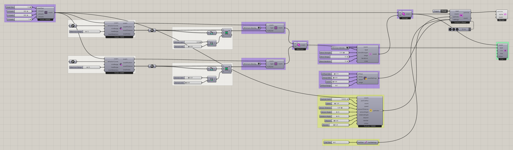

# Attractor Curves 2

Guide a slime simulation with several curve-based attraction regions, then soften the transitions between their mapped values. Curve attractors select nearby voxels and assign minimum chemoattractant density. Voxel Values Blend then smooths the density map across neighboring cells before the field reaches the solver.

Particles respond to this prepared signal while continuing to deposit their own. Compare the mapped field before and after blending, then observe how the trails respond. Use this example to explore how the strength and reach of blending change the influence of the curves without having to change the curve geometry itself.


[Download 11_Attractor Curves 2.gh](files/07-attractor-curves-2.gh)



## Follow the definition

The saved graph assigns **Minimum Density**, combines the mapped branches, and includes [Voxel Values Blend](../components/voxel-values-blend.md). Compare the field before and after blending to understand the transition between regions.

<details>
<summary>Components used</summary>

- [Construct Voxels](../components/construct-voxels.md)
- [Curve Attractor for Voxels](../components/curve-attractor-for-voxels.md)
- [Define Voxel Values](../components/define-voxel-values.md)
- [Voxel Selection Union](../components/voxel-selection-union.md)
- [Voxel Values Blend](../components/voxel-values-blend.md)
- [Voxel Preview](../components/voxel-preview.md)
- [Nuclei4 Solver GPU](../components/nuclei4-solver-gpu.md)
- [Voxel Settings Slime](../components/voxel-settings-slime.md)
- [Construct Slime Particles](../components/construct-slime-particles.md)
- [Particle Trail Preview](../components/particle-trail-preview.md)
- [Particle Trail Settings](../components/particle-trail-settings.md)

</details>

<details>
<summary>Saved controls</summary>

Slider and value-list settings saved in this definition. Repeated rows belong to different component instances.

| Component | Input | Saved control |
| --- | --- | --- |
| Construct Voxels | Voxel Size | 1 |
| Construct Voxels | X Voxels | 800 |
| Construct Voxels | Y Voxels | 800 |
| Construct Voxels | Z Voxels | 1 |
| Curve Attractor for Voxels | Maximum Range | 12 |
| Curve Attractor for Voxels | Maximum Range | 20 |
| Define Voxel Values | Type | Minimum Density |
| Define Voxel Values | Type | Minimum Density |
| Voxel Values Blend | Type | Minimum Density |
| Voxel Values Blend | Blend Strength | 0.75 |
| Voxel Values Blend | Blend Range | 10 |
| Voxel Values Blend | Blend Iterations | 10 |
| Voxel Preview | Type | Minimum Density |
| Nuclei4 Solver GPU | Reset | True |
| Voxel Settings Slime | Diffuse Rate | 0.1 |
| Voxel Settings Slime | Decay Rate | 0.03 |
| Voxel Settings Slime | Falloff | 0 |
| Voxel Settings Slime | Diffuse Range | 2 |
| Construct Slime Particles | Particle Count | 100000 |
| Construct Slime Particles | Speed | 1.3 |
| Construct Slime Particles | Sensor Distance | 6 |
| Construct Slime Particles | Sensor Angle | 45 |
| Construct Slime Particles | Rotation Angle | 45 |
| Construct Slime Particles | Deposit | 0.4 |
| Construct Slime Particles | Exploration | 0.2 |
| Particle Trail Settings | Trail Size | 5 |

</details>

## Run the example

Open it in Rhino 9 with Nuclei V4, pause the existing Trigger, and inspect the mapped field. Reset once with True, return reset to False, and start the Trigger. Pause before editing several inputs or extracting a large result.

## Try a comparison

Adjust blend strength or iteration count one at a time. Keep the curve arrangement unchanged during that comparison.

## Example result


[Back to examples](README.md)

<details>
<summary>Grasshopper definition (JSON)</summary>

[Download JSON](data/07-attractor-curves-2.json) · [JSON Schema](../reference/definition.schema.json) · [How to read this JSON](../reference/reading-json.md)

This records the saved definition. Geometry and other binary payloads remain in the original `.gh` file.

```json
{
  "$schema": "../../reference/definition.schema.json",
  "schemaVersion": 1,
  "title": "Attractor Curves 2",
  "source": {"file":"../files/07-attractor-curves-2.gh","sha256":"15780275b49fbd008081c3a0c1e8e46a5ce29ddddcc4823a1b95ced1c7f6e393","documentId":"81a09eac-6d40-4cfc-a471-227e24b1a80b"},
  "extraction": {"method":"GH_IO archive read without loading components or solving","coverage":"All saved top-level objects and Source wires; not an executable replacement for the .gh file","limitations":["Binary geometry and image payloads are omitted and identified by archive XML hashes.","External files and Rhino document geometry are not bundled. Inspect saved paths and references.","Runtime outputs, nested cluster internals and plugin-specific behavior are not reconstructed.","Saved library versions describe the archive, not a guarantee of compatibility with newer components."],"omittedBinaryPaths":["7db02d1d-97a3-491f-ae12-fe6753ebcaa7/PersistentData/Branch/Item/ON_Data","967a9f68-599f-47f2-9480-ec8cef2fa4c5/PersistentData/Branch/Item/ON_Data"],"unresolvedGroupMembers":[{"groupId":"7b954c8c-3ce4-48fa-902b-0b0b7e5b7890","memberId":"1d03d182-931e-4e5c-bb8b-2e94f497eed4"},{"groupId":"7b954c8c-3ce4-48fa-902b-0b0b7e5b7890","memberId":"030fb8d7-5f7e-4e27-9bf6-c2040616150c"},{"groupId":"7b954c8c-3ce4-48fa-902b-0b0b7e5b7890","memberId":"185384c9-571b-4b4e-96ca-909ee53aec61"},{"groupId":"cd7bf4b2-11ae-48f1-88ab-d8875079263e","memberId":"a186c748-c06f-431a-9a49-228f7c98099c"},{"groupId":"cd7bf4b2-11ae-48f1-88ab-d8875079263e","memberId":"b17fd58a-6042-4107-9bd2-32cf639b802c"},{"groupId":"cd7bf4b2-11ae-48f1-88ab-d8875079263e","memberId":"403f9ed5-1f47-42da-820c-caf13676f324"},{"groupId":"cd7bf4b2-11ae-48f1-88ab-d8875079263e","memberId":"957c8091-50d0-4bf4-88d4-9534acfae725"},{"groupId":"cd7bf4b2-11ae-48f1-88ab-d8875079263e","memberId":"b35559e1-3661-436d-98f4-12f724d9009d"},{"groupId":"cd7bf4b2-11ae-48f1-88ab-d8875079263e","memberId":"f8ef995f-11d7-4d1b-8278-31ce1bdbcb8a"},{"groupId":"cd7bf4b2-11ae-48f1-88ab-d8875079263e","memberId":"95eb1dbb-0019-4f05-b14c-b4886a9f2bad"},{"groupId":"cd7bf4b2-11ae-48f1-88ab-d8875079263e","memberId":"b59e8596-1324-4d46-86a2-bb2ee87abd7f"},{"groupId":"cd7bf4b2-11ae-48f1-88ab-d8875079263e","memberId":"508d7add-9c32-4173-9768-963abeee55f4"},{"groupId":"cd7bf4b2-11ae-48f1-88ab-d8875079263e","memberId":"de41bc6d-d739-43ed-bb71-f74d8fb4a23a"},{"groupId":"cd7bf4b2-11ae-48f1-88ab-d8875079263e","memberId":"9f6a1976-cc11-4539-a2c7-0d7fd3884890"},{"groupId":"cd7bf4b2-11ae-48f1-88ab-d8875079263e","memberId":"76109ee6-71e3-4ebd-a649-7e934c0f8b14"},{"groupId":"cd7bf4b2-11ae-48f1-88ab-d8875079263e","memberId":"9db308ce-f864-4606-9e1f-ff8333fefdba"},{"groupId":"cd7bf4b2-11ae-48f1-88ab-d8875079263e","memberId":"2c346ffa-2df4-4627-b751-9dbab8c6ee6b"},{"groupId":"cd7bf4b2-11ae-48f1-88ab-d8875079263e","memberId":"41476855-83a1-4326-a346-d59c1fe57979"},{"groupId":"cd7bf4b2-11ae-48f1-88ab-d8875079263e","memberId":"421fcfe9-2c0b-4d39-9720-8e2bd2e3a591"},{"groupId":"cd7bf4b2-11ae-48f1-88ab-d8875079263e","memberId":"69ee172d-9456-44f0-b40c-235998c6796f"},{"groupId":"cd7bf4b2-11ae-48f1-88ab-d8875079263e","memberId":"67f8004a-c78b-4e5a-aa1f-9bd63e612de1"},{"groupId":"cd7bf4b2-11ae-48f1-88ab-d8875079263e","memberId":"6b66a5fe-b452-4762-b050-f2ea44033d83"},{"groupId":"cd7bf4b2-11ae-48f1-88ab-d8875079263e","memberId":"62cfdb9c-aed5-47dd-bbea-516ba090c632"},{"groupId":"cd7bf4b2-11ae-48f1-88ab-d8875079263e","memberId":"d1ff9a55-3773-49cb-8065-72a322a7bdcd"},{"groupId":"cd7bf4b2-11ae-48f1-88ab-d8875079263e","memberId":"ce5a27fb-ceca-4cfc-a3b9-83a0cc60a045"},{"groupId":"cd7bf4b2-11ae-48f1-88ab-d8875079263e","memberId":"d365f199-da01-4adc-91a5-018e10a6d2f5"},{"groupId":"2710e17b-3866-4fdf-b073-290a6a2bacc9","memberId":"892ef3bf-c4fc-4480-95c4-37f8bc5c0edc"},{"groupId":"2710e17b-3866-4fdf-b073-290a6a2bacc9","memberId":"0a3734ca-8c91-41d9-aa56-ea78228b38b8"},{"groupId":"2710e17b-3866-4fdf-b073-290a6a2bacc9","memberId":"b837f762-6744-4046-9adf-9d83ea46b6b1"},{"groupId":"2710e17b-3866-4fdf-b073-290a6a2bacc9","memberId":"01d8c06b-377e-42c4-b62d-31dd49eb9289"},{"groupId":"2710e17b-3866-4fdf-b073-290a6a2bacc9","memberId":"2175040c-7a59-4364-961c-b917fded89de"},{"groupId":"2187f6d4-544d-4b90-a64d-29ff9533eceb","memberId":"c1e5a7bd-9597-4867-a4bd-a5ec1050acbc"},{"groupId":"2187f6d4-544d-4b90-a64d-29ff9533eceb","memberId":"5075d6f3-b5a1-47a8-905d-0cb4e813f5c1"},{"groupId":"2187f6d4-544d-4b90-a64d-29ff9533eceb","memberId":"b8243137-42ab-4f18-873f-54cd9d9b086c"},{"groupId":"2187f6d4-544d-4b90-a64d-29ff9533eceb","memberId":"890144b7-edf6-4edf-97e5-561eef4088ae"},{"groupId":"2187f6d4-544d-4b90-a64d-29ff9533eceb","memberId":"551ba1e4-2537-446b-8615-600effc3c09c"},{"groupId":"2187f6d4-544d-4b90-a64d-29ff9533eceb","memberId":"82afd9c8-dc05-4346-8dee-91abc272a85f"},{"groupId":"b202ee35-7fae-4e8f-ab6f-d5a077f9b7a6","memberId":"faac7721-db9c-468b-8906-6900e3eea207"},{"groupId":"b202ee35-7fae-4e8f-ab6f-d5a077f9b7a6","memberId":"3c34396b-f62a-4c86-92ff-92cd93c44497"},{"groupId":"b202ee35-7fae-4e8f-ab6f-d5a077f9b7a6","memberId":"2a78054a-4d37-4bdb-bb20-0e0b8ecd25cd"},{"groupId":"b202ee35-7fae-4e8f-ab6f-d5a077f9b7a6","memberId":"bbe45d08-d16e-49a6-938f-b37be39aba60"},{"groupId":"b202ee35-7fae-4e8f-ab6f-d5a077f9b7a6","memberId":"536c8725-400b-49ce-85df-e8438b07fe6f"},{"groupId":"b202ee35-7fae-4e8f-ab6f-d5a077f9b7a6","memberId":"8c155dba-3f20-4039-98c2-4c88af1b3aeb"},{"groupId":"46a32c07-fb98-420f-b71c-9419bdffafda","memberId":"84b64d3e-83d6-4c96-903d-e99e63c622b9"},{"groupId":"46a32c07-fb98-420f-b71c-9419bdffafda","memberId":"c4df1705-3ec1-4d3a-ae74-fa4e45d72f9f"},{"groupId":"46a32c07-fb98-420f-b71c-9419bdffafda","memberId":"19cdd650-cc55-426b-b7eb-691fc996685e"},{"groupId":"46a32c07-fb98-420f-b71c-9419bdffafda","memberId":"9de66fc0-9cab-487e-8775-a91e942fa127"},{"groupId":"61ba392b-2599-481b-a04d-0377518bb531","memberId":"0bc0d236-4e42-488f-bcc3-c6c2d6019b4f"},{"groupId":"f087f138-8315-4aa9-b5bc-ce5a6c9f55be","memberId":"d08536e2-9eeb-4860-b9bf-4e03cedd3b51"},{"groupId":"f087f138-8315-4aa9-b5bc-ce5a6c9f55be","memberId":"24908b81-93e8-4a41-b37d-9194ee02ef13"},{"groupId":"f087f138-8315-4aa9-b5bc-ce5a6c9f55be","memberId":"ee0124d1-1536-4194-b3f8-6e647fd0860b"},{"groupId":"f087f138-8315-4aa9-b5bc-ce5a6c9f55be","memberId":"de4d7a78-246b-42df-9e87-2efd48a6db32"},{"groupId":"e7c5f242-75e3-484b-90d3-a05c55b488f7","memberId":"ec514c14-9231-46d3-9dc5-2f8f1c5843e5"},{"groupId":"440a108e-9231-4483-8dd1-922b09cf70b1","memberId":"42185ca0-29e7-4795-a285-d6fc3f4e6d6a"},{"groupId":"ec1933f0-9f57-48ba-9cbd-6b96f5156198","memberId":"c9c7724b-0d6a-47a4-a35d-aa0b3845d0a1"},{"groupId":"4744947a-dd67-42cd-9bfa-88225c1bb045","memberId":"2517c759-5718-4700-9da6-74c1aaa7c9bf"},{"groupId":"29aff438-2087-47a3-a6ec-bf39c5d05120","memberId":"dae952a6-007a-495d-9f35-a0608ab2e630"},{"groupId":"486d2cfd-c8be-41ca-acaf-228a289ff50f","memberId":"86bc64f8-9ce7-448f-988b-cc271eb61f9b"},{"groupId":"c5ddd96e-3584-4025-9077-ffc3ed25afb6","memberId":"b36e4128-4780-4fb4-a7c0-1b29bbefcca4"},{"groupId":"336444aa-34b1-4298-ae6a-ea1e7e5f9506","memberId":"e7465ca4-1523-4e1b-b8d9-fb99e70464d6"},{"groupId":"112cb85f-f308-4b95-aa5a-a58b03cc2065","memberId":"5bf5f5e0-a4cc-4fa7-b5ca-e867abfe6826"},{"groupId":"737425dd-4fe1-4b17-aecb-c28156493d86","memberId":"b17fd58a-6042-4107-9bd2-32cf639b802c"},{"groupId":"bae4e0f5-2020-424e-908c-ea33777d0e5c","memberId":"403f9ed5-1f47-42da-820c-caf13676f324"},{"groupId":"e62560e0-3a09-4379-b19c-43eb50ff2597","memberId":"16627bc9-08f9-4ee1-806a-170f609e64be"},{"groupId":"bbeb6a77-c6ba-4dee-803e-d61acabe657e","memberId":"a226e507-3303-4bb4-9494-8a6a05f888f8"},{"groupId":"9f45fb98-43b9-44fd-88b6-7bb1d969b28a","memberId":"e1cadda0-93f3-4e75-960a-ac283cd7670d"},{"groupId":"9f45fb98-43b9-44fd-88b6-7bb1d969b28a","memberId":"fed94690-5d6a-41f5-8004-45b65dab45f8"},{"groupId":"9f45fb98-43b9-44fd-88b6-7bb1d969b28a","memberId":"8f75fc84-92b3-478e-be84-b3bc16380b7e"},{"groupId":"9f45fb98-43b9-44fd-88b6-7bb1d969b28a","memberId":"4e16795c-51e0-4317-b0b8-e36facd255b3"},{"groupId":"9f45fb98-43b9-44fd-88b6-7bb1d969b28a","memberId":"8e2da099-e350-48df-a679-c0ea25641d2d"},{"groupId":"9f45fb98-43b9-44fd-88b6-7bb1d969b28a","memberId":"26bb31f3-d9f3-496a-be06-0c22cac754a6"},{"groupId":"9f45fb98-43b9-44fd-88b6-7bb1d969b28a","memberId":"f2f13eb4-d2a9-4800-87d4-f08519c3348c"},{"groupId":"9f45fb98-43b9-44fd-88b6-7bb1d969b28a","memberId":"b7c0ad4a-1d21-4853-960d-8ffd2b54307c"},{"groupId":"9f45fb98-43b9-44fd-88b6-7bb1d969b28a","memberId":"ab5602af-a9fe-400b-99c7-6081fe0f235e"},{"groupId":"9f45fb98-43b9-44fd-88b6-7bb1d969b28a","memberId":"79f298b4-4af5-4d0c-9d61-eeb313122659"},{"groupId":"9f45fb98-43b9-44fd-88b6-7bb1d969b28a","memberId":"65be6055-3537-4682-9138-e8b73e56762e"},{"groupId":"9f45fb98-43b9-44fd-88b6-7bb1d969b28a","memberId":"7356eb6a-a380-4685-9737-41210065713b"},{"groupId":"a4503733-7024-475d-bd31-f9fc2f2ef62b","memberId":"d69fa426-00c7-44fd-9cc7-c32bcaed5dbc"},{"groupId":"0fec45a1-da6f-4f8f-848f-c66d02c24e8b","memberId":"892ef3bf-c4fc-4480-95c4-37f8bc5c0edc"},{"groupId":"cf5d2bc3-d21e-4046-9cd5-18542e7268cb","memberId":"b837f762-6744-4046-9adf-9d83ea46b6b1"},{"groupId":"bffa2ef6-1e6a-4d3e-adbf-f10c01cb60a8","memberId":"b35559e1-3661-436d-98f4-12f724d9009d"},{"groupId":"966000bf-7259-43fd-abc4-cc4279f4b7d3","memberId":"95eb1dbb-0019-4f05-b14c-b4886a9f2bad"},{"groupId":"ffe776dd-33c0-4eb3-95c3-d1c60a928a7d","memberId":"508d7add-9c32-4173-9768-963abeee55f4"},{"groupId":"5cd40c5b-c376-4c72-b46c-a379db4d294a","memberId":"9f6a1976-cc11-4539-a2c7-0d7fd3884890"},{"groupId":"7223c3f6-95cb-40e5-a55e-81de3663248b","memberId":"1cf26e18-3c1b-46ec-8f24-ec6f355b1b61"},{"groupId":"584fb878-3c44-4f35-a98e-bc6ccd311ec6","memberId":"67f8004a-c78b-4e5a-aa1f-9bd63e612de1"},{"groupId":"110ffa47-cb48-4249-8dc7-a6bba4a3dbbd","memberId":"6b66a5fe-b452-4762-b050-f2ea44033d83"},{"groupId":"cd661a6f-defd-4cae-8876-c453656f0a1a","memberId":"f05affda-0611-4d9f-a99f-02ec894ecacc"},{"groupId":"63b3f9b2-b679-49de-9743-6e0b5405a16f","memberId":"e295b9d3-2d95-4902-b89c-fd27e3ea4713"},{"groupId":"4a80d898-ae41-4655-b8e8-e93be8526ab8","memberId":"2fc8e1b1-2334-4c5e-9c7d-83447f078506"},{"groupId":"4a80d898-ae41-4655-b8e8-e93be8526ab8","memberId":"a186c748-c06f-431a-9a49-228f7c98099c"},{"groupId":"4a80d898-ae41-4655-b8e8-e93be8526ab8","memberId":"b17fd58a-6042-4107-9bd2-32cf639b802c"},{"groupId":"4a80d898-ae41-4655-b8e8-e93be8526ab8","memberId":"403f9ed5-1f47-42da-820c-caf13676f324"},{"groupId":"4a80d898-ae41-4655-b8e8-e93be8526ab8","memberId":"957c8091-50d0-4bf4-88d4-9534acfae725"},{"groupId":"4a80d898-ae41-4655-b8e8-e93be8526ab8","memberId":"b35559e1-3661-436d-98f4-12f724d9009d"},{"groupId":"4a80d898-ae41-4655-b8e8-e93be8526ab8","memberId":"f8ef995f-11d7-4d1b-8278-31ce1bdbcb8a"},{"groupId":"4a80d898-ae41-4655-b8e8-e93be8526ab8","memberId":"95eb1dbb-0019-4f05-b14c-b4886a9f2bad"},{"groupId":"4a80d898-ae41-4655-b8e8-e93be8526ab8","memberId":"b59e8596-1324-4d46-86a2-bb2ee87abd7f"},{"groupId":"4a80d898-ae41-4655-b8e8-e93be8526ab8","memberId":"b232bd14-26d0-4eac-a9b7-8e64e3252402"},{"groupId":"4a80d898-ae41-4655-b8e8-e93be8526ab8","memberId":"de41bc6d-d739-43ed-bb71-f74d8fb4a23a"},{"groupId":"4a80d898-ae41-4655-b8e8-e93be8526ab8","memberId":"9f6a1976-cc11-4539-a2c7-0d7fd3884890"},{"groupId":"4a80d898-ae41-4655-b8e8-e93be8526ab8","memberId":"76109ee6-71e3-4ebd-a649-7e934c0f8b14"},{"groupId":"4a80d898-ae41-4655-b8e8-e93be8526ab8","memberId":"9db308ce-f864-4606-9e1f-ff8333fefdba"},{"groupId":"4a80d898-ae41-4655-b8e8-e93be8526ab8","memberId":"2c346ffa-2df4-4627-b751-9dbab8c6ee6b"},{"groupId":"4a80d898-ae41-4655-b8e8-e93be8526ab8","memberId":"41476855-83a1-4326-a346-d59c1fe57979"},{"groupId":"4a80d898-ae41-4655-b8e8-e93be8526ab8","memberId":"421fcfe9-2c0b-4d39-9720-8e2bd2e3a591"},{"groupId":"4a80d898-ae41-4655-b8e8-e93be8526ab8","memberId":"69ee172d-9456-44f0-b40c-235998c6796f"},{"groupId":"4a80d898-ae41-4655-b8e8-e93be8526ab8","memberId":"67f8004a-c78b-4e5a-aa1f-9bd63e612de1"},{"groupId":"4a80d898-ae41-4655-b8e8-e93be8526ab8","memberId":"9463a2e3-d8ff-48ad-a53f-938b24c6a1f9"},{"groupId":"4a80d898-ae41-4655-b8e8-e93be8526ab8","memberId":"14650776-b256-4147-b74f-16b715f5f0f7"},{"groupId":"4a80d898-ae41-4655-b8e8-e93be8526ab8","memberId":"d1ff9a55-3773-49cb-8065-72a322a7bdcd"},{"groupId":"4a80d898-ae41-4655-b8e8-e93be8526ab8","memberId":"aec346d8-533c-4595-b62f-019e9495ee1c"},{"groupId":"4a80d898-ae41-4655-b8e8-e93be8526ab8","memberId":"eaffabbe-f275-46b6-9fa2-70bb20a68fa2"},{"groupId":"33ca2cb5-b322-4257-b997-d193c88741c3","memberId":"ef25e0bc-791c-4471-85ad-7544231d49cb"},{"groupId":"33ca2cb5-b322-4257-b997-d193c88741c3","memberId":"5075d6f3-b5a1-47a8-905d-0cb4e813f5c1"},{"groupId":"33ca2cb5-b322-4257-b997-d193c88741c3","memberId":"b8243137-42ab-4f18-873f-54cd9d9b086c"},{"groupId":"33ca2cb5-b322-4257-b997-d193c88741c3","memberId":"890144b7-edf6-4edf-97e5-561eef4088ae"},{"groupId":"33ca2cb5-b322-4257-b997-d193c88741c3","memberId":"551ba1e4-2537-446b-8615-600effc3c09c"},{"groupId":"33ca2cb5-b322-4257-b997-d193c88741c3","memberId":"95c1ff22-3967-4eec-8a5b-9c09b36044c9"},{"groupId":"e163e49a-3822-4f83-a2c8-8eaf808efbe1","memberId":"e1cadda0-93f3-4e75-960a-ac283cd7670d"},{"groupId":"e163e49a-3822-4f83-a2c8-8eaf808efbe1","memberId":"fed94690-5d6a-41f5-8004-45b65dab45f8"},{"groupId":"e163e49a-3822-4f83-a2c8-8eaf808efbe1","memberId":"8f75fc84-92b3-478e-be84-b3bc16380b7e"},{"groupId":"e163e49a-3822-4f83-a2c8-8eaf808efbe1","memberId":"4e16795c-51e0-4317-b0b8-e36facd255b3"},{"groupId":"e163e49a-3822-4f83-a2c8-8eaf808efbe1","memberId":"8e2da099-e350-48df-a679-c0ea25641d2d"},{"groupId":"e163e49a-3822-4f83-a2c8-8eaf808efbe1","memberId":"26bb31f3-d9f3-496a-be06-0c22cac754a6"},{"groupId":"e163e49a-3822-4f83-a2c8-8eaf808efbe1","memberId":"f2f13eb4-d2a9-4800-87d4-f08519c3348c"},{"groupId":"e163e49a-3822-4f83-a2c8-8eaf808efbe1","memberId":"b7c0ad4a-1d21-4853-960d-8ffd2b54307c"},{"groupId":"e163e49a-3822-4f83-a2c8-8eaf808efbe1","memberId":"ab5602af-a9fe-400b-99c7-6081fe0f235e"},{"groupId":"e163e49a-3822-4f83-a2c8-8eaf808efbe1","memberId":"79f298b4-4af5-4d0c-9d61-eeb313122659"},{"groupId":"e163e49a-3822-4f83-a2c8-8eaf808efbe1","memberId":"65be6055-3537-4682-9138-e8b73e56762e"},{"groupId":"e163e49a-3822-4f83-a2c8-8eaf808efbe1","memberId":"95edfdd0-9bc4-40b6-a77a-4db3c383386b"},{"groupId":"687fcc27-fabb-4041-8a3a-5e53b8f2f175","memberId":"2fc8e1b1-2334-4c5e-9c7d-83447f078506"},{"groupId":"0ad6cc6b-88c8-4166-a37a-edea339c5010","memberId":"b232bd14-26d0-4eac-a9b7-8e64e3252402"},{"groupId":"bf36b502-e99b-4493-aff6-2fb0991dc87b","memberId":"9463a2e3-d8ff-48ad-a53f-938b24c6a1f9"},{"groupId":"a03204fc-faa1-42f1-b55b-f89a70e161a2","memberId":"14650776-b256-4147-b74f-16b715f5f0f7"},{"groupId":"590b4ae4-cb7d-497c-bee9-9b8499a5be7e","memberId":"163b6a73-2317-416e-9389-12f1bce77807"},{"groupId":"36c84c73-49ac-42b7-aad9-650aeae49a51","memberId":"e0d37f62-351e-42da-92f4-00f242c03eff"},{"groupId":"c9a549e8-50ae-4d2e-8b53-de0c0e9474d2","memberId":"4320bef2-14a2-4dae-9bb6-cc84cd6bd5e2"},{"groupId":"575afdbf-673f-4e5b-9830-e04105835653","memberId":"e6c9ac19-c6a9-4ac8-be1c-f6aa78c79097"},{"groupId":"722442d1-807c-4d67-8ba3-81c48f79eaba","memberId":"aec346d8-533c-4595-b62f-019e9495ee1c"},{"groupId":"17828cbe-ad9b-457b-bae8-b59321f5a9aa","memberId":"a5244aba-23da-4a9d-9993-f6204286dc4b"},{"groupId":"e2aea5ca-7393-4da1-bc3e-aba55243bd9d","memberId":"7eed720a-4fb8-4e8b-8453-550eaa77d0d4"}]},
  "libraries": [{"name":"Library","items":[{"name":"Author","type":"gh_string","value":"Robert McNeel & Associates"},{"name":"Id","type":"gh_guid","value":"00000000-0000-0000-0000-000000000000"},{"name":"Name","type":"gh_string","value":"Grasshopper"},{"name":"Version","type":"gh_string","value":"9.0.26244.12303"}],"chunks":[],"index":0},{"name":"Library","items":[{"name":"Author","type":"gh_string","value":"Robert McNeel & Associates"},{"name":"Id","type":"gh_guid","value":"00000000-0000-0000-0000-000000000000"},{"name":"Name","type":"gh_string","value":"Grasshopper"},{"name":"Version","type":"gh_string","value":"9.0.26244.12303"}],"chunks":[],"index":1},{"name":"Library","items":[{"name":"AssemblyFullName","type":"gh_string","value":"Nuclei4, Version=4.1.0.0, Culture=neutral, PublicKeyToken=null"},{"name":"AssemblyVersion","type":"gh_string","value":"4.1.0.0"},{"name":"Author","type":"gh_string","value":"Madalin Gheorghe"},{"name":"Id","type":"gh_guid","value":"a4810f34-10b6-480c-a6d0-607aac4e8d2a"},{"name":"Name","type":"gh_string","value":"Nuclei4"},{"name":"Version","type":"gh_string","value":""}],"chunks":[],"index":2}],
  "nodes": [
    {"id":"7b954c8c-3ce4-48fa-902b-0b0b7e5b7890","componentGuid":"c552a431-af5b-46a9-a8a4-0fcbc27ef596","name":"Group","nickname":"","libraryId":null,"inputs":[],"outputs":[],"savedState":{"name":"Container","items":[{"name":"Border","type":"gh_int32","value":"1"},{"name":"Colour","type":"gh_drawing_color","xmlValue":"<item name=\"Colour\" type_name=\"gh_drawing_color\" type_code=\"36\">\n                      <ARGB>75;76;0;255</ARGB>\n                    </item>"},{"name":"Description","type":"gh_string","value":"A group of Grasshopper objects"},{"name":"ID","type":"gh_guid","index":0,"value":"1d03d182-931e-4e5c-bb8b-2e94f497eed4"},{"name":"ID","type":"gh_guid","index":1,"value":"030fb8d7-5f7e-4e27-9bf6-c2040616150c"},{"name":"ID","type":"gh_guid","index":2,"value":"77ed8e81-2359-4a53-bc07-9fbd4b3124eb"},{"name":"ID","type":"gh_guid","index":3,"value":"185384c9-571b-4b4e-96ca-909ee53aec61"},{"name":"ID","type":"gh_guid","index":4,"value":"d1f88f08-9796-4788-8360-63aceff60373"},{"name":"ID","type":"gh_guid","index":5,"value":"f4235024-99f8-4525-b99d-02bac5b5b3bf"},{"name":"ID","type":"gh_guid","index":6,"value":"088c5486-4445-4b2d-8e1e-20ee3fc8d1a8"},{"name":"ID","type":"gh_guid","index":7,"value":"5a1884e3-a74a-40fb-82dc-613bbd20491a"},{"name":"ID_Count","type":"gh_int32","value":"8"},{"name":"InstanceGuid","type":"gh_guid","value":"7b954c8c-3ce4-48fa-902b-0b0b7e5b7890"},{"name":"Name","type":"gh_string","value":"Group"},{"name":"NickName","type":"gh_string","value":""}],"chunks":[]},"canvas":{"name":"Attributes","items":[],"chunks":[]},"groupMembers":["1d03d182-931e-4e5c-bb8b-2e94f497eed4","030fb8d7-5f7e-4e27-9bf6-c2040616150c","77ed8e81-2359-4a53-bc07-9fbd4b3124eb","185384c9-571b-4b4e-96ca-909ee53aec61","d1f88f08-9796-4788-8360-63aceff60373","f4235024-99f8-4525-b99d-02bac5b5b3bf","088c5486-4445-4b2d-8e1e-20ee3fc8d1a8","5a1884e3-a74a-40fb-82dc-613bbd20491a"]},
    {"id":"cd7bf4b2-11ae-48f1-88ab-d8875079263e","componentGuid":"c552a431-af5b-46a9-a8a4-0fcbc27ef596","name":"Group","nickname":"Extract Voxels Depending On Closest Curve","libraryId":null,"inputs":[],"outputs":[],"savedState":{"name":"Container","items":[{"name":"Border","type":"gh_int32","value":"1"},{"name":"Colour","type":"gh_drawing_color","xmlValue":"<item name=\"Colour\" type_name=\"gh_drawing_color\" type_code=\"36\">\n                      <ARGB>150;255;255;255</ARGB>\n                    </item>"},{"name":"Description","type":"gh_string","value":"A group of Grasshopper objects"},{"name":"ID","type":"gh_guid","index":0,"value":"7db02d1d-97a3-491f-ae12-fe6753ebcaa7"},{"name":"ID","type":"gh_guid","index":1,"value":"a186c748-c06f-431a-9a49-228f7c98099c"},{"name":"ID","type":"gh_guid","index":2,"value":"b17fd58a-6042-4107-9bd2-32cf639b802c"},{"name":"ID","type":"gh_guid","index":3,"value":"737425dd-4fe1-4b17-aecb-c28156493d86"},{"name":"ID","type":"gh_guid","index":4,"value":"39bba0f3-fc80-4f1c-92c3-e8d1144e1fb7"},{"name":"ID","type":"gh_guid","index":5,"value":"403f9ed5-1f47-42da-820c-caf13676f324"},{"name":"ID","type":"gh_guid","index":6,"value":"bae4e0f5-2020-424e-908c-ea33777d0e5c"},{"name":"ID","type":"gh_guid","index":7,"value":"957c8091-50d0-4bf4-88d4-9534acfae725"},{"name":"ID","type":"gh_guid","index":8,"value":"b35559e1-3661-436d-98f4-12f724d9009d"},{"name":"ID","type":"gh_guid","index":9,"value":"f8ef995f-11d7-4d1b-8278-31ce1bdbcb8a"},{"name":"ID","type":"gh_guid","index":10,"value":"95eb1dbb-0019-4f05-b14c-b4886a9f2bad"},{"name":"ID","type":"gh_guid","index":11,"value":"b59e8596-1324-4d46-86a2-bb2ee87abd7f"},{"name":"ID","type":"gh_guid","index":12,"value":"508d7add-9c32-4173-9768-963abeee55f4"},{"name":"ID","type":"gh_guid","index":13,"value":"de41bc6d-d739-43ed-bb71-f74d8fb4a23a"},{"name":"ID","type":"gh_guid","index":14,"value":"9f6a1976-cc11-4539-a2c7-0d7fd3884890"},{"name":"ID","type":"gh_guid","index":15,"value":"76109ee6-71e3-4ebd-a649-7e934c0f8b14"},{"name":"ID","type":"gh_guid","index":16,"value":"9db308ce-f864-4606-9e1f-ff8333fefdba"},{"name":"ID","type":"gh_guid","index":17,"value":"2c346ffa-2df4-4627-b751-9dbab8c6ee6b"},{"name":"ID","type":"gh_guid","index":18,"value":"41476855-83a1-4326-a346-d59c1fe57979"},{"name":"ID","type":"gh_guid","index":19,"value":"421fcfe9-2c0b-4d39-9720-8e2bd2e3a591"},{"name":"ID","type":"gh_guid","index":20,"value":"69ee172d-9456-44f0-b40c-235998c6796f"},{"name":"ID","type":"gh_guid","index":21,"value":"67f8004a-c78b-4e5a-aa1f-9bd63e612de1"},{"name":"ID","type":"gh_guid","index":22,"value":"6b66a5fe-b452-4762-b050-f2ea44033d83"},{"name":"ID","type":"gh_guid","index":23,"value":"62cfdb9c-aed5-47dd-bbea-516ba090c632"},{"name":"ID","type":"gh_guid","index":24,"value":"d1ff9a55-3773-49cb-8065-72a322a7bdcd"},{"name":"ID","type":"gh_guid","index":25,"value":"ce5a27fb-ceca-4cfc-a3b9-83a0cc60a045"},{"name":"ID","type":"gh_guid","index":26,"value":"d365f199-da01-4adc-91a5-018e10a6d2f5"},{"name":"ID","type":"gh_guid","index":27,"value":"c246e9d3-8bb8-4cac-bb6e-f579095e0f05"},{"name":"ID_Count","type":"gh_int32","value":"28"},{"name":"InstanceGuid","type":"gh_guid","value":"cd7bf4b2-11ae-48f1-88ab-d8875079263e"},{"name":"Name","type":"gh_string","value":"Group"},{"name":"NickName","type":"gh_string","value":"Extract Voxels Depending On Closest Curve"}],"chunks":[]},"canvas":{"name":"Attributes","items":[],"chunks":[]},"groupMembers":["7db02d1d-97a3-491f-ae12-fe6753ebcaa7","a186c748-c06f-431a-9a49-228f7c98099c","b17fd58a-6042-4107-9bd2-32cf639b802c","737425dd-4fe1-4b17-aecb-c28156493d86","39bba0f3-fc80-4f1c-92c3-e8d1144e1fb7","403f9ed5-1f47-42da-820c-caf13676f324","bae4e0f5-2020-424e-908c-ea33777d0e5c","957c8091-50d0-4bf4-88d4-9534acfae725","b35559e1-3661-436d-98f4-12f724d9009d","f8ef995f-11d7-4d1b-8278-31ce1bdbcb8a","95eb1dbb-0019-4f05-b14c-b4886a9f2bad","b59e8596-1324-4d46-86a2-bb2ee87abd7f","508d7add-9c32-4173-9768-963abeee55f4","de41bc6d-d739-43ed-bb71-f74d8fb4a23a","9f6a1976-cc11-4539-a2c7-0d7fd3884890","76109ee6-71e3-4ebd-a649-7e934c0f8b14","9db308ce-f864-4606-9e1f-ff8333fefdba","2c346ffa-2df4-4627-b751-9dbab8c6ee6b","41476855-83a1-4326-a346-d59c1fe57979","421fcfe9-2c0b-4d39-9720-8e2bd2e3a591","69ee172d-9456-44f0-b40c-235998c6796f","67f8004a-c78b-4e5a-aa1f-9bd63e612de1","6b66a5fe-b452-4762-b050-f2ea44033d83","62cfdb9c-aed5-47dd-bbea-516ba090c632","d1ff9a55-3773-49cb-8065-72a322a7bdcd","ce5a27fb-ceca-4cfc-a3b9-83a0cc60a045","d365f199-da01-4adc-91a5-018e10a6d2f5","c246e9d3-8bb8-4cac-bb6e-f579095e0f05"]},
    {"id":"2710e17b-3866-4fdf-b073-290a6a2bacc9","componentGuid":"c552a431-af5b-46a9-a8a4-0fcbc27ef596","name":"Group","nickname":"","libraryId":null,"inputs":[],"outputs":[],"savedState":{"name":"Container","items":[{"name":"Border","type":"gh_int32","value":"1"},{"name":"Colour","type":"gh_drawing_color","xmlValue":"<item name=\"Colour\" type_name=\"gh_drawing_color\" type_code=\"36\">\n                      <ARGB>150;107;255;164</ARGB>\n                    </item>"},{"name":"Description","type":"gh_string","value":"A group of Grasshopper objects"},{"name":"ID","type":"gh_guid","index":0,"value":"892ef3bf-c4fc-4480-95c4-37f8bc5c0edc"},{"name":"ID","type":"gh_guid","index":1,"value":"0a3734ca-8c91-41d9-aa56-ea78228b38b8"},{"name":"ID","type":"gh_guid","index":2,"value":"b837f762-6744-4046-9adf-9d83ea46b6b1"},{"name":"ID","type":"gh_guid","index":3,"value":"01d8c06b-377e-42c4-b62d-31dd49eb9289"},{"name":"ID","type":"gh_guid","index":4,"value":"2175040c-7a59-4364-961c-b917fded89de"},{"name":"ID","type":"gh_guid","index":5,"value":"0fec45a1-da6f-4f8f-848f-c66d02c24e8b"},{"name":"ID_Count","type":"gh_int32","value":"6"},{"name":"InstanceGuid","type":"gh_guid","value":"2710e17b-3866-4fdf-b073-290a6a2bacc9"},{"name":"Name","type":"gh_string","value":"Group"},{"name":"NickName","type":"gh_string","value":""}],"chunks":[]},"canvas":{"name":"Attributes","items":[],"chunks":[]},"groupMembers":["892ef3bf-c4fc-4480-95c4-37f8bc5c0edc","0a3734ca-8c91-41d9-aa56-ea78228b38b8","b837f762-6744-4046-9adf-9d83ea46b6b1","01d8c06b-377e-42c4-b62d-31dd49eb9289","2175040c-7a59-4364-961c-b917fded89de","0fec45a1-da6f-4f8f-848f-c66d02c24e8b"]},
    {"id":"2187f6d4-544d-4b90-a64d-29ff9533eceb","componentGuid":"c552a431-af5b-46a9-a8a4-0fcbc27ef596","name":"Group","nickname":"","libraryId":null,"inputs":[],"outputs":[],"savedState":{"name":"Container","items":[{"name":"Border","type":"gh_int32","value":"1"},{"name":"Colour","type":"gh_drawing_color","xmlValue":"<item name=\"Colour\" type_name=\"gh_drawing_color\" type_code=\"36\">\n                      <ARGB>75;76;0;255</ARGB>\n                    </item>"},{"name":"Description","type":"gh_string","value":"A group of Grasshopper objects"},{"name":"ID","type":"gh_guid","index":0,"value":"c1e5a7bd-9597-4867-a4bd-a5ec1050acbc"},{"name":"ID","type":"gh_guid","index":1,"value":"5075d6f3-b5a1-47a8-905d-0cb4e813f5c1"},{"name":"ID","type":"gh_guid","index":2,"value":"4af89105-e259-4f71-8189-e9364990ec79"},{"name":"ID","type":"gh_guid","index":3,"value":"b8243137-42ab-4f18-873f-54cd9d9b086c"},{"name":"ID","type":"gh_guid","index":4,"value":"890144b7-edf6-4edf-97e5-561eef4088ae"},{"name":"ID","type":"gh_guid","index":5,"value":"551ba1e4-2537-446b-8615-600effc3c09c"},{"name":"ID","type":"gh_guid","index":6,"value":"82afd9c8-dc05-4346-8dee-91abc272a85f"},{"name":"ID","type":"gh_guid","index":7,"value":"4072073e-6902-499b-bd0b-70bee61f92ee"},{"name":"ID_Count","type":"gh_int32","value":"8"},{"name":"InstanceGuid","type":"gh_guid","value":"2187f6d4-544d-4b90-a64d-29ff9533eceb"},{"name":"Name","type":"gh_string","value":"Group"},{"name":"NickName","type":"gh_string","value":""}],"chunks":[]},"canvas":{"name":"Attributes","items":[],"chunks":[]},"groupMembers":["c1e5a7bd-9597-4867-a4bd-a5ec1050acbc","5075d6f3-b5a1-47a8-905d-0cb4e813f5c1","4af89105-e259-4f71-8189-e9364990ec79","b8243137-42ab-4f18-873f-54cd9d9b086c","890144b7-edf6-4edf-97e5-561eef4088ae","551ba1e4-2537-446b-8615-600effc3c09c","82afd9c8-dc05-4346-8dee-91abc272a85f","4072073e-6902-499b-bd0b-70bee61f92ee"]},
    {"id":"b202ee35-7fae-4e8f-ab6f-d5a077f9b7a6","componentGuid":"c552a431-af5b-46a9-a8a4-0fcbc27ef596","name":"Group","nickname":"Define Design Space","libraryId":null,"inputs":[],"outputs":[],"savedState":{"name":"Container","items":[{"name":"Border","type":"gh_int32","value":"1"},{"name":"Colour","type":"gh_drawing_color","xmlValue":"<item name=\"Colour\" type_name=\"gh_drawing_color\" type_code=\"36\">\n                      <ARGB>75;76;0;255</ARGB>\n                    </item>"},{"name":"Description","type":"gh_string","value":"A group of Grasshopper objects"},{"name":"ID","type":"gh_guid","index":0,"value":"faac7721-db9c-468b-8906-6900e3eea207"},{"name":"ID","type":"gh_guid","index":1,"value":"69fcf759-a74d-43e9-a617-7e6839371c95"},{"name":"ID","type":"gh_guid","index":2,"value":"379c7a7d-5e06-40ec-91d9-8b932958c467"},{"name":"ID","type":"gh_guid","index":3,"value":"278699b3-65f9-425a-987e-52998062ab20"},{"name":"ID","type":"gh_guid","index":4,"value":"3c34396b-f62a-4c86-92ff-92cd93c44497"},{"name":"ID","type":"gh_guid","index":5,"value":"2a78054a-4d37-4bdb-bb20-0e0b8ecd25cd"},{"name":"ID","type":"gh_guid","index":6,"value":"bbe45d08-d16e-49a6-938f-b37be39aba60"},{"name":"ID","type":"gh_guid","index":7,"value":"e0188d80-5caa-45e0-825b-2eff2845e023"},{"name":"ID","type":"gh_guid","index":8,"value":"536c8725-400b-49ce-85df-e8438b07fe6f"},{"name":"ID","type":"gh_guid","index":9,"value":"8c155dba-3f20-4039-98c2-4c88af1b3aeb"},{"name":"ID","type":"gh_guid","index":10,"value":"ed00bf69-4179-4ded-a7a4-8cea0f6d5940"},{"name":"ID_Count","type":"gh_int32","value":"11"},{"name":"InstanceGuid","type":"gh_guid","value":"b202ee35-7fae-4e8f-ab6f-d5a077f9b7a6"},{"name":"Name","type":"gh_string","value":"Group"},{"name":"NickName","type":"gh_string","value":"Define Design Space"}],"chunks":[]},"canvas":{"name":"Attributes","items":[],"chunks":[]},"groupMembers":["faac7721-db9c-468b-8906-6900e3eea207","69fcf759-a74d-43e9-a617-7e6839371c95","379c7a7d-5e06-40ec-91d9-8b932958c467","278699b3-65f9-425a-987e-52998062ab20","3c34396b-f62a-4c86-92ff-92cd93c44497","2a78054a-4d37-4bdb-bb20-0e0b8ecd25cd","bbe45d08-d16e-49a6-938f-b37be39aba60","e0188d80-5caa-45e0-825b-2eff2845e023","536c8725-400b-49ce-85df-e8438b07fe6f","8c155dba-3f20-4039-98c2-4c88af1b3aeb","ed00bf69-4179-4ded-a7a4-8cea0f6d5940"]},
    {"id":"69fcf759-a74d-43e9-a617-7e6839371c95","componentGuid":"57da07bd-ecab-415d-9d86-af36d7073abc","name":"Number Slider","nickname":"","libraryId":null,"inputs":[],"outputs":[],"savedState":{"name":"Container","items":[{"name":"Description","type":"gh_string","value":"Numeric slider for single values"},{"name":"InstanceGuid","type":"gh_guid","value":"69fcf759-a74d-43e9-a617-7e6839371c95"},{"name":"Name","type":"gh_string","value":"Number Slider"},{"name":"NickName","type":"gh_string","value":""},{"name":"Optional","type":"gh_bool","value":"false"},{"name":"SourceCount","type":"gh_int32","value":"0"}],"chunks":[{"name":"Slider","items":[{"name":"Digits","type":"gh_int32","value":"3"},{"name":"GripDisplay","type":"gh_int32","value":"1"},{"name":"Interval","type":"gh_int32","value":"1"},{"name":"Max","type":"gh_double","value":"1000"},{"name":"Min","type":"gh_double","value":"0"},{"name":"SnapCount","type":"gh_int32","value":"0"},{"name":"Value","type":"gh_double","value":"800"}],"chunks":[]}]},"canvas":{"name":"Attributes","items":[{"name":"Bounds","type":"gh_drawing_rectanglef","xmlValue":"<item name=\"Bounds\" type_name=\"gh_drawing_rectanglef\" type_code=\"35\">\n                          <X>174</X>\n                          <Y>92</Y>\n                          <W>174</W>\n                          <H>20</H>\n                        </item>"},{"name":"Pivot","type":"gh_drawing_pointf","xmlValue":"<item name=\"Pivot\" type_name=\"gh_drawing_pointf\" type_code=\"31\">\n                          <X>174.49356</X>\n                          <Y>92.13745</Y>\n                        </item>"}],"chunks":[]},"groupMembers":[]},
    {"id":"379c7a7d-5e06-40ec-91d9-8b932958c467","componentGuid":"57da07bd-ecab-415d-9d86-af36d7073abc","name":"Number Slider","nickname":"","libraryId":null,"inputs":[],"outputs":[],"savedState":{"name":"Container","items":[{"name":"Description","type":"gh_string","value":"Numeric slider for single values"},{"name":"InstanceGuid","type":"gh_guid","value":"379c7a7d-5e06-40ec-91d9-8b932958c467"},{"name":"Name","type":"gh_string","value":"Number Slider"},{"name":"NickName","type":"gh_string","value":""},{"name":"Optional","type":"gh_bool","value":"false"},{"name":"SourceCount","type":"gh_int32","value":"0"}],"chunks":[{"name":"Slider","items":[{"name":"Digits","type":"gh_int32","value":"3"},{"name":"GripDisplay","type":"gh_int32","value":"1"},{"name":"Interval","type":"gh_int32","value":"1"},{"name":"Max","type":"gh_double","value":"1000"},{"name":"Min","type":"gh_double","value":"0"},{"name":"SnapCount","type":"gh_int32","value":"0"},{"name":"Value","type":"gh_double","value":"800"}],"chunks":[]}]},"canvas":{"name":"Attributes","items":[{"name":"Bounds","type":"gh_drawing_rectanglef","xmlValue":"<item name=\"Bounds\" type_name=\"gh_drawing_rectanglef\" type_code=\"35\">\n                          <X>174</X>\n                          <Y>120</Y>\n                          <W>174</W>\n                          <H>20</H>\n                        </item>"},{"name":"Pivot","type":"gh_drawing_pointf","xmlValue":"<item name=\"Pivot\" type_name=\"gh_drawing_pointf\" type_code=\"31\">\n                          <X>174.79749</X>\n                          <Y>120.695465</Y>\n                        </item>"}],"chunks":[]},"groupMembers":[]},
    {"id":"278699b3-65f9-425a-987e-52998062ab20","componentGuid":"57da07bd-ecab-415d-9d86-af36d7073abc","name":"Number Slider","nickname":"","libraryId":null,"inputs":[],"outputs":[],"savedState":{"name":"Container","items":[{"name":"Description","type":"gh_string","value":"Numeric slider for single values"},{"name":"InstanceGuid","type":"gh_guid","value":"278699b3-65f9-425a-987e-52998062ab20"},{"name":"Name","type":"gh_string","value":"Number Slider"},{"name":"NickName","type":"gh_string","value":""},{"name":"Optional","type":"gh_bool","value":"false"},{"name":"SourceCount","type":"gh_int32","value":"0"}],"chunks":[{"name":"Slider","items":[{"name":"Digits","type":"gh_int32","value":"3"},{"name":"GripDisplay","type":"gh_int32","value":"1"},{"name":"Interval","type":"gh_int32","value":"1"},{"name":"Max","type":"gh_double","value":"1"},{"name":"Min","type":"gh_double","value":"0"},{"name":"SnapCount","type":"gh_int32","value":"0"},{"name":"Value","type":"gh_double","value":"1"}],"chunks":[]}]},"canvas":{"name":"Attributes","items":[{"name":"Bounds","type":"gh_drawing_rectanglef","xmlValue":"<item name=\"Bounds\" type_name=\"gh_drawing_rectanglef\" type_code=\"35\">\n                          <X>174</X>\n                          <Y>149</Y>\n                          <W>174</W>\n                          <H>20</H>\n                        </item>"},{"name":"Pivot","type":"gh_drawing_pointf","xmlValue":"<item name=\"Pivot\" type_name=\"gh_drawing_pointf\" type_code=\"31\">\n                          <X>174.79749</X>\n                          <Y>149.43341</Y>\n                        </item>"}],"chunks":[]},"groupMembers":[]},
    {"id":"46a32c07-fb98-420f-b71c-9419bdffafda","componentGuid":"c552a431-af5b-46a9-a8a4-0fcbc27ef596","name":"Group","nickname":"","libraryId":null,"inputs":[],"outputs":[],"savedState":{"name":"Container","items":[{"name":"Border","type":"gh_int32","value":"1"},{"name":"Colour","type":"gh_drawing_color","xmlValue":"<item name=\"Colour\" type_name=\"gh_drawing_color\" type_code=\"36\">\n                      <ARGB>75;76;0;255</ARGB>\n                    </item>"},{"name":"Description","type":"gh_string","value":"A group of Grasshopper objects"},{"name":"ID","type":"gh_guid","index":0,"value":"84b64d3e-83d6-4c96-903d-e99e63c622b9"},{"name":"ID","type":"gh_guid","index":1,"value":"6113dc0e-7871-48a3-abdf-989a0f66ecc0"},{"name":"ID","type":"gh_guid","index":2,"value":"ffb8185d-29fa-4a51-a282-04e443abe071"},{"name":"ID","type":"gh_guid","index":3,"value":"921a4b65-c6a7-4fbc-9750-c8420a77f0bb"},{"name":"ID","type":"gh_guid","index":4,"value":"c4df1705-3ec1-4d3a-ae74-fa4e45d72f9f"},{"name":"ID","type":"gh_guid","index":5,"value":"19cdd650-cc55-426b-b7eb-691fc996685e"},{"name":"ID","type":"gh_guid","index":6,"value":"9de66fc0-9cab-487e-8775-a91e942fa127"},{"name":"ID","type":"gh_guid","index":7,"value":"dc60d17e-cbbc-47de-ac0d-ba45a6bc0bd7"},{"name":"ID","type":"gh_guid","index":8,"value":"8d475b9b-4524-4e0f-b073-b2ea8d9e6d46"},{"name":"ID_Count","type":"gh_int32","value":"9"},{"name":"InstanceGuid","type":"gh_guid","value":"46a32c07-fb98-420f-b71c-9419bdffafda"},{"name":"Name","type":"gh_string","value":"Group"},{"name":"NickName","type":"gh_string","value":""}],"chunks":[]},"canvas":{"name":"Attributes","items":[],"chunks":[]},"groupMembers":["84b64d3e-83d6-4c96-903d-e99e63c622b9","6113dc0e-7871-48a3-abdf-989a0f66ecc0","ffb8185d-29fa-4a51-a282-04e443abe071","921a4b65-c6a7-4fbc-9750-c8420a77f0bb","c4df1705-3ec1-4d3a-ae74-fa4e45d72f9f","19cdd650-cc55-426b-b7eb-691fc996685e","9de66fc0-9cab-487e-8775-a91e942fa127","dc60d17e-cbbc-47de-ac0d-ba45a6bc0bd7","8d475b9b-4524-4e0f-b073-b2ea8d9e6d46"]},
    {"id":"6113dc0e-7871-48a3-abdf-989a0f66ecc0","componentGuid":"57da07bd-ecab-415d-9d86-af36d7073abc","name":"Number Slider","nickname":"","libraryId":null,"inputs":[],"outputs":[],"savedState":{"name":"Container","items":[{"name":"Description","type":"gh_string","value":"Numeric slider for single values"},{"name":"InstanceGuid","type":"gh_guid","value":"6113dc0e-7871-48a3-abdf-989a0f66ecc0"},{"name":"Name","type":"gh_string","value":"Number Slider"},{"name":"NickName","type":"gh_string","value":""},{"name":"Optional","type":"gh_bool","value":"false"},{"name":"SourceCount","type":"gh_int32","value":"0"}],"chunks":[{"name":"Slider","items":[{"name":"Digits","type":"gh_int32","value":"2"},{"name":"GripDisplay","type":"gh_int32","value":"1"},{"name":"Interval","type":"gh_int32","value":"0"},{"name":"Max","type":"gh_double","value":"1"},{"name":"Min","type":"gh_double","value":"0"},{"name":"SnapCount","type":"gh_int32","value":"0"},{"name":"Value","type":"gh_double","value":"0.1"}],"chunks":[]}]},"canvas":{"name":"Attributes","items":[{"name":"Bounds","type":"gh_drawing_rectanglef","xmlValue":"<item name=\"Bounds\" type_name=\"gh_drawing_rectanglef\" type_code=\"35\">\n                          <X>2382</X>\n                          <Y>534</Y>\n                          <W>192</W>\n                          <H>20</H>\n                        </item>"},{"name":"Pivot","type":"gh_drawing_pointf","xmlValue":"<item name=\"Pivot\" type_name=\"gh_drawing_pointf\" type_code=\"31\">\n                          <X>2382.309</X>\n                          <Y>534.22217</Y>\n                        </item>"}],"chunks":[]},"groupMembers":[]},
    {"id":"ffb8185d-29fa-4a51-a282-04e443abe071","componentGuid":"57da07bd-ecab-415d-9d86-af36d7073abc","name":"Number Slider","nickname":"","libraryId":null,"inputs":[],"outputs":[],"savedState":{"name":"Container","items":[{"name":"Description","type":"gh_string","value":"Numeric slider for single values"},{"name":"InstanceGuid","type":"gh_guid","value":"ffb8185d-29fa-4a51-a282-04e443abe071"},{"name":"Name","type":"gh_string","value":"Number Slider"},{"name":"NickName","type":"gh_string","value":""},{"name":"Optional","type":"gh_bool","value":"false"},{"name":"SourceCount","type":"gh_int32","value":"0"}],"chunks":[{"name":"Slider","items":[{"name":"Digits","type":"gh_int32","value":"3"},{"name":"GripDisplay","type":"gh_int32","value":"1"},{"name":"Interval","type":"gh_int32","value":"1"},{"name":"Max","type":"gh_double","value":"10"},{"name":"Min","type":"gh_double","value":"0"},{"name":"SnapCount","type":"gh_int32","value":"0"},{"name":"Value","type":"gh_double","value":"2"}],"chunks":[]}]},"canvas":{"name":"Attributes","items":[{"name":"Bounds","type":"gh_drawing_rectanglef","xmlValue":"<item name=\"Bounds\" type_name=\"gh_drawing_rectanglef\" type_code=\"35\">\n                          <X>2373</X>\n                          <Y>616</Y>\n                          <W>201</W>\n                          <H>20</H>\n                        </item>"},{"name":"Pivot","type":"gh_drawing_pointf","xmlValue":"<item name=\"Pivot\" type_name=\"gh_drawing_pointf\" type_code=\"31\">\n                          <X>2373.6208</X>\n                          <Y>616.7153</Y>\n                        </item>"}],"chunks":[]},"groupMembers":[]},
    {"id":"921a4b65-c6a7-4fbc-9750-c8420a77f0bb","componentGuid":"57da07bd-ecab-415d-9d86-af36d7073abc","name":"Number Slider","nickname":"","libraryId":null,"inputs":[],"outputs":[],"savedState":{"name":"Container","items":[{"name":"Description","type":"gh_string","value":"Numeric slider for single values"},{"name":"InstanceGuid","type":"gh_guid","value":"921a4b65-c6a7-4fbc-9750-c8420a77f0bb"},{"name":"Name","type":"gh_string","value":"Number Slider"},{"name":"NickName","type":"gh_string","value":""},{"name":"Optional","type":"gh_bool","value":"false"},{"name":"SourceCount","type":"gh_int32","value":"0"}],"chunks":[{"name":"Slider","items":[{"name":"Digits","type":"gh_int32","value":"2"},{"name":"GripDisplay","type":"gh_int32","value":"1"},{"name":"Interval","type":"gh_int32","value":"0"},{"name":"Max","type":"gh_double","value":"1"},{"name":"Min","type":"gh_double","value":"0"},{"name":"SnapCount","type":"gh_int32","value":"0"},{"name":"Value","type":"gh_double","value":"0.03"}],"chunks":[]}]},"canvas":{"name":"Attributes","items":[{"name":"Bounds","type":"gh_drawing_rectanglef","xmlValue":"<item name=\"Bounds\" type_name=\"gh_drawing_rectanglef\" type_code=\"35\">\n                          <X>2387</X>\n                          <Y>561</Y>\n                          <W>187</W>\n                          <H>20</H>\n                        </item>"},{"name":"Pivot","type":"gh_drawing_pointf","xmlValue":"<item name=\"Pivot\" type_name=\"gh_drawing_pointf\" type_code=\"31\">\n                          <X>2387.561</X>\n                          <Y>561.91235</Y>\n                        </item>"}],"chunks":[]},"groupMembers":[]},
    {"id":"61ba392b-2599-481b-a04d-0377518bb531","componentGuid":"c552a431-af5b-46a9-a8a4-0fcbc27ef596","name":"Group","nickname":"Image Sampler","libraryId":null,"inputs":[],"outputs":[],"savedState":{"name":"Container","items":[{"name":"Border","type":"gh_int32","value":"1"},{"name":"Colour","type":"gh_drawing_color","xmlValue":"<item name=\"Colour\" type_name=\"gh_drawing_color\" type_code=\"36\">\n                      <ARGB>0;100;150;75</ARGB>\n                    </item>"},{"name":"Description","type":"gh_string","value":"A group of Grasshopper objects"},{"name":"ID","type":"gh_guid","index":0,"value":"0bc0d236-4e42-488f-bcc3-c6c2d6019b4f"},{"name":"ID_Count","type":"gh_int32","value":"1"},{"name":"InstanceGuid","type":"gh_guid","value":"61ba392b-2599-481b-a04d-0377518bb531"},{"name":"Name","type":"gh_string","value":"Group"},{"name":"NickName","type":"gh_string","value":"Image Sampler"}],"chunks":[]},"canvas":{"name":"Attributes","items":[],"chunks":[]},"groupMembers":["0bc0d236-4e42-488f-bcc3-c6c2d6019b4f"]},
    {"id":"e0188d80-5caa-45e0-825b-2eff2845e023","componentGuid":"57da07bd-ecab-415d-9d86-af36d7073abc","name":"Number Slider","nickname":"","libraryId":null,"inputs":[],"outputs":[],"savedState":{"name":"Container","items":[{"name":"Description","type":"gh_string","value":"Numeric slider for single values"},{"name":"InstanceGuid","type":"gh_guid","value":"e0188d80-5caa-45e0-825b-2eff2845e023"},{"name":"Name","type":"gh_string","value":"Number Slider"},{"name":"NickName","type":"gh_string","value":""},{"name":"Optional","type":"gh_bool","value":"false"},{"name":"SourceCount","type":"gh_int32","value":"0"}],"chunks":[{"name":"Slider","items":[{"name":"Digits","type":"gh_int32","value":"1"},{"name":"GripDisplay","type":"gh_int32","value":"1"},{"name":"Interval","type":"gh_int32","value":"0"},{"name":"Max","type":"gh_double","value":"1"},{"name":"Min","type":"gh_double","value":"0"},{"name":"SnapCount","type":"gh_int32","value":"0"},{"name":"Value","type":"gh_double","value":"1"}],"chunks":[]}]},"canvas":{"name":"Attributes","items":[{"name":"Bounds","type":"gh_drawing_rectanglef","xmlValue":"<item name=\"Bounds\" type_name=\"gh_drawing_rectanglef\" type_code=\"35\">\n                          <X>166</X>\n                          <Y>63</Y>\n                          <W>182</W>\n                          <H>20</H>\n                        </item>"},{"name":"Pivot","type":"gh_drawing_pointf","xmlValue":"<item name=\"Pivot\" type_name=\"gh_drawing_pointf\" type_code=\"31\">\n                          <X>166.02512</X>\n                          <Y>63.0159</Y>\n                        </item>"}],"chunks":[]},"groupMembers":[]},
    {"id":"6c0696d2-919e-4f0c-ad19-24485bec7573","componentGuid":"d1a28e95-cf96-4936-bf34-8bf142d731bf","name":"Construct Domain","nickname":"Dom","libraryId":null,"inputs":[{"id":"9b130fb7-9101-4df5-9545-5bbc5e7644ca","index":0,"name":"Domain start","nickname":"A","savedState":{"name":"param_input","items":[{"name":"Description","type":"gh_string","value":"Start value of numeric domain"},{"name":"InstanceGuid","type":"gh_guid","value":"9b130fb7-9101-4df5-9545-5bbc5e7644ca"},{"name":"Name","type":"gh_string","value":"Domain start"},{"name":"NickName","type":"gh_string","value":"A"},{"name":"Optional","type":"gh_bool","value":"false"},{"name":"Source","type":"gh_guid","index":0,"value":"6c1dbf59-eebb-439d-bd38-ebadb337bd37"},{"name":"SourceCount","type":"gh_int32","value":"1"}],"chunks":[{"name":"PersistentData","items":[{"name":"Count","type":"gh_int32","value":"1"}],"chunks":[{"name":"Branch","items":[{"name":"Count","type":"gh_int32","value":"1"},{"name":"Path","type":"gh_string","value":"{0}"}],"chunks":[{"name":"Item","items":[{"name":"number","type":"gh_double","value":"0"}],"chunks":[],"index":0}],"index":0}]}],"index":0}},{"id":"37041959-d807-49b8-a6ea-f37bcc07ace2","index":1,"name":"Domain end","nickname":"B","savedState":{"name":"param_input","items":[{"name":"Description","type":"gh_string","value":"End value of numeric domain"},{"name":"InstanceGuid","type":"gh_guid","value":"37041959-d807-49b8-a6ea-f37bcc07ace2"},{"name":"Name","type":"gh_string","value":"Domain end"},{"name":"NickName","type":"gh_string","value":"B"},{"name":"Optional","type":"gh_bool","value":"false"},{"name":"Source","type":"gh_guid","index":0,"value":"0f33a238-0532-44f4-9346-dc4ee188d0a4"},{"name":"SourceCount","type":"gh_int32","value":"1"}],"chunks":[{"name":"PersistentData","items":[{"name":"Count","type":"gh_int32","value":"1"}],"chunks":[{"name":"Branch","items":[{"name":"Count","type":"gh_int32","value":"1"},{"name":"Path","type":"gh_string","value":"{0}"}],"chunks":[{"name":"Item","items":[{"name":"number","type":"gh_double","value":"1"}],"chunks":[],"index":0}],"index":0}]}],"index":1}}],"outputs":[{"id":"01c59777-2815-412a-b3d3-1fd5d8a7c9f3","index":0,"name":"Domain","nickname":"I","savedState":{"name":"param_output","items":[{"name":"Description","type":"gh_string","value":"Numeric domain between {A} and {B}"},{"name":"InstanceGuid","type":"gh_guid","value":"01c59777-2815-412a-b3d3-1fd5d8a7c9f3"},{"name":"Name","type":"gh_string","value":"Domain"},{"name":"NickName","type":"gh_string","value":"I"},{"name":"Optional","type":"gh_bool","value":"false"},{"name":"SourceCount","type":"gh_int32","value":"0"}],"chunks":[],"index":0}}],"savedState":{"name":"Container","items":[{"name":"Description","type":"gh_string","value":"Create a numeric domain from two numeric extremes."},{"name":"Hidden","type":"gh_bool","value":"true"},{"name":"InstanceGuid","type":"gh_guid","value":"6c0696d2-919e-4f0c-ad19-24485bec7573"},{"name":"Name","type":"gh_string","value":"Construct Domain"},{"name":"NickName","type":"gh_string","value":"Dom"}],"chunks":[]},"canvas":{"name":"Attributes","items":[{"name":"Bounds","type":"gh_drawing_rectanglef","xmlValue":"<item name=\"Bounds\" type_name=\"gh_drawing_rectanglef\" type_code=\"35\">\n                          <X>1582</X>\n                          <Y>305</Y>\n                          <W>61</W>\n                          <H>44</H>\n                        </item>"},{"name":"Pivot","type":"gh_drawing_pointf","xmlValue":"<item name=\"Pivot\" type_name=\"gh_drawing_pointf\" type_code=\"31\">\n                          <X>1613</X>\n                          <Y>327</Y>\n                        </item>"}],"chunks":[]},"groupMembers":[]},
    {"id":"0f33a238-0532-44f4-9346-dc4ee188d0a4","componentGuid":"57da07bd-ecab-415d-9d86-af36d7073abc","name":"Number Slider","nickname":"","libraryId":null,"inputs":[],"outputs":[],"savedState":{"name":"Container","items":[{"name":"Description","type":"gh_string","value":"Numeric slider for single values"},{"name":"InstanceGuid","type":"gh_guid","value":"0f33a238-0532-44f4-9346-dc4ee188d0a4"},{"name":"Name","type":"gh_string","value":"Number Slider"},{"name":"NickName","type":"gh_string","value":""},{"name":"Optional","type":"gh_bool","value":"false"},{"name":"SourceCount","type":"gh_int32","value":"0"}],"chunks":[{"name":"Slider","items":[{"name":"Digits","type":"gh_int32","value":"2"},{"name":"GripDisplay","type":"gh_int32","value":"1"},{"name":"Interval","type":"gh_int32","value":"0"},{"name":"Max","type":"gh_double","value":"1"},{"name":"Min","type":"gh_double","value":"0"},{"name":"SnapCount","type":"gh_int32","value":"0"},{"name":"Value","type":"gh_double","value":"0.2"}],"chunks":[]}]},"canvas":{"name":"Attributes","items":[{"name":"Bounds","type":"gh_drawing_rectanglef","xmlValue":"<item name=\"Bounds\" type_name=\"gh_drawing_rectanglef\" type_code=\"35\">\n                          <X>1347</X>\n                          <Y>341</Y>\n                          <W>193</W>\n                          <H>20</H>\n                        </item>"},{"name":"Pivot","type":"gh_drawing_pointf","xmlValue":"<item name=\"Pivot\" type_name=\"gh_drawing_pointf\" type_code=\"31\">\n                          <X>1347.1758</X>\n                          <Y>341.8256</Y>\n                        </item>"}],"chunks":[]},"groupMembers":[]},
    {"id":"6c1dbf59-eebb-439d-bd38-ebadb337bd37","componentGuid":"57da07bd-ecab-415d-9d86-af36d7073abc","name":"Number Slider","nickname":"","libraryId":null,"inputs":[],"outputs":[],"savedState":{"name":"Container","items":[{"name":"Description","type":"gh_string","value":"Numeric slider for single values"},{"name":"InstanceGuid","type":"gh_guid","value":"6c1dbf59-eebb-439d-bd38-ebadb337bd37"},{"name":"Name","type":"gh_string","value":"Number Slider"},{"name":"NickName","type":"gh_string","value":""},{"name":"Optional","type":"gh_bool","value":"false"},{"name":"SourceCount","type":"gh_int32","value":"0"}],"chunks":[{"name":"Slider","items":[{"name":"Digits","type":"gh_int32","value":"2"},{"name":"GripDisplay","type":"gh_int32","value":"1"},{"name":"Interval","type":"gh_int32","value":"0"},{"name":"Max","type":"gh_double","value":"1"},{"name":"Min","type":"gh_double","value":"0"},{"name":"SnapCount","type":"gh_int32","value":"0"},{"name":"Value","type":"gh_double","value":"1"}],"chunks":[]}]},"canvas":{"name":"Attributes","items":[{"name":"Bounds","type":"gh_drawing_rectanglef","xmlValue":"<item name=\"Bounds\" type_name=\"gh_drawing_rectanglef\" type_code=\"35\">\n                          <X>1344</X>\n                          <Y>310</Y>\n                          <W>196</W>\n                          <H>20</H>\n                        </item>"},{"name":"Pivot","type":"gh_drawing_pointf","xmlValue":"<item name=\"Pivot\" type_name=\"gh_drawing_pointf\" type_code=\"31\">\n                          <X>1344.1732</X>\n                          <Y>310.60977</Y>\n                        </item>"}],"chunks":[]},"groupMembers":[]},
    {"id":"4af89105-e259-4f71-8189-e9364990ec79","componentGuid":"00027467-0d24-4fa7-b178-8dc0ac5f42ec","name":"Value List","nickname":"List","libraryId":null,"inputs":[],"outputs":[],"savedState":{"name":"Container","items":[{"name":"Description","type":"gh_string","value":"Provides a list of preset values to choose from"},{"name":"Hidden","type":"gh_bool","value":"true"},{"name":"InstanceGuid","type":"gh_guid","value":"4af89105-e259-4f71-8189-e9364990ec79"},{"name":"ListCount","type":"gh_int32","value":"8"},{"name":"ListMode","type":"gh_int32","value":"1"},{"name":"Name","type":"gh_string","value":"Value List"},{"name":"NickName","type":"gh_string","value":"List"},{"name":"Optional","type":"gh_bool","value":"false"},{"name":"SourceCount","type":"gh_int32","value":"0"}],"chunks":[{"name":"ListItem","items":[{"name":"Expression","type":"gh_string","value":"0"},{"name":"Name","type":"gh_string","value":"Minimum Density"},{"name":"Selected","type":"gh_bool","value":"true"}],"chunks":[],"index":0},{"name":"ListItem","items":[{"name":"Expression","type":"gh_string","value":"1"},{"name":"Name","type":"gh_string","value":"Maximum Density"},{"name":"Selected","type":"gh_bool","value":"false"}],"chunks":[],"index":1},{"name":"ListItem","items":[{"name":"Expression","type":"gh_string","value":"2"},{"name":"Name","type":"gh_string","value":"Speed"},{"name":"Selected","type":"gh_bool","value":"false"}],"chunks":[],"index":2},{"name":"ListItem","items":[{"name":"Expression","type":"gh_string","value":"3"},{"name":"Name","type":"gh_string","value":"Sensor Distance"},{"name":"Selected","type":"gh_bool","value":"false"}],"chunks":[],"index":3},{"name":"ListItem","items":[{"name":"Expression","type":"gh_string","value":"4"},{"name":"Name","type":"gh_string","value":"Sensor Angle"},{"name":"Selected","type":"gh_bool","value":"false"}],"chunks":[],"index":4},{"name":"ListItem","items":[{"name":"Expression","type":"gh_string","value":"5"},{"name":"Name","type":"gh_string","value":"Rotation Angle"},{"name":"Selected","type":"gh_bool","value":"false"}],"chunks":[],"index":5},{"name":"ListItem","items":[{"name":"Expression","type":"gh_string","value":"6"},{"name":"Name","type":"gh_string","value":"Slime Food"},{"name":"Selected","type":"gh_bool","value":"false"}],"chunks":[],"index":6},{"name":"ListItem","items":[{"name":"Expression","type":"gh_string","value":"13"},{"name":"Name","type":"gh_string","value":"Ant Food"},{"name":"Selected","type":"gh_bool","value":"false"}],"chunks":[],"index":7}]},"canvas":{"name":"Attributes","items":[{"name":"Bounds","type":"gh_drawing_rectanglef","xmlValue":"<item name=\"Bounds\" type_name=\"gh_drawing_rectanglef\" type_code=\"35\">\n                          <X>1830</X>\n                          <Y>208</Y>\n                          <W>123</W>\n                          <H>22</H>\n                        </item>"}],"chunks":[]},"groupMembers":[]},
    {"id":"f087f138-8315-4aa9-b5bc-ce5a6c9f55be","componentGuid":"c552a431-af5b-46a9-a8a4-0fcbc27ef596","name":"Group","nickname":"","libraryId":null,"inputs":[],"outputs":[],"savedState":{"name":"Container","items":[{"name":"Border","type":"gh_int32","value":"1"},{"name":"Colour","type":"gh_drawing_color","xmlValue":"<item name=\"Colour\" type_name=\"gh_drawing_color\" type_code=\"36\">\n                      <ARGB>75;221;255;0</ARGB>\n                    </item>"},{"name":"Description","type":"gh_string","value":"A group of Grasshopper objects"},{"name":"ID","type":"gh_guid","index":0,"value":"d08536e2-9eeb-4860-b9bf-4e03cedd3b51"},{"name":"ID","type":"gh_guid","index":1,"value":"24908b81-93e8-4a41-b37d-9194ee02ef13"},{"name":"ID","type":"gh_guid","index":2,"value":"24567762-390a-45a1-952c-c012baea54d2"},{"name":"ID","type":"gh_guid","index":3,"value":"2ca777c7-fc83-43de-9066-aa2071192bd4"},{"name":"ID","type":"gh_guid","index":4,"value":"c8f65412-bfe7-4555-9a86-1d52976afeac"},{"name":"ID","type":"gh_guid","index":5,"value":"cce896f8-9b41-4bbb-b419-2963bbb599ba"},{"name":"ID","type":"gh_guid","index":6,"value":"88861183-5c5d-4956-9c39-aff7747dd44f"},{"name":"ID","type":"gh_guid","index":7,"value":"de4b4649-77ca-4565-a262-6a20c22f50ea"},{"name":"ID","type":"gh_guid","index":8,"value":"ee0124d1-1536-4194-b3f8-6e647fd0860b"},{"name":"ID","type":"gh_guid","index":9,"value":"de4d7a78-246b-42df-9e87-2efd48a6db32"},{"name":"ID","type":"gh_guid","index":10,"value":"e065b514-de65-4fbe-8cfc-bd329b65f5d0"},{"name":"ID","type":"gh_guid","index":11,"value":"29b8f847-9657-4935-8252-1e80fa17e5fa"},{"name":"ID_Count","type":"gh_int32","value":"12"},{"name":"InstanceGuid","type":"gh_guid","value":"f087f138-8315-4aa9-b5bc-ce5a6c9f55be"},{"name":"Name","type":"gh_string","value":"Group"},{"name":"NickName","type":"gh_string","value":""}],"chunks":[]},"canvas":{"name":"Attributes","items":[],"chunks":[]},"groupMembers":["d08536e2-9eeb-4860-b9bf-4e03cedd3b51","24908b81-93e8-4a41-b37d-9194ee02ef13","24567762-390a-45a1-952c-c012baea54d2","2ca777c7-fc83-43de-9066-aa2071192bd4","c8f65412-bfe7-4555-9a86-1d52976afeac","cce896f8-9b41-4bbb-b419-2963bbb599ba","88861183-5c5d-4956-9c39-aff7747dd44f","de4b4649-77ca-4565-a262-6a20c22f50ea","ee0124d1-1536-4194-b3f8-6e647fd0860b","de4d7a78-246b-42df-9e87-2efd48a6db32","e065b514-de65-4fbe-8cfc-bd329b65f5d0","29b8f847-9657-4935-8252-1e80fa17e5fa"]},
    {"id":"24567762-390a-45a1-952c-c012baea54d2","componentGuid":"57da07bd-ecab-415d-9d86-af36d7073abc","name":"Number Slider","nickname":"","libraryId":null,"inputs":[],"outputs":[],"savedState":{"name":"Container","items":[{"name":"Description","type":"gh_string","value":"Numeric slider for single values"},{"name":"InstanceGuid","type":"gh_guid","value":"24567762-390a-45a1-952c-c012baea54d2"},{"name":"Name","type":"gh_string","value":"Number Slider"},{"name":"NickName","type":"gh_string","value":""},{"name":"Optional","type":"gh_bool","value":"false"},{"name":"SourceCount","type":"gh_int32","value":"0"}],"chunks":[{"name":"Slider","items":[{"name":"Digits","type":"gh_int32","value":"2"},{"name":"GripDisplay","type":"gh_int32","value":"1"},{"name":"Interval","type":"gh_int32","value":"0"},{"name":"Max","type":"gh_double","value":"5"},{"name":"Min","type":"gh_double","value":"0"},{"name":"SnapCount","type":"gh_int32","value":"0"},{"name":"Value","type":"gh_double","value":"0.4"}],"chunks":[]}]},"canvas":{"name":"Attributes","items":[{"name":"Bounds","type":"gh_drawing_rectanglef","xmlValue":"<item name=\"Bounds\" type_name=\"gh_drawing_rectanglef\" type_code=\"35\">\n                          <X>2404</X>\n                          <Y>864</Y>\n                          <W>170</W>\n                          <H>20</H>\n                        </item>"},{"name":"Pivot","type":"gh_drawing_pointf","xmlValue":"<item name=\"Pivot\" type_name=\"gh_drawing_pointf\" type_code=\"31\">\n                          <X>2404.161</X>\n                          <Y>864.27094</Y>\n                        </item>"}],"chunks":[]},"groupMembers":[]},
    {"id":"2ca777c7-fc83-43de-9066-aa2071192bd4","componentGuid":"57da07bd-ecab-415d-9d86-af36d7073abc","name":"Number Slider","nickname":"","libraryId":null,"inputs":[],"outputs":[],"savedState":{"name":"Container","items":[{"name":"Description","type":"gh_string","value":"Numeric slider for single values"},{"name":"InstanceGuid","type":"gh_guid","value":"2ca777c7-fc83-43de-9066-aa2071192bd4"},{"name":"Name","type":"gh_string","value":"Number Slider"},{"name":"NickName","type":"gh_string","value":""},{"name":"Optional","type":"gh_bool","value":"false"},{"name":"SourceCount","type":"gh_int32","value":"0"}],"chunks":[{"name":"Slider","items":[{"name":"Digits","type":"gh_int32","value":"2"},{"name":"GripDisplay","type":"gh_int32","value":"1"},{"name":"Interval","type":"gh_int32","value":"0"},{"name":"Max","type":"gh_double","value":"1"},{"name":"Min","type":"gh_double","value":"0"},{"name":"SnapCount","type":"gh_int32","value":"0"},{"name":"Value","type":"gh_double","value":"0.2"}],"chunks":[]}]},"canvas":{"name":"Attributes","items":[{"name":"Bounds","type":"gh_drawing_rectanglef","xmlValue":"<item name=\"Bounds\" type_name=\"gh_drawing_rectanglef\" type_code=\"35\">\n                          <X>2386</X>\n                          <Y>894</Y>\n                          <W>188</W>\n                          <H>20</H>\n                        </item>"},{"name":"Pivot","type":"gh_drawing_pointf","xmlValue":"<item name=\"Pivot\" type_name=\"gh_drawing_pointf\" type_code=\"31\">\n                          <X>2386.1716</X>\n                          <Y>894.9479</Y>\n                        </item>"}],"chunks":[]},"groupMembers":[]},
    {"id":"c8f65412-bfe7-4555-9a86-1d52976afeac","componentGuid":"57da07bd-ecab-415d-9d86-af36d7073abc","name":"Number Slider","nickname":"","libraryId":null,"inputs":[],"outputs":[],"savedState":{"name":"Container","items":[{"name":"Description","type":"gh_string","value":"Numeric slider for single values"},{"name":"InstanceGuid","type":"gh_guid","value":"c8f65412-bfe7-4555-9a86-1d52976afeac"},{"name":"Name","type":"gh_string","value":"Number Slider"},{"name":"NickName","type":"gh_string","value":""},{"name":"Optional","type":"gh_bool","value":"false"},{"name":"SourceCount","type":"gh_int32","value":"0"}],"chunks":[{"name":"Slider","items":[{"name":"Digits","type":"gh_int32","value":"3"},{"name":"GripDisplay","type":"gh_int32","value":"1"},{"name":"Interval","type":"gh_int32","value":"1"},{"name":"Max","type":"gh_double","value":"180"},{"name":"Min","type":"gh_double","value":"0"},{"name":"SnapCount","type":"gh_int32","value":"0"},{"name":"Value","type":"gh_double","value":"45"}],"chunks":[]}]},"canvas":{"name":"Attributes","items":[{"name":"Bounds","type":"gh_drawing_rectanglef","xmlValue":"<item name=\"Bounds\" type_name=\"gh_drawing_rectanglef\" type_code=\"35\">\n                          <X>2368</X>\n                          <Y>833</Y>\n                          <W>206</W>\n                          <H>20</H>\n                        </item>"},{"name":"Pivot","type":"gh_drawing_pointf","xmlValue":"<item name=\"Pivot\" type_name=\"gh_drawing_pointf\" type_code=\"31\">\n                          <X>2368.3909</X>\n                          <Y>833.9647</Y>\n                        </item>"}],"chunks":[]},"groupMembers":[]},
    {"id":"cce896f8-9b41-4bbb-b419-2963bbb599ba","componentGuid":"57da07bd-ecab-415d-9d86-af36d7073abc","name":"Number Slider","nickname":"","libraryId":null,"inputs":[],"outputs":[],"savedState":{"name":"Container","items":[{"name":"Description","type":"gh_string","value":"Numeric slider for single values"},{"name":"InstanceGuid","type":"gh_guid","value":"cce896f8-9b41-4bbb-b419-2963bbb599ba"},{"name":"Name","type":"gh_string","value":"Number Slider"},{"name":"NickName","type":"gh_string","value":""},{"name":"Optional","type":"gh_bool","value":"false"},{"name":"SourceCount","type":"gh_int32","value":"0"}],"chunks":[{"name":"Slider","items":[{"name":"Digits","type":"gh_int32","value":"3"},{"name":"GripDisplay","type":"gh_int32","value":"1"},{"name":"Interval","type":"gh_int32","value":"1"},{"name":"Max","type":"gh_double","value":"180"},{"name":"Min","type":"gh_double","value":"0"},{"name":"SnapCount","type":"gh_int32","value":"0"},{"name":"Value","type":"gh_double","value":"45"}],"chunks":[]}]},"canvas":{"name":"Attributes","items":[{"name":"Bounds","type":"gh_drawing_rectanglef","xmlValue":"<item name=\"Bounds\" type_name=\"gh_drawing_rectanglef\" type_code=\"35\">\n                          <X>2377</X>\n                          <Y>803</Y>\n                          <W>197</W>\n                          <H>20</H>\n                        </item>"},{"name":"Pivot","type":"gh_drawing_pointf","xmlValue":"<item name=\"Pivot\" type_name=\"gh_drawing_pointf\" type_code=\"31\">\n                          <X>2377.3005</X>\n                          <Y>803.9991</Y>\n                        </item>"}],"chunks":[]},"groupMembers":[]},
    {"id":"88861183-5c5d-4956-9c39-aff7747dd44f","componentGuid":"57da07bd-ecab-415d-9d86-af36d7073abc","name":"Number Slider","nickname":"","libraryId":null,"inputs":[],"outputs":[],"savedState":{"name":"Container","items":[{"name":"Description","type":"gh_string","value":"Numeric slider for single values"},{"name":"InstanceGuid","type":"gh_guid","value":"88861183-5c5d-4956-9c39-aff7747dd44f"},{"name":"Name","type":"gh_string","value":"Number Slider"},{"name":"NickName","type":"gh_string","value":""},{"name":"Optional","type":"gh_bool","value":"false"},{"name":"SourceCount","type":"gh_int32","value":"0"}],"chunks":[{"name":"Slider","items":[{"name":"Digits","type":"gh_int32","value":"2"},{"name":"GripDisplay","type":"gh_int32","value":"1"},{"name":"Interval","type":"gh_int32","value":"0"},{"name":"Max","type":"gh_double","value":"10"},{"name":"Min","type":"gh_double","value":"0"},{"name":"SnapCount","type":"gh_int32","value":"0"},{"name":"Value","type":"gh_double","value":"6"}],"chunks":[]}]},"canvas":{"name":"Attributes","items":[{"name":"Bounds","type":"gh_drawing_rectanglef","xmlValue":"<item name=\"Bounds\" type_name=\"gh_drawing_rectanglef\" type_code=\"35\">\n                          <X>2364</X>\n                          <Y>773</Y>\n                          <W>210</W>\n                          <H>20</H>\n                        </item>"},{"name":"Pivot","type":"gh_drawing_pointf","xmlValue":"<item name=\"Pivot\" type_name=\"gh_drawing_pointf\" type_code=\"31\">\n                          <X>2364.6555</X>\n                          <Y>773.26685</Y>\n                        </item>"}],"chunks":[]},"groupMembers":[]},
    {"id":"de4b4649-77ca-4565-a262-6a20c22f50ea","componentGuid":"57da07bd-ecab-415d-9d86-af36d7073abc","name":"Number Slider","nickname":"","libraryId":null,"inputs":[],"outputs":[],"savedState":{"name":"Container","items":[{"name":"Description","type":"gh_string","value":"Numeric slider for single values"},{"name":"InstanceGuid","type":"gh_guid","value":"de4b4649-77ca-4565-a262-6a20c22f50ea"},{"name":"Name","type":"gh_string","value":"Number Slider"},{"name":"NickName","type":"gh_string","value":""},{"name":"Optional","type":"gh_bool","value":"false"},{"name":"SourceCount","type":"gh_int32","value":"0"}],"chunks":[{"name":"Slider","items":[{"name":"Digits","type":"gh_int32","value":"2"},{"name":"GripDisplay","type":"gh_int32","value":"1"},{"name":"Interval","type":"gh_int32","value":"0"},{"name":"Max","type":"gh_double","value":"10"},{"name":"Min","type":"gh_double","value":"0"},{"name":"SnapCount","type":"gh_int32","value":"0"},{"name":"Value","type":"gh_double","value":"1.3"}],"chunks":[]}]},"canvas":{"name":"Attributes","items":[{"name":"Bounds","type":"gh_drawing_rectanglef","xmlValue":"<item name=\"Bounds\" type_name=\"gh_drawing_rectanglef\" type_code=\"35\">\n                          <X>2411</X>\n                          <Y>743</Y>\n                          <W>163</W>\n                          <H>20</H>\n                        </item>"},{"name":"Pivot","type":"gh_drawing_pointf","xmlValue":"<item name=\"Pivot\" type_name=\"gh_drawing_pointf\" type_code=\"31\">\n                          <X>2411.66</X>\n                          <Y>743.111</Y>\n                        </item>"}],"chunks":[]},"groupMembers":[]},
    {"id":"aeb5fc81-fd0a-4db9-9cd2-02c7e198633d","componentGuid":"2e78987b-9dfb-42a2-8b76-3923ac8bd91a","name":"Boolean Toggle","nickname":"Toggle","libraryId":null,"inputs":[],"outputs":[],"savedState":{"name":"Container","items":[{"name":"Description","type":"gh_string","value":"Boolean (true/false) toggle"},{"name":"InstanceGuid","type":"gh_guid","value":"aeb5fc81-fd0a-4db9-9cd2-02c7e198633d"},{"name":"Name","type":"gh_string","value":"Boolean Toggle"},{"name":"NickName","type":"gh_string","value":"Toggle"},{"name":"Optional","type":"gh_bool","value":"false"},{"name":"SourceCount","type":"gh_int32","value":"0"},{"name":"ToggleValue","type":"gh_bool","value":"true"}],"chunks":[]},"canvas":{"name":"Attributes","items":[{"name":"Bounds","type":"gh_drawing_rectanglef","xmlValue":"<item name=\"Bounds\" type_name=\"gh_drawing_rectanglef\" type_code=\"35\">\n                          <X>3163</X>\n                          <Y>90</Y>\n                          <W>104</W>\n                          <H>22</H>\n                        </item>"}],"chunks":[]},"groupMembers":[]},
    {"id":"7ce8f557-7e00-4ddf-bfd0-033061ed0b50","componentGuid":"5a2b0735-ba98-4b7d-a7d3-c1dfc04475ad","name":"Trigger","nickname":"","libraryId":null,"inputs":[],"outputs":[],"savedState":{"name":"Container","items":[{"name":"Description","type":"gh_string","value":"Manually or cyclically trigger updates of certain components."},{"name":"InstanceGuid","type":"gh_guid","value":"7ce8f557-7e00-4ddf-bfd0-033061ed0b50"},{"name":"Interval","type":"gh_int32","value":"10"},{"name":"LockTargets","type":"gh_bool","value":"false"},{"name":"Locked","type":"gh_bool","value":"true"},{"name":"Name","type":"gh_string","value":"Trigger"},{"name":"NickName","type":"gh_string","value":""},{"name":"Target","type":"gh_guid","index":0,"value":"232c0878-9ed0-4c05-9af9-96153654944f"},{"name":"Target","type":"gh_guid","index":1,"value":"aa17753d-76ef-4267-829c-c3df6beb77b1"},{"name":"Target","type":"gh_guid","index":2,"value":"aff3a2b9-63c8-4db4-96a7-3209675e8768"},{"name":"TargetCount","type":"gh_int32","value":"3"},{"name":"TimerInterval","type":"gh_int32","value":"10"}],"chunks":[]},"canvas":{"name":"Attributes","items":[{"name":"Bounds","type":"gh_drawing_rectanglef","xmlValue":"<item name=\"Bounds\" type_name=\"gh_drawing_rectanglef\" type_code=\"35\">\n                          <X>3274</X>\n                          <Y>217</Y>\n                          <W>156</W>\n                          <H>24</H>\n                        </item>"}],"chunks":[]},"groupMembers":[]},
    {"id":"e7c5f242-75e3-484b-90d3-a05c55b488f7","componentGuid":"c552a431-af5b-46a9-a8a4-0fcbc27ef596","name":"Group","nickname":"Number","libraryId":null,"inputs":[],"outputs":[],"savedState":{"name":"Container","items":[{"name":"Border","type":"gh_int32","value":"1"},{"name":"Colour","type":"gh_drawing_color","xmlValue":"<item name=\"Colour\" type_name=\"gh_drawing_color\" type_code=\"36\">\n                      <ARGB>0;100;150;75</ARGB>\n                    </item>"},{"name":"Description","type":"gh_string","value":"A group of Grasshopper objects"},{"name":"ID","type":"gh_guid","index":0,"value":"ec514c14-9231-46d3-9dc5-2f8f1c5843e5"},{"name":"ID_Count","type":"gh_int32","value":"1"},{"name":"InstanceGuid","type":"gh_guid","value":"e7c5f242-75e3-484b-90d3-a05c55b488f7"},{"name":"Name","type":"gh_string","value":"Group"},{"name":"NickName","type":"gh_string","value":"Number"}],"chunks":[]},"canvas":{"name":"Attributes","items":[],"chunks":[]},"groupMembers":["ec514c14-9231-46d3-9dc5-2f8f1c5843e5"]},
    {"id":"440a108e-9231-4483-8dd1-922b09cf70b1","componentGuid":"c552a431-af5b-46a9-a8a4-0fcbc27ef596","name":"Group","nickname":"Preview Voxel Density","libraryId":null,"inputs":[],"outputs":[],"savedState":{"name":"Container","items":[{"name":"Border","type":"gh_int32","value":"1"},{"name":"Colour","type":"gh_drawing_color","xmlValue":"<item name=\"Colour\" type_name=\"gh_drawing_color\" type_code=\"36\">\n                      <ARGB>0;100;150;75</ARGB>\n                    </item>"},{"name":"Description","type":"gh_string","value":"A group of Grasshopper objects"},{"name":"ID","type":"gh_guid","index":0,"value":"42185ca0-29e7-4795-a285-d6fc3f4e6d6a"},{"name":"ID_Count","type":"gh_int32","value":"1"},{"name":"InstanceGuid","type":"gh_guid","value":"440a108e-9231-4483-8dd1-922b09cf70b1"},{"name":"Name","type":"gh_string","value":"Group"},{"name":"NickName","type":"gh_string","value":"Preview Voxel Density"}],"chunks":[]},"canvas":{"name":"Attributes","items":[],"chunks":[]},"groupMembers":["42185ca0-29e7-4795-a285-d6fc3f4e6d6a"]},
    {"id":"ec1933f0-9f57-48ba-9cbd-6b96f5156198","componentGuid":"c552a431-af5b-46a9-a8a4-0fcbc27ef596","name":"Group","nickname":"Value List","libraryId":null,"inputs":[],"outputs":[],"savedState":{"name":"Container","items":[{"name":"Border","type":"gh_int32","value":"1"},{"name":"Colour","type":"gh_drawing_color","xmlValue":"<item name=\"Colour\" type_name=\"gh_drawing_color\" type_code=\"36\">\n                      <ARGB>0;100;150;75</ARGB>\n                    </item>"},{"name":"Description","type":"gh_string","value":"A group of Grasshopper objects"},{"name":"ID","type":"gh_guid","index":0,"value":"c9c7724b-0d6a-47a4-a35d-aa0b3845d0a1"},{"name":"ID_Count","type":"gh_int32","value":"1"},{"name":"InstanceGuid","type":"gh_guid","value":"ec1933f0-9f57-48ba-9cbd-6b96f5156198"},{"name":"Name","type":"gh_string","value":"Group"},{"name":"NickName","type":"gh_string","value":"Value List"}],"chunks":[]},"canvas":{"name":"Attributes","items":[],"chunks":[]},"groupMembers":["c9c7724b-0d6a-47a4-a35d-aa0b3845d0a1"]},
    {"id":"4744947a-dd67-42cd-9bfa-88225c1bb045","componentGuid":"c552a431-af5b-46a9-a8a4-0fcbc27ef596","name":"Group","nickname":"Colour Swatch","libraryId":null,"inputs":[],"outputs":[],"savedState":{"name":"Container","items":[{"name":"Border","type":"gh_int32","value":"1"},{"name":"Colour","type":"gh_drawing_color","xmlValue":"<item name=\"Colour\" type_name=\"gh_drawing_color\" type_code=\"36\">\n                      <ARGB>0;100;150;75</ARGB>\n                    </item>"},{"name":"Description","type":"gh_string","value":"A group of Grasshopper objects"},{"name":"ID","type":"gh_guid","index":0,"value":"2517c759-5718-4700-9da6-74c1aaa7c9bf"},{"name":"ID_Count","type":"gh_int32","value":"1"},{"name":"InstanceGuid","type":"gh_guid","value":"4744947a-dd67-42cd-9bfa-88225c1bb045"},{"name":"Name","type":"gh_string","value":"Group"},{"name":"NickName","type":"gh_string","value":"Colour Swatch"}],"chunks":[]},"canvas":{"name":"Attributes","items":[],"chunks":[]},"groupMembers":["2517c759-5718-4700-9da6-74c1aaa7c9bf"]},
    {"id":"29aff438-2087-47a3-a6ec-bf39c5d05120","componentGuid":"c552a431-af5b-46a9-a8a4-0fcbc27ef596","name":"Group","nickname":"Preview Voxel Density","libraryId":null,"inputs":[],"outputs":[],"savedState":{"name":"Container","items":[{"name":"Border","type":"gh_int32","value":"1"},{"name":"Colour","type":"gh_drawing_color","xmlValue":"<item name=\"Colour\" type_name=\"gh_drawing_color\" type_code=\"36\">\n                      <ARGB>0;100;150;75</ARGB>\n                    </item>"},{"name":"Description","type":"gh_string","value":"A group of Grasshopper objects"},{"name":"ID","type":"gh_guid","index":0,"value":"dae952a6-007a-495d-9f35-a0608ab2e630"},{"name":"ID_Count","type":"gh_int32","value":"1"},{"name":"InstanceGuid","type":"gh_guid","value":"29aff438-2087-47a3-a6ec-bf39c5d05120"},{"name":"Name","type":"gh_string","value":"Group"},{"name":"NickName","type":"gh_string","value":"Preview Voxel Density"}],"chunks":[]},"canvas":{"name":"Attributes","items":[],"chunks":[]},"groupMembers":["dae952a6-007a-495d-9f35-a0608ab2e630"]},
    {"id":"486d2cfd-c8be-41ca-acaf-228a289ff50f","componentGuid":"c552a431-af5b-46a9-a8a4-0fcbc27ef596","name":"Group","nickname":"Value List","libraryId":null,"inputs":[],"outputs":[],"savedState":{"name":"Container","items":[{"name":"Border","type":"gh_int32","value":"1"},{"name":"Colour","type":"gh_drawing_color","xmlValue":"<item name=\"Colour\" type_name=\"gh_drawing_color\" type_code=\"36\">\n                      <ARGB>0;100;150;75</ARGB>\n                    </item>"},{"name":"Description","type":"gh_string","value":"A group of Grasshopper objects"},{"name":"ID","type":"gh_guid","index":0,"value":"86bc64f8-9ce7-448f-988b-cc271eb61f9b"},{"name":"ID_Count","type":"gh_int32","value":"1"},{"name":"InstanceGuid","type":"gh_guid","value":"486d2cfd-c8be-41ca-acaf-228a289ff50f"},{"name":"Name","type":"gh_string","value":"Group"},{"name":"NickName","type":"gh_string","value":"Value List"}],"chunks":[]},"canvas":{"name":"Attributes","items":[],"chunks":[]},"groupMembers":["86bc64f8-9ce7-448f-988b-cc271eb61f9b"]},
    {"id":"c5ddd96e-3584-4025-9077-ffc3ed25afb6","componentGuid":"c552a431-af5b-46a9-a8a4-0fcbc27ef596","name":"Group","nickname":"Voxel Selection Union","libraryId":null,"inputs":[],"outputs":[],"savedState":{"name":"Container","items":[{"name":"Border","type":"gh_int32","value":"1"},{"name":"Colour","type":"gh_drawing_color","xmlValue":"<item name=\"Colour\" type_name=\"gh_drawing_color\" type_code=\"36\">\n                      <ARGB>0;100;150;75</ARGB>\n                    </item>"},{"name":"Description","type":"gh_string","value":"A group of Grasshopper objects"},{"name":"ID","type":"gh_guid","index":0,"value":"b36e4128-4780-4fb4-a7c0-1b29bbefcca4"},{"name":"ID_Count","type":"gh_int32","value":"1"},{"name":"InstanceGuid","type":"gh_guid","value":"c5ddd96e-3584-4025-9077-ffc3ed25afb6"},{"name":"Name","type":"gh_string","value":"Group"},{"name":"NickName","type":"gh_string","value":"Voxel Selection Union"}],"chunks":[]},"canvas":{"name":"Attributes","items":[],"chunks":[]},"groupMembers":["b36e4128-4780-4fb4-a7c0-1b29bbefcca4"]},
    {"id":"336444aa-34b1-4298-ae6a-ea1e7e5f9506","componentGuid":"c552a431-af5b-46a9-a8a4-0fcbc27ef596","name":"Group","nickname":"Particle Preview Settings","libraryId":null,"inputs":[],"outputs":[],"savedState":{"name":"Container","items":[{"name":"Border","type":"gh_int32","value":"1"},{"name":"Colour","type":"gh_drawing_color","xmlValue":"<item name=\"Colour\" type_name=\"gh_drawing_color\" type_code=\"36\">\n                      <ARGB>0;100;150;75</ARGB>\n                    </item>"},{"name":"Description","type":"gh_string","value":"A group of Grasshopper objects"},{"name":"ID","type":"gh_guid","index":0,"value":"e7465ca4-1523-4e1b-b8d9-fb99e70464d6"},{"name":"ID_Count","type":"gh_int32","value":"1"},{"name":"InstanceGuid","type":"gh_guid","value":"336444aa-34b1-4298-ae6a-ea1e7e5f9506"},{"name":"Name","type":"gh_string","value":"Group"},{"name":"NickName","type":"gh_string","value":"Particle Preview Settings"}],"chunks":[]},"canvas":{"name":"Attributes","items":[],"chunks":[]},"groupMembers":["e7465ca4-1523-4e1b-b8d9-fb99e70464d6"]},
    {"id":"112cb85f-f308-4b95-aa5a-a58b03cc2065","componentGuid":"c552a431-af5b-46a9-a8a4-0fcbc27ef596","name":"Group","nickname":"Extract Voxel Positions","libraryId":null,"inputs":[],"outputs":[],"savedState":{"name":"Container","items":[{"name":"Border","type":"gh_int32","value":"1"},{"name":"Colour","type":"gh_drawing_color","xmlValue":"<item name=\"Colour\" type_name=\"gh_drawing_color\" type_code=\"36\">\n                      <ARGB>0;100;150;75</ARGB>\n                    </item>"},{"name":"Description","type":"gh_string","value":"A group of Grasshopper objects"},{"name":"ID","type":"gh_guid","index":0,"value":"5bf5f5e0-a4cc-4fa7-b5ca-e867abfe6826"},{"name":"ID_Count","type":"gh_int32","value":"1"},{"name":"InstanceGuid","type":"gh_guid","value":"112cb85f-f308-4b95-aa5a-a58b03cc2065"},{"name":"Name","type":"gh_string","value":"Group"},{"name":"NickName","type":"gh_string","value":"Extract Voxel Positions"}],"chunks":[]},"canvas":{"name":"Attributes","items":[],"chunks":[]},"groupMembers":["5bf5f5e0-a4cc-4fa7-b5ca-e867abfe6826"]},
    {"id":"7db02d1d-97a3-491f-ae12-fe6753ebcaa7","componentGuid":"d5967b9f-e8ee-436b-a8ad-29fdcecf32d5","name":"Curve","nickname":"Crv","libraryId":null,"inputs":[],"outputs":[],"savedState":{"name":"Container","items":[{"name":"Description","type":"gh_string","value":"Contains a collection of generic curves"},{"name":"Hidden","type":"gh_bool","value":"true"},{"name":"InstanceGuid","type":"gh_guid","value":"7db02d1d-97a3-491f-ae12-fe6753ebcaa7"},{"name":"Name","type":"gh_string","value":"Curve"},{"name":"NickName","type":"gh_string","value":"Crv"},{"name":"Optional","type":"gh_bool","value":"false"},{"name":"SourceCount","type":"gh_int32","value":"0"}],"chunks":[{"name":"PersistentData","items":[{"name":"Count","type":"gh_int32","value":"1"}],"chunks":[{"name":"Branch","items":[{"name":"Count","type":"gh_int32","value":"1"},{"name":"Path","type":"gh_string","value":"{0}"}],"chunks":[{"name":"Item","items":[{"name":"EdgeIndex","type":"gh_int32","value":"-1"},{"name":"ON_Data","type":"gh_bytearray","omitted":{"reason":"Binary payload retained in the original .gh file","archiveXmlSha256":"ce91b661d10d50cfd4bea389b4f56d72e3cf7e65e46018a78a48b397e018c78a"}},{"name":"ON_Version","type":"gh_int32","value":"5"},{"name":"RefID","type":"gh_guid","value":"00000000-0000-0000-0000-000000000000"}],"chunks":[],"index":0}],"index":0}]}]},"canvas":{"name":"Attributes","items":[{"name":"Bounds","type":"gh_drawing_rectanglef","xmlValue":"<item name=\"Bounds\" type_name=\"gh_drawing_rectanglef\" type_code=\"35\">\n                          <X>612</X>\n                          <Y>192</Y>\n                          <W>50</W>\n                          <H>24</H>\n                        </item>"},{"name":"Pivot","type":"gh_drawing_pointf","xmlValue":"<item name=\"Pivot\" type_name=\"gh_drawing_pointf\" type_code=\"31\">\n                          <X>637.16626</X>\n                          <Y>204.44461</Y>\n                        </item>"}],"chunks":[]},"groupMembers":[]},
    {"id":"737425dd-4fe1-4b17-aecb-c28156493d86","componentGuid":"c552a431-af5b-46a9-a8a4-0fcbc27ef596","name":"Group","nickname":"Curve Attractor for Voxels","libraryId":null,"inputs":[],"outputs":[],"savedState":{"name":"Container","items":[{"name":"Border","type":"gh_int32","value":"1"},{"name":"Colour","type":"gh_drawing_color","xmlValue":"<item name=\"Colour\" type_name=\"gh_drawing_color\" type_code=\"36\">\n                      <ARGB>0;100;150;75</ARGB>\n                    </item>"},{"name":"Description","type":"gh_string","value":"A group of Grasshopper objects"},{"name":"ID","type":"gh_guid","index":0,"value":"b17fd58a-6042-4107-9bd2-32cf639b802c"},{"name":"ID_Count","type":"gh_int32","value":"1"},{"name":"InstanceGuid","type":"gh_guid","value":"737425dd-4fe1-4b17-aecb-c28156493d86"},{"name":"Name","type":"gh_string","value":"Group"},{"name":"NickName","type":"gh_string","value":"Curve Attractor for Voxels"}],"chunks":[]},"canvas":{"name":"Attributes","items":[],"chunks":[]},"groupMembers":["b17fd58a-6042-4107-9bd2-32cf639b802c"]},
    {"id":"39bba0f3-fc80-4f1c-92c3-e8d1144e1fb7","componentGuid":"57da07bd-ecab-415d-9d86-af36d7073abc","name":"Number Slider","nickname":"","libraryId":null,"inputs":[],"outputs":[],"savedState":{"name":"Container","items":[{"name":"Description","type":"gh_string","value":"Numeric slider for single values"},{"name":"InstanceGuid","type":"gh_guid","value":"39bba0f3-fc80-4f1c-92c3-e8d1144e1fb7"},{"name":"Name","type":"gh_string","value":"Number Slider"},{"name":"NickName","type":"gh_string","value":""},{"name":"Optional","type":"gh_bool","value":"false"},{"name":"SourceCount","type":"gh_int32","value":"0"}],"chunks":[{"name":"Slider","items":[{"name":"Digits","type":"gh_int32","value":"3"},{"name":"GripDisplay","type":"gh_int32","value":"1"},{"name":"Interval","type":"gh_int32","value":"1"},{"name":"Max","type":"gh_double","value":"100"},{"name":"Min","type":"gh_double","value":"0"},{"name":"SnapCount","type":"gh_int32","value":"0"},{"name":"Value","type":"gh_double","value":"12"}],"chunks":[]}]},"canvas":{"name":"Attributes","items":[{"name":"Bounds","type":"gh_drawing_rectanglef","xmlValue":"<item name=\"Bounds\" type_name=\"gh_drawing_rectanglef\" type_code=\"35\">\n                          <X>612</X>\n                          <Y>235</Y>\n                          <W>215</W>\n                          <H>20</H>\n                        </item>"},{"name":"Pivot","type":"gh_drawing_pointf","xmlValue":"<item name=\"Pivot\" type_name=\"gh_drawing_pointf\" type_code=\"31\">\n                          <X>612.4867</X>\n                          <Y>235.12125</Y>\n                        </item>"}],"chunks":[]},"groupMembers":[]},
    {"id":"bae4e0f5-2020-424e-908c-ea33777d0e5c","componentGuid":"c552a431-af5b-46a9-a8a4-0fcbc27ef596","name":"Group","nickname":"Point","libraryId":null,"inputs":[],"outputs":[],"savedState":{"name":"Container","items":[{"name":"Border","type":"gh_int32","value":"1"},{"name":"Colour","type":"gh_drawing_color","xmlValue":"<item name=\"Colour\" type_name=\"gh_drawing_color\" type_code=\"36\">\n                      <ARGB>0;100;150;75</ARGB>\n                    </item>"},{"name":"Description","type":"gh_string","value":"A group of Grasshopper objects"},{"name":"ID","type":"gh_guid","index":0,"value":"403f9ed5-1f47-42da-820c-caf13676f324"},{"name":"ID_Count","type":"gh_int32","value":"1"},{"name":"InstanceGuid","type":"gh_guid","value":"bae4e0f5-2020-424e-908c-ea33777d0e5c"},{"name":"Name","type":"gh_string","value":"Group"},{"name":"NickName","type":"gh_string","value":"Point"}],"chunks":[]},"canvas":{"name":"Attributes","items":[],"chunks":[]},"groupMembers":["403f9ed5-1f47-42da-820c-caf13676f324"]},
    {"id":"967a9f68-599f-47f2-9480-ec8cef2fa4c5","componentGuid":"d5967b9f-e8ee-436b-a8ad-29fdcecf32d5","name":"Curve","nickname":"Crv","libraryId":null,"inputs":[],"outputs":[],"savedState":{"name":"Container","items":[{"name":"Description","type":"gh_string","value":"Contains a collection of generic curves"},{"name":"Hidden","type":"gh_bool","value":"true"},{"name":"InstanceGuid","type":"gh_guid","value":"967a9f68-599f-47f2-9480-ec8cef2fa4c5"},{"name":"Name","type":"gh_string","value":"Curve"},{"name":"NickName","type":"gh_string","value":"Crv"},{"name":"Optional","type":"gh_bool","value":"false"},{"name":"SourceCount","type":"gh_int32","value":"0"}],"chunks":[{"name":"PersistentData","items":[{"name":"Count","type":"gh_int32","value":"1"}],"chunks":[{"name":"Branch","items":[{"name":"Count","type":"gh_int32","value":"1"},{"name":"Path","type":"gh_string","value":"{0}"}],"chunks":[{"name":"Item","items":[{"name":"EdgeIndex","type":"gh_int32","value":"-1"},{"name":"ON_Data","type":"gh_bytearray","omitted":{"reason":"Binary payload retained in the original .gh file","archiveXmlSha256":"4c3b38b128bd34432d7a56396e4d075554c59f3b4c4e7f051104ce7b9c5f2386"}},{"name":"ON_Version","type":"gh_int32","value":"5"},{"name":"RefID","type":"gh_guid","value":"00000000-0000-0000-0000-000000000000"}],"chunks":[],"index":0}],"index":0}]}]},"canvas":{"name":"Attributes","items":[{"name":"Bounds","type":"gh_drawing_rectanglef","xmlValue":"<item name=\"Bounds\" type_name=\"gh_drawing_rectanglef\" type_code=\"35\">\n                          <X>612</X>\n                          <Y>445</Y>\n                          <W>50</W>\n                          <H>24</H>\n                        </item>"},{"name":"Pivot","type":"gh_drawing_pointf","xmlValue":"<item name=\"Pivot\" type_name=\"gh_drawing_pointf\" type_code=\"31\">\n                          <X>637.16626</X>\n                          <Y>457.58813</Y>\n                        </item>"}],"chunks":[]},"groupMembers":[]},
    {"id":"e62560e0-3a09-4379-b19c-43eb50ff2597","componentGuid":"c552a431-af5b-46a9-a8a4-0fcbc27ef596","name":"Group","nickname":"Distance","libraryId":null,"inputs":[],"outputs":[],"savedState":{"name":"Container","items":[{"name":"Border","type":"gh_int32","value":"1"},{"name":"Colour","type":"gh_drawing_color","xmlValue":"<item name=\"Colour\" type_name=\"gh_drawing_color\" type_code=\"36\">\n                      <ARGB>0;100;150;75</ARGB>\n                    </item>"},{"name":"Description","type":"gh_string","value":"A group of Grasshopper objects"},{"name":"ID","type":"gh_guid","index":0,"value":"16627bc9-08f9-4ee1-806a-170f609e64be"},{"name":"ID_Count","type":"gh_int32","value":"1"},{"name":"InstanceGuid","type":"gh_guid","value":"e62560e0-3a09-4379-b19c-43eb50ff2597"},{"name":"Name","type":"gh_string","value":"Group"},{"name":"NickName","type":"gh_string","value":"Distance"}],"chunks":[]},"canvas":{"name":"Attributes","items":[],"chunks":[]},"groupMembers":["16627bc9-08f9-4ee1-806a-170f609e64be"]},
    {"id":"bbeb6a77-c6ba-4dee-803e-d61acabe657e","componentGuid":"c552a431-af5b-46a9-a8a4-0fcbc27ef596","name":"Group","nickname":"Merge","libraryId":null,"inputs":[],"outputs":[],"savedState":{"name":"Container","items":[{"name":"Border","type":"gh_int32","value":"1"},{"name":"Colour","type":"gh_drawing_color","xmlValue":"<item name=\"Colour\" type_name=\"gh_drawing_color\" type_code=\"36\">\n                      <ARGB>0;100;150;75</ARGB>\n                    </item>"},{"name":"Description","type":"gh_string","value":"A group of Grasshopper objects"},{"name":"ID","type":"gh_guid","index":0,"value":"a226e507-3303-4bb4-9494-8a6a05f888f8"},{"name":"ID_Count","type":"gh_int32","value":"1"},{"name":"InstanceGuid","type":"gh_guid","value":"bbeb6a77-c6ba-4dee-803e-d61acabe657e"},{"name":"Name","type":"gh_string","value":"Group"},{"name":"NickName","type":"gh_string","value":"Merge"}],"chunks":[]},"canvas":{"name":"Attributes","items":[],"chunks":[]},"groupMembers":["a226e507-3303-4bb4-9494-8a6a05f888f8"]},
    {"id":"9f45fb98-43b9-44fd-88b6-7bb1d969b28a","componentGuid":"c552a431-af5b-46a9-a8a4-0fcbc27ef596","name":"Group","nickname":"Remap Values","libraryId":null,"inputs":[],"outputs":[],"savedState":{"name":"Container","items":[{"name":"Border","type":"gh_int32","value":"1"},{"name":"Colour","type":"gh_drawing_color","xmlValue":"<item name=\"Colour\" type_name=\"gh_drawing_color\" type_code=\"36\">\n                      <ARGB>150;255;255;255</ARGB>\n                    </item>"},{"name":"Description","type":"gh_string","value":"A group of Grasshopper objects"},{"name":"ID","type":"gh_guid","index":0,"value":"84dd562a-6c0e-4248-aaf0-1fca7012cd7f"},{"name":"ID","type":"gh_guid","index":1,"value":"ce9fe920-72e3-4205-8778-0c6cdee03653"},{"name":"ID","type":"gh_guid","index":2,"value":"e1cadda0-93f3-4e75-960a-ac283cd7670d"},{"name":"ID","type":"gh_guid","index":3,"value":"fed94690-5d6a-41f5-8004-45b65dab45f8"},{"name":"ID","type":"gh_guid","index":4,"value":"8f75fc84-92b3-478e-be84-b3bc16380b7e"},{"name":"ID","type":"gh_guid","index":5,"value":"4e16795c-51e0-4317-b0b8-e36facd255b3"},{"name":"ID","type":"gh_guid","index":6,"value":"8e2da099-e350-48df-a679-c0ea25641d2d"},{"name":"ID","type":"gh_guid","index":7,"value":"26bb31f3-d9f3-496a-be06-0c22cac754a6"},{"name":"ID","type":"gh_guid","index":8,"value":"f2f13eb4-d2a9-4800-87d4-f08519c3348c"},{"name":"ID","type":"gh_guid","index":9,"value":"b7c0ad4a-1d21-4853-960d-8ffd2b54307c"},{"name":"ID","type":"gh_guid","index":10,"value":"ab5602af-a9fe-400b-99c7-6081fe0f235e"},{"name":"ID","type":"gh_guid","index":11,"value":"6c0696d2-919e-4f0c-ad19-24485bec7573"},{"name":"ID","type":"gh_guid","index":12,"value":"0f33a238-0532-44f4-9346-dc4ee188d0a4"},{"name":"ID","type":"gh_guid","index":13,"value":"6c1dbf59-eebb-439d-bd38-ebadb337bd37"},{"name":"ID","type":"gh_guid","index":14,"value":"79f298b4-4af5-4d0c-9d61-eeb313122659"},{"name":"ID","type":"gh_guid","index":15,"value":"65be6055-3537-4682-9138-e8b73e56762e"},{"name":"ID","type":"gh_guid","index":16,"value":"7356eb6a-a380-4685-9737-41210065713b"},{"name":"ID_Count","type":"gh_int32","value":"17"},{"name":"InstanceGuid","type":"gh_guid","value":"9f45fb98-43b9-44fd-88b6-7bb1d969b28a"},{"name":"Name","type":"gh_string","value":"Group"},{"name":"NickName","type":"gh_string","value":"Remap Values"}],"chunks":[]},"canvas":{"name":"Attributes","items":[],"chunks":[]},"groupMembers":["84dd562a-6c0e-4248-aaf0-1fca7012cd7f","ce9fe920-72e3-4205-8778-0c6cdee03653","e1cadda0-93f3-4e75-960a-ac283cd7670d","fed94690-5d6a-41f5-8004-45b65dab45f8","8f75fc84-92b3-478e-be84-b3bc16380b7e","4e16795c-51e0-4317-b0b8-e36facd255b3","8e2da099-e350-48df-a679-c0ea25641d2d","26bb31f3-d9f3-496a-be06-0c22cac754a6","f2f13eb4-d2a9-4800-87d4-f08519c3348c","b7c0ad4a-1d21-4853-960d-8ffd2b54307c","ab5602af-a9fe-400b-99c7-6081fe0f235e","6c0696d2-919e-4f0c-ad19-24485bec7573","0f33a238-0532-44f4-9346-dc4ee188d0a4","6c1dbf59-eebb-439d-bd38-ebadb337bd37","79f298b4-4af5-4d0c-9d61-eeb313122659","65be6055-3537-4682-9138-e8b73e56762e","7356eb6a-a380-4685-9737-41210065713b"]},
    {"id":"84dd562a-6c0e-4248-aaf0-1fca7012cd7f","componentGuid":"2fcc2743-8339-4cdf-a046-a1f17439191d","name":"Remap Numbers","nickname":"ReMap","libraryId":null,"inputs":[{"id":"e98d2c19-da9b-43b5-a69f-41f3d3dcda90","index":0,"name":"Value","nickname":"V","savedState":{"name":"param_input","items":[{"name":"Description","type":"gh_string","value":"Value to remap"},{"name":"InstanceGuid","type":"gh_guid","value":"e98d2c19-da9b-43b5-a69f-41f3d3dcda90"},{"name":"Name","type":"gh_string","value":"Value"},{"name":"NickName","type":"gh_string","value":"V"},{"name":"Optional","type":"gh_bool","value":"false"},{"name":"Source","type":"gh_guid","index":0,"value":"8b747537-232c-4d57-b289-ba31f3f63361"},{"name":"SourceCount","type":"gh_int32","value":"1"}],"chunks":[],"index":0}},{"id":"2cdd9a6d-e8f7-4085-ade7-ece20124c786","index":1,"name":"Source","nickname":"S","savedState":{"name":"param_input","items":[{"name":"Description","type":"gh_string","value":"Source domain"},{"name":"InstanceGuid","type":"gh_guid","value":"2cdd9a6d-e8f7-4085-ade7-ece20124c786"},{"name":"Name","type":"gh_string","value":"Source"},{"name":"NickName","type":"gh_string","value":"S"},{"name":"Optional","type":"gh_bool","value":"false"},{"name":"Source","type":"gh_guid","index":0,"value":"d5cb66a6-2b8a-4c81-b4e1-2999f771cba9"},{"name":"SourceCount","type":"gh_int32","value":"1"}],"chunks":[{"name":"PersistentData","items":[{"name":"Count","type":"gh_int32","value":"1"}],"chunks":[{"name":"Branch","items":[{"name":"Count","type":"gh_int32","value":"1"},{"name":"Path","type":"gh_string","value":"{0}"}],"chunks":[{"name":"Item","items":[{"name":"Interval","type":"gh_interval1d","xmlValue":"<item name=\"Interval\" type_name=\"gh_interval1d\" type_code=\"60\">\n                                      <A>0</A>\n                                      <B>1</B>\n                                    </item>"}],"chunks":[],"index":0}],"index":0}]}],"index":1}},{"id":"a686d275-b3d5-4a90-ae59-d515a76817b3","index":2,"name":"Target","nickname":"T","savedState":{"name":"param_input","items":[{"name":"Description","type":"gh_string","value":"Target domain"},{"name":"InstanceGuid","type":"gh_guid","value":"a686d275-b3d5-4a90-ae59-d515a76817b3"},{"name":"Name","type":"gh_string","value":"Target"},{"name":"NickName","type":"gh_string","value":"T"},{"name":"Optional","type":"gh_bool","value":"false"},{"name":"Source","type":"gh_guid","index":0,"value":"01c59777-2815-412a-b3d3-1fd5d8a7c9f3"},{"name":"SourceCount","type":"gh_int32","value":"1"}],"chunks":[{"name":"PersistentData","items":[{"name":"Count","type":"gh_int32","value":"1"}],"chunks":[{"name":"Branch","items":[{"name":"Count","type":"gh_int32","value":"1"},{"name":"Path","type":"gh_string","value":"{0}"}],"chunks":[{"name":"Item","items":[{"name":"Interval","type":"gh_interval1d","xmlValue":"<item name=\"Interval\" type_name=\"gh_interval1d\" type_code=\"60\">\n                                      <A>0</A>\n                                      <B>1</B>\n                                    </item>"}],"chunks":[],"index":0}],"index":0}]}],"index":2}}],"outputs":[{"id":"b196edea-9c58-47a0-9858-1a4a5c359dbe","index":0,"name":"Mapped","nickname":"R","savedState":{"name":"param_output","items":[{"name":"Description","type":"gh_string","value":"Remapped number"},{"name":"InstanceGuid","type":"gh_guid","value":"b196edea-9c58-47a0-9858-1a4a5c359dbe"},{"name":"Name","type":"gh_string","value":"Mapped"},{"name":"NickName","type":"gh_string","value":"R"},{"name":"Optional","type":"gh_bool","value":"false"},{"name":"SourceCount","type":"gh_int32","value":"0"}],"chunks":[],"index":0}},{"id":"d5a81612-63f1-4747-a206-9a5c1d6d5e73","index":1,"name":"Clipped","nickname":"C","savedState":{"name":"param_output","items":[{"name":"Description","type":"gh_string","value":"Remapped and clipped number"},{"name":"InstanceGuid","type":"gh_guid","value":"d5a81612-63f1-4747-a206-9a5c1d6d5e73"},{"name":"Name","type":"gh_string","value":"Clipped"},{"name":"NickName","type":"gh_string","value":"C"},{"name":"Optional","type":"gh_bool","value":"false"},{"name":"SourceCount","type":"gh_int32","value":"0"}],"chunks":[],"index":1}}],"savedState":{"name":"Container","items":[{"name":"Description","type":"gh_string","value":"Remap numbers into a new numeric domain"},{"name":"InstanceGuid","type":"gh_guid","value":"84dd562a-6c0e-4248-aaf0-1fca7012cd7f"},{"name":"Name","type":"gh_string","value":"Remap Numbers"},{"name":"NickName","type":"gh_string","value":"ReMap"}],"chunks":[]},"canvas":{"name":"Attributes","items":[{"name":"Bounds","type":"gh_drawing_rectanglef","xmlValue":"<item name=\"Bounds\" type_name=\"gh_drawing_rectanglef\" type_code=\"35\">\n                          <X>1684</X>\n                          <Y>222</Y>\n                          <W>65</W>\n                          <H>64</H>\n                        </item>"},{"name":"Pivot","type":"gh_drawing_pointf","xmlValue":"<item name=\"Pivot\" type_name=\"gh_drawing_pointf\" type_code=\"31\">\n                          <X>1715</X>\n                          <Y>254</Y>\n                        </item>"}],"chunks":[]},"groupMembers":[]},
    {"id":"ce9fe920-72e3-4205-8778-0c6cdee03653","componentGuid":"f44b92b0-3b5b-493a-86f4-fd7408c3daf3","name":"Bounds","nickname":"Bnd","libraryId":null,"inputs":[{"id":"ca95b3a6-d893-41f1-b935-83f4734efb58","index":0,"name":"Numbers","nickname":"N","savedState":{"name":"param_input","items":[{"name":"Access","type":"gh_int32","value":"1"},{"name":"Description","type":"gh_string","value":"Numbers to include in Bounds"},{"name":"InstanceGuid","type":"gh_guid","value":"ca95b3a6-d893-41f1-b935-83f4734efb58"},{"name":"Name","type":"gh_string","value":"Numbers"},{"name":"NickName","type":"gh_string","value":"N"},{"name":"Optional","type":"gh_bool","value":"false"},{"name":"Source","type":"gh_guid","index":0,"value":"8b747537-232c-4d57-b289-ba31f3f63361"},{"name":"SourceCount","type":"gh_int32","value":"1"}],"chunks":[],"index":0}}],"outputs":[{"id":"d5cb66a6-2b8a-4c81-b4e1-2999f771cba9","index":0,"name":"Domain","nickname":"I","savedState":{"name":"param_output","items":[{"name":"Description","type":"gh_string","value":"Numeric Domain between the lowest and highest numbers in {N}"},{"name":"InstanceGuid","type":"gh_guid","value":"d5cb66a6-2b8a-4c81-b4e1-2999f771cba9"},{"name":"Name","type":"gh_string","value":"Domain"},{"name":"NickName","type":"gh_string","value":"I"},{"name":"Optional","type":"gh_bool","value":"false"},{"name":"SourceCount","type":"gh_int32","value":"0"}],"chunks":[],"index":0}}],"savedState":{"name":"Container","items":[{"name":"Description","type":"gh_string","value":"Create a numeric domain which encompasses a list of numbers."},{"name":"InstanceGuid","type":"gh_guid","value":"ce9fe920-72e3-4205-8778-0c6cdee03653"},{"name":"Name","type":"gh_string","value":"Bounds"},{"name":"NickName","type":"gh_string","value":"Bnd"}],"chunks":[]},"canvas":{"name":"Attributes","items":[{"name":"Bounds","type":"gh_drawing_rectanglef","xmlValue":"<item name=\"Bounds\" type_name=\"gh_drawing_rectanglef\" type_code=\"35\">\n                          <X>1581</X>\n                          <Y>240</Y>\n                          <W>62</W>\n                          <H>28</H>\n                        </item>"},{"name":"Pivot","type":"gh_drawing_pointf","xmlValue":"<item name=\"Pivot\" type_name=\"gh_drawing_pointf\" type_code=\"31\">\n                          <X>1613</X>\n                          <Y>254</Y>\n                        </item>"}],"chunks":[]},"groupMembers":[]},
    {"id":"a4503733-7024-475d-bd31-f9fc2f2ef62b","componentGuid":"c552a431-af5b-46a9-a8a4-0fcbc27ef596","name":"Group","nickname":"Explode Tree","libraryId":null,"inputs":[],"outputs":[],"savedState":{"name":"Container","items":[{"name":"Border","type":"gh_int32","value":"1"},{"name":"Colour","type":"gh_drawing_color","xmlValue":"<item name=\"Colour\" type_name=\"gh_drawing_color\" type_code=\"36\">\n                      <ARGB>0;100;150;75</ARGB>\n                    </item>"},{"name":"Description","type":"gh_string","value":"A group of Grasshopper objects"},{"name":"ID","type":"gh_guid","index":0,"value":"d69fa426-00c7-44fd-9cc7-c32bcaed5dbc"},{"name":"ID_Count","type":"gh_int32","value":"1"},{"name":"InstanceGuid","type":"gh_guid","value":"a4503733-7024-475d-bd31-f9fc2f2ef62b"},{"name":"Name","type":"gh_string","value":"Group"},{"name":"NickName","type":"gh_string","value":"Explode Tree"}],"chunks":[]},"canvas":{"name":"Attributes","items":[],"chunks":[]},"groupMembers":["d69fa426-00c7-44fd-9cc7-c32bcaed5dbc"]},
    {"id":"0fec45a1-da6f-4f8f-848f-c66d02c24e8b","componentGuid":"c552a431-af5b-46a9-a8a4-0fcbc27ef596","name":"Group","nickname":"Preview Voxel Density","libraryId":null,"inputs":[],"outputs":[],"savedState":{"name":"Container","items":[{"name":"Border","type":"gh_int32","value":"1"},{"name":"Colour","type":"gh_drawing_color","xmlValue":"<item name=\"Colour\" type_name=\"gh_drawing_color\" type_code=\"36\">\n                      <ARGB>0;100;150;75</ARGB>\n                    </item>"},{"name":"Description","type":"gh_string","value":"A group of Grasshopper objects"},{"name":"ID","type":"gh_guid","index":0,"value":"892ef3bf-c4fc-4480-95c4-37f8bc5c0edc"},{"name":"ID_Count","type":"gh_int32","value":"1"},{"name":"InstanceGuid","type":"gh_guid","value":"0fec45a1-da6f-4f8f-848f-c66d02c24e8b"},{"name":"Name","type":"gh_string","value":"Group"},{"name":"NickName","type":"gh_string","value":"Preview Voxel Density"}],"chunks":[]},"canvas":{"name":"Attributes","items":[],"chunks":[]},"groupMembers":["892ef3bf-c4fc-4480-95c4-37f8bc5c0edc"]},
    {"id":"cf5d2bc3-d21e-4046-9cd5-18542e7268cb","componentGuid":"c552a431-af5b-46a9-a8a4-0fcbc27ef596","name":"Group","nickname":"Value List","libraryId":null,"inputs":[],"outputs":[],"savedState":{"name":"Container","items":[{"name":"Border","type":"gh_int32","value":"1"},{"name":"Colour","type":"gh_drawing_color","xmlValue":"<item name=\"Colour\" type_name=\"gh_drawing_color\" type_code=\"36\">\n                      <ARGB>0;100;150;75</ARGB>\n                    </item>"},{"name":"Description","type":"gh_string","value":"A group of Grasshopper objects"},{"name":"ID","type":"gh_guid","index":0,"value":"b837f762-6744-4046-9adf-9d83ea46b6b1"},{"name":"ID_Count","type":"gh_int32","value":"1"},{"name":"InstanceGuid","type":"gh_guid","value":"cf5d2bc3-d21e-4046-9cd5-18542e7268cb"},{"name":"Name","type":"gh_string","value":"Group"},{"name":"NickName","type":"gh_string","value":"Value List"}],"chunks":[]},"canvas":{"name":"Attributes","items":[],"chunks":[]},"groupMembers":["b837f762-6744-4046-9adf-9d83ea46b6b1"]},
    {"id":"bffa2ef6-1e6a-4d3e-adbf-f10c01cb60a8","componentGuid":"c552a431-af5b-46a9-a8a4-0fcbc27ef596","name":"Group","nickname":"Merge","libraryId":null,"inputs":[],"outputs":[],"savedState":{"name":"Container","items":[{"name":"Border","type":"gh_int32","value":"1"},{"name":"Colour","type":"gh_drawing_color","xmlValue":"<item name=\"Colour\" type_name=\"gh_drawing_color\" type_code=\"36\">\n                      <ARGB>0;100;150;75</ARGB>\n                    </item>"},{"name":"Description","type":"gh_string","value":"A group of Grasshopper objects"},{"name":"ID","type":"gh_guid","index":0,"value":"b35559e1-3661-436d-98f4-12f724d9009d"},{"name":"ID_Count","type":"gh_int32","value":"1"},{"name":"InstanceGuid","type":"gh_guid","value":"bffa2ef6-1e6a-4d3e-adbf-f10c01cb60a8"},{"name":"Name","type":"gh_string","value":"Group"},{"name":"NickName","type":"gh_string","value":"Merge"}],"chunks":[]},"canvas":{"name":"Attributes","items":[],"chunks":[]},"groupMembers":["b35559e1-3661-436d-98f4-12f724d9009d"]},
    {"id":"966000bf-7259-43fd-abc4-cc4279f4b7d3","componentGuid":"c552a431-af5b-46a9-a8a4-0fcbc27ef596","name":"Group","nickname":"Explode Tree","libraryId":null,"inputs":[],"outputs":[],"savedState":{"name":"Container","items":[{"name":"Border","type":"gh_int32","value":"1"},{"name":"Colour","type":"gh_drawing_color","xmlValue":"<item name=\"Colour\" type_name=\"gh_drawing_color\" type_code=\"36\">\n                      <ARGB>0;100;150;75</ARGB>\n                    </item>"},{"name":"Description","type":"gh_string","value":"A group of Grasshopper objects"},{"name":"ID","type":"gh_guid","index":0,"value":"95eb1dbb-0019-4f05-b14c-b4886a9f2bad"},{"name":"ID_Count","type":"gh_int32","value":"1"},{"name":"InstanceGuid","type":"gh_guid","value":"966000bf-7259-43fd-abc4-cc4279f4b7d3"},{"name":"Name","type":"gh_string","value":"Group"},{"name":"NickName","type":"gh_string","value":"Explode Tree"}],"chunks":[]},"canvas":{"name":"Attributes","items":[],"chunks":[]},"groupMembers":["95eb1dbb-0019-4f05-b14c-b4886a9f2bad"]},
    {"id":"ffe776dd-33c0-4eb3-95c3-d1c60a928a7d","componentGuid":"c552a431-af5b-46a9-a8a4-0fcbc27ef596","name":"Group","nickname":"Curve Closest Point","libraryId":null,"inputs":[],"outputs":[],"savedState":{"name":"Container","items":[{"name":"Border","type":"gh_int32","value":"1"},{"name":"Colour","type":"gh_drawing_color","xmlValue":"<item name=\"Colour\" type_name=\"gh_drawing_color\" type_code=\"36\">\n                      <ARGB>0;100;150;75</ARGB>\n                    </item>"},{"name":"Description","type":"gh_string","value":"A group of Grasshopper objects"},{"name":"ID","type":"gh_guid","index":0,"value":"508d7add-9c32-4173-9768-963abeee55f4"},{"name":"ID_Count","type":"gh_int32","value":"1"},{"name":"InstanceGuid","type":"gh_guid","value":"ffe776dd-33c0-4eb3-95c3-d1c60a928a7d"},{"name":"Name","type":"gh_string","value":"Group"},{"name":"NickName","type":"gh_string","value":"Curve Closest Point"}],"chunks":[]},"canvas":{"name":"Attributes","items":[],"chunks":[]},"groupMembers":["508d7add-9c32-4173-9768-963abeee55f4"]},
    {"id":"5cd40c5b-c376-4c72-b46c-a379db4d294a","componentGuid":"c552a431-af5b-46a9-a8a4-0fcbc27ef596","name":"Group","nickname":"Point","libraryId":null,"inputs":[],"outputs":[],"savedState":{"name":"Container","items":[{"name":"Border","type":"gh_int32","value":"1"},{"name":"Colour","type":"gh_drawing_color","xmlValue":"<item name=\"Colour\" type_name=\"gh_drawing_color\" type_code=\"36\">\n                      <ARGB>0;100;150;75</ARGB>\n                    </item>"},{"name":"Description","type":"gh_string","value":"A group of Grasshopper objects"},{"name":"ID","type":"gh_guid","index":0,"value":"9f6a1976-cc11-4539-a2c7-0d7fd3884890"},{"name":"ID_Count","type":"gh_int32","value":"1"},{"name":"InstanceGuid","type":"gh_guid","value":"5cd40c5b-c376-4c72-b46c-a379db4d294a"},{"name":"Name","type":"gh_string","value":"Group"},{"name":"NickName","type":"gh_string","value":"Point"}],"chunks":[]},"canvas":{"name":"Attributes","items":[],"chunks":[]},"groupMembers":["9f6a1976-cc11-4539-a2c7-0d7fd3884890"]},
    {"id":"7223c3f6-95cb-40e5-a55e-81de3663248b","componentGuid":"c552a431-af5b-46a9-a8a4-0fcbc27ef596","name":"Group","nickname":"Number","libraryId":null,"inputs":[],"outputs":[],"savedState":{"name":"Container","items":[{"name":"Border","type":"gh_int32","value":"1"},{"name":"Colour","type":"gh_drawing_color","xmlValue":"<item name=\"Colour\" type_name=\"gh_drawing_color\" type_code=\"36\">\n                      <ARGB>0;100;150;75</ARGB>\n                    </item>"},{"name":"Description","type":"gh_string","value":"A group of Grasshopper objects"},{"name":"ID","type":"gh_guid","index":0,"value":"1cf26e18-3c1b-46ec-8f24-ec6f355b1b61"},{"name":"ID_Count","type":"gh_int32","value":"1"},{"name":"InstanceGuid","type":"gh_guid","value":"7223c3f6-95cb-40e5-a55e-81de3663248b"},{"name":"Name","type":"gh_string","value":"Group"},{"name":"NickName","type":"gh_string","value":"Number"}],"chunks":[]},"canvas":{"name":"Attributes","items":[],"chunks":[]},"groupMembers":["1cf26e18-3c1b-46ec-8f24-ec6f355b1b61"]},
    {"id":"584fb878-3c44-4f35-a98e-bc6ccd311ec6","componentGuid":"c552a431-af5b-46a9-a8a4-0fcbc27ef596","name":"Group","nickname":"Integer","libraryId":null,"inputs":[],"outputs":[],"savedState":{"name":"Container","items":[{"name":"Border","type":"gh_int32","value":"1"},{"name":"Colour","type":"gh_drawing_color","xmlValue":"<item name=\"Colour\" type_name=\"gh_drawing_color\" type_code=\"36\">\n                      <ARGB>0;100;150;75</ARGB>\n                    </item>"},{"name":"Description","type":"gh_string","value":"A group of Grasshopper objects"},{"name":"ID","type":"gh_guid","index":0,"value":"67f8004a-c78b-4e5a-aa1f-9bd63e612de1"},{"name":"ID_Count","type":"gh_int32","value":"1"},{"name":"InstanceGuid","type":"gh_guid","value":"584fb878-3c44-4f35-a98e-bc6ccd311ec6"},{"name":"Name","type":"gh_string","value":"Group"},{"name":"NickName","type":"gh_string","value":"Integer"}],"chunks":[]},"canvas":{"name":"Attributes","items":[],"chunks":[]},"groupMembers":["67f8004a-c78b-4e5a-aa1f-9bd63e612de1"]},
    {"id":"110ffa47-cb48-4249-8dc7-a6bba4a3dbbd","componentGuid":"c552a431-af5b-46a9-a8a4-0fcbc27ef596","name":"Group","nickname":"Curve Attractor for Voxels","libraryId":null,"inputs":[],"outputs":[],"savedState":{"name":"Container","items":[{"name":"Border","type":"gh_int32","value":"1"},{"name":"Colour","type":"gh_drawing_color","xmlValue":"<item name=\"Colour\" type_name=\"gh_drawing_color\" type_code=\"36\">\n                      <ARGB>0;100;150;75</ARGB>\n                    </item>"},{"name":"Description","type":"gh_string","value":"A group of Grasshopper objects"},{"name":"ID","type":"gh_guid","index":0,"value":"6b66a5fe-b452-4762-b050-f2ea44033d83"},{"name":"ID_Count","type":"gh_int32","value":"1"},{"name":"InstanceGuid","type":"gh_guid","value":"110ffa47-cb48-4249-8dc7-a6bba4a3dbbd"},{"name":"Name","type":"gh_string","value":"Group"},{"name":"NickName","type":"gh_string","value":"Curve Attractor for Voxels"}],"chunks":[]},"canvas":{"name":"Attributes","items":[],"chunks":[]},"groupMembers":["6b66a5fe-b452-4762-b050-f2ea44033d83"]},
    {"id":"cd661a6f-defd-4cae-8876-c453656f0a1a","componentGuid":"c552a431-af5b-46a9-a8a4-0fcbc27ef596","name":"Group","nickname":"Extract Voxel Positions","libraryId":null,"inputs":[],"outputs":[],"savedState":{"name":"Container","items":[{"name":"Border","type":"gh_int32","value":"1"},{"name":"Colour","type":"gh_drawing_color","xmlValue":"<item name=\"Colour\" type_name=\"gh_drawing_color\" type_code=\"36\">\n                      <ARGB>0;100;150;75</ARGB>\n                    </item>"},{"name":"Description","type":"gh_string","value":"A group of Grasshopper objects"},{"name":"ID","type":"gh_guid","index":0,"value":"f05affda-0611-4d9f-a99f-02ec894ecacc"},{"name":"ID_Count","type":"gh_int32","value":"1"},{"name":"InstanceGuid","type":"gh_guid","value":"cd661a6f-defd-4cae-8876-c453656f0a1a"},{"name":"Name","type":"gh_string","value":"Group"},{"name":"NickName","type":"gh_string","value":"Extract Voxel Positions"}],"chunks":[]},"canvas":{"name":"Attributes","items":[],"chunks":[]},"groupMembers":["f05affda-0611-4d9f-a99f-02ec894ecacc"]},
    {"id":"77ed8e81-2359-4a53-bc07-9fbd4b3124eb","componentGuid":"00027467-0d24-4fa7-b178-8dc0ac5f42ec","name":"Value List","nickname":"List","libraryId":null,"inputs":[],"outputs":[],"savedState":{"name":"Container","items":[{"name":"Description","type":"gh_string","value":"Provides a list of preset values to choose from"},{"name":"Hidden","type":"gh_bool","value":"true"},{"name":"InstanceGuid","type":"gh_guid","value":"77ed8e81-2359-4a53-bc07-9fbd4b3124eb"},{"name":"ListCount","type":"gh_int32","value":"8"},{"name":"ListMode","type":"gh_int32","value":"1"},{"name":"Name","type":"gh_string","value":"Value List"},{"name":"NickName","type":"gh_string","value":"List"},{"name":"Optional","type":"gh_bool","value":"false"},{"name":"SourceCount","type":"gh_int32","value":"0"}],"chunks":[{"name":"ListItem","items":[{"name":"Expression","type":"gh_string","value":"0"},{"name":"Name","type":"gh_string","value":"Minimum Density"},{"name":"Selected","type":"gh_bool","value":"true"}],"chunks":[],"index":0},{"name":"ListItem","items":[{"name":"Expression","type":"gh_string","value":"1"},{"name":"Name","type":"gh_string","value":"Maximum Density"},{"name":"Selected","type":"gh_bool","value":"false"}],"chunks":[],"index":1},{"name":"ListItem","items":[{"name":"Expression","type":"gh_string","value":"2"},{"name":"Name","type":"gh_string","value":"Speed"},{"name":"Selected","type":"gh_bool","value":"false"}],"chunks":[],"index":2},{"name":"ListItem","items":[{"name":"Expression","type":"gh_string","value":"3"},{"name":"Name","type":"gh_string","value":"Sensor Distance"},{"name":"Selected","type":"gh_bool","value":"false"}],"chunks":[],"index":3},{"name":"ListItem","items":[{"name":"Expression","type":"gh_string","value":"4"},{"name":"Name","type":"gh_string","value":"Sensor Angle"},{"name":"Selected","type":"gh_bool","value":"false"}],"chunks":[],"index":4},{"name":"ListItem","items":[{"name":"Expression","type":"gh_string","value":"5"},{"name":"Name","type":"gh_string","value":"Rotation Angle"},{"name":"Selected","type":"gh_bool","value":"false"}],"chunks":[],"index":5},{"name":"ListItem","items":[{"name":"Expression","type":"gh_string","value":"6"},{"name":"Name","type":"gh_string","value":"Slime Food"},{"name":"Selected","type":"gh_bool","value":"false"}],"chunks":[],"index":6},{"name":"ListItem","items":[{"name":"Expression","type":"gh_string","value":"13"},{"name":"Name","type":"gh_string","value":"Ant Food"},{"name":"Selected","type":"gh_bool","value":"false"}],"chunks":[],"index":7}]},"canvas":{"name":"Attributes","items":[{"name":"Bounds","type":"gh_drawing_rectanglef","xmlValue":"<item name=\"Bounds\" type_name=\"gh_drawing_rectanglef\" type_code=\"35\">\n                          <X>2451</X>\n                          <Y>349</Y>\n                          <W>123</W>\n                          <H>22</H>\n                        </item>"}],"chunks":[]},"groupMembers":[]},
    {"id":"d1f88f08-9796-4788-8360-63aceff60373","componentGuid":"57da07bd-ecab-415d-9d86-af36d7073abc","name":"Number Slider","nickname":"","libraryId":null,"inputs":[],"outputs":[],"savedState":{"name":"Container","items":[{"name":"Description","type":"gh_string","value":"Numeric slider for single values"},{"name":"InstanceGuid","type":"gh_guid","value":"d1f88f08-9796-4788-8360-63aceff60373"},{"name":"Name","type":"gh_string","value":"Number Slider"},{"name":"NickName","type":"gh_string","value":""},{"name":"Optional","type":"gh_bool","value":"false"},{"name":"SourceCount","type":"gh_int32","value":"0"}],"chunks":[{"name":"Slider","items":[{"name":"Digits","type":"gh_int32","value":"3"},{"name":"GripDisplay","type":"gh_int32","value":"1"},{"name":"Interval","type":"gh_int32","value":"1"},{"name":"Max","type":"gh_double","value":"10"},{"name":"Min","type":"gh_double","value":"0"},{"name":"SnapCount","type":"gh_int32","value":"0"},{"name":"Value","type":"gh_double","value":"10"}],"chunks":[]}]},"canvas":{"name":"Attributes","items":[{"name":"Bounds","type":"gh_drawing_rectanglef","xmlValue":"<item name=\"Bounds\" type_name=\"gh_drawing_rectanglef\" type_code=\"35\">\n                          <X>2369</X>\n                          <Y>413</Y>\n                          <W>205</W>\n                          <H>20</H>\n                        </item>"},{"name":"Pivot","type":"gh_drawing_pointf","xmlValue":"<item name=\"Pivot\" type_name=\"gh_drawing_pointf\" type_code=\"31\">\n                          <X>2369.6208</X>\n                          <Y>413.85608</Y>\n                        </item>"}],"chunks":[]},"groupMembers":[]},
    {"id":"f4235024-99f8-4525-b99d-02bac5b5b3bf","componentGuid":"57da07bd-ecab-415d-9d86-af36d7073abc","name":"Number Slider","nickname":"","libraryId":null,"inputs":[],"outputs":[],"savedState":{"name":"Container","items":[{"name":"Description","type":"gh_string","value":"Numeric slider for single values"},{"name":"InstanceGuid","type":"gh_guid","value":"f4235024-99f8-4525-b99d-02bac5b5b3bf"},{"name":"Name","type":"gh_string","value":"Number Slider"},{"name":"NickName","type":"gh_string","value":""},{"name":"Optional","type":"gh_bool","value":"false"},{"name":"SourceCount","type":"gh_int32","value":"0"}],"chunks":[{"name":"Slider","items":[{"name":"Digits","type":"gh_int32","value":"2"},{"name":"GripDisplay","type":"gh_int32","value":"1"},{"name":"Interval","type":"gh_int32","value":"0"},{"name":"Max","type":"gh_double","value":"1"},{"name":"Min","type":"gh_double","value":"0"},{"name":"SnapCount","type":"gh_int32","value":"0"},{"name":"Value","type":"gh_double","value":"0.75"}],"chunks":[]}]},"canvas":{"name":"Attributes","items":[{"name":"Bounds","type":"gh_drawing_rectanglef","xmlValue":"<item name=\"Bounds\" type_name=\"gh_drawing_rectanglef\" type_code=\"35\">\n                          <X>2369</X>\n                          <Y>384</Y>\n                          <W>205</W>\n                          <H>20</H>\n                        </item>"},{"name":"Pivot","type":"gh_drawing_pointf","xmlValue":"<item name=\"Pivot\" type_name=\"gh_drawing_pointf\" type_code=\"31\">\n                          <X>2369.6208</X>\n                          <Y>384.62378</Y>\n                        </item>"}],"chunks":[]},"groupMembers":[]},
    {"id":"088c5486-4445-4b2d-8e1e-20ee3fc8d1a8","componentGuid":"57da07bd-ecab-415d-9d86-af36d7073abc","name":"Number Slider","nickname":"","libraryId":null,"inputs":[],"outputs":[],"savedState":{"name":"Container","items":[{"name":"Description","type":"gh_string","value":"Numeric slider for single values"},{"name":"InstanceGuid","type":"gh_guid","value":"088c5486-4445-4b2d-8e1e-20ee3fc8d1a8"},{"name":"Name","type":"gh_string","value":"Number Slider"},{"name":"NickName","type":"gh_string","value":""},{"name":"Optional","type":"gh_bool","value":"false"},{"name":"SourceCount","type":"gh_int32","value":"0"}],"chunks":[{"name":"Slider","items":[{"name":"Digits","type":"gh_int32","value":"3"},{"name":"GripDisplay","type":"gh_int32","value":"1"},{"name":"Interval","type":"gh_int32","value":"1"},{"name":"Max","type":"gh_double","value":"10"},{"name":"Min","type":"gh_double","value":"0"},{"name":"SnapCount","type":"gh_int32","value":"0"},{"name":"Value","type":"gh_double","value":"10"}],"chunks":[]}]},"canvas":{"name":"Attributes","items":[{"name":"Bounds","type":"gh_drawing_rectanglef","xmlValue":"<item name=\"Bounds\" type_name=\"gh_drawing_rectanglef\" type_code=\"35\">\n                          <X>2365</X>\n                          <Y>445</Y>\n                          <W>209</W>\n                          <H>20</H>\n                        </item>"},{"name":"Pivot","type":"gh_drawing_pointf","xmlValue":"<item name=\"Pivot\" type_name=\"gh_drawing_pointf\" type_code=\"31\">\n                          <X>2365.577</X>\n                          <Y>445.87256</Y>\n                        </item>"}],"chunks":[]},"groupMembers":[]},
    {"id":"63b3f9b2-b679-49de-9743-6e0b5405a16f","componentGuid":"c552a431-af5b-46a9-a8a4-0fcbc27ef596","name":"Group","nickname":"Extract Voxel Bounding Box","libraryId":null,"inputs":[],"outputs":[],"savedState":{"name":"Container","items":[{"name":"Border","type":"gh_int32","value":"1"},{"name":"Colour","type":"gh_drawing_color","xmlValue":"<item name=\"Colour\" type_name=\"gh_drawing_color\" type_code=\"36\">\n                      <ARGB>0;100;150;75</ARGB>\n                    </item>"},{"name":"Description","type":"gh_string","value":"A group of Grasshopper objects"},{"name":"ID","type":"gh_guid","index":0,"value":"e295b9d3-2d95-4902-b89c-fd27e3ea4713"},{"name":"ID_Count","type":"gh_int32","value":"1"},{"name":"InstanceGuid","type":"gh_guid","value":"63b3f9b2-b679-49de-9743-6e0b5405a16f"},{"name":"Name","type":"gh_string","value":"Group"},{"name":"NickName","type":"gh_string","value":"Extract Voxel Bounding Box"}],"chunks":[]},"canvas":{"name":"Attributes","items":[],"chunks":[]},"groupMembers":["e295b9d3-2d95-4902-b89c-fd27e3ea4713"]},
    {"id":"4a80d898-ae41-4655-b8e8-e93be8526ab8","componentGuid":"c552a431-af5b-46a9-a8a4-0fcbc27ef596","name":"Group","nickname":"Extract Voxels Depending On Closest Curve","libraryId":null,"inputs":[],"outputs":[],"savedState":{"name":"Container","items":[{"name":"Border","type":"gh_int32","value":"1"},{"name":"Colour","type":"gh_drawing_color","xmlValue":"<item name=\"Colour\" type_name=\"gh_drawing_color\" type_code=\"36\">\n                      <ARGB>150;255;255;255</ARGB>\n                    </item>"},{"name":"Description","type":"gh_string","value":"A group of Grasshopper objects"},{"name":"ID","type":"gh_guid","index":0,"value":"2fc8e1b1-2334-4c5e-9c7d-83447f078506"},{"name":"ID","type":"gh_guid","index":1,"value":"a186c748-c06f-431a-9a49-228f7c98099c"},{"name":"ID","type":"gh_guid","index":2,"value":"b17fd58a-6042-4107-9bd2-32cf639b802c"},{"name":"ID","type":"gh_guid","index":3,"value":"737425dd-4fe1-4b17-aecb-c28156493d86"},{"name":"ID","type":"gh_guid","index":4,"value":"b582fa52-ddbf-4576-93ce-b16c6995939f"},{"name":"ID","type":"gh_guid","index":5,"value":"403f9ed5-1f47-42da-820c-caf13676f324"},{"name":"ID","type":"gh_guid","index":6,"value":"bae4e0f5-2020-424e-908c-ea33777d0e5c"},{"name":"ID","type":"gh_guid","index":7,"value":"957c8091-50d0-4bf4-88d4-9534acfae725"},{"name":"ID","type":"gh_guid","index":8,"value":"b35559e1-3661-436d-98f4-12f724d9009d"},{"name":"ID","type":"gh_guid","index":9,"value":"f8ef995f-11d7-4d1b-8278-31ce1bdbcb8a"},{"name":"ID","type":"gh_guid","index":10,"value":"95eb1dbb-0019-4f05-b14c-b4886a9f2bad"},{"name":"ID","type":"gh_guid","index":11,"value":"b59e8596-1324-4d46-86a2-bb2ee87abd7f"},{"name":"ID","type":"gh_guid","index":12,"value":"b232bd14-26d0-4eac-a9b7-8e64e3252402"},{"name":"ID","type":"gh_guid","index":13,"value":"de41bc6d-d739-43ed-bb71-f74d8fb4a23a"},{"name":"ID","type":"gh_guid","index":14,"value":"9f6a1976-cc11-4539-a2c7-0d7fd3884890"},{"name":"ID","type":"gh_guid","index":15,"value":"76109ee6-71e3-4ebd-a649-7e934c0f8b14"},{"name":"ID","type":"gh_guid","index":16,"value":"9db308ce-f864-4606-9e1f-ff8333fefdba"},{"name":"ID","type":"gh_guid","index":17,"value":"2c346ffa-2df4-4627-b751-9dbab8c6ee6b"},{"name":"ID","type":"gh_guid","index":18,"value":"41476855-83a1-4326-a346-d59c1fe57979"},{"name":"ID","type":"gh_guid","index":19,"value":"421fcfe9-2c0b-4d39-9720-8e2bd2e3a591"},{"name":"ID","type":"gh_guid","index":20,"value":"69ee172d-9456-44f0-b40c-235998c6796f"},{"name":"ID","type":"gh_guid","index":21,"value":"67f8004a-c78b-4e5a-aa1f-9bd63e612de1"},{"name":"ID","type":"gh_guid","index":22,"value":"9463a2e3-d8ff-48ad-a53f-938b24c6a1f9"},{"name":"ID","type":"gh_guid","index":23,"value":"14650776-b256-4147-b74f-16b715f5f0f7"},{"name":"ID","type":"gh_guid","index":24,"value":"d1ff9a55-3773-49cb-8065-72a322a7bdcd"},{"name":"ID","type":"gh_guid","index":25,"value":"687fcc27-fabb-4041-8a3a-5e53b8f2f175"},{"name":"ID","type":"gh_guid","index":26,"value":"aec346d8-533c-4595-b62f-019e9495ee1c"},{"name":"ID","type":"gh_guid","index":27,"value":"967a9f68-599f-47f2-9480-ec8cef2fa4c5"},{"name":"ID","type":"gh_guid","index":28,"value":"eaffabbe-f275-46b6-9fa2-70bb20a68fa2"},{"name":"ID","type":"gh_guid","index":29,"value":"f785335b-b304-4be9-aeab-aa78fa391901"},{"name":"ID_Count","type":"gh_int32","value":"30"},{"name":"InstanceGuid","type":"gh_guid","value":"4a80d898-ae41-4655-b8e8-e93be8526ab8"},{"name":"Name","type":"gh_string","value":"Group"},{"name":"NickName","type":"gh_string","value":"Extract Voxels Depending On Closest Curve"}],"chunks":[]},"canvas":{"name":"Attributes","items":[],"chunks":[]},"groupMembers":["2fc8e1b1-2334-4c5e-9c7d-83447f078506","a186c748-c06f-431a-9a49-228f7c98099c","b17fd58a-6042-4107-9bd2-32cf639b802c","737425dd-4fe1-4b17-aecb-c28156493d86","b582fa52-ddbf-4576-93ce-b16c6995939f","403f9ed5-1f47-42da-820c-caf13676f324","bae4e0f5-2020-424e-908c-ea33777d0e5c","957c8091-50d0-4bf4-88d4-9534acfae725","b35559e1-3661-436d-98f4-12f724d9009d","f8ef995f-11d7-4d1b-8278-31ce1bdbcb8a","95eb1dbb-0019-4f05-b14c-b4886a9f2bad","b59e8596-1324-4d46-86a2-bb2ee87abd7f","b232bd14-26d0-4eac-a9b7-8e64e3252402","de41bc6d-d739-43ed-bb71-f74d8fb4a23a","9f6a1976-cc11-4539-a2c7-0d7fd3884890","76109ee6-71e3-4ebd-a649-7e934c0f8b14","9db308ce-f864-4606-9e1f-ff8333fefdba","2c346ffa-2df4-4627-b751-9dbab8c6ee6b","41476855-83a1-4326-a346-d59c1fe57979","421fcfe9-2c0b-4d39-9720-8e2bd2e3a591","69ee172d-9456-44f0-b40c-235998c6796f","67f8004a-c78b-4e5a-aa1f-9bd63e612de1","9463a2e3-d8ff-48ad-a53f-938b24c6a1f9","14650776-b256-4147-b74f-16b715f5f0f7","d1ff9a55-3773-49cb-8065-72a322a7bdcd","687fcc27-fabb-4041-8a3a-5e53b8f2f175","aec346d8-533c-4595-b62f-019e9495ee1c","967a9f68-599f-47f2-9480-ec8cef2fa4c5","eaffabbe-f275-46b6-9fa2-70bb20a68fa2","f785335b-b304-4be9-aeab-aa78fa391901"]},
    {"id":"33ca2cb5-b322-4257-b997-d193c88741c3","componentGuid":"c552a431-af5b-46a9-a8a4-0fcbc27ef596","name":"Group","nickname":"","libraryId":null,"inputs":[],"outputs":[],"savedState":{"name":"Container","items":[{"name":"Border","type":"gh_int32","value":"1"},{"name":"Colour","type":"gh_drawing_color","xmlValue":"<item name=\"Colour\" type_name=\"gh_drawing_color\" type_code=\"36\">\n                      <ARGB>75;76;0;255</ARGB>\n                    </item>"},{"name":"Description","type":"gh_string","value":"A group of Grasshopper objects"},{"name":"ID","type":"gh_guid","index":0,"value":"ef25e0bc-791c-4471-85ad-7544231d49cb"},{"name":"ID","type":"gh_guid","index":1,"value":"5075d6f3-b5a1-47a8-905d-0cb4e813f5c1"},{"name":"ID","type":"gh_guid","index":2,"value":"4eb3436d-e681-4489-8493-88163205f856"},{"name":"ID","type":"gh_guid","index":3,"value":"b8243137-42ab-4f18-873f-54cd9d9b086c"},{"name":"ID","type":"gh_guid","index":4,"value":"890144b7-edf6-4edf-97e5-561eef4088ae"},{"name":"ID","type":"gh_guid","index":5,"value":"551ba1e4-2537-446b-8615-600effc3c09c"},{"name":"ID","type":"gh_guid","index":6,"value":"95c1ff22-3967-4eec-8a5b-9c09b36044c9"},{"name":"ID","type":"gh_guid","index":7,"value":"94877d3c-315d-46ef-9139-bc11fdf9df43"},{"name":"ID_Count","type":"gh_int32","value":"8"},{"name":"InstanceGuid","type":"gh_guid","value":"33ca2cb5-b322-4257-b997-d193c88741c3"},{"name":"Name","type":"gh_string","value":"Group"},{"name":"NickName","type":"gh_string","value":""}],"chunks":[]},"canvas":{"name":"Attributes","items":[],"chunks":[]},"groupMembers":["ef25e0bc-791c-4471-85ad-7544231d49cb","5075d6f3-b5a1-47a8-905d-0cb4e813f5c1","4eb3436d-e681-4489-8493-88163205f856","b8243137-42ab-4f18-873f-54cd9d9b086c","890144b7-edf6-4edf-97e5-561eef4088ae","551ba1e4-2537-446b-8615-600effc3c09c","95c1ff22-3967-4eec-8a5b-9c09b36044c9","94877d3c-315d-46ef-9139-bc11fdf9df43"]},
    {"id":"31a79ed0-7bd1-4146-a711-47cd4cdac293","componentGuid":"d1a28e95-cf96-4936-bf34-8bf142d731bf","name":"Construct Domain","nickname":"Dom","libraryId":null,"inputs":[{"id":"1f13b505-445d-4e43-adc9-585f7ea7bd5d","index":0,"name":"Domain start","nickname":"A","savedState":{"name":"param_input","items":[{"name":"Description","type":"gh_string","value":"Start value of numeric domain"},{"name":"InstanceGuid","type":"gh_guid","value":"1f13b505-445d-4e43-adc9-585f7ea7bd5d"},{"name":"Name","type":"gh_string","value":"Domain start"},{"name":"NickName","type":"gh_string","value":"A"},{"name":"Optional","type":"gh_bool","value":"false"},{"name":"Source","type":"gh_guid","index":0,"value":"bca99240-a69e-437d-a709-cb1d2677baf6"},{"name":"SourceCount","type":"gh_int32","value":"1"}],"chunks":[{"name":"PersistentData","items":[{"name":"Count","type":"gh_int32","value":"1"}],"chunks":[{"name":"Branch","items":[{"name":"Count","type":"gh_int32","value":"1"},{"name":"Path","type":"gh_string","value":"{0}"}],"chunks":[{"name":"Item","items":[{"name":"number","type":"gh_double","value":"0"}],"chunks":[],"index":0}],"index":0}]}],"index":0}},{"id":"5d21ff5b-2848-4bcb-ad2e-176001bd5304","index":1,"name":"Domain end","nickname":"B","savedState":{"name":"param_input","items":[{"name":"Description","type":"gh_string","value":"End value of numeric domain"},{"name":"InstanceGuid","type":"gh_guid","value":"5d21ff5b-2848-4bcb-ad2e-176001bd5304"},{"name":"Name","type":"gh_string","value":"Domain end"},{"name":"NickName","type":"gh_string","value":"B"},{"name":"Optional","type":"gh_bool","value":"false"},{"name":"Source","type":"gh_guid","index":0,"value":"2ff1b8c6-9cd4-41da-bfc1-ff3c62fc77fc"},{"name":"SourceCount","type":"gh_int32","value":"1"}],"chunks":[{"name":"PersistentData","items":[{"name":"Count","type":"gh_int32","value":"1"}],"chunks":[{"name":"Branch","items":[{"name":"Count","type":"gh_int32","value":"1"},{"name":"Path","type":"gh_string","value":"{0}"}],"chunks":[{"name":"Item","items":[{"name":"number","type":"gh_double","value":"1"}],"chunks":[],"index":0}],"index":0}]}],"index":1}}],"outputs":[{"id":"2d224eef-a1cc-4761-a1bd-05dbd1250569","index":0,"name":"Domain","nickname":"I","savedState":{"name":"param_output","items":[{"name":"Description","type":"gh_string","value":"Numeric domain between {A} and {B}"},{"name":"InstanceGuid","type":"gh_guid","value":"2d224eef-a1cc-4761-a1bd-05dbd1250569"},{"name":"Name","type":"gh_string","value":"Domain"},{"name":"NickName","type":"gh_string","value":"I"},{"name":"Optional","type":"gh_bool","value":"false"},{"name":"SourceCount","type":"gh_int32","value":"0"}],"chunks":[],"index":0}}],"savedState":{"name":"Container","items":[{"name":"Description","type":"gh_string","value":"Create a numeric domain from two numeric extremes."},{"name":"Hidden","type":"gh_bool","value":"true"},{"name":"InstanceGuid","type":"gh_guid","value":"31a79ed0-7bd1-4146-a711-47cd4cdac293"},{"name":"Name","type":"gh_string","value":"Construct Domain"},{"name":"NickName","type":"gh_string","value":"Dom"}],"chunks":[]},"canvas":{"name":"Attributes","items":[{"name":"Bounds","type":"gh_drawing_rectanglef","xmlValue":"<item name=\"Bounds\" type_name=\"gh_drawing_rectanglef\" type_code=\"35\">\n                          <X>1582</X>\n                          <Y>559</Y>\n                          <W>61</W>\n                          <H>44</H>\n                        </item>"},{"name":"Pivot","type":"gh_drawing_pointf","xmlValue":"<item name=\"Pivot\" type_name=\"gh_drawing_pointf\" type_code=\"31\">\n                          <X>1613</X>\n                          <Y>581</Y>\n                        </item>"}],"chunks":[]},"groupMembers":[]},
    {"id":"2ff1b8c6-9cd4-41da-bfc1-ff3c62fc77fc","componentGuid":"57da07bd-ecab-415d-9d86-af36d7073abc","name":"Number Slider","nickname":"","libraryId":null,"inputs":[],"outputs":[],"savedState":{"name":"Container","items":[{"name":"Description","type":"gh_string","value":"Numeric slider for single values"},{"name":"InstanceGuid","type":"gh_guid","value":"2ff1b8c6-9cd4-41da-bfc1-ff3c62fc77fc"},{"name":"Name","type":"gh_string","value":"Number Slider"},{"name":"NickName","type":"gh_string","value":""},{"name":"Optional","type":"gh_bool","value":"false"},{"name":"SourceCount","type":"gh_int32","value":"0"}],"chunks":[{"name":"Slider","items":[{"name":"Digits","type":"gh_int32","value":"2"},{"name":"GripDisplay","type":"gh_int32","value":"1"},{"name":"Interval","type":"gh_int32","value":"0"},{"name":"Max","type":"gh_double","value":"1"},{"name":"Min","type":"gh_double","value":"0"},{"name":"SnapCount","type":"gh_int32","value":"0"},{"name":"Value","type":"gh_double","value":"0"}],"chunks":[]}]},"canvas":{"name":"Attributes","items":[{"name":"Bounds","type":"gh_drawing_rectanglef","xmlValue":"<item name=\"Bounds\" type_name=\"gh_drawing_rectanglef\" type_code=\"35\">\n                          <X>1347</X>\n                          <Y>596</Y>\n                          <W>193</W>\n                          <H>20</H>\n                        </item>"},{"name":"Pivot","type":"gh_drawing_pointf","xmlValue":"<item name=\"Pivot\" type_name=\"gh_drawing_pointf\" type_code=\"31\">\n                          <X>1347.3352</X>\n                          <Y>596.96906</Y>\n                        </item>"}],"chunks":[]},"groupMembers":[]},
    {"id":"bca99240-a69e-437d-a709-cb1d2677baf6","componentGuid":"57da07bd-ecab-415d-9d86-af36d7073abc","name":"Number Slider","nickname":"","libraryId":null,"inputs":[],"outputs":[],"savedState":{"name":"Container","items":[{"name":"Description","type":"gh_string","value":"Numeric slider for single values"},{"name":"InstanceGuid","type":"gh_guid","value":"bca99240-a69e-437d-a709-cb1d2677baf6"},{"name":"Name","type":"gh_string","value":"Number Slider"},{"name":"NickName","type":"gh_string","value":""},{"name":"Optional","type":"gh_bool","value":"false"},{"name":"SourceCount","type":"gh_int32","value":"0"}],"chunks":[{"name":"Slider","items":[{"name":"Digits","type":"gh_int32","value":"2"},{"name":"GripDisplay","type":"gh_int32","value":"1"},{"name":"Interval","type":"gh_int32","value":"0"},{"name":"Max","type":"gh_double","value":"1"},{"name":"Min","type":"gh_double","value":"0"},{"name":"SnapCount","type":"gh_int32","value":"0"},{"name":"Value","type":"gh_double","value":"0.2"}],"chunks":[]}]},"canvas":{"name":"Attributes","items":[{"name":"Bounds","type":"gh_drawing_rectanglef","xmlValue":"<item name=\"Bounds\" type_name=\"gh_drawing_rectanglef\" type_code=\"35\">\n                          <X>1344</X>\n                          <Y>561</Y>\n                          <W>196</W>\n                          <H>20</H>\n                        </item>"},{"name":"Pivot","type":"gh_drawing_pointf","xmlValue":"<item name=\"Pivot\" type_name=\"gh_drawing_pointf\" type_code=\"31\">\n                          <X>1344.3323</X>\n                          <Y>561.75336</Y>\n                        </item>"}],"chunks":[]},"groupMembers":[]},
    {"id":"4eb3436d-e681-4489-8493-88163205f856","componentGuid":"00027467-0d24-4fa7-b178-8dc0ac5f42ec","name":"Value List","nickname":"List","libraryId":null,"inputs":[],"outputs":[],"savedState":{"name":"Container","items":[{"name":"Description","type":"gh_string","value":"Provides a list of preset values to choose from"},{"name":"Hidden","type":"gh_bool","value":"true"},{"name":"InstanceGuid","type":"gh_guid","value":"4eb3436d-e681-4489-8493-88163205f856"},{"name":"ListCount","type":"gh_int32","value":"8"},{"name":"ListMode","type":"gh_int32","value":"1"},{"name":"Name","type":"gh_string","value":"Value List"},{"name":"NickName","type":"gh_string","value":"List"},{"name":"Optional","type":"gh_bool","value":"false"},{"name":"SourceCount","type":"gh_int32","value":"0"}],"chunks":[{"name":"ListItem","items":[{"name":"Expression","type":"gh_string","value":"0"},{"name":"Name","type":"gh_string","value":"Minimum Density"},{"name":"Selected","type":"gh_bool","value":"true"}],"chunks":[],"index":0},{"name":"ListItem","items":[{"name":"Expression","type":"gh_string","value":"1"},{"name":"Name","type":"gh_string","value":"Maximum Density"},{"name":"Selected","type":"gh_bool","value":"false"}],"chunks":[],"index":1},{"name":"ListItem","items":[{"name":"Expression","type":"gh_string","value":"2"},{"name":"Name","type":"gh_string","value":"Speed"},{"name":"Selected","type":"gh_bool","value":"false"}],"chunks":[],"index":2},{"name":"ListItem","items":[{"name":"Expression","type":"gh_string","value":"3"},{"name":"Name","type":"gh_string","value":"Sensor Distance"},{"name":"Selected","type":"gh_bool","value":"false"}],"chunks":[],"index":3},{"name":"ListItem","items":[{"name":"Expression","type":"gh_string","value":"4"},{"name":"Name","type":"gh_string","value":"Sensor Angle"},{"name":"Selected","type":"gh_bool","value":"false"}],"chunks":[],"index":4},{"name":"ListItem","items":[{"name":"Expression","type":"gh_string","value":"5"},{"name":"Name","type":"gh_string","value":"Rotation Angle"},{"name":"Selected","type":"gh_bool","value":"false"}],"chunks":[],"index":5},{"name":"ListItem","items":[{"name":"Expression","type":"gh_string","value":"6"},{"name":"Name","type":"gh_string","value":"Slime Food"},{"name":"Selected","type":"gh_bool","value":"false"}],"chunks":[],"index":6},{"name":"ListItem","items":[{"name":"Expression","type":"gh_string","value":"13"},{"name":"Name","type":"gh_string","value":"Ant Food"},{"name":"Selected","type":"gh_bool","value":"false"}],"chunks":[],"index":7}]},"canvas":{"name":"Attributes","items":[{"name":"Bounds","type":"gh_drawing_rectanglef","xmlValue":"<item name=\"Bounds\" type_name=\"gh_drawing_rectanglef\" type_code=\"35\">\n                          <X>1830</X>\n                          <Y>462</Y>\n                          <W>123</W>\n                          <H>22</H>\n                        </item>"}],"chunks":[]},"groupMembers":[]},
    {"id":"b582fa52-ddbf-4576-93ce-b16c6995939f","componentGuid":"57da07bd-ecab-415d-9d86-af36d7073abc","name":"Number Slider","nickname":"","libraryId":null,"inputs":[],"outputs":[],"savedState":{"name":"Container","items":[{"name":"Description","type":"gh_string","value":"Numeric slider for single values"},{"name":"InstanceGuid","type":"gh_guid","value":"b582fa52-ddbf-4576-93ce-b16c6995939f"},{"name":"Name","type":"gh_string","value":"Number Slider"},{"name":"NickName","type":"gh_string","value":""},{"name":"Optional","type":"gh_bool","value":"false"},{"name":"SourceCount","type":"gh_int32","value":"0"}],"chunks":[{"name":"Slider","items":[{"name":"Digits","type":"gh_int32","value":"3"},{"name":"GripDisplay","type":"gh_int32","value":"1"},{"name":"Interval","type":"gh_int32","value":"1"},{"name":"Max","type":"gh_double","value":"100"},{"name":"Min","type":"gh_double","value":"0"},{"name":"SnapCount","type":"gh_int32","value":"0"},{"name":"Value","type":"gh_double","value":"20"}],"chunks":[]}]},"canvas":{"name":"Attributes","items":[{"name":"Bounds","type":"gh_drawing_rectanglef","xmlValue":"<item name=\"Bounds\" type_name=\"gh_drawing_rectanglef\" type_code=\"35\">\n                          <X>612</X>\n                          <Y>487</Y>\n                          <W>215</W>\n                          <H>20</H>\n                        </item>"},{"name":"Pivot","type":"gh_drawing_pointf","xmlValue":"<item name=\"Pivot\" type_name=\"gh_drawing_pointf\" type_code=\"31\">\n                          <X>612.4867</X>\n                          <Y>487.7428</Y>\n                        </item>"}],"chunks":[]},"groupMembers":[]},
    {"id":"dbcff500-5b87-423d-8a3e-badc3b595109","componentGuid":"3e8ca6be-fda8-4aaf-b5c0-3c54c8bb7312","name":"Number","nickname":"Distance Values","libraryId":null,"inputs":[],"outputs":[],"savedState":{"name":"Container","items":[{"name":"Description","type":"gh_string","value":"Contains a collection of floating point numbers"},{"name":"IconDisplay","type":"gh_int32","value":"1"},{"name":"InstanceGuid","type":"gh_guid","value":"dbcff500-5b87-423d-8a3e-badc3b595109"},{"name":"Name","type":"gh_string","value":"Number"},{"name":"NickName","type":"gh_string","value":"Distance Values"},{"name":"Optional","type":"gh_bool","value":"false"},{"name":"Source","type":"gh_guid","index":0,"value":"4ec87576-b487-4614-b7e9-24d2263558e7"},{"name":"SourceCount","type":"gh_int32","value":"1"}],"chunks":[]},"canvas":{"name":"Attributes","items":[{"name":"Bounds","type":"gh_drawing_rectanglef","xmlValue":"<item name=\"Bounds\" type_name=\"gh_drawing_rectanglef\" type_code=\"35\">\n                          <X>1148</X>\n                          <Y>479</Y>\n                          <W>89</W>\n                          <H>20</H>\n                        </item>"},{"name":"Pivot","type":"gh_drawing_pointf","xmlValue":"<item name=\"Pivot\" type_name=\"gh_drawing_pointf\" type_code=\"31\">\n                          <X>1193.0684</X>\n                          <Y>489.28198</Y>\n                        </item>"}],"chunks":[]},"groupMembers":[]},
    {"id":"e163e49a-3822-4f83-a2c8-8eaf808efbe1","componentGuid":"c552a431-af5b-46a9-a8a4-0fcbc27ef596","name":"Group","nickname":"Remap Values","libraryId":null,"inputs":[],"outputs":[],"savedState":{"name":"Container","items":[{"name":"Border","type":"gh_int32","value":"1"},{"name":"Colour","type":"gh_drawing_color","xmlValue":"<item name=\"Colour\" type_name=\"gh_drawing_color\" type_code=\"36\">\n                      <ARGB>150;255;255;255</ARGB>\n                    </item>"},{"name":"Description","type":"gh_string","value":"A group of Grasshopper objects"},{"name":"ID","type":"gh_guid","index":0,"value":"4439b33a-b510-4e0e-93b6-45924d23a2c8"},{"name":"ID","type":"gh_guid","index":1,"value":"b8215033-2003-4f1e-84f7-8382ef766e3c"},{"name":"ID","type":"gh_guid","index":2,"value":"e1cadda0-93f3-4e75-960a-ac283cd7670d"},{"name":"ID","type":"gh_guid","index":3,"value":"fed94690-5d6a-41f5-8004-45b65dab45f8"},{"name":"ID","type":"gh_guid","index":4,"value":"8f75fc84-92b3-478e-be84-b3bc16380b7e"},{"name":"ID","type":"gh_guid","index":5,"value":"4e16795c-51e0-4317-b0b8-e36facd255b3"},{"name":"ID","type":"gh_guid","index":6,"value":"8e2da099-e350-48df-a679-c0ea25641d2d"},{"name":"ID","type":"gh_guid","index":7,"value":"26bb31f3-d9f3-496a-be06-0c22cac754a6"},{"name":"ID","type":"gh_guid","index":8,"value":"f2f13eb4-d2a9-4800-87d4-f08519c3348c"},{"name":"ID","type":"gh_guid","index":9,"value":"b7c0ad4a-1d21-4853-960d-8ffd2b54307c"},{"name":"ID","type":"gh_guid","index":10,"value":"ab5602af-a9fe-400b-99c7-6081fe0f235e"},{"name":"ID","type":"gh_guid","index":11,"value":"31a79ed0-7bd1-4146-a711-47cd4cdac293"},{"name":"ID","type":"gh_guid","index":12,"value":"2ff1b8c6-9cd4-41da-bfc1-ff3c62fc77fc"},{"name":"ID","type":"gh_guid","index":13,"value":"bca99240-a69e-437d-a709-cb1d2677baf6"},{"name":"ID","type":"gh_guid","index":14,"value":"79f298b4-4af5-4d0c-9d61-eeb313122659"},{"name":"ID","type":"gh_guid","index":15,"value":"65be6055-3537-4682-9138-e8b73e56762e"},{"name":"ID","type":"gh_guid","index":16,"value":"95edfdd0-9bc4-40b6-a77a-4db3c383386b"},{"name":"ID_Count","type":"gh_int32","value":"17"},{"name":"InstanceGuid","type":"gh_guid","value":"e163e49a-3822-4f83-a2c8-8eaf808efbe1"},{"name":"Name","type":"gh_string","value":"Group"},{"name":"NickName","type":"gh_string","value":"Remap Values"}],"chunks":[]},"canvas":{"name":"Attributes","items":[],"chunks":[]},"groupMembers":["4439b33a-b510-4e0e-93b6-45924d23a2c8","b8215033-2003-4f1e-84f7-8382ef766e3c","e1cadda0-93f3-4e75-960a-ac283cd7670d","fed94690-5d6a-41f5-8004-45b65dab45f8","8f75fc84-92b3-478e-be84-b3bc16380b7e","4e16795c-51e0-4317-b0b8-e36facd255b3","8e2da099-e350-48df-a679-c0ea25641d2d","26bb31f3-d9f3-496a-be06-0c22cac754a6","f2f13eb4-d2a9-4800-87d4-f08519c3348c","b7c0ad4a-1d21-4853-960d-8ffd2b54307c","ab5602af-a9fe-400b-99c7-6081fe0f235e","31a79ed0-7bd1-4146-a711-47cd4cdac293","2ff1b8c6-9cd4-41da-bfc1-ff3c62fc77fc","bca99240-a69e-437d-a709-cb1d2677baf6","79f298b4-4af5-4d0c-9d61-eeb313122659","65be6055-3537-4682-9138-e8b73e56762e","95edfdd0-9bc4-40b6-a77a-4db3c383386b"]},
    {"id":"4439b33a-b510-4e0e-93b6-45924d23a2c8","componentGuid":"2fcc2743-8339-4cdf-a046-a1f17439191d","name":"Remap Numbers","nickname":"ReMap","libraryId":null,"inputs":[{"id":"12419215-101e-4a81-b516-cba4707d655e","index":0,"name":"Value","nickname":"V","savedState":{"name":"param_input","items":[{"name":"Description","type":"gh_string","value":"Value to remap"},{"name":"InstanceGuid","type":"gh_guid","value":"12419215-101e-4a81-b516-cba4707d655e"},{"name":"Name","type":"gh_string","value":"Value"},{"name":"NickName","type":"gh_string","value":"V"},{"name":"Optional","type":"gh_bool","value":"false"},{"name":"Source","type":"gh_guid","index":0,"value":"dbcff500-5b87-423d-8a3e-badc3b595109"},{"name":"SourceCount","type":"gh_int32","value":"1"}],"chunks":[],"index":0}},{"id":"7d78f40f-762b-4862-bb51-8faccab27f13","index":1,"name":"Source","nickname":"S","savedState":{"name":"param_input","items":[{"name":"Description","type":"gh_string","value":"Source domain"},{"name":"InstanceGuid","type":"gh_guid","value":"7d78f40f-762b-4862-bb51-8faccab27f13"},{"name":"Name","type":"gh_string","value":"Source"},{"name":"NickName","type":"gh_string","value":"S"},{"name":"Optional","type":"gh_bool","value":"false"},{"name":"Source","type":"gh_guid","index":0,"value":"abde994c-38fc-4078-8300-71f506e24969"},{"name":"SourceCount","type":"gh_int32","value":"1"}],"chunks":[{"name":"PersistentData","items":[{"name":"Count","type":"gh_int32","value":"1"}],"chunks":[{"name":"Branch","items":[{"name":"Count","type":"gh_int32","value":"1"},{"name":"Path","type":"gh_string","value":"{0}"}],"chunks":[{"name":"Item","items":[{"name":"Interval","type":"gh_interval1d","xmlValue":"<item name=\"Interval\" type_name=\"gh_interval1d\" type_code=\"60\">\n                                      <A>0</A>\n                                      <B>1</B>\n                                    </item>"}],"chunks":[],"index":0}],"index":0}]}],"index":1}},{"id":"e3646e38-716f-41a5-b140-3cc6e53c3ec8","index":2,"name":"Target","nickname":"T","savedState":{"name":"param_input","items":[{"name":"Description","type":"gh_string","value":"Target domain"},{"name":"InstanceGuid","type":"gh_guid","value":"e3646e38-716f-41a5-b140-3cc6e53c3ec8"},{"name":"Name","type":"gh_string","value":"Target"},{"name":"NickName","type":"gh_string","value":"T"},{"name":"Optional","type":"gh_bool","value":"false"},{"name":"Source","type":"gh_guid","index":0,"value":"2d224eef-a1cc-4761-a1bd-05dbd1250569"},{"name":"SourceCount","type":"gh_int32","value":"1"}],"chunks":[{"name":"PersistentData","items":[{"name":"Count","type":"gh_int32","value":"1"}],"chunks":[{"name":"Branch","items":[{"name":"Count","type":"gh_int32","value":"1"},{"name":"Path","type":"gh_string","value":"{0}"}],"chunks":[{"name":"Item","items":[{"name":"Interval","type":"gh_interval1d","xmlValue":"<item name=\"Interval\" type_name=\"gh_interval1d\" type_code=\"60\">\n                                      <A>0</A>\n                                      <B>1</B>\n                                    </item>"}],"chunks":[],"index":0}],"index":0}]}],"index":2}}],"outputs":[{"id":"c2e8c444-67cc-4fc1-a348-3ff4dd3cee3e","index":0,"name":"Mapped","nickname":"R","savedState":{"name":"param_output","items":[{"name":"Description","type":"gh_string","value":"Remapped number"},{"name":"InstanceGuid","type":"gh_guid","value":"c2e8c444-67cc-4fc1-a348-3ff4dd3cee3e"},{"name":"Name","type":"gh_string","value":"Mapped"},{"name":"NickName","type":"gh_string","value":"R"},{"name":"Optional","type":"gh_bool","value":"false"},{"name":"SourceCount","type":"gh_int32","value":"0"}],"chunks":[],"index":0}},{"id":"2099fcb5-7530-4f9b-9f5a-4b7bc0f08a2f","index":1,"name":"Clipped","nickname":"C","savedState":{"name":"param_output","items":[{"name":"Description","type":"gh_string","value":"Remapped and clipped number"},{"name":"InstanceGuid","type":"gh_guid","value":"2099fcb5-7530-4f9b-9f5a-4b7bc0f08a2f"},{"name":"Name","type":"gh_string","value":"Clipped"},{"name":"NickName","type":"gh_string","value":"C"},{"name":"Optional","type":"gh_bool","value":"false"},{"name":"SourceCount","type":"gh_int32","value":"0"}],"chunks":[],"index":1}}],"savedState":{"name":"Container","items":[{"name":"Description","type":"gh_string","value":"Remap numbers into a new numeric domain"},{"name":"InstanceGuid","type":"gh_guid","value":"4439b33a-b510-4e0e-93b6-45924d23a2c8"},{"name":"Name","type":"gh_string","value":"Remap Numbers"},{"name":"NickName","type":"gh_string","value":"ReMap"}],"chunks":[]},"canvas":{"name":"Attributes","items":[{"name":"Bounds","type":"gh_drawing_rectanglef","xmlValue":"<item name=\"Bounds\" type_name=\"gh_drawing_rectanglef\" type_code=\"35\">\n                          <X>1684</X>\n                          <Y>476</Y>\n                          <W>65</W>\n                          <H>64</H>\n                        </item>"},{"name":"Pivot","type":"gh_drawing_pointf","xmlValue":"<item name=\"Pivot\" type_name=\"gh_drawing_pointf\" type_code=\"31\">\n                          <X>1715</X>\n                          <Y>508</Y>\n                        </item>"}],"chunks":[]},"groupMembers":[]},
    {"id":"b8215033-2003-4f1e-84f7-8382ef766e3c","componentGuid":"f44b92b0-3b5b-493a-86f4-fd7408c3daf3","name":"Bounds","nickname":"Bnd","libraryId":null,"inputs":[{"id":"35315e69-6f0f-41cc-9c0a-da58c1ee3a9e","index":0,"name":"Numbers","nickname":"N","savedState":{"name":"param_input","items":[{"name":"Access","type":"gh_int32","value":"1"},{"name":"Description","type":"gh_string","value":"Numbers to include in Bounds"},{"name":"InstanceGuid","type":"gh_guid","value":"35315e69-6f0f-41cc-9c0a-da58c1ee3a9e"},{"name":"Name","type":"gh_string","value":"Numbers"},{"name":"NickName","type":"gh_string","value":"N"},{"name":"Optional","type":"gh_bool","value":"false"},{"name":"Source","type":"gh_guid","index":0,"value":"dbcff500-5b87-423d-8a3e-badc3b595109"},{"name":"SourceCount","type":"gh_int32","value":"1"}],"chunks":[],"index":0}}],"outputs":[{"id":"abde994c-38fc-4078-8300-71f506e24969","index":0,"name":"Domain","nickname":"I","savedState":{"name":"param_output","items":[{"name":"Description","type":"gh_string","value":"Numeric Domain between the lowest and highest numbers in {N}"},{"name":"InstanceGuid","type":"gh_guid","value":"abde994c-38fc-4078-8300-71f506e24969"},{"name":"Name","type":"gh_string","value":"Domain"},{"name":"NickName","type":"gh_string","value":"I"},{"name":"Optional","type":"gh_bool","value":"false"},{"name":"SourceCount","type":"gh_int32","value":"0"}],"chunks":[],"index":0}}],"savedState":{"name":"Container","items":[{"name":"Description","type":"gh_string","value":"Create a numeric domain which encompasses a list of numbers."},{"name":"InstanceGuid","type":"gh_guid","value":"b8215033-2003-4f1e-84f7-8382ef766e3c"},{"name":"Name","type":"gh_string","value":"Bounds"},{"name":"NickName","type":"gh_string","value":"Bnd"}],"chunks":[]},"canvas":{"name":"Attributes","items":[{"name":"Bounds","type":"gh_drawing_rectanglef","xmlValue":"<item name=\"Bounds\" type_name=\"gh_drawing_rectanglef\" type_code=\"35\">\n                          <X>1581</X>\n                          <Y>494</Y>\n                          <W>62</W>\n                          <H>28</H>\n                        </item>"},{"name":"Pivot","type":"gh_drawing_pointf","xmlValue":"<item name=\"Pivot\" type_name=\"gh_drawing_pointf\" type_code=\"31\">\n                          <X>1613</X>\n                          <Y>508</Y>\n                        </item>"}],"chunks":[]},"groupMembers":[]},
    {"id":"687fcc27-fabb-4041-8a3a-5e53b8f2f175","componentGuid":"c552a431-af5b-46a9-a8a4-0fcbc27ef596","name":"Group","nickname":"Curve","libraryId":null,"inputs":[],"outputs":[],"savedState":{"name":"Container","items":[{"name":"Border","type":"gh_int32","value":"1"},{"name":"Colour","type":"gh_drawing_color","xmlValue":"<item name=\"Colour\" type_name=\"gh_drawing_color\" type_code=\"36\">\n                      <ARGB>0;100;150;75</ARGB>\n                    </item>"},{"name":"Description","type":"gh_string","value":"A group of Grasshopper objects"},{"name":"ID","type":"gh_guid","index":0,"value":"2fc8e1b1-2334-4c5e-9c7d-83447f078506"},{"name":"ID_Count","type":"gh_int32","value":"1"},{"name":"InstanceGuid","type":"gh_guid","value":"687fcc27-fabb-4041-8a3a-5e53b8f2f175"},{"name":"Name","type":"gh_string","value":"Group"},{"name":"NickName","type":"gh_string","value":"Curve"}],"chunks":[]},"canvas":{"name":"Attributes","items":[],"chunks":[]},"groupMembers":["2fc8e1b1-2334-4c5e-9c7d-83447f078506"]},
    {"id":"0ad6cc6b-88c8-4166-a37a-edea339c5010","componentGuid":"c552a431-af5b-46a9-a8a4-0fcbc27ef596","name":"Group","nickname":"Curve Closest Point","libraryId":null,"inputs":[],"outputs":[],"savedState":{"name":"Container","items":[{"name":"Border","type":"gh_int32","value":"1"},{"name":"Colour","type":"gh_drawing_color","xmlValue":"<item name=\"Colour\" type_name=\"gh_drawing_color\" type_code=\"36\">\n                      <ARGB>0;100;150;75</ARGB>\n                    </item>"},{"name":"Description","type":"gh_string","value":"A group of Grasshopper objects"},{"name":"ID","type":"gh_guid","index":0,"value":"b232bd14-26d0-4eac-a9b7-8e64e3252402"},{"name":"ID_Count","type":"gh_int32","value":"1"},{"name":"InstanceGuid","type":"gh_guid","value":"0ad6cc6b-88c8-4166-a37a-edea339c5010"},{"name":"Name","type":"gh_string","value":"Group"},{"name":"NickName","type":"gh_string","value":"Curve Closest Point"}],"chunks":[]},"canvas":{"name":"Attributes","items":[],"chunks":[]},"groupMembers":["b232bd14-26d0-4eac-a9b7-8e64e3252402"]},
    {"id":"bf36b502-e99b-4493-aff6-2fb0991dc87b","componentGuid":"c552a431-af5b-46a9-a8a4-0fcbc27ef596","name":"Group","nickname":"Curve Attractor for Voxels","libraryId":null,"inputs":[],"outputs":[],"savedState":{"name":"Container","items":[{"name":"Border","type":"gh_int32","value":"1"},{"name":"Colour","type":"gh_drawing_color","xmlValue":"<item name=\"Colour\" type_name=\"gh_drawing_color\" type_code=\"36\">\n                      <ARGB>0;100;150;75</ARGB>\n                    </item>"},{"name":"Description","type":"gh_string","value":"A group of Grasshopper objects"},{"name":"ID","type":"gh_guid","index":0,"value":"9463a2e3-d8ff-48ad-a53f-938b24c6a1f9"},{"name":"ID_Count","type":"gh_int32","value":"1"},{"name":"InstanceGuid","type":"gh_guid","value":"bf36b502-e99b-4493-aff6-2fb0991dc87b"},{"name":"Name","type":"gh_string","value":"Group"},{"name":"NickName","type":"gh_string","value":"Curve Attractor for Voxels"}],"chunks":[]},"canvas":{"name":"Attributes","items":[],"chunks":[]},"groupMembers":["9463a2e3-d8ff-48ad-a53f-938b24c6a1f9"]},
    {"id":"a03204fc-faa1-42f1-b55b-f89a70e161a2","componentGuid":"c552a431-af5b-46a9-a8a4-0fcbc27ef596","name":"Group","nickname":"Point","libraryId":null,"inputs":[],"outputs":[],"savedState":{"name":"Container","items":[{"name":"Border","type":"gh_int32","value":"1"},{"name":"Colour","type":"gh_drawing_color","xmlValue":"<item name=\"Colour\" type_name=\"gh_drawing_color\" type_code=\"36\">\n                      <ARGB>0;100;150;75</ARGB>\n                    </item>"},{"name":"Description","type":"gh_string","value":"A group of Grasshopper objects"},{"name":"ID","type":"gh_guid","index":0,"value":"14650776-b256-4147-b74f-16b715f5f0f7"},{"name":"ID_Count","type":"gh_int32","value":"1"},{"name":"InstanceGuid","type":"gh_guid","value":"a03204fc-faa1-42f1-b55b-f89a70e161a2"},{"name":"Name","type":"gh_string","value":"Group"},{"name":"NickName","type":"gh_string","value":"Point"}],"chunks":[]},"canvas":{"name":"Attributes","items":[],"chunks":[]},"groupMembers":["14650776-b256-4147-b74f-16b715f5f0f7"]},
    {"id":"590b4ae4-cb7d-497c-bee9-9b8499a5be7e","componentGuid":"c552a431-af5b-46a9-a8a4-0fcbc27ef596","name":"Group","nickname":"","libraryId":null,"inputs":[],"outputs":[],"savedState":{"name":"Container","items":[{"name":"Border","type":"gh_int32","value":"1"},{"name":"Colour","type":"gh_drawing_color","xmlValue":"<item name=\"Colour\" type_name=\"gh_drawing_color\" type_code=\"36\">\n                      <ARGB>75;76;0;255</ARGB>\n                    </item>"},{"name":"Description","type":"gh_string","value":"A group of Grasshopper objects"},{"name":"ID","type":"gh_guid","index":0,"value":"163b6a73-2317-416e-9389-12f1bce77807"},{"name":"ID","type":"gh_guid","index":1,"value":"000d52e9-0c65-4340-8ea7-79df229a2225"},{"name":"ID_Count","type":"gh_int32","value":"2"},{"name":"InstanceGuid","type":"gh_guid","value":"590b4ae4-cb7d-497c-bee9-9b8499a5be7e"},{"name":"Name","type":"gh_string","value":"Group"},{"name":"NickName","type":"gh_string","value":""}],"chunks":[]},"canvas":{"name":"Attributes","items":[],"chunks":[]},"groupMembers":["163b6a73-2317-416e-9389-12f1bce77807","000d52e9-0c65-4340-8ea7-79df229a2225"]},
    {"id":"36c84c73-49ac-42b7-aad9-650aeae49a51","componentGuid":"c552a431-af5b-46a9-a8a4-0fcbc27ef596","name":"Group","nickname":"","libraryId":null,"inputs":[],"outputs":[],"savedState":{"name":"Container","items":[{"name":"Border","type":"gh_int32","value":"1"},{"name":"Colour","type":"gh_drawing_color","xmlValue":"<item name=\"Colour\" type_name=\"gh_drawing_color\" type_code=\"36\">\n                      <ARGB>75;76;0;255</ARGB>\n                    </item>"},{"name":"Description","type":"gh_string","value":"A group of Grasshopper objects"},{"name":"ID","type":"gh_guid","index":0,"value":"e0d37f62-351e-42da-92f4-00f242c03eff"},{"name":"ID","type":"gh_guid","index":1,"value":"3c325513-05be-4eca-a2dc-7be527d33747"},{"name":"ID_Count","type":"gh_int32","value":"2"},{"name":"InstanceGuid","type":"gh_guid","value":"36c84c73-49ac-42b7-aad9-650aeae49a51"},{"name":"Name","type":"gh_string","value":"Group"},{"name":"NickName","type":"gh_string","value":""}],"chunks":[]},"canvas":{"name":"Attributes","items":[],"chunks":[]},"groupMembers":["e0d37f62-351e-42da-92f4-00f242c03eff","3c325513-05be-4eca-a2dc-7be527d33747"]},
    {"id":"8b747537-232c-4d57-b289-ba31f3f63361","componentGuid":"3e8ca6be-fda8-4aaf-b5c0-3c54c8bb7312","name":"Number","nickname":"Distance Values","libraryId":null,"inputs":[],"outputs":[],"savedState":{"name":"Container","items":[{"name":"Description","type":"gh_string","value":"Contains a collection of floating point numbers"},{"name":"IconDisplay","type":"gh_int32","value":"1"},{"name":"InstanceGuid","type":"gh_guid","value":"8b747537-232c-4d57-b289-ba31f3f63361"},{"name":"Name","type":"gh_string","value":"Number"},{"name":"NickName","type":"gh_string","value":"Distance Values"},{"name":"Optional","type":"gh_bool","value":"false"},{"name":"Source","type":"gh_guid","index":0,"value":"2393de4d-8a4d-4ba8-87a7-bb91fc2cba89"},{"name":"SourceCount","type":"gh_int32","value":"1"}],"chunks":[]},"canvas":{"name":"Attributes","items":[{"name":"Bounds","type":"gh_drawing_rectanglef","xmlValue":"<item name=\"Bounds\" type_name=\"gh_drawing_rectanglef\" type_code=\"35\">\n                          <X>1148</X>\n                          <Y>226</Y>\n                          <W>89</W>\n                          <H>20</H>\n                        </item>"},{"name":"Pivot","type":"gh_drawing_pointf","xmlValue":"<item name=\"Pivot\" type_name=\"gh_drawing_pointf\" type_code=\"31\">\n                          <X>1193.4883</X>\n                          <Y>236.86264</Y>\n                        </item>"}],"chunks":[]},"groupMembers":[]},
    {"id":"c9a549e8-50ae-4d2e-8b53-de0c0e9474d2","componentGuid":"c552a431-af5b-46a9-a8a4-0fcbc27ef596","name":"Group","nickname":"Value List","libraryId":null,"inputs":[],"outputs":[],"savedState":{"name":"Container","items":[{"name":"Border","type":"gh_int32","value":"1"},{"name":"Colour","type":"gh_drawing_color","xmlValue":"<item name=\"Colour\" type_name=\"gh_drawing_color\" type_code=\"36\">\n                      <ARGB>0;100;150;75</ARGB>\n                    </item>"},{"name":"Description","type":"gh_string","value":"A group of Grasshopper objects"},{"name":"ID","type":"gh_guid","index":0,"value":"4320bef2-14a2-4dae-9bb6-cc84cd6bd5e2"},{"name":"ID_Count","type":"gh_int32","value":"1"},{"name":"InstanceGuid","type":"gh_guid","value":"c9a549e8-50ae-4d2e-8b53-de0c0e9474d2"},{"name":"Name","type":"gh_string","value":"Group"},{"name":"NickName","type":"gh_string","value":"Value List"}],"chunks":[]},"canvas":{"name":"Attributes","items":[],"chunks":[]},"groupMembers":["4320bef2-14a2-4dae-9bb6-cc84cd6bd5e2"]},
    {"id":"575afdbf-673f-4e5b-9830-e04105835653","componentGuid":"c552a431-af5b-46a9-a8a4-0fcbc27ef596","name":"Group","nickname":"","libraryId":null,"inputs":[],"outputs":[],"savedState":{"name":"Container","items":[{"name":"Border","type":"gh_int32","value":"1"},{"name":"Colour","type":"gh_drawing_color","xmlValue":"<item name=\"Colour\" type_name=\"gh_drawing_color\" type_code=\"36\">\n                      <ARGB>150;107;255;164</ARGB>\n                    </item>"},{"name":"Description","type":"gh_string","value":"A group of Grasshopper objects"},{"name":"ID","type":"gh_guid","index":0,"value":"e6c9ac19-c6a9-4ac8-be1c-f6aa78c79097"},{"name":"ID","type":"gh_guid","index":1,"value":"17855282-9d88-4b4d-bff8-2ec89e68e296"},{"name":"ID_Count","type":"gh_int32","value":"2"},{"name":"InstanceGuid","type":"gh_guid","value":"575afdbf-673f-4e5b-9830-e04105835653"},{"name":"Name","type":"gh_string","value":"Group"},{"name":"NickName","type":"gh_string","value":""}],"chunks":[]},"canvas":{"name":"Attributes","items":[],"chunks":[]},"groupMembers":["e6c9ac19-c6a9-4ac8-be1c-f6aa78c79097","17855282-9d88-4b4d-bff8-2ec89e68e296"]},
    {"id":"722442d1-807c-4d67-8ba3-81c48f79eaba","componentGuid":"c552a431-af5b-46a9-a8a4-0fcbc27ef596","name":"Group","nickname":"Curve Attractor for Voxels","libraryId":null,"inputs":[],"outputs":[],"savedState":{"name":"Container","items":[{"name":"Border","type":"gh_int32","value":"1"},{"name":"Colour","type":"gh_drawing_color","xmlValue":"<item name=\"Colour\" type_name=\"gh_drawing_color\" type_code=\"36\">\n                      <ARGB>0;100;150;75</ARGB>\n                    </item>"},{"name":"Description","type":"gh_string","value":"A group of Grasshopper objects"},{"name":"ID","type":"gh_guid","index":0,"value":"aec346d8-533c-4595-b62f-019e9495ee1c"},{"name":"ID_Count","type":"gh_int32","value":"1"},{"name":"InstanceGuid","type":"gh_guid","value":"722442d1-807c-4d67-8ba3-81c48f79eaba"},{"name":"Name","type":"gh_string","value":"Group"},{"name":"NickName","type":"gh_string","value":"Curve Attractor for Voxels"}],"chunks":[]},"canvas":{"name":"Attributes","items":[],"chunks":[]},"groupMembers":["aec346d8-533c-4595-b62f-019e9495ee1c"]},
    {"id":"17828cbe-ad9b-457b-bae8-b59321f5a9aa","componentGuid":"c552a431-af5b-46a9-a8a4-0fcbc27ef596","name":"Group","nickname":"Extract Voxel Positions","libraryId":null,"inputs":[],"outputs":[],"savedState":{"name":"Container","items":[{"name":"Border","type":"gh_int32","value":"1"},{"name":"Colour","type":"gh_drawing_color","xmlValue":"<item name=\"Colour\" type_name=\"gh_drawing_color\" type_code=\"36\">\n                      <ARGB>0;100;150;75</ARGB>\n                    </item>"},{"name":"Description","type":"gh_string","value":"A group of Grasshopper objects"},{"name":"ID","type":"gh_guid","index":0,"value":"a5244aba-23da-4a9d-9993-f6204286dc4b"},{"name":"ID_Count","type":"gh_int32","value":"1"},{"name":"InstanceGuid","type":"gh_guid","value":"17828cbe-ad9b-457b-bae8-b59321f5a9aa"},{"name":"Name","type":"gh_string","value":"Group"},{"name":"NickName","type":"gh_string","value":"Extract Voxel Positions"}],"chunks":[]},"canvas":{"name":"Attributes","items":[],"chunks":[]},"groupMembers":["a5244aba-23da-4a9d-9993-f6204286dc4b"]},
    {"id":"e2aea5ca-7393-4da1-bc3e-aba55243bd9d","componentGuid":"c552a431-af5b-46a9-a8a4-0fcbc27ef596","name":"Group","nickname":"Point","libraryId":null,"inputs":[],"outputs":[],"savedState":{"name":"Container","items":[{"name":"Border","type":"gh_int32","value":"1"},{"name":"Colour","type":"gh_drawing_color","xmlValue":"<item name=\"Colour\" type_name=\"gh_drawing_color\" type_code=\"36\">\n                      <ARGB>0;100;150;75</ARGB>\n                    </item>"},{"name":"Description","type":"gh_string","value":"A group of Grasshopper objects"},{"name":"ID","type":"gh_guid","index":0,"value":"7eed720a-4fb8-4e8b-8453-550eaa77d0d4"},{"name":"ID_Count","type":"gh_int32","value":"1"},{"name":"InstanceGuid","type":"gh_guid","value":"e2aea5ca-7393-4da1-bc3e-aba55243bd9d"},{"name":"Name","type":"gh_string","value":"Group"},{"name":"NickName","type":"gh_string","value":"Point"}],"chunks":[]},"canvas":{"name":"Attributes","items":[],"chunks":[]},"groupMembers":["7eed720a-4fb8-4e8b-8453-550eaa77d0d4"]},
    {"id":"ed00bf69-4179-4ded-a7a4-8cea0f6d5940","componentGuid":"a3940a4d-9015-411c-9ffa-e38ecc90d394","name":"Construct Voxels","nickname":"Construct Voxels","libraryId":"a4810f34-10b6-480c-a6d0-607aac4e8d2a","inputs":[{"id":"246ed218-26b7-4156-9395-edfd7092a8dd","index":0,"name":"Voxel Size","nickname":"voxelSize","savedState":{"name":"param_input","items":[{"name":"Description","type":"gh_string","value":"Size of one voxel in x,y,z"},{"name":"InstanceGuid","type":"gh_guid","value":"246ed218-26b7-4156-9395-edfd7092a8dd"},{"name":"Name","type":"gh_string","value":"Voxel Size"},{"name":"NickName","type":"gh_string","value":"voxelSize"},{"name":"Optional","type":"gh_bool","value":"false"},{"name":"Source","type":"gh_guid","index":0,"value":"e0188d80-5caa-45e0-825b-2eff2845e023"},{"name":"SourceCount","type":"gh_int32","value":"1"}],"chunks":[{"name":"PersistentData","items":[{"name":"Count","type":"gh_int32","value":"1"}],"chunks":[{"name":"Branch","items":[{"name":"Count","type":"gh_int32","value":"1"},{"name":"Path","type":"gh_string","value":"{0}"}],"chunks":[{"name":"Item","items":[{"name":"number","type":"gh_double","value":"1"}],"chunks":[],"index":0}],"index":0}]}],"index":0}},{"id":"915b709a-8ba8-46df-8638-e250939bee22","index":1,"name":"X Voxels","nickname":"xVoxels","savedState":{"name":"param_input","items":[{"name":"Description","type":"gh_string","value":"Number of voxels in X"},{"name":"InstanceGuid","type":"gh_guid","value":"915b709a-8ba8-46df-8638-e250939bee22"},{"name":"Name","type":"gh_string","value":"X Voxels"},{"name":"NickName","type":"gh_string","value":"xVoxels"},{"name":"Optional","type":"gh_bool","value":"false"},{"name":"Source","type":"gh_guid","index":0,"value":"69fcf759-a74d-43e9-a617-7e6839371c95"},{"name":"SourceCount","type":"gh_int32","value":"1"}],"chunks":[{"name":"PersistentData","items":[{"name":"Count","type":"gh_int32","value":"1"}],"chunks":[{"name":"Branch","items":[{"name":"Count","type":"gh_int32","value":"1"},{"name":"Path","type":"gh_string","value":"{0}"}],"chunks":[{"name":"Item","items":[{"name":"number","type":"gh_int32","value":"100"}],"chunks":[],"index":0}],"index":0}]}],"index":1}},{"id":"a7b68499-018d-48c6-b49a-016c064f66e9","index":2,"name":"Y Voxels","nickname":"yVoxels","savedState":{"name":"param_input","items":[{"name":"Description","type":"gh_string","value":"Number of voxels in Y"},{"name":"InstanceGuid","type":"gh_guid","value":"a7b68499-018d-48c6-b49a-016c064f66e9"},{"name":"Name","type":"gh_string","value":"Y Voxels"},{"name":"NickName","type":"gh_string","value":"yVoxels"},{"name":"Optional","type":"gh_bool","value":"false"},{"name":"Source","type":"gh_guid","index":0,"value":"379c7a7d-5e06-40ec-91d9-8b932958c467"},{"name":"SourceCount","type":"gh_int32","value":"1"}],"chunks":[{"name":"PersistentData","items":[{"name":"Count","type":"gh_int32","value":"1"}],"chunks":[{"name":"Branch","items":[{"name":"Count","type":"gh_int32","value":"1"},{"name":"Path","type":"gh_string","value":"{0}"}],"chunks":[{"name":"Item","items":[{"name":"number","type":"gh_int32","value":"100"}],"chunks":[],"index":0}],"index":0}]}],"index":2}},{"id":"12a66aea-94f9-4ea0-9b0b-e4dab27c52f9","index":3,"name":"Z Voxels","nickname":"zVoxels","savedState":{"name":"param_input","items":[{"name":"Description","type":"gh_string","value":"Number of voxels in Z"},{"name":"InstanceGuid","type":"gh_guid","value":"12a66aea-94f9-4ea0-9b0b-e4dab27c52f9"},{"name":"Name","type":"gh_string","value":"Z Voxels"},{"name":"NickName","type":"gh_string","value":"zVoxels"},{"name":"Optional","type":"gh_bool","value":"false"},{"name":"Source","type":"gh_guid","index":0,"value":"278699b3-65f9-425a-987e-52998062ab20"},{"name":"SourceCount","type":"gh_int32","value":"1"}],"chunks":[{"name":"PersistentData","items":[{"name":"Count","type":"gh_int32","value":"1"}],"chunks":[{"name":"Branch","items":[{"name":"Count","type":"gh_int32","value":"1"},{"name":"Path","type":"gh_string","value":"{0}"}],"chunks":[{"name":"Item","items":[{"name":"number","type":"gh_int32","value":"1"}],"chunks":[],"index":0}],"index":0}]}],"index":3}}],"outputs":[{"id":"af99a5f3-132d-4dcf-a13b-c779fff50975","index":0,"name":"Output Voxels","nickname":"voxels","savedState":{"name":"param_output","items":[{"name":"Description","type":"gh_string","value":"Output Voxels"},{"name":"InstanceGuid","type":"gh_guid","value":"af99a5f3-132d-4dcf-a13b-c779fff50975"},{"name":"Name","type":"gh_string","value":"Output Voxels"},{"name":"NickName","type":"gh_string","value":"voxels"},{"name":"Optional","type":"gh_bool","value":"false"},{"name":"SourceCount","type":"gh_int32","value":"0"}],"chunks":[],"index":0}}],"savedState":{"name":"Container","items":[{"name":"Description","type":"gh_string","value":"Construct Empty Voxel Field Environment"},{"name":"Hidden","type":"gh_bool","value":"true"},{"name":"InstanceGuid","type":"gh_guid","value":"ed00bf69-4179-4ded-a7a4-8cea0f6d5940"},{"name":"Name","type":"gh_string","value":"Construct Voxels"},{"name":"NickName","type":"gh_string","value":"Construct Voxels"}],"chunks":[]},"canvas":{"name":"Attributes","items":[{"name":"Bounds","type":"gh_drawing_rectanglef","xmlValue":"<item name=\"Bounds\" type_name=\"gh_drawing_rectanglef\" type_code=\"35\">\n                          <X>381</X>\n                          <Y>69</Y>\n                          <W>125</W>\n                          <H>84</H>\n                        </item>"},{"name":"Pivot","type":"gh_drawing_pointf","xmlValue":"<item name=\"Pivot\" type_name=\"gh_drawing_pointf\" type_code=\"31\">\n                          <X>449</X>\n                          <Y>111</Y>\n                        </item>"}],"chunks":[]},"groupMembers":[]},
    {"id":"c246e9d3-8bb8-4cac-bb6e-f579095e0f05","componentGuid":"59741edd-30fb-42a7-93cb-26f7dee3e03b","name":"Curve Attractor for Voxels","nickname":"Curve Attractor","libraryId":"a4810f34-10b6-480c-a6d0-607aac4e8d2a","inputs":[{"id":"c67f2218-f868-4447-896a-6340fc4e65db","index":0,"name":"Voxels","nickname":"voxels","savedState":{"name":"param_input","items":[{"name":"Description","type":"gh_string","value":"Connects to Voxel Constructor"},{"name":"InstanceGuid","type":"gh_guid","value":"c67f2218-f868-4447-896a-6340fc4e65db"},{"name":"Name","type":"gh_string","value":"Voxels"},{"name":"NickName","type":"gh_string","value":"voxels"},{"name":"Optional","type":"gh_bool","value":"false"},{"name":"Source","type":"gh_guid","index":0,"value":"af99a5f3-132d-4dcf-a13b-c779fff50975"},{"name":"SourceCount","type":"gh_int32","value":"1"}],"chunks":[],"index":0}},{"id":"46307bf9-c93f-41b9-94e4-d28193e35d3b","index":1,"name":"Attractor Curves","nickname":"attractorCurves","savedState":{"name":"param_input","items":[{"name":"Access","type":"gh_int32","value":"1"},{"name":"Description","type":"gh_string","value":"Attractor Curves"},{"name":"InstanceGuid","type":"gh_guid","value":"46307bf9-c93f-41b9-94e4-d28193e35d3b"},{"name":"Mapping","type":"gh_int32","value":"1"},{"name":"Name","type":"gh_string","value":"Attractor Curves"},{"name":"NickName","type":"gh_string","value":"attractorCurves"},{"name":"Optional","type":"gh_bool","value":"false"},{"name":"Source","type":"gh_guid","index":0,"value":"7db02d1d-97a3-491f-ae12-fe6753ebcaa7"},{"name":"SourceCount","type":"gh_int32","value":"1"}],"chunks":[],"index":1}},{"id":"6b0228cd-b02a-4d29-aa07-5a5ac59f2fc3","index":2,"name":"Minimum Range","nickname":"minRange","savedState":{"name":"param_input","items":[{"name":"Description","type":"gh_string","value":"Minimum Range for Attractor"},{"name":"InstanceGuid","type":"gh_guid","value":"6b0228cd-b02a-4d29-aa07-5a5ac59f2fc3"},{"name":"Name","type":"gh_string","value":"Minimum Range"},{"name":"NickName","type":"gh_string","value":"minRange"},{"name":"Optional","type":"gh_bool","value":"false"},{"name":"SourceCount","type":"gh_int32","value":"0"}],"chunks":[{"name":"PersistentData","items":[{"name":"Count","type":"gh_int32","value":"1"}],"chunks":[{"name":"Branch","items":[{"name":"Count","type":"gh_int32","value":"1"},{"name":"Path","type":"gh_string","value":"{0}"}],"chunks":[{"name":"Item","items":[{"name":"number","type":"gh_double","value":"0"}],"chunks":[],"index":0}],"index":0}]}],"index":2}},{"id":"ad205ea1-02cd-48c8-be5d-968273437867","index":3,"name":"Maximum Range","nickname":"maxRange","savedState":{"name":"param_input","items":[{"name":"Description","type":"gh_string","value":"Maximum Range for Attractor"},{"name":"InstanceGuid","type":"gh_guid","value":"ad205ea1-02cd-48c8-be5d-968273437867"},{"name":"Name","type":"gh_string","value":"Maximum Range"},{"name":"NickName","type":"gh_string","value":"maxRange"},{"name":"Optional","type":"gh_bool","value":"false"},{"name":"Source","type":"gh_guid","index":0,"value":"39bba0f3-fc80-4f1c-92c3-e8d1144e1fb7"},{"name":"SourceCount","type":"gh_int32","value":"1"}],"chunks":[{"name":"PersistentData","items":[{"name":"Count","type":"gh_int32","value":"1"}],"chunks":[{"name":"Branch","items":[{"name":"Count","type":"gh_int32","value":"1"},{"name":"Path","type":"gh_string","value":"{0}"}],"chunks":[{"name":"Item","items":[{"name":"number","type":"gh_double","value":"1"}],"chunks":[],"index":0}],"index":0}]}],"index":3}},{"id":"25ec9cb9-f55f-4405-b711-f06d4c8c0808","index":4,"name":"Invert Voxel Selection","nickname":"invertSelection","savedState":{"name":"param_input","items":[{"name":"Description","type":"gh_string","value":"Inverts the Voxel Selection"},{"name":"InstanceGuid","type":"gh_guid","value":"25ec9cb9-f55f-4405-b711-f06d4c8c0808"},{"name":"Name","type":"gh_string","value":"Invert Voxel Selection"},{"name":"NickName","type":"gh_string","value":"invertSelection"},{"name":"Optional","type":"gh_bool","value":"false"},{"name":"SourceCount","type":"gh_int32","value":"0"}],"chunks":[{"name":"PersistentData","items":[{"name":"Count","type":"gh_int32","value":"1"}],"chunks":[{"name":"Branch","items":[{"name":"Count","type":"gh_int32","value":"1"},{"name":"Path","type":"gh_string","value":"{0}"}],"chunks":[{"name":"Item","items":[{"name":"boolean","type":"gh_bool","value":"false"}],"chunks":[],"index":0}],"index":0}]}],"index":4}}],"outputs":[{"id":"19bc7718-6eb3-4589-9d09-a9d9af4d1866","index":0,"name":"Output Voxels","nickname":"voxels","savedState":{"name":"param_output","items":[{"name":"Description","type":"gh_string","value":"Output Voxels"},{"name":"InstanceGuid","type":"gh_guid","value":"19bc7718-6eb3-4589-9d09-a9d9af4d1866"},{"name":"Name","type":"gh_string","value":"Output Voxels"},{"name":"NickName","type":"gh_string","value":"voxels"},{"name":"Optional","type":"gh_bool","value":"false"},{"name":"SourceCount","type":"gh_int32","value":"0"}],"chunks":[],"index":0}},{"id":"74bbd578-be4f-468e-bd76-d4c14b912a2b","index":1,"name":"Output Voxel Positions","nickname":"voxelPosition","savedState":{"name":"param_output","items":[{"name":"Access","type":"gh_int32","value":"1"},{"name":"Description","type":"gh_string","value":"Output Voxel Positions"},{"name":"Hidden","type":"gh_bool","value":"true"},{"name":"InstanceGuid","type":"gh_guid","value":"74bbd578-be4f-468e-bd76-d4c14b912a2b"},{"name":"Name","type":"gh_string","value":"Output Voxel Positions"},{"name":"NickName","type":"gh_string","value":"voxelPosition"},{"name":"Optional","type":"gh_bool","value":"false"},{"name":"SourceCount","type":"gh_int32","value":"0"}],"chunks":[],"index":1}},{"id":"2393de4d-8a4d-4ba8-87a7-bb91fc2cba89","index":2,"name":"Output Distances to Voxels","nickname":"voxelDistance","savedState":{"name":"param_output","items":[{"name":"Access","type":"gh_int32","value":"1"},{"name":"Description","type":"gh_string","value":"Output Distances from Attractor to Voxel"},{"name":"InstanceGuid","type":"gh_guid","value":"2393de4d-8a4d-4ba8-87a7-bb91fc2cba89"},{"name":"Name","type":"gh_string","value":"Output Distances to Voxels"},{"name":"NickName","type":"gh_string","value":"voxelDistance"},{"name":"Optional","type":"gh_bool","value":"false"},{"name":"SourceCount","type":"gh_int32","value":"0"}],"chunks":[],"index":2}},{"id":"d7ce6c5e-de69-4a81-a02c-4cbf2bd066ae","index":3,"name":"Output Voxel Indices","nickname":"voxelIndex","savedState":{"name":"param_output","items":[{"name":"Access","type":"gh_int32","value":"1"},{"name":"Description","type":"gh_string","value":"Output Voxel Indices for Sorting"},{"name":"InstanceGuid","type":"gh_guid","value":"d7ce6c5e-de69-4a81-a02c-4cbf2bd066ae"},{"name":"Name","type":"gh_string","value":"Output Voxel Indices"},{"name":"NickName","type":"gh_string","value":"voxelIndex"},{"name":"Optional","type":"gh_bool","value":"false"},{"name":"SourceCount","type":"gh_int32","value":"0"}],"chunks":[],"index":3}}],"savedState":{"name":"Container","items":[{"name":"Average","type":"gh_bool","value":"false"},{"name":"Description","type":"gh_string","value":"Use Curves as Attractors for Voxel Centers"},{"name":"Hidden","type":"gh_bool","value":"true"},{"name":"InstanceGuid","type":"gh_guid","value":"c246e9d3-8bb8-4cac-bb6e-f579095e0f05"},{"name":"Maximum","type":"gh_bool","value":"false"},{"name":"Minimum","type":"gh_bool","value":"true"},{"name":"Name","type":"gh_string","value":"Curve Attractor for Voxels"},{"name":"NickName","type":"gh_string","value":"Curve Attractor"}],"chunks":[]},"canvas":{"name":"Attributes","items":[{"name":"Bounds","type":"gh_drawing_rectanglef","xmlValue":"<item name=\"Bounds\" type_name=\"gh_drawing_rectanglef\" type_code=\"35\">\n                          <X>859</X>\n                          <Y>172</Y>\n                          <W>208</W>\n                          <H>104</H>\n                        </item>"},{"name":"Pivot","type":"gh_drawing_pointf","xmlValue":"<item name=\"Pivot\" type_name=\"gh_drawing_pointf\" type_code=\"31\">\n                          <X>973</X>\n                          <Y>224</Y>\n                        </item>"}],"chunks":[]},"groupMembers":[]},
    {"id":"f785335b-b304-4be9-aeab-aa78fa391901","componentGuid":"59741edd-30fb-42a7-93cb-26f7dee3e03b","name":"Curve Attractor for Voxels","nickname":"Curve Attractor","libraryId":"a4810f34-10b6-480c-a6d0-607aac4e8d2a","inputs":[{"id":"483cffc3-983c-4f9e-9ed9-1a7ac43aa976","index":0,"name":"Voxels","nickname":"voxels","savedState":{"name":"param_input","items":[{"name":"Description","type":"gh_string","value":"Connects to Voxel Constructor"},{"name":"InstanceGuid","type":"gh_guid","value":"483cffc3-983c-4f9e-9ed9-1a7ac43aa976"},{"name":"Name","type":"gh_string","value":"Voxels"},{"name":"NickName","type":"gh_string","value":"voxels"},{"name":"Optional","type":"gh_bool","value":"false"},{"name":"Source","type":"gh_guid","index":0,"value":"af99a5f3-132d-4dcf-a13b-c779fff50975"},{"name":"SourceCount","type":"gh_int32","value":"1"}],"chunks":[],"index":0}},{"id":"a59e4107-f17d-42cd-a0ca-9e41511d9b79","index":1,"name":"Attractor Curves","nickname":"attractorCurves","savedState":{"name":"param_input","items":[{"name":"Access","type":"gh_int32","value":"1"},{"name":"Description","type":"gh_string","value":"Attractor Curves"},{"name":"InstanceGuid","type":"gh_guid","value":"a59e4107-f17d-42cd-a0ca-9e41511d9b79"},{"name":"Mapping","type":"gh_int32","value":"1"},{"name":"Name","type":"gh_string","value":"Attractor Curves"},{"name":"NickName","type":"gh_string","value":"attractorCurves"},{"name":"Optional","type":"gh_bool","value":"false"},{"name":"Source","type":"gh_guid","index":0,"value":"967a9f68-599f-47f2-9480-ec8cef2fa4c5"},{"name":"SourceCount","type":"gh_int32","value":"1"}],"chunks":[],"index":1}},{"id":"358bcec4-3ef7-4c01-a931-2657449d5b77","index":2,"name":"Minimum Range","nickname":"minRange","savedState":{"name":"param_input","items":[{"name":"Description","type":"gh_string","value":"Minimum Range for Attractor"},{"name":"InstanceGuid","type":"gh_guid","value":"358bcec4-3ef7-4c01-a931-2657449d5b77"},{"name":"Name","type":"gh_string","value":"Minimum Range"},{"name":"NickName","type":"gh_string","value":"minRange"},{"name":"Optional","type":"gh_bool","value":"false"},{"name":"SourceCount","type":"gh_int32","value":"0"}],"chunks":[{"name":"PersistentData","items":[{"name":"Count","type":"gh_int32","value":"1"}],"chunks":[{"name":"Branch","items":[{"name":"Count","type":"gh_int32","value":"1"},{"name":"Path","type":"gh_string","value":"{0}"}],"chunks":[{"name":"Item","items":[{"name":"number","type":"gh_double","value":"0"}],"chunks":[],"index":0}],"index":0}]}],"index":2}},{"id":"1220ec99-e50e-4e61-b6c9-1c13d634871a","index":3,"name":"Maximum Range","nickname":"maxRange","savedState":{"name":"param_input","items":[{"name":"Description","type":"gh_string","value":"Maximum Range for Attractor"},{"name":"InstanceGuid","type":"gh_guid","value":"1220ec99-e50e-4e61-b6c9-1c13d634871a"},{"name":"Name","type":"gh_string","value":"Maximum Range"},{"name":"NickName","type":"gh_string","value":"maxRange"},{"name":"Optional","type":"gh_bool","value":"false"},{"name":"Source","type":"gh_guid","index":0,"value":"b582fa52-ddbf-4576-93ce-b16c6995939f"},{"name":"SourceCount","type":"gh_int32","value":"1"}],"chunks":[{"name":"PersistentData","items":[{"name":"Count","type":"gh_int32","value":"1"}],"chunks":[{"name":"Branch","items":[{"name":"Count","type":"gh_int32","value":"1"},{"name":"Path","type":"gh_string","value":"{0}"}],"chunks":[{"name":"Item","items":[{"name":"number","type":"gh_double","value":"1"}],"chunks":[],"index":0}],"index":0}]}],"index":3}},{"id":"6a718196-cb8a-419c-ae55-a1c16757cf5a","index":4,"name":"Invert Voxel Selection","nickname":"invertSelection","savedState":{"name":"param_input","items":[{"name":"Description","type":"gh_string","value":"Inverts the Voxel Selection"},{"name":"InstanceGuid","type":"gh_guid","value":"6a718196-cb8a-419c-ae55-a1c16757cf5a"},{"name":"Name","type":"gh_string","value":"Invert Voxel Selection"},{"name":"NickName","type":"gh_string","value":"invertSelection"},{"name":"Optional","type":"gh_bool","value":"false"},{"name":"SourceCount","type":"gh_int32","value":"0"}],"chunks":[{"name":"PersistentData","items":[{"name":"Count","type":"gh_int32","value":"1"}],"chunks":[{"name":"Branch","items":[{"name":"Count","type":"gh_int32","value":"1"},{"name":"Path","type":"gh_string","value":"{0}"}],"chunks":[{"name":"Item","items":[{"name":"boolean","type":"gh_bool","value":"false"}],"chunks":[],"index":0}],"index":0}]}],"index":4}}],"outputs":[{"id":"917a4e51-d856-40ca-bbeb-ffa492adc354","index":0,"name":"Output Voxels","nickname":"voxels","savedState":{"name":"param_output","items":[{"name":"Description","type":"gh_string","value":"Output Voxels"},{"name":"InstanceGuid","type":"gh_guid","value":"917a4e51-d856-40ca-bbeb-ffa492adc354"},{"name":"Name","type":"gh_string","value":"Output Voxels"},{"name":"NickName","type":"gh_string","value":"voxels"},{"name":"Optional","type":"gh_bool","value":"false"},{"name":"SourceCount","type":"gh_int32","value":"0"}],"chunks":[],"index":0}},{"id":"4cf6d43b-2453-40df-9822-739be6b1ce18","index":1,"name":"Output Voxel Positions","nickname":"voxelPosition","savedState":{"name":"param_output","items":[{"name":"Access","type":"gh_int32","value":"1"},{"name":"Description","type":"gh_string","value":"Output Voxel Positions"},{"name":"Hidden","type":"gh_bool","value":"true"},{"name":"InstanceGuid","type":"gh_guid","value":"4cf6d43b-2453-40df-9822-739be6b1ce18"},{"name":"Name","type":"gh_string","value":"Output Voxel Positions"},{"name":"NickName","type":"gh_string","value":"voxelPosition"},{"name":"Optional","type":"gh_bool","value":"false"},{"name":"SourceCount","type":"gh_int32","value":"0"}],"chunks":[],"index":1}},{"id":"4ec87576-b487-4614-b7e9-24d2263558e7","index":2,"name":"Output Distances to Voxels","nickname":"voxelDistance","savedState":{"name":"param_output","items":[{"name":"Access","type":"gh_int32","value":"1"},{"name":"Description","type":"gh_string","value":"Output Distances from Attractor to Voxel"},{"name":"InstanceGuid","type":"gh_guid","value":"4ec87576-b487-4614-b7e9-24d2263558e7"},{"name":"Name","type":"gh_string","value":"Output Distances to Voxels"},{"name":"NickName","type":"gh_string","value":"voxelDistance"},{"name":"Optional","type":"gh_bool","value":"false"},{"name":"SourceCount","type":"gh_int32","value":"0"}],"chunks":[],"index":2}},{"id":"9091c1d7-200d-4641-bef9-4face601060e","index":3,"name":"Output Voxel Indices","nickname":"voxelIndex","savedState":{"name":"param_output","items":[{"name":"Access","type":"gh_int32","value":"1"},{"name":"Description","type":"gh_string","value":"Output Voxel Indices for Sorting"},{"name":"InstanceGuid","type":"gh_guid","value":"9091c1d7-200d-4641-bef9-4face601060e"},{"name":"Name","type":"gh_string","value":"Output Voxel Indices"},{"name":"NickName","type":"gh_string","value":"voxelIndex"},{"name":"Optional","type":"gh_bool","value":"false"},{"name":"SourceCount","type":"gh_int32","value":"0"}],"chunks":[],"index":3}}],"savedState":{"name":"Container","items":[{"name":"Average","type":"gh_bool","value":"false"},{"name":"Description","type":"gh_string","value":"Use Curves as Attractors for Voxel Centers"},{"name":"Hidden","type":"gh_bool","value":"true"},{"name":"InstanceGuid","type":"gh_guid","value":"f785335b-b304-4be9-aeab-aa78fa391901"},{"name":"Maximum","type":"gh_bool","value":"false"},{"name":"Minimum","type":"gh_bool","value":"true"},{"name":"Name","type":"gh_string","value":"Curve Attractor for Voxels"},{"name":"NickName","type":"gh_string","value":"Curve Attractor"}],"chunks":[]},"canvas":{"name":"Attributes","items":[{"name":"Bounds","type":"gh_drawing_rectanglef","xmlValue":"<item name=\"Bounds\" type_name=\"gh_drawing_rectanglef\" type_code=\"35\">\n                          <X>859</X>\n                          <Y>425</Y>\n                          <W>208</W>\n                          <H>104</H>\n                        </item>"},{"name":"Pivot","type":"gh_drawing_pointf","xmlValue":"<item name=\"Pivot\" type_name=\"gh_drawing_pointf\" type_code=\"31\">\n                          <X>973</X>\n                          <Y>477</Y>\n                        </item>"}],"chunks":[]},"groupMembers":[]},
    {"id":"4072073e-6902-499b-bd0b-70bee61f92ee","componentGuid":"6a35ef3b-11f7-4d48-8103-683e82b2dd5d","name":"Define Voxel Values","nickname":"Voxel Values","libraryId":"a4810f34-10b6-480c-a6d0-607aac4e8d2a","inputs":[{"id":"e8a0e2d9-04b5-40c4-baf8-3171eeaaa05c","index":0,"name":"Voxels","nickname":"voxels","savedState":{"name":"param_input","items":[{"name":"Description","type":"gh_string","value":"Connects to Voxel Constructor"},{"name":"InstanceGuid","type":"gh_guid","value":"e8a0e2d9-04b5-40c4-baf8-3171eeaaa05c"},{"name":"Name","type":"gh_string","value":"Voxels"},{"name":"NickName","type":"gh_string","value":"voxels"},{"name":"Optional","type":"gh_bool","value":"false"},{"name":"Source","type":"gh_guid","index":0,"value":"19bc7718-6eb3-4589-9d09-a9d9af4d1866"},{"name":"SourceCount","type":"gh_int32","value":"1"}],"chunks":[],"index":0}},{"id":"f86775a0-d950-4966-90a6-14e929509c28","index":1,"name":"Type","nickname":"type","savedState":{"name":"param_input","items":[{"name":"Description","type":"gh_string","value":"Type of Voxel Value"},{"name":"InstanceGuid","type":"gh_guid","value":"f86775a0-d950-4966-90a6-14e929509c28"},{"name":"Name","type":"gh_string","value":"Type"},{"name":"NickName","type":"gh_string","value":"type"},{"name":"Optional","type":"gh_bool","value":"false"},{"name":"Source","type":"gh_guid","index":0,"value":"4af89105-e259-4f71-8189-e9364990ec79"},{"name":"SourceCount","type":"gh_int32","value":"1"}],"chunks":[{"name":"PersistentData","items":[{"name":"Count","type":"gh_int32","value":"1"}],"chunks":[{"name":"Branch","items":[{"name":"Count","type":"gh_int32","value":"1"},{"name":"Path","type":"gh_string","value":"{0}"}],"chunks":[{"name":"Item","items":[{"name":"number","type":"gh_int32","value":"0"}],"chunks":[],"index":0}],"index":0}]}],"index":1}},{"id":"2d74728f-28b1-4b2c-8af8-5a2892ed1f2d","index":2,"name":"Multiplier Value","nickname":"multiplier","savedState":{"name":"param_input","items":[{"name":"Access","type":"gh_int32","value":"2"},{"name":"Description","type":"gh_string","value":"Value Assigned to Voxel will Multiply the Particle Settings"},{"name":"InstanceGuid","type":"gh_guid","value":"2d74728f-28b1-4b2c-8af8-5a2892ed1f2d"},{"name":"Name","type":"gh_string","value":"Multiplier Value"},{"name":"NickName","type":"gh_string","value":"multiplier"},{"name":"Optional","type":"gh_bool","value":"false"},{"name":"Source","type":"gh_guid","index":0,"value":"b196edea-9c58-47a0-9858-1a4a5c359dbe"},{"name":"SourceCount","type":"gh_int32","value":"1"}],"chunks":[],"index":2}}],"outputs":[{"id":"1e488da2-1afc-4ded-8142-b23a61ab82b8","index":0,"name":"Output Voxels","nickname":"voxels","savedState":{"name":"param_output","items":[{"name":"Description","type":"gh_string","value":"Output Voxels"},{"name":"InstanceGuid","type":"gh_guid","value":"1e488da2-1afc-4ded-8142-b23a61ab82b8"},{"name":"Name","type":"gh_string","value":"Output Voxels"},{"name":"NickName","type":"gh_string","value":"voxels"},{"name":"Optional","type":"gh_bool","value":"false"},{"name":"SourceCount","type":"gh_int32","value":"0"}],"chunks":[],"index":0}}],"savedState":{"name":"Container","items":[{"name":"Description","type":"gh_string","value":"Define Voxel Differentiated Values"},{"name":"Hidden","type":"gh_bool","value":"true"},{"name":"InstanceGuid","type":"gh_guid","value":"4072073e-6902-499b-bd0b-70bee61f92ee"},{"name":"Name","type":"gh_string","value":"Define Voxel Values"},{"name":"NickName","type":"gh_string","value":"Voxel Values"}],"chunks":[]},"canvas":{"name":"Attributes","items":[{"name":"Bounds","type":"gh_drawing_rectanglef","xmlValue":"<item name=\"Bounds\" type_name=\"gh_drawing_rectanglef\" type_code=\"35\">\n                          <X>1993</X>\n                          <Y>187</Y>\n                          <W>127</W>\n                          <H>64</H>\n                        </item>"},{"name":"Pivot","type":"gh_drawing_pointf","xmlValue":"<item name=\"Pivot\" type_name=\"gh_drawing_pointf\" type_code=\"31\">\n                          <X>2063</X>\n                          <Y>219</Y>\n                        </item>"}],"chunks":[]},"groupMembers":[]},
    {"id":"94877d3c-315d-46ef-9139-bc11fdf9df43","componentGuid":"6a35ef3b-11f7-4d48-8103-683e82b2dd5d","name":"Define Voxel Values","nickname":"Voxel Values","libraryId":"a4810f34-10b6-480c-a6d0-607aac4e8d2a","inputs":[{"id":"68cdae68-bce5-409a-8048-3e4b421501d7","index":0,"name":"Voxels","nickname":"voxels","savedState":{"name":"param_input","items":[{"name":"Description","type":"gh_string","value":"Connects to Voxel Constructor"},{"name":"InstanceGuid","type":"gh_guid","value":"68cdae68-bce5-409a-8048-3e4b421501d7"},{"name":"Name","type":"gh_string","value":"Voxels"},{"name":"NickName","type":"gh_string","value":"voxels"},{"name":"Optional","type":"gh_bool","value":"false"},{"name":"Source","type":"gh_guid","index":0,"value":"917a4e51-d856-40ca-bbeb-ffa492adc354"},{"name":"SourceCount","type":"gh_int32","value":"1"}],"chunks":[],"index":0}},{"id":"dc3e26ed-b576-4ea3-ae76-68cbb25c9704","index":1,"name":"Type","nickname":"type","savedState":{"name":"param_input","items":[{"name":"Description","type":"gh_string","value":"Type of Voxel Value"},{"name":"InstanceGuid","type":"gh_guid","value":"dc3e26ed-b576-4ea3-ae76-68cbb25c9704"},{"name":"Name","type":"gh_string","value":"Type"},{"name":"NickName","type":"gh_string","value":"type"},{"name":"Optional","type":"gh_bool","value":"false"},{"name":"Source","type":"gh_guid","index":0,"value":"4eb3436d-e681-4489-8493-88163205f856"},{"name":"SourceCount","type":"gh_int32","value":"1"}],"chunks":[{"name":"PersistentData","items":[{"name":"Count","type":"gh_int32","value":"1"}],"chunks":[{"name":"Branch","items":[{"name":"Count","type":"gh_int32","value":"1"},{"name":"Path","type":"gh_string","value":"{0}"}],"chunks":[{"name":"Item","items":[{"name":"number","type":"gh_int32","value":"0"}],"chunks":[],"index":0}],"index":0}]}],"index":1}},{"id":"d45e104c-4db7-49d7-a20b-043d262ce8ff","index":2,"name":"Multiplier Value","nickname":"multiplier","savedState":{"name":"param_input","items":[{"name":"Access","type":"gh_int32","value":"2"},{"name":"Description","type":"gh_string","value":"Value Assigned to Voxel will Multiply the Particle Settings"},{"name":"InstanceGuid","type":"gh_guid","value":"d45e104c-4db7-49d7-a20b-043d262ce8ff"},{"name":"Name","type":"gh_string","value":"Multiplier Value"},{"name":"NickName","type":"gh_string","value":"multiplier"},{"name":"Optional","type":"gh_bool","value":"false"},{"name":"Source","type":"gh_guid","index":0,"value":"c2e8c444-67cc-4fc1-a348-3ff4dd3cee3e"},{"name":"SourceCount","type":"gh_int32","value":"1"}],"chunks":[],"index":2}}],"outputs":[{"id":"5f49b601-c2e4-4394-a708-f3e9f1ca1b61","index":0,"name":"Output Voxels","nickname":"voxels","savedState":{"name":"param_output","items":[{"name":"Description","type":"gh_string","value":"Output Voxels"},{"name":"InstanceGuid","type":"gh_guid","value":"5f49b601-c2e4-4394-a708-f3e9f1ca1b61"},{"name":"Name","type":"gh_string","value":"Output Voxels"},{"name":"NickName","type":"gh_string","value":"voxels"},{"name":"Optional","type":"gh_bool","value":"false"},{"name":"SourceCount","type":"gh_int32","value":"0"}],"chunks":[],"index":0}}],"savedState":{"name":"Container","items":[{"name":"Description","type":"gh_string","value":"Define Voxel Differentiated Values"},{"name":"Hidden","type":"gh_bool","value":"true"},{"name":"InstanceGuid","type":"gh_guid","value":"94877d3c-315d-46ef-9139-bc11fdf9df43"},{"name":"Name","type":"gh_string","value":"Define Voxel Values"},{"name":"NickName","type":"gh_string","value":"Voxel Values"}],"chunks":[]},"canvas":{"name":"Attributes","items":[{"name":"Bounds","type":"gh_drawing_rectanglef","xmlValue":"<item name=\"Bounds\" type_name=\"gh_drawing_rectanglef\" type_code=\"35\">\n                          <X>1993</X>\n                          <Y>441</Y>\n                          <W>127</W>\n                          <H>64</H>\n                        </item>"},{"name":"Pivot","type":"gh_drawing_pointf","xmlValue":"<item name=\"Pivot\" type_name=\"gh_drawing_pointf\" type_code=\"31\">\n                          <X>2063</X>\n                          <Y>473</Y>\n                        </item>"}],"chunks":[]},"groupMembers":[]},
    {"id":"000d52e9-0c65-4340-8ea7-79df229a2225","componentGuid":"0e3c0d1c-1057-4f08-9368-a0078a3d9d35","name":"Voxel Selection Union","nickname":"Voxel Selection Union","libraryId":"a4810f34-10b6-480c-a6d0-607aac4e8d2a","inputs":[{"id":"b92c8e26-0ebf-4265-8421-1707e2c87bd4","index":0,"name":"Voxel","nickname":"V1","savedState":{"name":"InputParam","items":[{"name":"Description","type":"gh_string","value":"Connects to Voxels"},{"name":"InstanceGuid","type":"gh_guid","value":"b92c8e26-0ebf-4265-8421-1707e2c87bd4"},{"name":"Name","type":"gh_string","value":"Voxel"},{"name":"NickName","type":"gh_string","value":"V1"},{"name":"Optional","type":"gh_bool","value":"false"},{"name":"Source","type":"gh_guid","index":0,"value":"1e488da2-1afc-4ded-8142-b23a61ab82b8"},{"name":"SourceCount","type":"gh_int32","value":"1"}],"chunks":[],"index":0}},{"id":"60c53e27-81c7-43ab-a47b-adc04da74332","index":1,"name":"Voxel","nickname":"V2","savedState":{"name":"InputParam","items":[{"name":"Description","type":"gh_string","value":"Connects to Voxels"},{"name":"InstanceGuid","type":"gh_guid","value":"60c53e27-81c7-43ab-a47b-adc04da74332"},{"name":"Name","type":"gh_string","value":"Voxel"},{"name":"NickName","type":"gh_string","value":"V2"},{"name":"Optional","type":"gh_bool","value":"false"},{"name":"Source","type":"gh_guid","index":0,"value":"5f49b601-c2e4-4394-a708-f3e9f1ca1b61"},{"name":"SourceCount","type":"gh_int32","value":"1"}],"chunks":[],"index":1}}],"outputs":[{"id":"3ee656dd-a7ad-41fd-af4e-45d125954cb6","index":0,"name":"Output Voxels","nickname":"voxels","savedState":{"name":"OutputParam","items":[{"name":"Description","type":"gh_string","value":"Output Voxels"},{"name":"InstanceGuid","type":"gh_guid","value":"3ee656dd-a7ad-41fd-af4e-45d125954cb6"},{"name":"Name","type":"gh_string","value":"Output Voxels"},{"name":"NickName","type":"gh_string","value":"voxels"},{"name":"Optional","type":"gh_bool","value":"false"},{"name":"SourceCount","type":"gh_int32","value":"0"}],"chunks":[],"index":0}}],"savedState":{"name":"Container","items":[{"name":"Average","type":"gh_bool","value":"false"},{"name":"Description","type":"gh_string","value":"Perform Union on Two or More Voxel Values (OR)"},{"name":"Hidden","type":"gh_bool","value":"true"},{"name":"InstanceGuid","type":"gh_guid","value":"000d52e9-0c65-4340-8ea7-79df229a2225"},{"name":"Maximum","type":"gh_bool","value":"true"},{"name":"Minimum","type":"gh_bool","value":"false"},{"name":"Name","type":"gh_string","value":"Voxel Selection Union"},{"name":"NickName","type":"gh_string","value":"Voxel Selection Union"}],"chunks":[]},"canvas":{"name":"Attributes","items":[{"name":"Bounds","type":"gh_drawing_rectanglef","xmlValue":"<item name=\"Bounds\" type_name=\"gh_drawing_rectanglef\" type_code=\"35\">\n                          <X>2186</X>\n                          <Y>318</Y>\n                          <W>94</W>\n                          <H>44</H>\n                        </item>"},{"name":"Pivot","type":"gh_drawing_pointf","xmlValue":"<item name=\"Pivot\" type_name=\"gh_drawing_pointf\" type_code=\"31\">\n                          <X>2223</X>\n                          <Y>340</Y>\n                        </item>"}],"chunks":[]},"groupMembers":[]},
    {"id":"5a1884e3-a74a-40fb-82dc-613bbd20491a","componentGuid":"0a968da4-646c-41fb-b48c-7e1d6c258d94","name":"Voxel Values Blend","nickname":"Blend Values","libraryId":"a4810f34-10b6-480c-a6d0-607aac4e8d2a","inputs":[{"id":"83eb8312-3146-4d44-a84a-864fcf44d4ae","index":0,"name":"Voxels","nickname":"voxels","savedState":{"name":"param_input","items":[{"name":"Description","type":"gh_string","value":"Connects to Voxel Constructor"},{"name":"InstanceGuid","type":"gh_guid","value":"83eb8312-3146-4d44-a84a-864fcf44d4ae"},{"name":"Name","type":"gh_string","value":"Voxels"},{"name":"NickName","type":"gh_string","value":"voxels"},{"name":"Optional","type":"gh_bool","value":"false"},{"name":"Source","type":"gh_guid","index":0,"value":"3ee656dd-a7ad-41fd-af4e-45d125954cb6"},{"name":"SourceCount","type":"gh_int32","value":"1"}],"chunks":[],"index":0}},{"id":"ecc7891b-bf25-4cd7-8f75-92e10541b81f","index":1,"name":"Type","nickname":"type","savedState":{"name":"param_input","items":[{"name":"Description","type":"gh_string","value":"Type of Voxel Value"},{"name":"InstanceGuid","type":"gh_guid","value":"ecc7891b-bf25-4cd7-8f75-92e10541b81f"},{"name":"Name","type":"gh_string","value":"Type"},{"name":"NickName","type":"gh_string","value":"type"},{"name":"Optional","type":"gh_bool","value":"false"},{"name":"Source","type":"gh_guid","index":0,"value":"77ed8e81-2359-4a53-bc07-9fbd4b3124eb"},{"name":"SourceCount","type":"gh_int32","value":"1"}],"chunks":[{"name":"PersistentData","items":[{"name":"Count","type":"gh_int32","value":"1"}],"chunks":[{"name":"Branch","items":[{"name":"Count","type":"gh_int32","value":"1"},{"name":"Path","type":"gh_string","value":"{0}"}],"chunks":[{"name":"Item","items":[{"name":"number","type":"gh_int32","value":"0"}],"chunks":[],"index":0}],"index":0}]}],"index":1}},{"id":"6c04b376-0919-4f53-a177-26eb62c8d2af","index":2,"name":"Blend Strength","nickname":"blendStrength","savedState":{"name":"param_input","items":[{"name":"Description","type":"gh_string","value":"Strength of Blend. VALUES BETWEEN 0 AND 1"},{"name":"InstanceGuid","type":"gh_guid","value":"6c04b376-0919-4f53-a177-26eb62c8d2af"},{"name":"Name","type":"gh_string","value":"Blend Strength"},{"name":"NickName","type":"gh_string","value":"blendStrength"},{"name":"Optional","type":"gh_bool","value":"true"},{"name":"Source","type":"gh_guid","index":0,"value":"f4235024-99f8-4525-b99d-02bac5b5b3bf"},{"name":"SourceCount","type":"gh_int32","value":"1"}],"chunks":[{"name":"PersistentData","items":[{"name":"Count","type":"gh_int32","value":"1"}],"chunks":[{"name":"Branch","items":[{"name":"Count","type":"gh_int32","value":"1"},{"name":"Path","type":"gh_string","value":"{0}"}],"chunks":[{"name":"Item","items":[{"name":"number","type":"gh_double","value":"0.25"}],"chunks":[],"index":0}],"index":0}]}],"index":2}},{"id":"d63c6bee-2a70-46e1-bf3e-9402fa1fdb68","index":3,"name":"Blend Range","nickname":"range","savedState":{"name":"param_input","items":[{"name":"Description","type":"gh_string","value":"The Range of Blend"},{"name":"InstanceGuid","type":"gh_guid","value":"d63c6bee-2a70-46e1-bf3e-9402fa1fdb68"},{"name":"Name","type":"gh_string","value":"Blend Range"},{"name":"NickName","type":"gh_string","value":"range"},{"name":"Optional","type":"gh_bool","value":"true"},{"name":"Source","type":"gh_guid","index":0,"value":"d1f88f08-9796-4788-8360-63aceff60373"},{"name":"SourceCount","type":"gh_int32","value":"1"}],"chunks":[{"name":"PersistentData","items":[{"name":"Count","type":"gh_int32","value":"1"}],"chunks":[{"name":"Branch","items":[{"name":"Count","type":"gh_int32","value":"1"},{"name":"Path","type":"gh_string","value":"{0}"}],"chunks":[{"name":"Item","items":[{"name":"number","type":"gh_int32","value":"1"}],"chunks":[],"index":0}],"index":0}]}],"index":3}},{"id":"25bcb73c-688a-4ed1-9e00-e077d5a95596","index":4,"name":"Blend Iterations","nickname":"iterations","savedState":{"name":"param_input","items":[{"name":"Description","type":"gh_string","value":"Blend Number of Iterations"},{"name":"InstanceGuid","type":"gh_guid","value":"25bcb73c-688a-4ed1-9e00-e077d5a95596"},{"name":"Name","type":"gh_string","value":"Blend Iterations"},{"name":"NickName","type":"gh_string","value":"iterations"},{"name":"Optional","type":"gh_bool","value":"true"},{"name":"Source","type":"gh_guid","index":0,"value":"088c5486-4445-4b2d-8e1e-20ee3fc8d1a8"},{"name":"SourceCount","type":"gh_int32","value":"1"}],"chunks":[{"name":"PersistentData","items":[{"name":"Count","type":"gh_int32","value":"1"}],"chunks":[{"name":"Branch","items":[{"name":"Count","type":"gh_int32","value":"1"},{"name":"Path","type":"gh_string","value":"{0}"}],"chunks":[{"name":"Item","items":[{"name":"number","type":"gh_int32","value":"1"}],"chunks":[],"index":0}],"index":0}]}],"index":4}},{"id":"ee19d7ac-1a95-44e5-805a-062dc0292d1b","index":5,"name":"Wrap Blend","nickname":"wrap","savedState":{"name":"param_input","items":[{"name":"Description","type":"gh_string","value":"Boundary conditions"},{"name":"InstanceGuid","type":"gh_guid","value":"ee19d7ac-1a95-44e5-805a-062dc0292d1b"},{"name":"Name","type":"gh_string","value":"Wrap Blend"},{"name":"NickName","type":"gh_string","value":"wrap"},{"name":"Optional","type":"gh_bool","value":"true"},{"name":"SourceCount","type":"gh_int32","value":"0"}],"chunks":[{"name":"PersistentData","items":[{"name":"Count","type":"gh_int32","value":"1"}],"chunks":[{"name":"Branch","items":[{"name":"Count","type":"gh_int32","value":"1"},{"name":"Path","type":"gh_string","value":"{0}"}],"chunks":[{"name":"Item","items":[{"name":"boolean","type":"gh_bool","value":"false"}],"chunks":[],"index":0}],"index":0}]}],"index":5}}],"outputs":[{"id":"c940629c-0bb1-4b0a-91db-56f3dc11cbfd","index":0,"name":"Output Voxels","nickname":"voxels","savedState":{"name":"param_output","items":[{"name":"Description","type":"gh_string","value":"Output Voxels"},{"name":"InstanceGuid","type":"gh_guid","value":"c940629c-0bb1-4b0a-91db-56f3dc11cbfd"},{"name":"Name","type":"gh_string","value":"Output Voxels"},{"name":"NickName","type":"gh_string","value":"voxels"},{"name":"Optional","type":"gh_bool","value":"false"},{"name":"SourceCount","type":"gh_int32","value":"0"}],"chunks":[],"index":0}}],"savedState":{"name":"Container","items":[{"name":"Description","type":"gh_string","value":"Blend All Values"},{"name":"Hidden","type":"gh_bool","value":"true"},{"name":"InstanceGuid","type":"gh_guid","value":"5a1884e3-a74a-40fb-82dc-613bbd20491a"},{"name":"Name","type":"gh_string","value":"Voxel Values Blend"},{"name":"NickName","type":"gh_string","value":"Blend Values"}],"chunks":[]},"canvas":{"name":"Attributes","items":[{"name":"Bounds","type":"gh_drawing_rectanglef","xmlValue":"<item name=\"Bounds\" type_name=\"gh_drawing_rectanglef\" type_code=\"35\">\n                          <X>2632</X>\n                          <Y>342</Y>\n                          <W>150</W>\n                          <H>124</H>\n                        </item>"},{"name":"Pivot","type":"gh_drawing_pointf","xmlValue":"<item name=\"Pivot\" type_name=\"gh_drawing_pointf\" type_code=\"31\">\n                          <X>2725</X>\n                          <Y>404</Y>\n                        </item>"}],"chunks":[]},"groupMembers":[]},
    {"id":"17855282-9d88-4b4d-bff8-2ec89e68e296","componentGuid":"fb2ea9fc-5963-4587-b09b-0422f61174db","name":"Preview Voxel Density","nickname":"Preview Voxel Density","libraryId":"a4810f34-10b6-480c-a6d0-607aac4e8d2a","inputs":[{"id":"1eda8364-5dba-44d6-9591-eb52d346bb56","index":0,"name":"Voxels","nickname":"voxels","savedState":{"name":"param_input","items":[{"name":"Description","type":"gh_string","value":"Connects to Voxel Constructor"},{"name":"InstanceGuid","type":"gh_guid","value":"1eda8364-5dba-44d6-9591-eb52d346bb56"},{"name":"Name","type":"gh_string","value":"Voxels"},{"name":"NickName","type":"gh_string","value":"voxels"},{"name":"Optional","type":"gh_bool","value":"false"},{"name":"Source","type":"gh_guid","index":0,"value":"1926ad67-9c61-47b6-bd9f-daf384255ead"},{"name":"SourceCount","type":"gh_int32","value":"1"}],"chunks":[],"index":0}},{"id":"288e84fe-d769-4136-bd7a-2f3595c99b43","index":1,"name":"Type","nickname":"type","savedState":{"name":"param_input","items":[{"name":"Description","type":"gh_string","value":"Type of Voxel Value"},{"name":"InstanceGuid","type":"gh_guid","value":"288e84fe-d769-4136-bd7a-2f3595c99b43"},{"name":"Name","type":"gh_string","value":"Type"},{"name":"NickName","type":"gh_string","value":"type"},{"name":"Optional","type":"gh_bool","value":"false"},{"name":"Source","type":"gh_guid","index":0,"value":"77ed8e81-2359-4a53-bc07-9fbd4b3124eb"},{"name":"SourceCount","type":"gh_int32","value":"1"}],"chunks":[{"name":"PersistentData","items":[{"name":"Count","type":"gh_int32","value":"1"}],"chunks":[{"name":"Branch","items":[{"name":"Count","type":"gh_int32","value":"1"},{"name":"Path","type":"gh_string","value":"{0}"}],"chunks":[{"name":"Item","items":[{"name":"number","type":"gh_int32","value":"0"}],"chunks":[],"index":0}],"index":0}]}],"index":1}},{"id":"b849a6f3-847d-4300-a2b3-ba9738a5b63e","index":2,"name":"Minimum Treshold","nickname":"min","savedState":{"name":"param_input","items":[{"name":"Description","type":"gh_string","value":"Minimum Voxel Value for Preview"},{"name":"InstanceGuid","type":"gh_guid","value":"b849a6f3-847d-4300-a2b3-ba9738a5b63e"},{"name":"Name","type":"gh_string","value":"Minimum Treshold"},{"name":"NickName","type":"gh_string","value":"min"},{"name":"Optional","type":"gh_bool","value":"true"},{"name":"SourceCount","type":"gh_int32","value":"0"}],"chunks":[{"name":"PersistentData","items":[{"name":"Count","type":"gh_int32","value":"1"}],"chunks":[{"name":"Branch","items":[{"name":"Count","type":"gh_int32","value":"1"},{"name":"Path","type":"gh_string","value":"{0}"}],"chunks":[{"name":"Item","items":[{"name":"number","type":"gh_double","value":"0"}],"chunks":[],"index":0}],"index":0}]}],"index":2}},{"id":"7b8a4ba8-9761-463a-b3e5-2fd645b59dfd","index":3,"name":"Maximum Treshold","nickname":"max","savedState":{"name":"param_input","items":[{"name":"Description","type":"gh_string","value":"Maximum Voxel Value for Preview"},{"name":"InstanceGuid","type":"gh_guid","value":"7b8a4ba8-9761-463a-b3e5-2fd645b59dfd"},{"name":"Name","type":"gh_string","value":"Maximum Treshold"},{"name":"NickName","type":"gh_string","value":"max"},{"name":"Optional","type":"gh_bool","value":"true"},{"name":"SourceCount","type":"gh_int32","value":"0"}],"chunks":[{"name":"PersistentData","items":[{"name":"Count","type":"gh_int32","value":"1"}],"chunks":[{"name":"Branch","items":[{"name":"Count","type":"gh_int32","value":"1"},{"name":"Path","type":"gh_string","value":"{0}"}],"chunks":[{"name":"Item","items":[{"name":"number","type":"gh_double","value":"1"}],"chunks":[],"index":0}],"index":0}]}],"index":3}},{"id":"bee0c488-d482-440a-843b-393ce617164c","index":4,"name":"Colour","nickname":"colour","savedState":{"name":"param_input","items":[{"name":"Description","type":"gh_string","value":"The Display Colour of Voxel Values"},{"name":"InstanceGuid","type":"gh_guid","value":"bee0c488-d482-440a-843b-393ce617164c"},{"name":"Name","type":"gh_string","value":"Colour"},{"name":"NickName","type":"gh_string","value":"colour"},{"name":"Optional","type":"gh_bool","value":"true"},{"name":"SourceCount","type":"gh_int32","value":"0"}],"chunks":[{"name":"PersistentData","items":[{"name":"Count","type":"gh_int32","value":"1"}],"chunks":[{"name":"Branch","items":[{"name":"Count","type":"gh_int32","value":"1"},{"name":"Path","type":"gh_string","value":"{0}"}],"chunks":[{"name":"Item","items":[{"name":"color","type":"gh_drawing_color","xmlValue":"<item name=\"color\" type_name=\"gh_drawing_color\" type_code=\"36\">\n                                      <ARGB>0;0;0;0</ARGB>\n                                    </item>"}],"chunks":[],"index":0}],"index":0}]}],"index":4}}],"outputs":[],"savedState":{"name":"Container","items":[{"name":"Description","type":"gh_string","value":"Faster Preview For Voxel Density"},{"name":"Hidden","type":"gh_bool","value":"true"},{"name":"HighResolutionPreview","type":"gh_bool","value":"false"},{"name":"InstanceGuid","type":"gh_guid","value":"17855282-9d88-4b4d-bff8-2ec89e68e296"},{"name":"Name","type":"gh_string","value":"Preview Voxel Density"},{"name":"NickName","type":"gh_string","value":"Preview Voxel Density"}],"chunks":[]},"canvas":{"name":"Attributes","items":[{"name":"Bounds","type":"gh_drawing_rectanglef","xmlValue":"<item name=\"Bounds\" type_name=\"gh_drawing_rectanglef\" type_code=\"35\">\n                          <X>3618</X>\n                          <Y>328</Y>\n                          <W>69</W>\n                          <H>104</H>\n                        </item>"},{"name":"Pivot","type":"gh_drawing_pointf","xmlValue":"<item name=\"Pivot\" type_name=\"gh_drawing_pointf\" type_code=\"31\">\n                          <X>3673</X>\n                          <Y>380</Y>\n                        </item>"}],"chunks":[]},"groupMembers":[]},
    {"id":"e065b514-de65-4fbe-8cfc-bd329b65f5d0","componentGuid":"57da07bd-ecab-415d-9d86-af36d7073abc","name":"Number Slider","nickname":"","libraryId":null,"inputs":[],"outputs":[],"savedState":{"name":"Container","items":[{"name":"Description","type":"gh_string","value":"Numeric slider for single values"},{"name":"InstanceGuid","type":"gh_guid","value":"e065b514-de65-4fbe-8cfc-bd329b65f5d0"},{"name":"Name","type":"gh_string","value":"Number Slider"},{"name":"NickName","type":"gh_string","value":""},{"name":"Optional","type":"gh_bool","value":"false"},{"name":"SourceCount","type":"gh_int32","value":"0"}],"chunks":[{"name":"Slider","items":[{"name":"Digits","type":"gh_int32","value":"3"},{"name":"GripDisplay","type":"gh_int32","value":"1"},{"name":"Interval","type":"gh_int32","value":"1"},{"name":"Max","type":"gh_double","value":"100000"},{"name":"Min","type":"gh_double","value":"0"},{"name":"SnapCount","type":"gh_int32","value":"0"},{"name":"Value","type":"gh_double","value":"100000"}],"chunks":[]}]},"canvas":{"name":"Attributes","items":[{"name":"Bounds","type":"gh_drawing_rectanglef","xmlValue":"<item name=\"Bounds\" type_name=\"gh_drawing_rectanglef\" type_code=\"35\">\n                          <X>2373</X>\n                          <Y>712</Y>\n                          <W>201</W>\n                          <H>20</H>\n                        </item>"},{"name":"Pivot","type":"gh_drawing_pointf","xmlValue":"<item name=\"Pivot\" type_name=\"gh_drawing_pointf\" type_code=\"31\">\n                          <X>2373.9646</X>\n                          <Y>712.14685</Y>\n                        </item>"}],"chunks":[]},"groupMembers":[]},
    {"id":"3c325513-05be-4eca-a2dc-7be527d33747","componentGuid":"0e3c0d1c-1057-4f08-9368-a0078a3d9d35","name":"Voxel Selection Union","nickname":"Voxel Selection Union","libraryId":"a4810f34-10b6-480c-a6d0-607aac4e8d2a","inputs":[{"id":"97dc0a6f-894e-41c5-a303-91492a8cd3a0","index":0,"name":"Voxel","nickname":"V1","savedState":{"name":"InputParam","items":[{"name":"Description","type":"gh_string","value":"Connects to Voxels"},{"name":"InstanceGuid","type":"gh_guid","value":"97dc0a6f-894e-41c5-a303-91492a8cd3a0"},{"name":"Name","type":"gh_string","value":"Voxel"},{"name":"NickName","type":"gh_string","value":"V1"},{"name":"Optional","type":"gh_bool","value":"false"},{"name":"Source","type":"gh_guid","index":0,"value":"af99a5f3-132d-4dcf-a13b-c779fff50975"},{"name":"SourceCount","type":"gh_int32","value":"1"}],"chunks":[],"index":0}},{"id":"e6446507-caca-433c-b263-23598a87de59","index":1,"name":"Voxel","nickname":"V2","savedState":{"name":"InputParam","items":[{"name":"Description","type":"gh_string","value":"Connects to Voxels"},{"name":"InstanceGuid","type":"gh_guid","value":"e6446507-caca-433c-b263-23598a87de59"},{"name":"Name","type":"gh_string","value":"Voxel"},{"name":"NickName","type":"gh_string","value":"V2"},{"name":"Optional","type":"gh_bool","value":"false"},{"name":"Source","type":"gh_guid","index":0,"value":"c940629c-0bb1-4b0a-91db-56f3dc11cbfd"},{"name":"SourceCount","type":"gh_int32","value":"1"}],"chunks":[],"index":1}}],"outputs":[{"id":"1926ad67-9c61-47b6-bd9f-daf384255ead","index":0,"name":"Output Voxels","nickname":"voxels","savedState":{"name":"OutputParam","items":[{"name":"Description","type":"gh_string","value":"Output Voxels"},{"name":"InstanceGuid","type":"gh_guid","value":"1926ad67-9c61-47b6-bd9f-daf384255ead"},{"name":"Name","type":"gh_string","value":"Output Voxels"},{"name":"NickName","type":"gh_string","value":"voxels"},{"name":"Optional","type":"gh_bool","value":"false"},{"name":"SourceCount","type":"gh_int32","value":"0"}],"chunks":[],"index":0}}],"savedState":{"name":"Container","items":[{"name":"Average","type":"gh_bool","value":"true"},{"name":"Description","type":"gh_string","value":"Perform Union on Two or More Voxel Values (OR)"},{"name":"Hidden","type":"gh_bool","value":"true"},{"name":"InstanceGuid","type":"gh_guid","value":"3c325513-05be-4eca-a2dc-7be527d33747"},{"name":"Maximum","type":"gh_bool","value":"false"},{"name":"Minimum","type":"gh_bool","value":"false"},{"name":"Name","type":"gh_string","value":"Voxel Selection Union"},{"name":"NickName","type":"gh_string","value":"Voxel Selection Union"}],"chunks":[]},"canvas":{"name":"Attributes","items":[{"name":"Bounds","type":"gh_drawing_rectanglef","xmlValue":"<item name=\"Bounds\" type_name=\"gh_drawing_rectanglef\" type_code=\"35\">\n                          <X>2922</X>\n                          <Y>99</Y>\n                          <W>94</W>\n                          <H>44</H>\n                        </item>"},{"name":"Pivot","type":"gh_drawing_pointf","xmlValue":"<item name=\"Pivot\" type_name=\"gh_drawing_pointf\" type_code=\"31\">\n                          <X>2959</X>\n                          <Y>121</Y>\n                        </item>"}],"chunks":[]},"groupMembers":[]},
    {"id":"aff3a2b9-63c8-4db4-96a7-3209675e8768","componentGuid":"e794ab27-6d27-4107-929f-b88e16209976","name":"Nuclei3 Solver","nickname":"Solver","libraryId":"a4810f34-10b6-480c-a6d0-607aac4e8d2a","inputs":[{"id":"a22b1ddf-a453-4cc2-ada9-eb30471b834c","index":0,"name":"Reset","nickname":"reset","savedState":{"name":"param_input","items":[{"name":"Description","type":"gh_string","value":"Reset Boolean"},{"name":"InstanceGuid","type":"gh_guid","value":"a22b1ddf-a453-4cc2-ada9-eb30471b834c"},{"name":"Name","type":"gh_string","value":"Reset"},{"name":"NickName","type":"gh_string","value":"reset"},{"name":"Optional","type":"gh_bool","value":"false"},{"name":"Source","type":"gh_guid","index":0,"value":"aeb5fc81-fd0a-4db9-9cd2-02c7e198633d"},{"name":"SourceCount","type":"gh_int32","value":"1"}],"chunks":[],"index":0}},{"id":"2050fa26-e900-4231-b3ad-d2cf3485618b","index":1,"name":"Voxels","nickname":"voxels","savedState":{"name":"param_input","items":[{"name":"Description","type":"gh_string","value":"Connects to Voxel Constructor"},{"name":"InstanceGuid","type":"gh_guid","value":"2050fa26-e900-4231-b3ad-d2cf3485618b"},{"name":"Name","type":"gh_string","value":"Voxels"},{"name":"NickName","type":"gh_string","value":"voxels"},{"name":"Optional","type":"gh_bool","value":"false"},{"name":"Source","type":"gh_guid","index":0,"value":"1926ad67-9c61-47b6-bd9f-daf384255ead"},{"name":"SourceCount","type":"gh_int32","value":"1"}],"chunks":[],"index":1}},{"id":"fd0ea8f7-f723-4f6e-bc92-2b79a57c9160","index":2,"name":"Particles","nickname":"particles","savedState":{"name":"param_input","items":[{"name":"Access","type":"gh_int32","value":"1"},{"name":"Description","type":"gh_string","value":"Connects to Particle Constructors"},{"name":"InstanceGuid","type":"gh_guid","value":"fd0ea8f7-f723-4f6e-bc92-2b79a57c9160"},{"name":"Mapping","type":"gh_int32","value":"1"},{"name":"Name","type":"gh_string","value":"Particles"},{"name":"NickName","type":"gh_string","value":"particles"},{"name":"Optional","type":"gh_bool","value":"false"},{"name":"Source","type":"gh_guid","index":0,"value":"5551485c-cacb-4715-b588-158f9de57364"},{"name":"SourceCount","type":"gh_int32","value":"1"}],"chunks":[],"index":2}},{"id":"835ddf46-7685-4e18-89fc-5985be94cd07","index":3,"name":"Solver Settings","nickname":"settings","savedState":{"name":"param_input","items":[{"name":"Access","type":"gh_int32","value":"1"},{"name":"Description","type":"gh_string","value":"Connects to Settings"},{"name":"InstanceGuid","type":"gh_guid","value":"835ddf46-7685-4e18-89fc-5985be94cd07"},{"name":"Mapping","type":"gh_int32","value":"1"},{"name":"Name","type":"gh_string","value":"Solver Settings"},{"name":"NickName","type":"gh_string","value":"settings"},{"name":"Optional","type":"gh_bool","value":"true"},{"name":"Source","type":"gh_guid","index":0,"value":"60e60329-c9cd-4eeb-a6a0-dc03f9f101ef"},{"name":"Source","type":"gh_guid","index":1,"value":"1c5d2402-ae91-476e-ac06-347bc26445cc"},{"name":"SourceCount","type":"gh_int32","value":"2"}],"chunks":[],"index":3}}],"outputs":[{"id":"f4dbd967-ba94-449c-8574-d3ea76c47e0d","index":0,"name":"Output Particles","nickname":"particles","savedState":{"name":"param_output","items":[{"name":"Description","type":"gh_string","value":"Output Particles"},{"name":"InstanceGuid","type":"gh_guid","value":"f4dbd967-ba94-449c-8574-d3ea76c47e0d"},{"name":"Name","type":"gh_string","value":"Output Particles"},{"name":"NickName","type":"gh_string","value":"particles"},{"name":"Optional","type":"gh_bool","value":"false"},{"name":"SourceCount","type":"gh_int32","value":"0"}],"chunks":[],"index":0}},{"id":"eabb0617-957d-443e-9bca-eceffb8334d0","index":1,"name":"Output Voxels","nickname":"voxels","savedState":{"name":"param_output","items":[{"name":"Description","type":"gh_string","value":"Output Voxels"},{"name":"InstanceGuid","type":"gh_guid","value":"eabb0617-957d-443e-9bca-eceffb8334d0"},{"name":"Name","type":"gh_string","value":"Output Voxels"},{"name":"NickName","type":"gh_string","value":"voxels"},{"name":"Optional","type":"gh_bool","value":"false"},{"name":"SourceCount","type":"gh_int32","value":"0"}],"chunks":[],"index":1}},{"id":"0e5f45a3-1774-5b9d-88b4-4c964c22c679","index":2,"name":"GPU Status","nickname":"status","savedState":{"name":"param_output","items":[{"name":"Description","type":"gh_string","value":"GPU compute status"},{"name":"InstanceGuid","type":"gh_guid","value":"0e5f45a3-1774-5b9d-88b4-4c964c22c679"},{"name":"Name","type":"gh_string","value":"GPU Status"},{"name":"NickName","type":"gh_string","value":"status"},{"name":"Optional","type":"gh_bool","value":"false"},{"name":"SourceCount","type":"gh_int32","value":"0"}],"chunks":[],"index":2}}],"savedState":{"name":"Container","items":[{"name":"Description","type":"gh_string","value":"Where the magic happens"},{"name":"Hidden","type":"gh_bool","value":"true"},{"name":"InstanceGuid","type":"gh_guid","value":"aff3a2b9-63c8-4db4-96a7-3209675e8768"},{"name":"Name","type":"gh_string","value":"Nuclei3 Solver"},{"name":"NickName","type":"gh_string","value":"Solver"}],"chunks":[]},"canvas":{"name":"Attributes","items":[{"name":"Bounds","type":"gh_drawing_rectanglef","xmlValue":"<item name=\"Bounds\" type_name=\"gh_drawing_rectanglef\" type_code=\"35\">\n                          <X>3283</X>\n                          <Y>89</Y>\n                          <W>147</W>\n                          <H>84</H>\n                        </item>"},{"name":"Pivot","type":"gh_drawing_pointf","xmlValue":"<item name=\"Pivot\" type_name=\"gh_drawing_pointf\" type_code=\"31\">\n                          <X>3363</X>\n                          <Y>131</Y>\n                        </item>"}],"chunks":[]},"groupMembers":[]},
    {"id":"dc60d17e-cbbc-47de-ac0d-ba45a6bc0bd7","componentGuid":"dc1f1c7b-2376-487d-a4ac-d14d9cad856d","name":"Voxel Settings Slime","nickname":"Voxel Settings Slime","libraryId":"a4810f34-10b6-480c-a6d0-607aac4e8d2a","inputs":[{"id":"110f614b-58cb-4167-987a-476d6ca15da0","index":0,"name":"Diffuse Rate","nickname":"diffuse","savedState":{"name":"param_input","items":[{"name":"Description","type":"gh_string","value":"The rate of diffusion of the deposited values"},{"name":"InstanceGuid","type":"gh_guid","value":"110f614b-58cb-4167-987a-476d6ca15da0"},{"name":"Name","type":"gh_string","value":"Diffuse Rate"},{"name":"NickName","type":"gh_string","value":"diffuse"},{"name":"Optional","type":"gh_bool","value":"true"},{"name":"Source","type":"gh_guid","index":0,"value":"6113dc0e-7871-48a3-abdf-989a0f66ecc0"},{"name":"SourceCount","type":"gh_int32","value":"1"}],"chunks":[{"name":"PersistentData","items":[{"name":"Count","type":"gh_int32","value":"1"}],"chunks":[{"name":"Branch","items":[{"name":"Count","type":"gh_int32","value":"1"},{"name":"Path","type":"gh_string","value":"{0}"}],"chunks":[{"name":"Item","items":[{"name":"number","type":"gh_double","value":"0.1"}],"chunks":[],"index":0}],"index":0}]}],"index":0}},{"id":"5417e14c-3956-4b0e-ae24-475dbd5cad9b","index":1,"name":"Decay Rate","nickname":"decay","savedState":{"name":"param_input","items":[{"name":"Description","type":"gh_string","value":"The rate of decay of the deposited values"},{"name":"InstanceGuid","type":"gh_guid","value":"5417e14c-3956-4b0e-ae24-475dbd5cad9b"},{"name":"Name","type":"gh_string","value":"Decay Rate"},{"name":"NickName","type":"gh_string","value":"decay"},{"name":"Optional","type":"gh_bool","value":"true"},{"name":"Source","type":"gh_guid","index":0,"value":"921a4b65-c6a7-4fbc-9750-c8420a77f0bb"},{"name":"SourceCount","type":"gh_int32","value":"1"}],"chunks":[{"name":"PersistentData","items":[{"name":"Count","type":"gh_int32","value":"1"}],"chunks":[{"name":"Branch","items":[{"name":"Count","type":"gh_int32","value":"1"},{"name":"Path","type":"gh_string","value":"{0}"}],"chunks":[{"name":"Item","items":[{"name":"number","type":"gh_double","value":"0.03"}],"chunks":[],"index":0}],"index":0}]}],"index":1}},{"id":"e6759cba-80cc-45af-99ba-c41a465c7088","index":2,"name":"Falloff","nickname":"falloff","savedState":{"name":"param_input","items":[{"name":"Description","type":"gh_string","value":"The rate at which the diffusion is spread around the nearby voxels. VALUES FROM 0 TO 1"},{"name":"InstanceGuid","type":"gh_guid","value":"e6759cba-80cc-45af-99ba-c41a465c7088"},{"name":"Name","type":"gh_string","value":"Falloff"},{"name":"NickName","type":"gh_string","value":"falloff"},{"name":"Optional","type":"gh_bool","value":"true"},{"name":"Source","type":"gh_guid","index":0,"value":"8d475b9b-4524-4e0f-b073-b2ea8d9e6d46"},{"name":"SourceCount","type":"gh_int32","value":"1"}],"chunks":[{"name":"PersistentData","items":[{"name":"Count","type":"gh_int32","value":"1"}],"chunks":[{"name":"Branch","items":[{"name":"Count","type":"gh_int32","value":"1"},{"name":"Path","type":"gh_string","value":"{0}"}],"chunks":[{"name":"Item","items":[{"name":"number","type":"gh_double","value":"0"}],"chunks":[],"index":0}],"index":0}]}],"index":2}},{"id":"f9b7c266-b3b7-4aac-b42a-8dde8f29d075","index":3,"name":"Diffuse Range","nickname":"range","savedState":{"name":"param_input","items":[{"name":"Description","type":"gh_string","value":"The range of diffusion of the deposited values"},{"name":"InstanceGuid","type":"gh_guid","value":"f9b7c266-b3b7-4aac-b42a-8dde8f29d075"},{"name":"Name","type":"gh_string","value":"Diffuse Range"},{"name":"NickName","type":"gh_string","value":"range"},{"name":"Optional","type":"gh_bool","value":"true"},{"name":"Source","type":"gh_guid","index":0,"value":"ffb8185d-29fa-4a51-a282-04e443abe071"},{"name":"SourceCount","type":"gh_int32","value":"1"}],"chunks":[{"name":"PersistentData","items":[{"name":"Count","type":"gh_int32","value":"1"}],"chunks":[{"name":"Branch","items":[{"name":"Count","type":"gh_int32","value":"1"},{"name":"Path","type":"gh_string","value":"{0}"}],"chunks":[{"name":"Item","items":[{"name":"number","type":"gh_int32","value":"1"}],"chunks":[],"index":0}],"index":0}]}],"index":3}}],"outputs":[{"id":"60e60329-c9cd-4eeb-a6a0-dc03f9f101ef","index":0,"name":"Voxel Settings","nickname":"voxelSettings","savedState":{"name":"param_output","items":[{"name":"Access","type":"gh_int32","value":"1"},{"name":"Description","type":"gh_string","value":"Settings For How The Environment and Data Is Interpreted"},{"name":"InstanceGuid","type":"gh_guid","value":"60e60329-c9cd-4eeb-a6a0-dc03f9f101ef"},{"name":"Name","type":"gh_string","value":"Voxel Settings"},{"name":"NickName","type":"gh_string","value":"voxelSettings"},{"name":"Optional","type":"gh_bool","value":"false"},{"name":"SourceCount","type":"gh_int32","value":"0"}],"chunks":[],"index":0}}],"savedState":{"name":"Container","items":[{"name":"Description","type":"gh_string","value":"Sets Up How The Environment Data Is Interpreted for Slime Particles"},{"name":"Input2StoresLegacyGradual","type":"gh_bool","value":"false"},{"name":"InstanceGuid","type":"gh_guid","value":"dc60d17e-cbbc-47de-ac0d-ba45a6bc0bd7"},{"name":"Name","type":"gh_string","value":"Voxel Settings Slime"},{"name":"NickName","type":"gh_string","value":"Voxel Settings Slime"},{"name":"VoxelSettingsSlimeSchema","type":"gh_int32","value":"2"}],"chunks":[]},"canvas":{"name":"Attributes","items":[{"name":"Bounds","type":"gh_drawing_rectanglef","xmlValue":"<item name=\"Bounds\" type_name=\"gh_drawing_rectanglef\" type_code=\"35\">\n                          <X>2632</X>\n                          <Y>532</Y>\n                          <W>148</W>\n                          <H>84</H>\n                        </item>"},{"name":"Pivot","type":"gh_drawing_pointf","xmlValue":"<item name=\"Pivot\" type_name=\"gh_drawing_pointf\" type_code=\"31\">\n                          <X>2689</X>\n                          <Y>574</Y>\n                        </item>"}],"chunks":[]},"groupMembers":[]},
    {"id":"8d475b9b-4524-4e0f-b073-b2ea8d9e6d46","componentGuid":"57da07bd-ecab-415d-9d86-af36d7073abc","name":"Number Slider","nickname":"","libraryId":null,"inputs":[],"outputs":[],"savedState":{"name":"Container","items":[{"name":"Description","type":"gh_string","value":"Numeric slider for single values"},{"name":"InstanceGuid","type":"gh_guid","value":"8d475b9b-4524-4e0f-b073-b2ea8d9e6d46"},{"name":"Name","type":"gh_string","value":"Number Slider"},{"name":"NickName","type":"gh_string","value":""},{"name":"Optional","type":"gh_bool","value":"false"},{"name":"SourceCount","type":"gh_int32","value":"0"}],"chunks":[{"name":"Slider","items":[{"name":"Digits","type":"gh_int32","value":"2"},{"name":"GripDisplay","type":"gh_int32","value":"1"},{"name":"Interval","type":"gh_int32","value":"0"},{"name":"Max","type":"gh_double","value":"1"},{"name":"Min","type":"gh_double","value":"0"},{"name":"SnapCount","type":"gh_int32","value":"0"},{"name":"Value","type":"gh_double","value":"0"}],"chunks":[]}]},"canvas":{"name":"Attributes","items":[{"name":"Bounds","type":"gh_drawing_rectanglef","xmlValue":"<item name=\"Bounds\" type_name=\"gh_drawing_rectanglef\" type_code=\"35\">\n                          <X>2411</X>\n                          <Y>589</Y>\n                          <W>163</W>\n                          <H>20</H>\n                        </item>"},{"name":"Pivot","type":"gh_drawing_pointf","xmlValue":"<item name=\"Pivot\" type_name=\"gh_drawing_pointf\" type_code=\"31\">\n                          <X>2411.0806</X>\n                          <Y>589.3557</Y>\n                        </item>"}],"chunks":[]},"groupMembers":[]},
    {"id":"29b8f847-9657-4935-8252-1e80fa17e5fa","componentGuid":"24ede5e7-2957-4f98-8f83-80c6f5dfd31f","name":"Construct Slime Particles","nickname":"Construct Slime Particles","libraryId":"a4810f34-10b6-480c-a6d0-607aac4e8d2a","inputs":[{"id":"a4276331-34bc-466d-b4f6-757c2cb40c33","index":0,"name":"Voxel Field","nickname":"voxels","savedState":{"name":"param_input","items":[{"name":"Description","type":"gh_string","value":"Voxel field used for internal particle generation"},{"name":"InstanceGuid","type":"gh_guid","value":"a4276331-34bc-466d-b4f6-757c2cb40c33"},{"name":"Name","type":"gh_string","value":"Voxel Field"},{"name":"NickName","type":"gh_string","value":"voxels"},{"name":"Optional","type":"gh_bool","value":"false"},{"name":"Source","type":"gh_guid","index":0,"value":"af99a5f3-132d-4dcf-a13b-c779fff50975"},{"name":"SourceCount","type":"gh_int32","value":"1"}],"chunks":[],"index":0}},{"id":"9979bfea-74d2-42ae-af65-fbae3ad7d486","index":1,"name":"Initial Particle Positions","nickname":"particlePos","savedState":{"name":"param_input","items":[{"name":"Access","type":"gh_int32","value":"1"},{"name":"Description","type":"gh_string","value":"Initial Particle Positions"},{"name":"InstanceGuid","type":"gh_guid","value":"9979bfea-74d2-42ae-af65-fbae3ad7d486"},{"name":"Name","type":"gh_string","value":"Initial Particle Positions"},{"name":"NickName","type":"gh_string","value":"particlePos"},{"name":"Optional","type":"gh_bool","value":"true"},{"name":"SourceCount","type":"gh_int32","value":"0"}],"chunks":[],"index":1}},{"id":"800dedd9-6d93-4fb4-9506-5b25f18c87a7","index":2,"name":"Particle Count","nickname":"count","savedState":{"name":"param_input","items":[{"name":"Description","type":"gh_string","value":"Number of particles to generate at random voxel centers when no initial positions are supplied"},{"name":"InstanceGuid","type":"gh_guid","value":"800dedd9-6d93-4fb4-9506-5b25f18c87a7"},{"name":"Name","type":"gh_string","value":"Particle Count"},{"name":"NickName","type":"gh_string","value":"count"},{"name":"Optional","type":"gh_bool","value":"false"},{"name":"Source","type":"gh_guid","index":0,"value":"e065b514-de65-4fbe-8cfc-bd329b65f5d0"},{"name":"SourceCount","type":"gh_int32","value":"1"}],"chunks":[{"name":"PersistentData","items":[{"name":"Count","type":"gh_int32","value":"1"}],"chunks":[{"name":"Branch","items":[{"name":"Count","type":"gh_int32","value":"1"},{"name":"Path","type":"gh_string","value":"{0}"}],"chunks":[{"name":"Item","items":[{"name":"number","type":"gh_int32","value":"0"}],"chunks":[],"index":0}],"index":0}]}],"index":2}},{"id":"d696d879-d0c9-4247-9a41-6deb41d2f57a","index":3,"name":"Speed","nickname":"speed","savedState":{"name":"param_input","items":[{"name":"Description","type":"gh_string","value":"Speed of particle movement"},{"name":"InstanceGuid","type":"gh_guid","value":"d696d879-d0c9-4247-9a41-6deb41d2f57a"},{"name":"Name","type":"gh_string","value":"Speed"},{"name":"NickName","type":"gh_string","value":"speed"},{"name":"Optional","type":"gh_bool","value":"false"},{"name":"Source","type":"gh_guid","index":0,"value":"de4b4649-77ca-4565-a262-6a20c22f50ea"},{"name":"SourceCount","type":"gh_int32","value":"1"}],"chunks":[{"name":"PersistentData","items":[{"name":"Count","type":"gh_int32","value":"1"}],"chunks":[{"name":"Branch","items":[{"name":"Count","type":"gh_int32","value":"1"},{"name":"Path","type":"gh_string","value":"{0}"}],"chunks":[{"name":"Item","items":[{"name":"number","type":"gh_double","value":"1.3"}],"chunks":[],"index":0}],"index":0}]}],"index":3}},{"id":"ec2e8c9e-6903-4b7f-8356-f6b0e5ecf71c","index":4,"name":"Sensor Distance","nickname":"sensorDistance","savedState":{"name":"param_input","items":[{"name":"Description","type":"gh_string","value":"Maximum distance for sensing surrounding voxel values"},{"name":"InstanceGuid","type":"gh_guid","value":"ec2e8c9e-6903-4b7f-8356-f6b0e5ecf71c"},{"name":"Name","type":"gh_string","value":"Sensor Distance"},{"name":"NickName","type":"gh_string","value":"sensorDistance"},{"name":"Optional","type":"gh_bool","value":"false"},{"name":"Source","type":"gh_guid","index":0,"value":"88861183-5c5d-4956-9c39-aff7747dd44f"},{"name":"SourceCount","type":"gh_int32","value":"1"}],"chunks":[{"name":"PersistentData","items":[{"name":"Count","type":"gh_int32","value":"1"}],"chunks":[{"name":"Branch","items":[{"name":"Count","type":"gh_int32","value":"1"},{"name":"Path","type":"gh_string","value":"{0}"}],"chunks":[{"name":"Item","items":[{"name":"number","type":"gh_double","value":"6"}],"chunks":[],"index":0}],"index":0}]}],"index":4}},{"id":"15101a61-e4de-4050-8eb6-9f41d96f34f1","index":5,"name":"Sensor Angle","nickname":"sensorAngle","savedState":{"name":"param_input","items":[{"name":"Description","type":"gh_string","value":"Angle of sensing surrounding voxel values"},{"name":"InstanceGuid","type":"gh_guid","value":"15101a61-e4de-4050-8eb6-9f41d96f34f1"},{"name":"Name","type":"gh_string","value":"Sensor Angle"},{"name":"NickName","type":"gh_string","value":"sensorAngle"},{"name":"Optional","type":"gh_bool","value":"false"},{"name":"Source","type":"gh_guid","index":0,"value":"cce896f8-9b41-4bbb-b419-2963bbb599ba"},{"name":"SourceCount","type":"gh_int32","value":"1"}],"chunks":[{"name":"PersistentData","items":[{"name":"Count","type":"gh_int32","value":"1"}],"chunks":[{"name":"Branch","items":[{"name":"Count","type":"gh_int32","value":"1"},{"name":"Path","type":"gh_string","value":"{0}"}],"chunks":[{"name":"Item","items":[{"name":"number","type":"gh_double","value":"45"}],"chunks":[],"index":0}],"index":0}]}],"index":5}},{"id":"656ce5a4-e2ba-4e92-8804-b12f691eefe8","index":6,"name":"Rotation Angle","nickname":"rotationAngle","savedState":{"name":"param_input","items":[{"name":"Description","type":"gh_string","value":"Angle of rotation for the particles"},{"name":"InstanceGuid","type":"gh_guid","value":"656ce5a4-e2ba-4e92-8804-b12f691eefe8"},{"name":"Name","type":"gh_string","value":"Rotation Angle"},{"name":"NickName","type":"gh_string","value":"rotationAngle"},{"name":"Optional","type":"gh_bool","value":"false"},{"name":"Source","type":"gh_guid","index":0,"value":"c8f65412-bfe7-4555-9a86-1d52976afeac"},{"name":"SourceCount","type":"gh_int32","value":"1"}],"chunks":[{"name":"PersistentData","items":[{"name":"Count","type":"gh_int32","value":"1"}],"chunks":[{"name":"Branch","items":[{"name":"Count","type":"gh_int32","value":"1"},{"name":"Path","type":"gh_string","value":"{0}"}],"chunks":[{"name":"Item","items":[{"name":"number","type":"gh_double","value":"45"}],"chunks":[],"index":0}],"index":0}]}],"index":6}},{"id":"7f5bf360-ee1a-4420-ab18-118885b26528","index":7,"name":"Deposit","nickname":"deposit","savedState":{"name":"param_input","items":[{"name":"Description","type":"gh_string","value":"The Amount of Chemoattractants Each Particle Deposits in the Environment"},{"name":"InstanceGuid","type":"gh_guid","value":"7f5bf360-ee1a-4420-ab18-118885b26528"},{"name":"Name","type":"gh_string","value":"Deposit"},{"name":"NickName","type":"gh_string","value":"deposit"},{"name":"Optional","type":"gh_bool","value":"false"},{"name":"Source","type":"gh_guid","index":0,"value":"24567762-390a-45a1-952c-c012baea54d2"},{"name":"SourceCount","type":"gh_int32","value":"1"}],"chunks":[{"name":"PersistentData","items":[{"name":"Count","type":"gh_int32","value":"1"}],"chunks":[{"name":"Branch","items":[{"name":"Count","type":"gh_int32","value":"1"},{"name":"Path","type":"gh_string","value":"{0}"}],"chunks":[{"name":"Item","items":[{"name":"number","type":"gh_double","value":"1"}],"chunks":[],"index":0}],"index":0}]}],"index":7}},{"id":"47ec52e6-2eb3-4d40-af76-97adf82c8c7f","index":8,"name":"Exploration","nickname":"exploration","savedState":{"name":"param_input","items":[{"name":"Description","type":"gh_string","value":"Classic: frequency of random directions. Probabilistic: 0 chooses the strongest direction, while 1 samples all positive directions equally"},{"name":"InstanceGuid","type":"gh_guid","value":"47ec52e6-2eb3-4d40-af76-97adf82c8c7f"},{"name":"Name","type":"gh_string","value":"Exploration"},{"name":"NickName","type":"gh_string","value":"exploration"},{"name":"Optional","type":"gh_bool","value":"false"},{"name":"Source","type":"gh_guid","index":0,"value":"2ca777c7-fc83-43de-9066-aa2071192bd4"},{"name":"SourceCount","type":"gh_int32","value":"1"}],"chunks":[{"name":"PersistentData","items":[{"name":"Count","type":"gh_int32","value":"1"}],"chunks":[{"name":"Branch","items":[{"name":"Count","type":"gh_int32","value":"1"},{"name":"Path","type":"gh_string","value":"{0}"}],"chunks":[{"name":"Item","items":[{"name":"number","type":"gh_double","value":"0"}],"chunks":[],"index":0}],"index":0}]}],"index":8}},{"id":"4cb41de7-e5ff-4a28-9a98-d31a6a99ca9a","index":9,"name":"Colour","nickname":"colour","savedState":{"name":"param_input","items":[{"name":"Description","type":"gh_string","value":"The Display Color of The Particles"},{"name":"InstanceGuid","type":"gh_guid","value":"4cb41de7-e5ff-4a28-9a98-d31a6a99ca9a"},{"name":"Name","type":"gh_string","value":"Colour"},{"name":"NickName","type":"gh_string","value":"colour"},{"name":"Optional","type":"gh_bool","value":"true"},{"name":"SourceCount","type":"gh_int32","value":"0"}],"chunks":[{"name":"PersistentData","items":[{"name":"Count","type":"gh_int32","value":"1"}],"chunks":[{"name":"Branch","items":[{"name":"Count","type":"gh_int32","value":"1"},{"name":"Path","type":"gh_string","value":"{0}"}],"chunks":[{"name":"Item","items":[{"name":"color","type":"gh_drawing_color","xmlValue":"<item name=\"color\" type_name=\"gh_drawing_color\" type_code=\"36\">\n                                      <ARGB>125;220;255;0</ARGB>\n                                    </item>"}],"chunks":[],"index":0}],"index":0}]}],"index":9}}],"outputs":[{"id":"5551485c-cacb-4715-b588-158f9de57364","index":0,"name":"Output Particle Group","nickname":"particles","savedState":{"name":"param_output","items":[{"name":"Description","type":"gh_string","value":"OutputParticles"},{"name":"InstanceGuid","type":"gh_guid","value":"5551485c-cacb-4715-b588-158f9de57364"},{"name":"Mapping","type":"gh_int32","value":"1"},{"name":"Name","type":"gh_string","value":"Output Particle Group"},{"name":"NickName","type":"gh_string","value":"particles"},{"name":"Optional","type":"gh_bool","value":"false"},{"name":"SourceCount","type":"gh_int32","value":"0"}],"chunks":[],"index":0}}],"savedState":{"name":"Container","items":[{"name":"Description","type":"gh_string","value":"Construct and Define Slime Particle Properties"},{"name":"Hidden","type":"gh_bool","value":"true"},{"name":"InstanceGuid","type":"gh_guid","value":"29b8f847-9657-4935-8252-1e80fa17e5fa"},{"name":"Name","type":"gh_string","value":"Construct Slime Particles"},{"name":"NickName","type":"gh_string","value":"Construct Slime Particles"},{"name":"ProbabilisticSteering","type":"gh_bool","value":"false"}],"chunks":[]},"canvas":{"name":"Attributes","items":[{"name":"Bounds","type":"gh_drawing_rectanglef","xmlValue":"<item name=\"Bounds\" type_name=\"gh_drawing_rectanglef\" type_code=\"35\">\n                          <X>2632</X>\n                          <Y>701</Y>\n                          <W>180</W>\n                          <H>226</H>\n                        </item>"},{"name":"Pivot","type":"gh_drawing_pointf","xmlValue":"<item name=\"Pivot\" type_name=\"gh_drawing_pointf\" type_code=\"31\">\n                          <X>2729</X>\n                          <Y>803</Y>\n                        </item>"}],"chunks":[]},"groupMembers":[]},
    {"id":"0afc525a-f121-425d-8f95-d38050df416e","componentGuid":"b17ecf97-0425-4ae2-a6b0-b3f869a5bc72","name":"Particle Trail Preview","nickname":"Particle Trail Preview","libraryId":"a4810f34-10b6-480c-a6d0-607aac4e8d2a","inputs":[{"id":"0baa4c7c-2cc8-47cc-bbff-ec9d1ceb4ac2","index":0,"name":"Particles","nickname":"particles","savedState":{"name":"param_input","items":[{"name":"Description","type":"gh_string","value":"Input Particles"},{"name":"InstanceGuid","type":"gh_guid","value":"0baa4c7c-2cc8-47cc-bbff-ec9d1ceb4ac2"},{"name":"Name","type":"gh_string","value":"Particles"},{"name":"NickName","type":"gh_string","value":"particles"},{"name":"Optional","type":"gh_bool","value":"false"},{"name":"Source","type":"gh_guid","index":0,"value":"f4dbd967-ba94-449c-8574-d3ea76c47e0d"},{"name":"SourceCount","type":"gh_int32","value":"1"}],"chunks":[],"index":0}},{"id":"c3aac6ee-08a5-4ae3-855a-791844fbbf62","index":1,"name":"Alpha","nickname":"alpha","savedState":{"name":"param_input","items":[{"name":"Description","type":"gh_string","value":"Trail opacity multiplier"},{"name":"InstanceGuid","type":"gh_guid","value":"c3aac6ee-08a5-4ae3-855a-791844fbbf62"},{"name":"Name","type":"gh_string","value":"Alpha"},{"name":"NickName","type":"gh_string","value":"alpha"},{"name":"Optional","type":"gh_bool","value":"true"},{"name":"SourceCount","type":"gh_int32","value":"0"}],"chunks":[{"name":"PersistentData","items":[{"name":"Count","type":"gh_int32","value":"1"}],"chunks":[{"name":"Branch","items":[{"name":"Count","type":"gh_int32","value":"1"},{"name":"Path","type":"gh_string","value":"{0}"}],"chunks":[{"name":"Item","items":[{"name":"number","type":"gh_double","value":"0.35"}],"chunks":[],"index":0}],"index":0}]}],"index":1}},{"id":"81c38b02-a638-42fe-8a4f-9239b59beb6f","index":2,"name":"Depth Focus","nickname":"depth","savedState":{"name":"param_input","items":[{"name":"Description","type":"gh_string","value":"Camera-depth fading for 3D trail readability. 0 disables it, 1 is strongest."},{"name":"InstanceGuid","type":"gh_guid","value":"81c38b02-a638-42fe-8a4f-9239b59beb6f"},{"name":"Name","type":"gh_string","value":"Depth Focus"},{"name":"NickName","type":"gh_string","value":"depth"},{"name":"Optional","type":"gh_bool","value":"true"},{"name":"SourceCount","type":"gh_int32","value":"0"}],"chunks":[{"name":"PersistentData","items":[{"name":"Count","type":"gh_int32","value":"1"}],"chunks":[{"name":"Branch","items":[{"name":"Count","type":"gh_int32","value":"1"},{"name":"Path","type":"gh_string","value":"{0}"}],"chunks":[{"name":"Item","items":[{"name":"number","type":"gh_double","value":"0.55"}],"chunks":[],"index":0}],"index":0}]}],"index":2}}],"outputs":[],"savedState":{"name":"Container","items":[{"name":"Description","type":"gh_string","value":"Displays particle trails in the Rhino viewport"},{"name":"InstanceGuid","type":"gh_guid","value":"0afc525a-f121-425d-8f95-d38050df416e"},{"name":"Name","type":"gh_string","value":"Particle Trail Preview"},{"name":"NickName","type":"gh_string","value":"Particle Trail Preview"}],"chunks":[]},"canvas":{"name":"Attributes","items":[{"name":"Bounds","type":"gh_drawing_rectanglef","xmlValue":"<item name=\"Bounds\" type_name=\"gh_drawing_rectanglef\" type_code=\"35\">\n                          <X>3609</X>\n                          <Y>92</Y>\n                          <W>78</W>\n                          <H>64</H>\n                        </item>"},{"name":"Pivot","type":"gh_drawing_pointf","xmlValue":"<item name=\"Pivot\" type_name=\"gh_drawing_pointf\" type_code=\"31\">\n                          <X>3673</X>\n                          <Y>124</Y>\n                        </item>"}],"chunks":[]},"groupMembers":[]},
    {"id":"f6b87393-3a87-4caa-825b-e93856602e29","componentGuid":"cd0bb03c-2b66-4dbb-864e-02015f0255e7","name":"Particle Trail Settings","nickname":"Particle Trail Settings","libraryId":"a4810f34-10b6-480c-a6d0-607aac4e8d2a","inputs":[{"id":"457aa760-acc0-4856-a3d7-61c2a978c5e1","index":0,"name":"Trail Size","nickname":"trailSize","savedState":{"name":"param_input","items":[{"name":"Description","type":"gh_string","value":"Size Of Particle Trail"},{"name":"InstanceGuid","type":"gh_guid","value":"457aa760-acc0-4856-a3d7-61c2a978c5e1"},{"name":"Name","type":"gh_string","value":"Trail Size"},{"name":"NickName","type":"gh_string","value":"trailSize"},{"name":"Optional","type":"gh_bool","value":"true"},{"name":"Source","type":"gh_guid","index":0,"value":"52c65a08-e750-4a03-8846-8ba6a4c6b78d"},{"name":"SourceCount","type":"gh_int32","value":"1"}],"chunks":[{"name":"PersistentData","items":[{"name":"Count","type":"gh_int32","value":"1"}],"chunks":[{"name":"Branch","items":[{"name":"Count","type":"gh_int32","value":"1"},{"name":"Path","type":"gh_string","value":"{0}"}],"chunks":[{"name":"Item","items":[{"name":"number","type":"gh_int32","value":"5"}],"chunks":[],"index":0}],"index":0}]}],"index":0}}],"outputs":[{"id":"1c5d2402-ae91-476e-ac06-347bc26445cc","index":0,"name":"Trail Settings","nickname":"trailSettings","savedState":{"name":"param_output","items":[{"name":"Access","type":"gh_int32","value":"1"},{"name":"Description","type":"gh_string","value":"Settings For Particle Trail"},{"name":"InstanceGuid","type":"gh_guid","value":"1c5d2402-ae91-476e-ac06-347bc26445cc"},{"name":"Name","type":"gh_string","value":"Trail Settings"},{"name":"NickName","type":"gh_string","value":"trailSettings"},{"name":"Optional","type":"gh_bool","value":"false"},{"name":"SourceCount","type":"gh_int32","value":"0"}],"chunks":[],"index":0}}],"savedState":{"name":"Container","items":[{"name":"Description","type":"gh_string","value":"Sets Up Dynamic Trail Settings"},{"name":"InstanceGuid","type":"gh_guid","value":"f6b87393-3a87-4caa-825b-e93856602e29"},{"name":"Name","type":"gh_string","value":"Particle Trail Settings"},{"name":"NickName","type":"gh_string","value":"Particle Trail Settings"}],"chunks":[]},"canvas":{"name":"Attributes","items":[{"name":"Bounds","type":"gh_drawing_rectanglef","xmlValue":"<item name=\"Bounds\" type_name=\"gh_drawing_rectanglef\" type_code=\"35\">\n                          <X>2632</X>\n                          <Y>1013</Y>\n                          <W>147</W>\n                          <H>28</H>\n                        </item>"},{"name":"Pivot","type":"gh_drawing_pointf","xmlValue":"<item name=\"Pivot\" type_name=\"gh_drawing_pointf\" type_code=\"31\">\n                          <X>2694</X>\n                          <Y>1027</Y>\n                        </item>"}],"chunks":[]},"groupMembers":[]},
    {"id":"52c65a08-e750-4a03-8846-8ba6a4c6b78d","componentGuid":"57da07bd-ecab-415d-9d86-af36d7073abc","name":"Number Slider","nickname":"","libraryId":null,"inputs":[],"outputs":[],"savedState":{"name":"Container","items":[{"name":"Description","type":"gh_string","value":"Numeric slider for single values"},{"name":"InstanceGuid","type":"gh_guid","value":"52c65a08-e750-4a03-8846-8ba6a4c6b78d"},{"name":"Name","type":"gh_string","value":"Number Slider"},{"name":"NickName","type":"gh_string","value":""},{"name":"Optional","type":"gh_bool","value":"false"},{"name":"SourceCount","type":"gh_int32","value":"0"}],"chunks":[{"name":"Slider","items":[{"name":"Digits","type":"gh_int32","value":"3"},{"name":"GripDisplay","type":"gh_int32","value":"1"},{"name":"Interval","type":"gh_int32","value":"1"},{"name":"Max","type":"gh_double","value":"100"},{"name":"Min","type":"gh_double","value":"0"},{"name":"SnapCount","type":"gh_int32","value":"0"},{"name":"Value","type":"gh_double","value":"5"}],"chunks":[]}]},"canvas":{"name":"Attributes","items":[{"name":"Bounds","type":"gh_drawing_rectanglef","xmlValue":"<item name=\"Bounds\" type_name=\"gh_drawing_rectanglef\" type_code=\"35\">\n                          <X>2398</X>\n                          <Y>1017</Y>\n                          <W>176</W>\n                          <H>20</H>\n                        </item>"}],"chunks":[]},"groupMembers":[]},
    {"id":"a1df47d8-8abe-4e21-b7eb-18be81090e3a","componentGuid":"c552a431-af5b-46a9-a8a4-0fcbc27ef596","name":"Group","nickname":"","libraryId":null,"inputs":[],"outputs":[],"savedState":{"name":"Container","items":[{"name":"Border","type":"gh_int32","value":"1"},{"name":"Colour","type":"gh_drawing_color","xmlValue":"<item name=\"Colour\" type_name=\"gh_drawing_color\" type_code=\"36\">\n                      <ARGB>75;221;255;0</ARGB>\n                    </item>"},{"name":"Description","type":"gh_string","value":"A group of Grasshopper objects"},{"name":"ID","type":"gh_guid","index":0,"value":"f6b87393-3a87-4caa-825b-e93856602e29"},{"name":"ID","type":"gh_guid","index":1,"value":"52c65a08-e750-4a03-8846-8ba6a4c6b78d"},{"name":"ID_Count","type":"gh_int32","value":"2"},{"name":"InstanceGuid","type":"gh_guid","value":"a1df47d8-8abe-4e21-b7eb-18be81090e3a"},{"name":"Name","type":"gh_string","value":"Group"},{"name":"NickName","type":"gh_string","value":""}],"chunks":[]},"canvas":{"name":"Attributes","items":[],"chunks":[]},"groupMembers":["f6b87393-3a87-4caa-825b-e93856602e29","52c65a08-e750-4a03-8846-8ba6a4c6b78d"]}
  ],
  "connections": [
    {"from":{"nodeId":"6c1dbf59-eebb-439d-bd38-ebadb337bd37","parameterId":"6c1dbf59-eebb-439d-bd38-ebadb337bd37","portIndex":null},"to":{"nodeId":"6c0696d2-919e-4f0c-ad19-24485bec7573","parameterId":"9b130fb7-9101-4df5-9545-5bbc5e7644ca","portIndex":0},"sourceOrder":0},
    {"from":{"nodeId":"0f33a238-0532-44f4-9346-dc4ee188d0a4","parameterId":"0f33a238-0532-44f4-9346-dc4ee188d0a4","portIndex":null},"to":{"nodeId":"6c0696d2-919e-4f0c-ad19-24485bec7573","parameterId":"37041959-d807-49b8-a6ea-f37bcc07ace2","portIndex":1},"sourceOrder":0},
    {"from":{"nodeId":"8b747537-232c-4d57-b289-ba31f3f63361","parameterId":"8b747537-232c-4d57-b289-ba31f3f63361","portIndex":null},"to":{"nodeId":"84dd562a-6c0e-4248-aaf0-1fca7012cd7f","parameterId":"e98d2c19-da9b-43b5-a69f-41f3d3dcda90","portIndex":0},"sourceOrder":0},
    {"from":{"nodeId":"ce9fe920-72e3-4205-8778-0c6cdee03653","parameterId":"d5cb66a6-2b8a-4c81-b4e1-2999f771cba9","portIndex":0},"to":{"nodeId":"84dd562a-6c0e-4248-aaf0-1fca7012cd7f","parameterId":"2cdd9a6d-e8f7-4085-ade7-ece20124c786","portIndex":1},"sourceOrder":0},
    {"from":{"nodeId":"6c0696d2-919e-4f0c-ad19-24485bec7573","parameterId":"01c59777-2815-412a-b3d3-1fd5d8a7c9f3","portIndex":0},"to":{"nodeId":"84dd562a-6c0e-4248-aaf0-1fca7012cd7f","parameterId":"a686d275-b3d5-4a90-ae59-d515a76817b3","portIndex":2},"sourceOrder":0},
    {"from":{"nodeId":"8b747537-232c-4d57-b289-ba31f3f63361","parameterId":"8b747537-232c-4d57-b289-ba31f3f63361","portIndex":null},"to":{"nodeId":"ce9fe920-72e3-4205-8778-0c6cdee03653","parameterId":"ca95b3a6-d893-41f1-b935-83f4734efb58","portIndex":0},"sourceOrder":0},
    {"from":{"nodeId":"bca99240-a69e-437d-a709-cb1d2677baf6","parameterId":"bca99240-a69e-437d-a709-cb1d2677baf6","portIndex":null},"to":{"nodeId":"31a79ed0-7bd1-4146-a711-47cd4cdac293","parameterId":"1f13b505-445d-4e43-adc9-585f7ea7bd5d","portIndex":0},"sourceOrder":0},
    {"from":{"nodeId":"2ff1b8c6-9cd4-41da-bfc1-ff3c62fc77fc","parameterId":"2ff1b8c6-9cd4-41da-bfc1-ff3c62fc77fc","portIndex":null},"to":{"nodeId":"31a79ed0-7bd1-4146-a711-47cd4cdac293","parameterId":"5d21ff5b-2848-4bcb-ad2e-176001bd5304","portIndex":1},"sourceOrder":0},
    {"from":{"nodeId":"f785335b-b304-4be9-aeab-aa78fa391901","parameterId":"4ec87576-b487-4614-b7e9-24d2263558e7","portIndex":2},"to":{"nodeId":"dbcff500-5b87-423d-8a3e-badc3b595109","parameterId":"dbcff500-5b87-423d-8a3e-badc3b595109","portIndex":null},"sourceOrder":0},
    {"from":{"nodeId":"dbcff500-5b87-423d-8a3e-badc3b595109","parameterId":"dbcff500-5b87-423d-8a3e-badc3b595109","portIndex":null},"to":{"nodeId":"4439b33a-b510-4e0e-93b6-45924d23a2c8","parameterId":"12419215-101e-4a81-b516-cba4707d655e","portIndex":0},"sourceOrder":0},
    {"from":{"nodeId":"b8215033-2003-4f1e-84f7-8382ef766e3c","parameterId":"abde994c-38fc-4078-8300-71f506e24969","portIndex":0},"to":{"nodeId":"4439b33a-b510-4e0e-93b6-45924d23a2c8","parameterId":"7d78f40f-762b-4862-bb51-8faccab27f13","portIndex":1},"sourceOrder":0},
    {"from":{"nodeId":"31a79ed0-7bd1-4146-a711-47cd4cdac293","parameterId":"2d224eef-a1cc-4761-a1bd-05dbd1250569","portIndex":0},"to":{"nodeId":"4439b33a-b510-4e0e-93b6-45924d23a2c8","parameterId":"e3646e38-716f-41a5-b140-3cc6e53c3ec8","portIndex":2},"sourceOrder":0},
    {"from":{"nodeId":"dbcff500-5b87-423d-8a3e-badc3b595109","parameterId":"dbcff500-5b87-423d-8a3e-badc3b595109","portIndex":null},"to":{"nodeId":"b8215033-2003-4f1e-84f7-8382ef766e3c","parameterId":"35315e69-6f0f-41cc-9c0a-da58c1ee3a9e","portIndex":0},"sourceOrder":0},
    {"from":{"nodeId":"c246e9d3-8bb8-4cac-bb6e-f579095e0f05","parameterId":"2393de4d-8a4d-4ba8-87a7-bb91fc2cba89","portIndex":2},"to":{"nodeId":"8b747537-232c-4d57-b289-ba31f3f63361","parameterId":"8b747537-232c-4d57-b289-ba31f3f63361","portIndex":null},"sourceOrder":0},
    {"from":{"nodeId":"e0188d80-5caa-45e0-825b-2eff2845e023","parameterId":"e0188d80-5caa-45e0-825b-2eff2845e023","portIndex":null},"to":{"nodeId":"ed00bf69-4179-4ded-a7a4-8cea0f6d5940","parameterId":"246ed218-26b7-4156-9395-edfd7092a8dd","portIndex":0},"sourceOrder":0},
    {"from":{"nodeId":"69fcf759-a74d-43e9-a617-7e6839371c95","parameterId":"69fcf759-a74d-43e9-a617-7e6839371c95","portIndex":null},"to":{"nodeId":"ed00bf69-4179-4ded-a7a4-8cea0f6d5940","parameterId":"915b709a-8ba8-46df-8638-e250939bee22","portIndex":1},"sourceOrder":0},
    {"from":{"nodeId":"379c7a7d-5e06-40ec-91d9-8b932958c467","parameterId":"379c7a7d-5e06-40ec-91d9-8b932958c467","portIndex":null},"to":{"nodeId":"ed00bf69-4179-4ded-a7a4-8cea0f6d5940","parameterId":"a7b68499-018d-48c6-b49a-016c064f66e9","portIndex":2},"sourceOrder":0},
    {"from":{"nodeId":"278699b3-65f9-425a-987e-52998062ab20","parameterId":"278699b3-65f9-425a-987e-52998062ab20","portIndex":null},"to":{"nodeId":"ed00bf69-4179-4ded-a7a4-8cea0f6d5940","parameterId":"12a66aea-94f9-4ea0-9b0b-e4dab27c52f9","portIndex":3},"sourceOrder":0},
    {"from":{"nodeId":"ed00bf69-4179-4ded-a7a4-8cea0f6d5940","parameterId":"af99a5f3-132d-4dcf-a13b-c779fff50975","portIndex":0},"to":{"nodeId":"c246e9d3-8bb8-4cac-bb6e-f579095e0f05","parameterId":"c67f2218-f868-4447-896a-6340fc4e65db","portIndex":0},"sourceOrder":0},
    {"from":{"nodeId":"7db02d1d-97a3-491f-ae12-fe6753ebcaa7","parameterId":"7db02d1d-97a3-491f-ae12-fe6753ebcaa7","portIndex":null},"to":{"nodeId":"c246e9d3-8bb8-4cac-bb6e-f579095e0f05","parameterId":"46307bf9-c93f-41b9-94e4-d28193e35d3b","portIndex":1},"sourceOrder":0},
    {"from":{"nodeId":"39bba0f3-fc80-4f1c-92c3-e8d1144e1fb7","parameterId":"39bba0f3-fc80-4f1c-92c3-e8d1144e1fb7","portIndex":null},"to":{"nodeId":"c246e9d3-8bb8-4cac-bb6e-f579095e0f05","parameterId":"ad205ea1-02cd-48c8-be5d-968273437867","portIndex":3},"sourceOrder":0},
    {"from":{"nodeId":"ed00bf69-4179-4ded-a7a4-8cea0f6d5940","parameterId":"af99a5f3-132d-4dcf-a13b-c779fff50975","portIndex":0},"to":{"nodeId":"f785335b-b304-4be9-aeab-aa78fa391901","parameterId":"483cffc3-983c-4f9e-9ed9-1a7ac43aa976","portIndex":0},"sourceOrder":0},
    {"from":{"nodeId":"967a9f68-599f-47f2-9480-ec8cef2fa4c5","parameterId":"967a9f68-599f-47f2-9480-ec8cef2fa4c5","portIndex":null},"to":{"nodeId":"f785335b-b304-4be9-aeab-aa78fa391901","parameterId":"a59e4107-f17d-42cd-a0ca-9e41511d9b79","portIndex":1},"sourceOrder":0},
    {"from":{"nodeId":"b582fa52-ddbf-4576-93ce-b16c6995939f","parameterId":"b582fa52-ddbf-4576-93ce-b16c6995939f","portIndex":null},"to":{"nodeId":"f785335b-b304-4be9-aeab-aa78fa391901","parameterId":"1220ec99-e50e-4e61-b6c9-1c13d634871a","portIndex":3},"sourceOrder":0},
    {"from":{"nodeId":"c246e9d3-8bb8-4cac-bb6e-f579095e0f05","parameterId":"19bc7718-6eb3-4589-9d09-a9d9af4d1866","portIndex":0},"to":{"nodeId":"4072073e-6902-499b-bd0b-70bee61f92ee","parameterId":"e8a0e2d9-04b5-40c4-baf8-3171eeaaa05c","portIndex":0},"sourceOrder":0},
    {"from":{"nodeId":"4af89105-e259-4f71-8189-e9364990ec79","parameterId":"4af89105-e259-4f71-8189-e9364990ec79","portIndex":null},"to":{"nodeId":"4072073e-6902-499b-bd0b-70bee61f92ee","parameterId":"f86775a0-d950-4966-90a6-14e929509c28","portIndex":1},"sourceOrder":0},
    {"from":{"nodeId":"84dd562a-6c0e-4248-aaf0-1fca7012cd7f","parameterId":"b196edea-9c58-47a0-9858-1a4a5c359dbe","portIndex":0},"to":{"nodeId":"4072073e-6902-499b-bd0b-70bee61f92ee","parameterId":"2d74728f-28b1-4b2c-8af8-5a2892ed1f2d","portIndex":2},"sourceOrder":0},
    {"from":{"nodeId":"f785335b-b304-4be9-aeab-aa78fa391901","parameterId":"917a4e51-d856-40ca-bbeb-ffa492adc354","portIndex":0},"to":{"nodeId":"94877d3c-315d-46ef-9139-bc11fdf9df43","parameterId":"68cdae68-bce5-409a-8048-3e4b421501d7","portIndex":0},"sourceOrder":0},
    {"from":{"nodeId":"4eb3436d-e681-4489-8493-88163205f856","parameterId":"4eb3436d-e681-4489-8493-88163205f856","portIndex":null},"to":{"nodeId":"94877d3c-315d-46ef-9139-bc11fdf9df43","parameterId":"dc3e26ed-b576-4ea3-ae76-68cbb25c9704","portIndex":1},"sourceOrder":0},
    {"from":{"nodeId":"4439b33a-b510-4e0e-93b6-45924d23a2c8","parameterId":"c2e8c444-67cc-4fc1-a348-3ff4dd3cee3e","portIndex":0},"to":{"nodeId":"94877d3c-315d-46ef-9139-bc11fdf9df43","parameterId":"d45e104c-4db7-49d7-a20b-043d262ce8ff","portIndex":2},"sourceOrder":0},
    {"from":{"nodeId":"4072073e-6902-499b-bd0b-70bee61f92ee","parameterId":"1e488da2-1afc-4ded-8142-b23a61ab82b8","portIndex":0},"to":{"nodeId":"000d52e9-0c65-4340-8ea7-79df229a2225","parameterId":"b92c8e26-0ebf-4265-8421-1707e2c87bd4","portIndex":0},"sourceOrder":0},
    {"from":{"nodeId":"94877d3c-315d-46ef-9139-bc11fdf9df43","parameterId":"5f49b601-c2e4-4394-a708-f3e9f1ca1b61","portIndex":0},"to":{"nodeId":"000d52e9-0c65-4340-8ea7-79df229a2225","parameterId":"60c53e27-81c7-43ab-a47b-adc04da74332","portIndex":1},"sourceOrder":0},
    {"from":{"nodeId":"000d52e9-0c65-4340-8ea7-79df229a2225","parameterId":"3ee656dd-a7ad-41fd-af4e-45d125954cb6","portIndex":0},"to":{"nodeId":"5a1884e3-a74a-40fb-82dc-613bbd20491a","parameterId":"83eb8312-3146-4d44-a84a-864fcf44d4ae","portIndex":0},"sourceOrder":0},
    {"from":{"nodeId":"77ed8e81-2359-4a53-bc07-9fbd4b3124eb","parameterId":"77ed8e81-2359-4a53-bc07-9fbd4b3124eb","portIndex":null},"to":{"nodeId":"5a1884e3-a74a-40fb-82dc-613bbd20491a","parameterId":"ecc7891b-bf25-4cd7-8f75-92e10541b81f","portIndex":1},"sourceOrder":0},
    {"from":{"nodeId":"f4235024-99f8-4525-b99d-02bac5b5b3bf","parameterId":"f4235024-99f8-4525-b99d-02bac5b5b3bf","portIndex":null},"to":{"nodeId":"5a1884e3-a74a-40fb-82dc-613bbd20491a","parameterId":"6c04b376-0919-4f53-a177-26eb62c8d2af","portIndex":2},"sourceOrder":0},
    {"from":{"nodeId":"d1f88f08-9796-4788-8360-63aceff60373","parameterId":"d1f88f08-9796-4788-8360-63aceff60373","portIndex":null},"to":{"nodeId":"5a1884e3-a74a-40fb-82dc-613bbd20491a","parameterId":"d63c6bee-2a70-46e1-bf3e-9402fa1fdb68","portIndex":3},"sourceOrder":0},
    {"from":{"nodeId":"088c5486-4445-4b2d-8e1e-20ee3fc8d1a8","parameterId":"088c5486-4445-4b2d-8e1e-20ee3fc8d1a8","portIndex":null},"to":{"nodeId":"5a1884e3-a74a-40fb-82dc-613bbd20491a","parameterId":"25bcb73c-688a-4ed1-9e00-e077d5a95596","portIndex":4},"sourceOrder":0},
    {"from":{"nodeId":"3c325513-05be-4eca-a2dc-7be527d33747","parameterId":"1926ad67-9c61-47b6-bd9f-daf384255ead","portIndex":0},"to":{"nodeId":"17855282-9d88-4b4d-bff8-2ec89e68e296","parameterId":"1eda8364-5dba-44d6-9591-eb52d346bb56","portIndex":0},"sourceOrder":0},
    {"from":{"nodeId":"77ed8e81-2359-4a53-bc07-9fbd4b3124eb","parameterId":"77ed8e81-2359-4a53-bc07-9fbd4b3124eb","portIndex":null},"to":{"nodeId":"17855282-9d88-4b4d-bff8-2ec89e68e296","parameterId":"288e84fe-d769-4136-bd7a-2f3595c99b43","portIndex":1},"sourceOrder":0},
    {"from":{"nodeId":"ed00bf69-4179-4ded-a7a4-8cea0f6d5940","parameterId":"af99a5f3-132d-4dcf-a13b-c779fff50975","portIndex":0},"to":{"nodeId":"3c325513-05be-4eca-a2dc-7be527d33747","parameterId":"97dc0a6f-894e-41c5-a303-91492a8cd3a0","portIndex":0},"sourceOrder":0},
    {"from":{"nodeId":"5a1884e3-a74a-40fb-82dc-613bbd20491a","parameterId":"c940629c-0bb1-4b0a-91db-56f3dc11cbfd","portIndex":0},"to":{"nodeId":"3c325513-05be-4eca-a2dc-7be527d33747","parameterId":"e6446507-caca-433c-b263-23598a87de59","portIndex":1},"sourceOrder":0},
    {"from":{"nodeId":"aeb5fc81-fd0a-4db9-9cd2-02c7e198633d","parameterId":"aeb5fc81-fd0a-4db9-9cd2-02c7e198633d","portIndex":null},"to":{"nodeId":"aff3a2b9-63c8-4db4-96a7-3209675e8768","parameterId":"a22b1ddf-a453-4cc2-ada9-eb30471b834c","portIndex":0},"sourceOrder":0},
    {"from":{"nodeId":"3c325513-05be-4eca-a2dc-7be527d33747","parameterId":"1926ad67-9c61-47b6-bd9f-daf384255ead","portIndex":0},"to":{"nodeId":"aff3a2b9-63c8-4db4-96a7-3209675e8768","parameterId":"2050fa26-e900-4231-b3ad-d2cf3485618b","portIndex":1},"sourceOrder":0},
    {"from":{"nodeId":"29b8f847-9657-4935-8252-1e80fa17e5fa","parameterId":"5551485c-cacb-4715-b588-158f9de57364","portIndex":0},"to":{"nodeId":"aff3a2b9-63c8-4db4-96a7-3209675e8768","parameterId":"fd0ea8f7-f723-4f6e-bc92-2b79a57c9160","portIndex":2},"sourceOrder":0},
    {"from":{"nodeId":"dc60d17e-cbbc-47de-ac0d-ba45a6bc0bd7","parameterId":"60e60329-c9cd-4eeb-a6a0-dc03f9f101ef","portIndex":0},"to":{"nodeId":"aff3a2b9-63c8-4db4-96a7-3209675e8768","parameterId":"835ddf46-7685-4e18-89fc-5985be94cd07","portIndex":3},"sourceOrder":0},
    {"from":{"nodeId":"f6b87393-3a87-4caa-825b-e93856602e29","parameterId":"1c5d2402-ae91-476e-ac06-347bc26445cc","portIndex":0},"to":{"nodeId":"aff3a2b9-63c8-4db4-96a7-3209675e8768","parameterId":"835ddf46-7685-4e18-89fc-5985be94cd07","portIndex":3},"sourceOrder":1},
    {"from":{"nodeId":"6113dc0e-7871-48a3-abdf-989a0f66ecc0","parameterId":"6113dc0e-7871-48a3-abdf-989a0f66ecc0","portIndex":null},"to":{"nodeId":"dc60d17e-cbbc-47de-ac0d-ba45a6bc0bd7","parameterId":"110f614b-58cb-4167-987a-476d6ca15da0","portIndex":0},"sourceOrder":0},
    {"from":{"nodeId":"921a4b65-c6a7-4fbc-9750-c8420a77f0bb","parameterId":"921a4b65-c6a7-4fbc-9750-c8420a77f0bb","portIndex":null},"to":{"nodeId":"dc60d17e-cbbc-47de-ac0d-ba45a6bc0bd7","parameterId":"5417e14c-3956-4b0e-ae24-475dbd5cad9b","portIndex":1},"sourceOrder":0},
    {"from":{"nodeId":"8d475b9b-4524-4e0f-b073-b2ea8d9e6d46","parameterId":"8d475b9b-4524-4e0f-b073-b2ea8d9e6d46","portIndex":null},"to":{"nodeId":"dc60d17e-cbbc-47de-ac0d-ba45a6bc0bd7","parameterId":"e6759cba-80cc-45af-99ba-c41a465c7088","portIndex":2},"sourceOrder":0},
    {"from":{"nodeId":"ffb8185d-29fa-4a51-a282-04e443abe071","parameterId":"ffb8185d-29fa-4a51-a282-04e443abe071","portIndex":null},"to":{"nodeId":"dc60d17e-cbbc-47de-ac0d-ba45a6bc0bd7","parameterId":"f9b7c266-b3b7-4aac-b42a-8dde8f29d075","portIndex":3},"sourceOrder":0},
    {"from":{"nodeId":"ed00bf69-4179-4ded-a7a4-8cea0f6d5940","parameterId":"af99a5f3-132d-4dcf-a13b-c779fff50975","portIndex":0},"to":{"nodeId":"29b8f847-9657-4935-8252-1e80fa17e5fa","parameterId":"a4276331-34bc-466d-b4f6-757c2cb40c33","portIndex":0},"sourceOrder":0},
    {"from":{"nodeId":"e065b514-de65-4fbe-8cfc-bd329b65f5d0","parameterId":"e065b514-de65-4fbe-8cfc-bd329b65f5d0","portIndex":null},"to":{"nodeId":"29b8f847-9657-4935-8252-1e80fa17e5fa","parameterId":"800dedd9-6d93-4fb4-9506-5b25f18c87a7","portIndex":2},"sourceOrder":0},
    {"from":{"nodeId":"de4b4649-77ca-4565-a262-6a20c22f50ea","parameterId":"de4b4649-77ca-4565-a262-6a20c22f50ea","portIndex":null},"to":{"nodeId":"29b8f847-9657-4935-8252-1e80fa17e5fa","parameterId":"d696d879-d0c9-4247-9a41-6deb41d2f57a","portIndex":3},"sourceOrder":0},
    {"from":{"nodeId":"88861183-5c5d-4956-9c39-aff7747dd44f","parameterId":"88861183-5c5d-4956-9c39-aff7747dd44f","portIndex":null},"to":{"nodeId":"29b8f847-9657-4935-8252-1e80fa17e5fa","parameterId":"ec2e8c9e-6903-4b7f-8356-f6b0e5ecf71c","portIndex":4},"sourceOrder":0},
    {"from":{"nodeId":"cce896f8-9b41-4bbb-b419-2963bbb599ba","parameterId":"cce896f8-9b41-4bbb-b419-2963bbb599ba","portIndex":null},"to":{"nodeId":"29b8f847-9657-4935-8252-1e80fa17e5fa","parameterId":"15101a61-e4de-4050-8eb6-9f41d96f34f1","portIndex":5},"sourceOrder":0},
    {"from":{"nodeId":"c8f65412-bfe7-4555-9a86-1d52976afeac","parameterId":"c8f65412-bfe7-4555-9a86-1d52976afeac","portIndex":null},"to":{"nodeId":"29b8f847-9657-4935-8252-1e80fa17e5fa","parameterId":"656ce5a4-e2ba-4e92-8804-b12f691eefe8","portIndex":6},"sourceOrder":0},
    {"from":{"nodeId":"24567762-390a-45a1-952c-c012baea54d2","parameterId":"24567762-390a-45a1-952c-c012baea54d2","portIndex":null},"to":{"nodeId":"29b8f847-9657-4935-8252-1e80fa17e5fa","parameterId":"7f5bf360-ee1a-4420-ab18-118885b26528","portIndex":7},"sourceOrder":0},
    {"from":{"nodeId":"2ca777c7-fc83-43de-9066-aa2071192bd4","parameterId":"2ca777c7-fc83-43de-9066-aa2071192bd4","portIndex":null},"to":{"nodeId":"29b8f847-9657-4935-8252-1e80fa17e5fa","parameterId":"47ec52e6-2eb3-4d40-af76-97adf82c8c7f","portIndex":8},"sourceOrder":0},
    {"from":{"nodeId":"aff3a2b9-63c8-4db4-96a7-3209675e8768","parameterId":"f4dbd967-ba94-449c-8574-d3ea76c47e0d","portIndex":0},"to":{"nodeId":"0afc525a-f121-425d-8f95-d38050df416e","parameterId":"0baa4c7c-2cc8-47cc-bbff-ec9d1ceb4ac2","portIndex":0},"sourceOrder":0},
    {"from":{"nodeId":"52c65a08-e750-4a03-8846-8ba6a4c6b78d","parameterId":"52c65a08-e750-4a03-8846-8ba6a4c6b78d","portIndex":null},"to":{"nodeId":"f6b87393-3a87-4caa-825b-e93856602e29","parameterId":"457aa760-acc0-4856-a3d7-61c2a978c5e1","portIndex":0},"sourceOrder":0}
  ]
}
```

</details>
