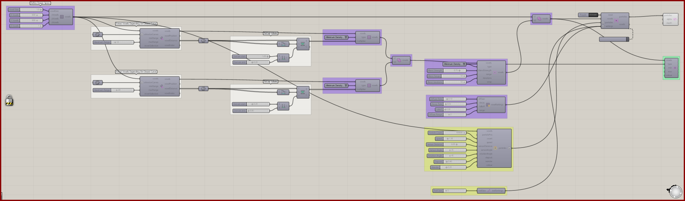
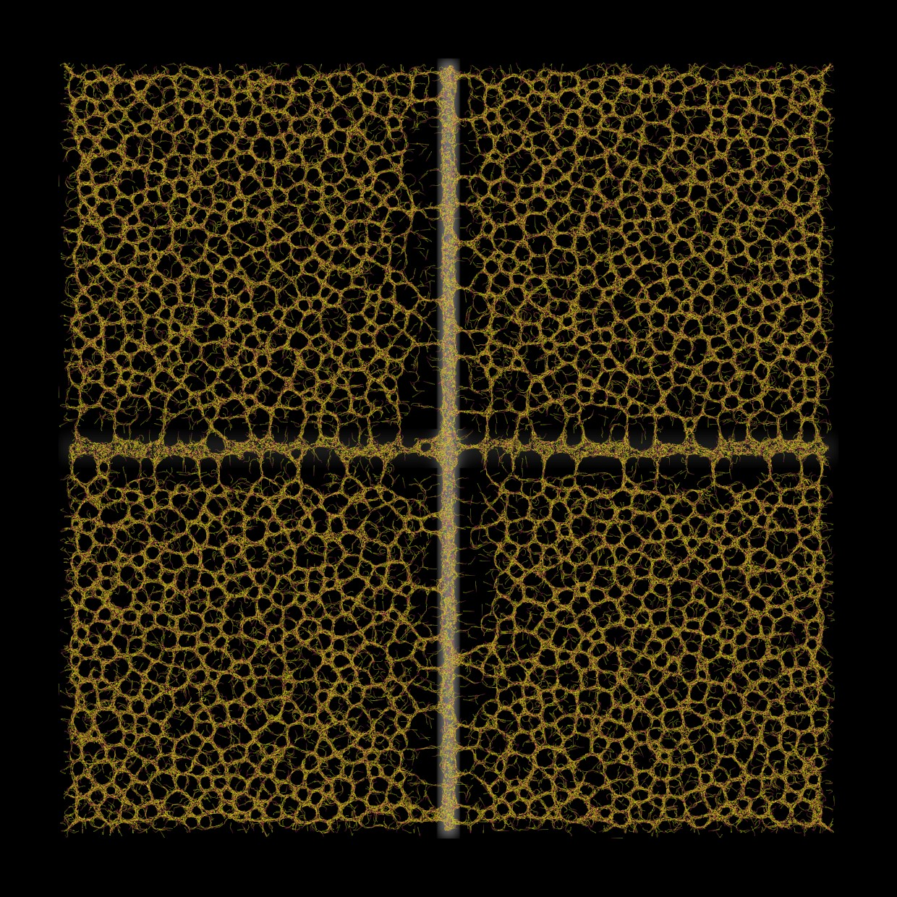

# Attractor Curves 2

Explore curve-driven density maps with an additional scalar blending stage.

[Download 07_Attractor Curves 2.gh](files/07-attractor-curves-2.gh)

*The saved definition, with its layout and values preserved. The capture is a canvas reference, not a newly simulated result.*

## Follow the definition

The saved graph assigns **Minimum Density**, combines the mapped branches, and includes **Voxel Values Blend**. Compare the field before and after blending to understand the transition between regions.

## Components to inspect

- [Construct Voxels](../components/construct-voxels.md)
- [Curve Attractor for Voxels](../components/curve-attractor-for-voxels.md)
- [Define Voxel Values](../components/define-voxel-values.md)
- [Voxel Selection Union](../components/voxel-selection-union.md)
- [Voxel Values Blend](../components/voxel-values-blend.md)
- [Voxel Preview](../components/voxel-preview.md)
- [Nuclei4 Solver GPU](../components/nuclei4-solver-gpu.md)
- [Voxel Settings Slime](../components/voxel-settings-slime.md)
- [Construct Slime Particles](../components/construct-slime-particles.md)
- [Particle Trail Preview](../components/particle-trail-preview.md)
- [Particle Trail Settings](../components/particle-trail-settings.md)

## Saved controls

These are directly connected slider and value-list settings read from this file. Other inputs may come from geometry, expressions, or values stored on the component. Repeated rows refer to separate instances.

| Component | Input | Saved control |
| --- | --- | --- |
| Construct Voxels | Voxel Size | 1 |
| Construct Voxels | X Voxels | 800 |
| Construct Voxels | Y Voxels | 800 |
| Construct Voxels | Z Voxels | 1 |
| Curve Attractor for Voxels | Maximum Range | 12 |
| Curve Attractor for Voxels | Maximum Range | 20 |
| Define Voxel Values | Type | Minimum Density |
| Define Voxel Values | Type | Minimum Density |
| Voxel Values Blend | Type | Minimum Density |
| Voxel Values Blend | Blend Strength | 0.75 |
| Voxel Values Blend | Blend Range | 10 |
| Voxel Values Blend | Blend Iterations | 10 |
| Voxel Preview | Type | Minimum Density |
| Nuclei4 Solver GPU | Reset | True |
| Voxel Settings Slime | Diffuse Rate | 0.1 |
| Voxel Settings Slime | Decay Rate | 0.03 |
| Voxel Settings Slime | Falloff | 0 |
| Voxel Settings Slime | Diffuse Range | 2 |
| Construct Slime Particles | Particle Count | 100000 |
| Construct Slime Particles | Speed | 1.3 |
| Construct Slime Particles | Sensor Distance | 6 |
| Construct Slime Particles | Sensor Angle | 45 |
| Construct Slime Particles | Rotation Angle | 45 |
| Construct Slime Particles | Deposit | 0.4 |
| Construct Slime Particles | Wander | 0.2 |
| Particle Trail Settings | Trail Size | 5 |

## Run the example

Open it in Rhino 9 with Nuclei V4, pause the existing Trigger, and inspect the mapped field. Reset once with True, return reset to False, and start the Trigger. Pause before editing several inputs or extracting a large result.

## Try a comparison

Adjust blend strength or iteration count one at a time. Keep the curve arrangement unchanged during that comparison.

## Example result

*Original result image supplied with this example. Your result depends on initial conditions and simulation duration.*

[Back to examples](README.md)
