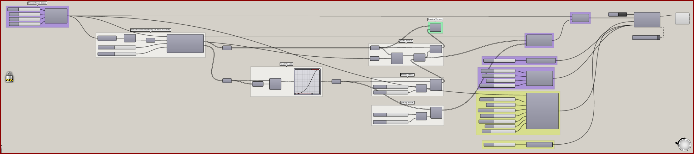
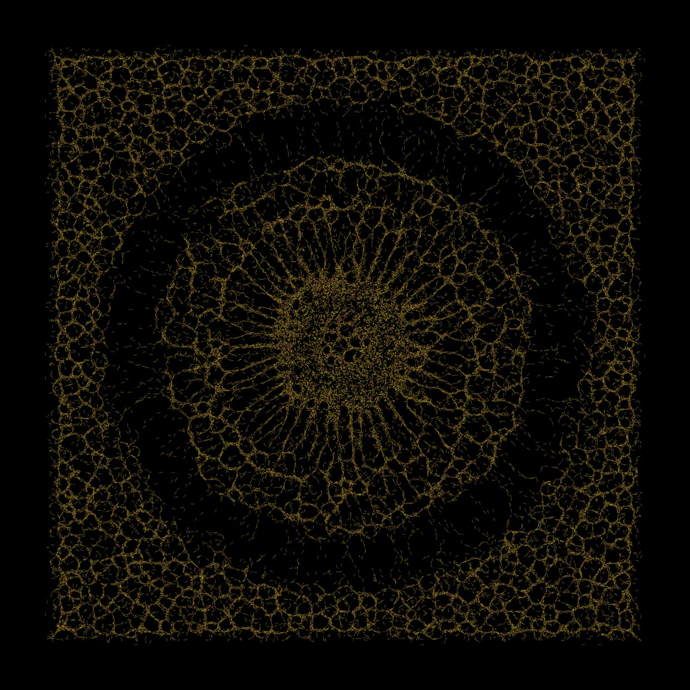

# Vector Fields 1

Guide movement with vectors assigned to the environment.

[Download 08_Vector Fields 1.gh](files/08-vector-fields-1.gh)

*The saved definition, with its layout and values preserved. The capture is a canvas reference, not a newly simulated result.*

## Follow the definition

Follow the geometric vector construction into **Define Voxel Vectors**. Point-attractor selections and the union determine which cells receive the map. The vector field acts alongside the slime behavior settings.

## Components to inspect

- [Construct Voxels](../components/construct-voxels.md)
- [Extract Voxel Bounding Box](../components/extract-voxel-bounding-box.md)
- [Point Attractor for Voxels](../components/point-attractor-for-voxels.md)
- [Define Voxel Vectors](../components/define-voxel-vectors.md)
- [Voxel Selection Union](../components/voxel-selection-union.md)
- [Nuclei4 Solver Iterations](../components/nuclei4-solver-iterations.md)
- [Nuclei4 Solver GPU](../components/nuclei4-solver-gpu.md)
- [Particle Trail Settings](../components/particle-trail-settings.md)
- [Voxel Settings Slime](../components/voxel-settings-slime.md)
- [Construct Slime Particles](../components/construct-slime-particles.md)
- [Particle Trail Preview](../components/particle-trail-preview.md)

## Saved controls

These are directly connected slider and value-list settings read from this file. Other inputs may come from geometry, expressions, or values stored on the component. Repeated rows refer to separate instances.

| Component | Input | Saved control |
| --- | --- | --- |
| Construct Voxels | Voxel Size | 1 |
| Construct Voxels | X Voxels | 800 |
| Construct Voxels | Y Voxels | 800 |
| Construct Voxels | Z Voxels | 1 |
| Point Attractor for Voxels | Minimum Range | 50 |
| Point Attractor for Voxels | Maximum Range | 300 |
| Nuclei4 Solver Iterations | Iterations | 300 |
| Nuclei4 Solver GPU | Reset | True |
| Particle Trail Settings | Trail Size | 5 |
| Voxel Settings Slime | Diffuse Rate | 0.1 |
| Voxel Settings Slime | Decay Rate | 0.03 |
| Voxel Settings Slime | Falloff | 0 |
| Voxel Settings Slime | Diffuse Range | 1 |
| Construct Slime Particles | Particle Count | 65000 |
| Construct Slime Particles | Speed | 1.3 |
| Construct Slime Particles | Sensor Distance | 6 |
| Construct Slime Particles | Sensor Angle | 45 |
| Construct Slime Particles | Rotation Angle | 45 |
| Construct Slime Particles | Deposit | 0.4 |
| Construct Slime Particles | Wander | 0 |

## Run the example

Open it in Rhino 9 with Nuclei V4, pause the existing Trigger, and inspect the mapped field. Reset once with True, return reset to False, and start the Trigger. Pause before editing several inputs or extracting a large result.

## Try a comparison

Change the mapped vector direction or frequency, then reset. Compare directional bias with the original saved setup.

## Example result

*Original result image supplied with this example. Your result depends on initial conditions and simulation duration.*

[Back to examples](README.md)
