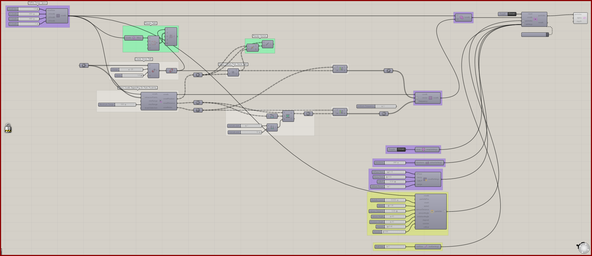
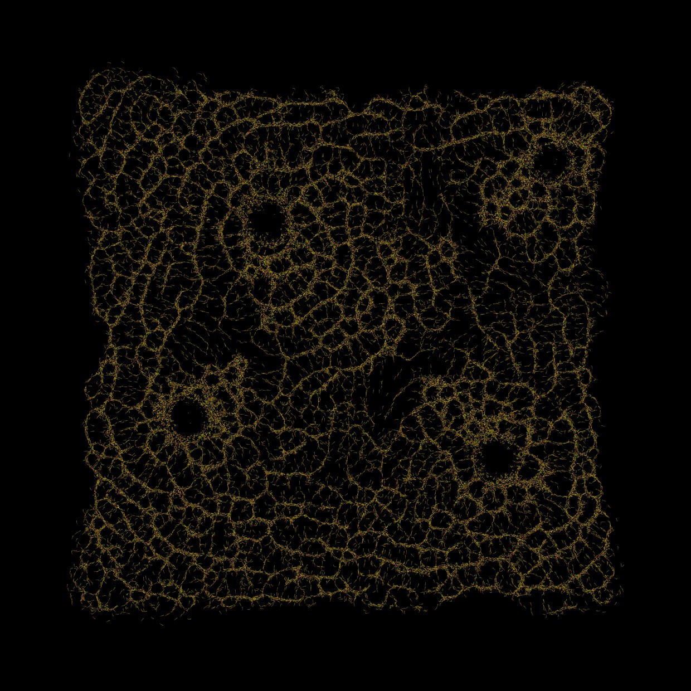

# Vector Fields 2

Map a field evaluated from Grasshopper point charges into the voxel environment.

[Download 09_Vector Fields 2.gh](files/09-vector-fields-2.gh)

*The saved definition, with its layout and values preserved. The capture is a canvas reference, not a newly simulated result.*

## Follow the definition

The saved graph contains charge construction, field merging, and field evaluation before **Define Voxel Vectors**. Inspect those directions before tracing the field into the solver.

## Components to inspect

- [Construct Voxels](../components/construct-voxels.md)
- [Extract Voxel Bounding Box](../components/extract-voxel-bounding-box.md)
- [Point Attractor for Voxels](../components/point-attractor-for-voxels.md)
- [Voxel Selection Union](../components/voxel-selection-union.md)
- [Define Voxel Vectors](../components/define-voxel-vectors.md)
- [Voxel Wrap Settings](../components/voxel-wrap-settings.md)
- [Nuclei4 Solver GPU](../components/nuclei4-solver-gpu.md)
- [Nuclei4 Solver Iterations](../components/nuclei4-solver-iterations.md)
- [Voxel Settings Slime](../components/voxel-settings-slime.md)
- [Construct Slime Particles](../components/construct-slime-particles.md)
- [Particle Trail Preview](../components/particle-trail-preview.md)
- [Particle Trail Settings](../components/particle-trail-settings.md)

## Saved controls

These are directly connected slider and value-list settings read from this file. Other inputs may come from geometry, expressions, or values stored on the component. Repeated rows refer to separate instances.

| Component | Input | Saved control |
| --- | --- | --- |
| Construct Voxels | Voxel Size | 1 |
| Construct Voxels | X Voxels | 800 |
| Construct Voxels | Y Voxels | 800 |
| Construct Voxels | Z Voxels | 1 |
| Point Attractor for Voxels | Maximum Range | 500 |
| Voxel Wrap Settings | Wrap | True |
| Nuclei4 Solver GPU | Reset | True |
| Nuclei4 Solver Iterations | Iterations | 200 |
| Voxel Settings Slime | Diffuse Rate | 0.1 |
| Voxel Settings Slime | Decay Rate | 0.03 |
| Voxel Settings Slime | Falloff | 0.5 |
| Voxel Settings Slime | Diffuse Range | 1 |
| Construct Slime Particles | Particle Count | 65000 |
| Construct Slime Particles | Speed | 1.3 |
| Construct Slime Particles | Sensor Distance | 6 |
| Construct Slime Particles | Sensor Angle | 45 |
| Construct Slime Particles | Rotation Angle | 45 |
| Construct Slime Particles | Deposit | 0.4 |
| Construct Slime Particles | Wander | 0 |
| Particle Trail Settings | Trail Size | 5 |

## Run the example

Open it in Rhino 9 with Nuclei V4, pause the existing Trigger, and inspect the mapped field. Reset once with True, return reset to False, and start the Trigger. Pause before editing several inputs or extracting a large result.

## Try a comparison

Move one charge in a copy while retaining the particle settings. Compare the field lines and the paths that the simulation develops.

## Example result

*Original result image supplied with this example. Your result depends on initial conditions and simulation duration.*

[Back to examples](README.md)
