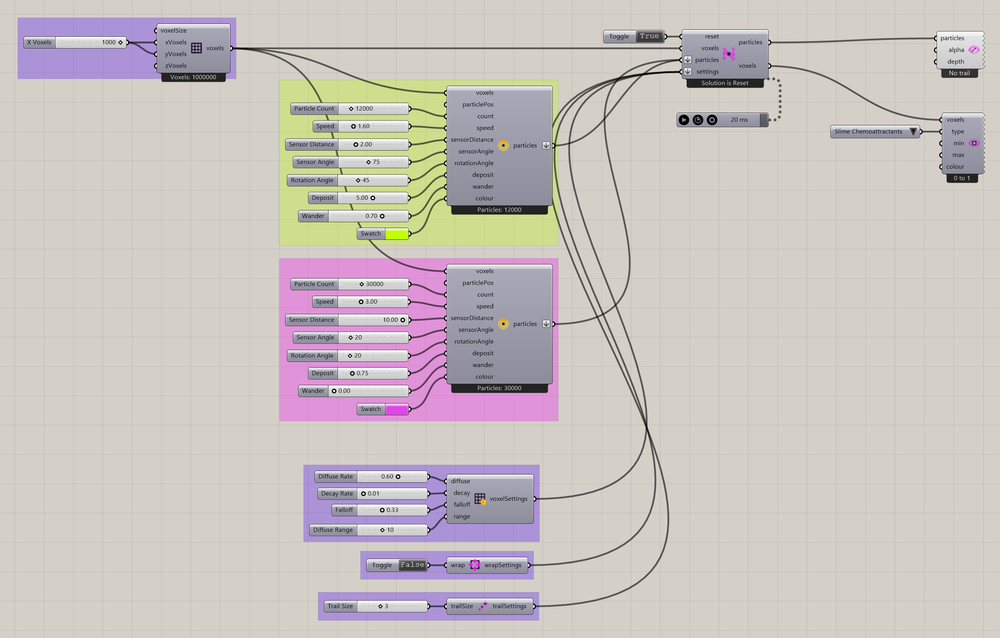
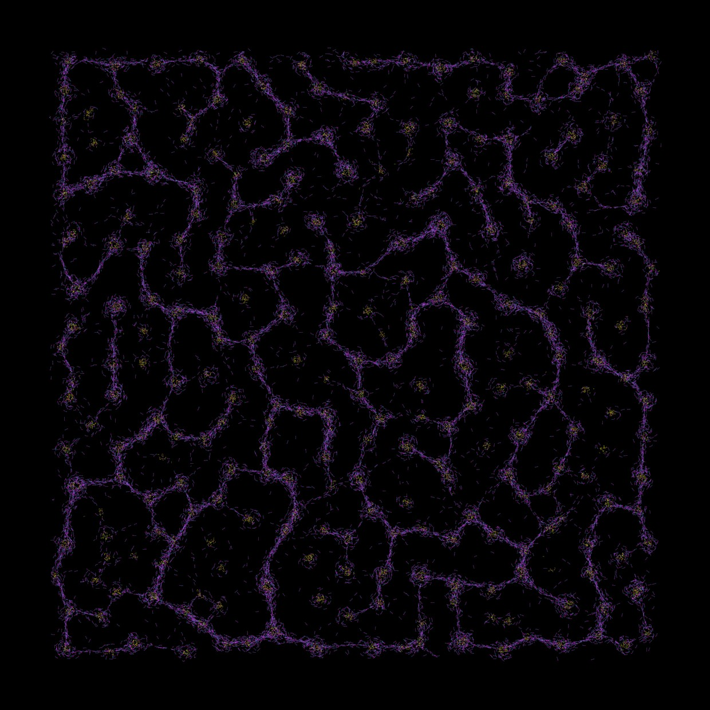

# Multiple Populations

Compare several slime groups sharing one environment and solver.

[Download 10_Multiple Populations.gh](files/10-multiple-populations.gh)

## Follow the definition

Follow each **Construct Slime Particles** output to the common solver. Group settings can differ while the voxel field remains shared. Read each constructor’s values rather than assuming all populations are identical.

## Components to inspect

- [Construct Voxels](../components/construct-voxels.md)
- [Nuclei4 Solver GPU](../components/nuclei4-solver-gpu.md)
- [Voxel Wrap Settings](../components/voxel-wrap-settings.md)
- [Voxel Settings Slime](../components/voxel-settings-slime.md)
- [Construct Slime Particles](../components/construct-slime-particles.md)
- [Voxel Preview](../components/voxel-preview.md)
- [Particle Trail Preview](../components/particle-trail-preview.md)
- [Particle Trail Settings](../components/particle-trail-settings.md)

## Saved controls

These are directly connected slider and value-list settings read from this file. Other inputs may come from geometry, expressions, or values stored on the component. Repeated rows refer to separate instances.

| Component | Input | Saved control |
| --- | --- | --- |
| Construct Voxels | X Voxels | 1000 |
| Construct Voxels | Y Voxels | 1000 |
| Nuclei4 Solver GPU | Reset | True |
| Voxel Wrap Settings | Wrap | False |
| Voxel Settings Slime | Diffuse Rate | 0.6 |
| Voxel Settings Slime | Decay Rate | 0.01 |
| Voxel Settings Slime | Falloff | 0.33 |
| Voxel Settings Slime | Diffuse Range | 10 |
| Construct Slime Particles | Particle Count | 30000 |
| Construct Slime Particles | Speed | 3 |
| Construct Slime Particles | Sensor Distance | 10 |
| Construct Slime Particles | Sensor Angle | 20 |
| Construct Slime Particles | Rotation Angle | 20 |
| Construct Slime Particles | Deposit | 0.75 |
| Construct Slime Particles | Wander | 0 |
| Construct Slime Particles | Particle Count | 12000 |
| Construct Slime Particles | Speed | 1.6 |
| Construct Slime Particles | Sensor Distance | 2 |
| Construct Slime Particles | Sensor Angle | 75 |
| Construct Slime Particles | Rotation Angle | 45 |
| Construct Slime Particles | Deposit | 5 |
| Construct Slime Particles | Wander | 0.7 |
| Voxel Preview | Type | Slime Chemoattractants |
| Particle Trail Settings | Trail Size | 3 |

## Run the example

Open it in Rhino 9 with Nuclei V4, pause the existing Trigger, and inspect the mapped field. Reset once with True, return reset to False, and start the Trigger. Pause before editing several inputs or extracting a large result.

## Try a comparison

Change one group’s Sensor Distance or color while keeping the others fixed. Use the colors to distinguish groups in the evolving preview.

## Example result

[Back to examples](README.md)
