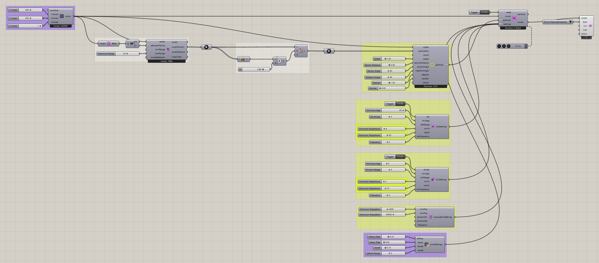
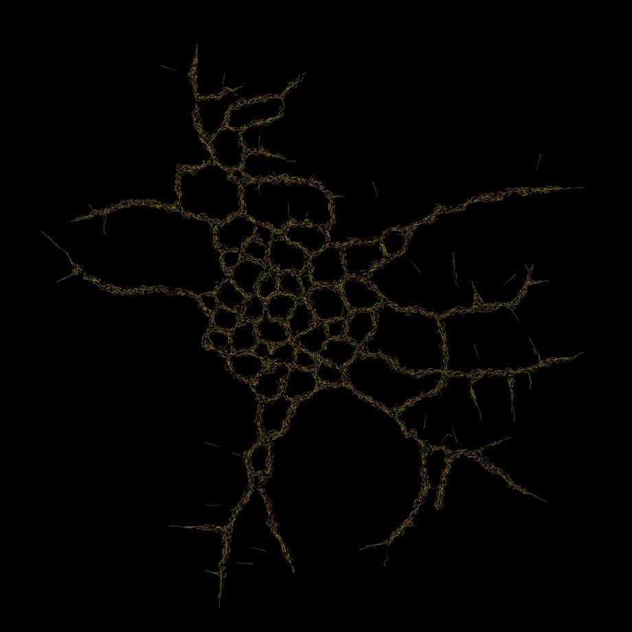

# Growth 1

Explore changing populations with division, death, and population settings.

[Download 11_Growth 1.gh](files/11-growth-1.gh)

*The saved definition, with its layout, groups, and values preserved. Group descriptions are hidden for clarity. The capture is a canvas reference, not a newly simulated result.*

## Follow the definition

The saved graph includes all three population-control components. Trace their outputs into settings and compare their activation switches, neighbor criteria, and population bounds before running.

## Components to inspect

- [Construct Voxels](../components/construct-voxels.md)
- [Extract Voxel Bounding Box](../components/extract-voxel-bounding-box.md)
- [Point Attractor for Voxels](../components/point-attractor-for-voxels.md)
- [Particle Death Settings](../components/particle-death-settings.md)
- [Particle Division Settings](../components/particle-division-settings.md)
- [Particle Population Settings](../components/particle-population-settings.md)
- [Nuclei4 Solver GPU](../components/nuclei4-solver-gpu.md)
- [Voxel Preview](../components/voxel-preview.md)
- [Voxel Settings Slime](../components/voxel-settings-slime.md)
- [Construct Slime Particles](../components/construct-slime-particles.md)

## Saved controls

These are directly connected slider and value-list settings read from this file. Other inputs may come from geometry, expressions, or values stored on the component. Repeated rows refer to separate instances.

| Component | Input | Saved control |
| --- | --- | --- |
| Construct Voxels | X Voxels | 500 |
| Construct Voxels | Y Voxels | 500 |
| Construct Voxels | Z Voxels | 1 |
| Point Attractor for Voxels | Maximum Range | 50 |
| Particle Death Settings | Die | True |
| Particle Death Settings | Minimum Age | 30 |
| Particle Death Settings | Die Range | 3 |
| Particle Death Settings | Minimum Neighbours | 4 |
| Particle Death Settings | Maximum Neighbours | 20 |
| Particle Death Settings | Frequency | 2 |
| Particle Division Settings | Divide | True |
| Particle Division Settings | Minimum Age | 5 |
| Particle Division Settings | Division Range | 3 |
| Particle Division Settings | Minimum Neighbours | 2 |
| Particle Division Settings | Maximum Neighbours | 10 |
| Particle Division Settings | Frequency | 2 |
| Particle Population Settings | Minimum Population | 2000 |
| Particle Population Settings | Maximum Population | 50000 |
| Nuclei4 Solver GPU | Reset | True |
| Voxel Preview | Type | Slime Chemoattractants |
| Voxel Settings Slime | Diffuse Rate | 0.25 |
| Voxel Settings Slime | Decay Rate | 0.03 |
| Voxel Settings Slime | Falloff | 0.1 |
| Voxel Settings Slime | Diffuse Range | 3 |
| Construct Slime Particles | Speed | 1 |
| Construct Slime Particles | Sensor Distance | 3 |
| Construct Slime Particles | Sensor Angle | 45 |
| Construct Slime Particles | Rotation Angle | 45 |
| Construct Slime Particles | Deposit | 1.5 |
| Construct Slime Particles | Wander | 0 |

## Run the example

Open it in Rhino 9 with Nuclei V4, pause the existing Trigger, and inspect the mapped field. Reset once with True, return reset to False, and start the Trigger. Pause before editing several inputs or extracting a large result.

## Try a comparison

Change one division or death control at a time. Reset between runs and compare population development rather than just the final image.

## Example result

*Original result image supplied with this example. Your result depends on initial conditions and simulation duration.*

[Back to examples](README.md)
