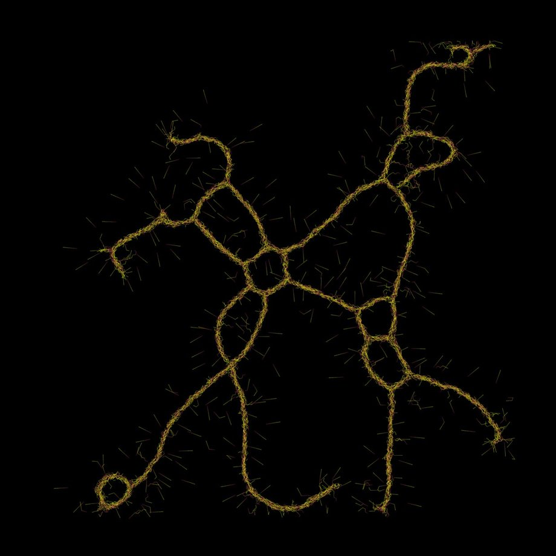
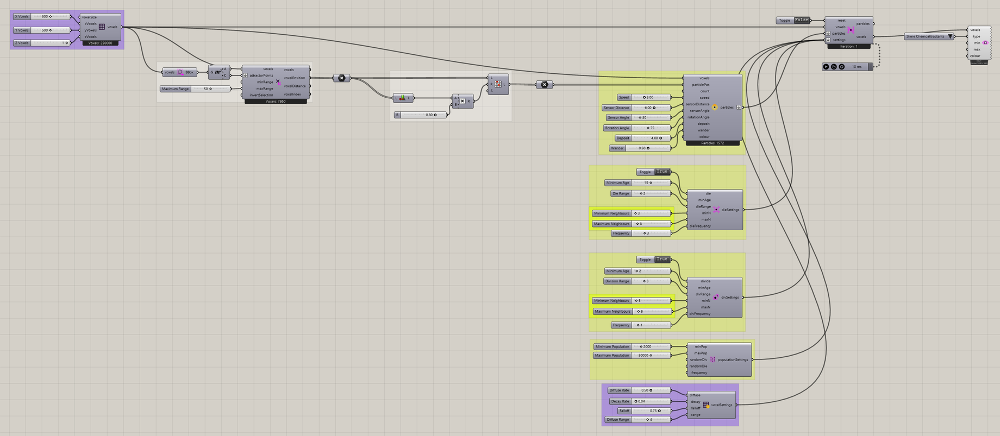

# Growth 2

Compare a second saved growth setup using the same families of population controls.

[Download 12_Growth 2.gh](files/12-growth-2.gh)

## Follow the definition

Use Growth 1 as the starting comparison. This file also combines local division/death settings with population controls; its saved values and initial selection define a separate experiment.

Components used

- [Construct Voxels](../components/construct-voxels.md)
- [Extract Voxel Bounding Box](../components/extract-voxel-bounding-box.md)
- [Point Attractor for Voxels](../components/point-attractor-for-voxels.md)
- [Particle Death Settings](../components/particle-death-settings.md)
- [Particle Division Settings](../components/particle-division-settings.md)
- [Particle Population Settings](../components/particle-population-settings.md)
- [Nuclei4 Solver GPU](../components/nuclei4-solver-gpu.md)
- [Voxel Preview](../components/voxel-preview.md)
- [Voxel Settings Slime](../components/voxel-settings-slime.md)
- [Construct Slime Particles](../components/construct-slime-particles.md)

Saved controls

Slider and value-list settings saved in this definition. Repeated rows belong to different component instances.

| Component | Input | Saved control |
| --- | --- | --- |
| Construct Voxels | X Voxels | 500 |
| Construct Voxels | Y Voxels | 500 |
| Construct Voxels | Z Voxels | 1 |
| Point Attractor for Voxels | Maximum Range | 50 |
| Particle Death Settings | Die | True |
| Particle Death Settings | Minimum Age | 15 |
| Particle Death Settings | Die Range | 2 |
| Particle Death Settings | Minimum Neighbours | 3 |
| Particle Death Settings | Maximum Neighbours | 8 |
| Particle Death Settings | Frequency | 3 |
| Particle Division Settings | Divide | True |
| Particle Division Settings | Minimum Age | 2 |
| Particle Division Settings | Division Range | 3 |
| Particle Division Settings | Minimum Neighbours | 5 |
| Particle Division Settings | Maximum Neighbours | 8 |
| Particle Division Settings | Frequency | 1 |
| Particle Population Settings | Minimum Population | 2000 |
| Particle Population Settings | Maximum Population | 50000 |
| Nuclei4 Solver GPU | Reset | False |
| Voxel Preview | Type | Slime Chemoattractants |
| Voxel Settings Slime | Diffuse Rate | 0.5 |
| Voxel Settings Slime | Decay Rate | 0.04 |
| Voxel Settings Slime | Falloff | 0.75 |
| Voxel Settings Slime | Diffuse Range | 4 |
| Construct Slime Particles | Speed | 3 |
| Construct Slime Particles | Sensor Distance | 6 |
| Construct Slime Particles | Sensor Angle | 30 |
| Construct Slime Particles | Rotation Angle | 75 |
| Construct Slime Particles | Deposit | 4 |
| Construct Slime Particles | Wander | 0.5 |

## Run the example

Open it in Rhino 9 with Nuclei V4, pause the existing Trigger, and inspect the mapped field. Reset once with True, return reset to False, and start the Trigger. Pause before editing several inputs or extracting a large result.

## Try a comparison

Compare saved settings between the two examples, then change only one parameter in a copy to isolate its effect.

## Example result

[Back to examples](README.md)
