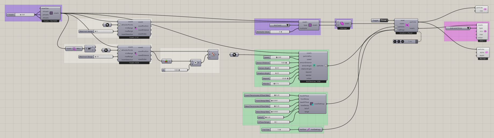

# Ants Intro — 3D

Extend the ant-foraging workflow into a three-dimensional voxel domain.

[Download 13_Ants Intro_3D.gh](files/13-ants-intro-3d.gh)

## Follow the definition

The grid is 250 × 250 × 250. The saved Ant Food multiplier is 3, and the ant constructor uses Deposit 20 and Wander 0.15. Inspect food and colony positions in more than one Rhino view before running.

Components used

- [Construct Voxels](../components/construct-voxels.md)
- [Point Attractor for Voxels](../components/point-attractor-for-voxels.md)
- [Extract Voxel Bounding Box](../components/extract-voxel-bounding-box.md)
- [Construct Ant Particles](../components/construct-ant-particles.md)
- [Voxel Settings Ant](../components/voxel-settings-ant.md)
- [Define Voxel Values](../components/define-voxel-values.md)
- [Voxel Selection Union](../components/voxel-selection-union.md)
- [Nuclei4 Solver GPU](../components/nuclei4-solver-gpu.md)
- [Voxel Preview](../components/voxel-preview.md)
- [Particle Preview](../components/particle-preview.md)
- [Particle Trail Preview](../components/particle-trail-preview.md)
- [Particle Trail Settings](../components/particle-trail-settings.md)

Saved controls

Slider and value-list settings saved in this definition. Repeated rows belong to different component instances.

| Component | Input | Saved control |
| --- | --- | --- |
| Construct Voxels | X Voxels | 250 |
| Construct Voxels | Y Voxels | 250 |
| Construct Voxels | Z Voxels | 250 |
| Point Attractor for Voxels | Maximum Range | 5 |
| Point Attractor for Voxels | Maximum Range | 10 |
| Construct Ant Particles | Speed | 3 |
| Construct Ant Particles | Sensor Distance | 9 |
| Construct Ant Particles | Sensor Angle | 45 |
| Construct Ant Particles | Rotation Angle | 45 |
| Construct Ant Particles | Deposit | 20 |
| Construct Ant Particles | Wander | 0.15 |
| Voxel Settings Ant | Food Pheromones Diffuse Rate | 0.2 |
| Voxel Settings Ant | Food Decay Rate | 0.0001 |
| Voxel Settings Ant | Base Pheromones Diffuse Rate | 0.2 |
| Voxel Settings Ant | Base Decay Rate | 0.0003 |
| Voxel Settings Ant | Diffuse Range | 2 |
| Define Voxel Values | Type | Ant Food |
| Define Voxel Values | Multiplier Value | 3 |
| Nuclei4 Solver GPU | Reset | True |
| Voxel Preview | Type | Ants and Slime |
| Particle Trail Settings | Trail Size | 5 |

## Run the example

Open it in Rhino 9 with Nuclei V4, pause the existing Trigger, and inspect the mapped field. Reset once with True, return reset to False, and start the Trigger. Pause before editing several inputs or extracting a large result.

## Try a comparison

Compare different viewpoints before changing parameters: overlapping 3D paths can look connected in projection even when they are separate in space.

[Back to examples](README.md)
