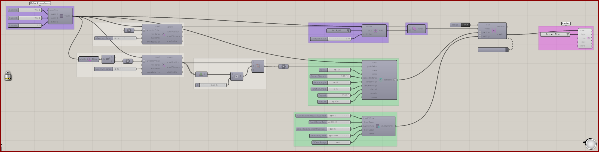
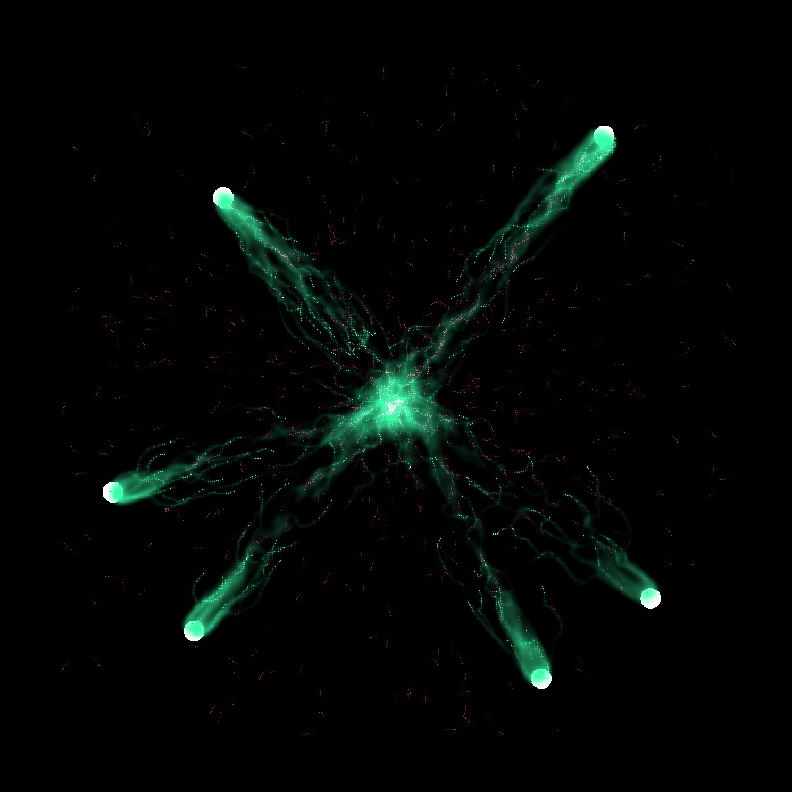

# Ants Intro

Follow a basic 2D ant-foraging setup from colony positions to food and pheromone fields.

[Download 13_Ants Intro.gh](files/13-ants-intro.gh)

*The saved definition, with its layout and values preserved. The capture is a canvas reference, not a newly simulated result.*

## Follow the definition

The point-attractor and voxel-center chains establish initial positions and food regions. **Define Voxel Values** is set to **Ant Food**, with a saved multiplier of 5. **Voxel Settings Ant** controls the two pheromone fields.

## Components to inspect

- [Construct Voxels](../components/construct-voxels.md)
- [Point Attractor for Voxels](../components/point-attractor-for-voxels.md)
- [Extract Voxel Bounding Box](../components/extract-voxel-bounding-box.md)
- [Construct Ant Particles](../components/construct-ant-particles.md)
- [Voxel Settings Ant](../components/voxel-settings-ant.md)
- [Define Voxel Values](../components/define-voxel-values.md)
- [Voxel Selection Union](../components/voxel-selection-union.md)
- [Nuclei4 Solver GPU](../components/nuclei4-solver-gpu.md)
- [Voxel Preview](../components/voxel-preview.md)

## Saved controls

These are directly connected slider and value-list settings read from this file. Other inputs may come from geometry, expressions, or values stored on the component. Repeated rows refer to separate instances.

| Component | Input | Saved control |
| --- | --- | --- |
| Construct Voxels | X Voxels | 1000 |
| Construct Voxels | Y Voxels | 1000 |
| Construct Voxels | Z Voxels | 1 |
| Point Attractor for Voxels | Maximum Range | 15 |
| Point Attractor for Voxels | Maximum Range | 30 |
| Construct Ant Particles | Speed | 3 |
| Construct Ant Particles | Sensor Distance | 9 |
| Construct Ant Particles | Sensor Angle | 45 |
| Construct Ant Particles | Rotation Angle | 45 |
| Construct Ant Particles | Deposit | 10 |
| Construct Ant Particles | Wander | 0.2 |
| Voxel Settings Ant | Food Pheromones Diffuse Rate | 0.1 |
| Voxel Settings Ant | Food Decay Rate | 0.003 |
| Voxel Settings Ant | Base Pheromones Diffuse Rate | 0.1 |
| Voxel Settings Ant | Base Decay Rate | 0.05 |
| Voxel Settings Ant | Diffuse Range | 4 |
| Define Voxel Values | Type | Ant Food |
| Define Voxel Values | Multiplier Value | 5 |
| Nuclei4 Solver GPU | Reset | True |
| Voxel Preview | Type | Ants and Slime |

## Run the example

Open it in Rhino 9 with Nuclei V4, pause the existing Trigger, and inspect the mapped field. Reset once with True, return reset to False, and start the Trigger. Pause before editing several inputs or extracting a large result.

## Try a comparison

Let the colony explore before judging the network. Compare searching and returning routes; change one food or pheromone control after a reset.

## Example result

*Original result image supplied with this example. Your result depends on initial conditions and simulation duration.*

[Back to examples](README.md)
