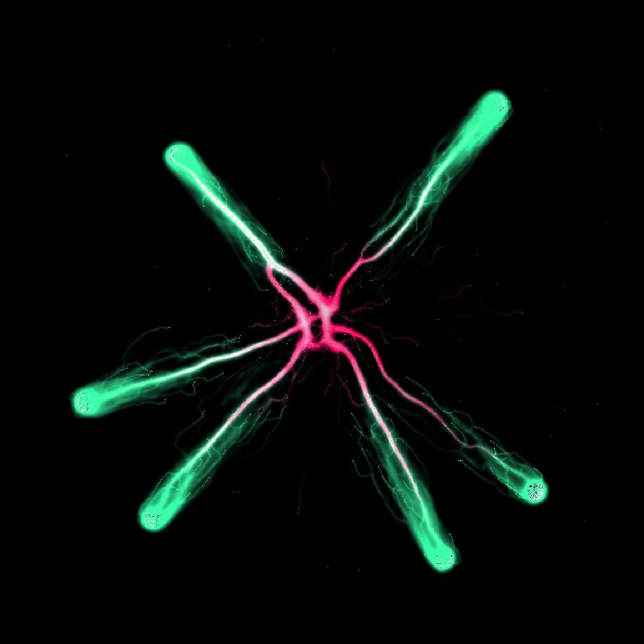
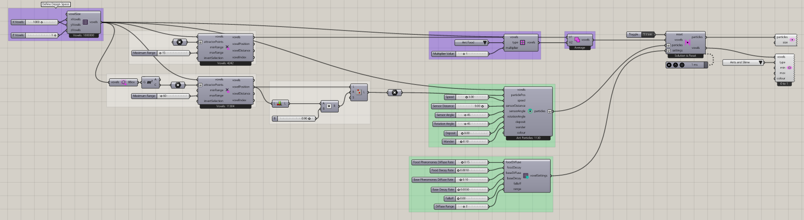

# Ants Intro

Watch ants discover food and establish routes back to their colony in a flat voxel environment. Starting positions define where the ants begin and remember home, while selected regions receive Ant Food. As ants search and return, they leave separate pheromone signals that guide movement toward food and back to the colony.

Diffusion spreads those signals into nearby cells, and decay controls how long they remain. Follow the change from early exploration to routes reinforced by repeated journeys. Use this example to learn the basic ant workflow and explore how food placement and pheromone settings affect the paths that develop.



[Download 16\_Ants Intro.gh](files/13-ants-intro.gh)



## Follow the definition

The point-attractor and voxel-center chains establish initial positions and food regions. [Define Voxel Values](../components/define-voxel-values.md) is set to **Ant Food**, with a saved multiplier of 1. [Voxel Settings Ant](../components/voxel-settings-ant.md) controls the two pheromone fields.

<details>

<summary>Components used</summary>

* [Construct Voxels](../components/construct-voxels.md)
* [Point Attractor for Voxels](../components/point-attractor-for-voxels.md)
* [Extract Voxel Bounding Box](../components/extract-voxel-bounding-box.md)
* [Construct Ant Particles](../components/construct-ant-particles.md)
* [Voxel Settings Ant](../components/voxel-settings-ant.md)
* [Define Voxel Values](../components/define-voxel-values.md)
* [Voxel Selection Union](../components/voxel-selection-union.md)
* [Nuclei4 Solver GPU](../components/nuclei4-solver-gpu.md)
* [Voxel Preview](../components/voxel-preview.md)
* [Particle Preview](../components/particle-preview.md)

</details>

<details>

<summary>Saved controls</summary>

Slider and value-list settings saved in this definition. Repeated rows belong to different component instances.

| Component                  | Input                        | Saved control  |
| -------------------------- | ---------------------------- | -------------- |
| Construct Voxels           | X Voxels                     | 1000           |
| Construct Voxels           | Y Voxels                     | 1000           |
| Construct Voxels           | Z Voxels                     | 1              |
| Point Attractor for Voxels | Maximum Range                | 15             |
| Point Attractor for Voxels | Maximum Range                | 60             |
| Construct Ant Particles    | Speed                        | 3              |
| Construct Ant Particles    | Sensor Distance              | 9              |
| Construct Ant Particles    | Sensor Angle                 | 45             |
| Construct Ant Particles    | Rotation Angle               | 45             |
| Construct Ant Particles    | Deposit                      | 8              |
| Construct Ant Particles    | Wander                       | 0.1            |
| Voxel Settings Ant         | Food Pheromones Diffuse Rate | 0.15           |
| Voxel Settings Ant         | Food Decay Rate              | 0.001          |
| Voxel Settings Ant         | Base Pheromones Diffuse Rate | 0.1            |
| Voxel Settings Ant         | Base Decay Rate              | 0.003          |
| Voxel Settings Ant         | Falloff                      | 0              |
| Voxel Settings Ant         | Diffuse Range                | 2              |
| Define Voxel Values        | Type                         | Ant Food       |
| Define Voxel Values        | Multiplier Value             | 1              |
| Nuclei4 Solver GPU         | Reset                        | True           |
| Voxel Preview              | Type                         | Ants and Slime |

</details>

## Run the example

Open it in Rhino 9 with Nuclei V4, pause the existing Trigger, and inspect the mapped field. Reset once with True, return reset to False, and start the Trigger. Pause before editing several inputs or extracting a large result.

## Try a comparison

Let the colony explore before judging the network. Compare searching and returning routes; change one food or pheromone control after a reset.

## Example result


[Back to examples](./)

<details>

<summary>Grasshopper definition (JSON)</summary>

[Download JSON](data/13-ants-intro.json) · [JSON Schema](../reference/definition.schema.json) · [How to read this JSON](../reference/reading-json.md)

This records the saved definition. Geometry and other binary payloads remain in the original `.gh` file.

```json
{
  "$schema": "../../reference/definition.schema.json",
  "schemaVersion": 1,
  "title": "Ants Intro",
  "source": {"file":"../files/13-ants-intro.gh","sha256":"50a9694626884ca367365240f546e9958b8519fd7c005f6c3438191abdfc0512","documentId":"014084e4-ea51-4fb6-8b8f-2d10c8914d28"},
  "extraction": {"method":"GH_IO archive read without loading components or solving","coverage":"All saved top-level objects and Source wires; not an executable replacement for the .gh file","limitations":["Binary geometry and image payloads are omitted and identified by archive XML hashes.","External files and Rhino document geometry are not bundled. Inspect saved paths and references.","Runtime outputs, nested cluster internals and plugin-specific behavior are not reconstructed.","Saved library versions describe the archive, not a guarantee of compatibility with newer components."],"omittedBinaryPaths":[],"unresolvedGroupMembers":[{"groupId":"f676dd02-e256-4c18-8fbd-90e9413a0586","memberId":"08db4c8d-be27-44d9-833a-b984bbeb5a1d"},{"groupId":"f676dd02-e256-4c18-8fbd-90e9413a0586","memberId":"475c3be5-e83b-484a-9407-3f10b1eb5699"},{"groupId":"f676dd02-e256-4c18-8fbd-90e9413a0586","memberId":"967d0b88-1c52-4161-8ec2-4f552a64c0eb"},{"groupId":"fa1cb0c3-2e2f-4d30-a8e0-b9874c1cbd9c","memberId":"fd729ef3-ca46-4a5f-801b-fca8f25bb4b7"},{"groupId":"fa1cb0c3-2e2f-4d30-a8e0-b9874c1cbd9c","memberId":"6f85cc9d-a2de-4523-9f81-25c3481d2ffa"},{"groupId":"fa1cb0c3-2e2f-4d30-a8e0-b9874c1cbd9c","memberId":"96a3b0a6-bd50-4367-ae71-841934d2325d"},{"groupId":"8f142ec2-4073-493a-8a41-dc01f7fdcd97","memberId":"4b6b5af3-123e-43bf-82a2-096fc3992d85"},{"groupId":"8f142ec2-4073-493a-8a41-dc01f7fdcd97","memberId":"d0cf1670-701f-4ea6-94b5-de3fa7705e95"},{"groupId":"8f142ec2-4073-493a-8a41-dc01f7fdcd97","memberId":"865ef894-ba9b-4ad0-bc2f-dc52c9ca43b0"},{"groupId":"8f142ec2-4073-493a-8a41-dc01f7fdcd97","memberId":"c9009a18-824d-48d5-86db-b46112930d02"},{"groupId":"d4f37070-583b-4222-8313-b61d74155dc3","memberId":"12246923-96f8-4909-b8e3-95e058081429"},{"groupId":"d4f37070-583b-4222-8313-b61d74155dc3","memberId":"0b2d8099-07dc-4d60-aefe-ddb07b184e9f"},{"groupId":"d4f37070-583b-4222-8313-b61d74155dc3","memberId":"3c34396b-f62a-4c86-92ff-92cd93c44497"},{"groupId":"d4f37070-583b-4222-8313-b61d74155dc3","memberId":"2a78054a-4d37-4bdb-bb20-0e0b8ecd25cd"},{"groupId":"d4f37070-583b-4222-8313-b61d74155dc3","memberId":"6f811524-edd2-492a-a342-170f2d4863c0"},{"groupId":"d4f37070-583b-4222-8313-b61d74155dc3","memberId":"729cb0ee-a652-4d9b-a126-8f4a70098555"},{"groupId":"d4f37070-583b-4222-8313-b61d74155dc3","memberId":"9d5ce7c9-4a6a-4878-999e-7da03d25094f"},{"groupId":"d4f37070-583b-4222-8313-b61d74155dc3","memberId":"0d9a5ebd-8321-47bb-b5d1-b9450998cfbe"},{"groupId":"d4f37070-583b-4222-8313-b61d74155dc3","memberId":"6de31f19-b614-4538-8155-db2a1a500ff7"},{"groupId":"52c1cbc1-37ef-4053-8547-c87eb55de275","memberId":"57bd719d-177d-4272-91f1-92a5305c1626"},{"groupId":"39aaa0e2-df1a-45f2-b9da-e94bfcd24ec4","memberId":"8a28dff1-8666-4e22-8aa8-f6f3e4c8fd9a"},{"groupId":"542d2a07-6ffa-4c71-8856-f21f1cd37dc1","memberId":"d08536e2-9eeb-4860-b9bf-4e03cedd3b51"},{"groupId":"960f9eae-0913-4cc5-8f66-3b0c093aa17d","memberId":"803219f4-1514-4359-9b4e-ca02f1a373e8"},{"groupId":"1bf186d4-3066-480f-adf4-f451c4c8416a","memberId":"a0535faf-3fb5-42fe-9409-c4e732fa9d83"},{"groupId":"c30dec0f-fd9e-4c21-86bd-1c9fcd8d4d18","memberId":"522a030e-3c40-43ca-b572-903f6ff3f02d"},{"groupId":"9bfface5-f686-4346-9892-a5847b027c8e","memberId":"a7d2243c-413c-46b8-adca-55ec28149cba"},{"groupId":"9bfface5-f686-4346-9892-a5847b027c8e","memberId":"1d370454-3239-46c7-99a2-0bf12be0680f"},{"groupId":"9bfface5-f686-4346-9892-a5847b027c8e","memberId":"d17d89a9-f20f-4c56-81f2-a5d7d79d8f29"},{"groupId":"9bfface5-f686-4346-9892-a5847b027c8e","memberId":"14cb4365-e69f-43b0-90ca-6bee8f236434"},{"groupId":"9bfface5-f686-4346-9892-a5847b027c8e","memberId":"cf653ef9-20fd-4bc4-bb4c-a6329220e6eb"},{"groupId":"9bfface5-f686-4346-9892-a5847b027c8e","memberId":"91ad3c62-9413-479c-977e-0e9d6e44f961"},{"groupId":"9bfface5-f686-4346-9892-a5847b027c8e","memberId":"d8cf24b4-b615-40b6-8be0-ac63e6494cc1"},{"groupId":"9bfface5-f686-4346-9892-a5847b027c8e","memberId":"ba56bb6b-c00f-4feb-ad3c-df51f26c575b"},{"groupId":"9bfface5-f686-4346-9892-a5847b027c8e","memberId":"c07d4312-8825-41ac-97ba-098fe57da03e"},{"groupId":"9bfface5-f686-4346-9892-a5847b027c8e","memberId":"01c86158-47d6-49a0-a8bb-8e3a83cd74a5"},{"groupId":"9bfface5-f686-4346-9892-a5847b027c8e","memberId":"a8dc238a-445f-4569-924f-3fc2523791e5"},{"groupId":"2d4eaec4-a3f9-4186-95de-dcd83ed428a8","memberId":"c29ecd8c-05ff-4ad3-81ce-8e4bc22cfcad"},{"groupId":"2d4eaec4-a3f9-4186-95de-dcd83ed428a8","memberId":"5ddaea23-b7bd-4b45-b5e4-f1caae0ad680"},{"groupId":"2d4eaec4-a3f9-4186-95de-dcd83ed428a8","memberId":"2b9fef48-aa11-44c1-8c34-ebf2b24413c6"},{"groupId":"2d4eaec4-a3f9-4186-95de-dcd83ed428a8","memberId":"9edef2c5-9afd-486b-be99-f229bb7a883b"},{"groupId":"2d4eaec4-a3f9-4186-95de-dcd83ed428a8","memberId":"1fc89982-62d1-4a91-9040-7f8645391bfc"},{"groupId":"2d4eaec4-a3f9-4186-95de-dcd83ed428a8","memberId":"604a8979-2bb5-4b01-b0ac-f096fa428a88"},{"groupId":"2d4eaec4-a3f9-4186-95de-dcd83ed428a8","memberId":"8aca3f76-7824-4f4a-8445-62696d299b71"},{"groupId":"2d4eaec4-a3f9-4186-95de-dcd83ed428a8","memberId":"72c7e9c0-0615-4217-acb4-b42fb61e5405"},{"groupId":"2d4eaec4-a3f9-4186-95de-dcd83ed428a8","memberId":"e7be6015-c52c-4342-8381-45caf039f281"},{"groupId":"2d4eaec4-a3f9-4186-95de-dcd83ed428a8","memberId":"e8acc498-316a-4bcd-a973-c0bffb34986e"},{"groupId":"2d4eaec4-a3f9-4186-95de-dcd83ed428a8","memberId":"648adcf0-a53d-4e38-b201-684abcdab28b"},{"groupId":"ec65dead-8b2e-4e6a-a636-7ef4c6ac20cf","memberId":"d17d89a9-f20f-4c56-81f2-a5d7d79d8f29"},{"groupId":"d7976a45-b21d-4dee-87b7-dafc6140abd7","memberId":"482048c4-0999-420c-b63d-e691a7553fff"},{"groupId":"f3f35929-693e-44aa-ae86-eb802a862199","memberId":"fe1cede7-af3d-49e5-8910-e60b2cccff7c"},{"groupId":"aa7d3784-b590-4092-b17a-26f831c2e74b","memberId":"f27c40d4-99db-4245-8d49-fcf32453d3d2"},{"groupId":"6fbe8843-6186-4c44-a47e-4fa6ea3bc25c","memberId":"74cf5589-b442-4fb7-b07d-1ba55b7f26b7"},{"groupId":"6fbe8843-6186-4c44-a47e-4fa6ea3bc25c","memberId":"1d370454-3239-46c7-99a2-0bf12be0680f"},{"groupId":"6fbe8843-6186-4c44-a47e-4fa6ea3bc25c","memberId":"d17d89a9-f20f-4c56-81f2-a5d7d79d8f29"},{"groupId":"6fbe8843-6186-4c44-a47e-4fa6ea3bc25c","memberId":"14cb4365-e69f-43b0-90ca-6bee8f236434"},{"groupId":"6fbe8843-6186-4c44-a47e-4fa6ea3bc25c","memberId":"80ff6d67-6aef-455c-ba7f-b5f781651258"},{"groupId":"6fbe8843-6186-4c44-a47e-4fa6ea3bc25c","memberId":"482048c4-0999-420c-b63d-e691a7553fff"},{"groupId":"6fbe8843-6186-4c44-a47e-4fa6ea3bc25c","memberId":"fe1cede7-af3d-49e5-8910-e60b2cccff7c"},{"groupId":"6fbe8843-6186-4c44-a47e-4fa6ea3bc25c","memberId":"f27c40d4-99db-4245-8d49-fcf32453d3d2"},{"groupId":"6fbe8843-6186-4c44-a47e-4fa6ea3bc25c","memberId":"f6b049d4-154b-4da0-8a5a-c2d49c0cb3be"},{"groupId":"14a37f42-e9ca-4754-b17b-f550512332a5","memberId":"136d1a63-5d52-4577-b326-8eeedda41565"},{"groupId":"b13a5318-9817-4056-bc69-0c5c526926a3","memberId":"0634a752-aeb7-4489-852b-d0346811ee45"}]},
  "libraries": [{"name":"Library","items":[{"name":"Author","type":"gh_string","value":"Robert McNeel & Associates"},{"name":"Id","type":"gh_guid","value":"00000000-0000-0000-0000-000000000000"},{"name":"Name","type":"gh_string","value":"Grasshopper"},{"name":"Version","type":"gh_string","value":"9.0.26251.12303"}],"chunks":[],"index":0},{"name":"Library","items":[{"name":"Author","type":"gh_string","value":"Robert McNeel & Associates"},{"name":"Id","type":"gh_guid","value":"00000000-0000-0000-0000-000000000000"},{"name":"Name","type":"gh_string","value":"Grasshopper"},{"name":"Version","type":"gh_string","value":"9.0.26251.12303"}],"chunks":[],"index":1},{"name":"Library","items":[{"name":"Author","type":"gh_string","value":"Robert McNeel & Associates"},{"name":"Id","type":"gh_guid","value":"00000000-0000-0000-0000-000000000000"},{"name":"Name","type":"gh_string","value":"Grasshopper"},{"name":"Version","type":"gh_string","value":"9.0.26251.12303"}],"chunks":[],"index":2},{"name":"Library","items":[{"name":"AssemblyFullName","type":"gh_string","value":"Nuclei4, Version=4.1.0.0, Culture=neutral, PublicKeyToken=null"},{"name":"AssemblyVersion","type":"gh_string","value":"4.1.0.0"},{"name":"Author","type":"gh_string","value":"Madalin Gheorghe"},{"name":"Id","type":"gh_guid","value":"a4810f34-10b6-480c-a6d0-607aac4e8d2a"},{"name":"Name","type":"gh_string","value":"Nuclei4"},{"name":"Version","type":"gh_string","value":""}],"chunks":[],"index":3}],
  "nodes": [
    {"id":"f676dd02-e256-4c18-8fbd-90e9413a0586","componentGuid":"c552a431-af5b-46a9-a8a4-0fcbc27ef596","name":"Group","nickname":"","libraryId":null,"inputs":[],"outputs":[],"savedState":{"name":"Container","items":[{"name":"Border","type":"gh_int32","value":"1"},{"name":"Colour","type":"gh_drawing_color","xmlValue":"<item name=\"Colour\" type_name=\"gh_drawing_color\" type_code=\"36\">\n                      <ARGB>75;76;0;255</ARGB>\n                    </item>"},{"name":"Description","type":"gh_string","value":"A group of Grasshopper objects"},{"name":"ID","type":"gh_guid","index":0,"value":"08db4c8d-be27-44d9-833a-b984bbeb5a1d"},{"name":"ID","type":"gh_guid","index":1,"value":"d9ff5817-2bff-424b-b03e-f670fb88cec8"},{"name":"ID","type":"gh_guid","index":2,"value":"4e530e47-222e-461f-bbac-d06aa8b29733"},{"name":"ID","type":"gh_guid","index":3,"value":"475c3be5-e83b-484a-9407-3f10b1eb5699"},{"name":"ID","type":"gh_guid","index":4,"value":"967d0b88-1c52-4161-8ec2-4f552a64c0eb"},{"name":"ID","type":"gh_guid","index":5,"value":"ca47dc7c-e849-45aa-a85b-bf051867bda2"},{"name":"ID_Count","type":"gh_int32","value":"6"},{"name":"InstanceGuid","type":"gh_guid","value":"f676dd02-e256-4c18-8fbd-90e9413a0586"},{"name":"Name","type":"gh_string","value":"Group"},{"name":"NickName","type":"gh_string","value":""}],"chunks":[]},"canvas":{"name":"Attributes","items":[],"chunks":[]},"groupMembers":["08db4c8d-be27-44d9-833a-b984bbeb5a1d","d9ff5817-2bff-424b-b03e-f670fb88cec8","4e530e47-222e-461f-bbac-d06aa8b29733","475c3be5-e83b-484a-9407-3f10b1eb5699","967d0b88-1c52-4161-8ec2-4f552a64c0eb","ca47dc7c-e849-45aa-a85b-bf051867bda2"]},
    {"id":"fa1cb0c3-2e2f-4d30-a8e0-b9874c1cbd9c","componentGuid":"c552a431-af5b-46a9-a8a4-0fcbc27ef596","name":"Group","nickname":"","libraryId":null,"inputs":[],"outputs":[],"savedState":{"name":"Container","items":[{"name":"Border","type":"gh_int32","value":"1"},{"name":"Colour","type":"gh_drawing_color","xmlValue":"<item name=\"Colour\" type_name=\"gh_drawing_color\" type_code=\"36\">\n                      <ARGB>75;66;236;122</ARGB>\n                    </item>"},{"name":"Description","type":"gh_string","value":"A group of Grasshopper objects"},{"name":"ID","type":"gh_guid","index":0,"value":"fd729ef3-ca46-4a5f-801b-fca8f25bb4b7"},{"name":"ID","type":"gh_guid","index":1,"value":"6f85cc9d-a2de-4523-9f81-25c3481d2ffa"},{"name":"ID","type":"gh_guid","index":2,"value":"952866b1-3adb-49da-a393-2a931ee6fe8f"},{"name":"ID","type":"gh_guid","index":3,"value":"1b733e1b-d6bd-4720-889c-ca9109856fcf"},{"name":"ID","type":"gh_guid","index":4,"value":"8e77903d-23b6-464d-8c81-4d5ab69fa7db"},{"name":"ID","type":"gh_guid","index":5,"value":"3dd3d853-ceea-4724-80f7-1dd167f1b8ce"},{"name":"ID","type":"gh_guid","index":6,"value":"e90a525e-baf7-4a88-a5cb-c2fd86aea698"},{"name":"ID","type":"gh_guid","index":7,"value":"96a3b0a6-bd50-4367-ae71-841934d2325d"},{"name":"ID","type":"gh_guid","index":8,"value":"86d4c54a-5e53-4874-b24b-031b5a1c14f7"},{"name":"ID","type":"gh_guid","index":9,"value":"8e10532a-b2d6-401a-ae92-9a6a2942c757"},{"name":"ID_Count","type":"gh_int32","value":"10"},{"name":"InstanceGuid","type":"gh_guid","value":"fa1cb0c3-2e2f-4d30-a8e0-b9874c1cbd9c"},{"name":"Name","type":"gh_string","value":"Group"},{"name":"NickName","type":"gh_string","value":""}],"chunks":[]},"canvas":{"name":"Attributes","items":[],"chunks":[]},"groupMembers":["fd729ef3-ca46-4a5f-801b-fca8f25bb4b7","6f85cc9d-a2de-4523-9f81-25c3481d2ffa","952866b1-3adb-49da-a393-2a931ee6fe8f","1b733e1b-d6bd-4720-889c-ca9109856fcf","8e77903d-23b6-464d-8c81-4d5ab69fa7db","3dd3d853-ceea-4724-80f7-1dd167f1b8ce","e90a525e-baf7-4a88-a5cb-c2fd86aea698","96a3b0a6-bd50-4367-ae71-841934d2325d","86d4c54a-5e53-4874-b24b-031b5a1c14f7","8e10532a-b2d6-401a-ae92-9a6a2942c757"]},
    {"id":"8f142ec2-4073-493a-8a41-dc01f7fdcd97","componentGuid":"c552a431-af5b-46a9-a8a4-0fcbc27ef596","name":"Group","nickname":"","libraryId":null,"inputs":[],"outputs":[],"savedState":{"name":"Container","items":[{"name":"Border","type":"gh_int32","value":"1"},{"name":"Colour","type":"gh_drawing_color","xmlValue":"<item name=\"Colour\" type_name=\"gh_drawing_color\" type_code=\"36\">\n                      <ARGB>75;66;236;122</ARGB>\n                    </item>"},{"name":"Description","type":"gh_string","value":"A group of Grasshopper objects"},{"name":"ID","type":"gh_guid","index":0,"value":"4b6b5af3-123e-43bf-82a2-096fc3992d85"},{"name":"ID","type":"gh_guid","index":1,"value":"d0cf1670-701f-4ea6-94b5-de3fa7705e95"},{"name":"ID","type":"gh_guid","index":2,"value":"41bc6050-4cbd-449e-9fb6-605452c77e43"},{"name":"ID","type":"gh_guid","index":3,"value":"f832eaa1-d011-4804-8a41-5a4bac892185"},{"name":"ID","type":"gh_guid","index":4,"value":"25d8a08c-8446-4e95-b2e8-6977cc6ad6a5"},{"name":"ID","type":"gh_guid","index":5,"value":"feeed0a4-85d2-403f-a593-a27924709aac"},{"name":"ID","type":"gh_guid","index":6,"value":"79f0d88e-1312-4516-a347-b5f2d445cd3e"},{"name":"ID","type":"gh_guid","index":7,"value":"ab51bb87-b341-43d7-b959-164bd8a26ad2"},{"name":"ID","type":"gh_guid","index":8,"value":"865ef894-ba9b-4ad0-bc2f-dc52c9ca43b0"},{"name":"ID","type":"gh_guid","index":9,"value":"c9009a18-824d-48d5-86db-b46112930d02"},{"name":"ID","type":"gh_guid","index":10,"value":"ad8d3a08-f7cd-4897-bd26-eca580272e00"},{"name":"ID_Count","type":"gh_int32","value":"11"},{"name":"InstanceGuid","type":"gh_guid","value":"8f142ec2-4073-493a-8a41-dc01f7fdcd97"},{"name":"Name","type":"gh_string","value":"Group"},{"name":"NickName","type":"gh_string","value":""}],"chunks":[]},"canvas":{"name":"Attributes","items":[],"chunks":[]},"groupMembers":["4b6b5af3-123e-43bf-82a2-096fc3992d85","d0cf1670-701f-4ea6-94b5-de3fa7705e95","41bc6050-4cbd-449e-9fb6-605452c77e43","f832eaa1-d011-4804-8a41-5a4bac892185","25d8a08c-8446-4e95-b2e8-6977cc6ad6a5","feeed0a4-85d2-403f-a593-a27924709aac","79f0d88e-1312-4516-a347-b5f2d445cd3e","ab51bb87-b341-43d7-b959-164bd8a26ad2","865ef894-ba9b-4ad0-bc2f-dc52c9ca43b0","c9009a18-824d-48d5-86db-b46112930d02","ad8d3a08-f7cd-4897-bd26-eca580272e00"]},
    {"id":"d4f37070-583b-4222-8313-b61d74155dc3","componentGuid":"c552a431-af5b-46a9-a8a4-0fcbc27ef596","name":"Group","nickname":"Define Design Space","libraryId":null,"inputs":[],"outputs":[],"savedState":{"name":"Container","items":[{"name":"Border","type":"gh_int32","value":"1"},{"name":"Colour","type":"gh_drawing_color","xmlValue":"<item name=\"Colour\" type_name=\"gh_drawing_color\" type_code=\"36\">\n                      <ARGB>75;76;0;255</ARGB>\n                    </item>"},{"name":"Description","type":"gh_string","value":"A group of Grasshopper objects"},{"name":"ID","type":"gh_guid","index":0,"value":"12246923-96f8-4909-b8e3-95e058081429"},{"name":"ID","type":"gh_guid","index":1,"value":"0b2d8099-07dc-4d60-aefe-ddb07b184e9f"},{"name":"ID","type":"gh_guid","index":2,"value":"48062434-7fd4-4db8-9412-0cb7e02d7c64"},{"name":"ID","type":"gh_guid","index":3,"value":"5c6ebaba-bd93-41b8-941b-a73682ce09a8"},{"name":"ID","type":"gh_guid","index":4,"value":"3c34396b-f62a-4c86-92ff-92cd93c44497"},{"name":"ID","type":"gh_guid","index":5,"value":"2a78054a-4d37-4bdb-bb20-0e0b8ecd25cd"},{"name":"ID","type":"gh_guid","index":6,"value":"6f811524-edd2-492a-a342-170f2d4863c0"},{"name":"ID","type":"gh_guid","index":7,"value":"729cb0ee-a652-4d9b-a126-8f4a70098555"},{"name":"ID","type":"gh_guid","index":8,"value":"9d5ce7c9-4a6a-4878-999e-7da03d25094f"},{"name":"ID","type":"gh_guid","index":9,"value":"0d9a5ebd-8321-47bb-b5d1-b9450998cfbe"},{"name":"ID","type":"gh_guid","index":10,"value":"6de31f19-b614-4538-8155-db2a1a500ff7"},{"name":"ID","type":"gh_guid","index":11,"value":"66bae92c-a33e-4ad3-ac5c-c2538ecde4cd"},{"name":"ID_Count","type":"gh_int32","value":"12"},{"name":"InstanceGuid","type":"gh_guid","value":"d4f37070-583b-4222-8313-b61d74155dc3"},{"name":"Name","type":"gh_string","value":"Group"},{"name":"NickName","type":"gh_string","value":"Define Design Space"}],"chunks":[]},"canvas":{"name":"Attributes","items":[],"chunks":[]},"groupMembers":["12246923-96f8-4909-b8e3-95e058081429","0b2d8099-07dc-4d60-aefe-ddb07b184e9f","48062434-7fd4-4db8-9412-0cb7e02d7c64","5c6ebaba-bd93-41b8-941b-a73682ce09a8","3c34396b-f62a-4c86-92ff-92cd93c44497","2a78054a-4d37-4bdb-bb20-0e0b8ecd25cd","6f811524-edd2-492a-a342-170f2d4863c0","729cb0ee-a652-4d9b-a126-8f4a70098555","9d5ce7c9-4a6a-4878-999e-7da03d25094f","0d9a5ebd-8321-47bb-b5d1-b9450998cfbe","6de31f19-b614-4538-8155-db2a1a500ff7","66bae92c-a33e-4ad3-ac5c-c2538ecde4cd"]},
    {"id":"48062434-7fd4-4db8-9412-0cb7e02d7c64","componentGuid":"57da07bd-ecab-415d-9d86-af36d7073abc","name":"Number Slider","nickname":"","libraryId":null,"inputs":[],"outputs":[],"savedState":{"name":"Container","items":[{"name":"Description","type":"gh_string","value":"Numeric slider for single values"},{"name":"InstanceGuid","type":"gh_guid","value":"48062434-7fd4-4db8-9412-0cb7e02d7c64"},{"name":"Name","type":"gh_string","value":"Number Slider"},{"name":"NickName","type":"gh_string","value":""},{"name":"Optional","type":"gh_bool","value":"false"},{"name":"SourceCount","type":"gh_int32","value":"0"}],"chunks":[{"name":"Slider","items":[{"name":"Digits","type":"gh_int32","value":"3"},{"name":"GripDisplay","type":"gh_int32","value":"1"},{"name":"Interval","type":"gh_int32","value":"1"},{"name":"Max","type":"gh_double","value":"2000"},{"name":"Min","type":"gh_double","value":"0"},{"name":"SnapCount","type":"gh_int32","value":"0"},{"name":"Value","type":"gh_double","value":"1000"}],"chunks":[]}]},"canvas":{"name":"Attributes","items":[{"name":"Bounds","type":"gh_drawing_rectanglef","xmlValue":"<item name=\"Bounds\" type_name=\"gh_drawing_rectanglef\" type_code=\"35\">\n                          <X>163</X>\n                          <Y>94</Y>\n                          <W>174</W>\n                          <H>20</H>\n                        </item>"},{"name":"Pivot","type":"gh_drawing_pointf","xmlValue":"<item name=\"Pivot\" type_name=\"gh_drawing_pointf\" type_code=\"31\">\n                          <X>163.03947</X>\n                          <Y>94.111916</Y>\n                        </item>"}],"chunks":[]},"groupMembers":[]},
    {"id":"5c6ebaba-bd93-41b8-941b-a73682ce09a8","componentGuid":"57da07bd-ecab-415d-9d86-af36d7073abc","name":"Number Slider","nickname":"","libraryId":null,"inputs":[],"outputs":[],"savedState":{"name":"Container","items":[{"name":"Description","type":"gh_string","value":"Numeric slider for single values"},{"name":"InstanceGuid","type":"gh_guid","value":"5c6ebaba-bd93-41b8-941b-a73682ce09a8"},{"name":"Name","type":"gh_string","value":"Number Slider"},{"name":"NickName","type":"gh_string","value":""},{"name":"Optional","type":"gh_bool","value":"false"},{"name":"SourceCount","type":"gh_int32","value":"0"}],"chunks":[{"name":"Slider","items":[{"name":"Digits","type":"gh_int32","value":"3"},{"name":"GripDisplay","type":"gh_int32","value":"1"},{"name":"Interval","type":"gh_int32","value":"1"},{"name":"Max","type":"gh_double","value":"1"},{"name":"Min","type":"gh_double","value":"0"},{"name":"SnapCount","type":"gh_int32","value":"0"},{"name":"Value","type":"gh_double","value":"1"}],"chunks":[]}]},"canvas":{"name":"Attributes","items":[{"name":"Bounds","type":"gh_drawing_rectanglef","xmlValue":"<item name=\"Bounds\" type_name=\"gh_drawing_rectanglef\" type_code=\"35\">\n                          <X>163</X>\n                          <Y>143</Y>\n                          <W>174</W>\n                          <H>20</H>\n                        </item>"},{"name":"Pivot","type":"gh_drawing_pointf","xmlValue":"<item name=\"Pivot\" type_name=\"gh_drawing_pointf\" type_code=\"31\">\n                          <X>163.03947</X>\n                          <Y>143.67213</Y>\n                        </item>"}],"chunks":[]},"groupMembers":[]},
    {"id":"2469fae4-5408-45fd-8bf7-b4da7a227a3b","componentGuid":"fbac3e32-f100-4292-8692-77240a42fd1a","name":"Point","nickname":"Particle Start Positions","libraryId":null,"inputs":[],"outputs":[],"savedState":{"name":"Container","items":[{"name":"Description","type":"gh_string","value":"Contains a collection of three-dimensional points"},{"name":"Hidden","type":"gh_bool","value":"true"},{"name":"IconDisplay","type":"gh_int32","value":"1"},{"name":"InstanceGuid","type":"gh_guid","value":"2469fae4-5408-45fd-8bf7-b4da7a227a3b"},{"name":"Name","type":"gh_string","value":"Point"},{"name":"NickName","type":"gh_string","value":"Particle Start Positions"},{"name":"Optional","type":"gh_bool","value":"false"},{"name":"Source","type":"gh_guid","index":0,"value":"5992a62b-3e07-4a97-9c17-68d816acc13c"},{"name":"SourceCount","type":"gh_int32","value":"1"}],"chunks":[]},"canvas":{"name":"Attributes","items":[{"name":"Bounds","type":"gh_drawing_rectanglef","xmlValue":"<item name=\"Bounds\" type_name=\"gh_drawing_rectanglef\" type_code=\"35\">\n                          <X>1528</X>\n                          <Y>356</Y>\n                          <W>121</W>\n                          <H>20</H>\n                        </item>"},{"name":"Pivot","type":"gh_drawing_pointf","xmlValue":"<item name=\"Pivot\" type_name=\"gh_drawing_pointf\" type_code=\"31\">\n                          <X>1588.7496</X>\n                          <Y>366.205</Y>\n                        </item>"}],"chunks":[]},"groupMembers":[]},
    {"id":"ed04b48b-f1e9-4108-a32e-bb285b1c10e9","componentGuid":"2e78987b-9dfb-42a2-8b76-3923ac8bd91a","name":"Boolean Toggle","nickname":"Toggle","libraryId":null,"inputs":[],"outputs":[],"savedState":{"name":"Container","items":[{"name":"Description","type":"gh_string","value":"Boolean (true/false) toggle"},{"name":"InstanceGuid","type":"gh_guid","value":"ed04b48b-f1e9-4108-a32e-bb285b1c10e9"},{"name":"Name","type":"gh_string","value":"Boolean Toggle"},{"name":"NickName","type":"gh_string","value":"Toggle"},{"name":"Optional","type":"gh_bool","value":"false"},{"name":"SourceCount","type":"gh_int32","value":"0"},{"name":"ToggleValue","type":"gh_bool","value":"true"}],"chunks":[]},"canvas":{"name":"Attributes","items":[{"name":"Bounds","type":"gh_drawing_rectanglef","xmlValue":"<item name=\"Bounds\" type_name=\"gh_drawing_rectanglef\" type_code=\"35\">\n                          <X>2449</X>\n                          <Y>139</Y>\n                          <W>104</W>\n                          <H>22</H>\n                        </item>"}],"chunks":[]},"groupMembers":[]},
    {"id":"78322ad4-a495-4caa-8717-68efef4d1402","componentGuid":"5a2b0735-ba98-4b7d-a7d3-c1dfc04475ad","name":"Trigger","nickname":"","libraryId":null,"inputs":[],"outputs":[],"savedState":{"name":"Container","items":[{"name":"Description","type":"gh_string","value":"Manually or cyclically trigger updates of certain components."},{"name":"InstanceGuid","type":"gh_guid","value":"78322ad4-a495-4caa-8717-68efef4d1402"},{"name":"Interval","type":"gh_int32","value":"1"},{"name":"LockTargets","type":"gh_bool","value":"false"},{"name":"Locked","type":"gh_bool","value":"true"},{"name":"Name","type":"gh_string","value":"Trigger"},{"name":"NickName","type":"gh_string","value":""},{"name":"Target","type":"gh_guid","index":0,"value":"d2f13eac-b935-4bfa-8621-a61d4e724589"},{"name":"Target","type":"gh_guid","index":1,"value":"8a28dff1-8666-4e22-8aa8-f6f3e4c8fd9a"},{"name":"Target","type":"gh_guid","index":2,"value":"9c80bcb8-40f6-4998-8452-17fcb18da6e8"},{"name":"Target","type":"gh_guid","index":3,"value":"f856a1d6-b7cb-45b7-ba32-621e6f573d5b"},{"name":"TargetCount","type":"gh_int32","value":"4"},{"name":"TimerInterval","type":"gh_int32","value":"5"}],"chunks":[]},"canvas":{"name":"Attributes","items":[{"name":"Bounds","type":"gh_drawing_rectanglef","xmlValue":"<item name=\"Bounds\" type_name=\"gh_drawing_rectanglef\" type_code=\"35\">\n                          <X>2595</X>\n                          <Y>251</Y>\n                          <W>156</W>\n                          <H>24</H>\n                        </item>"}],"chunks":[]},"groupMembers":[]},
    {"id":"52c1cbc1-37ef-4053-8547-c87eb55de275","componentGuid":"c552a431-af5b-46a9-a8a4-0fcbc27ef596","name":"Group","nickname":"Colour Swatch","libraryId":null,"inputs":[],"outputs":[],"savedState":{"name":"Container","items":[{"name":"Border","type":"gh_int32","value":"1"},{"name":"Colour","type":"gh_drawing_color","xmlValue":"<item name=\"Colour\" type_name=\"gh_drawing_color\" type_code=\"36\">\n                      <ARGB>0;100;150;75</ARGB>\n                    </item>"},{"name":"Description","type":"gh_string","value":"A group of Grasshopper objects"},{"name":"ID","type":"gh_guid","index":0,"value":"57bd719d-177d-4272-91f1-92a5305c1626"},{"name":"ID_Count","type":"gh_int32","value":"1"},{"name":"InstanceGuid","type":"gh_guid","value":"52c1cbc1-37ef-4053-8547-c87eb55de275"},{"name":"Name","type":"gh_string","value":"Group"},{"name":"NickName","type":"gh_string","value":"Colour Swatch"}],"chunks":[]},"canvas":{"name":"Attributes","items":[],"chunks":[]},"groupMembers":["57bd719d-177d-4272-91f1-92a5305c1626"]},
    {"id":"39aaa0e2-df1a-45f2-b9da-e94bfcd24ec4","componentGuid":"c552a431-af5b-46a9-a8a4-0fcbc27ef596","name":"Group","nickname":"Nuclei3 Solver","libraryId":null,"inputs":[],"outputs":[],"savedState":{"name":"Container","items":[{"name":"Border","type":"gh_int32","value":"1"},{"name":"Colour","type":"gh_drawing_color","xmlValue":"<item name=\"Colour\" type_name=\"gh_drawing_color\" type_code=\"36\">\n                      <ARGB>0;100;150;75</ARGB>\n                    </item>"},{"name":"Description","type":"gh_string","value":"A group of Grasshopper objects"},{"name":"ID","type":"gh_guid","index":0,"value":"8a28dff1-8666-4e22-8aa8-f6f3e4c8fd9a"},{"name":"ID_Count","type":"gh_int32","value":"1"},{"name":"InstanceGuid","type":"gh_guid","value":"39aaa0e2-df1a-45f2-b9da-e94bfcd24ec4"},{"name":"Name","type":"gh_string","value":"Group"},{"name":"NickName","type":"gh_string","value":"Nuclei3 Solver"}],"chunks":[]},"canvas":{"name":"Attributes","items":[],"chunks":[]},"groupMembers":["8a28dff1-8666-4e22-8aa8-f6f3e4c8fd9a"]},
    {"id":"542d2a07-6ffa-4c71-8856-f21f1cd37dc1","componentGuid":"c552a431-af5b-46a9-a8a4-0fcbc27ef596","name":"Group","nickname":"Construct Slime Particle Groups","libraryId":null,"inputs":[],"outputs":[],"savedState":{"name":"Container","items":[{"name":"Border","type":"gh_int32","value":"1"},{"name":"Colour","type":"gh_drawing_color","xmlValue":"<item name=\"Colour\" type_name=\"gh_drawing_color\" type_code=\"36\">\n                      <ARGB>0;100;150;75</ARGB>\n                    </item>"},{"name":"Description","type":"gh_string","value":"A group of Grasshopper objects"},{"name":"ID","type":"gh_guid","index":0,"value":"d08536e2-9eeb-4860-b9bf-4e03cedd3b51"},{"name":"ID_Count","type":"gh_int32","value":"1"},{"name":"InstanceGuid","type":"gh_guid","value":"542d2a07-6ffa-4c71-8856-f21f1cd37dc1"},{"name":"Name","type":"gh_string","value":"Group"},{"name":"NickName","type":"gh_string","value":"Construct Slime Particle Groups"}],"chunks":[]},"canvas":{"name":"Attributes","items":[],"chunks":[]},"groupMembers":["d08536e2-9eeb-4860-b9bf-4e03cedd3b51"]},
    {"id":"960f9eae-0913-4cc5-8f66-3b0c093aa17d","componentGuid":"c552a431-af5b-46a9-a8a4-0fcbc27ef596","name":"Group","nickname":"Construct Ant Particles","libraryId":null,"inputs":[],"outputs":[],"savedState":{"name":"Container","items":[{"name":"Border","type":"gh_int32","value":"1"},{"name":"Colour","type":"gh_drawing_color","xmlValue":"<item name=\"Colour\" type_name=\"gh_drawing_color\" type_code=\"36\">\n                      <ARGB>0;100;150;75</ARGB>\n                    </item>"},{"name":"Description","type":"gh_string","value":"A group of Grasshopper objects"},{"name":"ID","type":"gh_guid","index":0,"value":"803219f4-1514-4359-9b4e-ca02f1a373e8"},{"name":"ID_Count","type":"gh_int32","value":"1"},{"name":"InstanceGuid","type":"gh_guid","value":"960f9eae-0913-4cc5-8f66-3b0c093aa17d"},{"name":"Name","type":"gh_string","value":"Group"},{"name":"NickName","type":"gh_string","value":"Construct Ant Particles"}],"chunks":[]},"canvas":{"name":"Attributes","items":[],"chunks":[]},"groupMembers":["803219f4-1514-4359-9b4e-ca02f1a373e8"]},
    {"id":"1bf186d4-3066-480f-adf4-f451c4c8416a","componentGuid":"c552a431-af5b-46a9-a8a4-0fcbc27ef596","name":"Group","nickname":"Voxel Settings Slime","libraryId":null,"inputs":[],"outputs":[],"savedState":{"name":"Container","items":[{"name":"Border","type":"gh_int32","value":"1"},{"name":"Colour","type":"gh_drawing_color","xmlValue":"<item name=\"Colour\" type_name=\"gh_drawing_color\" type_code=\"36\">\n                      <ARGB>0;100;150;75</ARGB>\n                    </item>"},{"name":"Description","type":"gh_string","value":"A group of Grasshopper objects"},{"name":"ID","type":"gh_guid","index":0,"value":"a0535faf-3fb5-42fe-9409-c4e732fa9d83"},{"name":"ID_Count","type":"gh_int32","value":"1"},{"name":"InstanceGuid","type":"gh_guid","value":"1bf186d4-3066-480f-adf4-f451c4c8416a"},{"name":"Name","type":"gh_string","value":"Group"},{"name":"NickName","type":"gh_string","value":"Voxel Settings Slime"}],"chunks":[]},"canvas":{"name":"Attributes","items":[],"chunks":[]},"groupMembers":["a0535faf-3fb5-42fe-9409-c4e732fa9d83"]},
    {"id":"c30dec0f-fd9e-4c21-86bd-1c9fcd8d4d18","componentGuid":"c552a431-af5b-46a9-a8a4-0fcbc27ef596","name":"Group","nickname":"Point Attractor for Voxels","libraryId":null,"inputs":[],"outputs":[],"savedState":{"name":"Container","items":[{"name":"Border","type":"gh_int32","value":"1"},{"name":"Colour","type":"gh_drawing_color","xmlValue":"<item name=\"Colour\" type_name=\"gh_drawing_color\" type_code=\"36\">\n                      <ARGB>0;100;150;75</ARGB>\n                    </item>"},{"name":"Description","type":"gh_string","value":"A group of Grasshopper objects"},{"name":"ID","type":"gh_guid","index":0,"value":"522a030e-3c40-43ca-b572-903f6ff3f02d"},{"name":"ID_Count","type":"gh_int32","value":"1"},{"name":"InstanceGuid","type":"gh_guid","value":"c30dec0f-fd9e-4c21-86bd-1c9fcd8d4d18"},{"name":"Name","type":"gh_string","value":"Group"},{"name":"NickName","type":"gh_string","value":"Point Attractor for Voxels"}],"chunks":[]},"canvas":{"name":"Attributes","items":[],"chunks":[]},"groupMembers":["522a030e-3c40-43ca-b572-903f6ff3f02d"]},
    {"id":"b52ee53b-c5de-4851-a72f-3fae92d45114","componentGuid":"fbac3e32-f100-4292-8692-77240a42fd1a","name":"Point","nickname":"Attractor Point","libraryId":null,"inputs":[],"outputs":[],"savedState":{"name":"Container","items":[{"name":"Description","type":"gh_string","value":"Contains a collection of three-dimensional points"},{"name":"Hidden","type":"gh_bool","value":"true"},{"name":"IconDisplay","type":"gh_int32","value":"1"},{"name":"InstanceGuid","type":"gh_guid","value":"b52ee53b-c5de-4851-a72f-3fae92d45114"},{"name":"Name","type":"gh_string","value":"Point"},{"name":"NickName","type":"gh_string","value":"Attractor Point"},{"name":"Optional","type":"gh_bool","value":"false"},{"name":"Source","type":"gh_guid","index":0,"value":"2ddedb0d-cfa2-4453-98b0-113b3008a467"},{"name":"SourceCount","type":"gh_int32","value":"1"}],"chunks":[]},"canvas":{"name":"Attributes","items":[{"name":"Bounds","type":"gh_drawing_rectanglef","xmlValue":"<item name=\"Bounds\" type_name=\"gh_drawing_rectanglef\" type_code=\"35\">\n                          <X>741</X>\n                          <Y>328</Y>\n                          <W>84</W>\n                          <H>20</H>\n                        </item>"},{"name":"Pivot","type":"gh_drawing_pointf","xmlValue":"<item name=\"Pivot\" type_name=\"gh_drawing_pointf\" type_code=\"31\">\n                          <X>783.36993</X>\n                          <Y>338.06516</Y>\n                        </item>"}],"chunks":[]},"groupMembers":[]},
    {"id":"9bfface5-f686-4346-9892-a5847b027c8e","componentGuid":"c552a431-af5b-46a9-a8a4-0fcbc27ef596","name":"Group","nickname":"","libraryId":null,"inputs":[],"outputs":[],"savedState":{"name":"Container","items":[{"name":"Border","type":"gh_int32","value":"1"},{"name":"Colour","type":"gh_drawing_color","xmlValue":"<item name=\"Colour\" type_name=\"gh_drawing_color\" type_code=\"36\">\n                      <ARGB>75;255;255;255</ARGB>\n                    </item>"},{"name":"Description","type":"gh_string","value":"A group of Grasshopper objects"},{"name":"ID","type":"gh_guid","index":0,"value":"a7d2243c-413c-46b8-adca-55ec28149cba"},{"name":"ID","type":"gh_guid","index":1,"value":"1d370454-3239-46c7-99a2-0bf12be0680f"},{"name":"ID","type":"gh_guid","index":2,"value":"d17d89a9-f20f-4c56-81f2-a5d7d79d8f29"},{"name":"ID","type":"gh_guid","index":3,"value":"14cb4365-e69f-43b0-90ca-6bee8f236434"},{"name":"ID","type":"gh_guid","index":4,"value":"31b02a89-aa3a-4191-9ebd-99bf6ab94bfd"},{"name":"ID","type":"gh_guid","index":5,"value":"cf653ef9-20fd-4bc4-bb4c-a6329220e6eb"},{"name":"ID","type":"gh_guid","index":6,"value":"91ad3c62-9413-479c-977e-0e9d6e44f961"},{"name":"ID","type":"gh_guid","index":7,"value":"d8cf24b4-b615-40b6-8be0-ac63e6494cc1"},{"name":"ID","type":"gh_guid","index":8,"value":"ba56bb6b-c00f-4feb-ad3c-df51f26c575b"},{"name":"ID","type":"gh_guid","index":9,"value":"c07d4312-8825-41ac-97ba-098fe57da03e"},{"name":"ID","type":"gh_guid","index":10,"value":"b52ee53b-c5de-4851-a72f-3fae92d45114"},{"name":"ID","type":"gh_guid","index":11,"value":"01c86158-47d6-49a0-a8bb-8e3a83cd74a5"},{"name":"ID","type":"gh_guid","index":12,"value":"a8dc238a-445f-4569-924f-3fc2523791e5"},{"name":"ID","type":"gh_guid","index":13,"value":"bcd00842-9c35-41ea-b8c1-9903d3baba19"},{"name":"ID","type":"gh_guid","index":14,"value":"e8a8ed9b-cd7a-4e8e-93c9-a7d9533b792e"},{"name":"ID","type":"gh_guid","index":15,"value":"40c92ae4-3afe-488f-9f15-a23eba011cd6"},{"name":"ID_Count","type":"gh_int32","value":"16"},{"name":"InstanceGuid","type":"gh_guid","value":"9bfface5-f686-4346-9892-a5847b027c8e"},{"name":"Name","type":"gh_string","value":"Group"},{"name":"NickName","type":"gh_string","value":""}],"chunks":[]},"canvas":{"name":"Attributes","items":[],"chunks":[]},"groupMembers":["a7d2243c-413c-46b8-adca-55ec28149cba","1d370454-3239-46c7-99a2-0bf12be0680f","d17d89a9-f20f-4c56-81f2-a5d7d79d8f29","14cb4365-e69f-43b0-90ca-6bee8f236434","31b02a89-aa3a-4191-9ebd-99bf6ab94bfd","cf653ef9-20fd-4bc4-bb4c-a6329220e6eb","91ad3c62-9413-479c-977e-0e9d6e44f961","d8cf24b4-b615-40b6-8be0-ac63e6494cc1","ba56bb6b-c00f-4feb-ad3c-df51f26c575b","c07d4312-8825-41ac-97ba-098fe57da03e","b52ee53b-c5de-4851-a72f-3fae92d45114","01c86158-47d6-49a0-a8bb-8e3a83cd74a5","a8dc238a-445f-4569-924f-3fc2523791e5","bcd00842-9c35-41ea-b8c1-9903d3baba19","e8a8ed9b-cd7a-4e8e-93c9-a7d9533b792e","40c92ae4-3afe-488f-9f15-a23eba011cd6"]},
    {"id":"31b02a89-aa3a-4191-9ebd-99bf6ab94bfd","componentGuid":"57da07bd-ecab-415d-9d86-af36d7073abc","name":"Number Slider","nickname":"","libraryId":null,"inputs":[],"outputs":[],"savedState":{"name":"Container","items":[{"name":"Description","type":"gh_string","value":"Numeric slider for single values"},{"name":"InstanceGuid","type":"gh_guid","value":"31b02a89-aa3a-4191-9ebd-99bf6ab94bfd"},{"name":"Name","type":"gh_string","value":"Number Slider"},{"name":"NickName","type":"gh_string","value":""},{"name":"Optional","type":"gh_bool","value":"false"},{"name":"SourceCount","type":"gh_int32","value":"0"}],"chunks":[{"name":"Slider","items":[{"name":"Digits","type":"gh_int32","value":"3"},{"name":"GripDisplay","type":"gh_int32","value":"1"},{"name":"Interval","type":"gh_int32","value":"1"},{"name":"Max","type":"gh_double","value":"1000"},{"name":"Min","type":"gh_double","value":"0"},{"name":"SnapCount","type":"gh_int32","value":"0"},{"name":"Value","type":"gh_double","value":"60"}],"chunks":[]}]},"canvas":{"name":"Attributes","items":[{"name":"Bounds","type":"gh_drawing_rectanglef","xmlValue":"<item name=\"Bounds\" type_name=\"gh_drawing_rectanglef\" type_code=\"35\">\n                          <X>610</X>\n                          <Y>369</Y>\n                          <W>215</W>\n                          <H>20</H>\n                        </item>"},{"name":"Pivot","type":"gh_drawing_pointf","xmlValue":"<item name=\"Pivot\" type_name=\"gh_drawing_pointf\" type_code=\"31\">\n                          <X>610.9127</X>\n                          <Y>369.59433</Y>\n                        </item>"}],"chunks":[]},"groupMembers":[]},
    {"id":"2d4eaec4-a3f9-4186-95de-dcd83ed428a8","componentGuid":"c552a431-af5b-46a9-a8a4-0fcbc27ef596","name":"Group","nickname":"","libraryId":null,"inputs":[],"outputs":[],"savedState":{"name":"Container","items":[{"name":"Border","type":"gh_int32","value":"1"},{"name":"Colour","type":"gh_drawing_color","xmlValue":"<item name=\"Colour\" type_name=\"gh_drawing_color\" type_code=\"36\">\n                      <ARGB>75;255;255;255</ARGB>\n                    </item>"},{"name":"Description","type":"gh_string","value":"A group of Grasshopper objects"},{"name":"ID","type":"gh_guid","index":0,"value":"c29ecd8c-05ff-4ad3-81ce-8e4bc22cfcad"},{"name":"ID","type":"gh_guid","index":1,"value":"5ddaea23-b7bd-4b45-b5e4-f1caae0ad680"},{"name":"ID","type":"gh_guid","index":2,"value":"f7e76b4a-6700-46ea-b982-11297c29b142"},{"name":"ID","type":"gh_guid","index":3,"value":"2b9fef48-aa11-44c1-8c34-ebf2b24413c6"},{"name":"ID","type":"gh_guid","index":4,"value":"f75e49ff-1d85-4e14-ad8a-3acd698ed33d"},{"name":"ID","type":"gh_guid","index":5,"value":"9edef2c5-9afd-486b-be99-f229bb7a883b"},{"name":"ID","type":"gh_guid","index":6,"value":"338ef1fc-edca-42b9-98d1-f97392a5664d"},{"name":"ID","type":"gh_guid","index":7,"value":"633134ae-98a5-4723-858d-54f6df1d331c"},{"name":"ID","type":"gh_guid","index":8,"value":"1fc89982-62d1-4a91-9040-7f8645391bfc"},{"name":"ID","type":"gh_guid","index":9,"value":"604a8979-2bb5-4b01-b0ac-f096fa428a88"},{"name":"ID","type":"gh_guid","index":10,"value":"8aca3f76-7824-4f4a-8445-62696d299b71"},{"name":"ID","type":"gh_guid","index":11,"value":"72c7e9c0-0615-4217-acb4-b42fb61e5405"},{"name":"ID","type":"gh_guid","index":12,"value":"e7be6015-c52c-4342-8381-45caf039f281"},{"name":"ID","type":"gh_guid","index":13,"value":"e8acc498-316a-4bcd-a973-c0bffb34986e"},{"name":"ID","type":"gh_guid","index":14,"value":"648adcf0-a53d-4e38-b201-684abcdab28b"},{"name":"ID_Count","type":"gh_int32","value":"15"},{"name":"InstanceGuid","type":"gh_guid","value":"2d4eaec4-a3f9-4186-95de-dcd83ed428a8"},{"name":"Name","type":"gh_string","value":"Group"},{"name":"NickName","type":"gh_string","value":""}],"chunks":[]},"canvas":{"name":"Attributes","items":[],"chunks":[]},"groupMembers":["c29ecd8c-05ff-4ad3-81ce-8e4bc22cfcad","5ddaea23-b7bd-4b45-b5e4-f1caae0ad680","f7e76b4a-6700-46ea-b982-11297c29b142","2b9fef48-aa11-44c1-8c34-ebf2b24413c6","f75e49ff-1d85-4e14-ad8a-3acd698ed33d","9edef2c5-9afd-486b-be99-f229bb7a883b","338ef1fc-edca-42b9-98d1-f97392a5664d","633134ae-98a5-4723-858d-54f6df1d331c","1fc89982-62d1-4a91-9040-7f8645391bfc","604a8979-2bb5-4b01-b0ac-f096fa428a88","8aca3f76-7824-4f4a-8445-62696d299b71","72c7e9c0-0615-4217-acb4-b42fb61e5405","e7be6015-c52c-4342-8381-45caf039f281","e8acc498-316a-4bcd-a973-c0bffb34986e","648adcf0-a53d-4e38-b201-684abcdab28b"]},
    {"id":"f7e76b4a-6700-46ea-b982-11297c29b142","componentGuid":"455925fd-23ff-4e57-a0e7-913a4165e659","name":"Random Reduce","nickname":"Reduce","libraryId":null,"inputs":[{"id":"9a06f777-8408-4a05-8f00-f9d01c273034","index":0,"name":"List","nickname":"L","savedState":{"name":"param_input","items":[{"name":"Access","type":"gh_int32","value":"1"},{"name":"Description","type":"gh_string","value":"List to reduce"},{"name":"InstanceGuid","type":"gh_guid","value":"9a06f777-8408-4a05-8f00-f9d01c273034"},{"name":"Name","type":"gh_string","value":"List"},{"name":"NickName","type":"gh_string","value":"L"},{"name":"Optional","type":"gh_bool","value":"false"},{"name":"Source","type":"gh_guid","index":0,"value":"8b0dda11-7918-4b2a-a862-39cac603ae87"},{"name":"SourceCount","type":"gh_int32","value":"1"}],"chunks":[],"index":0}},{"id":"a5a7e594-2455-4736-bf60-f2347b612183","index":1,"name":"Reduction","nickname":"R","savedState":{"name":"param_input","items":[{"name":"Description","type":"gh_string","value":"Number of items to remove"},{"name":"InstanceGuid","type":"gh_guid","value":"a5a7e594-2455-4736-bf60-f2347b612183"},{"name":"Name","type":"gh_string","value":"Reduction"},{"name":"NickName","type":"gh_string","value":"R"},{"name":"Optional","type":"gh_bool","value":"false"},{"name":"Source","type":"gh_guid","index":0,"value":"38ff44db-52eb-46f0-a16b-36b7557e9c50"},{"name":"SourceCount","type":"gh_int32","value":"1"}],"chunks":[],"index":1}},{"id":"29b2a90b-0537-4161-bfc7-cfe421264956","index":2,"name":"Seed","nickname":"S","savedState":{"name":"param_input","items":[{"name":"Description","type":"gh_string","value":"Random Generator Seed value"},{"name":"InstanceGuid","type":"gh_guid","value":"29b2a90b-0537-4161-bfc7-cfe421264956"},{"name":"Name","type":"gh_string","value":"Seed"},{"name":"NickName","type":"gh_string","value":"S"},{"name":"Optional","type":"gh_bool","value":"false"},{"name":"SourceCount","type":"gh_int32","value":"0"}],"chunks":[{"name":"PersistentData","items":[{"name":"Count","type":"gh_int32","value":"1"}],"chunks":[{"name":"Branch","items":[{"name":"Count","type":"gh_int32","value":"1"},{"name":"Path","type":"gh_string","value":"{0}"}],"chunks":[{"name":"Item","items":[{"name":"number","type":"gh_int32","value":"1"}],"chunks":[],"index":0}],"index":0}]}],"index":2}}],"outputs":[{"id":"5992a62b-3e07-4a97-9c17-68d816acc13c","index":0,"name":"List","nickname":"L","savedState":{"name":"param_output","items":[{"name":"Access","type":"gh_int32","value":"1"},{"name":"Description","type":"gh_string","value":"Reduced list"},{"name":"InstanceGuid","type":"gh_guid","value":"5992a62b-3e07-4a97-9c17-68d816acc13c"},{"name":"Name","type":"gh_string","value":"List"},{"name":"NickName","type":"gh_string","value":"L"},{"name":"Optional","type":"gh_bool","value":"false"},{"name":"SourceCount","type":"gh_int32","value":"0"}],"chunks":[],"index":0}}],"savedState":{"name":"Container","items":[{"name":"Description","type":"gh_string","value":"Randomly remove N items from a list"},{"name":"Hidden","type":"gh_bool","value":"true"},{"name":"InstanceGuid","type":"gh_guid","value":"f7e76b4a-6700-46ea-b982-11297c29b142"},{"name":"Name","type":"gh_string","value":"Random Reduce"},{"name":"NickName","type":"gh_string","value":"Reduce"}],"chunks":[]},"canvas":{"name":"Attributes","items":[{"name":"Bounds","type":"gh_drawing_rectanglef","xmlValue":"<item name=\"Bounds\" type_name=\"gh_drawing_rectanglef\" type_code=\"35\">\n                          <X>1424</X>\n                          <Y>333</Y>\n                          <W>63</W>\n                          <H>64</H>\n                        </item>"},{"name":"Pivot","type":"gh_drawing_pointf","xmlValue":"<item name=\"Pivot\" type_name=\"gh_drawing_pointf\" type_code=\"31\">\n                          <X>1455</X>\n                          <Y>365</Y>\n                        </item>"}],"chunks":[]},"groupMembers":[]},
    {"id":"f75e49ff-1d85-4e14-ad8a-3acd698ed33d","componentGuid":"1817fd29-20ae-4503-b542-f0fb651e67d7","name":"List Length","nickname":"Lng","libraryId":null,"inputs":[{"id":"9bcd46fc-37d9-4f52-9d4f-5429ee790e6e","index":0,"name":"List","nickname":"L","savedState":{"name":"param_input","items":[{"name":"Access","type":"gh_int32","value":"1"},{"name":"Description","type":"gh_string","value":"Base list"},{"name":"InstanceGuid","type":"gh_guid","value":"9bcd46fc-37d9-4f52-9d4f-5429ee790e6e"},{"name":"Name","type":"gh_string","value":"List"},{"name":"NickName","type":"gh_string","value":"L"},{"name":"Optional","type":"gh_bool","value":"false"},{"name":"Source","type":"gh_guid","index":0,"value":"8b0dda11-7918-4b2a-a862-39cac603ae87"},{"name":"SourceCount","type":"gh_int32","value":"1"}],"chunks":[],"index":0}}],"outputs":[{"id":"a3eee217-22e9-43e8-9be5-288320d719bf","index":0,"name":"Length","nickname":"L","savedState":{"name":"param_output","items":[{"name":"Description","type":"gh_string","value":"Number of items in L"},{"name":"InstanceGuid","type":"gh_guid","value":"a3eee217-22e9-43e8-9be5-288320d719bf"},{"name":"Name","type":"gh_string","value":"Length"},{"name":"NickName","type":"gh_string","value":"L"},{"name":"Optional","type":"gh_bool","value":"false"},{"name":"SourceCount","type":"gh_int32","value":"0"}],"chunks":[],"index":0}}],"savedState":{"name":"Container","items":[{"name":"Description","type":"gh_string","value":"Measure the length of a list."},{"name":"Hidden","type":"gh_bool","value":"true"},{"name":"InstanceGuid","type":"gh_guid","value":"f75e49ff-1d85-4e14-ad8a-3acd698ed33d"},{"name":"Name","type":"gh_string","value":"List Length"},{"name":"NickName","type":"gh_string","value":"Lng"}],"chunks":[]},"canvas":{"name":"Attributes","items":[{"name":"Bounds","type":"gh_drawing_rectanglef","xmlValue":"<item name=\"Bounds\" type_name=\"gh_drawing_rectanglef\" type_code=\"35\">\n                          <X>1133</X>\n                          <Y>393</Y>\n                          <W>61</W>\n                          <H>28</H>\n                        </item>"},{"name":"Pivot","type":"gh_drawing_pointf","xmlValue":"<item name=\"Pivot\" type_name=\"gh_drawing_pointf\" type_code=\"31\">\n                          <X>1162</X>\n                          <Y>407</Y>\n                        </item>"}],"chunks":[]},"groupMembers":[]},
    {"id":"338ef1fc-edca-42b9-98d1-f97392a5664d","componentGuid":"57da07bd-ecab-415d-9d86-af36d7073abc","name":"Number Slider","nickname":"","libraryId":null,"inputs":[],"outputs":[],"savedState":{"name":"Container","items":[{"name":"Description","type":"gh_string","value":"Numeric slider for single values"},{"name":"InstanceGuid","type":"gh_guid","value":"338ef1fc-edca-42b9-98d1-f97392a5664d"},{"name":"Name","type":"gh_string","value":"Number Slider"},{"name":"NickName","type":"gh_string","value":""},{"name":"Optional","type":"gh_bool","value":"false"},{"name":"SourceCount","type":"gh_int32","value":"0"}],"chunks":[{"name":"Slider","items":[{"name":"Digits","type":"gh_int32","value":"2"},{"name":"GripDisplay","type":"gh_int32","value":"1"},{"name":"Interval","type":"gh_int32","value":"0"},{"name":"Max","type":"gh_double","value":"1"},{"name":"Min","type":"gh_double","value":"0"},{"name":"SnapCount","type":"gh_int32","value":"0"},{"name":"Value","type":"gh_double","value":"0.9"}],"chunks":[]}]},"canvas":{"name":"Attributes","items":[{"name":"Bounds","type":"gh_drawing_rectanglef","xmlValue":"<item name=\"Bounds\" type_name=\"gh_drawing_rectanglef\" type_code=\"35\">\n                          <X>1133</X>\n                          <Y>453</Y>\n                          <W>160</W>\n                          <H>20</H>\n                        </item>"},{"name":"Pivot","type":"gh_drawing_pointf","xmlValue":"<item name=\"Pivot\" type_name=\"gh_drawing_pointf\" type_code=\"31\">\n                          <X>1133.189</X>\n                          <Y>453.61142</Y>\n                        </item>"}],"chunks":[]},"groupMembers":[]},
    {"id":"633134ae-98a5-4723-858d-54f6df1d331c","componentGuid":"ce46b74e-00c9-43c4-805a-193b69ea4a11","name":"Multiplication","nickname":"A×B","libraryId":null,"inputs":[{"id":"5e54c110-9568-4cb3-9abd-f7028859e4a1","index":0,"name":"A","nickname":"A","savedState":{"name":"InputParam","items":[{"name":"Description","type":"gh_string","value":"First item for multiplication"},{"name":"InstanceGuid","type":"gh_guid","value":"5e54c110-9568-4cb3-9abd-f7028859e4a1"},{"name":"Name","type":"gh_string","value":"A"},{"name":"NickName","type":"gh_string","value":"A"},{"name":"Optional","type":"gh_bool","value":"true"},{"name":"Source","type":"gh_guid","index":0,"value":"a3eee217-22e9-43e8-9be5-288320d719bf"},{"name":"SourceCount","type":"gh_int32","value":"1"}],"chunks":[],"index":0}},{"id":"78a38381-f984-4465-8a41-de3a3880bd2e","index":1,"name":"B","nickname":"B","savedState":{"name":"InputParam","items":[{"name":"Description","type":"gh_string","value":"Second item for multiplication"},{"name":"InstanceGuid","type":"gh_guid","value":"78a38381-f984-4465-8a41-de3a3880bd2e"},{"name":"Name","type":"gh_string","value":"B"},{"name":"NickName","type":"gh_string","value":"B"},{"name":"Optional","type":"gh_bool","value":"true"},{"name":"Source","type":"gh_guid","index":0,"value":"338ef1fc-edca-42b9-98d1-f97392a5664d"},{"name":"SourceCount","type":"gh_int32","value":"1"}],"chunks":[],"index":1}}],"outputs":[{"id":"38ff44db-52eb-46f0-a16b-36b7557e9c50","index":0,"name":"Result","nickname":"R","savedState":{"name":"OutputParam","items":[{"name":"Description","type":"gh_string","value":"Result of multiplication"},{"name":"InstanceGuid","type":"gh_guid","value":"38ff44db-52eb-46f0-a16b-36b7557e9c50"},{"name":"Name","type":"gh_string","value":"Result"},{"name":"NickName","type":"gh_string","value":"R"},{"name":"Optional","type":"gh_bool","value":"false"},{"name":"SourceCount","type":"gh_int32","value":"0"}],"chunks":[],"index":0}}],"savedState":{"name":"Container","items":[{"name":"Description","type":"gh_string","value":"Mathematical multiplication"},{"name":"Hidden","type":"gh_bool","value":"true"},{"name":"InstanceGuid","type":"gh_guid","value":"633134ae-98a5-4723-858d-54f6df1d331c"},{"name":"Name","type":"gh_string","value":"Multiplication"},{"name":"NickName","type":"gh_string","value":"A×B"}],"chunks":[]},"canvas":{"name":"Attributes","items":[{"name":"Bounds","type":"gh_drawing_rectanglef","xmlValue":"<item name=\"Bounds\" type_name=\"gh_drawing_rectanglef\" type_code=\"35\">\n                          <X>1314</X>\n                          <Y>395</Y>\n                          <W>65</W>\n                          <H>44</H>\n                        </item>"},{"name":"Pivot","type":"gh_drawing_pointf","xmlValue":"<item name=\"Pivot\" type_name=\"gh_drawing_pointf\" type_code=\"31\">\n                          <X>1345</X>\n                          <Y>417</Y>\n                        </item>"}],"chunks":[]},"groupMembers":[]},
    {"id":"ec65dead-8b2e-4e6a-a636-7ef4c6ac20cf","componentGuid":"c552a431-af5b-46a9-a8a4-0fcbc27ef596","name":"Group","nickname":"XY Plane","libraryId":null,"inputs":[],"outputs":[],"savedState":{"name":"Container","items":[{"name":"Border","type":"gh_int32","value":"1"},{"name":"Colour","type":"gh_drawing_color","xmlValue":"<item name=\"Colour\" type_name=\"gh_drawing_color\" type_code=\"36\">\n                      <ARGB>0;100;150;75</ARGB>\n                    </item>"},{"name":"Description","type":"gh_string","value":"A group of Grasshopper objects"},{"name":"ID","type":"gh_guid","index":0,"value":"d17d89a9-f20f-4c56-81f2-a5d7d79d8f29"},{"name":"ID_Count","type":"gh_int32","value":"1"},{"name":"InstanceGuid","type":"gh_guid","value":"ec65dead-8b2e-4e6a-a636-7ef4c6ac20cf"},{"name":"Name","type":"gh_string","value":"Group"},{"name":"NickName","type":"gh_string","value":"XY Plane"}],"chunks":[]},"canvas":{"name":"Attributes","items":[],"chunks":[]},"groupMembers":["d17d89a9-f20f-4c56-81f2-a5d7d79d8f29"]},
    {"id":"41bc6050-4cbd-449e-9fb6-605452c77e43","componentGuid":"57da07bd-ecab-415d-9d86-af36d7073abc","name":"Number Slider","nickname":"","libraryId":null,"inputs":[],"outputs":[],"savedState":{"name":"Container","items":[{"name":"Description","type":"gh_string","value":"Numeric slider for single values"},{"name":"InstanceGuid","type":"gh_guid","value":"41bc6050-4cbd-449e-9fb6-605452c77e43"},{"name":"Name","type":"gh_string","value":"Number Slider"},{"name":"NickName","type":"gh_string","value":""},{"name":"Optional","type":"gh_bool","value":"false"},{"name":"SourceCount","type":"gh_int32","value":"0"}],"chunks":[{"name":"Slider","items":[{"name":"Digits","type":"gh_int32","value":"2"},{"name":"GripDisplay","type":"gh_int32","value":"1"},{"name":"Interval","type":"gh_int32","value":"0"},{"name":"Max","type":"gh_double","value":"100"},{"name":"Min","type":"gh_double","value":"0"},{"name":"SnapCount","type":"gh_int32","value":"0"},{"name":"Value","type":"gh_double","value":"8"}],"chunks":[]}]},"canvas":{"name":"Attributes","items":[{"name":"Bounds","type":"gh_drawing_rectanglef","xmlValue":"<item name=\"Bounds\" type_name=\"gh_drawing_rectanglef\" type_code=\"35\">\n                          <X>1771</X>\n                          <Y>508</Y>\n                          <W>170</W>\n                          <H>20</H>\n                        </item>"},{"name":"Pivot","type":"gh_drawing_pointf","xmlValue":"<item name=\"Pivot\" type_name=\"gh_drawing_pointf\" type_code=\"31\">\n                          <X>1771.9307</X>\n                          <Y>508.1636</Y>\n                        </item>"}],"chunks":[]},"groupMembers":[]},
    {"id":"f832eaa1-d011-4804-8a41-5a4bac892185","componentGuid":"57da07bd-ecab-415d-9d86-af36d7073abc","name":"Number Slider","nickname":"","libraryId":null,"inputs":[],"outputs":[],"savedState":{"name":"Container","items":[{"name":"Description","type":"gh_string","value":"Numeric slider for single values"},{"name":"InstanceGuid","type":"gh_guid","value":"f832eaa1-d011-4804-8a41-5a4bac892185"},{"name":"Name","type":"gh_string","value":"Number Slider"},{"name":"NickName","type":"gh_string","value":""},{"name":"Optional","type":"gh_bool","value":"false"},{"name":"SourceCount","type":"gh_int32","value":"0"}],"chunks":[{"name":"Slider","items":[{"name":"Digits","type":"gh_int32","value":"2"},{"name":"GripDisplay","type":"gh_int32","value":"1"},{"name":"Interval","type":"gh_int32","value":"0"},{"name":"Max","type":"gh_double","value":"1"},{"name":"Min","type":"gh_double","value":"0"},{"name":"SnapCount","type":"gh_int32","value":"0"},{"name":"Value","type":"gh_double","value":"0.1"}],"chunks":[]}]},"canvas":{"name":"Attributes","items":[{"name":"Bounds","type":"gh_drawing_rectanglef","xmlValue":"<item name=\"Bounds\" type_name=\"gh_drawing_rectanglef\" type_code=\"35\">\n                          <X>1764</X>\n                          <Y>539</Y>\n                          <W>171</W>\n                          <H>20</H>\n                        </item>"},{"name":"Pivot","type":"gh_drawing_pointf","xmlValue":"<item name=\"Pivot\" type_name=\"gh_drawing_pointf\" type_code=\"31\">\n                          <X>1764.0553</X>\n                          <Y>539.48114</Y>\n                        </item>"}],"chunks":[]},"groupMembers":[]},
    {"id":"25d8a08c-8446-4e95-b2e8-6977cc6ad6a5","componentGuid":"57da07bd-ecab-415d-9d86-af36d7073abc","name":"Number Slider","nickname":"","libraryId":null,"inputs":[],"outputs":[],"savedState":{"name":"Container","items":[{"name":"Description","type":"gh_string","value":"Numeric slider for single values"},{"name":"InstanceGuid","type":"gh_guid","value":"25d8a08c-8446-4e95-b2e8-6977cc6ad6a5"},{"name":"Name","type":"gh_string","value":"Number Slider"},{"name":"NickName","type":"gh_string","value":""},{"name":"Optional","type":"gh_bool","value":"false"},{"name":"SourceCount","type":"gh_int32","value":"0"}],"chunks":[{"name":"Slider","items":[{"name":"Digits","type":"gh_int32","value":"3"},{"name":"GripDisplay","type":"gh_int32","value":"1"},{"name":"Interval","type":"gh_int32","value":"1"},{"name":"Max","type":"gh_double","value":"180"},{"name":"Min","type":"gh_double","value":"0"},{"name":"SnapCount","type":"gh_int32","value":"0"},{"name":"Value","type":"gh_double","value":"45"}],"chunks":[]}]},"canvas":{"name":"Attributes","items":[{"name":"Bounds","type":"gh_drawing_rectanglef","xmlValue":"<item name=\"Bounds\" type_name=\"gh_drawing_rectanglef\" type_code=\"35\">\n                          <X>1729</X>\n                          <Y>473</Y>\n                          <W>206</W>\n                          <H>20</H>\n                        </item>"},{"name":"Pivot","type":"gh_drawing_pointf","xmlValue":"<item name=\"Pivot\" type_name=\"gh_drawing_pointf\" type_code=\"31\">\n                          <X>1729.1606</X>\n                          <Y>473.20462</Y>\n                        </item>"}],"chunks":[]},"groupMembers":[]},
    {"id":"feeed0a4-85d2-403f-a593-a27924709aac","componentGuid":"57da07bd-ecab-415d-9d86-af36d7073abc","name":"Number Slider","nickname":"","libraryId":null,"inputs":[],"outputs":[],"savedState":{"name":"Container","items":[{"name":"Description","type":"gh_string","value":"Numeric slider for single values"},{"name":"InstanceGuid","type":"gh_guid","value":"feeed0a4-85d2-403f-a593-a27924709aac"},{"name":"Name","type":"gh_string","value":"Number Slider"},{"name":"NickName","type":"gh_string","value":""},{"name":"Optional","type":"gh_bool","value":"false"},{"name":"SourceCount","type":"gh_int32","value":"0"}],"chunks":[{"name":"Slider","items":[{"name":"Digits","type":"gh_int32","value":"3"},{"name":"GripDisplay","type":"gh_int32","value":"1"},{"name":"Interval","type":"gh_int32","value":"1"},{"name":"Max","type":"gh_double","value":"180"},{"name":"Min","type":"gh_double","value":"0"},{"name":"SnapCount","type":"gh_int32","value":"0"},{"name":"Value","type":"gh_double","value":"45"}],"chunks":[]}]},"canvas":{"name":"Attributes","items":[{"name":"Bounds","type":"gh_drawing_rectanglef","xmlValue":"<item name=\"Bounds\" type_name=\"gh_drawing_rectanglef\" type_code=\"35\">\n                          <X>1738</X>\n                          <Y>440</Y>\n                          <W>197</W>\n                          <H>20</H>\n                        </item>"},{"name":"Pivot","type":"gh_drawing_pointf","xmlValue":"<item name=\"Pivot\" type_name=\"gh_drawing_pointf\" type_code=\"31\">\n                          <X>1738.5707</X>\n                          <Y>440.30545</Y>\n                        </item>"}],"chunks":[]},"groupMembers":[]},
    {"id":"79f0d88e-1312-4516-a347-b5f2d445cd3e","componentGuid":"57da07bd-ecab-415d-9d86-af36d7073abc","name":"Number Slider","nickname":"","libraryId":null,"inputs":[],"outputs":[],"savedState":{"name":"Container","items":[{"name":"Description","type":"gh_string","value":"Numeric slider for single values"},{"name":"InstanceGuid","type":"gh_guid","value":"79f0d88e-1312-4516-a347-b5f2d445cd3e"},{"name":"Name","type":"gh_string","value":"Number Slider"},{"name":"NickName","type":"gh_string","value":""},{"name":"Optional","type":"gh_bool","value":"false"},{"name":"SourceCount","type":"gh_int32","value":"0"}],"chunks":[{"name":"Slider","items":[{"name":"Digits","type":"gh_int32","value":"2"},{"name":"GripDisplay","type":"gh_int32","value":"1"},{"name":"Interval","type":"gh_int32","value":"0"},{"name":"Max","type":"gh_double","value":"10"},{"name":"Min","type":"gh_double","value":"0"},{"name":"SnapCount","type":"gh_int32","value":"0"},{"name":"Value","type":"gh_double","value":"9"}],"chunks":[]}]},"canvas":{"name":"Attributes","items":[{"name":"Bounds","type":"gh_drawing_rectanglef","xmlValue":"<item name=\"Bounds\" type_name=\"gh_drawing_rectanglef\" type_code=\"35\">\n                          <X>1724</X>\n                          <Y>407</Y>\n                          <W>210</W>\n                          <H>20</H>\n                        </item>"},{"name":"Pivot","type":"gh_drawing_pointf","xmlValue":"<item name=\"Pivot\" type_name=\"gh_drawing_pointf\" type_code=\"31\">\n                          <X>1724.4257</X>\n                          <Y>407.1998</Y>\n                        </item>"}],"chunks":[]},"groupMembers":[]},
    {"id":"ab51bb87-b341-43d7-b959-164bd8a26ad2","componentGuid":"57da07bd-ecab-415d-9d86-af36d7073abc","name":"Number Slider","nickname":"","libraryId":null,"inputs":[],"outputs":[],"savedState":{"name":"Container","items":[{"name":"Description","type":"gh_string","value":"Numeric slider for single values"},{"name":"InstanceGuid","type":"gh_guid","value":"ab51bb87-b341-43d7-b959-164bd8a26ad2"},{"name":"Name","type":"gh_string","value":"Number Slider"},{"name":"NickName","type":"gh_string","value":""},{"name":"Optional","type":"gh_bool","value":"false"},{"name":"SourceCount","type":"gh_int32","value":"0"}],"chunks":[{"name":"Slider","items":[{"name":"Digits","type":"gh_int32","value":"2"},{"name":"GripDisplay","type":"gh_int32","value":"1"},{"name":"Interval","type":"gh_int32","value":"0"},{"name":"Max","type":"gh_double","value":"10"},{"name":"Min","type":"gh_double","value":"0"},{"name":"SnapCount","type":"gh_int32","value":"0"},{"name":"Value","type":"gh_double","value":"3"}],"chunks":[]}]},"canvas":{"name":"Attributes","items":[{"name":"Bounds","type":"gh_drawing_rectanglef","xmlValue":"<item name=\"Bounds\" type_name=\"gh_drawing_rectanglef\" type_code=\"35\">\n                          <X>1772</X>\n                          <Y>373</Y>\n                          <W>163</W>\n                          <H>20</H>\n                        </item>"},{"name":"Pivot","type":"gh_drawing_pointf","xmlValue":"<item name=\"Pivot\" type_name=\"gh_drawing_pointf\" type_code=\"31\">\n                          <X>1772.4536</X>\n                          <Y>373.55057</Y>\n                        </item>"}],"chunks":[]},"groupMembers":[]},
    {"id":"06af5a6c-f52a-4e07-9b5b-08646840ad36","componentGuid":"fbac3e32-f100-4292-8692-77240a42fd1a","name":"Point","nickname":"Food Points","libraryId":null,"inputs":[],"outputs":[],"savedState":{"name":"Container","items":[{"name":"Description","type":"gh_string","value":"Contains a collection of three-dimensional points"},{"name":"Hidden","type":"gh_bool","value":"true"},{"name":"IconDisplay","type":"gh_int32","value":"1"},{"name":"InstanceGuid","type":"gh_guid","value":"06af5a6c-f52a-4e07-9b5b-08646840ad36"},{"name":"Name","type":"gh_string","value":"Point"},{"name":"NickName","type":"gh_string","value":"Food Points"},{"name":"Optional","type":"gh_bool","value":"false"},{"name":"SourceCount","type":"gh_int32","value":"0"}],"chunks":[{"name":"PersistentData","items":[{"name":"Count","type":"gh_int32","value":"1"}],"chunks":[{"name":"Branch","items":[{"name":"Count","type":"gh_int32","value":"6"},{"name":"Path","type":"gh_string","value":"{0}"}],"chunks":[{"name":"Item","items":[{"name":"Coordinate","type":"gh_point3d","xmlValue":"<item name=\"Coordinate\" type_name=\"gh_point3d\" type_code=\"51\">\n                                  <X>250.25200307343584</X>\n                                  <Y>786.9928464256923</Y>\n                                  <Z>0</Z>\n                                </item>"}],"chunks":[],"index":0},{"name":"Item","items":[{"name":"Coordinate","type":"gh_point3d","xmlValue":"<item name=\"Coordinate\" type_name=\"gh_point3d\" type_code=\"51\">\n                                  <X>800.8124472489995</X>\n                                  <Y>876.3124929541741</Y>\n                                  <Z>0</Z>\n                                </item>"}],"chunks":[],"index":1},{"name":"Item","items":[{"name":"Coordinate","type":"gh_point3d","xmlValue":"<item name=\"Coordinate\" type_name=\"gh_point3d\" type_code=\"51\">\n                                  <X>868.1682462704782</X>\n                                  <Y>207.14727224079428</Y>\n                                  <Z>0</Z>\n                                </item>"}],"chunks":[],"index":2},{"name":"Item","items":[{"name":"Coordinate","type":"gh_point3d","xmlValue":"<item name=\"Coordinate\" type_name=\"gh_point3d\" type_code=\"51\">\n                                  <X>207.78856455989512</X>\n                                  <Y>160.29106422585306</Y>\n                                  <Z>0</Z>\n                                </item>"}],"chunks":[],"index":3},{"name":"Item","items":[{"name":"Coordinate","type":"gh_point3d","xmlValue":"<item name=\"Coordinate\" type_name=\"gh_point3d\" type_code=\"51\">\n                                  <X>90.64804452254111</X>\n                                  <Y>360.8942047898202</Y>\n                                  <Z>0</Z>\n                                </item>"}],"chunks":[],"index":4},{"name":"Item","items":[{"name":"Coordinate","type":"gh_point3d","xmlValue":"<item name=\"Coordinate\" type_name=\"gh_point3d\" type_code=\"51\">\n                                  <X>710.0285442200503</X>\n                                  <Y>91.47100870390807</Y>\n                                  <Z>0</Z>\n                                </item>"}],"chunks":[],"index":5}],"index":0}]}]},"canvas":{"name":"Attributes","items":[{"name":"Bounds","type":"gh_drawing_rectanglef","xmlValue":"<item name=\"Bounds\" type_name=\"gh_drawing_rectanglef\" type_code=\"35\">\n                          <X>754</X>\n                          <Y>168</Y>\n                          <W>71</W>\n                          <H>20</H>\n                        </item>"},{"name":"Pivot","type":"gh_drawing_pointf","xmlValue":"<item name=\"Pivot\" type_name=\"gh_drawing_pointf\" type_code=\"31\">\n                          <X>790.36993</X>\n                          <Y>178.30635</Y>\n                        </item>"}],"chunks":[]},"groupMembers":[]},
    {"id":"d7976a45-b21d-4dee-87b7-dafc6140abd7","componentGuid":"c552a431-af5b-46a9-a8a4-0fcbc27ef596","name":"Group","nickname":"Extract Voxel Bounding Box","libraryId":null,"inputs":[],"outputs":[],"savedState":{"name":"Container","items":[{"name":"Border","type":"gh_int32","value":"1"},{"name":"Colour","type":"gh_drawing_color","xmlValue":"<item name=\"Colour\" type_name=\"gh_drawing_color\" type_code=\"36\">\n                      <ARGB>0;100;150;75</ARGB>\n                    </item>"},{"name":"Description","type":"gh_string","value":"A group of Grasshopper objects"},{"name":"ID","type":"gh_guid","index":0,"value":"482048c4-0999-420c-b63d-e691a7553fff"},{"name":"ID_Count","type":"gh_int32","value":"1"},{"name":"InstanceGuid","type":"gh_guid","value":"d7976a45-b21d-4dee-87b7-dafc6140abd7"},{"name":"Name","type":"gh_string","value":"Group"},{"name":"NickName","type":"gh_string","value":"Extract Voxel Bounding Box"}],"chunks":[]},"canvas":{"name":"Attributes","items":[],"chunks":[]},"groupMembers":["482048c4-0999-420c-b63d-e691a7553fff"]},
    {"id":"f3f35929-693e-44aa-ae86-eb802a862199","componentGuid":"c552a431-af5b-46a9-a8a4-0fcbc27ef596","name":"Group","nickname":"Area","libraryId":null,"inputs":[],"outputs":[],"savedState":{"name":"Container","items":[{"name":"Border","type":"gh_int32","value":"1"},{"name":"Colour","type":"gh_drawing_color","xmlValue":"<item name=\"Colour\" type_name=\"gh_drawing_color\" type_code=\"36\">\n                      <ARGB>0;100;150;75</ARGB>\n                    </item>"},{"name":"Description","type":"gh_string","value":"A group of Grasshopper objects"},{"name":"ID","type":"gh_guid","index":0,"value":"fe1cede7-af3d-49e5-8910-e60b2cccff7c"},{"name":"ID_Count","type":"gh_int32","value":"1"},{"name":"InstanceGuid","type":"gh_guid","value":"f3f35929-693e-44aa-ae86-eb802a862199"},{"name":"Name","type":"gh_string","value":"Group"},{"name":"NickName","type":"gh_string","value":"Area"}],"chunks":[]},"canvas":{"name":"Attributes","items":[],"chunks":[]},"groupMembers":["fe1cede7-af3d-49e5-8910-e60b2cccff7c"]},
    {"id":"aa7d3784-b590-4092-b17a-26f831c2e74b","componentGuid":"c552a431-af5b-46a9-a8a4-0fcbc27ef596","name":"Group","nickname":"Point","libraryId":null,"inputs":[],"outputs":[],"savedState":{"name":"Container","items":[{"name":"Border","type":"gh_int32","value":"1"},{"name":"Colour","type":"gh_drawing_color","xmlValue":"<item name=\"Colour\" type_name=\"gh_drawing_color\" type_code=\"36\">\n                      <ARGB>0;100;150;75</ARGB>\n                    </item>"},{"name":"Description","type":"gh_string","value":"A group of Grasshopper objects"},{"name":"ID","type":"gh_guid","index":0,"value":"f27c40d4-99db-4245-8d49-fcf32453d3d2"},{"name":"ID_Count","type":"gh_int32","value":"1"},{"name":"InstanceGuid","type":"gh_guid","value":"aa7d3784-b590-4092-b17a-26f831c2e74b"},{"name":"Name","type":"gh_string","value":"Group"},{"name":"NickName","type":"gh_string","value":"Point"}],"chunks":[]},"canvas":{"name":"Attributes","items":[],"chunks":[]},"groupMembers":["f27c40d4-99db-4245-8d49-fcf32453d3d2"]},
    {"id":"6fbe8843-6186-4c44-a47e-4fa6ea3bc25c","componentGuid":"c552a431-af5b-46a9-a8a4-0fcbc27ef596","name":"Group","nickname":"","libraryId":null,"inputs":[],"outputs":[],"savedState":{"name":"Container","items":[{"name":"Border","type":"gh_int32","value":"1"},{"name":"Colour","type":"gh_drawing_color","xmlValue":"<item name=\"Colour\" type_name=\"gh_drawing_color\" type_code=\"36\">\n                      <ARGB>75;255;255;255</ARGB>\n                    </item>"},{"name":"Description","type":"gh_string","value":"A group of Grasshopper objects"},{"name":"ID","type":"gh_guid","index":0,"value":"74cf5589-b442-4fb7-b07d-1ba55b7f26b7"},{"name":"ID","type":"gh_guid","index":1,"value":"1d370454-3239-46c7-99a2-0bf12be0680f"},{"name":"ID","type":"gh_guid","index":2,"value":"d17d89a9-f20f-4c56-81f2-a5d7d79d8f29"},{"name":"ID","type":"gh_guid","index":3,"value":"14cb4365-e69f-43b0-90ca-6bee8f236434"},{"name":"ID","type":"gh_guid","index":4,"value":"930916e7-6c30-4a9a-b473-d03239021d16"},{"name":"ID","type":"gh_guid","index":5,"value":"80ff6d67-6aef-455c-ba7f-b5f781651258"},{"name":"ID","type":"gh_guid","index":6,"value":"482048c4-0999-420c-b63d-e691a7553fff"},{"name":"ID","type":"gh_guid","index":7,"value":"d7976a45-b21d-4dee-87b7-dafc6140abd7"},{"name":"ID","type":"gh_guid","index":8,"value":"fe1cede7-af3d-49e5-8910-e60b2cccff7c"},{"name":"ID","type":"gh_guid","index":9,"value":"f3f35929-693e-44aa-ae86-eb802a862199"},{"name":"ID","type":"gh_guid","index":10,"value":"f27c40d4-99db-4245-8d49-fcf32453d3d2"},{"name":"ID","type":"gh_guid","index":11,"value":"aa7d3784-b590-4092-b17a-26f831c2e74b"},{"name":"ID","type":"gh_guid","index":12,"value":"06af5a6c-f52a-4e07-9b5b-08646840ad36"},{"name":"ID","type":"gh_guid","index":13,"value":"f6b049d4-154b-4da0-8a5a-c2d49c0cb3be"},{"name":"ID","type":"gh_guid","index":14,"value":"3fbe02ad-44dd-402f-9c25-acda9445bdf8"},{"name":"ID_Count","type":"gh_int32","value":"15"},{"name":"InstanceGuid","type":"gh_guid","value":"6fbe8843-6186-4c44-a47e-4fa6ea3bc25c"},{"name":"Name","type":"gh_string","value":"Group"},{"name":"NickName","type":"gh_string","value":""}],"chunks":[]},"canvas":{"name":"Attributes","items":[],"chunks":[]},"groupMembers":["74cf5589-b442-4fb7-b07d-1ba55b7f26b7","1d370454-3239-46c7-99a2-0bf12be0680f","d17d89a9-f20f-4c56-81f2-a5d7d79d8f29","14cb4365-e69f-43b0-90ca-6bee8f236434","930916e7-6c30-4a9a-b473-d03239021d16","80ff6d67-6aef-455c-ba7f-b5f781651258","482048c4-0999-420c-b63d-e691a7553fff","d7976a45-b21d-4dee-87b7-dafc6140abd7","fe1cede7-af3d-49e5-8910-e60b2cccff7c","f3f35929-693e-44aa-ae86-eb802a862199","f27c40d4-99db-4245-8d49-fcf32453d3d2","aa7d3784-b590-4092-b17a-26f831c2e74b","06af5a6c-f52a-4e07-9b5b-08646840ad36","f6b049d4-154b-4da0-8a5a-c2d49c0cb3be","3fbe02ad-44dd-402f-9c25-acda9445bdf8"]},
    {"id":"930916e7-6c30-4a9a-b473-d03239021d16","componentGuid":"57da07bd-ecab-415d-9d86-af36d7073abc","name":"Number Slider","nickname":"","libraryId":null,"inputs":[],"outputs":[],"savedState":{"name":"Container","items":[{"name":"Description","type":"gh_string","value":"Numeric slider for single values"},{"name":"InstanceGuid","type":"gh_guid","value":"930916e7-6c30-4a9a-b473-d03239021d16"},{"name":"Name","type":"gh_string","value":"Number Slider"},{"name":"NickName","type":"gh_string","value":""},{"name":"Optional","type":"gh_bool","value":"false"},{"name":"SourceCount","type":"gh_int32","value":"0"}],"chunks":[{"name":"Slider","items":[{"name":"Digits","type":"gh_int32","value":"3"},{"name":"GripDisplay","type":"gh_int32","value":"1"},{"name":"Interval","type":"gh_int32","value":"1"},{"name":"Max","type":"gh_double","value":"1000"},{"name":"Min","type":"gh_double","value":"0"},{"name":"SnapCount","type":"gh_int32","value":"0"},{"name":"Value","type":"gh_double","value":"15"}],"chunks":[]}]},"canvas":{"name":"Attributes","items":[{"name":"Bounds","type":"gh_drawing_rectanglef","xmlValue":"<item name=\"Bounds\" type_name=\"gh_drawing_rectanglef\" type_code=\"35\">\n                          <X>611</X>\n                          <Y>209</Y>\n                          <W>215</W>\n                          <H>20</H>\n                        </item>"},{"name":"Pivot","type":"gh_drawing_pointf","xmlValue":"<item name=\"Pivot\" type_name=\"gh_drawing_pointf\" type_code=\"31\">\n                          <X>611.2127</X>\n                          <Y>209.54555</Y>\n                        </item>"}],"chunks":[]},"groupMembers":[]},
    {"id":"d9ff5817-2bff-424b-b03e-f670fb88cec8","componentGuid":"57da07bd-ecab-415d-9d86-af36d7073abc","name":"Number Slider","nickname":"","libraryId":null,"inputs":[],"outputs":[],"savedState":{"name":"Container","items":[{"name":"Description","type":"gh_string","value":"Numeric slider for single values"},{"name":"InstanceGuid","type":"gh_guid","value":"d9ff5817-2bff-424b-b03e-f670fb88cec8"},{"name":"Name","type":"gh_string","value":"Number Slider"},{"name":"NickName","type":"gh_string","value":""},{"name":"Optional","type":"gh_bool","value":"false"},{"name":"SourceCount","type":"gh_int32","value":"0"}],"chunks":[{"name":"Slider","items":[{"name":"Digits","type":"gh_int32","value":"3"},{"name":"GripDisplay","type":"gh_int32","value":"1"},{"name":"Interval","type":"gh_int32","value":"1"},{"name":"Max","type":"gh_double","value":"5"},{"name":"Min","type":"gh_double","value":"0"},{"name":"SnapCount","type":"gh_int32","value":"0"},{"name":"Value","type":"gh_double","value":"1"}],"chunks":[]}]},"canvas":{"name":"Attributes","items":[{"name":"Bounds","type":"gh_drawing_rectanglef","xmlValue":"<item name=\"Bounds\" type_name=\"gh_drawing_rectanglef\" type_code=\"35\">\n                          <X>1725</X>\n                          <Y>212</Y>\n                          <W>210</W>\n                          <H>20</H>\n                        </item>"},{"name":"Pivot","type":"gh_drawing_pointf","xmlValue":"<item name=\"Pivot\" type_name=\"gh_drawing_pointf\" type_code=\"31\">\n                          <X>1725.5641</X>\n                          <Y>212.75502</Y>\n                        </item>"}],"chunks":[]},"groupMembers":[]},
    {"id":"4e530e47-222e-461f-bbac-d06aa8b29733","componentGuid":"00027467-0d24-4fa7-b178-8dc0ac5f42ec","name":"Value List","nickname":"List","libraryId":null,"inputs":[],"outputs":[],"savedState":{"name":"Container","items":[{"name":"Description","type":"gh_string","value":"Provides a list of preset values to choose from"},{"name":"Hidden","type":"gh_bool","value":"true"},{"name":"InstanceGuid","type":"gh_guid","value":"4e530e47-222e-461f-bbac-d06aa8b29733"},{"name":"ListCount","type":"gh_int32","value":"8"},{"name":"ListMode","type":"gh_int32","value":"1"},{"name":"Name","type":"gh_string","value":"Value List"},{"name":"NickName","type":"gh_string","value":"List"},{"name":"Optional","type":"gh_bool","value":"false"},{"name":"SourceCount","type":"gh_int32","value":"0"}],"chunks":[{"name":"ListItem","items":[{"name":"Expression","type":"gh_string","value":"0"},{"name":"Name","type":"gh_string","value":"Minimum Density"},{"name":"Selected","type":"gh_bool","value":"false"}],"chunks":[],"index":0},{"name":"ListItem","items":[{"name":"Expression","type":"gh_string","value":"1"},{"name":"Name","type":"gh_string","value":"Maximum Density"},{"name":"Selected","type":"gh_bool","value":"false"}],"chunks":[],"index":1},{"name":"ListItem","items":[{"name":"Expression","type":"gh_string","value":"2"},{"name":"Name","type":"gh_string","value":"Speed"},{"name":"Selected","type":"gh_bool","value":"false"}],"chunks":[],"index":2},{"name":"ListItem","items":[{"name":"Expression","type":"gh_string","value":"3"},{"name":"Name","type":"gh_string","value":"Sensor Distance"},{"name":"Selected","type":"gh_bool","value":"false"}],"chunks":[],"index":3},{"name":"ListItem","items":[{"name":"Expression","type":"gh_string","value":"4"},{"name":"Name","type":"gh_string","value":"Sensor Angle"},{"name":"Selected","type":"gh_bool","value":"false"}],"chunks":[],"index":4},{"name":"ListItem","items":[{"name":"Expression","type":"gh_string","value":"5"},{"name":"Name","type":"gh_string","value":"Rotation Angle"},{"name":"Selected","type":"gh_bool","value":"false"}],"chunks":[],"index":5},{"name":"ListItem","items":[{"name":"Expression","type":"gh_string","value":"6"},{"name":"Name","type":"gh_string","value":"Slime Food"},{"name":"Selected","type":"gh_bool","value":"false"}],"chunks":[],"index":6},{"name":"ListItem","items":[{"name":"Expression","type":"gh_string","value":"13"},{"name":"Name","type":"gh_string","value":"Ant Food"},{"name":"Selected","type":"gh_bool","value":"true"}],"chunks":[],"index":7}]},"canvas":{"name":"Attributes","items":[{"name":"Bounds","type":"gh_drawing_rectanglef","xmlValue":"<item name=\"Bounds\" type_name=\"gh_drawing_rectanglef\" type_code=\"35\">\n                          <X>1811</X>\n                          <Y>169</Y>\n                          <W>123</W>\n                          <H>22</H>\n                        </item>"}],"chunks":[]},"groupMembers":[]},
    {"id":"14a37f42-e9ca-4754-b17b-f550512332a5","componentGuid":"c552a431-af5b-46a9-a8a4-0fcbc27ef596","name":"Group","nickname":"Extract Particle Positions","libraryId":null,"inputs":[],"outputs":[],"savedState":{"name":"Container","items":[{"name":"Border","type":"gh_int32","value":"1"},{"name":"Colour","type":"gh_drawing_color","xmlValue":"<item name=\"Colour\" type_name=\"gh_drawing_color\" type_code=\"36\">\n                      <ARGB>0;100;150;75</ARGB>\n                    </item>"},{"name":"Description","type":"gh_string","value":"A group of Grasshopper objects"},{"name":"ID","type":"gh_guid","index":0,"value":"136d1a63-5d52-4577-b326-8eeedda41565"},{"name":"ID_Count","type":"gh_int32","value":"1"},{"name":"InstanceGuid","type":"gh_guid","value":"14a37f42-e9ca-4754-b17b-f550512332a5"},{"name":"Name","type":"gh_string","value":"Group"},{"name":"NickName","type":"gh_string","value":"Extract Particle Positions"}],"chunks":[]},"canvas":{"name":"Attributes","items":[],"chunks":[]},"groupMembers":["136d1a63-5d52-4577-b326-8eeedda41565"]},
    {"id":"952866b1-3adb-49da-a393-2a931ee6fe8f","componentGuid":"57da07bd-ecab-415d-9d86-af36d7073abc","name":"Number Slider","nickname":"","libraryId":null,"inputs":[],"outputs":[],"savedState":{"name":"Container","items":[{"name":"Description","type":"gh_string","value":"Numeric slider for single values"},{"name":"InstanceGuid","type":"gh_guid","value":"952866b1-3adb-49da-a393-2a931ee6fe8f"},{"name":"Name","type":"gh_string","value":"Number Slider"},{"name":"NickName","type":"gh_string","value":""},{"name":"Optional","type":"gh_bool","value":"false"},{"name":"SourceCount","type":"gh_int32","value":"0"}],"chunks":[{"name":"Slider","items":[{"name":"Digits","type":"gh_int32","value":"2"},{"name":"GripDisplay","type":"gh_int32","value":"1"},{"name":"Interval","type":"gh_int32","value":"0"},{"name":"Max","type":"gh_double","value":"1"},{"name":"Min","type":"gh_double","value":"0"},{"name":"SnapCount","type":"gh_int32","value":"0"},{"name":"Value","type":"gh_double","value":"0.15"}],"chunks":[]}]},"canvas":{"name":"Attributes","items":[{"name":"Bounds","type":"gh_drawing_rectanglef","xmlValue":"<item name=\"Bounds\" type_name=\"gh_drawing_rectanglef\" type_code=\"35\">\n                          <X>1651</X>\n                          <Y>616</Y>\n                          <W>283</W>\n                          <H>20</H>\n                        </item>"},{"name":"Pivot","type":"gh_drawing_pointf","xmlValue":"<item name=\"Pivot\" type_name=\"gh_drawing_pointf\" type_code=\"31\">\n                          <X>1651.2034</X>\n                          <Y>616.608</Y>\n                        </item>"}],"chunks":[]},"groupMembers":[]},
    {"id":"1b733e1b-d6bd-4720-889c-ca9109856fcf","componentGuid":"57da07bd-ecab-415d-9d86-af36d7073abc","name":"Number Slider","nickname":"","libraryId":null,"inputs":[],"outputs":[],"savedState":{"name":"Container","items":[{"name":"Description","type":"gh_string","value":"Numeric slider for single values"},{"name":"InstanceGuid","type":"gh_guid","value":"1b733e1b-d6bd-4720-889c-ca9109856fcf"},{"name":"Name","type":"gh_string","value":"Number Slider"},{"name":"NickName","type":"gh_string","value":""},{"name":"Optional","type":"gh_bool","value":"false"},{"name":"SourceCount","type":"gh_int32","value":"0"}],"chunks":[{"name":"Slider","items":[{"name":"Digits","type":"gh_int32","value":"4"},{"name":"GripDisplay","type":"gh_int32","value":"1"},{"name":"Interval","type":"gh_int32","value":"0"},{"name":"Max","type":"gh_double","value":"1"},{"name":"Min","type":"gh_double","value":"0"},{"name":"SnapCount","type":"gh_int32","value":"0"},{"name":"Value","type":"gh_double","value":"0.001"}],"chunks":[]}]},"canvas":{"name":"Attributes","items":[{"name":"Bounds","type":"gh_drawing_rectanglef","xmlValue":"<item name=\"Bounds\" type_name=\"gh_drawing_rectanglef\" type_code=\"35\">\n                          <X>1719</X>\n                          <Y>646</Y>\n                          <W>215</W>\n                          <H>20</H>\n                        </item>"},{"name":"Pivot","type":"gh_drawing_pointf","xmlValue":"<item name=\"Pivot\" type_name=\"gh_drawing_pointf\" type_code=\"31\">\n                          <X>1719.7125</X>\n                          <Y>646.12476</Y>\n                        </item>"}],"chunks":[]},"groupMembers":[]},
    {"id":"8e77903d-23b6-464d-8c81-4d5ab69fa7db","componentGuid":"57da07bd-ecab-415d-9d86-af36d7073abc","name":"Number Slider","nickname":"","libraryId":null,"inputs":[],"outputs":[],"savedState":{"name":"Container","items":[{"name":"Description","type":"gh_string","value":"Numeric slider for single values"},{"name":"InstanceGuid","type":"gh_guid","value":"8e77903d-23b6-464d-8c81-4d5ab69fa7db"},{"name":"Name","type":"gh_string","value":"Number Slider"},{"name":"NickName","type":"gh_string","value":""},{"name":"Optional","type":"gh_bool","value":"false"},{"name":"SourceCount","type":"gh_int32","value":"0"}],"chunks":[{"name":"Slider","items":[{"name":"Digits","type":"gh_int32","value":"2"},{"name":"GripDisplay","type":"gh_int32","value":"1"},{"name":"Interval","type":"gh_int32","value":"0"},{"name":"Max","type":"gh_double","value":"1"},{"name":"Min","type":"gh_double","value":"0"},{"name":"SnapCount","type":"gh_int32","value":"0"},{"name":"Value","type":"gh_double","value":"0.1"}],"chunks":[]}]},"canvas":{"name":"Attributes","items":[{"name":"Bounds","type":"gh_drawing_rectanglef","xmlValue":"<item name=\"Bounds\" type_name=\"gh_drawing_rectanglef\" type_code=\"35\">\n                          <X>1652</X>\n                          <Y>681</Y>\n                          <W>283</W>\n                          <H>20</H>\n                        </item>"},{"name":"Pivot","type":"gh_drawing_pointf","xmlValue":"<item name=\"Pivot\" type_name=\"gh_drawing_pointf\" type_code=\"31\">\n                          <X>1652.0079</X>\n                          <Y>681.4663</Y>\n                        </item>"}],"chunks":[]},"groupMembers":[]},
    {"id":"3dd3d853-ceea-4724-80f7-1dd167f1b8ce","componentGuid":"57da07bd-ecab-415d-9d86-af36d7073abc","name":"Number Slider","nickname":"","libraryId":null,"inputs":[],"outputs":[],"savedState":{"name":"Container","items":[{"name":"Description","type":"gh_string","value":"Numeric slider for single values"},{"name":"InstanceGuid","type":"gh_guid","value":"3dd3d853-ceea-4724-80f7-1dd167f1b8ce"},{"name":"Name","type":"gh_string","value":"Number Slider"},{"name":"NickName","type":"gh_string","value":""},{"name":"Optional","type":"gh_bool","value":"false"},{"name":"SourceCount","type":"gh_int32","value":"0"}],"chunks":[{"name":"Slider","items":[{"name":"Digits","type":"gh_int32","value":"4"},{"name":"GripDisplay","type":"gh_int32","value":"1"},{"name":"Interval","type":"gh_int32","value":"0"},{"name":"Max","type":"gh_double","value":"1"},{"name":"Min","type":"gh_double","value":"0"},{"name":"SnapCount","type":"gh_int32","value":"0"},{"name":"Value","type":"gh_double","value":"0.003"}],"chunks":[]}]},"canvas":{"name":"Attributes","items":[{"name":"Bounds","type":"gh_drawing_rectanglef","xmlValue":"<item name=\"Bounds\" type_name=\"gh_drawing_rectanglef\" type_code=\"35\">\n                          <X>1723</X>\n                          <Y>718</Y>\n                          <W>212</W>\n                          <H>20</H>\n                        </item>"},{"name":"Pivot","type":"gh_drawing_pointf","xmlValue":"<item name=\"Pivot\" type_name=\"gh_drawing_pointf\" type_code=\"31\">\n                          <X>1723.9968</X>\n                          <Y>718.4236</Y>\n                        </item>"}],"chunks":[]},"groupMembers":[]},
    {"id":"e90a525e-baf7-4a88-a5cb-c2fd86aea698","componentGuid":"57da07bd-ecab-415d-9d86-af36d7073abc","name":"Number Slider","nickname":"","libraryId":null,"inputs":[],"outputs":[],"savedState":{"name":"Container","items":[{"name":"Description","type":"gh_string","value":"Numeric slider for single values"},{"name":"InstanceGuid","type":"gh_guid","value":"e90a525e-baf7-4a88-a5cb-c2fd86aea698"},{"name":"Name","type":"gh_string","value":"Number Slider"},{"name":"NickName","type":"gh_string","value":""},{"name":"Optional","type":"gh_bool","value":"false"},{"name":"SourceCount","type":"gh_int32","value":"0"}],"chunks":[{"name":"Slider","items":[{"name":"Digits","type":"gh_int32","value":"3"},{"name":"GripDisplay","type":"gh_int32","value":"1"},{"name":"Interval","type":"gh_int32","value":"1"},{"name":"Max","type":"gh_double","value":"10"},{"name":"Min","type":"gh_double","value":"0"},{"name":"SnapCount","type":"gh_int32","value":"0"},{"name":"Value","type":"gh_double","value":"2"}],"chunks":[]}]},"canvas":{"name":"Attributes","items":[{"name":"Bounds","type":"gh_drawing_rectanglef","xmlValue":"<item name=\"Bounds\" type_name=\"gh_drawing_rectanglef\" type_code=\"35\">\n                          <X>1734</X>\n                          <Y>781</Y>\n                          <W>201</W>\n                          <H>20</H>\n                        </item>"},{"name":"Pivot","type":"gh_drawing_pointf","xmlValue":"<item name=\"Pivot\" type_name=\"gh_drawing_pointf\" type_code=\"31\">\n                          <X>1734.3436</X>\n                          <Y>781.58984</Y>\n                        </item>"}],"chunks":[]},"groupMembers":[]},
    {"id":"b13a5318-9817-4056-bc69-0c5c526926a3","componentGuid":"c552a431-af5b-46a9-a8a4-0fcbc27ef596","name":"Group","nickname":"","libraryId":null,"inputs":[],"outputs":[],"savedState":{"name":"Container","items":[{"name":"Border","type":"gh_int32","value":"1"},{"name":"Colour","type":"gh_drawing_color","xmlValue":"<item name=\"Colour\" type_name=\"gh_drawing_color\" type_code=\"36\">\n                      <ARGB>75;76;0;255</ARGB>\n                    </item>"},{"name":"Description","type":"gh_string","value":"A group of Grasshopper objects"},{"name":"ID","type":"gh_guid","index":0,"value":"0634a752-aeb7-4489-852b-d0346811ee45"},{"name":"ID","type":"gh_guid","index":1,"value":"1909585b-5de7-4d11-9117-450b1881b2ef"},{"name":"ID_Count","type":"gh_int32","value":"2"},{"name":"InstanceGuid","type":"gh_guid","value":"b13a5318-9817-4056-bc69-0c5c526926a3"},{"name":"Name","type":"gh_string","value":"Group"},{"name":"NickName","type":"gh_string","value":""}],"chunks":[]},"canvas":{"name":"Attributes","items":[],"chunks":[]},"groupMembers":["0634a752-aeb7-4489-852b-d0346811ee45","1909585b-5de7-4d11-9117-450b1881b2ef"]},
    {"id":"66bae92c-a33e-4ad3-ac5c-c2538ecde4cd","componentGuid":"a3940a4d-9015-411c-9ffa-e38ecc90d394","name":"Construct Voxels","nickname":"Construct Voxels","libraryId":"a4810f34-10b6-480c-a6d0-607aac4e8d2a","inputs":[{"id":"b22666e1-4f05-47b7-894f-8998aac4e32e","index":0,"name":"Voxel Size","nickname":"voxelSize","savedState":{"name":"param_input","items":[{"name":"Description","type":"gh_string","value":"Size of one voxel in x,y,z"},{"name":"InstanceGuid","type":"gh_guid","value":"b22666e1-4f05-47b7-894f-8998aac4e32e"},{"name":"Name","type":"gh_string","value":"Voxel Size"},{"name":"NickName","type":"gh_string","value":"voxelSize"},{"name":"Optional","type":"gh_bool","value":"false"},{"name":"SourceCount","type":"gh_int32","value":"0"}],"chunks":[{"name":"PersistentData","items":[{"name":"Count","type":"gh_int32","value":"1"}],"chunks":[{"name":"Branch","items":[{"name":"Count","type":"gh_int32","value":"1"},{"name":"Path","type":"gh_string","value":"{0}"}],"chunks":[{"name":"Item","items":[{"name":"number","type":"gh_double","value":"1"}],"chunks":[],"index":0}],"index":0}]}],"index":0}},{"id":"4a8b62bd-14b3-4518-a422-e739a5a7c112","index":1,"name":"X Voxels","nickname":"xVoxels","savedState":{"name":"param_input","items":[{"name":"Description","type":"gh_string","value":"Number of voxels in X"},{"name":"InstanceGuid","type":"gh_guid","value":"4a8b62bd-14b3-4518-a422-e739a5a7c112"},{"name":"Name","type":"gh_string","value":"X Voxels"},{"name":"NickName","type":"gh_string","value":"xVoxels"},{"name":"Optional","type":"gh_bool","value":"false"},{"name":"Source","type":"gh_guid","index":0,"value":"48062434-7fd4-4db8-9412-0cb7e02d7c64"},{"name":"SourceCount","type":"gh_int32","value":"1"}],"chunks":[{"name":"PersistentData","items":[{"name":"Count","type":"gh_int32","value":"1"}],"chunks":[{"name":"Branch","items":[{"name":"Count","type":"gh_int32","value":"1"},{"name":"Path","type":"gh_string","value":"{0}"}],"chunks":[{"name":"Item","items":[{"name":"number","type":"gh_int32","value":"100"}],"chunks":[],"index":0}],"index":0}]}],"index":1}},{"id":"113cf26d-d9ff-4ecd-ab34-8a9742f2b841","index":2,"name":"Y Voxels","nickname":"yVoxels","savedState":{"name":"param_input","items":[{"name":"Description","type":"gh_string","value":"Number of voxels in Y"},{"name":"InstanceGuid","type":"gh_guid","value":"113cf26d-d9ff-4ecd-ab34-8a9742f2b841"},{"name":"Name","type":"gh_string","value":"Y Voxels"},{"name":"NickName","type":"gh_string","value":"yVoxels"},{"name":"Optional","type":"gh_bool","value":"false"},{"name":"Source","type":"gh_guid","index":0,"value":"48062434-7fd4-4db8-9412-0cb7e02d7c64"},{"name":"SourceCount","type":"gh_int32","value":"1"}],"chunks":[{"name":"PersistentData","items":[{"name":"Count","type":"gh_int32","value":"1"}],"chunks":[{"name":"Branch","items":[{"name":"Count","type":"gh_int32","value":"1"},{"name":"Path","type":"gh_string","value":"{0}"}],"chunks":[{"name":"Item","items":[{"name":"number","type":"gh_int32","value":"100"}],"chunks":[],"index":0}],"index":0}]}],"index":2}},{"id":"61bfd551-f795-44c6-aa83-04318463983f","index":3,"name":"Z Voxels","nickname":"zVoxels","savedState":{"name":"param_input","items":[{"name":"Description","type":"gh_string","value":"Number of voxels in Z"},{"name":"InstanceGuid","type":"gh_guid","value":"61bfd551-f795-44c6-aa83-04318463983f"},{"name":"Name","type":"gh_string","value":"Z Voxels"},{"name":"NickName","type":"gh_string","value":"zVoxels"},{"name":"Optional","type":"gh_bool","value":"false"},{"name":"Source","type":"gh_guid","index":0,"value":"5c6ebaba-bd93-41b8-941b-a73682ce09a8"},{"name":"SourceCount","type":"gh_int32","value":"1"}],"chunks":[{"name":"PersistentData","items":[{"name":"Count","type":"gh_int32","value":"1"}],"chunks":[{"name":"Branch","items":[{"name":"Count","type":"gh_int32","value":"1"},{"name":"Path","type":"gh_string","value":"{0}"}],"chunks":[{"name":"Item","items":[{"name":"number","type":"gh_int32","value":"1"}],"chunks":[],"index":0}],"index":0}]}],"index":3}}],"outputs":[{"id":"0600cc8b-35ba-482a-8a4b-02e7779ed370","index":0,"name":"Output Voxels","nickname":"voxels","savedState":{"name":"param_output","items":[{"name":"Description","type":"gh_string","value":"Output Voxels"},{"name":"InstanceGuid","type":"gh_guid","value":"0600cc8b-35ba-482a-8a4b-02e7779ed370"},{"name":"Name","type":"gh_string","value":"Output Voxels"},{"name":"NickName","type":"gh_string","value":"voxels"},{"name":"Optional","type":"gh_bool","value":"false"},{"name":"SourceCount","type":"gh_int32","value":"0"}],"chunks":[],"index":0}}],"savedState":{"name":"Container","items":[{"name":"Description","type":"gh_string","value":"Construct Empty Voxel Field Environment"},{"name":"Hidden","type":"gh_bool","value":"true"},{"name":"InstanceGuid","type":"gh_guid","value":"66bae92c-a33e-4ad3-ac5c-c2538ecde4cd"},{"name":"Name","type":"gh_string","value":"Construct Voxels"},{"name":"NickName","type":"gh_string","value":"Construct Voxels"}],"chunks":[]},"canvas":{"name":"Attributes","items":[{"name":"Bounds","type":"gh_drawing_rectanglef","xmlValue":"<item name=\"Bounds\" type_name=\"gh_drawing_rectanglef\" type_code=\"35\">\n                          <X>371</X>\n                          <Y>62</Y>\n                          <W>125</W>\n                          <H>84</H>\n                        </item>"},{"name":"Pivot","type":"gh_drawing_pointf","xmlValue":"<item name=\"Pivot\" type_name=\"gh_drawing_pointf\" type_code=\"31\">\n                          <X>439</X>\n                          <Y>104</Y>\n                        </item>"}],"chunks":[]},"groupMembers":[]},
    {"id":"3fbe02ad-44dd-402f-9c25-acda9445bdf8","componentGuid":"a0ac8ea3-c26e-4852-8e48-e507d0cc6132","name":"Point Attractor for Voxels","nickname":"Point Attractor","libraryId":"a4810f34-10b6-480c-a6d0-607aac4e8d2a","inputs":[{"id":"826f91d2-f903-4972-adbe-3fa4e1b8d972","index":0,"name":"Voxels","nickname":"voxels","savedState":{"name":"param_input","items":[{"name":"Description","type":"gh_string","value":"Connects to Voxel Constructor"},{"name":"InstanceGuid","type":"gh_guid","value":"826f91d2-f903-4972-adbe-3fa4e1b8d972"},{"name":"Name","type":"gh_string","value":"Voxels"},{"name":"NickName","type":"gh_string","value":"voxels"},{"name":"Optional","type":"gh_bool","value":"false"},{"name":"Source","type":"gh_guid","index":0,"value":"0600cc8b-35ba-482a-8a4b-02e7779ed370"},{"name":"SourceCount","type":"gh_int32","value":"1"}],"chunks":[],"index":0}},{"id":"0f0ae319-eb47-482f-b198-b16d53a76e17","index":1,"name":"Attractor Points","nickname":"attractorPoints","savedState":{"name":"param_input","items":[{"name":"Access","type":"gh_int32","value":"1"},{"name":"Description","type":"gh_string","value":"Attractor Points"},{"name":"InstanceGuid","type":"gh_guid","value":"0f0ae319-eb47-482f-b198-b16d53a76e17"},{"name":"Mapping","type":"gh_int32","value":"1"},{"name":"Name","type":"gh_string","value":"Attractor Points"},{"name":"NickName","type":"gh_string","value":"attractorPoints"},{"name":"Optional","type":"gh_bool","value":"false"},{"name":"Source","type":"gh_guid","index":0,"value":"06af5a6c-f52a-4e07-9b5b-08646840ad36"},{"name":"SourceCount","type":"gh_int32","value":"1"}],"chunks":[],"index":1}},{"id":"608e8ab7-5a94-4a68-b6ab-c84f8b287bb7","index":2,"name":"Minimum Range","nickname":"minRange","savedState":{"name":"param_input","items":[{"name":"Description","type":"gh_string","value":"Minimum distance in model units. Supplied reversed ranges are sorted. Thin walls retain neighboring voxels bracketing the wall; rasterized centers can extend beyond the requested interval."},{"name":"InstanceGuid","type":"gh_guid","value":"608e8ab7-5a94-4a68-b6ab-c84f8b287bb7"},{"name":"Name","type":"gh_string","value":"Minimum Range"},{"name":"NickName","type":"gh_string","value":"minRange"},{"name":"Optional","type":"gh_bool","value":"false"},{"name":"SourceCount","type":"gh_int32","value":"0"}],"chunks":[{"name":"PersistentData","items":[{"name":"Count","type":"gh_int32","value":"1"}],"chunks":[{"name":"Branch","items":[{"name":"Count","type":"gh_int32","value":"1"},{"name":"Path","type":"gh_string","value":"{0}"}],"chunks":[{"name":"Item","items":[{"name":"number","type":"gh_double","value":"0"}],"chunks":[],"index":0}],"index":0}]}],"index":2}},{"id":"2b2c20d1-ae18-41c1-89c1-41532f1797bc","index":3,"name":"Maximum Range","nickname":"maxRange","savedState":{"name":"param_input","items":[{"name":"Description","type":"gh_string","value":"Maximum distance in model units. An omitted maximum grows from minRange if needed. Range width is at least one voxel size; thin walls additionally retain bracketing voxel pairs for at least two neighboring layers total, subject to available input voxels."},{"name":"InstanceGuid","type":"gh_guid","value":"2b2c20d1-ae18-41c1-89c1-41532f1797bc"},{"name":"Name","type":"gh_string","value":"Maximum Range"},{"name":"NickName","type":"gh_string","value":"maxRange"},{"name":"Optional","type":"gh_bool","value":"false"},{"name":"Source","type":"gh_guid","index":0,"value":"930916e7-6c30-4a9a-b473-d03239021d16"},{"name":"SourceCount","type":"gh_int32","value":"1"}],"chunks":[{"name":"PersistentData","items":[{"name":"Count","type":"gh_int32","value":"1"}],"chunks":[{"name":"Branch","items":[{"name":"Count","type":"gh_int32","value":"1"},{"name":"Path","type":"gh_string","value":"{0}"}],"chunks":[{"name":"Item","items":[{"name":"number","type":"gh_double","value":"1"}],"chunks":[],"index":0}],"index":0}]}],"index":3}},{"id":"9bd29d5a-01cf-4046-ba4a-e90a4b4ed6ac","index":4,"name":"Invert Voxel Selection","nickname":"invertSelection","savedState":{"name":"param_input","items":[{"name":"Description","type":"gh_string","value":"Inverts the Voxel Selection"},{"name":"InstanceGuid","type":"gh_guid","value":"9bd29d5a-01cf-4046-ba4a-e90a4b4ed6ac"},{"name":"Name","type":"gh_string","value":"Invert Voxel Selection"},{"name":"NickName","type":"gh_string","value":"invertSelection"},{"name":"Optional","type":"gh_bool","value":"false"},{"name":"SourceCount","type":"gh_int32","value":"0"}],"chunks":[{"name":"PersistentData","items":[{"name":"Count","type":"gh_int32","value":"1"}],"chunks":[{"name":"Branch","items":[{"name":"Count","type":"gh_int32","value":"1"},{"name":"Path","type":"gh_string","value":"{0}"}],"chunks":[{"name":"Item","items":[{"name":"boolean","type":"gh_bool","value":"false"}],"chunks":[],"index":0}],"index":0}]}],"index":4}}],"outputs":[{"id":"2f15e049-aa90-48fb-819a-40404351509f","index":0,"name":"Output Voxels","nickname":"voxels","savedState":{"name":"param_output","items":[{"name":"Description","type":"gh_string","value":"Output Voxels"},{"name":"InstanceGuid","type":"gh_guid","value":"2f15e049-aa90-48fb-819a-40404351509f"},{"name":"Name","type":"gh_string","value":"Output Voxels"},{"name":"NickName","type":"gh_string","value":"voxels"},{"name":"Optional","type":"gh_bool","value":"false"},{"name":"SourceCount","type":"gh_int32","value":"0"}],"chunks":[],"index":0}},{"id":"ac2f4994-1a8e-4bb4-8005-e99d5ed1e3b0","index":1,"name":"Output Voxel Positions","nickname":"voxelPosition","savedState":{"name":"param_output","items":[{"name":"Access","type":"gh_int32","value":"1"},{"name":"Description","type":"gh_string","value":"Output Voxel Positions"},{"name":"Hidden","type":"gh_bool","value":"true"},{"name":"InstanceGuid","type":"gh_guid","value":"ac2f4994-1a8e-4bb4-8005-e99d5ed1e3b0"},{"name":"Name","type":"gh_string","value":"Output Voxel Positions"},{"name":"NickName","type":"gh_string","value":"voxelPosition"},{"name":"Optional","type":"gh_bool","value":"false"},{"name":"SourceCount","type":"gh_int32","value":"0"}],"chunks":[],"index":1}},{"id":"a3803778-5e7d-4550-91c7-5fcd96f95086","index":2,"name":"Output Distances to Voxels","nickname":"voxelDistance","savedState":{"name":"param_output","items":[{"name":"Access","type":"gh_int32","value":"1"},{"name":"Description","type":"gh_string","value":"Output Distances from Attractor to Voxel"},{"name":"InstanceGuid","type":"gh_guid","value":"a3803778-5e7d-4550-91c7-5fcd96f95086"},{"name":"Name","type":"gh_string","value":"Output Distances to Voxels"},{"name":"NickName","type":"gh_string","value":"voxelDistance"},{"name":"Optional","type":"gh_bool","value":"false"},{"name":"SourceCount","type":"gh_int32","value":"0"}],"chunks":[],"index":2}},{"id":"e4b749d8-5f5f-4bb0-b346-1959ba7eed1e","index":3,"name":"Output Voxel Indices","nickname":"voxelIndex","savedState":{"name":"param_output","items":[{"name":"Access","type":"gh_int32","value":"1"},{"name":"Description","type":"gh_string","value":"Output Voxel Indices for Sorting"},{"name":"InstanceGuid","type":"gh_guid","value":"e4b749d8-5f5f-4bb0-b346-1959ba7eed1e"},{"name":"Name","type":"gh_string","value":"Output Voxel Indices"},{"name":"NickName","type":"gh_string","value":"voxelIndex"},{"name":"Optional","type":"gh_bool","value":"false"},{"name":"SourceCount","type":"gh_int32","value":"0"}],"chunks":[],"index":3}}],"savedState":{"name":"Container","items":[{"name":"Average","type":"gh_bool","value":"false"},{"name":"Description","type":"gh_string","value":"Use Points as Attractors for Voxel Centers"},{"name":"Hidden","type":"gh_bool","value":"true"},{"name":"InstanceGuid","type":"gh_guid","value":"3fbe02ad-44dd-402f-9c25-acda9445bdf8"},{"name":"Maximum","type":"gh_bool","value":"false"},{"name":"Minimum","type":"gh_bool","value":"true"},{"name":"Name","type":"gh_string","value":"Point Attractor for Voxels"},{"name":"NickName","type":"gh_string","value":"Point Attractor"}],"chunks":[]},"canvas":{"name":"Attributes","items":[{"name":"Bounds","type":"gh_drawing_rectanglef","xmlValue":"<item name=\"Bounds\" type_name=\"gh_drawing_rectanglef\" type_code=\"35\">\n                          <X>857</X>\n                          <Y>146</Y>\n                          <W>206</W>\n                          <H>104</H>\n                        </item>"},{"name":"Pivot","type":"gh_drawing_pointf","xmlValue":"<item name=\"Pivot\" type_name=\"gh_drawing_pointf\" type_code=\"31\">\n                          <X>969</X>\n                          <Y>198</Y>\n                        </item>"}],"chunks":[]},"groupMembers":[]},
    {"id":"40c92ae4-3afe-488f-9f15-a23eba011cd6","componentGuid":"a0ac8ea3-c26e-4852-8e48-e507d0cc6132","name":"Point Attractor for Voxels","nickname":"Point Attractor","libraryId":"a4810f34-10b6-480c-a6d0-607aac4e8d2a","inputs":[{"id":"b2bd8f2b-1791-44cd-98eb-fdb4d45daf3e","index":0,"name":"Voxels","nickname":"voxels","savedState":{"name":"param_input","items":[{"name":"Description","type":"gh_string","value":"Connects to Voxel Constructor"},{"name":"InstanceGuid","type":"gh_guid","value":"b2bd8f2b-1791-44cd-98eb-fdb4d45daf3e"},{"name":"Name","type":"gh_string","value":"Voxels"},{"name":"NickName","type":"gh_string","value":"voxels"},{"name":"Optional","type":"gh_bool","value":"false"},{"name":"Source","type":"gh_guid","index":0,"value":"0600cc8b-35ba-482a-8a4b-02e7779ed370"},{"name":"SourceCount","type":"gh_int32","value":"1"}],"chunks":[],"index":0}},{"id":"bb2b63b7-52b5-41d1-aa3b-667117450c79","index":1,"name":"Attractor Points","nickname":"attractorPoints","savedState":{"name":"param_input","items":[{"name":"Access","type":"gh_int32","value":"1"},{"name":"Description","type":"gh_string","value":"Attractor Points"},{"name":"InstanceGuid","type":"gh_guid","value":"bb2b63b7-52b5-41d1-aa3b-667117450c79"},{"name":"Mapping","type":"gh_int32","value":"1"},{"name":"Name","type":"gh_string","value":"Attractor Points"},{"name":"NickName","type":"gh_string","value":"attractorPoints"},{"name":"Optional","type":"gh_bool","value":"false"},{"name":"Source","type":"gh_guid","index":0,"value":"b52ee53b-c5de-4851-a72f-3fae92d45114"},{"name":"SourceCount","type":"gh_int32","value":"1"}],"chunks":[],"index":1}},{"id":"03aa6637-0125-4259-9bd6-65a7fac7067d","index":2,"name":"Minimum Range","nickname":"minRange","savedState":{"name":"param_input","items":[{"name":"Description","type":"gh_string","value":"Minimum distance in model units. Supplied reversed ranges are sorted. Thin walls retain neighboring voxels bracketing the wall; rasterized centers can extend beyond the requested interval."},{"name":"InstanceGuid","type":"gh_guid","value":"03aa6637-0125-4259-9bd6-65a7fac7067d"},{"name":"Name","type":"gh_string","value":"Minimum Range"},{"name":"NickName","type":"gh_string","value":"minRange"},{"name":"Optional","type":"gh_bool","value":"false"},{"name":"SourceCount","type":"gh_int32","value":"0"}],"chunks":[{"name":"PersistentData","items":[{"name":"Count","type":"gh_int32","value":"1"}],"chunks":[{"name":"Branch","items":[{"name":"Count","type":"gh_int32","value":"1"},{"name":"Path","type":"gh_string","value":"{0}"}],"chunks":[{"name":"Item","items":[{"name":"number","type":"gh_double","value":"0"}],"chunks":[],"index":0}],"index":0}]}],"index":2}},{"id":"041b9c24-4334-4651-934d-be7cd524eccb","index":3,"name":"Maximum Range","nickname":"maxRange","savedState":{"name":"param_input","items":[{"name":"Description","type":"gh_string","value":"Maximum distance in model units. An omitted maximum grows from minRange if needed. Range width is at least one voxel size; thin walls additionally retain bracketing voxel pairs for at least two neighboring layers total, subject to available input voxels."},{"name":"InstanceGuid","type":"gh_guid","value":"041b9c24-4334-4651-934d-be7cd524eccb"},{"name":"Name","type":"gh_string","value":"Maximum Range"},{"name":"NickName","type":"gh_string","value":"maxRange"},{"name":"Optional","type":"gh_bool","value":"false"},{"name":"Source","type":"gh_guid","index":0,"value":"31b02a89-aa3a-4191-9ebd-99bf6ab94bfd"},{"name":"SourceCount","type":"gh_int32","value":"1"}],"chunks":[{"name":"PersistentData","items":[{"name":"Count","type":"gh_int32","value":"1"}],"chunks":[{"name":"Branch","items":[{"name":"Count","type":"gh_int32","value":"1"},{"name":"Path","type":"gh_string","value":"{0}"}],"chunks":[{"name":"Item","items":[{"name":"number","type":"gh_double","value":"1"}],"chunks":[],"index":0}],"index":0}]}],"index":3}},{"id":"eb76ea76-d422-4bef-ac9e-e1991fc39020","index":4,"name":"Invert Voxel Selection","nickname":"invertSelection","savedState":{"name":"param_input","items":[{"name":"Description","type":"gh_string","value":"Inverts the Voxel Selection"},{"name":"InstanceGuid","type":"gh_guid","value":"eb76ea76-d422-4bef-ac9e-e1991fc39020"},{"name":"Name","type":"gh_string","value":"Invert Voxel Selection"},{"name":"NickName","type":"gh_string","value":"invertSelection"},{"name":"Optional","type":"gh_bool","value":"false"},{"name":"SourceCount","type":"gh_int32","value":"0"}],"chunks":[{"name":"PersistentData","items":[{"name":"Count","type":"gh_int32","value":"1"}],"chunks":[{"name":"Branch","items":[{"name":"Count","type":"gh_int32","value":"1"},{"name":"Path","type":"gh_string","value":"{0}"}],"chunks":[{"name":"Item","items":[{"name":"boolean","type":"gh_bool","value":"false"}],"chunks":[],"index":0}],"index":0}]}],"index":4}}],"outputs":[{"id":"12ec29a1-bf0b-4333-98ca-6048bae37c1c","index":0,"name":"Output Voxels","nickname":"voxels","savedState":{"name":"param_output","items":[{"name":"Description","type":"gh_string","value":"Output Voxels"},{"name":"InstanceGuid","type":"gh_guid","value":"12ec29a1-bf0b-4333-98ca-6048bae37c1c"},{"name":"Name","type":"gh_string","value":"Output Voxels"},{"name":"NickName","type":"gh_string","value":"voxels"},{"name":"Optional","type":"gh_bool","value":"false"},{"name":"SourceCount","type":"gh_int32","value":"0"}],"chunks":[],"index":0}},{"id":"8b0dda11-7918-4b2a-a862-39cac603ae87","index":1,"name":"Output Voxel Positions","nickname":"voxelPosition","savedState":{"name":"param_output","items":[{"name":"Access","type":"gh_int32","value":"1"},{"name":"Description","type":"gh_string","value":"Output Voxel Positions"},{"name":"Hidden","type":"gh_bool","value":"true"},{"name":"InstanceGuid","type":"gh_guid","value":"8b0dda11-7918-4b2a-a862-39cac603ae87"},{"name":"Name","type":"gh_string","value":"Output Voxel Positions"},{"name":"NickName","type":"gh_string","value":"voxelPosition"},{"name":"Optional","type":"gh_bool","value":"false"},{"name":"SourceCount","type":"gh_int32","value":"0"}],"chunks":[],"index":1}},{"id":"d818a40d-d428-4d3a-b20c-440656405833","index":2,"name":"Output Distances to Voxels","nickname":"voxelDistance","savedState":{"name":"param_output","items":[{"name":"Access","type":"gh_int32","value":"1"},{"name":"Description","type":"gh_string","value":"Output Distances from Attractor to Voxel"},{"name":"InstanceGuid","type":"gh_guid","value":"d818a40d-d428-4d3a-b20c-440656405833"},{"name":"Name","type":"gh_string","value":"Output Distances to Voxels"},{"name":"NickName","type":"gh_string","value":"voxelDistance"},{"name":"Optional","type":"gh_bool","value":"false"},{"name":"SourceCount","type":"gh_int32","value":"0"}],"chunks":[],"index":2}},{"id":"441a808a-b4fc-4150-b610-383def7f35a9","index":3,"name":"Output Voxel Indices","nickname":"voxelIndex","savedState":{"name":"param_output","items":[{"name":"Access","type":"gh_int32","value":"1"},{"name":"Description","type":"gh_string","value":"Output Voxel Indices for Sorting"},{"name":"InstanceGuid","type":"gh_guid","value":"441a808a-b4fc-4150-b610-383def7f35a9"},{"name":"Name","type":"gh_string","value":"Output Voxel Indices"},{"name":"NickName","type":"gh_string","value":"voxelIndex"},{"name":"Optional","type":"gh_bool","value":"false"},{"name":"SourceCount","type":"gh_int32","value":"0"}],"chunks":[],"index":3}}],"savedState":{"name":"Container","items":[{"name":"Average","type":"gh_bool","value":"false"},{"name":"Description","type":"gh_string","value":"Use Points as Attractors for Voxel Centers"},{"name":"Hidden","type":"gh_bool","value":"true"},{"name":"InstanceGuid","type":"gh_guid","value":"40c92ae4-3afe-488f-9f15-a23eba011cd6"},{"name":"Maximum","type":"gh_bool","value":"false"},{"name":"Minimum","type":"gh_bool","value":"true"},{"name":"Name","type":"gh_string","value":"Point Attractor for Voxels"},{"name":"NickName","type":"gh_string","value":"Point Attractor"}],"chunks":[]},"canvas":{"name":"Attributes","items":[{"name":"Bounds","type":"gh_drawing_rectanglef","xmlValue":"<item name=\"Bounds\" type_name=\"gh_drawing_rectanglef\" type_code=\"35\">\n                          <X>857</X>\n                          <Y>306</Y>\n                          <W>206</W>\n                          <H>104</H>\n                        </item>"},{"name":"Pivot","type":"gh_drawing_pointf","xmlValue":"<item name=\"Pivot\" type_name=\"gh_drawing_pointf\" type_code=\"31\">\n                          <X>969</X>\n                          <Y>358</Y>\n                        </item>"}],"chunks":[]},"groupMembers":[]},
    {"id":"bcd00842-9c35-41ea-b8c1-9903d3baba19","componentGuid":"f02270d9-89f0-4465-93ac-750061478aed","name":"Extract Voxel Bounding Box","nickname":"Voxel Box","libraryId":"a4810f34-10b6-480c-a6d0-607aac4e8d2a","inputs":[{"id":"d9067bf4-a5cd-4672-935c-ca944b4fd438","index":0,"name":"Voxels","nickname":"voxels","savedState":{"name":"param_input","items":[{"name":"Description","type":"gh_string","value":"Connects to Voxel Constructor"},{"name":"InstanceGuid","type":"gh_guid","value":"d9067bf4-a5cd-4672-935c-ca944b4fd438"},{"name":"Name","type":"gh_string","value":"Voxels"},{"name":"NickName","type":"gh_string","value":"voxels"},{"name":"Optional","type":"gh_bool","value":"false"},{"name":"Source","type":"gh_guid","index":0,"value":"0600cc8b-35ba-482a-8a4b-02e7779ed370"},{"name":"SourceCount","type":"gh_int32","value":"1"}],"chunks":[],"index":0}}],"outputs":[{"id":"fed1cf68-4248-4e90-a9fc-92453f3fae07","index":0,"name":"Voxel Box","nickname":"BBox","savedState":{"name":"param_output","items":[{"name":"Description","type":"gh_string","value":"Voxel Bounding Box"},{"name":"InstanceGuid","type":"gh_guid","value":"fed1cf68-4248-4e90-a9fc-92453f3fae07"},{"name":"Name","type":"gh_string","value":"Voxel Box"},{"name":"NickName","type":"gh_string","value":"BBox"},{"name":"Optional","type":"gh_bool","value":"false"},{"name":"SourceCount","type":"gh_int32","value":"0"}],"chunks":[],"index":0}}],"savedState":{"name":"Container","items":[{"name":"Description","type":"gh_string","value":"Extract Voxel Design Space Bounding Box"},{"name":"Hidden","type":"gh_bool","value":"true"},{"name":"InstanceGuid","type":"gh_guid","value":"bcd00842-9c35-41ea-b8c1-9903d3baba19"},{"name":"Name","type":"gh_string","value":"Extract Voxel Bounding Box"},{"name":"NickName","type":"gh_string","value":"Voxel Box"}],"chunks":[]},"canvas":{"name":"Attributes","items":[{"name":"Bounds","type":"gh_drawing_rectanglef","xmlValue":"<item name=\"Bounds\" type_name=\"gh_drawing_rectanglef\" type_code=\"35\">\n                          <X>528</X>\n                          <Y>314</Y>\n                          <W>105</W>\n                          <H>28</H>\n                        </item>"},{"name":"Pivot","type":"gh_drawing_pointf","xmlValue":"<item name=\"Pivot\" type_name=\"gh_drawing_pointf\" type_code=\"31\">\n                          <X>582</X>\n                          <Y>328</Y>\n                        </item>"}],"chunks":[]},"groupMembers":[]},
    {"id":"e8a8ed9b-cd7a-4e8e-93c9-a7d9533b792e","componentGuid":"86b28a7e-94d9-4791-8306-e13e10d5f8d5","name":"Area","nickname":"Area","libraryId":null,"inputs":[{"id":"60ca3004-4bb7-4de0-a003-a3735d9030fb","index":0,"name":"Geometry","nickname":"G","savedState":{"name":"InputParam","items":[{"name":"Description","type":"gh_string","value":"Brep, mesh or planar closed curve for area computation"},{"name":"InstanceGuid","type":"gh_guid","value":"60ca3004-4bb7-4de0-a003-a3735d9030fb"},{"name":"Name","type":"gh_string","value":"Geometry"},{"name":"NickName","type":"gh_string","value":"G"},{"name":"Optional","type":"gh_bool","value":"false"},{"name":"Source","type":"gh_guid","index":0,"value":"fed1cf68-4248-4e90-a9fc-92453f3fae07"},{"name":"SourceCount","type":"gh_int32","value":"1"}],"chunks":[],"index":0}}],"outputs":[{"id":"35d08e0d-b8c0-4c99-b0f5-c4321d6918e3","index":0,"name":"Area","nickname":"A","savedState":{"name":"OutputParam","items":[{"name":"Description","type":"gh_string","value":"Area of geometry"},{"name":"InstanceGuid","type":"gh_guid","value":"35d08e0d-b8c0-4c99-b0f5-c4321d6918e3"},{"name":"Name","type":"gh_string","value":"Area"},{"name":"NickName","type":"gh_string","value":"A"},{"name":"Optional","type":"gh_bool","value":"true"},{"name":"SourceCount","type":"gh_int32","value":"0"}],"chunks":[],"index":0}},{"id":"2ddedb0d-cfa2-4453-98b0-113b3008a467","index":1,"name":"Centroid","nickname":"C","savedState":{"name":"OutputParam","items":[{"name":"Description","type":"gh_string","value":"Area centroid of geometry"},{"name":"InstanceGuid","type":"gh_guid","value":"2ddedb0d-cfa2-4453-98b0-113b3008a467"},{"name":"Name","type":"gh_string","value":"Centroid"},{"name":"NickName","type":"gh_string","value":"C"},{"name":"Optional","type":"gh_bool","value":"true"},{"name":"SourceCount","type":"gh_int32","value":"0"}],"chunks":[],"index":1}}],"savedState":{"name":"Container","items":[{"name":"Description","type":"gh_string","value":"Solve area properties for breps, meshes and planar closed curves."},{"name":"Hidden","type":"gh_bool","value":"true"},{"name":"InstanceGuid","type":"gh_guid","value":"e8a8ed9b-cd7a-4e8e-93c9-a7d9533b792e"},{"name":"Name","type":"gh_string","value":"Area"},{"name":"NickName","type":"gh_string","value":"Area"}],"chunks":[]},"canvas":{"name":"Attributes","items":[{"name":"Bounds","type":"gh_drawing_rectanglef","xmlValue":"<item name=\"Bounds\" type_name=\"gh_drawing_rectanglef\" type_code=\"35\">\n                          <X>648</X>\n                          <Y>306</Y>\n                          <W>66</W>\n                          <H>44</H>\n                        </item>"},{"name":"Pivot","type":"gh_drawing_pointf","xmlValue":"<item name=\"Pivot\" type_name=\"gh_drawing_pointf\" type_code=\"31\">\n                          <X>680</X>\n                          <Y>328</Y>\n                        </item>"}],"chunks":[]},"groupMembers":[]},
    {"id":"ad8d3a08-f7cd-4897-bd26-eca580272e00","componentGuid":"3eab04d8-68ed-476d-b33d-a8633418ab12","name":"Construct Ant Particles","nickname":"Ant Particles","libraryId":"a4810f34-10b6-480c-a6d0-607aac4e8d2a","inputs":[{"id":"7d967968-ad11-4151-b195-a7830595d442","index":0,"name":"Voxel Field","nickname":"voxels","savedState":{"name":"param_input","items":[{"name":"Description","type":"gh_string","value":"Voxel field used for internal particle generation"},{"name":"InstanceGuid","type":"gh_guid","value":"7d967968-ad11-4151-b195-a7830595d442"},{"name":"Name","type":"gh_string","value":"Voxel Field"},{"name":"NickName","type":"gh_string","value":"voxels"},{"name":"Optional","type":"gh_bool","value":"false"},{"name":"Source","type":"gh_guid","index":0,"value":"0600cc8b-35ba-482a-8a4b-02e7779ed370"},{"name":"SourceCount","type":"gh_int32","value":"1"}],"chunks":[],"index":0}},{"id":"f345c287-faf6-471c-80e0-83fde36014db","index":1,"name":"Initial Particle Positions","nickname":"particlePos","savedState":{"name":"param_input","items":[{"name":"Access","type":"gh_int32","value":"1"},{"name":"Description","type":"gh_string","value":"Starting positions in the nest region. Ants are created only at these supplied points."},{"name":"InstanceGuid","type":"gh_guid","value":"f345c287-faf6-471c-80e0-83fde36014db"},{"name":"Name","type":"gh_string","value":"Initial Particle Positions"},{"name":"NickName","type":"gh_string","value":"particlePos"},{"name":"Optional","type":"gh_bool","value":"false"},{"name":"Source","type":"gh_guid","index":0,"value":"2469fae4-5408-45fd-8bf7-b4da7a227a3b"},{"name":"SourceCount","type":"gh_int32","value":"1"}],"chunks":[],"index":1}},{"id":"2f74900a-a972-4a94-ab92-ebd12f0cd063","index":2,"name":"Speed","nickname":"speed","savedState":{"name":"param_input","items":[{"name":"Description","type":"gh_string","value":"Speed of particle movement"},{"name":"InstanceGuid","type":"gh_guid","value":"2f74900a-a972-4a94-ab92-ebd12f0cd063"},{"name":"Name","type":"gh_string","value":"Speed"},{"name":"NickName","type":"gh_string","value":"speed"},{"name":"Optional","type":"gh_bool","value":"false"},{"name":"Source","type":"gh_guid","index":0,"value":"ab51bb87-b341-43d7-b959-164bd8a26ad2"},{"name":"SourceCount","type":"gh_int32","value":"1"}],"chunks":[{"name":"PersistentData","items":[{"name":"Count","type":"gh_int32","value":"1"}],"chunks":[{"name":"Branch","items":[{"name":"Count","type":"gh_int32","value":"1"},{"name":"Path","type":"gh_string","value":"{0}"}],"chunks":[{"name":"Item","items":[{"name":"number","type":"gh_double","value":"1.3"}],"chunks":[],"index":0}],"index":0}]}],"index":2}},{"id":"e1f230f6-5659-4f35-af86-00f629eadbcc","index":3,"name":"Sensor Distance","nickname":"sensorDistance","savedState":{"name":"param_input","items":[{"name":"Description","type":"gh_string","value":"Maximum distance for sensing surrounding voxel values"},{"name":"InstanceGuid","type":"gh_guid","value":"e1f230f6-5659-4f35-af86-00f629eadbcc"},{"name":"Name","type":"gh_string","value":"Sensor Distance"},{"name":"NickName","type":"gh_string","value":"sensorDistance"},{"name":"Optional","type":"gh_bool","value":"false"},{"name":"Source","type":"gh_guid","index":0,"value":"79f0d88e-1312-4516-a347-b5f2d445cd3e"},{"name":"SourceCount","type":"gh_int32","value":"1"}],"chunks":[{"name":"PersistentData","items":[{"name":"Count","type":"gh_int32","value":"1"}],"chunks":[{"name":"Branch","items":[{"name":"Count","type":"gh_int32","value":"1"},{"name":"Path","type":"gh_string","value":"{0}"}],"chunks":[{"name":"Item","items":[{"name":"number","type":"gh_double","value":"6"}],"chunks":[],"index":0}],"index":0}]}],"index":3}},{"id":"39436c98-53c6-45b1-a607-4eee9e3e87ae","index":4,"name":"Sensor Angle","nickname":"sensorAngle","savedState":{"name":"param_input","items":[{"name":"Description","type":"gh_string","value":"Angle of sensing surrounding voxel values"},{"name":"InstanceGuid","type":"gh_guid","value":"39436c98-53c6-45b1-a607-4eee9e3e87ae"},{"name":"Name","type":"gh_string","value":"Sensor Angle"},{"name":"NickName","type":"gh_string","value":"sensorAngle"},{"name":"Optional","type":"gh_bool","value":"false"},{"name":"Source","type":"gh_guid","index":0,"value":"feeed0a4-85d2-403f-a593-a27924709aac"},{"name":"SourceCount","type":"gh_int32","value":"1"}],"chunks":[{"name":"PersistentData","items":[{"name":"Count","type":"gh_int32","value":"1"}],"chunks":[{"name":"Branch","items":[{"name":"Count","type":"gh_int32","value":"1"},{"name":"Path","type":"gh_string","value":"{0}"}],"chunks":[{"name":"Item","items":[{"name":"number","type":"gh_double","value":"45"}],"chunks":[],"index":0}],"index":0}]}],"index":4}},{"id":"912fce91-8761-4825-87fb-938ed68cfcba","index":5,"name":"Rotation Angle","nickname":"rotationAngle","savedState":{"name":"param_input","items":[{"name":"Description","type":"gh_string","value":"Angle of rotation for the particles"},{"name":"InstanceGuid","type":"gh_guid","value":"912fce91-8761-4825-87fb-938ed68cfcba"},{"name":"Name","type":"gh_string","value":"Rotation Angle"},{"name":"NickName","type":"gh_string","value":"rotationAngle"},{"name":"Optional","type":"gh_bool","value":"false"},{"name":"Source","type":"gh_guid","index":0,"value":"25d8a08c-8446-4e95-b2e8-6977cc6ad6a5"},{"name":"SourceCount","type":"gh_int32","value":"1"}],"chunks":[{"name":"PersistentData","items":[{"name":"Count","type":"gh_int32","value":"1"}],"chunks":[{"name":"Branch","items":[{"name":"Count","type":"gh_int32","value":"1"},{"name":"Path","type":"gh_string","value":"{0}"}],"chunks":[{"name":"Item","items":[{"name":"number","type":"gh_double","value":"45"}],"chunks":[],"index":0}],"index":0}]}],"index":5}},{"id":"9f7246b3-10e3-418a-8c5c-4639b49e7354","index":6,"name":"Deposit","nickname":"deposit","savedState":{"name":"param_input","items":[{"name":"Description","type":"gh_string","value":"The Amount of Chemoattractants Each Particle Deposits in the Environment"},{"name":"InstanceGuid","type":"gh_guid","value":"9f7246b3-10e3-418a-8c5c-4639b49e7354"},{"name":"Name","type":"gh_string","value":"Deposit"},{"name":"NickName","type":"gh_string","value":"deposit"},{"name":"Optional","type":"gh_bool","value":"false"},{"name":"Source","type":"gh_guid","index":0,"value":"41bc6050-4cbd-449e-9fb6-605452c77e43"},{"name":"SourceCount","type":"gh_int32","value":"1"}],"chunks":[{"name":"PersistentData","items":[{"name":"Count","type":"gh_int32","value":"1"}],"chunks":[{"name":"Branch","items":[{"name":"Count","type":"gh_int32","value":"1"},{"name":"Path","type":"gh_string","value":"{0}"}],"chunks":[{"name":"Item","items":[{"name":"number","type":"gh_double","value":"1"}],"chunks":[],"index":0}],"index":0}]}],"index":6}},{"id":"dda54e77-b4d3-4dc4-9570-7e0f36082ca9","index":7,"name":"Wander","nickname":"wander","savedState":{"name":"param_input","items":[{"name":"Description","type":"gh_string","value":"The Frequency of Random Directions. VALUES FROM 0 TO 1. The Larger the Value the More Chaotic"},{"name":"InstanceGuid","type":"gh_guid","value":"dda54e77-b4d3-4dc4-9570-7e0f36082ca9"},{"name":"Name","type":"gh_string","value":"Wander"},{"name":"NickName","type":"gh_string","value":"wander"},{"name":"Optional","type":"gh_bool","value":"false"},{"name":"Source","type":"gh_guid","index":0,"value":"f832eaa1-d011-4804-8a41-5a4bac892185"},{"name":"SourceCount","type":"gh_int32","value":"1"}],"chunks":[{"name":"PersistentData","items":[{"name":"Count","type":"gh_int32","value":"1"}],"chunks":[{"name":"Branch","items":[{"name":"Count","type":"gh_int32","value":"1"},{"name":"Path","type":"gh_string","value":"{0}"}],"chunks":[{"name":"Item","items":[{"name":"number","type":"gh_double","value":"0"}],"chunks":[],"index":0}],"index":0}]}],"index":7}},{"id":"409f4845-d31c-4496-a3ca-f718eb2de2f0","index":8,"name":"Colour","nickname":"colour","savedState":{"name":"param_input","items":[{"name":"Description","type":"gh_string","value":"The Display Color of The Particles"},{"name":"InstanceGuid","type":"gh_guid","value":"409f4845-d31c-4496-a3ca-f718eb2de2f0"},{"name":"Name","type":"gh_string","value":"Colour"},{"name":"NickName","type":"gh_string","value":"colour"},{"name":"Optional","type":"gh_bool","value":"true"},{"name":"SourceCount","type":"gh_int32","value":"0"}],"chunks":[{"name":"PersistentData","items":[{"name":"Count","type":"gh_int32","value":"1"}],"chunks":[{"name":"Branch","items":[{"name":"Count","type":"gh_int32","value":"1"},{"name":"Path","type":"gh_string","value":"{0}"}],"chunks":[{"name":"Item","items":[{"name":"color","type":"gh_drawing_color","xmlValue":"<item name=\"color\" type_name=\"gh_drawing_color\" type_code=\"36\">\n                                      <ARGB>125;66;236;122</ARGB>\n                                    </item>"}],"chunks":[],"index":0}],"index":0}]}],"index":8}}],"outputs":[{"id":"7b183ad3-4caa-4fc8-a6c1-cfd2c80f6332","index":0,"name":"Output Particle Group","nickname":"particles","savedState":{"name":"param_output","items":[{"name":"Description","type":"gh_string","value":"OutputParticles"},{"name":"InstanceGuid","type":"gh_guid","value":"7b183ad3-4caa-4fc8-a6c1-cfd2c80f6332"},{"name":"Mapping","type":"gh_int32","value":"1"},{"name":"Name","type":"gh_string","value":"Output Particle Group"},{"name":"NickName","type":"gh_string","value":"particles"},{"name":"Optional","type":"gh_bool","value":"false"},{"name":"SourceCount","type":"gh_int32","value":"0"}],"chunks":[],"index":0}}],"savedState":{"name":"Container","items":[{"name":"Description","type":"gh_string","value":"Construct and Define Ant Particle Properties"},{"name":"Hidden","type":"gh_bool","value":"true"},{"name":"InstanceGuid","type":"gh_guid","value":"ad8d3a08-f7cd-4897-bd26-eca580272e00"},{"name":"Name","type":"gh_string","value":"Construct Ant Particles"},{"name":"NickName","type":"gh_string","value":"Ant Particles"}],"chunks":[]},"canvas":{"name":"Attributes","items":[{"name":"Bounds","type":"gh_drawing_rectanglef","xmlValue":"<item name=\"Bounds\" type_name=\"gh_drawing_rectanglef\" type_code=\"35\">\n                          <X>1994</X>\n                          <Y>344</Y>\n                          <W>180</W>\n                          <H>184</H>\n                        </item>"},{"name":"Pivot","type":"gh_drawing_pointf","xmlValue":"<item name=\"Pivot\" type_name=\"gh_drawing_pointf\" type_code=\"31\">\n                          <X>2091</X>\n                          <Y>436</Y>\n                        </item>"}],"chunks":[]},"groupMembers":[]},
    {"id":"86d4c54a-5e53-4874-b24b-031b5a1c14f7","componentGuid":"3486cda4-b3f3-47a1-886b-f047d6d7a13a","name":"Voxel Settings Ant","nickname":"Voxel Settings Ant","libraryId":"a4810f34-10b6-480c-a6d0-607aac4e8d2a","inputs":[{"id":"08d41a5e-c13b-48bd-a853-c88c3ed5a098","index":0,"name":"Food Pheromones Diffuse Rate","nickname":"foodDiffuse","savedState":{"name":"param_input","items":[{"name":"Description","type":"gh_string","value":"The Rate of Diffusion of the Pheromones that Guide Particles Towards Food"},{"name":"InstanceGuid","type":"gh_guid","value":"08d41a5e-c13b-48bd-a853-c88c3ed5a098"},{"name":"Name","type":"gh_string","value":"Food Pheromones Diffuse Rate"},{"name":"NickName","type":"gh_string","value":"foodDiffuse"},{"name":"Optional","type":"gh_bool","value":"true"},{"name":"Source","type":"gh_guid","index":0,"value":"952866b1-3adb-49da-a393-2a931ee6fe8f"},{"name":"SourceCount","type":"gh_int32","value":"1"}],"chunks":[{"name":"PersistentData","items":[{"name":"Count","type":"gh_int32","value":"1"}],"chunks":[{"name":"Branch","items":[{"name":"Count","type":"gh_int32","value":"1"},{"name":"Path","type":"gh_string","value":"{0}"}],"chunks":[{"name":"Item","items":[{"name":"number","type":"gh_double","value":"0.05"}],"chunks":[],"index":0}],"index":0}]}],"index":0}},{"id":"0a554ace-7270-4b88-9170-0a57355c6144","index":1,"name":"Food Decay Rate","nickname":"foodDecay","savedState":{"name":"param_input","items":[{"name":"Description","type":"gh_string","value":"The Rate of Decay of the Pheromones that Guide Particles Towards Food"},{"name":"InstanceGuid","type":"gh_guid","value":"0a554ace-7270-4b88-9170-0a57355c6144"},{"name":"Name","type":"gh_string","value":"Food Decay Rate"},{"name":"NickName","type":"gh_string","value":"foodDecay"},{"name":"Optional","type":"gh_bool","value":"true"},{"name":"Source","type":"gh_guid","index":0,"value":"1b733e1b-d6bd-4720-889c-ca9109856fcf"},{"name":"SourceCount","type":"gh_int32","value":"1"}],"chunks":[{"name":"PersistentData","items":[{"name":"Count","type":"gh_int32","value":"1"}],"chunks":[{"name":"Branch","items":[{"name":"Count","type":"gh_int32","value":"1"},{"name":"Path","type":"gh_string","value":"{0}"}],"chunks":[{"name":"Item","items":[{"name":"number","type":"gh_double","value":"0.005"}],"chunks":[],"index":0}],"index":0}]}],"index":1}},{"id":"6d1d2ea8-c1dc-43bc-a1dd-3f74b23abdae","index":2,"name":"Base Pheromones Diffuse Rate","nickname":"baseDiffuse","savedState":{"name":"param_input","items":[{"name":"Description","type":"gh_string","value":"The Rate of Diffusion of the Pheromones that Guide Particles Back To Base"},{"name":"InstanceGuid","type":"gh_guid","value":"6d1d2ea8-c1dc-43bc-a1dd-3f74b23abdae"},{"name":"Name","type":"gh_string","value":"Base Pheromones Diffuse Rate"},{"name":"NickName","type":"gh_string","value":"baseDiffuse"},{"name":"Optional","type":"gh_bool","value":"true"},{"name":"Source","type":"gh_guid","index":0,"value":"8e77903d-23b6-464d-8c81-4d5ab69fa7db"},{"name":"SourceCount","type":"gh_int32","value":"1"}],"chunks":[{"name":"PersistentData","items":[{"name":"Count","type":"gh_int32","value":"1"}],"chunks":[{"name":"Branch","items":[{"name":"Count","type":"gh_int32","value":"1"},{"name":"Path","type":"gh_string","value":"{0}"}],"chunks":[{"name":"Item","items":[{"name":"number","type":"gh_double","value":"0.1"}],"chunks":[],"index":0}],"index":0}]}],"index":2}},{"id":"14fadffb-8ad9-4b1e-9f0e-5929c7a4a9da","index":3,"name":"Base Decay Rate","nickname":"baseDecay","savedState":{"name":"param_input","items":[{"name":"Description","type":"gh_string","value":"The Rate of Decay of the Pheromones that Guide Particles Back To Base"},{"name":"InstanceGuid","type":"gh_guid","value":"14fadffb-8ad9-4b1e-9f0e-5929c7a4a9da"},{"name":"Name","type":"gh_string","value":"Base Decay Rate"},{"name":"NickName","type":"gh_string","value":"baseDecay"},{"name":"Optional","type":"gh_bool","value":"true"},{"name":"Source","type":"gh_guid","index":0,"value":"3dd3d853-ceea-4724-80f7-1dd167f1b8ce"},{"name":"SourceCount","type":"gh_int32","value":"1"}],"chunks":[{"name":"PersistentData","items":[{"name":"Count","type":"gh_int32","value":"1"}],"chunks":[{"name":"Branch","items":[{"name":"Count","type":"gh_int32","value":"1"},{"name":"Path","type":"gh_string","value":"{0}"}],"chunks":[{"name":"Item","items":[{"name":"number","type":"gh_double","value":"0.01"}],"chunks":[],"index":0}],"index":0}]}],"index":3}},{"id":"3dc6b131-e141-4c37-bca8-a1018827660c","index":4,"name":"Falloff","nickname":"falloff","savedState":{"name":"param_input","items":[{"name":"Description","type":"gh_string","value":"Shared food and base pheromone falloff, from 0 (local weighted diffusion) to 1 (uniform averaging across the range)."},{"name":"InstanceGuid","type":"gh_guid","value":"3dc6b131-e141-4c37-bca8-a1018827660c"},{"name":"Name","type":"gh_string","value":"Falloff"},{"name":"NickName","type":"gh_string","value":"falloff"},{"name":"Optional","type":"gh_bool","value":"true"},{"name":"Source","type":"gh_guid","index":0,"value":"8e10532a-b2d6-401a-ae92-9a6a2942c757"},{"name":"SourceCount","type":"gh_int32","value":"1"}],"chunks":[{"name":"PersistentData","items":[{"name":"Count","type":"gh_int32","value":"1"}],"chunks":[{"name":"Branch","items":[{"name":"Count","type":"gh_int32","value":"1"},{"name":"Path","type":"gh_string","value":"{0}"}],"chunks":[{"name":"Item","items":[{"name":"number","type":"gh_double","value":"0"}],"chunks":[],"index":0}],"index":0}]}],"index":4}},{"id":"a9ab57e1-c3e6-4458-b90c-ee72aadeab18","index":5,"name":"Diffuse Range","nickname":"range","savedState":{"name":"param_input","items":[{"name":"Description","type":"gh_string","value":"The Range of Diffusion of the Deposited Values"},{"name":"InstanceGuid","type":"gh_guid","value":"a9ab57e1-c3e6-4458-b90c-ee72aadeab18"},{"name":"Name","type":"gh_string","value":"Diffuse Range"},{"name":"NickName","type":"gh_string","value":"range"},{"name":"Optional","type":"gh_bool","value":"true"},{"name":"Source","type":"gh_guid","index":0,"value":"e90a525e-baf7-4a88-a5cb-c2fd86aea698"},{"name":"SourceCount","type":"gh_int32","value":"1"}],"chunks":[{"name":"PersistentData","items":[{"name":"Count","type":"gh_int32","value":"1"}],"chunks":[{"name":"Branch","items":[{"name":"Count","type":"gh_int32","value":"1"},{"name":"Path","type":"gh_string","value":"{0}"}],"chunks":[{"name":"Item","items":[{"name":"number","type":"gh_int32","value":"1"}],"chunks":[],"index":0}],"index":0}]}],"index":5}}],"outputs":[{"id":"23092824-81be-4c46-9e11-6e62381bc198","index":0,"name":"Voxel Settings","nickname":"voxelSettings","savedState":{"name":"param_output","items":[{"name":"Access","type":"gh_int32","value":"1"},{"name":"Description","type":"gh_string","value":"Settings For How The Environment and Data Is Interpreted"},{"name":"InstanceGuid","type":"gh_guid","value":"23092824-81be-4c46-9e11-6e62381bc198"},{"name":"Name","type":"gh_string","value":"Voxel Settings"},{"name":"NickName","type":"gh_string","value":"voxelSettings"},{"name":"Optional","type":"gh_bool","value":"false"},{"name":"SourceCount","type":"gh_int32","value":"0"}],"chunks":[],"index":0}}],"savedState":{"name":"Container","items":[{"name":"Description","type":"gh_string","value":"Sets Up How The Environment Data Is Interpreted for Ant Particles"},{"name":"Hidden","type":"gh_bool","value":"true"},{"name":"InstanceGuid","type":"gh_guid","value":"86d4c54a-5e53-4874-b24b-031b5a1c14f7"},{"name":"Name","type":"gh_string","value":"Voxel Settings Ant"},{"name":"NickName","type":"gh_string","value":"Voxel Settings Ant"}],"chunks":[]},"canvas":{"name":"Attributes","items":[{"name":"Bounds","type":"gh_drawing_rectanglef","xmlValue":"<item name=\"Bounds\" type_name=\"gh_drawing_rectanglef\" type_code=\"35\">\n                          <X>1994</X>\n                          <Y>614</Y>\n                          <W>172</W>\n                          <H>124</H>\n                        </item>"},{"name":"Pivot","type":"gh_drawing_pointf","xmlValue":"<item name=\"Pivot\" type_name=\"gh_drawing_pointf\" type_code=\"31\">\n                          <X>2075</X>\n                          <Y>676</Y>\n                        </item>"}],"chunks":[]},"groupMembers":[]},
    {"id":"ca47dc7c-e849-45aa-a85b-bf051867bda2","componentGuid":"6a35ef3b-11f7-4d48-8103-683e82b2dd5d","name":"Define Voxel Values","nickname":"Voxel Values","libraryId":"a4810f34-10b6-480c-a6d0-607aac4e8d2a","inputs":[{"id":"02f569d9-92f5-4a86-82a8-52c85b6d70ff","index":0,"name":"Voxels","nickname":"voxels","savedState":{"name":"param_input","items":[{"name":"Description","type":"gh_string","value":"Connects to Voxel Constructor"},{"name":"InstanceGuid","type":"gh_guid","value":"02f569d9-92f5-4a86-82a8-52c85b6d70ff"},{"name":"Name","type":"gh_string","value":"Voxels"},{"name":"NickName","type":"gh_string","value":"voxels"},{"name":"Optional","type":"gh_bool","value":"false"},{"name":"Source","type":"gh_guid","index":0,"value":"2f15e049-aa90-48fb-819a-40404351509f"},{"name":"SourceCount","type":"gh_int32","value":"1"}],"chunks":[],"index":0}},{"id":"c378cccf-4468-4a5b-a953-93601a54fac3","index":1,"name":"Type","nickname":"type","savedState":{"name":"param_input","items":[{"name":"Description","type":"gh_string","value":"Type of Voxel Value"},{"name":"InstanceGuid","type":"gh_guid","value":"c378cccf-4468-4a5b-a953-93601a54fac3"},{"name":"Name","type":"gh_string","value":"Type"},{"name":"NickName","type":"gh_string","value":"type"},{"name":"Optional","type":"gh_bool","value":"false"},{"name":"Source","type":"gh_guid","index":0,"value":"4e530e47-222e-461f-bbac-d06aa8b29733"},{"name":"SourceCount","type":"gh_int32","value":"1"}],"chunks":[{"name":"PersistentData","items":[{"name":"Count","type":"gh_int32","value":"1"}],"chunks":[{"name":"Branch","items":[{"name":"Count","type":"gh_int32","value":"1"},{"name":"Path","type":"gh_string","value":"{0}"}],"chunks":[{"name":"Item","items":[{"name":"number","type":"gh_int32","value":"0"}],"chunks":[],"index":0}],"index":0}]}],"index":1}},{"id":"b8bc3daa-01c9-450a-8b34-5b1d150caacb","index":2,"name":"Multiplier Value","nickname":"multiplier","savedState":{"name":"param_input","items":[{"name":"Access","type":"gh_int32","value":"2"},{"name":"Description","type":"gh_string","value":"Value Assigned to Voxel will Multiply the Particle Settings"},{"name":"InstanceGuid","type":"gh_guid","value":"b8bc3daa-01c9-450a-8b34-5b1d150caacb"},{"name":"Name","type":"gh_string","value":"Multiplier Value"},{"name":"NickName","type":"gh_string","value":"multiplier"},{"name":"Optional","type":"gh_bool","value":"false"},{"name":"Source","type":"gh_guid","index":0,"value":"d9ff5817-2bff-424b-b03e-f670fb88cec8"},{"name":"SourceCount","type":"gh_int32","value":"1"}],"chunks":[],"index":2}}],"outputs":[{"id":"90bb171d-991c-4a13-8e2b-60934769d6d4","index":0,"name":"Output Voxels","nickname":"voxels","savedState":{"name":"param_output","items":[{"name":"Description","type":"gh_string","value":"Output Voxels"},{"name":"InstanceGuid","type":"gh_guid","value":"90bb171d-991c-4a13-8e2b-60934769d6d4"},{"name":"Name","type":"gh_string","value":"Output Voxels"},{"name":"NickName","type":"gh_string","value":"voxels"},{"name":"Optional","type":"gh_bool","value":"false"},{"name":"SourceCount","type":"gh_int32","value":"0"}],"chunks":[],"index":0}}],"savedState":{"name":"Container","items":[{"name":"Description","type":"gh_string","value":"Define Voxel Differentiated Values"},{"name":"Hidden","type":"gh_bool","value":"true"},{"name":"InstanceGuid","type":"gh_guid","value":"ca47dc7c-e849-45aa-a85b-bf051867bda2"},{"name":"Name","type":"gh_string","value":"Define Voxel Values"},{"name":"NickName","type":"gh_string","value":"Voxel Values"}],"chunks":[]},"canvas":{"name":"Attributes","items":[{"name":"Bounds","type":"gh_drawing_rectanglef","xmlValue":"<item name=\"Bounds\" type_name=\"gh_drawing_rectanglef\" type_code=\"35\">\n                          <X>1994</X>\n                          <Y>148</Y>\n                          <W>127</W>\n                          <H>64</H>\n                        </item>"},{"name":"Pivot","type":"gh_drawing_pointf","xmlValue":"<item name=\"Pivot\" type_name=\"gh_drawing_pointf\" type_code=\"31\">\n                          <X>2064</X>\n                          <Y>180</Y>\n                        </item>"}],"chunks":[]},"groupMembers":[]},
    {"id":"1909585b-5de7-4d11-9117-450b1881b2ef","componentGuid":"0e3c0d1c-1057-4f08-9368-a0078a3d9d35","name":"Voxel Selection Union","nickname":"Voxel Selection Union","libraryId":"a4810f34-10b6-480c-a6d0-607aac4e8d2a","inputs":[{"id":"7411fa3e-5679-493d-9d90-8b51a699f1ac","index":0,"name":"Voxel","nickname":"V1","savedState":{"name":"InputParam","items":[{"name":"Description","type":"gh_string","value":"Connects to Voxels"},{"name":"InstanceGuid","type":"gh_guid","value":"7411fa3e-5679-493d-9d90-8b51a699f1ac"},{"name":"Name","type":"gh_string","value":"Voxel"},{"name":"NickName","type":"gh_string","value":"V1"},{"name":"Optional","type":"gh_bool","value":"false"},{"name":"Source","type":"gh_guid","index":0,"value":"0600cc8b-35ba-482a-8a4b-02e7779ed370"},{"name":"SourceCount","type":"gh_int32","value":"1"}],"chunks":[],"index":0}},{"id":"41af4dc5-fc9f-498d-8644-7f2f4907daad","index":1,"name":"Voxel","nickname":"V2","savedState":{"name":"InputParam","items":[{"name":"Description","type":"gh_string","value":"Connects to Voxels"},{"name":"InstanceGuid","type":"gh_guid","value":"41af4dc5-fc9f-498d-8644-7f2f4907daad"},{"name":"Name","type":"gh_string","value":"Voxel"},{"name":"NickName","type":"gh_string","value":"V2"},{"name":"Optional","type":"gh_bool","value":"false"},{"name":"Source","type":"gh_guid","index":0,"value":"90bb171d-991c-4a13-8e2b-60934769d6d4"},{"name":"SourceCount","type":"gh_int32","value":"1"}],"chunks":[],"index":1}}],"outputs":[{"id":"b8f80085-4ace-48da-a85a-3c104acb370f","index":0,"name":"Output Voxels","nickname":"voxels","savedState":{"name":"OutputParam","items":[{"name":"Description","type":"gh_string","value":"Output Voxels"},{"name":"InstanceGuid","type":"gh_guid","value":"b8f80085-4ace-48da-a85a-3c104acb370f"},{"name":"Name","type":"gh_string","value":"Output Voxels"},{"name":"NickName","type":"gh_string","value":"voxels"},{"name":"Optional","type":"gh_bool","value":"false"},{"name":"SourceCount","type":"gh_int32","value":"0"}],"chunks":[],"index":0}}],"savedState":{"name":"Container","items":[{"name":"Average","type":"gh_bool","value":"true"},{"name":"Description","type":"gh_string","value":"Perform Union on Two or More Voxel Values (OR)"},{"name":"Hidden","type":"gh_bool","value":"true"},{"name":"InstanceGuid","type":"gh_guid","value":"1909585b-5de7-4d11-9117-450b1881b2ef"},{"name":"Maximum","type":"gh_bool","value":"false"},{"name":"Minimum","type":"gh_bool","value":"false"},{"name":"Name","type":"gh_string","value":"Voxel Selection Union"},{"name":"NickName","type":"gh_string","value":"Voxel Selection Union"}],"chunks":[]},"canvas":{"name":"Attributes","items":[{"name":"Bounds","type":"gh_drawing_rectanglef","xmlValue":"<item name=\"Bounds\" type_name=\"gh_drawing_rectanglef\" type_code=\"35\">\n                          <X>2229</X>\n                          <Y>148</Y>\n                          <W>94</W>\n                          <H>44</H>\n                        </item>"},{"name":"Pivot","type":"gh_drawing_pointf","xmlValue":"<item name=\"Pivot\" type_name=\"gh_drawing_pointf\" type_code=\"31\">\n                          <X>2266</X>\n                          <Y>170</Y>\n                        </item>"}],"chunks":[]},"groupMembers":[]},
    {"id":"f856a1d6-b7cb-45b7-ba32-621e6f573d5b","componentGuid":"e794ab27-6d27-4107-929f-b88e16209976","name":"Nuclei3 Solver","nickname":"Solver","libraryId":"a4810f34-10b6-480c-a6d0-607aac4e8d2a","inputs":[{"id":"ba126504-cd8e-429b-80e0-893e7737b251","index":0,"name":"Reset","nickname":"reset","savedState":{"name":"param_input","items":[{"name":"Description","type":"gh_string","value":"Reset Boolean"},{"name":"InstanceGuid","type":"gh_guid","value":"ba126504-cd8e-429b-80e0-893e7737b251"},{"name":"Name","type":"gh_string","value":"Reset"},{"name":"NickName","type":"gh_string","value":"reset"},{"name":"Optional","type":"gh_bool","value":"false"},{"name":"Source","type":"gh_guid","index":0,"value":"ed04b48b-f1e9-4108-a32e-bb285b1c10e9"},{"name":"SourceCount","type":"gh_int32","value":"1"}],"chunks":[],"index":0}},{"id":"a30fa566-9631-4389-b203-995bfb9295b3","index":1,"name":"Voxels","nickname":"voxels","savedState":{"name":"param_input","items":[{"name":"Description","type":"gh_string","value":"Connects to Voxel Constructor"},{"name":"InstanceGuid","type":"gh_guid","value":"a30fa566-9631-4389-b203-995bfb9295b3"},{"name":"Name","type":"gh_string","value":"Voxels"},{"name":"NickName","type":"gh_string","value":"voxels"},{"name":"Optional","type":"gh_bool","value":"false"},{"name":"Source","type":"gh_guid","index":0,"value":"b8f80085-4ace-48da-a85a-3c104acb370f"},{"name":"SourceCount","type":"gh_int32","value":"1"}],"chunks":[],"index":1}},{"id":"79ad6950-5a22-47ff-911b-df0ec78fe72b","index":2,"name":"Particles","nickname":"particles","savedState":{"name":"param_input","items":[{"name":"Access","type":"gh_int32","value":"1"},{"name":"Description","type":"gh_string","value":"Connects to Particle Constructors"},{"name":"InstanceGuid","type":"gh_guid","value":"79ad6950-5a22-47ff-911b-df0ec78fe72b"},{"name":"Mapping","type":"gh_int32","value":"1"},{"name":"Name","type":"gh_string","value":"Particles"},{"name":"NickName","type":"gh_string","value":"particles"},{"name":"Optional","type":"gh_bool","value":"false"},{"name":"Source","type":"gh_guid","index":0,"value":"7b183ad3-4caa-4fc8-a6c1-cfd2c80f6332"},{"name":"SourceCount","type":"gh_int32","value":"1"}],"chunks":[],"index":2}},{"id":"6227bbd0-bf48-4cb1-ac87-b3b6cb03c8d2","index":3,"name":"Solver Settings","nickname":"settings","savedState":{"name":"param_input","items":[{"name":"Access","type":"gh_int32","value":"1"},{"name":"Description","type":"gh_string","value":"Connects to Settings"},{"name":"InstanceGuid","type":"gh_guid","value":"6227bbd0-bf48-4cb1-ac87-b3b6cb03c8d2"},{"name":"Mapping","type":"gh_int32","value":"1"},{"name":"Name","type":"gh_string","value":"Solver Settings"},{"name":"NickName","type":"gh_string","value":"settings"},{"name":"Optional","type":"gh_bool","value":"true"},{"name":"Source","type":"gh_guid","index":0,"value":"23092824-81be-4c46-9e11-6e62381bc198"},{"name":"SourceCount","type":"gh_int32","value":"1"}],"chunks":[],"index":3}}],"outputs":[{"id":"3b289700-880d-49d8-aee2-0c7cdc9da4b3","index":0,"name":"Output Particles","nickname":"particles","savedState":{"name":"param_output","items":[{"name":"Description","type":"gh_string","value":"Output Particles"},{"name":"InstanceGuid","type":"gh_guid","value":"3b289700-880d-49d8-aee2-0c7cdc9da4b3"},{"name":"Name","type":"gh_string","value":"Output Particles"},{"name":"NickName","type":"gh_string","value":"particles"},{"name":"Optional","type":"gh_bool","value":"false"},{"name":"SourceCount","type":"gh_int32","value":"0"}],"chunks":[],"index":0}},{"id":"e2dbd69e-4675-4840-83b2-0ec19e5a9380","index":1,"name":"Output Voxels","nickname":"voxels","savedState":{"name":"param_output","items":[{"name":"Description","type":"gh_string","value":"Output Voxels"},{"name":"InstanceGuid","type":"gh_guid","value":"e2dbd69e-4675-4840-83b2-0ec19e5a9380"},{"name":"Name","type":"gh_string","value":"Output Voxels"},{"name":"NickName","type":"gh_string","value":"voxels"},{"name":"Optional","type":"gh_bool","value":"false"},{"name":"SourceCount","type":"gh_int32","value":"0"}],"chunks":[],"index":1}}],"savedState":{"name":"Container","items":[{"name":"Description","type":"gh_string","value":"Where the magic happens"},{"name":"Hidden","type":"gh_bool","value":"true"},{"name":"InstanceGuid","type":"gh_guid","value":"f856a1d6-b7cb-45b7-ba32-621e6f573d5b"},{"name":"Name","type":"gh_string","value":"Nuclei3 Solver"},{"name":"NickName","type":"gh_string","value":"Solver"}],"chunks":[]},"canvas":{"name":"Attributes","items":[{"name":"Bounds","type":"gh_drawing_rectanglef","xmlValue":"<item name=\"Bounds\" type_name=\"gh_drawing_rectanglef\" type_code=\"35\">\n                          <X>2595</X>\n                          <Y>138</Y>\n                          <W>147</W>\n                          <H>84</H>\n                        </item>"},{"name":"Pivot","type":"gh_drawing_pointf","xmlValue":"<item name=\"Pivot\" type_name=\"gh_drawing_pointf\" type_code=\"31\">\n                          <X>2675</X>\n                          <Y>180</Y>\n                        </item>"}],"chunks":[]},"groupMembers":[]},
    {"id":"fd890e97-728b-461e-be58-5680623da43f","componentGuid":"fb2ea9fc-5963-4587-b09b-0422f61174db","name":"Preview Voxel Density","nickname":"Preview Voxel Density","libraryId":"a4810f34-10b6-480c-a6d0-607aac4e8d2a","inputs":[{"id":"a1f851dc-4002-423c-985f-20013303a0d2","index":0,"name":"Voxels","nickname":"voxels","savedState":{"name":"param_input","items":[{"name":"Description","type":"gh_string","value":"Connects to Voxel Constructor"},{"name":"InstanceGuid","type":"gh_guid","value":"a1f851dc-4002-423c-985f-20013303a0d2"},{"name":"Name","type":"gh_string","value":"Voxels"},{"name":"NickName","type":"gh_string","value":"voxels"},{"name":"Optional","type":"gh_bool","value":"false"},{"name":"Source","type":"gh_guid","index":0,"value":"e2dbd69e-4675-4840-83b2-0ec19e5a9380"},{"name":"SourceCount","type":"gh_int32","value":"1"}],"chunks":[],"index":0}},{"id":"578d8238-8d2c-47c1-9384-a6e08ca62d0f","index":1,"name":"Type","nickname":"type","savedState":{"name":"param_input","items":[{"name":"Description","type":"gh_string","value":"Type of Voxel Value"},{"name":"InstanceGuid","type":"gh_guid","value":"578d8238-8d2c-47c1-9384-a6e08ca62d0f"},{"name":"Name","type":"gh_string","value":"Type"},{"name":"NickName","type":"gh_string","value":"type"},{"name":"Optional","type":"gh_bool","value":"false"},{"name":"Source","type":"gh_guid","index":0,"value":"d6d12cf6-6acd-4693-baf9-4812b5f76958"},{"name":"SourceCount","type":"gh_int32","value":"1"}],"chunks":[{"name":"PersistentData","items":[{"name":"Count","type":"gh_int32","value":"1"}],"chunks":[{"name":"Branch","items":[{"name":"Count","type":"gh_int32","value":"1"},{"name":"Path","type":"gh_string","value":"{0}"}],"chunks":[{"name":"Item","items":[{"name":"number","type":"gh_int32","value":"0"}],"chunks":[],"index":0}],"index":0}]}],"index":1}},{"id":"95ecd16d-5088-46b9-b48a-71b0e9935d3c","index":2,"name":"Minimum Treshold","nickname":"min","savedState":{"name":"param_input","items":[{"name":"Description","type":"gh_string","value":"Minimum Voxel Value for Preview"},{"name":"InstanceGuid","type":"gh_guid","value":"95ecd16d-5088-46b9-b48a-71b0e9935d3c"},{"name":"Name","type":"gh_string","value":"Minimum Treshold"},{"name":"NickName","type":"gh_string","value":"min"},{"name":"Optional","type":"gh_bool","value":"true"},{"name":"SourceCount","type":"gh_int32","value":"0"}],"chunks":[{"name":"PersistentData","items":[{"name":"Count","type":"gh_int32","value":"1"}],"chunks":[{"name":"Branch","items":[{"name":"Count","type":"gh_int32","value":"1"},{"name":"Path","type":"gh_string","value":"{0}"}],"chunks":[{"name":"Item","items":[{"name":"number","type":"gh_double","value":"0"}],"chunks":[],"index":0}],"index":0}]}],"index":2}},{"id":"3df2b23a-e6e0-4edc-b0cb-e14258e8a7e4","index":3,"name":"Maximum Treshold","nickname":"max","savedState":{"name":"param_input","items":[{"name":"Description","type":"gh_string","value":"Maximum Voxel Value for Preview"},{"name":"InstanceGuid","type":"gh_guid","value":"3df2b23a-e6e0-4edc-b0cb-e14258e8a7e4"},{"name":"Name","type":"gh_string","value":"Maximum Treshold"},{"name":"NickName","type":"gh_string","value":"max"},{"name":"Optional","type":"gh_bool","value":"true"},{"name":"SourceCount","type":"gh_int32","value":"0"}],"chunks":[{"name":"PersistentData","items":[{"name":"Count","type":"gh_int32","value":"1"}],"chunks":[{"name":"Branch","items":[{"name":"Count","type":"gh_int32","value":"1"},{"name":"Path","type":"gh_string","value":"{0}"}],"chunks":[{"name":"Item","items":[{"name":"number","type":"gh_double","value":"1"}],"chunks":[],"index":0}],"index":0}]}],"index":3}},{"id":"03bb37c2-212a-45ef-9227-641e4b9844ac","index":4,"name":"Colour","nickname":"colour","savedState":{"name":"param_input","items":[{"name":"Description","type":"gh_string","value":"The Display Colour of Voxel Values"},{"name":"InstanceGuid","type":"gh_guid","value":"03bb37c2-212a-45ef-9227-641e4b9844ac"},{"name":"Name","type":"gh_string","value":"Colour"},{"name":"NickName","type":"gh_string","value":"colour"},{"name":"Optional","type":"gh_bool","value":"true"},{"name":"SourceCount","type":"gh_int32","value":"0"}],"chunks":[{"name":"PersistentData","items":[{"name":"Count","type":"gh_int32","value":"1"}],"chunks":[{"name":"Branch","items":[{"name":"Count","type":"gh_int32","value":"1"},{"name":"Path","type":"gh_string","value":"{0}"}],"chunks":[{"name":"Item","items":[{"name":"color","type":"gh_drawing_color","xmlValue":"<item name=\"color\" type_name=\"gh_drawing_color\" type_code=\"36\">\n                                      <ARGB>0;0;0;0</ARGB>\n                                    </item>"}],"chunks":[],"index":0}],"index":0}]}],"index":4}}],"outputs":[],"savedState":{"name":"Container","items":[{"name":"Description","type":"gh_string","value":"Faster Preview For Voxel Density"},{"name":"HighResolutionPreview","type":"gh_bool","value":"false"},{"name":"InstanceGuid","type":"gh_guid","value":"fd890e97-728b-461e-be58-5680623da43f"},{"name":"Name","type":"gh_string","value":"Preview Voxel Density"},{"name":"NickName","type":"gh_string","value":"Preview Voxel Density"}],"chunks":[]},"canvas":{"name":"Attributes","items":[{"name":"Bounds","type":"gh_drawing_rectanglef","xmlValue":"<item name=\"Bounds\" type_name=\"gh_drawing_rectanglef\" type_code=\"35\">\n                          <X>3001</X>\n                          <Y>222</Y>\n                          <W>69</W>\n                          <H>104</H>\n                        </item>"},{"name":"Pivot","type":"gh_drawing_pointf","xmlValue":"<item name=\"Pivot\" type_name=\"gh_drawing_pointf\" type_code=\"31\">\n                          <X>3056</X>\n                          <Y>274</Y>\n                        </item>"}],"chunks":[]},"groupMembers":[]},
    {"id":"8e10532a-b2d6-401a-ae92-9a6a2942c757","componentGuid":"57da07bd-ecab-415d-9d86-af36d7073abc","name":"Number Slider","nickname":"Falloff","libraryId":null,"inputs":[],"outputs":[],"savedState":{"name":"Container","items":[{"name":"Description","type":"gh_string","value":"Numeric slider for single values"},{"name":"InstanceGuid","type":"gh_guid","value":"8e10532a-b2d6-401a-ae92-9a6a2942c757"},{"name":"Name","type":"gh_string","value":"Number Slider"},{"name":"NickName","type":"gh_string","value":"Falloff"},{"name":"Optional","type":"gh_bool","value":"false"},{"name":"SourceCount","type":"gh_int32","value":"0"}],"chunks":[{"name":"Slider","items":[{"name":"Digits","type":"gh_int32","value":"2"},{"name":"GripDisplay","type":"gh_int32","value":"1"},{"name":"Interval","type":"gh_int32","value":"0"},{"name":"Max","type":"gh_double","value":"1"},{"name":"Min","type":"gh_double","value":"0"},{"name":"SnapCount","type":"gh_int32","value":"0"},{"name":"Value","type":"gh_double","value":"0"}],"chunks":[]}]},"canvas":{"name":"Attributes","items":[{"name":"Bounds","type":"gh_drawing_rectanglef","xmlValue":"<item name=\"Bounds\" type_name=\"gh_drawing_rectanglef\" type_code=\"35\">\n                          <X>1771</X>\n                          <Y>751</Y>\n                          <W>163</W>\n                          <H>20</H>\n                        </item>"},{"name":"Pivot","type":"gh_drawing_pointf","xmlValue":"<item name=\"Pivot\" type_name=\"gh_drawing_pointf\" type_code=\"31\">\n                          <X>1771.9307</X>\n                          <Y>751.2569</Y>\n                        </item>"}],"chunks":[]},"groupMembers":[]},
    {"id":"05522d5f-81ea-4e87-bafc-284355a616ca","componentGuid":"60649521-0784-4a2e-8dfa-27e4a04600ac","name":"Particle Preview","nickname":"Particle Preview","libraryId":"a4810f34-10b6-480c-a6d0-607aac4e8d2a","inputs":[{"id":"2e36c721-f9ee-4dbe-a4c6-9cb5a836e475","index":0,"name":"Particles","nickname":"particles","savedState":{"name":"param_input","items":[{"name":"Description","type":"gh_string","value":"Input Particles"},{"name":"InstanceGuid","type":"gh_guid","value":"2e36c721-f9ee-4dbe-a4c6-9cb5a836e475"},{"name":"Name","type":"gh_string","value":"Particles"},{"name":"NickName","type":"gh_string","value":"particles"},{"name":"Optional","type":"gh_bool","value":"false"},{"name":"Source","type":"gh_guid","index":0,"value":"3b289700-880d-49d8-aee2-0c7cdc9da4b3"},{"name":"SourceCount","type":"gh_int32","value":"1"}],"chunks":[],"index":0}},{"id":"f6ecbfa3-2517-4145-8aff-17c371894bbc","index":1,"name":"Point Size","nickname":"size","savedState":{"name":"param_input","items":[{"name":"Description","type":"gh_string","value":"Point Display Size"},{"name":"InstanceGuid","type":"gh_guid","value":"f6ecbfa3-2517-4145-8aff-17c371894bbc"},{"name":"Name","type":"gh_string","value":"Point Size"},{"name":"NickName","type":"gh_string","value":"size"},{"name":"Optional","type":"gh_bool","value":"true"},{"name":"SourceCount","type":"gh_int32","value":"0"}],"chunks":[{"name":"PersistentData","items":[{"name":"Count","type":"gh_int32","value":"1"}],"chunks":[{"name":"Branch","items":[{"name":"Count","type":"gh_int32","value":"1"},{"name":"Path","type":"gh_string","value":"{0}"}],"chunks":[{"name":"Item","items":[{"name":"number","type":"gh_double","value":"2"}],"chunks":[],"index":0}],"index":0}]}],"index":1}}],"outputs":[],"savedState":{"name":"Container","items":[{"name":"Description","type":"gh_string","value":"Displays particles in the Rhino viewport"},{"name":"InstanceGuid","type":"gh_guid","value":"05522d5f-81ea-4e87-bafc-284355a616ca"},{"name":"Name","type":"gh_string","value":"Particle Preview"},{"name":"NickName","type":"gh_string","value":"Particle Preview"}],"chunks":[]},"canvas":{"name":"Attributes","items":[{"name":"Bounds","type":"gh_drawing_rectanglef","xmlValue":"<item name=\"Bounds\" type_name=\"gh_drawing_rectanglef\" type_code=\"35\">\n                          <X>3001</X>\n                          <Y>148</Y>\n                          <W>78</W>\n                          <H>44</H>\n                        </item>"},{"name":"Pivot","type":"gh_drawing_pointf","xmlValue":"<item name=\"Pivot\" type_name=\"gh_drawing_pointf\" type_code=\"31\">\n                          <X>3065</X>\n                          <Y>170</Y>\n                        </item>"}],"chunks":[]},"groupMembers":[]},
    {"id":"d6d12cf6-6acd-4693-baf9-4812b5f76958","componentGuid":"00027467-0d24-4fa7-b178-8dc0ac5f42ec","name":"Value List","nickname":"List","libraryId":null,"inputs":[],"outputs":[],"savedState":{"name":"Container","items":[{"name":"Description","type":"gh_string","value":"Provides a list of preset values to choose from"},{"name":"InstanceGuid","type":"gh_guid","value":"d6d12cf6-6acd-4693-baf9-4812b5f76958"},{"name":"ListCount","type":"gh_int32","value":"13"},{"name":"ListMode","type":"gh_int32","value":"1"},{"name":"Name","type":"gh_string","value":"Value List"},{"name":"NickName","type":"gh_string","value":"List"},{"name":"Optional","type":"gh_bool","value":"false"},{"name":"SourceCount","type":"gh_int32","value":"0"}],"chunks":[{"name":"ListItem","items":[{"name":"Expression","type":"gh_string","value":"0"},{"name":"Name","type":"gh_string","value":"Minimum Density"},{"name":"Selected","type":"gh_bool","value":"false"}],"chunks":[],"index":0},{"name":"ListItem","items":[{"name":"Expression","type":"gh_string","value":"1"},{"name":"Name","type":"gh_string","value":"Maximum Density"},{"name":"Selected","type":"gh_bool","value":"false"}],"chunks":[],"index":1},{"name":"ListItem","items":[{"name":"Expression","type":"gh_string","value":"2"},{"name":"Name","type":"gh_string","value":"Speed"},{"name":"Selected","type":"gh_bool","value":"false"}],"chunks":[],"index":2},{"name":"ListItem","items":[{"name":"Expression","type":"gh_string","value":"3"},{"name":"Name","type":"gh_string","value":"Sensor Distance"},{"name":"Selected","type":"gh_bool","value":"false"}],"chunks":[],"index":3},{"name":"ListItem","items":[{"name":"Expression","type":"gh_string","value":"4"},{"name":"Name","type":"gh_string","value":"Sensor Angle"},{"name":"Selected","type":"gh_bool","value":"false"}],"chunks":[],"index":4},{"name":"ListItem","items":[{"name":"Expression","type":"gh_string","value":"5"},{"name":"Name","type":"gh_string","value":"Rotation Angle"},{"name":"Selected","type":"gh_bool","value":"false"}],"chunks":[],"index":5},{"name":"ListItem","items":[{"name":"Expression","type":"gh_string","value":"6"},{"name":"Name","type":"gh_string","value":"Slime Food"},{"name":"Selected","type":"gh_bool","value":"false"}],"chunks":[],"index":6},{"name":"ListItem","items":[{"name":"Expression","type":"gh_string","value":"13"},{"name":"Name","type":"gh_string","value":"Ant Food"},{"name":"Selected","type":"gh_bool","value":"false"}],"chunks":[],"index":7},{"name":"ListItem","items":[{"name":"Expression","type":"gh_string","value":"7"},{"name":"Name","type":"gh_string","value":"Slime Chemoattractants"},{"name":"Selected","type":"gh_bool","value":"false"}],"chunks":[],"index":8},{"name":"ListItem","items":[{"name":"Expression","type":"gh_string","value":"8"},{"name":"Name","type":"gh_string","value":"Ant Food Pheromones"},{"name":"Selected","type":"gh_bool","value":"false"}],"chunks":[],"index":9},{"name":"ListItem","items":[{"name":"Expression","type":"gh_string","value":"9"},{"name":"Name","type":"gh_string","value":"Ant Base Pheromones"},{"name":"Selected","type":"gh_bool","value":"false"}],"chunks":[],"index":10},{"name":"ListItem","items":[{"name":"Expression","type":"gh_string","value":"10"},{"name":"Name","type":"gh_string","value":"Ant Pheromones"},{"name":"Selected","type":"gh_bool","value":"false"}],"chunks":[],"index":11},{"name":"ListItem","items":[{"name":"Expression","type":"gh_string","value":"11"},{"name":"Name","type":"gh_string","value":"Ants and Slime"},{"name":"Selected","type":"gh_bool","value":"true"}],"chunks":[],"index":12}]},"canvas":{"name":"Attributes","items":[{"name":"Bounds","type":"gh_drawing_rectanglef","xmlValue":"<item name=\"Bounds\" type_name=\"gh_drawing_rectanglef\" type_code=\"35\">\n                          <X>2806</X>\n                          <Y>243</Y>\n                          <W>152</W>\n                          <H>22</H>\n                        </item>"}],"chunks":[]},"groupMembers":[]}
  ],
  "connections": [
    {"from":{"nodeId":"f7e76b4a-6700-46ea-b982-11297c29b142","parameterId":"5992a62b-3e07-4a97-9c17-68d816acc13c","portIndex":0},"to":{"nodeId":"2469fae4-5408-45fd-8bf7-b4da7a227a3b","parameterId":"2469fae4-5408-45fd-8bf7-b4da7a227a3b","portIndex":null},"sourceOrder":0},
    {"from":{"nodeId":"e8a8ed9b-cd7a-4e8e-93c9-a7d9533b792e","parameterId":"2ddedb0d-cfa2-4453-98b0-113b3008a467","portIndex":1},"to":{"nodeId":"b52ee53b-c5de-4851-a72f-3fae92d45114","parameterId":"b52ee53b-c5de-4851-a72f-3fae92d45114","portIndex":null},"sourceOrder":0},
    {"from":{"nodeId":"40c92ae4-3afe-488f-9f15-a23eba011cd6","parameterId":"8b0dda11-7918-4b2a-a862-39cac603ae87","portIndex":1},"to":{"nodeId":"f7e76b4a-6700-46ea-b982-11297c29b142","parameterId":"9a06f777-8408-4a05-8f00-f9d01c273034","portIndex":0},"sourceOrder":0},
    {"from":{"nodeId":"633134ae-98a5-4723-858d-54f6df1d331c","parameterId":"38ff44db-52eb-46f0-a16b-36b7557e9c50","portIndex":0},"to":{"nodeId":"f7e76b4a-6700-46ea-b982-11297c29b142","parameterId":"a5a7e594-2455-4736-bf60-f2347b612183","portIndex":1},"sourceOrder":0},
    {"from":{"nodeId":"40c92ae4-3afe-488f-9f15-a23eba011cd6","parameterId":"8b0dda11-7918-4b2a-a862-39cac603ae87","portIndex":1},"to":{"nodeId":"f75e49ff-1d85-4e14-ad8a-3acd698ed33d","parameterId":"9bcd46fc-37d9-4f52-9d4f-5429ee790e6e","portIndex":0},"sourceOrder":0},
    {"from":{"nodeId":"f75e49ff-1d85-4e14-ad8a-3acd698ed33d","parameterId":"a3eee217-22e9-43e8-9be5-288320d719bf","portIndex":0},"to":{"nodeId":"633134ae-98a5-4723-858d-54f6df1d331c","parameterId":"5e54c110-9568-4cb3-9abd-f7028859e4a1","portIndex":0},"sourceOrder":0},
    {"from":{"nodeId":"338ef1fc-edca-42b9-98d1-f97392a5664d","parameterId":"338ef1fc-edca-42b9-98d1-f97392a5664d","portIndex":null},"to":{"nodeId":"633134ae-98a5-4723-858d-54f6df1d331c","parameterId":"78a38381-f984-4465-8a41-de3a3880bd2e","portIndex":1},"sourceOrder":0},
    {"from":{"nodeId":"48062434-7fd4-4db8-9412-0cb7e02d7c64","parameterId":"48062434-7fd4-4db8-9412-0cb7e02d7c64","portIndex":null},"to":{"nodeId":"66bae92c-a33e-4ad3-ac5c-c2538ecde4cd","parameterId":"4a8b62bd-14b3-4518-a422-e739a5a7c112","portIndex":1},"sourceOrder":0},
    {"from":{"nodeId":"48062434-7fd4-4db8-9412-0cb7e02d7c64","parameterId":"48062434-7fd4-4db8-9412-0cb7e02d7c64","portIndex":null},"to":{"nodeId":"66bae92c-a33e-4ad3-ac5c-c2538ecde4cd","parameterId":"113cf26d-d9ff-4ecd-ab34-8a9742f2b841","portIndex":2},"sourceOrder":0},
    {"from":{"nodeId":"5c6ebaba-bd93-41b8-941b-a73682ce09a8","parameterId":"5c6ebaba-bd93-41b8-941b-a73682ce09a8","portIndex":null},"to":{"nodeId":"66bae92c-a33e-4ad3-ac5c-c2538ecde4cd","parameterId":"61bfd551-f795-44c6-aa83-04318463983f","portIndex":3},"sourceOrder":0},
    {"from":{"nodeId":"66bae92c-a33e-4ad3-ac5c-c2538ecde4cd","parameterId":"0600cc8b-35ba-482a-8a4b-02e7779ed370","portIndex":0},"to":{"nodeId":"3fbe02ad-44dd-402f-9c25-acda9445bdf8","parameterId":"826f91d2-f903-4972-adbe-3fa4e1b8d972","portIndex":0},"sourceOrder":0},
    {"from":{"nodeId":"06af5a6c-f52a-4e07-9b5b-08646840ad36","parameterId":"06af5a6c-f52a-4e07-9b5b-08646840ad36","portIndex":null},"to":{"nodeId":"3fbe02ad-44dd-402f-9c25-acda9445bdf8","parameterId":"0f0ae319-eb47-482f-b198-b16d53a76e17","portIndex":1},"sourceOrder":0},
    {"from":{"nodeId":"930916e7-6c30-4a9a-b473-d03239021d16","parameterId":"930916e7-6c30-4a9a-b473-d03239021d16","portIndex":null},"to":{"nodeId":"3fbe02ad-44dd-402f-9c25-acda9445bdf8","parameterId":"2b2c20d1-ae18-41c1-89c1-41532f1797bc","portIndex":3},"sourceOrder":0},
    {"from":{"nodeId":"66bae92c-a33e-4ad3-ac5c-c2538ecde4cd","parameterId":"0600cc8b-35ba-482a-8a4b-02e7779ed370","portIndex":0},"to":{"nodeId":"40c92ae4-3afe-488f-9f15-a23eba011cd6","parameterId":"b2bd8f2b-1791-44cd-98eb-fdb4d45daf3e","portIndex":0},"sourceOrder":0},
    {"from":{"nodeId":"b52ee53b-c5de-4851-a72f-3fae92d45114","parameterId":"b52ee53b-c5de-4851-a72f-3fae92d45114","portIndex":null},"to":{"nodeId":"40c92ae4-3afe-488f-9f15-a23eba011cd6","parameterId":"bb2b63b7-52b5-41d1-aa3b-667117450c79","portIndex":1},"sourceOrder":0},
    {"from":{"nodeId":"31b02a89-aa3a-4191-9ebd-99bf6ab94bfd","parameterId":"31b02a89-aa3a-4191-9ebd-99bf6ab94bfd","portIndex":null},"to":{"nodeId":"40c92ae4-3afe-488f-9f15-a23eba011cd6","parameterId":"041b9c24-4334-4651-934d-be7cd524eccb","portIndex":3},"sourceOrder":0},
    {"from":{"nodeId":"66bae92c-a33e-4ad3-ac5c-c2538ecde4cd","parameterId":"0600cc8b-35ba-482a-8a4b-02e7779ed370","portIndex":0},"to":{"nodeId":"bcd00842-9c35-41ea-b8c1-9903d3baba19","parameterId":"d9067bf4-a5cd-4672-935c-ca944b4fd438","portIndex":0},"sourceOrder":0},
    {"from":{"nodeId":"bcd00842-9c35-41ea-b8c1-9903d3baba19","parameterId":"fed1cf68-4248-4e90-a9fc-92453f3fae07","portIndex":0},"to":{"nodeId":"e8a8ed9b-cd7a-4e8e-93c9-a7d9533b792e","parameterId":"60ca3004-4bb7-4de0-a003-a3735d9030fb","portIndex":0},"sourceOrder":0},
    {"from":{"nodeId":"66bae92c-a33e-4ad3-ac5c-c2538ecde4cd","parameterId":"0600cc8b-35ba-482a-8a4b-02e7779ed370","portIndex":0},"to":{"nodeId":"ad8d3a08-f7cd-4897-bd26-eca580272e00","parameterId":"7d967968-ad11-4151-b195-a7830595d442","portIndex":0},"sourceOrder":0},
    {"from":{"nodeId":"2469fae4-5408-45fd-8bf7-b4da7a227a3b","parameterId":"2469fae4-5408-45fd-8bf7-b4da7a227a3b","portIndex":null},"to":{"nodeId":"ad8d3a08-f7cd-4897-bd26-eca580272e00","parameterId":"f345c287-faf6-471c-80e0-83fde36014db","portIndex":1},"sourceOrder":0},
    {"from":{"nodeId":"ab51bb87-b341-43d7-b959-164bd8a26ad2","parameterId":"ab51bb87-b341-43d7-b959-164bd8a26ad2","portIndex":null},"to":{"nodeId":"ad8d3a08-f7cd-4897-bd26-eca580272e00","parameterId":"2f74900a-a972-4a94-ab92-ebd12f0cd063","portIndex":2},"sourceOrder":0},
    {"from":{"nodeId":"79f0d88e-1312-4516-a347-b5f2d445cd3e","parameterId":"79f0d88e-1312-4516-a347-b5f2d445cd3e","portIndex":null},"to":{"nodeId":"ad8d3a08-f7cd-4897-bd26-eca580272e00","parameterId":"e1f230f6-5659-4f35-af86-00f629eadbcc","portIndex":3},"sourceOrder":0},
    {"from":{"nodeId":"feeed0a4-85d2-403f-a593-a27924709aac","parameterId":"feeed0a4-85d2-403f-a593-a27924709aac","portIndex":null},"to":{"nodeId":"ad8d3a08-f7cd-4897-bd26-eca580272e00","parameterId":"39436c98-53c6-45b1-a607-4eee9e3e87ae","portIndex":4},"sourceOrder":0},
    {"from":{"nodeId":"25d8a08c-8446-4e95-b2e8-6977cc6ad6a5","parameterId":"25d8a08c-8446-4e95-b2e8-6977cc6ad6a5","portIndex":null},"to":{"nodeId":"ad8d3a08-f7cd-4897-bd26-eca580272e00","parameterId":"912fce91-8761-4825-87fb-938ed68cfcba","portIndex":5},"sourceOrder":0},
    {"from":{"nodeId":"41bc6050-4cbd-449e-9fb6-605452c77e43","parameterId":"41bc6050-4cbd-449e-9fb6-605452c77e43","portIndex":null},"to":{"nodeId":"ad8d3a08-f7cd-4897-bd26-eca580272e00","parameterId":"9f7246b3-10e3-418a-8c5c-4639b49e7354","portIndex":6},"sourceOrder":0},
    {"from":{"nodeId":"f832eaa1-d011-4804-8a41-5a4bac892185","parameterId":"f832eaa1-d011-4804-8a41-5a4bac892185","portIndex":null},"to":{"nodeId":"ad8d3a08-f7cd-4897-bd26-eca580272e00","parameterId":"dda54e77-b4d3-4dc4-9570-7e0f36082ca9","portIndex":7},"sourceOrder":0},
    {"from":{"nodeId":"952866b1-3adb-49da-a393-2a931ee6fe8f","parameterId":"952866b1-3adb-49da-a393-2a931ee6fe8f","portIndex":null},"to":{"nodeId":"86d4c54a-5e53-4874-b24b-031b5a1c14f7","parameterId":"08d41a5e-c13b-48bd-a853-c88c3ed5a098","portIndex":0},"sourceOrder":0},
    {"from":{"nodeId":"1b733e1b-d6bd-4720-889c-ca9109856fcf","parameterId":"1b733e1b-d6bd-4720-889c-ca9109856fcf","portIndex":null},"to":{"nodeId":"86d4c54a-5e53-4874-b24b-031b5a1c14f7","parameterId":"0a554ace-7270-4b88-9170-0a57355c6144","portIndex":1},"sourceOrder":0},
    {"from":{"nodeId":"8e77903d-23b6-464d-8c81-4d5ab69fa7db","parameterId":"8e77903d-23b6-464d-8c81-4d5ab69fa7db","portIndex":null},"to":{"nodeId":"86d4c54a-5e53-4874-b24b-031b5a1c14f7","parameterId":"6d1d2ea8-c1dc-43bc-a1dd-3f74b23abdae","portIndex":2},"sourceOrder":0},
    {"from":{"nodeId":"3dd3d853-ceea-4724-80f7-1dd167f1b8ce","parameterId":"3dd3d853-ceea-4724-80f7-1dd167f1b8ce","portIndex":null},"to":{"nodeId":"86d4c54a-5e53-4874-b24b-031b5a1c14f7","parameterId":"14fadffb-8ad9-4b1e-9f0e-5929c7a4a9da","portIndex":3},"sourceOrder":0},
    {"from":{"nodeId":"8e10532a-b2d6-401a-ae92-9a6a2942c757","parameterId":"8e10532a-b2d6-401a-ae92-9a6a2942c757","portIndex":null},"to":{"nodeId":"86d4c54a-5e53-4874-b24b-031b5a1c14f7","parameterId":"3dc6b131-e141-4c37-bca8-a1018827660c","portIndex":4},"sourceOrder":0},
    {"from":{"nodeId":"e90a525e-baf7-4a88-a5cb-c2fd86aea698","parameterId":"e90a525e-baf7-4a88-a5cb-c2fd86aea698","portIndex":null},"to":{"nodeId":"86d4c54a-5e53-4874-b24b-031b5a1c14f7","parameterId":"a9ab57e1-c3e6-4458-b90c-ee72aadeab18","portIndex":5},"sourceOrder":0},
    {"from":{"nodeId":"3fbe02ad-44dd-402f-9c25-acda9445bdf8","parameterId":"2f15e049-aa90-48fb-819a-40404351509f","portIndex":0},"to":{"nodeId":"ca47dc7c-e849-45aa-a85b-bf051867bda2","parameterId":"02f569d9-92f5-4a86-82a8-52c85b6d70ff","portIndex":0},"sourceOrder":0},
    {"from":{"nodeId":"4e530e47-222e-461f-bbac-d06aa8b29733","parameterId":"4e530e47-222e-461f-bbac-d06aa8b29733","portIndex":null},"to":{"nodeId":"ca47dc7c-e849-45aa-a85b-bf051867bda2","parameterId":"c378cccf-4468-4a5b-a953-93601a54fac3","portIndex":1},"sourceOrder":0},
    {"from":{"nodeId":"d9ff5817-2bff-424b-b03e-f670fb88cec8","parameterId":"d9ff5817-2bff-424b-b03e-f670fb88cec8","portIndex":null},"to":{"nodeId":"ca47dc7c-e849-45aa-a85b-bf051867bda2","parameterId":"b8bc3daa-01c9-450a-8b34-5b1d150caacb","portIndex":2},"sourceOrder":0},
    {"from":{"nodeId":"66bae92c-a33e-4ad3-ac5c-c2538ecde4cd","parameterId":"0600cc8b-35ba-482a-8a4b-02e7779ed370","portIndex":0},"to":{"nodeId":"1909585b-5de7-4d11-9117-450b1881b2ef","parameterId":"7411fa3e-5679-493d-9d90-8b51a699f1ac","portIndex":0},"sourceOrder":0},
    {"from":{"nodeId":"ca47dc7c-e849-45aa-a85b-bf051867bda2","parameterId":"90bb171d-991c-4a13-8e2b-60934769d6d4","portIndex":0},"to":{"nodeId":"1909585b-5de7-4d11-9117-450b1881b2ef","parameterId":"41af4dc5-fc9f-498d-8644-7f2f4907daad","portIndex":1},"sourceOrder":0},
    {"from":{"nodeId":"ed04b48b-f1e9-4108-a32e-bb285b1c10e9","parameterId":"ed04b48b-f1e9-4108-a32e-bb285b1c10e9","portIndex":null},"to":{"nodeId":"f856a1d6-b7cb-45b7-ba32-621e6f573d5b","parameterId":"ba126504-cd8e-429b-80e0-893e7737b251","portIndex":0},"sourceOrder":0},
    {"from":{"nodeId":"1909585b-5de7-4d11-9117-450b1881b2ef","parameterId":"b8f80085-4ace-48da-a85a-3c104acb370f","portIndex":0},"to":{"nodeId":"f856a1d6-b7cb-45b7-ba32-621e6f573d5b","parameterId":"a30fa566-9631-4389-b203-995bfb9295b3","portIndex":1},"sourceOrder":0},
    {"from":{"nodeId":"ad8d3a08-f7cd-4897-bd26-eca580272e00","parameterId":"7b183ad3-4caa-4fc8-a6c1-cfd2c80f6332","portIndex":0},"to":{"nodeId":"f856a1d6-b7cb-45b7-ba32-621e6f573d5b","parameterId":"79ad6950-5a22-47ff-911b-df0ec78fe72b","portIndex":2},"sourceOrder":0},
    {"from":{"nodeId":"86d4c54a-5e53-4874-b24b-031b5a1c14f7","parameterId":"23092824-81be-4c46-9e11-6e62381bc198","portIndex":0},"to":{"nodeId":"f856a1d6-b7cb-45b7-ba32-621e6f573d5b","parameterId":"6227bbd0-bf48-4cb1-ac87-b3b6cb03c8d2","portIndex":3},"sourceOrder":0},
    {"from":{"nodeId":"f856a1d6-b7cb-45b7-ba32-621e6f573d5b","parameterId":"e2dbd69e-4675-4840-83b2-0ec19e5a9380","portIndex":1},"to":{"nodeId":"fd890e97-728b-461e-be58-5680623da43f","parameterId":"a1f851dc-4002-423c-985f-20013303a0d2","portIndex":0},"sourceOrder":0},
    {"from":{"nodeId":"d6d12cf6-6acd-4693-baf9-4812b5f76958","parameterId":"d6d12cf6-6acd-4693-baf9-4812b5f76958","portIndex":null},"to":{"nodeId":"fd890e97-728b-461e-be58-5680623da43f","parameterId":"578d8238-8d2c-47c1-9384-a6e08ca62d0f","portIndex":1},"sourceOrder":0},
    {"from":{"nodeId":"f856a1d6-b7cb-45b7-ba32-621e6f573d5b","parameterId":"3b289700-880d-49d8-aee2-0c7cdc9da4b3","portIndex":0},"to":{"nodeId":"05522d5f-81ea-4e87-bafc-284355a616ca","parameterId":"2e36c721-f9ee-4dbe-a4c6-9cb5a836e475","portIndex":0},"sourceOrder":0}
  ]
}
```

</details>
