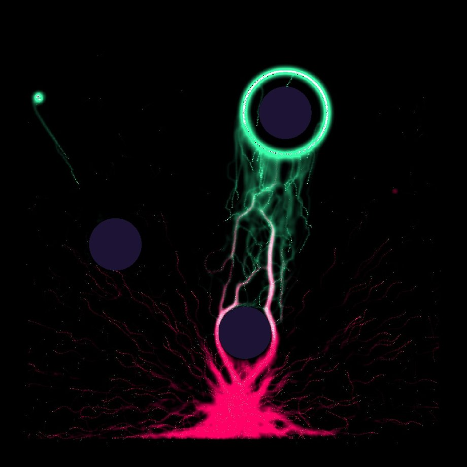
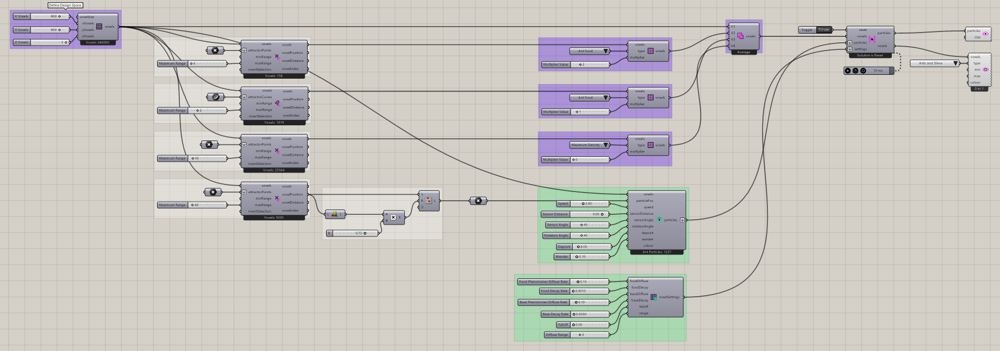

# Ants Complex

Explore ant foraging in an environment with multiple food regions and an obstacle. Two mapping branches assign Ant Food to selected voxels, while another sets Maximum Density to zero in a separate region. Those zero-density cells block entry, shaping the space available for ants to travel between their colony and food.

The ants explore the available space and reinforce routes through their food and home pheromone signals. Watch how the food arrangement and the obstacle affect the paths that develop. Use this example to investigate changes to one food region while keeping the obstacle fixed, then compare the resulting foraging routes.



[Download 17_Ants Complex.gh](files/14-ants-complex.gh)



## Follow the definition

Two mapping branches assign **Ant Food** with multiplier 1. A separate branch assigns **Maximum Density** with multiplier 0. Follow the selections and unions carefully to distinguish food from the region that restricts occupancy.

<details>
<summary>Components used</summary>

- [Construct Voxels](../components/construct-voxels.md)
- [Point Attractor for Voxels](../components/point-attractor-for-voxels.md)
- [Curve Attractor for Voxels](../components/curve-attractor-for-voxels.md)
- [Define Voxel Values](../components/define-voxel-values.md)
- [Voxel Selection Union](../components/voxel-selection-union.md)
- [Nuclei4 Solver GPU](../components/nuclei4-solver-gpu.md)
- [Particle Preview](../components/particle-preview.md)
- [Voxel Preview](../components/voxel-preview.md)
- [Construct Ant Particles](../components/construct-ant-particles.md)
- [Voxel Settings Ant](../components/voxel-settings-ant.md)

</details>

<details>
<summary>Saved controls</summary>

Slider and value-list settings saved in this definition. Repeated rows belong to different component instances.

| Component | Input | Saved control |
| --- | --- | --- |
| Construct Voxels | X Voxels | 800 |
| Construct Voxels | Y Voxels | 800 |
| Construct Voxels | Z Voxels | 1 |
| Point Attractor for Voxels | Maximum Range | 5 |
| Curve Attractor for Voxels | Maximum Range | 2 |
| Point Attractor for Voxels | Maximum Range | 50 |
| Point Attractor for Voxels | Maximum Range | 40 |
| Define Voxel Values | Type | Ant Food |
| Define Voxel Values | Multiplier Value | 2 |
| Define Voxel Values | Type | Ant Food |
| Define Voxel Values | Multiplier Value | 1 |
| Define Voxel Values | Type | Maximum Density |
| Define Voxel Values | Multiplier Value | 0 |
| Nuclei4 Solver GPU | Reset | True |
| Voxel Preview | Type | Ants and Slime |
| Construct Ant Particles | Speed | 3 |
| Construct Ant Particles | Sensor Distance | 9 |
| Construct Ant Particles | Sensor Angle | 45 |
| Construct Ant Particles | Rotation Angle | 45 |
| Construct Ant Particles | Deposit | 8 |
| Construct Ant Particles | Wander | 0.1 |
| Voxel Settings Ant | Food Pheromones Diffuse Rate | 0.15 |
| Voxel Settings Ant | Food Decay Rate | 0.001 |
| Voxel Settings Ant | Base Pheromones Diffuse Rate | 0.1 |
| Voxel Settings Ant | Base Decay Rate | 0.003 |
| Voxel Settings Ant | Falloff | 0 |
| Voxel Settings Ant | Diffuse Range | 2 |

</details>

## Run the example

Open it in Rhino 9 with Nuclei V4, pause the existing Trigger, and inspect the mapped field. Reset once with True, return reset to False, and start the Trigger. Pause before editing several inputs or extracting a large result.

## Try a comparison

Change one food region while keeping the restrictive map fixed. Inspect both Types separately before comparing foraging routes.

## Example result


[Back to examples](README.md)

<details>
<summary>Grasshopper definition (JSON)</summary>

[Download JSON](data/14-ants-complex.json) · [JSON Schema](../reference/definition.schema.json) · [How to read this JSON](../reference/reading-json.md)

This records the saved definition. Geometry and other binary payloads remain in the original `.gh` file.

```json
{
  "$schema": "../../reference/definition.schema.json",
  "schemaVersion": 1,
  "title": "Ants Complex",
  "source": {"file":"../files/14-ants-complex.gh","sha256":"4af629ff804d96a53249787e5fa63e80a18933babe1efe432ac85b3e67b84939","documentId":"014084e4-ea51-4fb6-8b8f-2d10c8914d28"},
  "extraction": {"method":"GH_IO archive read without loading components or solving","coverage":"All saved top-level objects and Source wires; not an executable replacement for the .gh file","limitations":["Binary geometry and image payloads are omitted and identified by archive XML hashes.","External files and Rhino document geometry are not bundled. Inspect saved paths and references.","Runtime outputs, nested cluster internals and plugin-specific behavior are not reconstructed.","Saved library versions describe the archive, not a guarantee of compatibility with newer components."],"omittedBinaryPaths":["564d78d0-184d-40f3-a6d8-cd11243041db/PersistentData/Branch/Item/ON_Data"],"unresolvedGroupMembers":[{"groupId":"914a4d31-441d-4a57-a8ae-9b9e367c7de6","memberId":"ded2bac6-58dc-4afb-a0d2-d3ba9a40ea9d"},{"groupId":"914a4d31-441d-4a57-a8ae-9b9e367c7de6","memberId":"3320255f-b0e9-493a-b718-d7ac27b0b346"},{"groupId":"914a4d31-441d-4a57-a8ae-9b9e367c7de6","memberId":"ac05dc35-9379-4d7c-af93-e5222760ade4"},{"groupId":"914a4d31-441d-4a57-a8ae-9b9e367c7de6","memberId":"882637e8-e8e5-46db-8f21-be5f8cec76ce"},{"groupId":"7a1e7b1a-5a8c-4696-a18a-4659e2589488","memberId":"eece38da-65cc-41b0-ba70-ee6368f2f107"},{"groupId":"7a1e7b1a-5a8c-4696-a18a-4659e2589488","memberId":"f6102e29-8050-4351-a84b-fc39fb422d1b"},{"groupId":"7a1e7b1a-5a8c-4696-a18a-4659e2589488","memberId":"6d9b647c-4120-4921-b9cd-3b6db8c2e56b"},{"groupId":"ad510e49-0611-47aa-9a96-00e810afc710","memberId":"871ebded-33f0-472e-ab09-53f9bac5597c"},{"groupId":"ad510e49-0611-47aa-9a96-00e810afc710","memberId":"3501e492-1958-40ea-9f2c-4aaf06ae8547"},{"groupId":"ad510e49-0611-47aa-9a96-00e810afc710","memberId":"66b49139-c5a2-4c37-96b0-d140ebe89aee"},{"groupId":"f676dd02-e256-4c18-8fbd-90e9413a0586","memberId":"08db4c8d-be27-44d9-833a-b984bbeb5a1d"},{"groupId":"f676dd02-e256-4c18-8fbd-90e9413a0586","memberId":"4e530e47-222e-461f-bbac-d06aa8b29733"},{"groupId":"f676dd02-e256-4c18-8fbd-90e9413a0586","memberId":"475c3be5-e83b-484a-9407-3f10b1eb5699"},{"groupId":"f676dd02-e256-4c18-8fbd-90e9413a0586","memberId":"967d0b88-1c52-4161-8ec2-4f552a64c0eb"},{"groupId":"d4f37070-583b-4222-8313-b61d74155dc3","memberId":"12246923-96f8-4909-b8e3-95e058081429"},{"groupId":"d4f37070-583b-4222-8313-b61d74155dc3","memberId":"3c34396b-f62a-4c86-92ff-92cd93c44497"},{"groupId":"d4f37070-583b-4222-8313-b61d74155dc3","memberId":"2a78054a-4d37-4bdb-bb20-0e0b8ecd25cd"},{"groupId":"d4f37070-583b-4222-8313-b61d74155dc3","memberId":"6f811524-edd2-492a-a342-170f2d4863c0"},{"groupId":"d4f37070-583b-4222-8313-b61d74155dc3","memberId":"729cb0ee-a652-4d9b-a126-8f4a70098555"},{"groupId":"d4f37070-583b-4222-8313-b61d74155dc3","memberId":"9d5ce7c9-4a6a-4878-999e-7da03d25094f"},{"groupId":"d4f37070-583b-4222-8313-b61d74155dc3","memberId":"0d9a5ebd-8321-47bb-b5d1-b9450998cfbe"},{"groupId":"d4f37070-583b-4222-8313-b61d74155dc3","memberId":"6de31f19-b614-4538-8155-db2a1a500ff7"},{"groupId":"52c1cbc1-37ef-4053-8547-c87eb55de275","memberId":"57bd719d-177d-4272-91f1-92a5305c1626"},{"groupId":"39aaa0e2-df1a-45f2-b9da-e94bfcd24ec4","memberId":"8a28dff1-8666-4e22-8aa8-f6f3e4c8fd9a"},{"groupId":"542d2a07-6ffa-4c71-8856-f21f1cd37dc1","memberId":"d08536e2-9eeb-4860-b9bf-4e03cedd3b51"},{"groupId":"960f9eae-0913-4cc5-8f66-3b0c093aa17d","memberId":"803219f4-1514-4359-9b4e-ca02f1a373e8"},{"groupId":"1bf186d4-3066-480f-adf4-f451c4c8416a","memberId":"a0535faf-3fb5-42fe-9409-c4e732fa9d83"},{"groupId":"c30dec0f-fd9e-4c21-86bd-1c9fcd8d4d18","memberId":"522a030e-3c40-43ca-b572-903f6ff3f02d"},{"groupId":"9bfface5-f686-4346-9892-a5847b027c8e","memberId":"a7d2243c-413c-46b8-adca-55ec28149cba"},{"groupId":"9bfface5-f686-4346-9892-a5847b027c8e","memberId":"1d370454-3239-46c7-99a2-0bf12be0680f"},{"groupId":"9bfface5-f686-4346-9892-a5847b027c8e","memberId":"d17d89a9-f20f-4c56-81f2-a5d7d79d8f29"},{"groupId":"9bfface5-f686-4346-9892-a5847b027c8e","memberId":"14cb4365-e69f-43b0-90ca-6bee8f236434"},{"groupId":"9bfface5-f686-4346-9892-a5847b027c8e","memberId":"cf653ef9-20fd-4bc4-bb4c-a6329220e6eb"},{"groupId":"9bfface5-f686-4346-9892-a5847b027c8e","memberId":"91ad3c62-9413-479c-977e-0e9d6e44f961"},{"groupId":"9bfface5-f686-4346-9892-a5847b027c8e","memberId":"d8cf24b4-b615-40b6-8be0-ac63e6494cc1"},{"groupId":"9bfface5-f686-4346-9892-a5847b027c8e","memberId":"ba56bb6b-c00f-4feb-ad3c-df51f26c575b"},{"groupId":"9bfface5-f686-4346-9892-a5847b027c8e","memberId":"c07d4312-8825-41ac-97ba-098fe57da03e"},{"groupId":"9bfface5-f686-4346-9892-a5847b027c8e","memberId":"b52ee53b-c5de-4851-a72f-3fae92d45114"},{"groupId":"9bfface5-f686-4346-9892-a5847b027c8e","memberId":"01c86158-47d6-49a0-a8bb-8e3a83cd74a5"},{"groupId":"9bfface5-f686-4346-9892-a5847b027c8e","memberId":"a8dc238a-445f-4569-924f-3fc2523791e5"},{"groupId":"2d4eaec4-a3f9-4186-95de-dcd83ed428a8","memberId":"c29ecd8c-05ff-4ad3-81ce-8e4bc22cfcad"},{"groupId":"2d4eaec4-a3f9-4186-95de-dcd83ed428a8","memberId":"5ddaea23-b7bd-4b45-b5e4-f1caae0ad680"},{"groupId":"2d4eaec4-a3f9-4186-95de-dcd83ed428a8","memberId":"2b9fef48-aa11-44c1-8c34-ebf2b24413c6"},{"groupId":"2d4eaec4-a3f9-4186-95de-dcd83ed428a8","memberId":"9edef2c5-9afd-486b-be99-f229bb7a883b"},{"groupId":"2d4eaec4-a3f9-4186-95de-dcd83ed428a8","memberId":"1fc89982-62d1-4a91-9040-7f8645391bfc"},{"groupId":"2d4eaec4-a3f9-4186-95de-dcd83ed428a8","memberId":"604a8979-2bb5-4b01-b0ac-f096fa428a88"},{"groupId":"2d4eaec4-a3f9-4186-95de-dcd83ed428a8","memberId":"8aca3f76-7824-4f4a-8445-62696d299b71"},{"groupId":"2d4eaec4-a3f9-4186-95de-dcd83ed428a8","memberId":"72c7e9c0-0615-4217-acb4-b42fb61e5405"},{"groupId":"2d4eaec4-a3f9-4186-95de-dcd83ed428a8","memberId":"e7be6015-c52c-4342-8381-45caf039f281"},{"groupId":"2d4eaec4-a3f9-4186-95de-dcd83ed428a8","memberId":"e8acc498-316a-4bcd-a973-c0bffb34986e"},{"groupId":"2d4eaec4-a3f9-4186-95de-dcd83ed428a8","memberId":"648adcf0-a53d-4e38-b201-684abcdab28b"},{"groupId":"ec65dead-8b2e-4e6a-a636-7ef4c6ac20cf","memberId":"d17d89a9-f20f-4c56-81f2-a5d7d79d8f29"},{"groupId":"d7976a45-b21d-4dee-87b7-dafc6140abd7","memberId":"482048c4-0999-420c-b63d-e691a7553fff"},{"groupId":"f3f35929-693e-44aa-ae86-eb802a862199","memberId":"fe1cede7-af3d-49e5-8910-e60b2cccff7c"},{"groupId":"aa7d3784-b590-4092-b17a-26f831c2e74b","memberId":"f27c40d4-99db-4245-8d49-fcf32453d3d2"},{"groupId":"6fbe8843-6186-4c44-a47e-4fa6ea3bc25c","memberId":"74cf5589-b442-4fb7-b07d-1ba55b7f26b7"},{"groupId":"6fbe8843-6186-4c44-a47e-4fa6ea3bc25c","memberId":"1d370454-3239-46c7-99a2-0bf12be0680f"},{"groupId":"6fbe8843-6186-4c44-a47e-4fa6ea3bc25c","memberId":"d17d89a9-f20f-4c56-81f2-a5d7d79d8f29"},{"groupId":"6fbe8843-6186-4c44-a47e-4fa6ea3bc25c","memberId":"14cb4365-e69f-43b0-90ca-6bee8f236434"},{"groupId":"6fbe8843-6186-4c44-a47e-4fa6ea3bc25c","memberId":"80ff6d67-6aef-455c-ba7f-b5f781651258"},{"groupId":"6fbe8843-6186-4c44-a47e-4fa6ea3bc25c","memberId":"482048c4-0999-420c-b63d-e691a7553fff"},{"groupId":"6fbe8843-6186-4c44-a47e-4fa6ea3bc25c","memberId":"fe1cede7-af3d-49e5-8910-e60b2cccff7c"},{"groupId":"6fbe8843-6186-4c44-a47e-4fa6ea3bc25c","memberId":"f27c40d4-99db-4245-8d49-fcf32453d3d2"},{"groupId":"6fbe8843-6186-4c44-a47e-4fa6ea3bc25c","memberId":"f6b049d4-154b-4da0-8a5a-c2d49c0cb3be"},{"groupId":"14a37f42-e9ca-4754-b17b-f550512332a5","memberId":"136d1a63-5d52-4577-b326-8eeedda41565"},{"groupId":"9b490b6a-77c7-4b61-88a1-658553666c15","memberId":"ba56bb6b-c00f-4feb-ad3c-df51f26c575b"},{"groupId":"7173ab1f-e39d-49d2-a6ba-823308f87de6","memberId":"b52ee53b-c5de-4851-a72f-3fae92d45114"},{"groupId":"b13a5318-9817-4056-bc69-0c5c526926a3","memberId":"0634a752-aeb7-4489-852b-d0346811ee45"},{"groupId":"18427d51-a5de-449b-afb1-0d80959382b4","memberId":"a6d14950-4f60-4929-87e3-c5e535fcba1b"},{"groupId":"18427d51-a5de-449b-afb1-0d80959382b4","memberId":"1d370454-3239-46c7-99a2-0bf12be0680f"},{"groupId":"18427d51-a5de-449b-afb1-0d80959382b4","memberId":"d17d89a9-f20f-4c56-81f2-a5d7d79d8f29"},{"groupId":"18427d51-a5de-449b-afb1-0d80959382b4","memberId":"14cb4365-e69f-43b0-90ca-6bee8f236434"},{"groupId":"18427d51-a5de-449b-afb1-0d80959382b4","memberId":"80ff6d67-6aef-455c-ba7f-b5f781651258"},{"groupId":"18427d51-a5de-449b-afb1-0d80959382b4","memberId":"482048c4-0999-420c-b63d-e691a7553fff"},{"groupId":"18427d51-a5de-449b-afb1-0d80959382b4","memberId":"fe1cede7-af3d-49e5-8910-e60b2cccff7c"},{"groupId":"18427d51-a5de-449b-afb1-0d80959382b4","memberId":"f27c40d4-99db-4245-8d49-fcf32453d3d2"},{"groupId":"18427d51-a5de-449b-afb1-0d80959382b4","memberId":"f5c6f19a-42b1-4139-bd55-a88b9dce9217"},{"groupId":"2680582a-d0d5-4fab-b4ca-bbc9b21899f7","memberId":"fd729ef3-ca46-4a5f-801b-fca8f25bb4b7"},{"groupId":"2680582a-d0d5-4fab-b4ca-bbc9b21899f7","memberId":"6f85cc9d-a2de-4523-9f81-25c3481d2ffa"},{"groupId":"2680582a-d0d5-4fab-b4ca-bbc9b21899f7","memberId":"96a3b0a6-bd50-4367-ae71-841934d2325d"},{"groupId":"a34359d9-b009-4860-bf12-54e976c48ccd","memberId":"4b6b5af3-123e-43bf-82a2-096fc3992d85"},{"groupId":"a34359d9-b009-4860-bf12-54e976c48ccd","memberId":"d0cf1670-701f-4ea6-94b5-de3fa7705e95"},{"groupId":"a34359d9-b009-4860-bf12-54e976c48ccd","memberId":"865ef894-ba9b-4ad0-bc2f-dc52c9ca43b0"},{"groupId":"a34359d9-b009-4860-bf12-54e976c48ccd","memberId":"c9009a18-824d-48d5-86db-b46112930d02"}]},
  "libraries": [{"name":"Library","items":[{"name":"Author","type":"gh_string","value":"Robert McNeel & Associates"},{"name":"Id","type":"gh_guid","value":"00000000-0000-0000-0000-000000000000"},{"name":"Name","type":"gh_string","value":"Grasshopper"},{"name":"Version","type":"gh_string","value":"9.0.26251.12303"}],"chunks":[],"index":0},{"name":"Library","items":[{"name":"Author","type":"gh_string","value":"Robert McNeel & Associates"},{"name":"Id","type":"gh_guid","value":"00000000-0000-0000-0000-000000000000"},{"name":"Name","type":"gh_string","value":"Grasshopper"},{"name":"Version","type":"gh_string","value":"9.0.26251.12303"}],"chunks":[],"index":1},{"name":"Library","items":[{"name":"AssemblyFullName","type":"gh_string","value":"Nuclei4, Version=4.1.0.0, Culture=neutral, PublicKeyToken=null"},{"name":"AssemblyVersion","type":"gh_string","value":"4.1.0.0"},{"name":"Author","type":"gh_string","value":"Madalin Gheorghe"},{"name":"Id","type":"gh_guid","value":"a4810f34-10b6-480c-a6d0-607aac4e8d2a"},{"name":"Name","type":"gh_string","value":"Nuclei4"},{"name":"Version","type":"gh_string","value":""}],"chunks":[],"index":2}],
  "nodes": [
    {"id":"914a4d31-441d-4a57-a8ae-9b9e367c7de6","componentGuid":"c552a431-af5b-46a9-a8a4-0fcbc27ef596","name":"Group","nickname":"","libraryId":null,"inputs":[],"outputs":[],"savedState":{"name":"Container","items":[{"name":"Border","type":"gh_int32","value":"1"},{"name":"Colour","type":"gh_drawing_color","xmlValue":"<item name=\"Colour\" type_name=\"gh_drawing_color\" type_code=\"36\">\n                      <ARGB>75;76;0;255</ARGB>\n                    </item>"},{"name":"Description","type":"gh_string","value":"A group of Grasshopper objects"},{"name":"ID","type":"gh_guid","index":0,"value":"ded2bac6-58dc-4afb-a0d2-d3ba9a40ea9d"},{"name":"ID","type":"gh_guid","index":1,"value":"c483c2c2-9056-4c21-8f19-3afaf531dbb5"},{"name":"ID","type":"gh_guid","index":2,"value":"3320255f-b0e9-493a-b718-d7ac27b0b346"},{"name":"ID","type":"gh_guid","index":3,"value":"ac05dc35-9379-4d7c-af93-e5222760ade4"},{"name":"ID","type":"gh_guid","index":4,"value":"882637e8-e8e5-46db-8f21-be5f8cec76ce"},{"name":"ID","type":"gh_guid","index":5,"value":"4a466ddb-13c5-4d63-92d2-bbc6b99a39e8"},{"name":"ID_Count","type":"gh_int32","value":"6"},{"name":"InstanceGuid","type":"gh_guid","value":"914a4d31-441d-4a57-a8ae-9b9e367c7de6"},{"name":"Name","type":"gh_string","value":"Group"},{"name":"NickName","type":"gh_string","value":""}],"chunks":[]},"canvas":{"name":"Attributes","items":[],"chunks":[]},"groupMembers":["ded2bac6-58dc-4afb-a0d2-d3ba9a40ea9d","c483c2c2-9056-4c21-8f19-3afaf531dbb5","3320255f-b0e9-493a-b718-d7ac27b0b346","ac05dc35-9379-4d7c-af93-e5222760ade4","882637e8-e8e5-46db-8f21-be5f8cec76ce","4a466ddb-13c5-4d63-92d2-bbc6b99a39e8"]},
    {"id":"7a1e7b1a-5a8c-4696-a18a-4659e2589488","componentGuid":"c552a431-af5b-46a9-a8a4-0fcbc27ef596","name":"Group","nickname":"","libraryId":null,"inputs":[],"outputs":[],"savedState":{"name":"Container","items":[{"name":"Border","type":"gh_int32","value":"1"},{"name":"Colour","type":"gh_drawing_color","xmlValue":"<item name=\"Colour\" type_name=\"gh_drawing_color\" type_code=\"36\">\n                      <ARGB>75;255;255;255</ARGB>\n                    </item>"},{"name":"Description","type":"gh_string","value":"A group of Grasshopper objects"},{"name":"ID","type":"gh_guid","index":0,"value":"eece38da-65cc-41b0-ba70-ee6368f2f107"},{"name":"ID","type":"gh_guid","index":1,"value":"f6102e29-8050-4351-a84b-fc39fb422d1b"},{"name":"ID","type":"gh_guid","index":2,"value":"564d78d0-184d-40f3-a6d8-cd11243041db"},{"name":"ID","type":"gh_guid","index":3,"value":"6d9b647c-4120-4921-b9cd-3b6db8c2e56b"},{"name":"ID","type":"gh_guid","index":4,"value":"f0c605db-626b-4061-b90c-713356edad4a"},{"name":"ID","type":"gh_guid","index":5,"value":"1308fc05-a747-42a4-b685-61369ba2d9ee"},{"name":"ID_Count","type":"gh_int32","value":"6"},{"name":"InstanceGuid","type":"gh_guid","value":"7a1e7b1a-5a8c-4696-a18a-4659e2589488"},{"name":"Name","type":"gh_string","value":"Group"},{"name":"NickName","type":"gh_string","value":""}],"chunks":[]},"canvas":{"name":"Attributes","items":[],"chunks":[]},"groupMembers":["eece38da-65cc-41b0-ba70-ee6368f2f107","f6102e29-8050-4351-a84b-fc39fb422d1b","564d78d0-184d-40f3-a6d8-cd11243041db","6d9b647c-4120-4921-b9cd-3b6db8c2e56b","f0c605db-626b-4061-b90c-713356edad4a","1308fc05-a747-42a4-b685-61369ba2d9ee"]},
    {"id":"ad510e49-0611-47aa-9a96-00e810afc710","componentGuid":"c552a431-af5b-46a9-a8a4-0fcbc27ef596","name":"Group","nickname":"","libraryId":null,"inputs":[],"outputs":[],"savedState":{"name":"Container","items":[{"name":"Border","type":"gh_int32","value":"1"},{"name":"Colour","type":"gh_drawing_color","xmlValue":"<item name=\"Colour\" type_name=\"gh_drawing_color\" type_code=\"36\">\n                      <ARGB>75;76;0;255</ARGB>\n                    </item>"},{"name":"Description","type":"gh_string","value":"A group of Grasshopper objects"},{"name":"ID","type":"gh_guid","index":0,"value":"871ebded-33f0-472e-ab09-53f9bac5597c"},{"name":"ID","type":"gh_guid","index":1,"value":"3501e492-1958-40ea-9f2c-4aaf06ae8547"},{"name":"ID","type":"gh_guid","index":2,"value":"0588f728-ca1d-4786-8fa4-ddd2505532c9"},{"name":"ID","type":"gh_guid","index":3,"value":"ad55882a-650c-4c52-8024-9559bc895498"},{"name":"ID","type":"gh_guid","index":4,"value":"66b49139-c5a2-4c37-96b0-d140ebe89aee"},{"name":"ID","type":"gh_guid","index":5,"value":"b1c4964b-d7ea-4d64-bed4-f18dafe8bc3a"},{"name":"ID_Count","type":"gh_int32","value":"6"},{"name":"InstanceGuid","type":"gh_guid","value":"ad510e49-0611-47aa-9a96-00e810afc710"},{"name":"Name","type":"gh_string","value":"Group"},{"name":"NickName","type":"gh_string","value":""}],"chunks":[]},"canvas":{"name":"Attributes","items":[],"chunks":[]},"groupMembers":["871ebded-33f0-472e-ab09-53f9bac5597c","3501e492-1958-40ea-9f2c-4aaf06ae8547","0588f728-ca1d-4786-8fa4-ddd2505532c9","ad55882a-650c-4c52-8024-9559bc895498","66b49139-c5a2-4c37-96b0-d140ebe89aee","b1c4964b-d7ea-4d64-bed4-f18dafe8bc3a"]},
    {"id":"f676dd02-e256-4c18-8fbd-90e9413a0586","componentGuid":"c552a431-af5b-46a9-a8a4-0fcbc27ef596","name":"Group","nickname":"","libraryId":null,"inputs":[],"outputs":[],"savedState":{"name":"Container","items":[{"name":"Border","type":"gh_int32","value":"1"},{"name":"Colour","type":"gh_drawing_color","xmlValue":"<item name=\"Colour\" type_name=\"gh_drawing_color\" type_code=\"36\">\n                      <ARGB>75;76;0;255</ARGB>\n                    </item>"},{"name":"Description","type":"gh_string","value":"A group of Grasshopper objects"},{"name":"ID","type":"gh_guid","index":0,"value":"08db4c8d-be27-44d9-833a-b984bbeb5a1d"},{"name":"ID","type":"gh_guid","index":1,"value":"d9ff5817-2bff-424b-b03e-f670fb88cec8"},{"name":"ID","type":"gh_guid","index":2,"value":"4e530e47-222e-461f-bbac-d06aa8b29733"},{"name":"ID","type":"gh_guid","index":3,"value":"475c3be5-e83b-484a-9407-3f10b1eb5699"},{"name":"ID","type":"gh_guid","index":4,"value":"967d0b88-1c52-4161-8ec2-4f552a64c0eb"},{"name":"ID","type":"gh_guid","index":5,"value":"366970f0-7c26-4c10-9a69-9d1bc85566e0"},{"name":"ID_Count","type":"gh_int32","value":"6"},{"name":"InstanceGuid","type":"gh_guid","value":"f676dd02-e256-4c18-8fbd-90e9413a0586"},{"name":"Name","type":"gh_string","value":"Group"},{"name":"NickName","type":"gh_string","value":""}],"chunks":[]},"canvas":{"name":"Attributes","items":[],"chunks":[]},"groupMembers":["08db4c8d-be27-44d9-833a-b984bbeb5a1d","d9ff5817-2bff-424b-b03e-f670fb88cec8","4e530e47-222e-461f-bbac-d06aa8b29733","475c3be5-e83b-484a-9407-3f10b1eb5699","967d0b88-1c52-4161-8ec2-4f552a64c0eb","366970f0-7c26-4c10-9a69-9d1bc85566e0"]},
    {"id":"d4f37070-583b-4222-8313-b61d74155dc3","componentGuid":"c552a431-af5b-46a9-a8a4-0fcbc27ef596","name":"Group","nickname":"Define Design Space","libraryId":null,"inputs":[],"outputs":[],"savedState":{"name":"Container","items":[{"name":"Border","type":"gh_int32","value":"1"},{"name":"Colour","type":"gh_drawing_color","xmlValue":"<item name=\"Colour\" type_name=\"gh_drawing_color\" type_code=\"36\">\n                      <ARGB>75;76;0;255</ARGB>\n                    </item>"},{"name":"Description","type":"gh_string","value":"A group of Grasshopper objects"},{"name":"ID","type":"gh_guid","index":0,"value":"12246923-96f8-4909-b8e3-95e058081429"},{"name":"ID","type":"gh_guid","index":1,"value":"0b2d8099-07dc-4d60-aefe-ddb07b184e9f"},{"name":"ID","type":"gh_guid","index":2,"value":"48062434-7fd4-4db8-9412-0cb7e02d7c64"},{"name":"ID","type":"gh_guid","index":3,"value":"5c6ebaba-bd93-41b8-941b-a73682ce09a8"},{"name":"ID","type":"gh_guid","index":4,"value":"3c34396b-f62a-4c86-92ff-92cd93c44497"},{"name":"ID","type":"gh_guid","index":5,"value":"2a78054a-4d37-4bdb-bb20-0e0b8ecd25cd"},{"name":"ID","type":"gh_guid","index":6,"value":"6f811524-edd2-492a-a342-170f2d4863c0"},{"name":"ID","type":"gh_guid","index":7,"value":"729cb0ee-a652-4d9b-a126-8f4a70098555"},{"name":"ID","type":"gh_guid","index":8,"value":"9d5ce7c9-4a6a-4878-999e-7da03d25094f"},{"name":"ID","type":"gh_guid","index":9,"value":"0d9a5ebd-8321-47bb-b5d1-b9450998cfbe"},{"name":"ID","type":"gh_guid","index":10,"value":"6de31f19-b614-4538-8155-db2a1a500ff7"},{"name":"ID","type":"gh_guid","index":11,"value":"9f509ce4-c272-4311-acea-f4667d90bad1"},{"name":"ID_Count","type":"gh_int32","value":"12"},{"name":"InstanceGuid","type":"gh_guid","value":"d4f37070-583b-4222-8313-b61d74155dc3"},{"name":"Name","type":"gh_string","value":"Group"},{"name":"NickName","type":"gh_string","value":"Define Design Space"}],"chunks":[]},"canvas":{"name":"Attributes","items":[],"chunks":[]},"groupMembers":["12246923-96f8-4909-b8e3-95e058081429","0b2d8099-07dc-4d60-aefe-ddb07b184e9f","48062434-7fd4-4db8-9412-0cb7e02d7c64","5c6ebaba-bd93-41b8-941b-a73682ce09a8","3c34396b-f62a-4c86-92ff-92cd93c44497","2a78054a-4d37-4bdb-bb20-0e0b8ecd25cd","6f811524-edd2-492a-a342-170f2d4863c0","729cb0ee-a652-4d9b-a126-8f4a70098555","9d5ce7c9-4a6a-4878-999e-7da03d25094f","0d9a5ebd-8321-47bb-b5d1-b9450998cfbe","6de31f19-b614-4538-8155-db2a1a500ff7","9f509ce4-c272-4311-acea-f4667d90bad1"]},
    {"id":"0b2d8099-07dc-4d60-aefe-ddb07b184e9f","componentGuid":"57da07bd-ecab-415d-9d86-af36d7073abc","name":"Number Slider","nickname":"","libraryId":null,"inputs":[],"outputs":[],"savedState":{"name":"Container","items":[{"name":"Description","type":"gh_string","value":"Numeric slider for single values"},{"name":"InstanceGuid","type":"gh_guid","value":"0b2d8099-07dc-4d60-aefe-ddb07b184e9f"},{"name":"Name","type":"gh_string","value":"Number Slider"},{"name":"NickName","type":"gh_string","value":""},{"name":"Optional","type":"gh_bool","value":"false"},{"name":"SourceCount","type":"gh_int32","value":"0"}],"chunks":[{"name":"Slider","items":[{"name":"Digits","type":"gh_int32","value":"3"},{"name":"GripDisplay","type":"gh_int32","value":"1"},{"name":"Interval","type":"gh_int32","value":"1"},{"name":"Max","type":"gh_double","value":"1000"},{"name":"Min","type":"gh_double","value":"0"},{"name":"SnapCount","type":"gh_int32","value":"0"},{"name":"Value","type":"gh_double","value":"800"}],"chunks":[]}]},"canvas":{"name":"Attributes","items":[{"name":"Bounds","type":"gh_drawing_rectanglef","xmlValue":"<item name=\"Bounds\" type_name=\"gh_drawing_rectanglef\" type_code=\"35\">\n                          <X>164</X>\n                          <Y>67</Y>\n                          <W>174</W>\n                          <H>20</H>\n                        </item>"},{"name":"Pivot","type":"gh_drawing_pointf","xmlValue":"<item name=\"Pivot\" type_name=\"gh_drawing_pointf\" type_code=\"31\">\n                          <X>164.71547</X>\n                          <Y>67.6202</Y>\n                        </item>"}],"chunks":[]},"groupMembers":[]},
    {"id":"48062434-7fd4-4db8-9412-0cb7e02d7c64","componentGuid":"57da07bd-ecab-415d-9d86-af36d7073abc","name":"Number Slider","nickname":"","libraryId":null,"inputs":[],"outputs":[],"savedState":{"name":"Container","items":[{"name":"Description","type":"gh_string","value":"Numeric slider for single values"},{"name":"InstanceGuid","type":"gh_guid","value":"48062434-7fd4-4db8-9412-0cb7e02d7c64"},{"name":"Name","type":"gh_string","value":"Number Slider"},{"name":"NickName","type":"gh_string","value":""},{"name":"Optional","type":"gh_bool","value":"false"},{"name":"SourceCount","type":"gh_int32","value":"0"}],"chunks":[{"name":"Slider","items":[{"name":"Digits","type":"gh_int32","value":"3"},{"name":"GripDisplay","type":"gh_int32","value":"1"},{"name":"Interval","type":"gh_int32","value":"1"},{"name":"Max","type":"gh_double","value":"1000"},{"name":"Min","type":"gh_double","value":"0"},{"name":"SnapCount","type":"gh_int32","value":"0"},{"name":"Value","type":"gh_double","value":"800"}],"chunks":[]}]},"canvas":{"name":"Attributes","items":[{"name":"Bounds","type":"gh_drawing_rectanglef","xmlValue":"<item name=\"Bounds\" type_name=\"gh_drawing_rectanglef\" type_code=\"35\">\n                          <X>164</X>\n                          <Y>109</Y>\n                          <W>174</W>\n                          <H>20</H>\n                        </item>"},{"name":"Pivot","type":"gh_drawing_pointf","xmlValue":"<item name=\"Pivot\" type_name=\"gh_drawing_pointf\" type_code=\"31\">\n                          <X>164.71547</X>\n                          <Y>109.6202</Y>\n                        </item>"}],"chunks":[]},"groupMembers":[]},
    {"id":"5c6ebaba-bd93-41b8-941b-a73682ce09a8","componentGuid":"57da07bd-ecab-415d-9d86-af36d7073abc","name":"Number Slider","nickname":"","libraryId":null,"inputs":[],"outputs":[],"savedState":{"name":"Container","items":[{"name":"Description","type":"gh_string","value":"Numeric slider for single values"},{"name":"InstanceGuid","type":"gh_guid","value":"5c6ebaba-bd93-41b8-941b-a73682ce09a8"},{"name":"Name","type":"gh_string","value":"Number Slider"},{"name":"NickName","type":"gh_string","value":""},{"name":"Optional","type":"gh_bool","value":"false"},{"name":"SourceCount","type":"gh_int32","value":"0"}],"chunks":[{"name":"Slider","items":[{"name":"Digits","type":"gh_int32","value":"3"},{"name":"GripDisplay","type":"gh_int32","value":"1"},{"name":"Interval","type":"gh_int32","value":"1"},{"name":"Max","type":"gh_double","value":"1"},{"name":"Min","type":"gh_double","value":"0"},{"name":"SnapCount","type":"gh_int32","value":"0"},{"name":"Value","type":"gh_double","value":"1"}],"chunks":[]}]},"canvas":{"name":"Attributes","items":[{"name":"Bounds","type":"gh_drawing_rectanglef","xmlValue":"<item name=\"Bounds\" type_name=\"gh_drawing_rectanglef\" type_code=\"35\">\n                          <X>164</X>\n                          <Y>148</Y>\n                          <W>174</W>\n                          <H>20</H>\n                        </item>"},{"name":"Pivot","type":"gh_drawing_pointf","xmlValue":"<item name=\"Pivot\" type_name=\"gh_drawing_pointf\" type_code=\"31\">\n                          <X>164.71547</X>\n                          <Y>148.62024</Y>\n                        </item>"}],"chunks":[]},"groupMembers":[]},
    {"id":"2469fae4-5408-45fd-8bf7-b4da7a227a3b","componentGuid":"fbac3e32-f100-4292-8692-77240a42fd1a","name":"Point","nickname":"Particle Start Positions","libraryId":null,"inputs":[],"outputs":[],"savedState":{"name":"Container","items":[{"name":"Description","type":"gh_string","value":"Contains a collection of three-dimensional points"},{"name":"Hidden","type":"gh_bool","value":"true"},{"name":"IconDisplay","type":"gh_int32","value":"1"},{"name":"InstanceGuid","type":"gh_guid","value":"2469fae4-5408-45fd-8bf7-b4da7a227a3b"},{"name":"Name","type":"gh_string","value":"Point"},{"name":"NickName","type":"gh_string","value":"Particle Start Positions"},{"name":"Optional","type":"gh_bool","value":"false"},{"name":"Source","type":"gh_guid","index":0,"value":"5992a62b-3e07-4a97-9c17-68d816acc13c"},{"name":"SourceCount","type":"gh_int32","value":"1"}],"chunks":[]},"canvas":{"name":"Attributes","items":[{"name":"Bounds","type":"gh_drawing_rectanglef","xmlValue":"<item name=\"Bounds\" type_name=\"gh_drawing_rectanglef\" type_code=\"35\">\n                          <X>1549</X>\n                          <Y>641</Y>\n                          <W>121</W>\n                          <H>20</H>\n                        </item>"},{"name":"Pivot","type":"gh_drawing_pointf","xmlValue":"<item name=\"Pivot\" type_name=\"gh_drawing_pointf\" type_code=\"31\">\n                          <X>1609.8064</X>\n                          <Y>651.21533</Y>\n                        </item>"}],"chunks":[]},"groupMembers":[]},
    {"id":"ed04b48b-f1e9-4108-a32e-bb285b1c10e9","componentGuid":"2e78987b-9dfb-42a2-8b76-3923ac8bd91a","name":"Boolean Toggle","nickname":"Toggle","libraryId":null,"inputs":[],"outputs":[],"savedState":{"name":"Container","items":[{"name":"Description","type":"gh_string","value":"Boolean (true/false) toggle"},{"name":"InstanceGuid","type":"gh_guid","value":"ed04b48b-f1e9-4108-a32e-bb285b1c10e9"},{"name":"Name","type":"gh_string","value":"Boolean Toggle"},{"name":"NickName","type":"gh_string","value":"Toggle"},{"name":"Optional","type":"gh_bool","value":"false"},{"name":"SourceCount","type":"gh_int32","value":"0"},{"name":"ToggleValue","type":"gh_bool","value":"true"}],"chunks":[]},"canvas":{"name":"Attributes","items":[{"name":"Bounds","type":"gh_drawing_rectanglef","xmlValue":"<item name=\"Bounds\" type_name=\"gh_drawing_rectanglef\" type_code=\"35\">\n                          <X>2604</X>\n                          <Y>108</Y>\n                          <W>104</W>\n                          <H>22</H>\n                        </item>"}],"chunks":[]},"groupMembers":[]},
    {"id":"78322ad4-a495-4caa-8717-68efef4d1402","componentGuid":"5a2b0735-ba98-4b7d-a7d3-c1dfc04475ad","name":"Trigger","nickname":"","libraryId":null,"inputs":[],"outputs":[],"savedState":{"name":"Container","items":[{"name":"Description","type":"gh_string","value":"Manually or cyclically trigger updates of certain components."},{"name":"InstanceGuid","type":"gh_guid","value":"78322ad4-a495-4caa-8717-68efef4d1402"},{"name":"Interval","type":"gh_int32","value":"10"},{"name":"LockTargets","type":"gh_bool","value":"false"},{"name":"Locked","type":"gh_bool","value":"true"},{"name":"Name","type":"gh_string","value":"Trigger"},{"name":"NickName","type":"gh_string","value":""},{"name":"Target","type":"gh_guid","index":0,"value":"d2f13eac-b935-4bfa-8621-a61d4e724589"},{"name":"Target","type":"gh_guid","index":1,"value":"8a28dff1-8666-4e22-8aa8-f6f3e4c8fd9a"},{"name":"Target","type":"gh_guid","index":2,"value":"9c80bcb8-40f6-4998-8452-17fcb18da6e8"},{"name":"Target","type":"gh_guid","index":3,"value":"8cd19689-fa2b-4c1d-8bb4-1a7694997f0f"},{"name":"TargetCount","type":"gh_int32","value":"4"},{"name":"TimerInterval","type":"gh_int32","value":"10"}],"chunks":[]},"canvas":{"name":"Attributes","items":[{"name":"Bounds","type":"gh_drawing_rectanglef","xmlValue":"<item name=\"Bounds\" type_name=\"gh_drawing_rectanglef\" type_code=\"35\">\n                          <X>2745</X>\n                          <Y>234</Y>\n                          <W>156</W>\n                          <H>24</H>\n                        </item>"}],"chunks":[]},"groupMembers":[]},
    {"id":"52c1cbc1-37ef-4053-8547-c87eb55de275","componentGuid":"c552a431-af5b-46a9-a8a4-0fcbc27ef596","name":"Group","nickname":"Colour Swatch","libraryId":null,"inputs":[],"outputs":[],"savedState":{"name":"Container","items":[{"name":"Border","type":"gh_int32","value":"1"},{"name":"Colour","type":"gh_drawing_color","xmlValue":"<item name=\"Colour\" type_name=\"gh_drawing_color\" type_code=\"36\">\n                      <ARGB>0;100;150;75</ARGB>\n                    </item>"},{"name":"Description","type":"gh_string","value":"A group of Grasshopper objects"},{"name":"ID","type":"gh_guid","index":0,"value":"57bd719d-177d-4272-91f1-92a5305c1626"},{"name":"ID_Count","type":"gh_int32","value":"1"},{"name":"InstanceGuid","type":"gh_guid","value":"52c1cbc1-37ef-4053-8547-c87eb55de275"},{"name":"Name","type":"gh_string","value":"Group"},{"name":"NickName","type":"gh_string","value":"Colour Swatch"}],"chunks":[]},"canvas":{"name":"Attributes","items":[],"chunks":[]},"groupMembers":["57bd719d-177d-4272-91f1-92a5305c1626"]},
    {"id":"39aaa0e2-df1a-45f2-b9da-e94bfcd24ec4","componentGuid":"c552a431-af5b-46a9-a8a4-0fcbc27ef596","name":"Group","nickname":"Nuclei3 Solver","libraryId":null,"inputs":[],"outputs":[],"savedState":{"name":"Container","items":[{"name":"Border","type":"gh_int32","value":"1"},{"name":"Colour","type":"gh_drawing_color","xmlValue":"<item name=\"Colour\" type_name=\"gh_drawing_color\" type_code=\"36\">\n                      <ARGB>0;100;150;75</ARGB>\n                    </item>"},{"name":"Description","type":"gh_string","value":"A group of Grasshopper objects"},{"name":"ID","type":"gh_guid","index":0,"value":"8a28dff1-8666-4e22-8aa8-f6f3e4c8fd9a"},{"name":"ID_Count","type":"gh_int32","value":"1"},{"name":"InstanceGuid","type":"gh_guid","value":"39aaa0e2-df1a-45f2-b9da-e94bfcd24ec4"},{"name":"Name","type":"gh_string","value":"Group"},{"name":"NickName","type":"gh_string","value":"Nuclei3 Solver"}],"chunks":[]},"canvas":{"name":"Attributes","items":[],"chunks":[]},"groupMembers":["8a28dff1-8666-4e22-8aa8-f6f3e4c8fd9a"]},
    {"id":"542d2a07-6ffa-4c71-8856-f21f1cd37dc1","componentGuid":"c552a431-af5b-46a9-a8a4-0fcbc27ef596","name":"Group","nickname":"Construct Slime Particle Groups","libraryId":null,"inputs":[],"outputs":[],"savedState":{"name":"Container","items":[{"name":"Border","type":"gh_int32","value":"1"},{"name":"Colour","type":"gh_drawing_color","xmlValue":"<item name=\"Colour\" type_name=\"gh_drawing_color\" type_code=\"36\">\n                      <ARGB>0;100;150;75</ARGB>\n                    </item>"},{"name":"Description","type":"gh_string","value":"A group of Grasshopper objects"},{"name":"ID","type":"gh_guid","index":0,"value":"d08536e2-9eeb-4860-b9bf-4e03cedd3b51"},{"name":"ID_Count","type":"gh_int32","value":"1"},{"name":"InstanceGuid","type":"gh_guid","value":"542d2a07-6ffa-4c71-8856-f21f1cd37dc1"},{"name":"Name","type":"gh_string","value":"Group"},{"name":"NickName","type":"gh_string","value":"Construct Slime Particle Groups"}],"chunks":[]},"canvas":{"name":"Attributes","items":[],"chunks":[]},"groupMembers":["d08536e2-9eeb-4860-b9bf-4e03cedd3b51"]},
    {"id":"960f9eae-0913-4cc5-8f66-3b0c093aa17d","componentGuid":"c552a431-af5b-46a9-a8a4-0fcbc27ef596","name":"Group","nickname":"Construct Ant Particles","libraryId":null,"inputs":[],"outputs":[],"savedState":{"name":"Container","items":[{"name":"Border","type":"gh_int32","value":"1"},{"name":"Colour","type":"gh_drawing_color","xmlValue":"<item name=\"Colour\" type_name=\"gh_drawing_color\" type_code=\"36\">\n                      <ARGB>0;100;150;75</ARGB>\n                    </item>"},{"name":"Description","type":"gh_string","value":"A group of Grasshopper objects"},{"name":"ID","type":"gh_guid","index":0,"value":"803219f4-1514-4359-9b4e-ca02f1a373e8"},{"name":"ID_Count","type":"gh_int32","value":"1"},{"name":"InstanceGuid","type":"gh_guid","value":"960f9eae-0913-4cc5-8f66-3b0c093aa17d"},{"name":"Name","type":"gh_string","value":"Group"},{"name":"NickName","type":"gh_string","value":"Construct Ant Particles"}],"chunks":[]},"canvas":{"name":"Attributes","items":[],"chunks":[]},"groupMembers":["803219f4-1514-4359-9b4e-ca02f1a373e8"]},
    {"id":"1bf186d4-3066-480f-adf4-f451c4c8416a","componentGuid":"c552a431-af5b-46a9-a8a4-0fcbc27ef596","name":"Group","nickname":"Voxel Settings Slime","libraryId":null,"inputs":[],"outputs":[],"savedState":{"name":"Container","items":[{"name":"Border","type":"gh_int32","value":"1"},{"name":"Colour","type":"gh_drawing_color","xmlValue":"<item name=\"Colour\" type_name=\"gh_drawing_color\" type_code=\"36\">\n                      <ARGB>0;100;150;75</ARGB>\n                    </item>"},{"name":"Description","type":"gh_string","value":"A group of Grasshopper objects"},{"name":"ID","type":"gh_guid","index":0,"value":"a0535faf-3fb5-42fe-9409-c4e732fa9d83"},{"name":"ID_Count","type":"gh_int32","value":"1"},{"name":"InstanceGuid","type":"gh_guid","value":"1bf186d4-3066-480f-adf4-f451c4c8416a"},{"name":"Name","type":"gh_string","value":"Group"},{"name":"NickName","type":"gh_string","value":"Voxel Settings Slime"}],"chunks":[]},"canvas":{"name":"Attributes","items":[],"chunks":[]},"groupMembers":["a0535faf-3fb5-42fe-9409-c4e732fa9d83"]},
    {"id":"c30dec0f-fd9e-4c21-86bd-1c9fcd8d4d18","componentGuid":"c552a431-af5b-46a9-a8a4-0fcbc27ef596","name":"Group","nickname":"Point Attractor for Voxels","libraryId":null,"inputs":[],"outputs":[],"savedState":{"name":"Container","items":[{"name":"Border","type":"gh_int32","value":"1"},{"name":"Colour","type":"gh_drawing_color","xmlValue":"<item name=\"Colour\" type_name=\"gh_drawing_color\" type_code=\"36\">\n                      <ARGB>0;100;150;75</ARGB>\n                    </item>"},{"name":"Description","type":"gh_string","value":"A group of Grasshopper objects"},{"name":"ID","type":"gh_guid","index":0,"value":"522a030e-3c40-43ca-b572-903f6ff3f02d"},{"name":"ID_Count","type":"gh_int32","value":"1"},{"name":"InstanceGuid","type":"gh_guid","value":"c30dec0f-fd9e-4c21-86bd-1c9fcd8d4d18"},{"name":"Name","type":"gh_string","value":"Group"},{"name":"NickName","type":"gh_string","value":"Point Attractor for Voxels"}],"chunks":[]},"canvas":{"name":"Attributes","items":[],"chunks":[]},"groupMembers":["522a030e-3c40-43ca-b572-903f6ff3f02d"]},
    {"id":"9bfface5-f686-4346-9892-a5847b027c8e","componentGuid":"c552a431-af5b-46a9-a8a4-0fcbc27ef596","name":"Group","nickname":"","libraryId":null,"inputs":[],"outputs":[],"savedState":{"name":"Container","items":[{"name":"Border","type":"gh_int32","value":"1"},{"name":"Colour","type":"gh_drawing_color","xmlValue":"<item name=\"Colour\" type_name=\"gh_drawing_color\" type_code=\"36\">\n                      <ARGB>75;255;255;255</ARGB>\n                    </item>"},{"name":"Description","type":"gh_string","value":"A group of Grasshopper objects"},{"name":"ID","type":"gh_guid","index":0,"value":"a7d2243c-413c-46b8-adca-55ec28149cba"},{"name":"ID","type":"gh_guid","index":1,"value":"1d370454-3239-46c7-99a2-0bf12be0680f"},{"name":"ID","type":"gh_guid","index":2,"value":"d17d89a9-f20f-4c56-81f2-a5d7d79d8f29"},{"name":"ID","type":"gh_guid","index":3,"value":"14cb4365-e69f-43b0-90ca-6bee8f236434"},{"name":"ID","type":"gh_guid","index":4,"value":"31b02a89-aa3a-4191-9ebd-99bf6ab94bfd"},{"name":"ID","type":"gh_guid","index":5,"value":"cf653ef9-20fd-4bc4-bb4c-a6329220e6eb"},{"name":"ID","type":"gh_guid","index":6,"value":"91ad3c62-9413-479c-977e-0e9d6e44f961"},{"name":"ID","type":"gh_guid","index":7,"value":"d8cf24b4-b615-40b6-8be0-ac63e6494cc1"},{"name":"ID","type":"gh_guid","index":8,"value":"ba56bb6b-c00f-4feb-ad3c-df51f26c575b"},{"name":"ID","type":"gh_guid","index":9,"value":"c07d4312-8825-41ac-97ba-098fe57da03e"},{"name":"ID","type":"gh_guid","index":10,"value":"b52ee53b-c5de-4851-a72f-3fae92d45114"},{"name":"ID","type":"gh_guid","index":11,"value":"01c86158-47d6-49a0-a8bb-8e3a83cd74a5"},{"name":"ID","type":"gh_guid","index":12,"value":"a8dc238a-445f-4569-924f-3fc2523791e5"},{"name":"ID","type":"gh_guid","index":13,"value":"f0fe01d9-9918-4203-b59f-e27d5d5cd31d"},{"name":"ID","type":"gh_guid","index":14,"value":"948ae788-af0d-4ec0-bd1f-d9245fcc2187"},{"name":"ID_Count","type":"gh_int32","value":"15"},{"name":"InstanceGuid","type":"gh_guid","value":"9bfface5-f686-4346-9892-a5847b027c8e"},{"name":"Name","type":"gh_string","value":"Group"},{"name":"NickName","type":"gh_string","value":""}],"chunks":[]},"canvas":{"name":"Attributes","items":[],"chunks":[]},"groupMembers":["a7d2243c-413c-46b8-adca-55ec28149cba","1d370454-3239-46c7-99a2-0bf12be0680f","d17d89a9-f20f-4c56-81f2-a5d7d79d8f29","14cb4365-e69f-43b0-90ca-6bee8f236434","31b02a89-aa3a-4191-9ebd-99bf6ab94bfd","cf653ef9-20fd-4bc4-bb4c-a6329220e6eb","91ad3c62-9413-479c-977e-0e9d6e44f961","d8cf24b4-b615-40b6-8be0-ac63e6494cc1","ba56bb6b-c00f-4feb-ad3c-df51f26c575b","c07d4312-8825-41ac-97ba-098fe57da03e","b52ee53b-c5de-4851-a72f-3fae92d45114","01c86158-47d6-49a0-a8bb-8e3a83cd74a5","a8dc238a-445f-4569-924f-3fc2523791e5","f0fe01d9-9918-4203-b59f-e27d5d5cd31d","948ae788-af0d-4ec0-bd1f-d9245fcc2187"]},
    {"id":"31b02a89-aa3a-4191-9ebd-99bf6ab94bfd","componentGuid":"57da07bd-ecab-415d-9d86-af36d7073abc","name":"Number Slider","nickname":"","libraryId":null,"inputs":[],"outputs":[],"savedState":{"name":"Container","items":[{"name":"Description","type":"gh_string","value":"Numeric slider for single values"},{"name":"InstanceGuid","type":"gh_guid","value":"31b02a89-aa3a-4191-9ebd-99bf6ab94bfd"},{"name":"Name","type":"gh_string","value":"Number Slider"},{"name":"NickName","type":"gh_string","value":""},{"name":"Optional","type":"gh_bool","value":"false"},{"name":"SourceCount","type":"gh_int32","value":"0"}],"chunks":[{"name":"Slider","items":[{"name":"Digits","type":"gh_int32","value":"3"},{"name":"GripDisplay","type":"gh_int32","value":"1"},{"name":"Interval","type":"gh_int32","value":"1"},{"name":"Max","type":"gh_double","value":"1000"},{"name":"Min","type":"gh_double","value":"0"},{"name":"SnapCount","type":"gh_int32","value":"0"},{"name":"Value","type":"gh_double","value":"40"}],"chunks":[]}]},"canvas":{"name":"Attributes","items":[{"name":"Bounds","type":"gh_drawing_rectanglef","xmlValue":"<item name=\"Bounds\" type_name=\"gh_drawing_rectanglef\" type_code=\"35\">\n                          <X>612</X>\n                          <Y>654</Y>\n                          <W>215</W>\n                          <H>20</H>\n                        </item>"},{"name":"Pivot","type":"gh_drawing_pointf","xmlValue":"<item name=\"Pivot\" type_name=\"gh_drawing_pointf\" type_code=\"31\">\n                          <X>612.88873</X>\n                          <Y>654.60474</Y>\n                        </item>"}],"chunks":[]},"groupMembers":[]},
    {"id":"2d4eaec4-a3f9-4186-95de-dcd83ed428a8","componentGuid":"c552a431-af5b-46a9-a8a4-0fcbc27ef596","name":"Group","nickname":"","libraryId":null,"inputs":[],"outputs":[],"savedState":{"name":"Container","items":[{"name":"Border","type":"gh_int32","value":"1"},{"name":"Colour","type":"gh_drawing_color","xmlValue":"<item name=\"Colour\" type_name=\"gh_drawing_color\" type_code=\"36\">\n                      <ARGB>75;255;255;255</ARGB>\n                    </item>"},{"name":"Description","type":"gh_string","value":"A group of Grasshopper objects"},{"name":"ID","type":"gh_guid","index":0,"value":"c29ecd8c-05ff-4ad3-81ce-8e4bc22cfcad"},{"name":"ID","type":"gh_guid","index":1,"value":"5ddaea23-b7bd-4b45-b5e4-f1caae0ad680"},{"name":"ID","type":"gh_guid","index":2,"value":"f7e76b4a-6700-46ea-b982-11297c29b142"},{"name":"ID","type":"gh_guid","index":3,"value":"2b9fef48-aa11-44c1-8c34-ebf2b24413c6"},{"name":"ID","type":"gh_guid","index":4,"value":"f75e49ff-1d85-4e14-ad8a-3acd698ed33d"},{"name":"ID","type":"gh_guid","index":5,"value":"9edef2c5-9afd-486b-be99-f229bb7a883b"},{"name":"ID","type":"gh_guid","index":6,"value":"338ef1fc-edca-42b9-98d1-f97392a5664d"},{"name":"ID","type":"gh_guid","index":7,"value":"633134ae-98a5-4723-858d-54f6df1d331c"},{"name":"ID","type":"gh_guid","index":8,"value":"1fc89982-62d1-4a91-9040-7f8645391bfc"},{"name":"ID","type":"gh_guid","index":9,"value":"604a8979-2bb5-4b01-b0ac-f096fa428a88"},{"name":"ID","type":"gh_guid","index":10,"value":"8aca3f76-7824-4f4a-8445-62696d299b71"},{"name":"ID","type":"gh_guid","index":11,"value":"72c7e9c0-0615-4217-acb4-b42fb61e5405"},{"name":"ID","type":"gh_guid","index":12,"value":"e7be6015-c52c-4342-8381-45caf039f281"},{"name":"ID","type":"gh_guid","index":13,"value":"e8acc498-316a-4bcd-a973-c0bffb34986e"},{"name":"ID","type":"gh_guid","index":14,"value":"648adcf0-a53d-4e38-b201-684abcdab28b"},{"name":"ID_Count","type":"gh_int32","value":"15"},{"name":"InstanceGuid","type":"gh_guid","value":"2d4eaec4-a3f9-4186-95de-dcd83ed428a8"},{"name":"Name","type":"gh_string","value":"Group"},{"name":"NickName","type":"gh_string","value":""}],"chunks":[]},"canvas":{"name":"Attributes","items":[],"chunks":[]},"groupMembers":["c29ecd8c-05ff-4ad3-81ce-8e4bc22cfcad","5ddaea23-b7bd-4b45-b5e4-f1caae0ad680","f7e76b4a-6700-46ea-b982-11297c29b142","2b9fef48-aa11-44c1-8c34-ebf2b24413c6","f75e49ff-1d85-4e14-ad8a-3acd698ed33d","9edef2c5-9afd-486b-be99-f229bb7a883b","338ef1fc-edca-42b9-98d1-f97392a5664d","633134ae-98a5-4723-858d-54f6df1d331c","1fc89982-62d1-4a91-9040-7f8645391bfc","604a8979-2bb5-4b01-b0ac-f096fa428a88","8aca3f76-7824-4f4a-8445-62696d299b71","72c7e9c0-0615-4217-acb4-b42fb61e5405","e7be6015-c52c-4342-8381-45caf039f281","e8acc498-316a-4bcd-a973-c0bffb34986e","648adcf0-a53d-4e38-b201-684abcdab28b"]},
    {"id":"f7e76b4a-6700-46ea-b982-11297c29b142","componentGuid":"455925fd-23ff-4e57-a0e7-913a4165e659","name":"Random Reduce","nickname":"Reduce","libraryId":null,"inputs":[{"id":"9a06f777-8408-4a05-8f00-f9d01c273034","index":0,"name":"List","nickname":"L","savedState":{"name":"param_input","items":[{"name":"Access","type":"gh_int32","value":"1"},{"name":"Description","type":"gh_string","value":"List to reduce"},{"name":"InstanceGuid","type":"gh_guid","value":"9a06f777-8408-4a05-8f00-f9d01c273034"},{"name":"Name","type":"gh_string","value":"List"},{"name":"NickName","type":"gh_string","value":"L"},{"name":"Optional","type":"gh_bool","value":"false"},{"name":"Source","type":"gh_guid","index":0,"value":"3f494cc8-a8fe-4adb-a778-bf7fb4ae96a4"},{"name":"SourceCount","type":"gh_int32","value":"1"}],"chunks":[],"index":0}},{"id":"a5a7e594-2455-4736-bf60-f2347b612183","index":1,"name":"Reduction","nickname":"R","savedState":{"name":"param_input","items":[{"name":"Description","type":"gh_string","value":"Number of items to remove"},{"name":"InstanceGuid","type":"gh_guid","value":"a5a7e594-2455-4736-bf60-f2347b612183"},{"name":"Name","type":"gh_string","value":"Reduction"},{"name":"NickName","type":"gh_string","value":"R"},{"name":"Optional","type":"gh_bool","value":"false"},{"name":"Source","type":"gh_guid","index":0,"value":"38ff44db-52eb-46f0-a16b-36b7557e9c50"},{"name":"SourceCount","type":"gh_int32","value":"1"}],"chunks":[],"index":1}},{"id":"29b2a90b-0537-4161-bfc7-cfe421264956","index":2,"name":"Seed","nickname":"S","savedState":{"name":"param_input","items":[{"name":"Description","type":"gh_string","value":"Random Generator Seed value"},{"name":"InstanceGuid","type":"gh_guid","value":"29b2a90b-0537-4161-bfc7-cfe421264956"},{"name":"Name","type":"gh_string","value":"Seed"},{"name":"NickName","type":"gh_string","value":"S"},{"name":"Optional","type":"gh_bool","value":"false"},{"name":"SourceCount","type":"gh_int32","value":"0"}],"chunks":[{"name":"PersistentData","items":[{"name":"Count","type":"gh_int32","value":"1"}],"chunks":[{"name":"Branch","items":[{"name":"Count","type":"gh_int32","value":"1"},{"name":"Path","type":"gh_string","value":"{0}"}],"chunks":[{"name":"Item","items":[{"name":"number","type":"gh_int32","value":"1"}],"chunks":[],"index":0}],"index":0}]}],"index":2}}],"outputs":[{"id":"5992a62b-3e07-4a97-9c17-68d816acc13c","index":0,"name":"List","nickname":"L","savedState":{"name":"param_output","items":[{"name":"Access","type":"gh_int32","value":"1"},{"name":"Description","type":"gh_string","value":"Reduced list"},{"name":"InstanceGuid","type":"gh_guid","value":"5992a62b-3e07-4a97-9c17-68d816acc13c"},{"name":"Name","type":"gh_string","value":"List"},{"name":"NickName","type":"gh_string","value":"L"},{"name":"Optional","type":"gh_bool","value":"false"},{"name":"SourceCount","type":"gh_int32","value":"0"}],"chunks":[],"index":0}}],"savedState":{"name":"Container","items":[{"name":"Description","type":"gh_string","value":"Randomly remove N items from a list"},{"name":"Hidden","type":"gh_bool","value":"true"},{"name":"InstanceGuid","type":"gh_guid","value":"f7e76b4a-6700-46ea-b982-11297c29b142"},{"name":"Name","type":"gh_string","value":"Random Reduce"},{"name":"NickName","type":"gh_string","value":"Reduce"}],"chunks":[]},"canvas":{"name":"Attributes","items":[{"name":"Bounds","type":"gh_drawing_rectanglef","xmlValue":"<item name=\"Bounds\" type_name=\"gh_drawing_rectanglef\" type_code=\"35\">\n                          <X>1425</X>\n                          <Y>619</Y>\n                          <W>63</W>\n                          <H>64</H>\n                        </item>"},{"name":"Pivot","type":"gh_drawing_pointf","xmlValue":"<item name=\"Pivot\" type_name=\"gh_drawing_pointf\" type_code=\"31\">\n                          <X>1456</X>\n                          <Y>651</Y>\n                        </item>"}],"chunks":[]},"groupMembers":[]},
    {"id":"f75e49ff-1d85-4e14-ad8a-3acd698ed33d","componentGuid":"1817fd29-20ae-4503-b542-f0fb651e67d7","name":"List Length","nickname":"Lng","libraryId":null,"inputs":[{"id":"9bcd46fc-37d9-4f52-9d4f-5429ee790e6e","index":0,"name":"List","nickname":"L","savedState":{"name":"param_input","items":[{"name":"Access","type":"gh_int32","value":"1"},{"name":"Description","type":"gh_string","value":"Base list"},{"name":"InstanceGuid","type":"gh_guid","value":"9bcd46fc-37d9-4f52-9d4f-5429ee790e6e"},{"name":"Name","type":"gh_string","value":"List"},{"name":"NickName","type":"gh_string","value":"L"},{"name":"Optional","type":"gh_bool","value":"false"},{"name":"Source","type":"gh_guid","index":0,"value":"3f494cc8-a8fe-4adb-a778-bf7fb4ae96a4"},{"name":"SourceCount","type":"gh_int32","value":"1"}],"chunks":[],"index":0}}],"outputs":[{"id":"a3eee217-22e9-43e8-9be5-288320d719bf","index":0,"name":"Length","nickname":"L","savedState":{"name":"param_output","items":[{"name":"Description","type":"gh_string","value":"Number of items in L"},{"name":"InstanceGuid","type":"gh_guid","value":"a3eee217-22e9-43e8-9be5-288320d719bf"},{"name":"Name","type":"gh_string","value":"Length"},{"name":"NickName","type":"gh_string","value":"L"},{"name":"Optional","type":"gh_bool","value":"false"},{"name":"SourceCount","type":"gh_int32","value":"0"}],"chunks":[],"index":0}}],"savedState":{"name":"Container","items":[{"name":"Description","type":"gh_string","value":"Measure the length of a list."},{"name":"Hidden","type":"gh_bool","value":"true"},{"name":"InstanceGuid","type":"gh_guid","value":"f75e49ff-1d85-4e14-ad8a-3acd698ed33d"},{"name":"Name","type":"gh_string","value":"List Length"},{"name":"NickName","type":"gh_string","value":"Lng"}],"chunks":[]},"canvas":{"name":"Attributes","items":[{"name":"Bounds","type":"gh_drawing_rectanglef","xmlValue":"<item name=\"Bounds\" type_name=\"gh_drawing_rectanglef\" type_code=\"35\">\n                          <X>1134</X>\n                          <Y>679</Y>\n                          <W>61</W>\n                          <H>28</H>\n                        </item>"},{"name":"Pivot","type":"gh_drawing_pointf","xmlValue":"<item name=\"Pivot\" type_name=\"gh_drawing_pointf\" type_code=\"31\">\n                          <X>1163</X>\n                          <Y>693</Y>\n                        </item>"}],"chunks":[]},"groupMembers":[]},
    {"id":"338ef1fc-edca-42b9-98d1-f97392a5664d","componentGuid":"57da07bd-ecab-415d-9d86-af36d7073abc","name":"Number Slider","nickname":"","libraryId":null,"inputs":[],"outputs":[],"savedState":{"name":"Container","items":[{"name":"Description","type":"gh_string","value":"Numeric slider for single values"},{"name":"InstanceGuid","type":"gh_guid","value":"338ef1fc-edca-42b9-98d1-f97392a5664d"},{"name":"Name","type":"gh_string","value":"Number Slider"},{"name":"NickName","type":"gh_string","value":""},{"name":"Optional","type":"gh_bool","value":"false"},{"name":"SourceCount","type":"gh_int32","value":"0"}],"chunks":[{"name":"Slider","items":[{"name":"Digits","type":"gh_int32","value":"2"},{"name":"GripDisplay","type":"gh_int32","value":"1"},{"name":"Interval","type":"gh_int32","value":"0"},{"name":"Max","type":"gh_double","value":"1"},{"name":"Min","type":"gh_double","value":"0"},{"name":"SnapCount","type":"gh_int32","value":"0"},{"name":"Value","type":"gh_double","value":"0.75"}],"chunks":[]}]},"canvas":{"name":"Attributes","items":[{"name":"Bounds","type":"gh_drawing_rectanglef","xmlValue":"<item name=\"Bounds\" type_name=\"gh_drawing_rectanglef\" type_code=\"35\">\n                          <X>1137</X>\n                          <Y>742</Y>\n                          <W>160</W>\n                          <H>20</H>\n                        </item>"},{"name":"Pivot","type":"gh_drawing_pointf","xmlValue":"<item name=\"Pivot\" type_name=\"gh_drawing_pointf\" type_code=\"31\">\n                          <X>1137.865</X>\n                          <Y>742.6218</Y>\n                        </item>"}],"chunks":[]},"groupMembers":[]},
    {"id":"633134ae-98a5-4723-858d-54f6df1d331c","componentGuid":"ce46b74e-00c9-43c4-805a-193b69ea4a11","name":"Multiplication","nickname":"A×B","libraryId":null,"inputs":[{"id":"5e54c110-9568-4cb3-9abd-f7028859e4a1","index":0,"name":"A","nickname":"A","savedState":{"name":"InputParam","items":[{"name":"Description","type":"gh_string","value":"First item for multiplication"},{"name":"InstanceGuid","type":"gh_guid","value":"5e54c110-9568-4cb3-9abd-f7028859e4a1"},{"name":"Name","type":"gh_string","value":"A"},{"name":"NickName","type":"gh_string","value":"A"},{"name":"Optional","type":"gh_bool","value":"true"},{"name":"Source","type":"gh_guid","index":0,"value":"a3eee217-22e9-43e8-9be5-288320d719bf"},{"name":"SourceCount","type":"gh_int32","value":"1"}],"chunks":[],"index":0}},{"id":"78a38381-f984-4465-8a41-de3a3880bd2e","index":1,"name":"B","nickname":"B","savedState":{"name":"InputParam","items":[{"name":"Description","type":"gh_string","value":"Second item for multiplication"},{"name":"InstanceGuid","type":"gh_guid","value":"78a38381-f984-4465-8a41-de3a3880bd2e"},{"name":"Name","type":"gh_string","value":"B"},{"name":"NickName","type":"gh_string","value":"B"},{"name":"Optional","type":"gh_bool","value":"true"},{"name":"Source","type":"gh_guid","index":0,"value":"338ef1fc-edca-42b9-98d1-f97392a5664d"},{"name":"SourceCount","type":"gh_int32","value":"1"}],"chunks":[],"index":1}}],"outputs":[{"id":"38ff44db-52eb-46f0-a16b-36b7557e9c50","index":0,"name":"Result","nickname":"R","savedState":{"name":"OutputParam","items":[{"name":"Description","type":"gh_string","value":"Result of multiplication"},{"name":"InstanceGuid","type":"gh_guid","value":"38ff44db-52eb-46f0-a16b-36b7557e9c50"},{"name":"Name","type":"gh_string","value":"Result"},{"name":"NickName","type":"gh_string","value":"R"},{"name":"Optional","type":"gh_bool","value":"false"},{"name":"SourceCount","type":"gh_int32","value":"0"}],"chunks":[],"index":0}}],"savedState":{"name":"Container","items":[{"name":"Description","type":"gh_string","value":"Mathematical multiplication"},{"name":"Hidden","type":"gh_bool","value":"true"},{"name":"InstanceGuid","type":"gh_guid","value":"633134ae-98a5-4723-858d-54f6df1d331c"},{"name":"Name","type":"gh_string","value":"Multiplication"},{"name":"NickName","type":"gh_string","value":"A×B"}],"chunks":[]},"canvas":{"name":"Attributes","items":[{"name":"Bounds","type":"gh_drawing_rectanglef","xmlValue":"<item name=\"Bounds\" type_name=\"gh_drawing_rectanglef\" type_code=\"35\">\n                          <X>1315</X>\n                          <Y>681</Y>\n                          <W>65</W>\n                          <H>44</H>\n                        </item>"},{"name":"Pivot","type":"gh_drawing_pointf","xmlValue":"<item name=\"Pivot\" type_name=\"gh_drawing_pointf\" type_code=\"31\">\n                          <X>1346</X>\n                          <Y>703</Y>\n                        </item>"}],"chunks":[]},"groupMembers":[]},
    {"id":"ec65dead-8b2e-4e6a-a636-7ef4c6ac20cf","componentGuid":"c552a431-af5b-46a9-a8a4-0fcbc27ef596","name":"Group","nickname":"XY Plane","libraryId":null,"inputs":[],"outputs":[],"savedState":{"name":"Container","items":[{"name":"Border","type":"gh_int32","value":"1"},{"name":"Colour","type":"gh_drawing_color","xmlValue":"<item name=\"Colour\" type_name=\"gh_drawing_color\" type_code=\"36\">\n                      <ARGB>0;100;150;75</ARGB>\n                    </item>"},{"name":"Description","type":"gh_string","value":"A group of Grasshopper objects"},{"name":"ID","type":"gh_guid","index":0,"value":"d17d89a9-f20f-4c56-81f2-a5d7d79d8f29"},{"name":"ID_Count","type":"gh_int32","value":"1"},{"name":"InstanceGuid","type":"gh_guid","value":"ec65dead-8b2e-4e6a-a636-7ef4c6ac20cf"},{"name":"Name","type":"gh_string","value":"Group"},{"name":"NickName","type":"gh_string","value":"XY Plane"}],"chunks":[]},"canvas":{"name":"Attributes","items":[],"chunks":[]},"groupMembers":["d17d89a9-f20f-4c56-81f2-a5d7d79d8f29"]},
    {"id":"06af5a6c-f52a-4e07-9b5b-08646840ad36","componentGuid":"fbac3e32-f100-4292-8692-77240a42fd1a","name":"Point","nickname":"Food Points","libraryId":null,"inputs":[],"outputs":[],"savedState":{"name":"Container","items":[{"name":"Description","type":"gh_string","value":"Contains a collection of three-dimensional points"},{"name":"Hidden","type":"gh_bool","value":"true"},{"name":"IconDisplay","type":"gh_int32","value":"1"},{"name":"InstanceGuid","type":"gh_guid","value":"06af5a6c-f52a-4e07-9b5b-08646840ad36"},{"name":"Name","type":"gh_string","value":"Point"},{"name":"NickName","type":"gh_string","value":"Food Points"},{"name":"Optional","type":"gh_bool","value":"false"},{"name":"SourceCount","type":"gh_int32","value":"0"}],"chunks":[{"name":"PersistentData","items":[{"name":"Count","type":"gh_int32","value":"1"}],"chunks":[{"name":"Branch","items":[{"name":"Count","type":"gh_int32","value":"2"},{"name":"Path","type":"gh_string","value":"{0}"}],"chunks":[{"name":"Item","items":[{"name":"Coordinate","type":"gh_point3d","xmlValue":"<item name=\"Coordinate\" type_name=\"gh_point3d\" type_code=\"51\">\n                                  <X>712.2134247778572</X>\n                                  <Y>483.89245013550976</Y>\n                                  <Z>0</Z>\n                                </item>"}],"chunks":[],"index":0},{"name":"Item","items":[{"name":"Coordinate","type":"gh_point3d","xmlValue":"<item name=\"Coordinate\" type_name=\"gh_point3d\" type_code=\"51\">\n                                  <X>28.909705050184215</X>\n                                  <Y>658.8512654690063</Y>\n                                  <Z>0</Z>\n                                </item>"}],"chunks":[],"index":1}],"index":0}]}]},"canvas":{"name":"Attributes","items":[{"name":"Bounds","type":"gh_drawing_rectanglef","xmlValue":"<item name=\"Bounds\" type_name=\"gh_drawing_rectanglef\" type_code=\"35\">\n                          <X>756</X>\n                          <Y>173</Y>\n                          <W>71</W>\n                          <H>20</H>\n                        </item>"},{"name":"Pivot","type":"gh_drawing_pointf","xmlValue":"<item name=\"Pivot\" type_name=\"gh_drawing_pointf\" type_code=\"31\">\n                          <X>792.04596</X>\n                          <Y>183.25446</Y>\n                        </item>"}],"chunks":[]},"groupMembers":[]},
    {"id":"d7976a45-b21d-4dee-87b7-dafc6140abd7","componentGuid":"c552a431-af5b-46a9-a8a4-0fcbc27ef596","name":"Group","nickname":"Extract Voxel Bounding Box","libraryId":null,"inputs":[],"outputs":[],"savedState":{"name":"Container","items":[{"name":"Border","type":"gh_int32","value":"1"},{"name":"Colour","type":"gh_drawing_color","xmlValue":"<item name=\"Colour\" type_name=\"gh_drawing_color\" type_code=\"36\">\n                      <ARGB>0;100;150;75</ARGB>\n                    </item>"},{"name":"Description","type":"gh_string","value":"A group of Grasshopper objects"},{"name":"ID","type":"gh_guid","index":0,"value":"482048c4-0999-420c-b63d-e691a7553fff"},{"name":"ID_Count","type":"gh_int32","value":"1"},{"name":"InstanceGuid","type":"gh_guid","value":"d7976a45-b21d-4dee-87b7-dafc6140abd7"},{"name":"Name","type":"gh_string","value":"Group"},{"name":"NickName","type":"gh_string","value":"Extract Voxel Bounding Box"}],"chunks":[]},"canvas":{"name":"Attributes","items":[],"chunks":[]},"groupMembers":["482048c4-0999-420c-b63d-e691a7553fff"]},
    {"id":"f3f35929-693e-44aa-ae86-eb802a862199","componentGuid":"c552a431-af5b-46a9-a8a4-0fcbc27ef596","name":"Group","nickname":"Area","libraryId":null,"inputs":[],"outputs":[],"savedState":{"name":"Container","items":[{"name":"Border","type":"gh_int32","value":"1"},{"name":"Colour","type":"gh_drawing_color","xmlValue":"<item name=\"Colour\" type_name=\"gh_drawing_color\" type_code=\"36\">\n                      <ARGB>0;100;150;75</ARGB>\n                    </item>"},{"name":"Description","type":"gh_string","value":"A group of Grasshopper objects"},{"name":"ID","type":"gh_guid","index":0,"value":"fe1cede7-af3d-49e5-8910-e60b2cccff7c"},{"name":"ID_Count","type":"gh_int32","value":"1"},{"name":"InstanceGuid","type":"gh_guid","value":"f3f35929-693e-44aa-ae86-eb802a862199"},{"name":"Name","type":"gh_string","value":"Group"},{"name":"NickName","type":"gh_string","value":"Area"}],"chunks":[]},"canvas":{"name":"Attributes","items":[],"chunks":[]},"groupMembers":["fe1cede7-af3d-49e5-8910-e60b2cccff7c"]},
    {"id":"aa7d3784-b590-4092-b17a-26f831c2e74b","componentGuid":"c552a431-af5b-46a9-a8a4-0fcbc27ef596","name":"Group","nickname":"Point","libraryId":null,"inputs":[],"outputs":[],"savedState":{"name":"Container","items":[{"name":"Border","type":"gh_int32","value":"1"},{"name":"Colour","type":"gh_drawing_color","xmlValue":"<item name=\"Colour\" type_name=\"gh_drawing_color\" type_code=\"36\">\n                      <ARGB>0;100;150;75</ARGB>\n                    </item>"},{"name":"Description","type":"gh_string","value":"A group of Grasshopper objects"},{"name":"ID","type":"gh_guid","index":0,"value":"f27c40d4-99db-4245-8d49-fcf32453d3d2"},{"name":"ID_Count","type":"gh_int32","value":"1"},{"name":"InstanceGuid","type":"gh_guid","value":"aa7d3784-b590-4092-b17a-26f831c2e74b"},{"name":"Name","type":"gh_string","value":"Group"},{"name":"NickName","type":"gh_string","value":"Point"}],"chunks":[]},"canvas":{"name":"Attributes","items":[],"chunks":[]},"groupMembers":["f27c40d4-99db-4245-8d49-fcf32453d3d2"]},
    {"id":"6fbe8843-6186-4c44-a47e-4fa6ea3bc25c","componentGuid":"c552a431-af5b-46a9-a8a4-0fcbc27ef596","name":"Group","nickname":"","libraryId":null,"inputs":[],"outputs":[],"savedState":{"name":"Container","items":[{"name":"Border","type":"gh_int32","value":"1"},{"name":"Colour","type":"gh_drawing_color","xmlValue":"<item name=\"Colour\" type_name=\"gh_drawing_color\" type_code=\"36\">\n                      <ARGB>75;255;255;255</ARGB>\n                    </item>"},{"name":"Description","type":"gh_string","value":"A group of Grasshopper objects"},{"name":"ID","type":"gh_guid","index":0,"value":"74cf5589-b442-4fb7-b07d-1ba55b7f26b7"},{"name":"ID","type":"gh_guid","index":1,"value":"1d370454-3239-46c7-99a2-0bf12be0680f"},{"name":"ID","type":"gh_guid","index":2,"value":"d17d89a9-f20f-4c56-81f2-a5d7d79d8f29"},{"name":"ID","type":"gh_guid","index":3,"value":"14cb4365-e69f-43b0-90ca-6bee8f236434"},{"name":"ID","type":"gh_guid","index":4,"value":"930916e7-6c30-4a9a-b473-d03239021d16"},{"name":"ID","type":"gh_guid","index":5,"value":"80ff6d67-6aef-455c-ba7f-b5f781651258"},{"name":"ID","type":"gh_guid","index":6,"value":"482048c4-0999-420c-b63d-e691a7553fff"},{"name":"ID","type":"gh_guid","index":7,"value":"d7976a45-b21d-4dee-87b7-dafc6140abd7"},{"name":"ID","type":"gh_guid","index":8,"value":"fe1cede7-af3d-49e5-8910-e60b2cccff7c"},{"name":"ID","type":"gh_guid","index":9,"value":"f3f35929-693e-44aa-ae86-eb802a862199"},{"name":"ID","type":"gh_guid","index":10,"value":"f27c40d4-99db-4245-8d49-fcf32453d3d2"},{"name":"ID","type":"gh_guid","index":11,"value":"aa7d3784-b590-4092-b17a-26f831c2e74b"},{"name":"ID","type":"gh_guid","index":12,"value":"06af5a6c-f52a-4e07-9b5b-08646840ad36"},{"name":"ID","type":"gh_guid","index":13,"value":"f6b049d4-154b-4da0-8a5a-c2d49c0cb3be"},{"name":"ID","type":"gh_guid","index":14,"value":"219f3563-460c-4681-b1ab-ad9e2f15da3c"},{"name":"ID_Count","type":"gh_int32","value":"15"},{"name":"InstanceGuid","type":"gh_guid","value":"6fbe8843-6186-4c44-a47e-4fa6ea3bc25c"},{"name":"Name","type":"gh_string","value":"Group"},{"name":"NickName","type":"gh_string","value":""}],"chunks":[]},"canvas":{"name":"Attributes","items":[],"chunks":[]},"groupMembers":["74cf5589-b442-4fb7-b07d-1ba55b7f26b7","1d370454-3239-46c7-99a2-0bf12be0680f","d17d89a9-f20f-4c56-81f2-a5d7d79d8f29","14cb4365-e69f-43b0-90ca-6bee8f236434","930916e7-6c30-4a9a-b473-d03239021d16","80ff6d67-6aef-455c-ba7f-b5f781651258","482048c4-0999-420c-b63d-e691a7553fff","d7976a45-b21d-4dee-87b7-dafc6140abd7","fe1cede7-af3d-49e5-8910-e60b2cccff7c","f3f35929-693e-44aa-ae86-eb802a862199","f27c40d4-99db-4245-8d49-fcf32453d3d2","aa7d3784-b590-4092-b17a-26f831c2e74b","06af5a6c-f52a-4e07-9b5b-08646840ad36","f6b049d4-154b-4da0-8a5a-c2d49c0cb3be","219f3563-460c-4681-b1ab-ad9e2f15da3c"]},
    {"id":"930916e7-6c30-4a9a-b473-d03239021d16","componentGuid":"57da07bd-ecab-415d-9d86-af36d7073abc","name":"Number Slider","nickname":"","libraryId":null,"inputs":[],"outputs":[],"savedState":{"name":"Container","items":[{"name":"Description","type":"gh_string","value":"Numeric slider for single values"},{"name":"InstanceGuid","type":"gh_guid","value":"930916e7-6c30-4a9a-b473-d03239021d16"},{"name":"Name","type":"gh_string","value":"Number Slider"},{"name":"NickName","type":"gh_string","value":""},{"name":"Optional","type":"gh_bool","value":"false"},{"name":"SourceCount","type":"gh_int32","value":"0"}],"chunks":[{"name":"Slider","items":[{"name":"Digits","type":"gh_int32","value":"3"},{"name":"GripDisplay","type":"gh_int32","value":"1"},{"name":"Interval","type":"gh_int32","value":"1"},{"name":"Max","type":"gh_double","value":"1000"},{"name":"Min","type":"gh_double","value":"0"},{"name":"SnapCount","type":"gh_int32","value":"0"},{"name":"Value","type":"gh_double","value":"5"}],"chunks":[]}]},"canvas":{"name":"Attributes","items":[{"name":"Bounds","type":"gh_drawing_rectanglef","xmlValue":"<item name=\"Bounds\" type_name=\"gh_drawing_rectanglef\" type_code=\"35\">\n                          <X>612</X>\n                          <Y>214</Y>\n                          <W>215</W>\n                          <H>20</H>\n                        </item>"},{"name":"Pivot","type":"gh_drawing_pointf","xmlValue":"<item name=\"Pivot\" type_name=\"gh_drawing_pointf\" type_code=\"31\">\n                          <X>612.88873</X>\n                          <Y>214.49365</Y>\n                        </item>"}],"chunks":[]},"groupMembers":[]},
    {"id":"d9ff5817-2bff-424b-b03e-f670fb88cec8","componentGuid":"57da07bd-ecab-415d-9d86-af36d7073abc","name":"Number Slider","nickname":"","libraryId":null,"inputs":[],"outputs":[],"savedState":{"name":"Container","items":[{"name":"Description","type":"gh_string","value":"Numeric slider for single values"},{"name":"InstanceGuid","type":"gh_guid","value":"d9ff5817-2bff-424b-b03e-f670fb88cec8"},{"name":"Name","type":"gh_string","value":"Number Slider"},{"name":"NickName","type":"gh_string","value":""},{"name":"Optional","type":"gh_bool","value":"false"},{"name":"SourceCount","type":"gh_int32","value":"0"}],"chunks":[{"name":"Slider","items":[{"name":"Digits","type":"gh_int32","value":"3"},{"name":"GripDisplay","type":"gh_int32","value":"1"},{"name":"Interval","type":"gh_int32","value":"1"},{"name":"Max","type":"gh_double","value":"10"},{"name":"Min","type":"gh_double","value":"0"},{"name":"SnapCount","type":"gh_int32","value":"0"},{"name":"Value","type":"gh_double","value":"2"}],"chunks":[]}]},"canvas":{"name":"Attributes","items":[{"name":"Bounds","type":"gh_drawing_rectanglef","xmlValue":"<item name=\"Bounds\" type_name=\"gh_drawing_rectanglef\" type_code=\"35\">\n                          <X>1806</X>\n                          <Y>217</Y>\n                          <W>210</W>\n                          <H>20</H>\n                        </item>"},{"name":"Pivot","type":"gh_drawing_pointf","xmlValue":"<item name=\"Pivot\" type_name=\"gh_drawing_pointf\" type_code=\"31\">\n                          <X>1806.8125</X>\n                          <Y>217.70312</Y>\n                        </item>"}],"chunks":[]},"groupMembers":[]},
    {"id":"14a37f42-e9ca-4754-b17b-f550512332a5","componentGuid":"c552a431-af5b-46a9-a8a4-0fcbc27ef596","name":"Group","nickname":"Extract Particle Positions","libraryId":null,"inputs":[],"outputs":[],"savedState":{"name":"Container","items":[{"name":"Border","type":"gh_int32","value":"1"},{"name":"Colour","type":"gh_drawing_color","xmlValue":"<item name=\"Colour\" type_name=\"gh_drawing_color\" type_code=\"36\">\n                      <ARGB>0;100;150;75</ARGB>\n                    </item>"},{"name":"Description","type":"gh_string","value":"A group of Grasshopper objects"},{"name":"ID","type":"gh_guid","index":0,"value":"136d1a63-5d52-4577-b326-8eeedda41565"},{"name":"ID_Count","type":"gh_int32","value":"1"},{"name":"InstanceGuid","type":"gh_guid","value":"14a37f42-e9ca-4754-b17b-f550512332a5"},{"name":"Name","type":"gh_string","value":"Group"},{"name":"NickName","type":"gh_string","value":"Extract Particle Positions"}],"chunks":[]},"canvas":{"name":"Attributes","items":[],"chunks":[]},"groupMembers":["136d1a63-5d52-4577-b326-8eeedda41565"]},
    {"id":"9b490b6a-77c7-4b61-88a1-658553666c15","componentGuid":"c552a431-af5b-46a9-a8a4-0fcbc27ef596","name":"Group","nickname":"Area","libraryId":null,"inputs":[],"outputs":[],"savedState":{"name":"Container","items":[{"name":"Border","type":"gh_int32","value":"1"},{"name":"Colour","type":"gh_drawing_color","xmlValue":"<item name=\"Colour\" type_name=\"gh_drawing_color\" type_code=\"36\">\n                      <ARGB>0;100;150;75</ARGB>\n                    </item>"},{"name":"Description","type":"gh_string","value":"A group of Grasshopper objects"},{"name":"ID","type":"gh_guid","index":0,"value":"ba56bb6b-c00f-4feb-ad3c-df51f26c575b"},{"name":"ID_Count","type":"gh_int32","value":"1"},{"name":"InstanceGuid","type":"gh_guid","value":"9b490b6a-77c7-4b61-88a1-658553666c15"},{"name":"Name","type":"gh_string","value":"Group"},{"name":"NickName","type":"gh_string","value":"Area"}],"chunks":[]},"canvas":{"name":"Attributes","items":[],"chunks":[]},"groupMembers":["ba56bb6b-c00f-4feb-ad3c-df51f26c575b"]},
    {"id":"7173ab1f-e39d-49d2-a6ba-823308f87de6","componentGuid":"c552a431-af5b-46a9-a8a4-0fcbc27ef596","name":"Group","nickname":"Point","libraryId":null,"inputs":[],"outputs":[],"savedState":{"name":"Container","items":[{"name":"Border","type":"gh_int32","value":"1"},{"name":"Colour","type":"gh_drawing_color","xmlValue":"<item name=\"Colour\" type_name=\"gh_drawing_color\" type_code=\"36\">\n                      <ARGB>0;100;150;75</ARGB>\n                    </item>"},{"name":"Description","type":"gh_string","value":"A group of Grasshopper objects"},{"name":"ID","type":"gh_guid","index":0,"value":"b52ee53b-c5de-4851-a72f-3fae92d45114"},{"name":"ID_Count","type":"gh_int32","value":"1"},{"name":"InstanceGuid","type":"gh_guid","value":"7173ab1f-e39d-49d2-a6ba-823308f87de6"},{"name":"Name","type":"gh_string","value":"Group"},{"name":"NickName","type":"gh_string","value":"Point"}],"chunks":[]},"canvas":{"name":"Attributes","items":[],"chunks":[]},"groupMembers":["b52ee53b-c5de-4851-a72f-3fae92d45114"]},
    {"id":"b13a5318-9817-4056-bc69-0c5c526926a3","componentGuid":"c552a431-af5b-46a9-a8a4-0fcbc27ef596","name":"Group","nickname":"","libraryId":null,"inputs":[],"outputs":[],"savedState":{"name":"Container","items":[{"name":"Border","type":"gh_int32","value":"1"},{"name":"Colour","type":"gh_drawing_color","xmlValue":"<item name=\"Colour\" type_name=\"gh_drawing_color\" type_code=\"36\">\n                      <ARGB>75;76;0;255</ARGB>\n                    </item>"},{"name":"Description","type":"gh_string","value":"A group of Grasshopper objects"},{"name":"ID","type":"gh_guid","index":0,"value":"0634a752-aeb7-4489-852b-d0346811ee45"},{"name":"ID","type":"gh_guid","index":1,"value":"3b3ce9d4-08d3-428e-8f2e-b35b67c6e0a2"},{"name":"ID_Count","type":"gh_int32","value":"2"},{"name":"InstanceGuid","type":"gh_guid","value":"b13a5318-9817-4056-bc69-0c5c526926a3"},{"name":"Name","type":"gh_string","value":"Group"},{"name":"NickName","type":"gh_string","value":""}],"chunks":[]},"canvas":{"name":"Attributes","items":[],"chunks":[]},"groupMembers":["0634a752-aeb7-4489-852b-d0346811ee45","3b3ce9d4-08d3-428e-8f2e-b35b67c6e0a2"]},
    {"id":"948ae788-af0d-4ec0-bd1f-d9245fcc2187","componentGuid":"fbac3e32-f100-4292-8692-77240a42fd1a","name":"Point","nickname":"Attractor Point","libraryId":null,"inputs":[],"outputs":[],"savedState":{"name":"Container","items":[{"name":"Description","type":"gh_string","value":"Contains a collection of three-dimensional points"},{"name":"Hidden","type":"gh_bool","value":"true"},{"name":"IconDisplay","type":"gh_int32","value":"1"},{"name":"InstanceGuid","type":"gh_guid","value":"948ae788-af0d-4ec0-bd1f-d9245fcc2187"},{"name":"Name","type":"gh_string","value":"Point"},{"name":"NickName","type":"gh_string","value":"Attractor Point"},{"name":"Optional","type":"gh_bool","value":"false"},{"name":"SourceCount","type":"gh_int32","value":"0"}],"chunks":[{"name":"PersistentData","items":[{"name":"Count","type":"gh_int32","value":"1"}],"chunks":[{"name":"Branch","items":[{"name":"Count","type":"gh_int32","value":"1"},{"name":"Path","type":"gh_string","value":"{0}"}],"chunks":[{"name":"Item","items":[{"name":"Coordinate","type":"gh_point3d","xmlValue":"<item name=\"Coordinate\" type_name=\"gh_point3d\" type_code=\"51\">\n                                  <X>407.75753352822835</X>\n                                  <Y>63.715767641678724</Y>\n                                  <Z>0</Z>\n                                </item>"}],"chunks":[],"index":0}],"index":0}]}]},"canvas":{"name":"Attributes","items":[{"name":"Bounds","type":"gh_drawing_rectanglef","xmlValue":"<item name=\"Bounds\" type_name=\"gh_drawing_rectanglef\" type_code=\"35\">\n                          <X>743</X>\n                          <Y>614</Y>\n                          <W>84</W>\n                          <H>20</H>\n                        </item>"},{"name":"Pivot","type":"gh_drawing_pointf","xmlValue":"<item name=\"Pivot\" type_name=\"gh_drawing_pointf\" type_code=\"31\">\n                          <X>785.04596</X>\n                          <Y>624.80054</Y>\n                        </item>"}],"chunks":[]},"groupMembers":[]},
    {"id":"052cddb5-eca2-4a46-8f84-0e87a97e1c7b","componentGuid":"fbac3e32-f100-4292-8692-77240a42fd1a","name":"Point","nickname":"Max Density Points","libraryId":null,"inputs":[],"outputs":[],"savedState":{"name":"Container","items":[{"name":"Description","type":"gh_string","value":"Contains a collection of three-dimensional points"},{"name":"Hidden","type":"gh_bool","value":"true"},{"name":"IconDisplay","type":"gh_int32","value":"1"},{"name":"InstanceGuid","type":"gh_guid","value":"052cddb5-eca2-4a46-8f84-0e87a97e1c7b"},{"name":"Name","type":"gh_string","value":"Point"},{"name":"NickName","type":"gh_string","value":"Max Density Points"},{"name":"Optional","type":"gh_bool","value":"false"},{"name":"SourceCount","type":"gh_int32","value":"0"}],"chunks":[{"name":"PersistentData","items":[{"name":"Count","type":"gh_int32","value":"1"}],"chunks":[{"name":"Branch","items":[{"name":"Count","type":"gh_int32","value":"3"},{"name":"Path","type":"gh_string","value":"{0}"}],"chunks":[{"name":"Item","items":[{"name":"Coordinate","type":"gh_point3d","xmlValue":"<item name=\"Coordinate\" type_name=\"gh_point3d\" type_code=\"51\">\n                                  <X>421.5338182001574</X>\n                                  <Y>211.12201363131774</Y>\n                                  <Z>0</Z>\n                                </item>"}],"chunks":[],"index":0},{"name":"Item","items":[{"name":"Coordinate","type":"gh_point3d","xmlValue":"<item name=\"Coordinate\" type_name=\"gh_point3d\" type_code=\"51\">\n                                  <X>174.93832257263023</X>\n                                  <Y>379.19268662885014</Y>\n                                  <Z>0</Z>\n                                </item>"}],"chunks":[],"index":1},{"name":"Item","items":[{"name":"Coordinate","type":"gh_point3d","xmlValue":"<item name=\"Coordinate\" type_name=\"gh_point3d\" type_code=\"51\">\n                                  <X>498.6810123629591</X>\n                                  <Y>629.9210676579557</Y>\n                                  <Z>0</Z>\n                                </item>"}],"chunks":[],"index":2}],"index":0}]}]},"canvas":{"name":"Attributes","items":[{"name":"Bounds","type":"gh_drawing_rectanglef","xmlValue":"<item name=\"Bounds\" type_name=\"gh_drawing_rectanglef\" type_code=\"35\">\n                          <X>722</X>\n                          <Y>466</Y>\n                          <W>105</W>\n                          <H>20</H>\n                        </item>"},{"name":"Pivot","type":"gh_drawing_pointf","xmlValue":"<item name=\"Pivot\" type_name=\"gh_drawing_pointf\" type_code=\"31\">\n                          <X>774.60583</X>\n                          <Y>476.2896</Y>\n                        </item>"}],"chunks":[]},"groupMembers":[]},
    {"id":"18427d51-a5de-449b-afb1-0d80959382b4","componentGuid":"c552a431-af5b-46a9-a8a4-0fcbc27ef596","name":"Group","nickname":"","libraryId":null,"inputs":[],"outputs":[],"savedState":{"name":"Container","items":[{"name":"Border","type":"gh_int32","value":"1"},{"name":"Colour","type":"gh_drawing_color","xmlValue":"<item name=\"Colour\" type_name=\"gh_drawing_color\" type_code=\"36\">\n                      <ARGB>75;255;255;255</ARGB>\n                    </item>"},{"name":"Description","type":"gh_string","value":"A group of Grasshopper objects"},{"name":"ID","type":"gh_guid","index":0,"value":"a6d14950-4f60-4929-87e3-c5e535fcba1b"},{"name":"ID","type":"gh_guid","index":1,"value":"1d370454-3239-46c7-99a2-0bf12be0680f"},{"name":"ID","type":"gh_guid","index":2,"value":"d17d89a9-f20f-4c56-81f2-a5d7d79d8f29"},{"name":"ID","type":"gh_guid","index":3,"value":"14cb4365-e69f-43b0-90ca-6bee8f236434"},{"name":"ID","type":"gh_guid","index":4,"value":"72632207-0245-4fb0-bc26-7d8ef7fa8ccd"},{"name":"ID","type":"gh_guid","index":5,"value":"80ff6d67-6aef-455c-ba7f-b5f781651258"},{"name":"ID","type":"gh_guid","index":6,"value":"482048c4-0999-420c-b63d-e691a7553fff"},{"name":"ID","type":"gh_guid","index":7,"value":"d7976a45-b21d-4dee-87b7-dafc6140abd7"},{"name":"ID","type":"gh_guid","index":8,"value":"fe1cede7-af3d-49e5-8910-e60b2cccff7c"},{"name":"ID","type":"gh_guid","index":9,"value":"f3f35929-693e-44aa-ae86-eb802a862199"},{"name":"ID","type":"gh_guid","index":10,"value":"f27c40d4-99db-4245-8d49-fcf32453d3d2"},{"name":"ID","type":"gh_guid","index":11,"value":"aa7d3784-b590-4092-b17a-26f831c2e74b"},{"name":"ID","type":"gh_guid","index":12,"value":"052cddb5-eca2-4a46-8f84-0e87a97e1c7b"},{"name":"ID","type":"gh_guid","index":13,"value":"f5c6f19a-42b1-4139-bd55-a88b9dce9217"},{"name":"ID","type":"gh_guid","index":14,"value":"f5cff448-5a72-477a-be85-8ff66ac0b0ff"},{"name":"ID_Count","type":"gh_int32","value":"15"},{"name":"InstanceGuid","type":"gh_guid","value":"18427d51-a5de-449b-afb1-0d80959382b4"},{"name":"Name","type":"gh_string","value":"Group"},{"name":"NickName","type":"gh_string","value":""}],"chunks":[]},"canvas":{"name":"Attributes","items":[],"chunks":[]},"groupMembers":["a6d14950-4f60-4929-87e3-c5e535fcba1b","1d370454-3239-46c7-99a2-0bf12be0680f","d17d89a9-f20f-4c56-81f2-a5d7d79d8f29","14cb4365-e69f-43b0-90ca-6bee8f236434","72632207-0245-4fb0-bc26-7d8ef7fa8ccd","80ff6d67-6aef-455c-ba7f-b5f781651258","482048c4-0999-420c-b63d-e691a7553fff","d7976a45-b21d-4dee-87b7-dafc6140abd7","fe1cede7-af3d-49e5-8910-e60b2cccff7c","f3f35929-693e-44aa-ae86-eb802a862199","f27c40d4-99db-4245-8d49-fcf32453d3d2","aa7d3784-b590-4092-b17a-26f831c2e74b","052cddb5-eca2-4a46-8f84-0e87a97e1c7b","f5c6f19a-42b1-4139-bd55-a88b9dce9217","f5cff448-5a72-477a-be85-8ff66ac0b0ff"]},
    {"id":"72632207-0245-4fb0-bc26-7d8ef7fa8ccd","componentGuid":"57da07bd-ecab-415d-9d86-af36d7073abc","name":"Number Slider","nickname":"","libraryId":null,"inputs":[],"outputs":[],"savedState":{"name":"Container","items":[{"name":"Description","type":"gh_string","value":"Numeric slider for single values"},{"name":"InstanceGuid","type":"gh_guid","value":"72632207-0245-4fb0-bc26-7d8ef7fa8ccd"},{"name":"Name","type":"gh_string","value":"Number Slider"},{"name":"NickName","type":"gh_string","value":""},{"name":"Optional","type":"gh_bool","value":"false"},{"name":"SourceCount","type":"gh_int32","value":"0"}],"chunks":[{"name":"Slider","items":[{"name":"Digits","type":"gh_int32","value":"3"},{"name":"GripDisplay","type":"gh_int32","value":"1"},{"name":"Interval","type":"gh_int32","value":"1"},{"name":"Max","type":"gh_double","value":"1000"},{"name":"Min","type":"gh_double","value":"0"},{"name":"SnapCount","type":"gh_int32","value":"0"},{"name":"Value","type":"gh_double","value":"50"}],"chunks":[]}]},"canvas":{"name":"Attributes","items":[{"name":"Bounds","type":"gh_drawing_rectanglef","xmlValue":"<item name=\"Bounds\" type_name=\"gh_drawing_rectanglef\" type_code=\"35\">\n                          <X>612</X>\n                          <Y>509</Y>\n                          <W>215</W>\n                          <H>20</H>\n                        </item>"},{"name":"Pivot","type":"gh_drawing_pointf","xmlValue":"<item name=\"Pivot\" type_name=\"gh_drawing_pointf\" type_code=\"31\">\n                          <X>612.88873</X>\n                          <Y>509.52887</Y>\n                        </item>"}],"chunks":[]},"groupMembers":[]},
    {"id":"0588f728-ca1d-4786-8fa4-ddd2505532c9","componentGuid":"57da07bd-ecab-415d-9d86-af36d7073abc","name":"Number Slider","nickname":"","libraryId":null,"inputs":[],"outputs":[],"savedState":{"name":"Container","items":[{"name":"Description","type":"gh_string","value":"Numeric slider for single values"},{"name":"InstanceGuid","type":"gh_guid","value":"0588f728-ca1d-4786-8fa4-ddd2505532c9"},{"name":"Name","type":"gh_string","value":"Number Slider"},{"name":"NickName","type":"gh_string","value":""},{"name":"Optional","type":"gh_bool","value":"false"},{"name":"SourceCount","type":"gh_int32","value":"0"}],"chunks":[{"name":"Slider","items":[{"name":"Digits","type":"gh_int32","value":"3"},{"name":"GripDisplay","type":"gh_int32","value":"1"},{"name":"Interval","type":"gh_int32","value":"1"},{"name":"Max","type":"gh_double","value":"100"},{"name":"Min","type":"gh_double","value":"0"},{"name":"SnapCount","type":"gh_int32","value":"0"},{"name":"Value","type":"gh_double","value":"0"}],"chunks":[]}]},"canvas":{"name":"Attributes","items":[{"name":"Bounds","type":"gh_drawing_rectanglef","xmlValue":"<item name=\"Bounds\" type_name=\"gh_drawing_rectanglef\" type_code=\"35\">\n                          <X>1805</X>\n                          <Y>513</Y>\n                          <W>211</W>\n                          <H>20</H>\n                        </item>"},{"name":"Pivot","type":"gh_drawing_pointf","xmlValue":"<item name=\"Pivot\" type_name=\"gh_drawing_pointf\" type_code=\"31\">\n                          <X>1805.5015</X>\n                          <Y>513.19196</Y>\n                        </item>"}],"chunks":[]},"groupMembers":[]},
    {"id":"ad55882a-650c-4c52-8024-9559bc895498","componentGuid":"00027467-0d24-4fa7-b178-8dc0ac5f42ec","name":"Value List","nickname":"List","libraryId":null,"inputs":[],"outputs":[],"savedState":{"name":"Container","items":[{"name":"Description","type":"gh_string","value":"Provides a list of preset values to choose from"},{"name":"Hidden","type":"gh_bool","value":"true"},{"name":"InstanceGuid","type":"gh_guid","value":"ad55882a-650c-4c52-8024-9559bc895498"},{"name":"ListCount","type":"gh_int32","value":"8"},{"name":"ListMode","type":"gh_int32","value":"1"},{"name":"Name","type":"gh_string","value":"Value List"},{"name":"NickName","type":"gh_string","value":"List"},{"name":"Optional","type":"gh_bool","value":"false"},{"name":"SourceCount","type":"gh_int32","value":"0"}],"chunks":[{"name":"ListItem","items":[{"name":"Expression","type":"gh_string","value":"0"},{"name":"Name","type":"gh_string","value":"Minimum Density"},{"name":"Selected","type":"gh_bool","value":"false"}],"chunks":[],"index":0},{"name":"ListItem","items":[{"name":"Expression","type":"gh_string","value":"1"},{"name":"Name","type":"gh_string","value":"Maximum Density"},{"name":"Selected","type":"gh_bool","value":"true"}],"chunks":[],"index":1},{"name":"ListItem","items":[{"name":"Expression","type":"gh_string","value":"2"},{"name":"Name","type":"gh_string","value":"Speed"},{"name":"Selected","type":"gh_bool","value":"false"}],"chunks":[],"index":2},{"name":"ListItem","items":[{"name":"Expression","type":"gh_string","value":"3"},{"name":"Name","type":"gh_string","value":"Sensor Distance"},{"name":"Selected","type":"gh_bool","value":"false"}],"chunks":[],"index":3},{"name":"ListItem","items":[{"name":"Expression","type":"gh_string","value":"4"},{"name":"Name","type":"gh_string","value":"Sensor Angle"},{"name":"Selected","type":"gh_bool","value":"false"}],"chunks":[],"index":4},{"name":"ListItem","items":[{"name":"Expression","type":"gh_string","value":"5"},{"name":"Name","type":"gh_string","value":"Rotation Angle"},{"name":"Selected","type":"gh_bool","value":"false"}],"chunks":[],"index":5},{"name":"ListItem","items":[{"name":"Expression","type":"gh_string","value":"6"},{"name":"Name","type":"gh_string","value":"Slime Food"},{"name":"Selected","type":"gh_bool","value":"false"}],"chunks":[],"index":6},{"name":"ListItem","items":[{"name":"Expression","type":"gh_string","value":"13"},{"name":"Name","type":"gh_string","value":"Ant Food"},{"name":"Selected","type":"gh_bool","value":"false"}],"chunks":[],"index":7}]},"canvas":{"name":"Attributes","items":[{"name":"Bounds","type":"gh_drawing_rectanglef","xmlValue":"<item name=\"Bounds\" type_name=\"gh_drawing_rectanglef\" type_code=\"35\">\n                          <X>1893</X>\n                          <Y>466</Y>\n                          <W>123</W>\n                          <H>22</H>\n                        </item>"}],"chunks":[]},"groupMembers":[]},
    {"id":"564d78d0-184d-40f3-a6d8-cd11243041db","componentGuid":"d5967b9f-e8ee-436b-a8ad-29fdcecf32d5","name":"Curve","nickname":"Food Curve","libraryId":null,"inputs":[],"outputs":[],"savedState":{"name":"Container","items":[{"name":"Description","type":"gh_string","value":"Contains a collection of generic curves"},{"name":"Hidden","type":"gh_bool","value":"true"},{"name":"IconDisplay","type":"gh_int32","value":"1"},{"name":"InstanceGuid","type":"gh_guid","value":"564d78d0-184d-40f3-a6d8-cd11243041db"},{"name":"Name","type":"gh_string","value":"Curve"},{"name":"NickName","type":"gh_string","value":"Food Curve"},{"name":"Optional","type":"gh_bool","value":"false"},{"name":"SourceCount","type":"gh_int32","value":"0"}],"chunks":[{"name":"PersistentData","items":[{"name":"Count","type":"gh_int32","value":"1"}],"chunks":[{"name":"Branch","items":[{"name":"Count","type":"gh_int32","value":"1"},{"name":"Path","type":"gh_string","value":"{0}"}],"chunks":[{"name":"Item","items":[{"name":"EdgeIndex","type":"gh_int32","value":"-1"},{"name":"ON_Data","type":"gh_bytearray","omitted":{"reason":"Binary payload retained in the original .gh file","archiveXmlSha256":"e4d48be1d2f81e814a0bd6f8cd10e194e6096541ce18ce42a4026e5d5455528f"}},{"name":"ON_Version","type":"gh_int32","value":"5"},{"name":"RefID","type":"gh_guid","value":"00000000-0000-0000-0000-000000000000"}],"chunks":[],"index":0}],"index":0}]}]},"canvas":{"name":"Attributes","items":[{"name":"Bounds","type":"gh_drawing_rectanglef","xmlValue":"<item name=\"Bounds\" type_name=\"gh_drawing_rectanglef\" type_code=\"35\">\n                          <X>758</X>\n                          <Y>318</Y>\n                          <W>69</W>\n                          <H>20</H>\n                        </item>"},{"name":"Pivot","type":"gh_drawing_pointf","xmlValue":"<item name=\"Pivot\" type_name=\"gh_drawing_pointf\" type_code=\"31\">\n                          <X>793.04596</X>\n                          <Y>328.9892</Y>\n                        </item>"}],"chunks":[]},"groupMembers":[]},
    {"id":"f0c605db-626b-4061-b90c-713356edad4a","componentGuid":"57da07bd-ecab-415d-9d86-af36d7073abc","name":"Number Slider","nickname":"","libraryId":null,"inputs":[],"outputs":[],"savedState":{"name":"Container","items":[{"name":"Description","type":"gh_string","value":"Numeric slider for single values"},{"name":"InstanceGuid","type":"gh_guid","value":"f0c605db-626b-4061-b90c-713356edad4a"},{"name":"Name","type":"gh_string","value":"Number Slider"},{"name":"NickName","type":"gh_string","value":""},{"name":"Optional","type":"gh_bool","value":"false"},{"name":"SourceCount","type":"gh_int32","value":"0"}],"chunks":[{"name":"Slider","items":[{"name":"Digits","type":"gh_int32","value":"3"},{"name":"GripDisplay","type":"gh_int32","value":"1"},{"name":"Interval","type":"gh_int32","value":"1"},{"name":"Max","type":"gh_double","value":"10"},{"name":"Min","type":"gh_double","value":"0"},{"name":"SnapCount","type":"gh_int32","value":"0"},{"name":"Value","type":"gh_double","value":"2"}],"chunks":[]}]},"canvas":{"name":"Attributes","items":[{"name":"Bounds","type":"gh_drawing_rectanglef","xmlValue":"<item name=\"Bounds\" type_name=\"gh_drawing_rectanglef\" type_code=\"35\">\n                          <X>612</X>\n                          <Y>360</Y>\n                          <W>215</W>\n                          <H>20</H>\n                        </item>"},{"name":"Pivot","type":"gh_drawing_pointf","xmlValue":"<item name=\"Pivot\" type_name=\"gh_drawing_pointf\" type_code=\"31\">\n                          <X>612.291</X>\n                          <Y>360.8461</Y>\n                        </item>"}],"chunks":[]},"groupMembers":[]},
    {"id":"c483c2c2-9056-4c21-8f19-3afaf531dbb5","componentGuid":"57da07bd-ecab-415d-9d86-af36d7073abc","name":"Number Slider","nickname":"","libraryId":null,"inputs":[],"outputs":[],"savedState":{"name":"Container","items":[{"name":"Description","type":"gh_string","value":"Numeric slider for single values"},{"name":"InstanceGuid","type":"gh_guid","value":"c483c2c2-9056-4c21-8f19-3afaf531dbb5"},{"name":"Name","type":"gh_string","value":"Number Slider"},{"name":"NickName","type":"gh_string","value":""},{"name":"Optional","type":"gh_bool","value":"false"},{"name":"SourceCount","type":"gh_int32","value":"0"}],"chunks":[{"name":"Slider","items":[{"name":"Digits","type":"gh_int32","value":"3"},{"name":"GripDisplay","type":"gh_int32","value":"1"},{"name":"Interval","type":"gh_int32","value":"1"},{"name":"Max","type":"gh_double","value":"10"},{"name":"Min","type":"gh_double","value":"0"},{"name":"SnapCount","type":"gh_int32","value":"0"},{"name":"Value","type":"gh_double","value":"1"}],"chunks":[]}]},"canvas":{"name":"Attributes","items":[{"name":"Bounds","type":"gh_drawing_rectanglef","xmlValue":"<item name=\"Bounds\" type_name=\"gh_drawing_rectanglef\" type_code=\"35\">\n                          <X>1806</X>\n                          <Y>364</Y>\n                          <W>210</W>\n                          <H>20</H>\n                        </item>"},{"name":"Pivot","type":"gh_drawing_pointf","xmlValue":"<item name=\"Pivot\" type_name=\"gh_drawing_pointf\" type_code=\"31\">\n                          <X>1806.9626</X>\n                          <Y>364.84613</Y>\n                        </item>"}],"chunks":[]},"groupMembers":[]},
    {"id":"9f509ce4-c272-4311-acea-f4667d90bad1","componentGuid":"a3940a4d-9015-411c-9ffa-e38ecc90d394","name":"Construct Voxels","nickname":"Construct Voxels","libraryId":"a4810f34-10b6-480c-a6d0-607aac4e8d2a","inputs":[{"id":"ea1345ce-7334-4793-9744-59f4bd3130ac","index":0,"name":"Voxel Size","nickname":"voxelSize","savedState":{"name":"param_input","items":[{"name":"Description","type":"gh_string","value":"Size of one voxel in x,y,z"},{"name":"InstanceGuid","type":"gh_guid","value":"ea1345ce-7334-4793-9744-59f4bd3130ac"},{"name":"Name","type":"gh_string","value":"Voxel Size"},{"name":"NickName","type":"gh_string","value":"voxelSize"},{"name":"Optional","type":"gh_bool","value":"false"},{"name":"SourceCount","type":"gh_int32","value":"0"}],"chunks":[{"name":"PersistentData","items":[{"name":"Count","type":"gh_int32","value":"1"}],"chunks":[{"name":"Branch","items":[{"name":"Count","type":"gh_int32","value":"1"},{"name":"Path","type":"gh_string","value":"{0}"}],"chunks":[{"name":"Item","items":[{"name":"number","type":"gh_double","value":"1"}],"chunks":[],"index":0}],"index":0}]}],"index":0}},{"id":"7d613f44-8aa2-4df6-ab94-0193c5e48067","index":1,"name":"X Voxels","nickname":"xVoxels","savedState":{"name":"param_input","items":[{"name":"Description","type":"gh_string","value":"Number of voxels in X"},{"name":"InstanceGuid","type":"gh_guid","value":"7d613f44-8aa2-4df6-ab94-0193c5e48067"},{"name":"Name","type":"gh_string","value":"X Voxels"},{"name":"NickName","type":"gh_string","value":"xVoxels"},{"name":"Optional","type":"gh_bool","value":"false"},{"name":"Source","type":"gh_guid","index":0,"value":"0b2d8099-07dc-4d60-aefe-ddb07b184e9f"},{"name":"SourceCount","type":"gh_int32","value":"1"}],"chunks":[{"name":"PersistentData","items":[{"name":"Count","type":"gh_int32","value":"1"}],"chunks":[{"name":"Branch","items":[{"name":"Count","type":"gh_int32","value":"1"},{"name":"Path","type":"gh_string","value":"{0}"}],"chunks":[{"name":"Item","items":[{"name":"number","type":"gh_int32","value":"100"}],"chunks":[],"index":0}],"index":0}]}],"index":1}},{"id":"fa0bdea6-3cb7-40c3-8b03-acd1476a6e82","index":2,"name":"Y Voxels","nickname":"yVoxels","savedState":{"name":"param_input","items":[{"name":"Description","type":"gh_string","value":"Number of voxels in Y"},{"name":"InstanceGuid","type":"gh_guid","value":"fa0bdea6-3cb7-40c3-8b03-acd1476a6e82"},{"name":"Name","type":"gh_string","value":"Y Voxels"},{"name":"NickName","type":"gh_string","value":"yVoxels"},{"name":"Optional","type":"gh_bool","value":"false"},{"name":"Source","type":"gh_guid","index":0,"value":"48062434-7fd4-4db8-9412-0cb7e02d7c64"},{"name":"SourceCount","type":"gh_int32","value":"1"}],"chunks":[{"name":"PersistentData","items":[{"name":"Count","type":"gh_int32","value":"1"}],"chunks":[{"name":"Branch","items":[{"name":"Count","type":"gh_int32","value":"1"},{"name":"Path","type":"gh_string","value":"{0}"}],"chunks":[{"name":"Item","items":[{"name":"number","type":"gh_int32","value":"100"}],"chunks":[],"index":0}],"index":0}]}],"index":2}},{"id":"88bae419-ccfd-47fe-b962-427cc850aa8c","index":3,"name":"Z Voxels","nickname":"zVoxels","savedState":{"name":"param_input","items":[{"name":"Description","type":"gh_string","value":"Number of voxels in Z"},{"name":"InstanceGuid","type":"gh_guid","value":"88bae419-ccfd-47fe-b962-427cc850aa8c"},{"name":"Name","type":"gh_string","value":"Z Voxels"},{"name":"NickName","type":"gh_string","value":"zVoxels"},{"name":"Optional","type":"gh_bool","value":"false"},{"name":"Source","type":"gh_guid","index":0,"value":"5c6ebaba-bd93-41b8-941b-a73682ce09a8"},{"name":"SourceCount","type":"gh_int32","value":"1"}],"chunks":[{"name":"PersistentData","items":[{"name":"Count","type":"gh_int32","value":"1"}],"chunks":[{"name":"Branch","items":[{"name":"Count","type":"gh_int32","value":"1"},{"name":"Path","type":"gh_string","value":"{0}"}],"chunks":[{"name":"Item","items":[{"name":"number","type":"gh_int32","value":"1"}],"chunks":[],"index":0}],"index":0}]}],"index":3}}],"outputs":[{"id":"bf0f7056-e851-4a3c-812e-82db1d538241","index":0,"name":"Output Voxels","nickname":"voxels","savedState":{"name":"param_output","items":[{"name":"Description","type":"gh_string","value":"Output Voxels"},{"name":"InstanceGuid","type":"gh_guid","value":"bf0f7056-e851-4a3c-812e-82db1d538241"},{"name":"Name","type":"gh_string","value":"Output Voxels"},{"name":"NickName","type":"gh_string","value":"voxels"},{"name":"Optional","type":"gh_bool","value":"false"},{"name":"SourceCount","type":"gh_int32","value":"0"}],"chunks":[],"index":0}}],"savedState":{"name":"Container","items":[{"name":"Description","type":"gh_string","value":"Construct Empty Voxel Field Environment"},{"name":"Hidden","type":"gh_bool","value":"true"},{"name":"InstanceGuid","type":"gh_guid","value":"9f509ce4-c272-4311-acea-f4667d90bad1"},{"name":"Name","type":"gh_string","value":"Construct Voxels"},{"name":"NickName","type":"gh_string","value":"Construct Voxels"}],"chunks":[]},"canvas":{"name":"Attributes","items":[{"name":"Bounds","type":"gh_drawing_rectanglef","xmlValue":"<item name=\"Bounds\" type_name=\"gh_drawing_rectanglef\" type_code=\"35\">\n                          <X>365</X>\n                          <Y>67</Y>\n                          <W>125</W>\n                          <H>84</H>\n                        </item>"},{"name":"Pivot","type":"gh_drawing_pointf","xmlValue":"<item name=\"Pivot\" type_name=\"gh_drawing_pointf\" type_code=\"31\">\n                          <X>433</X>\n                          <Y>109</Y>\n                        </item>"}],"chunks":[]},"groupMembers":[]},
    {"id":"219f3563-460c-4681-b1ab-ad9e2f15da3c","componentGuid":"a0ac8ea3-c26e-4852-8e48-e507d0cc6132","name":"Point Attractor for Voxels","nickname":"Point Attractor","libraryId":"a4810f34-10b6-480c-a6d0-607aac4e8d2a","inputs":[{"id":"0371cb82-f6e7-47e5-a9f5-fa1b05728d2f","index":0,"name":"Voxels","nickname":"voxels","savedState":{"name":"param_input","items":[{"name":"Description","type":"gh_string","value":"Connects to Voxel Constructor"},{"name":"InstanceGuid","type":"gh_guid","value":"0371cb82-f6e7-47e5-a9f5-fa1b05728d2f"},{"name":"Name","type":"gh_string","value":"Voxels"},{"name":"NickName","type":"gh_string","value":"voxels"},{"name":"Optional","type":"gh_bool","value":"false"},{"name":"Source","type":"gh_guid","index":0,"value":"bf0f7056-e851-4a3c-812e-82db1d538241"},{"name":"SourceCount","type":"gh_int32","value":"1"}],"chunks":[],"index":0}},{"id":"32ca4be5-4825-45fc-a347-169170506af6","index":1,"name":"Attractor Points","nickname":"attractorPoints","savedState":{"name":"param_input","items":[{"name":"Access","type":"gh_int32","value":"1"},{"name":"Description","type":"gh_string","value":"Attractor Points"},{"name":"InstanceGuid","type":"gh_guid","value":"32ca4be5-4825-45fc-a347-169170506af6"},{"name":"Mapping","type":"gh_int32","value":"1"},{"name":"Name","type":"gh_string","value":"Attractor Points"},{"name":"NickName","type":"gh_string","value":"attractorPoints"},{"name":"Optional","type":"gh_bool","value":"false"},{"name":"Source","type":"gh_guid","index":0,"value":"06af5a6c-f52a-4e07-9b5b-08646840ad36"},{"name":"SourceCount","type":"gh_int32","value":"1"}],"chunks":[],"index":1}},{"id":"c331abb8-18f0-4052-9fd4-674c14b57e2c","index":2,"name":"Minimum Range","nickname":"minRange","savedState":{"name":"param_input","items":[{"name":"Description","type":"gh_string","value":"Minimum distance in model units. Supplied reversed ranges are sorted. Thin walls retain neighboring voxels bracketing the wall; rasterized centers can extend beyond the requested interval."},{"name":"InstanceGuid","type":"gh_guid","value":"c331abb8-18f0-4052-9fd4-674c14b57e2c"},{"name":"Name","type":"gh_string","value":"Minimum Range"},{"name":"NickName","type":"gh_string","value":"minRange"},{"name":"Optional","type":"gh_bool","value":"false"},{"name":"SourceCount","type":"gh_int32","value":"0"}],"chunks":[{"name":"PersistentData","items":[{"name":"Count","type":"gh_int32","value":"1"}],"chunks":[{"name":"Branch","items":[{"name":"Count","type":"gh_int32","value":"1"},{"name":"Path","type":"gh_string","value":"{0}"}],"chunks":[{"name":"Item","items":[{"name":"number","type":"gh_double","value":"0"}],"chunks":[],"index":0}],"index":0}]}],"index":2}},{"id":"25ee8596-c1c0-4bdb-b675-9bcd4fd5cd23","index":3,"name":"Maximum Range","nickname":"maxRange","savedState":{"name":"param_input","items":[{"name":"Description","type":"gh_string","value":"Maximum distance in model units. An omitted maximum grows from minRange if needed. Range width is at least one voxel size; thin walls additionally retain bracketing voxel pairs for at least two neighboring layers total, subject to available input voxels."},{"name":"InstanceGuid","type":"gh_guid","value":"25ee8596-c1c0-4bdb-b675-9bcd4fd5cd23"},{"name":"Name","type":"gh_string","value":"Maximum Range"},{"name":"NickName","type":"gh_string","value":"maxRange"},{"name":"Optional","type":"gh_bool","value":"false"},{"name":"Source","type":"gh_guid","index":0,"value":"930916e7-6c30-4a9a-b473-d03239021d16"},{"name":"SourceCount","type":"gh_int32","value":"1"}],"chunks":[{"name":"PersistentData","items":[{"name":"Count","type":"gh_int32","value":"1"}],"chunks":[{"name":"Branch","items":[{"name":"Count","type":"gh_int32","value":"1"},{"name":"Path","type":"gh_string","value":"{0}"}],"chunks":[{"name":"Item","items":[{"name":"number","type":"gh_double","value":"1"}],"chunks":[],"index":0}],"index":0}]}],"index":3}},{"id":"b3de3ba6-33f4-4ed5-b232-cea3ccbc6361","index":4,"name":"Invert Voxel Selection","nickname":"invertSelection","savedState":{"name":"param_input","items":[{"name":"Description","type":"gh_string","value":"Inverts the Voxel Selection"},{"name":"InstanceGuid","type":"gh_guid","value":"b3de3ba6-33f4-4ed5-b232-cea3ccbc6361"},{"name":"Name","type":"gh_string","value":"Invert Voxel Selection"},{"name":"NickName","type":"gh_string","value":"invertSelection"},{"name":"Optional","type":"gh_bool","value":"false"},{"name":"SourceCount","type":"gh_int32","value":"0"}],"chunks":[{"name":"PersistentData","items":[{"name":"Count","type":"gh_int32","value":"1"}],"chunks":[{"name":"Branch","items":[{"name":"Count","type":"gh_int32","value":"1"},{"name":"Path","type":"gh_string","value":"{0}"}],"chunks":[{"name":"Item","items":[{"name":"boolean","type":"gh_bool","value":"false"}],"chunks":[],"index":0}],"index":0}]}],"index":4}}],"outputs":[{"id":"62805cf2-bf26-4cee-9794-88ba7cd30b90","index":0,"name":"Output Voxels","nickname":"voxels","savedState":{"name":"param_output","items":[{"name":"Description","type":"gh_string","value":"Output Voxels"},{"name":"InstanceGuid","type":"gh_guid","value":"62805cf2-bf26-4cee-9794-88ba7cd30b90"},{"name":"Name","type":"gh_string","value":"Output Voxels"},{"name":"NickName","type":"gh_string","value":"voxels"},{"name":"Optional","type":"gh_bool","value":"false"},{"name":"SourceCount","type":"gh_int32","value":"0"}],"chunks":[],"index":0}},{"id":"cc10ff35-55e0-40b3-8093-3b7e04035233","index":1,"name":"Output Voxel Positions","nickname":"voxelPosition","savedState":{"name":"param_output","items":[{"name":"Access","type":"gh_int32","value":"1"},{"name":"Description","type":"gh_string","value":"Output Voxel Positions"},{"name":"Hidden","type":"gh_bool","value":"true"},{"name":"InstanceGuid","type":"gh_guid","value":"cc10ff35-55e0-40b3-8093-3b7e04035233"},{"name":"Name","type":"gh_string","value":"Output Voxel Positions"},{"name":"NickName","type":"gh_string","value":"voxelPosition"},{"name":"Optional","type":"gh_bool","value":"false"},{"name":"SourceCount","type":"gh_int32","value":"0"}],"chunks":[],"index":1}},{"id":"2a8ec62b-0dac-4c48-9f21-700f71447e9a","index":2,"name":"Output Distances to Voxels","nickname":"voxelDistance","savedState":{"name":"param_output","items":[{"name":"Access","type":"gh_int32","value":"1"},{"name":"Description","type":"gh_string","value":"Output Distances from Attractor to Voxel"},{"name":"InstanceGuid","type":"gh_guid","value":"2a8ec62b-0dac-4c48-9f21-700f71447e9a"},{"name":"Name","type":"gh_string","value":"Output Distances to Voxels"},{"name":"NickName","type":"gh_string","value":"voxelDistance"},{"name":"Optional","type":"gh_bool","value":"false"},{"name":"SourceCount","type":"gh_int32","value":"0"}],"chunks":[],"index":2}},{"id":"853dd4ff-bc71-43ad-90ea-a1f75f037233","index":3,"name":"Output Voxel Indices","nickname":"voxelIndex","savedState":{"name":"param_output","items":[{"name":"Access","type":"gh_int32","value":"1"},{"name":"Description","type":"gh_string","value":"Output Voxel Indices for Sorting"},{"name":"InstanceGuid","type":"gh_guid","value":"853dd4ff-bc71-43ad-90ea-a1f75f037233"},{"name":"Name","type":"gh_string","value":"Output Voxel Indices"},{"name":"NickName","type":"gh_string","value":"voxelIndex"},{"name":"Optional","type":"gh_bool","value":"false"},{"name":"SourceCount","type":"gh_int32","value":"0"}],"chunks":[],"index":3}}],"savedState":{"name":"Container","items":[{"name":"Average","type":"gh_bool","value":"false"},{"name":"Description","type":"gh_string","value":"Use Points as Attractors for Voxel Centers"},{"name":"Hidden","type":"gh_bool","value":"true"},{"name":"InstanceGuid","type":"gh_guid","value":"219f3563-460c-4681-b1ab-ad9e2f15da3c"},{"name":"Maximum","type":"gh_bool","value":"false"},{"name":"Minimum","type":"gh_bool","value":"true"},{"name":"Name","type":"gh_string","value":"Point Attractor for Voxels"},{"name":"NickName","type":"gh_string","value":"Point Attractor"}],"chunks":[]},"canvas":{"name":"Attributes","items":[{"name":"Bounds","type":"gh_drawing_rectanglef","xmlValue":"<item name=\"Bounds\" type_name=\"gh_drawing_rectanglef\" type_code=\"35\">\n                          <X>872</X>\n                          <Y>151</Y>\n                          <W>206</W>\n                          <H>104</H>\n                        </item>"},{"name":"Pivot","type":"gh_drawing_pointf","xmlValue":"<item name=\"Pivot\" type_name=\"gh_drawing_pointf\" type_code=\"31\">\n                          <X>984</X>\n                          <Y>203</Y>\n                        </item>"}],"chunks":[]},"groupMembers":[]},
    {"id":"1308fc05-a747-42a4-b685-61369ba2d9ee","componentGuid":"59741edd-30fb-42a7-93cb-26f7dee3e03b","name":"Curve Attractor for Voxels","nickname":"Curve Attractor","libraryId":"a4810f34-10b6-480c-a6d0-607aac4e8d2a","inputs":[{"id":"e9595831-6f71-487d-a193-47919c7bff45","index":0,"name":"Voxels","nickname":"voxels","savedState":{"name":"param_input","items":[{"name":"Description","type":"gh_string","value":"Connects to Voxel Constructor"},{"name":"InstanceGuid","type":"gh_guid","value":"e9595831-6f71-487d-a193-47919c7bff45"},{"name":"Name","type":"gh_string","value":"Voxels"},{"name":"NickName","type":"gh_string","value":"voxels"},{"name":"Optional","type":"gh_bool","value":"false"},{"name":"Source","type":"gh_guid","index":0,"value":"bf0f7056-e851-4a3c-812e-82db1d538241"},{"name":"SourceCount","type":"gh_int32","value":"1"}],"chunks":[],"index":0}},{"id":"74fd9c84-f43e-448d-bbd7-a63b75135a6e","index":1,"name":"Attractor Curves","nickname":"attractorCurves","savedState":{"name":"param_input","items":[{"name":"Access","type":"gh_int32","value":"1"},{"name":"Description","type":"gh_string","value":"Attractor Curves"},{"name":"InstanceGuid","type":"gh_guid","value":"74fd9c84-f43e-448d-bbd7-a63b75135a6e"},{"name":"Mapping","type":"gh_int32","value":"1"},{"name":"Name","type":"gh_string","value":"Attractor Curves"},{"name":"NickName","type":"gh_string","value":"attractorCurves"},{"name":"Optional","type":"gh_bool","value":"false"},{"name":"Source","type":"gh_guid","index":0,"value":"564d78d0-184d-40f3-a6d8-cd11243041db"},{"name":"SourceCount","type":"gh_int32","value":"1"}],"chunks":[],"index":1}},{"id":"c2d4a952-bd49-4045-955b-552a0975fcff","index":2,"name":"Minimum Range","nickname":"minRange","savedState":{"name":"param_input","items":[{"name":"Description","type":"gh_string","value":"Minimum distance in model units. Supplied reversed ranges are sorted. Thin walls retain neighboring voxels bracketing the wall; rasterized centers can extend beyond the requested interval."},{"name":"InstanceGuid","type":"gh_guid","value":"c2d4a952-bd49-4045-955b-552a0975fcff"},{"name":"Name","type":"gh_string","value":"Minimum Range"},{"name":"NickName","type":"gh_string","value":"minRange"},{"name":"Optional","type":"gh_bool","value":"false"},{"name":"SourceCount","type":"gh_int32","value":"0"}],"chunks":[{"name":"PersistentData","items":[{"name":"Count","type":"gh_int32","value":"1"}],"chunks":[{"name":"Branch","items":[{"name":"Count","type":"gh_int32","value":"1"},{"name":"Path","type":"gh_string","value":"{0}"}],"chunks":[{"name":"Item","items":[{"name":"number","type":"gh_double","value":"0"}],"chunks":[],"index":0}],"index":0}]}],"index":2}},{"id":"19d1b495-efae-4fc0-bdd3-edfb0c00fb85","index":3,"name":"Maximum Range","nickname":"maxRange","savedState":{"name":"param_input","items":[{"name":"Description","type":"gh_string","value":"Maximum distance in model units. An omitted maximum grows from minRange if needed. Range width is at least one voxel size; thin walls additionally retain bracketing voxel pairs for at least two neighboring layers total, subject to available input voxels."},{"name":"InstanceGuid","type":"gh_guid","value":"19d1b495-efae-4fc0-bdd3-edfb0c00fb85"},{"name":"Name","type":"gh_string","value":"Maximum Range"},{"name":"NickName","type":"gh_string","value":"maxRange"},{"name":"Optional","type":"gh_bool","value":"false"},{"name":"Source","type":"gh_guid","index":0,"value":"f0c605db-626b-4061-b90c-713356edad4a"},{"name":"SourceCount","type":"gh_int32","value":"1"}],"chunks":[{"name":"PersistentData","items":[{"name":"Count","type":"gh_int32","value":"1"}],"chunks":[{"name":"Branch","items":[{"name":"Count","type":"gh_int32","value":"1"},{"name":"Path","type":"gh_string","value":"{0}"}],"chunks":[{"name":"Item","items":[{"name":"number","type":"gh_double","value":"1"}],"chunks":[],"index":0}],"index":0}]}],"index":3}},{"id":"c42b12f7-aac8-4761-add2-6eb75f3caa76","index":4,"name":"Invert Voxel Selection","nickname":"invertSelection","savedState":{"name":"param_input","items":[{"name":"Description","type":"gh_string","value":"Inverts the Voxel Selection"},{"name":"InstanceGuid","type":"gh_guid","value":"c42b12f7-aac8-4761-add2-6eb75f3caa76"},{"name":"Name","type":"gh_string","value":"Invert Voxel Selection"},{"name":"NickName","type":"gh_string","value":"invertSelection"},{"name":"Optional","type":"gh_bool","value":"false"},{"name":"SourceCount","type":"gh_int32","value":"0"}],"chunks":[{"name":"PersistentData","items":[{"name":"Count","type":"gh_int32","value":"1"}],"chunks":[{"name":"Branch","items":[{"name":"Count","type":"gh_int32","value":"1"},{"name":"Path","type":"gh_string","value":"{0}"}],"chunks":[{"name":"Item","items":[{"name":"boolean","type":"gh_bool","value":"false"}],"chunks":[],"index":0}],"index":0}]}],"index":4}}],"outputs":[{"id":"5cb23a4d-0f05-4f59-aa6a-86e61d8748c0","index":0,"name":"Output Voxels","nickname":"voxels","savedState":{"name":"param_output","items":[{"name":"Description","type":"gh_string","value":"Output Voxels"},{"name":"InstanceGuid","type":"gh_guid","value":"5cb23a4d-0f05-4f59-aa6a-86e61d8748c0"},{"name":"Name","type":"gh_string","value":"Output Voxels"},{"name":"NickName","type":"gh_string","value":"voxels"},{"name":"Optional","type":"gh_bool","value":"false"},{"name":"SourceCount","type":"gh_int32","value":"0"}],"chunks":[],"index":0}},{"id":"917a387c-9b36-4f6d-91dd-66a12423cedb","index":1,"name":"Output Voxel Positions","nickname":"voxelPosition","savedState":{"name":"param_output","items":[{"name":"Access","type":"gh_int32","value":"1"},{"name":"Description","type":"gh_string","value":"Output Voxel Positions"},{"name":"Hidden","type":"gh_bool","value":"true"},{"name":"InstanceGuid","type":"gh_guid","value":"917a387c-9b36-4f6d-91dd-66a12423cedb"},{"name":"Name","type":"gh_string","value":"Output Voxel Positions"},{"name":"NickName","type":"gh_string","value":"voxelPosition"},{"name":"Optional","type":"gh_bool","value":"false"},{"name":"SourceCount","type":"gh_int32","value":"0"}],"chunks":[],"index":1}},{"id":"411368da-a781-4965-88e5-ced186d3faf8","index":2,"name":"Output Distances to Voxels","nickname":"voxelDistance","savedState":{"name":"param_output","items":[{"name":"Access","type":"gh_int32","value":"1"},{"name":"Description","type":"gh_string","value":"Output Distances from Attractor to Voxel"},{"name":"InstanceGuid","type":"gh_guid","value":"411368da-a781-4965-88e5-ced186d3faf8"},{"name":"Name","type":"gh_string","value":"Output Distances to Voxels"},{"name":"NickName","type":"gh_string","value":"voxelDistance"},{"name":"Optional","type":"gh_bool","value":"false"},{"name":"SourceCount","type":"gh_int32","value":"0"}],"chunks":[],"index":2}},{"id":"bfc87471-b031-4322-a2e3-7abdc0a39252","index":3,"name":"Output Voxel Indices","nickname":"voxelIndex","savedState":{"name":"param_output","items":[{"name":"Access","type":"gh_int32","value":"1"},{"name":"Description","type":"gh_string","value":"Output Voxel Indices for Sorting"},{"name":"InstanceGuid","type":"gh_guid","value":"bfc87471-b031-4322-a2e3-7abdc0a39252"},{"name":"Name","type":"gh_string","value":"Output Voxel Indices"},{"name":"NickName","type":"gh_string","value":"voxelIndex"},{"name":"Optional","type":"gh_bool","value":"false"},{"name":"SourceCount","type":"gh_int32","value":"0"}],"chunks":[],"index":3}}],"savedState":{"name":"Container","items":[{"name":"Average","type":"gh_bool","value":"false"},{"name":"Description","type":"gh_string","value":"Use Curves as Attractors for Voxel Centers"},{"name":"Hidden","type":"gh_bool","value":"true"},{"name":"InstanceGuid","type":"gh_guid","value":"1308fc05-a747-42a4-b685-61369ba2d9ee"},{"name":"Maximum","type":"gh_bool","value":"false"},{"name":"Minimum","type":"gh_bool","value":"true"},{"name":"Name","type":"gh_string","value":"Curve Attractor for Voxels"},{"name":"NickName","type":"gh_string","value":"Curve Attractor"}],"chunks":[]},"canvas":{"name":"Attributes","items":[{"name":"Bounds","type":"gh_drawing_rectanglef","xmlValue":"<item name=\"Bounds\" type_name=\"gh_drawing_rectanglef\" type_code=\"35\">\n                          <X>872</X>\n                          <Y>296</Y>\n                          <W>208</W>\n                          <H>104</H>\n                        </item>"},{"name":"Pivot","type":"gh_drawing_pointf","xmlValue":"<item name=\"Pivot\" type_name=\"gh_drawing_pointf\" type_code=\"31\">\n                          <X>986</X>\n                          <Y>348</Y>\n                        </item>"}],"chunks":[]},"groupMembers":[]},
    {"id":"f5cff448-5a72-477a-be85-8ff66ac0b0ff","componentGuid":"a0ac8ea3-c26e-4852-8e48-e507d0cc6132","name":"Point Attractor for Voxels","nickname":"Point Attractor","libraryId":"a4810f34-10b6-480c-a6d0-607aac4e8d2a","inputs":[{"id":"98a29145-ab82-490d-98d6-0cff9efd4a94","index":0,"name":"Voxels","nickname":"voxels","savedState":{"name":"param_input","items":[{"name":"Description","type":"gh_string","value":"Connects to Voxel Constructor"},{"name":"InstanceGuid","type":"gh_guid","value":"98a29145-ab82-490d-98d6-0cff9efd4a94"},{"name":"Name","type":"gh_string","value":"Voxels"},{"name":"NickName","type":"gh_string","value":"voxels"},{"name":"Optional","type":"gh_bool","value":"false"},{"name":"Source","type":"gh_guid","index":0,"value":"bf0f7056-e851-4a3c-812e-82db1d538241"},{"name":"SourceCount","type":"gh_int32","value":"1"}],"chunks":[],"index":0}},{"id":"58b94036-882b-4095-90a7-1d52cbfd3d17","index":1,"name":"Attractor Points","nickname":"attractorPoints","savedState":{"name":"param_input","items":[{"name":"Access","type":"gh_int32","value":"1"},{"name":"Description","type":"gh_string","value":"Attractor Points"},{"name":"InstanceGuid","type":"gh_guid","value":"58b94036-882b-4095-90a7-1d52cbfd3d17"},{"name":"Mapping","type":"gh_int32","value":"1"},{"name":"Name","type":"gh_string","value":"Attractor Points"},{"name":"NickName","type":"gh_string","value":"attractorPoints"},{"name":"Optional","type":"gh_bool","value":"false"},{"name":"Source","type":"gh_guid","index":0,"value":"052cddb5-eca2-4a46-8f84-0e87a97e1c7b"},{"name":"SourceCount","type":"gh_int32","value":"1"}],"chunks":[],"index":1}},{"id":"fad4c8c9-cd8b-41f5-830d-167e4b5d54ad","index":2,"name":"Minimum Range","nickname":"minRange","savedState":{"name":"param_input","items":[{"name":"Description","type":"gh_string","value":"Minimum distance in model units. Supplied reversed ranges are sorted. Thin walls retain neighboring voxels bracketing the wall; rasterized centers can extend beyond the requested interval."},{"name":"InstanceGuid","type":"gh_guid","value":"fad4c8c9-cd8b-41f5-830d-167e4b5d54ad"},{"name":"Name","type":"gh_string","value":"Minimum Range"},{"name":"NickName","type":"gh_string","value":"minRange"},{"name":"Optional","type":"gh_bool","value":"false"},{"name":"SourceCount","type":"gh_int32","value":"0"}],"chunks":[{"name":"PersistentData","items":[{"name":"Count","type":"gh_int32","value":"1"}],"chunks":[{"name":"Branch","items":[{"name":"Count","type":"gh_int32","value":"1"},{"name":"Path","type":"gh_string","value":"{0}"}],"chunks":[{"name":"Item","items":[{"name":"number","type":"gh_double","value":"0"}],"chunks":[],"index":0}],"index":0}]}],"index":2}},{"id":"23d1f8be-aaf0-4626-b03f-7632e4f99c51","index":3,"name":"Maximum Range","nickname":"maxRange","savedState":{"name":"param_input","items":[{"name":"Description","type":"gh_string","value":"Maximum distance in model units. An omitted maximum grows from minRange if needed. Range width is at least one voxel size; thin walls additionally retain bracketing voxel pairs for at least two neighboring layers total, subject to available input voxels."},{"name":"InstanceGuid","type":"gh_guid","value":"23d1f8be-aaf0-4626-b03f-7632e4f99c51"},{"name":"Name","type":"gh_string","value":"Maximum Range"},{"name":"NickName","type":"gh_string","value":"maxRange"},{"name":"Optional","type":"gh_bool","value":"false"},{"name":"Source","type":"gh_guid","index":0,"value":"72632207-0245-4fb0-bc26-7d8ef7fa8ccd"},{"name":"SourceCount","type":"gh_int32","value":"1"}],"chunks":[{"name":"PersistentData","items":[{"name":"Count","type":"gh_int32","value":"1"}],"chunks":[{"name":"Branch","items":[{"name":"Count","type":"gh_int32","value":"1"},{"name":"Path","type":"gh_string","value":"{0}"}],"chunks":[{"name":"Item","items":[{"name":"number","type":"gh_double","value":"1"}],"chunks":[],"index":0}],"index":0}]}],"index":3}},{"id":"57677739-cd13-4221-9fca-731babd171d6","index":4,"name":"Invert Voxel Selection","nickname":"invertSelection","savedState":{"name":"param_input","items":[{"name":"Description","type":"gh_string","value":"Inverts the Voxel Selection"},{"name":"InstanceGuid","type":"gh_guid","value":"57677739-cd13-4221-9fca-731babd171d6"},{"name":"Name","type":"gh_string","value":"Invert Voxel Selection"},{"name":"NickName","type":"gh_string","value":"invertSelection"},{"name":"Optional","type":"gh_bool","value":"false"},{"name":"SourceCount","type":"gh_int32","value":"0"}],"chunks":[{"name":"PersistentData","items":[{"name":"Count","type":"gh_int32","value":"1"}],"chunks":[{"name":"Branch","items":[{"name":"Count","type":"gh_int32","value":"1"},{"name":"Path","type":"gh_string","value":"{0}"}],"chunks":[{"name":"Item","items":[{"name":"boolean","type":"gh_bool","value":"false"}],"chunks":[],"index":0}],"index":0}]}],"index":4}}],"outputs":[{"id":"6e97da9c-dd46-44b3-b33b-435f3cd63818","index":0,"name":"Output Voxels","nickname":"voxels","savedState":{"name":"param_output","items":[{"name":"Description","type":"gh_string","value":"Output Voxels"},{"name":"InstanceGuid","type":"gh_guid","value":"6e97da9c-dd46-44b3-b33b-435f3cd63818"},{"name":"Name","type":"gh_string","value":"Output Voxels"},{"name":"NickName","type":"gh_string","value":"voxels"},{"name":"Optional","type":"gh_bool","value":"false"},{"name":"SourceCount","type":"gh_int32","value":"0"}],"chunks":[],"index":0}},{"id":"cdbf17b9-1f44-40ae-9fc5-307fa99c5f4c","index":1,"name":"Output Voxel Positions","nickname":"voxelPosition","savedState":{"name":"param_output","items":[{"name":"Access","type":"gh_int32","value":"1"},{"name":"Description","type":"gh_string","value":"Output Voxel Positions"},{"name":"Hidden","type":"gh_bool","value":"true"},{"name":"InstanceGuid","type":"gh_guid","value":"cdbf17b9-1f44-40ae-9fc5-307fa99c5f4c"},{"name":"Name","type":"gh_string","value":"Output Voxel Positions"},{"name":"NickName","type":"gh_string","value":"voxelPosition"},{"name":"Optional","type":"gh_bool","value":"false"},{"name":"SourceCount","type":"gh_int32","value":"0"}],"chunks":[],"index":1}},{"id":"46c61150-c838-4f95-a1ad-9a884bd91c13","index":2,"name":"Output Distances to Voxels","nickname":"voxelDistance","savedState":{"name":"param_output","items":[{"name":"Access","type":"gh_int32","value":"1"},{"name":"Description","type":"gh_string","value":"Output Distances from Attractor to Voxel"},{"name":"InstanceGuid","type":"gh_guid","value":"46c61150-c838-4f95-a1ad-9a884bd91c13"},{"name":"Name","type":"gh_string","value":"Output Distances to Voxels"},{"name":"NickName","type":"gh_string","value":"voxelDistance"},{"name":"Optional","type":"gh_bool","value":"false"},{"name":"SourceCount","type":"gh_int32","value":"0"}],"chunks":[],"index":2}},{"id":"ebb07ec9-d654-4cc2-a7ec-06ea1f2192fd","index":3,"name":"Output Voxel Indices","nickname":"voxelIndex","savedState":{"name":"param_output","items":[{"name":"Access","type":"gh_int32","value":"1"},{"name":"Description","type":"gh_string","value":"Output Voxel Indices for Sorting"},{"name":"InstanceGuid","type":"gh_guid","value":"ebb07ec9-d654-4cc2-a7ec-06ea1f2192fd"},{"name":"Name","type":"gh_string","value":"Output Voxel Indices"},{"name":"NickName","type":"gh_string","value":"voxelIndex"},{"name":"Optional","type":"gh_bool","value":"false"},{"name":"SourceCount","type":"gh_int32","value":"0"}],"chunks":[],"index":3}}],"savedState":{"name":"Container","items":[{"name":"Average","type":"gh_bool","value":"false"},{"name":"Description","type":"gh_string","value":"Use Points as Attractors for Voxel Centers"},{"name":"Hidden","type":"gh_bool","value":"true"},{"name":"InstanceGuid","type":"gh_guid","value":"f5cff448-5a72-477a-be85-8ff66ac0b0ff"},{"name":"Maximum","type":"gh_bool","value":"false"},{"name":"Minimum","type":"gh_bool","value":"true"},{"name":"Name","type":"gh_string","value":"Point Attractor for Voxels"},{"name":"NickName","type":"gh_string","value":"Point Attractor"}],"chunks":[]},"canvas":{"name":"Attributes","items":[{"name":"Bounds","type":"gh_drawing_rectanglef","xmlValue":"<item name=\"Bounds\" type_name=\"gh_drawing_rectanglef\" type_code=\"35\">\n                          <X>872</X>\n                          <Y>444</Y>\n                          <W>206</W>\n                          <H>104</H>\n                        </item>"},{"name":"Pivot","type":"gh_drawing_pointf","xmlValue":"<item name=\"Pivot\" type_name=\"gh_drawing_pointf\" type_code=\"31\">\n                          <X>984</X>\n                          <Y>496</Y>\n                        </item>"}],"chunks":[]},"groupMembers":[]},
    {"id":"f0fe01d9-9918-4203-b59f-e27d5d5cd31d","componentGuid":"a0ac8ea3-c26e-4852-8e48-e507d0cc6132","name":"Point Attractor for Voxels","nickname":"Point Attractor","libraryId":"a4810f34-10b6-480c-a6d0-607aac4e8d2a","inputs":[{"id":"f5040097-b2b6-48df-bf2b-1e45d00e9eb0","index":0,"name":"Voxels","nickname":"voxels","savedState":{"name":"param_input","items":[{"name":"Description","type":"gh_string","value":"Connects to Voxel Constructor"},{"name":"InstanceGuid","type":"gh_guid","value":"f5040097-b2b6-48df-bf2b-1e45d00e9eb0"},{"name":"Name","type":"gh_string","value":"Voxels"},{"name":"NickName","type":"gh_string","value":"voxels"},{"name":"Optional","type":"gh_bool","value":"false"},{"name":"Source","type":"gh_guid","index":0,"value":"bf0f7056-e851-4a3c-812e-82db1d538241"},{"name":"SourceCount","type":"gh_int32","value":"1"}],"chunks":[],"index":0}},{"id":"6205cc9d-19f3-46b0-86e8-f6b20a73d232","index":1,"name":"Attractor Points","nickname":"attractorPoints","savedState":{"name":"param_input","items":[{"name":"Access","type":"gh_int32","value":"1"},{"name":"Description","type":"gh_string","value":"Attractor Points"},{"name":"InstanceGuid","type":"gh_guid","value":"6205cc9d-19f3-46b0-86e8-f6b20a73d232"},{"name":"Mapping","type":"gh_int32","value":"1"},{"name":"Name","type":"gh_string","value":"Attractor Points"},{"name":"NickName","type":"gh_string","value":"attractorPoints"},{"name":"Optional","type":"gh_bool","value":"false"},{"name":"Source","type":"gh_guid","index":0,"value":"948ae788-af0d-4ec0-bd1f-d9245fcc2187"},{"name":"SourceCount","type":"gh_int32","value":"1"}],"chunks":[],"index":1}},{"id":"5047f034-bb5e-4ddd-9961-c8c4a2d44980","index":2,"name":"Minimum Range","nickname":"minRange","savedState":{"name":"param_input","items":[{"name":"Description","type":"gh_string","value":"Minimum distance in model units. Supplied reversed ranges are sorted. Thin walls retain neighboring voxels bracketing the wall; rasterized centers can extend beyond the requested interval."},{"name":"InstanceGuid","type":"gh_guid","value":"5047f034-bb5e-4ddd-9961-c8c4a2d44980"},{"name":"Name","type":"gh_string","value":"Minimum Range"},{"name":"NickName","type":"gh_string","value":"minRange"},{"name":"Optional","type":"gh_bool","value":"false"},{"name":"SourceCount","type":"gh_int32","value":"0"}],"chunks":[{"name":"PersistentData","items":[{"name":"Count","type":"gh_int32","value":"1"}],"chunks":[{"name":"Branch","items":[{"name":"Count","type":"gh_int32","value":"1"},{"name":"Path","type":"gh_string","value":"{0}"}],"chunks":[{"name":"Item","items":[{"name":"number","type":"gh_double","value":"0"}],"chunks":[],"index":0}],"index":0}]}],"index":2}},{"id":"0e693ba8-2216-4498-9324-8fff79c8309a","index":3,"name":"Maximum Range","nickname":"maxRange","savedState":{"name":"param_input","items":[{"name":"Description","type":"gh_string","value":"Maximum distance in model units. An omitted maximum grows from minRange if needed. Range width is at least one voxel size; thin walls additionally retain bracketing voxel pairs for at least two neighboring layers total, subject to available input voxels."},{"name":"InstanceGuid","type":"gh_guid","value":"0e693ba8-2216-4498-9324-8fff79c8309a"},{"name":"Name","type":"gh_string","value":"Maximum Range"},{"name":"NickName","type":"gh_string","value":"maxRange"},{"name":"Optional","type":"gh_bool","value":"false"},{"name":"Source","type":"gh_guid","index":0,"value":"31b02a89-aa3a-4191-9ebd-99bf6ab94bfd"},{"name":"SourceCount","type":"gh_int32","value":"1"}],"chunks":[{"name":"PersistentData","items":[{"name":"Count","type":"gh_int32","value":"1"}],"chunks":[{"name":"Branch","items":[{"name":"Count","type":"gh_int32","value":"1"},{"name":"Path","type":"gh_string","value":"{0}"}],"chunks":[{"name":"Item","items":[{"name":"number","type":"gh_double","value":"1"}],"chunks":[],"index":0}],"index":0}]}],"index":3}},{"id":"5cf18208-ea2e-499e-b82d-2f19c4e9c4c5","index":4,"name":"Invert Voxel Selection","nickname":"invertSelection","savedState":{"name":"param_input","items":[{"name":"Description","type":"gh_string","value":"Inverts the Voxel Selection"},{"name":"InstanceGuid","type":"gh_guid","value":"5cf18208-ea2e-499e-b82d-2f19c4e9c4c5"},{"name":"Name","type":"gh_string","value":"Invert Voxel Selection"},{"name":"NickName","type":"gh_string","value":"invertSelection"},{"name":"Optional","type":"gh_bool","value":"false"},{"name":"SourceCount","type":"gh_int32","value":"0"}],"chunks":[{"name":"PersistentData","items":[{"name":"Count","type":"gh_int32","value":"1"}],"chunks":[{"name":"Branch","items":[{"name":"Count","type":"gh_int32","value":"1"},{"name":"Path","type":"gh_string","value":"{0}"}],"chunks":[{"name":"Item","items":[{"name":"boolean","type":"gh_bool","value":"false"}],"chunks":[],"index":0}],"index":0}]}],"index":4}}],"outputs":[{"id":"8b511deb-7130-4f6f-bf38-8c49c645aadc","index":0,"name":"Output Voxels","nickname":"voxels","savedState":{"name":"param_output","items":[{"name":"Description","type":"gh_string","value":"Output Voxels"},{"name":"InstanceGuid","type":"gh_guid","value":"8b511deb-7130-4f6f-bf38-8c49c645aadc"},{"name":"Name","type":"gh_string","value":"Output Voxels"},{"name":"NickName","type":"gh_string","value":"voxels"},{"name":"Optional","type":"gh_bool","value":"false"},{"name":"SourceCount","type":"gh_int32","value":"0"}],"chunks":[],"index":0}},{"id":"3f494cc8-a8fe-4adb-a778-bf7fb4ae96a4","index":1,"name":"Output Voxel Positions","nickname":"voxelPosition","savedState":{"name":"param_output","items":[{"name":"Access","type":"gh_int32","value":"1"},{"name":"Description","type":"gh_string","value":"Output Voxel Positions"},{"name":"Hidden","type":"gh_bool","value":"true"},{"name":"InstanceGuid","type":"gh_guid","value":"3f494cc8-a8fe-4adb-a778-bf7fb4ae96a4"},{"name":"Name","type":"gh_string","value":"Output Voxel Positions"},{"name":"NickName","type":"gh_string","value":"voxelPosition"},{"name":"Optional","type":"gh_bool","value":"false"},{"name":"SourceCount","type":"gh_int32","value":"0"}],"chunks":[],"index":1}},{"id":"e238786a-b8d9-4fbd-90ac-c06772b0023d","index":2,"name":"Output Distances to Voxels","nickname":"voxelDistance","savedState":{"name":"param_output","items":[{"name":"Access","type":"gh_int32","value":"1"},{"name":"Description","type":"gh_string","value":"Output Distances from Attractor to Voxel"},{"name":"InstanceGuid","type":"gh_guid","value":"e238786a-b8d9-4fbd-90ac-c06772b0023d"},{"name":"Name","type":"gh_string","value":"Output Distances to Voxels"},{"name":"NickName","type":"gh_string","value":"voxelDistance"},{"name":"Optional","type":"gh_bool","value":"false"},{"name":"SourceCount","type":"gh_int32","value":"0"}],"chunks":[],"index":2}},{"id":"d5fb12c0-3196-493c-bd1d-c3352299414b","index":3,"name":"Output Voxel Indices","nickname":"voxelIndex","savedState":{"name":"param_output","items":[{"name":"Access","type":"gh_int32","value":"1"},{"name":"Description","type":"gh_string","value":"Output Voxel Indices for Sorting"},{"name":"InstanceGuid","type":"gh_guid","value":"d5fb12c0-3196-493c-bd1d-c3352299414b"},{"name":"Name","type":"gh_string","value":"Output Voxel Indices"},{"name":"NickName","type":"gh_string","value":"voxelIndex"},{"name":"Optional","type":"gh_bool","value":"false"},{"name":"SourceCount","type":"gh_int32","value":"0"}],"chunks":[],"index":3}}],"savedState":{"name":"Container","items":[{"name":"Average","type":"gh_bool","value":"false"},{"name":"Description","type":"gh_string","value":"Use Points as Attractors for Voxel Centers"},{"name":"Hidden","type":"gh_bool","value":"true"},{"name":"InstanceGuid","type":"gh_guid","value":"f0fe01d9-9918-4203-b59f-e27d5d5cd31d"},{"name":"Maximum","type":"gh_bool","value":"false"},{"name":"Minimum","type":"gh_bool","value":"true"},{"name":"Name","type":"gh_string","value":"Point Attractor for Voxels"},{"name":"NickName","type":"gh_string","value":"Point Attractor"}],"chunks":[]},"canvas":{"name":"Attributes","items":[{"name":"Bounds","type":"gh_drawing_rectanglef","xmlValue":"<item name=\"Bounds\" type_name=\"gh_drawing_rectanglef\" type_code=\"35\">\n                          <X>872</X>\n                          <Y>592</Y>\n                          <W>206</W>\n                          <H>104</H>\n                        </item>"},{"name":"Pivot","type":"gh_drawing_pointf","xmlValue":"<item name=\"Pivot\" type_name=\"gh_drawing_pointf\" type_code=\"31\">\n                          <X>984</X>\n                          <Y>644</Y>\n                        </item>"}],"chunks":[]},"groupMembers":[]},
    {"id":"366970f0-7c26-4c10-9a69-9d1bc85566e0","componentGuid":"6a35ef3b-11f7-4d48-8103-683e82b2dd5d","name":"Define Voxel Values","nickname":"Voxel Values","libraryId":"a4810f34-10b6-480c-a6d0-607aac4e8d2a","inputs":[{"id":"35022791-4852-46db-910d-7d212995db69","index":0,"name":"Voxels","nickname":"voxels","savedState":{"name":"param_input","items":[{"name":"Description","type":"gh_string","value":"Connects to Voxel Constructor"},{"name":"InstanceGuid","type":"gh_guid","value":"35022791-4852-46db-910d-7d212995db69"},{"name":"Name","type":"gh_string","value":"Voxels"},{"name":"NickName","type":"gh_string","value":"voxels"},{"name":"Optional","type":"gh_bool","value":"false"},{"name":"Source","type":"gh_guid","index":0,"value":"62805cf2-bf26-4cee-9794-88ba7cd30b90"},{"name":"SourceCount","type":"gh_int32","value":"1"}],"chunks":[],"index":0}},{"id":"1206c1b6-b860-42c8-8a74-31b7f68d8ca1","index":1,"name":"Type","nickname":"type","savedState":{"name":"param_input","items":[{"name":"Description","type":"gh_string","value":"Type of Voxel Value"},{"name":"InstanceGuid","type":"gh_guid","value":"1206c1b6-b860-42c8-8a74-31b7f68d8ca1"},{"name":"Name","type":"gh_string","value":"Type"},{"name":"NickName","type":"gh_string","value":"type"},{"name":"Optional","type":"gh_bool","value":"false"},{"name":"Source","type":"gh_guid","index":0,"value":"b59417b8-3869-4132-9ed0-1766520388c7"},{"name":"SourceCount","type":"gh_int32","value":"1"}],"chunks":[{"name":"PersistentData","items":[{"name":"Count","type":"gh_int32","value":"1"}],"chunks":[{"name":"Branch","items":[{"name":"Count","type":"gh_int32","value":"1"},{"name":"Path","type":"gh_string","value":"{0}"}],"chunks":[{"name":"Item","items":[{"name":"number","type":"gh_int32","value":"0"}],"chunks":[],"index":0}],"index":0}]}],"index":1}},{"id":"59d9683b-6b80-4c15-96d1-588f958eb7e8","index":2,"name":"Multiplier Value","nickname":"multiplier","savedState":{"name":"param_input","items":[{"name":"Access","type":"gh_int32","value":"2"},{"name":"Description","type":"gh_string","value":"Value Assigned to Voxel will Multiply the Particle Settings"},{"name":"InstanceGuid","type":"gh_guid","value":"59d9683b-6b80-4c15-96d1-588f958eb7e8"},{"name":"Name","type":"gh_string","value":"Multiplier Value"},{"name":"NickName","type":"gh_string","value":"multiplier"},{"name":"Optional","type":"gh_bool","value":"false"},{"name":"Source","type":"gh_guid","index":0,"value":"d9ff5817-2bff-424b-b03e-f670fb88cec8"},{"name":"SourceCount","type":"gh_int32","value":"1"}],"chunks":[],"index":2}}],"outputs":[{"id":"bc03a2f6-bc4c-4c72-b5fb-9a28787e5bdc","index":0,"name":"Output Voxels","nickname":"voxels","savedState":{"name":"param_output","items":[{"name":"Description","type":"gh_string","value":"Output Voxels"},{"name":"InstanceGuid","type":"gh_guid","value":"bc03a2f6-bc4c-4c72-b5fb-9a28787e5bdc"},{"name":"Name","type":"gh_string","value":"Output Voxels"},{"name":"NickName","type":"gh_string","value":"voxels"},{"name":"Optional","type":"gh_bool","value":"false"},{"name":"SourceCount","type":"gh_int32","value":"0"}],"chunks":[],"index":0}}],"savedState":{"name":"Container","items":[{"name":"Description","type":"gh_string","value":"Define Voxel Differentiated Values"},{"name":"Hidden","type":"gh_bool","value":"true"},{"name":"InstanceGuid","type":"gh_guid","value":"366970f0-7c26-4c10-9a69-9d1bc85566e0"},{"name":"Name","type":"gh_string","value":"Define Voxel Values"},{"name":"NickName","type":"gh_string","value":"Voxel Values"}],"chunks":[]},"canvas":{"name":"Attributes","items":[{"name":"Bounds","type":"gh_drawing_rectanglef","xmlValue":"<item name=\"Bounds\" type_name=\"gh_drawing_rectanglef\" type_code=\"35\">\n                          <X>2074</X>\n                          <Y>153</Y>\n                          <W>127</W>\n                          <H>64</H>\n                        </item>"},{"name":"Pivot","type":"gh_drawing_pointf","xmlValue":"<item name=\"Pivot\" type_name=\"gh_drawing_pointf\" type_code=\"31\">\n                          <X>2144</X>\n                          <Y>185</Y>\n                        </item>"}],"chunks":[]},"groupMembers":[]},
    {"id":"4a466ddb-13c5-4d63-92d2-bbc6b99a39e8","componentGuid":"6a35ef3b-11f7-4d48-8103-683e82b2dd5d","name":"Define Voxel Values","nickname":"Voxel Values","libraryId":"a4810f34-10b6-480c-a6d0-607aac4e8d2a","inputs":[{"id":"27b954ea-28f2-4bdd-9ea0-2c1ab115d524","index":0,"name":"Voxels","nickname":"voxels","savedState":{"name":"param_input","items":[{"name":"Description","type":"gh_string","value":"Connects to Voxel Constructor"},{"name":"InstanceGuid","type":"gh_guid","value":"27b954ea-28f2-4bdd-9ea0-2c1ab115d524"},{"name":"Name","type":"gh_string","value":"Voxels"},{"name":"NickName","type":"gh_string","value":"voxels"},{"name":"Optional","type":"gh_bool","value":"false"},{"name":"Source","type":"gh_guid","index":0,"value":"5cb23a4d-0f05-4f59-aa6a-86e61d8748c0"},{"name":"SourceCount","type":"gh_int32","value":"1"}],"chunks":[],"index":0}},{"id":"a4576d62-8d80-40c2-b3eb-5b2718064914","index":1,"name":"Type","nickname":"type","savedState":{"name":"param_input","items":[{"name":"Description","type":"gh_string","value":"Type of Voxel Value"},{"name":"InstanceGuid","type":"gh_guid","value":"a4576d62-8d80-40c2-b3eb-5b2718064914"},{"name":"Name","type":"gh_string","value":"Type"},{"name":"NickName","type":"gh_string","value":"type"},{"name":"Optional","type":"gh_bool","value":"false"},{"name":"Source","type":"gh_guid","index":0,"value":"aff8b400-71ea-42bf-ba1e-60cc9872d77c"},{"name":"SourceCount","type":"gh_int32","value":"1"}],"chunks":[{"name":"PersistentData","items":[{"name":"Count","type":"gh_int32","value":"1"}],"chunks":[{"name":"Branch","items":[{"name":"Count","type":"gh_int32","value":"1"},{"name":"Path","type":"gh_string","value":"{0}"}],"chunks":[{"name":"Item","items":[{"name":"number","type":"gh_int32","value":"0"}],"chunks":[],"index":0}],"index":0}]}],"index":1}},{"id":"730c5a70-ba68-48e5-b36b-406501d33647","index":2,"name":"Multiplier Value","nickname":"multiplier","savedState":{"name":"param_input","items":[{"name":"Access","type":"gh_int32","value":"2"},{"name":"Description","type":"gh_string","value":"Value Assigned to Voxel will Multiply the Particle Settings"},{"name":"InstanceGuid","type":"gh_guid","value":"730c5a70-ba68-48e5-b36b-406501d33647"},{"name":"Name","type":"gh_string","value":"Multiplier Value"},{"name":"NickName","type":"gh_string","value":"multiplier"},{"name":"Optional","type":"gh_bool","value":"false"},{"name":"Source","type":"gh_guid","index":0,"value":"c483c2c2-9056-4c21-8f19-3afaf531dbb5"},{"name":"SourceCount","type":"gh_int32","value":"1"}],"chunks":[],"index":2}}],"outputs":[{"id":"b8d55151-d2c0-4d1b-9a27-e659a2565ff8","index":0,"name":"Output Voxels","nickname":"voxels","savedState":{"name":"param_output","items":[{"name":"Description","type":"gh_string","value":"Output Voxels"},{"name":"InstanceGuid","type":"gh_guid","value":"b8d55151-d2c0-4d1b-9a27-e659a2565ff8"},{"name":"Name","type":"gh_string","value":"Output Voxels"},{"name":"NickName","type":"gh_string","value":"voxels"},{"name":"Optional","type":"gh_bool","value":"false"},{"name":"SourceCount","type":"gh_int32","value":"0"}],"chunks":[],"index":0}}],"savedState":{"name":"Container","items":[{"name":"Description","type":"gh_string","value":"Define Voxel Differentiated Values"},{"name":"Hidden","type":"gh_bool","value":"true"},{"name":"InstanceGuid","type":"gh_guid","value":"4a466ddb-13c5-4d63-92d2-bbc6b99a39e8"},{"name":"Name","type":"gh_string","value":"Define Voxel Values"},{"name":"NickName","type":"gh_string","value":"Voxel Values"}],"chunks":[]},"canvas":{"name":"Attributes","items":[{"name":"Bounds","type":"gh_drawing_rectanglef","xmlValue":"<item name=\"Bounds\" type_name=\"gh_drawing_rectanglef\" type_code=\"35\">\n                          <X>2074</X>\n                          <Y>298</Y>\n                          <W>127</W>\n                          <H>64</H>\n                        </item>"},{"name":"Pivot","type":"gh_drawing_pointf","xmlValue":"<item name=\"Pivot\" type_name=\"gh_drawing_pointf\" type_code=\"31\">\n                          <X>2144</X>\n                          <Y>330</Y>\n                        </item>"}],"chunks":[]},"groupMembers":[]},
    {"id":"b1c4964b-d7ea-4d64-bed4-f18dafe8bc3a","componentGuid":"6a35ef3b-11f7-4d48-8103-683e82b2dd5d","name":"Define Voxel Values","nickname":"Voxel Values","libraryId":"a4810f34-10b6-480c-a6d0-607aac4e8d2a","inputs":[{"id":"5cc2e5ac-ab8a-49a4-99da-f511908a28a5","index":0,"name":"Voxels","nickname":"voxels","savedState":{"name":"param_input","items":[{"name":"Description","type":"gh_string","value":"Connects to Voxel Constructor"},{"name":"InstanceGuid","type":"gh_guid","value":"5cc2e5ac-ab8a-49a4-99da-f511908a28a5"},{"name":"Name","type":"gh_string","value":"Voxels"},{"name":"NickName","type":"gh_string","value":"voxels"},{"name":"Optional","type":"gh_bool","value":"false"},{"name":"Source","type":"gh_guid","index":0,"value":"6e97da9c-dd46-44b3-b33b-435f3cd63818"},{"name":"SourceCount","type":"gh_int32","value":"1"}],"chunks":[],"index":0}},{"id":"6fbb5e2b-3cb9-4138-ad24-47f79ef12919","index":1,"name":"Type","nickname":"type","savedState":{"name":"param_input","items":[{"name":"Description","type":"gh_string","value":"Type of Voxel Value"},{"name":"InstanceGuid","type":"gh_guid","value":"6fbb5e2b-3cb9-4138-ad24-47f79ef12919"},{"name":"Name","type":"gh_string","value":"Type"},{"name":"NickName","type":"gh_string","value":"type"},{"name":"Optional","type":"gh_bool","value":"false"},{"name":"Source","type":"gh_guid","index":0,"value":"ad55882a-650c-4c52-8024-9559bc895498"},{"name":"SourceCount","type":"gh_int32","value":"1"}],"chunks":[{"name":"PersistentData","items":[{"name":"Count","type":"gh_int32","value":"1"}],"chunks":[{"name":"Branch","items":[{"name":"Count","type":"gh_int32","value":"1"},{"name":"Path","type":"gh_string","value":"{0}"}],"chunks":[{"name":"Item","items":[{"name":"number","type":"gh_int32","value":"0"}],"chunks":[],"index":0}],"index":0}]}],"index":1}},{"id":"1d8c1c67-58ba-4217-9f7a-041926dcc2a7","index":2,"name":"Multiplier Value","nickname":"multiplier","savedState":{"name":"param_input","items":[{"name":"Access","type":"gh_int32","value":"2"},{"name":"Description","type":"gh_string","value":"Value Assigned to Voxel will Multiply the Particle Settings"},{"name":"InstanceGuid","type":"gh_guid","value":"1d8c1c67-58ba-4217-9f7a-041926dcc2a7"},{"name":"Name","type":"gh_string","value":"Multiplier Value"},{"name":"NickName","type":"gh_string","value":"multiplier"},{"name":"Optional","type":"gh_bool","value":"false"},{"name":"Source","type":"gh_guid","index":0,"value":"0588f728-ca1d-4786-8fa4-ddd2505532c9"},{"name":"SourceCount","type":"gh_int32","value":"1"}],"chunks":[],"index":2}}],"outputs":[{"id":"670d2f6c-e402-4aef-8d83-54f8887ee74c","index":0,"name":"Output Voxels","nickname":"voxels","savedState":{"name":"param_output","items":[{"name":"Description","type":"gh_string","value":"Output Voxels"},{"name":"InstanceGuid","type":"gh_guid","value":"670d2f6c-e402-4aef-8d83-54f8887ee74c"},{"name":"Name","type":"gh_string","value":"Output Voxels"},{"name":"NickName","type":"gh_string","value":"voxels"},{"name":"Optional","type":"gh_bool","value":"false"},{"name":"SourceCount","type":"gh_int32","value":"0"}],"chunks":[],"index":0}}],"savedState":{"name":"Container","items":[{"name":"Description","type":"gh_string","value":"Define Voxel Differentiated Values"},{"name":"Hidden","type":"gh_bool","value":"true"},{"name":"InstanceGuid","type":"gh_guid","value":"b1c4964b-d7ea-4d64-bed4-f18dafe8bc3a"},{"name":"Name","type":"gh_string","value":"Define Voxel Values"},{"name":"NickName","type":"gh_string","value":"Voxel Values"}],"chunks":[]},"canvas":{"name":"Attributes","items":[{"name":"Bounds","type":"gh_drawing_rectanglef","xmlValue":"<item name=\"Bounds\" type_name=\"gh_drawing_rectanglef\" type_code=\"35\">\n                          <X>2074</X>\n                          <Y>446</Y>\n                          <W>127</W>\n                          <H>64</H>\n                        </item>"},{"name":"Pivot","type":"gh_drawing_pointf","xmlValue":"<item name=\"Pivot\" type_name=\"gh_drawing_pointf\" type_code=\"31\">\n                          <X>2144</X>\n                          <Y>478</Y>\n                        </item>"}],"chunks":[]},"groupMembers":[]},
    {"id":"3b3ce9d4-08d3-428e-8f2e-b35b67c6e0a2","componentGuid":"0e3c0d1c-1057-4f08-9368-a0078a3d9d35","name":"Voxel Selection Union","nickname":"Voxel Selection Union","libraryId":"a4810f34-10b6-480c-a6d0-607aac4e8d2a","inputs":[{"id":"851aa936-9328-4476-a4af-69f01374cdca","index":0,"name":"Voxel","nickname":"V1","savedState":{"name":"InputParam","items":[{"name":"Description","type":"gh_string","value":"Connects to Voxels"},{"name":"InstanceGuid","type":"gh_guid","value":"851aa936-9328-4476-a4af-69f01374cdca"},{"name":"Name","type":"gh_string","value":"Voxel"},{"name":"NickName","type":"gh_string","value":"V1"},{"name":"Optional","type":"gh_bool","value":"false"},{"name":"Source","type":"gh_guid","index":0,"value":"bf0f7056-e851-4a3c-812e-82db1d538241"},{"name":"SourceCount","type":"gh_int32","value":"1"}],"chunks":[],"index":0}},{"id":"3709b772-c93f-4826-9ace-b852f768b6f1","index":1,"name":"Voxel","nickname":"V2","savedState":{"name":"InputParam","items":[{"name":"Description","type":"gh_string","value":"Connects to Voxels"},{"name":"InstanceGuid","type":"gh_guid","value":"3709b772-c93f-4826-9ace-b852f768b6f1"},{"name":"Name","type":"gh_string","value":"Voxel"},{"name":"NickName","type":"gh_string","value":"V2"},{"name":"Optional","type":"gh_bool","value":"false"},{"name":"Source","type":"gh_guid","index":0,"value":"bc03a2f6-bc4c-4c72-b5fb-9a28787e5bdc"},{"name":"SourceCount","type":"gh_int32","value":"1"}],"chunks":[],"index":1}},{"id":"9186ec38-afb5-45b1-8ba4-b59119eb7235","index":2,"name":"V3","nickname":"V3","savedState":{"name":"InputParam","items":[{"name":"Description","type":"gh_string","value":"Voxels"},{"name":"InstanceGuid","type":"gh_guid","value":"9186ec38-afb5-45b1-8ba4-b59119eb7235"},{"name":"Name","type":"gh_string","value":"V3"},{"name":"NickName","type":"gh_string","value":"V3"},{"name":"Optional","type":"gh_bool","value":"true"},{"name":"Source","type":"gh_guid","index":0,"value":"b8d55151-d2c0-4d1b-9a27-e659a2565ff8"},{"name":"SourceCount","type":"gh_int32","value":"1"}],"chunks":[],"index":2}},{"id":"493dd783-e38c-41ec-aaf4-16f19037e05e","index":3,"name":"V4","nickname":"V4","savedState":{"name":"InputParam","items":[{"name":"Description","type":"gh_string","value":"Voxels"},{"name":"InstanceGuid","type":"gh_guid","value":"493dd783-e38c-41ec-aaf4-16f19037e05e"},{"name":"Name","type":"gh_string","value":"V4"},{"name":"NickName","type":"gh_string","value":"V4"},{"name":"Optional","type":"gh_bool","value":"true"},{"name":"Source","type":"gh_guid","index":0,"value":"670d2f6c-e402-4aef-8d83-54f8887ee74c"},{"name":"SourceCount","type":"gh_int32","value":"1"}],"chunks":[],"index":3}}],"outputs":[{"id":"2f7b9837-7671-4c82-afd5-9ef2e64b01eb","index":0,"name":"Output Voxels","nickname":"voxels","savedState":{"name":"OutputParam","items":[{"name":"Description","type":"gh_string","value":"Output Voxels"},{"name":"InstanceGuid","type":"gh_guid","value":"2f7b9837-7671-4c82-afd5-9ef2e64b01eb"},{"name":"Name","type":"gh_string","value":"Output Voxels"},{"name":"NickName","type":"gh_string","value":"voxels"},{"name":"Optional","type":"gh_bool","value":"false"},{"name":"SourceCount","type":"gh_int32","value":"0"}],"chunks":[],"index":0}}],"savedState":{"name":"Container","items":[{"name":"Average","type":"gh_bool","value":"true"},{"name":"Description","type":"gh_string","value":"Perform Union on Two or More Voxel Values (OR)"},{"name":"Hidden","type":"gh_bool","value":"true"},{"name":"InstanceGuid","type":"gh_guid","value":"3b3ce9d4-08d3-428e-8f2e-b35b67c6e0a2"},{"name":"Maximum","type":"gh_bool","value":"false"},{"name":"Minimum","type":"gh_bool","value":"false"},{"name":"Name","type":"gh_string","value":"Voxel Selection Union"},{"name":"NickName","type":"gh_string","value":"Voxel Selection Union"}],"chunks":[]},"canvas":{"name":"Attributes","items":[{"name":"Bounds","type":"gh_drawing_rectanglef","xmlValue":"<item name=\"Bounds\" type_name=\"gh_drawing_rectanglef\" type_code=\"35\">\n                          <X>2388</X>\n                          <Y>97</Y>\n                          <W>94</W>\n                          <H>84</H>\n                        </item>"},{"name":"Pivot","type":"gh_drawing_pointf","xmlValue":"<item name=\"Pivot\" type_name=\"gh_drawing_pointf\" type_code=\"31\">\n                          <X>2425</X>\n                          <Y>139</Y>\n                        </item>"}],"chunks":[]},"groupMembers":[]},
    {"id":"8cd19689-fa2b-4c1d-8bb4-1a7694997f0f","componentGuid":"e794ab27-6d27-4107-929f-b88e16209976","name":"Nuclei3 Solver","nickname":"Solver","libraryId":"a4810f34-10b6-480c-a6d0-607aac4e8d2a","inputs":[{"id":"db2d043a-776f-4921-a0d7-c322263de0b5","index":0,"name":"Reset","nickname":"reset","savedState":{"name":"param_input","items":[{"name":"Description","type":"gh_string","value":"Reset Boolean"},{"name":"InstanceGuid","type":"gh_guid","value":"db2d043a-776f-4921-a0d7-c322263de0b5"},{"name":"Name","type":"gh_string","value":"Reset"},{"name":"NickName","type":"gh_string","value":"reset"},{"name":"Optional","type":"gh_bool","value":"false"},{"name":"Source","type":"gh_guid","index":0,"value":"ed04b48b-f1e9-4108-a32e-bb285b1c10e9"},{"name":"SourceCount","type":"gh_int32","value":"1"}],"chunks":[],"index":0}},{"id":"631efca8-0575-43f1-ba70-6696e015bfdb","index":1,"name":"Voxels","nickname":"voxels","savedState":{"name":"param_input","items":[{"name":"Description","type":"gh_string","value":"Connects to Voxel Constructor"},{"name":"InstanceGuid","type":"gh_guid","value":"631efca8-0575-43f1-ba70-6696e015bfdb"},{"name":"Name","type":"gh_string","value":"Voxels"},{"name":"NickName","type":"gh_string","value":"voxels"},{"name":"Optional","type":"gh_bool","value":"false"},{"name":"Source","type":"gh_guid","index":0,"value":"2f7b9837-7671-4c82-afd5-9ef2e64b01eb"},{"name":"SourceCount","type":"gh_int32","value":"1"}],"chunks":[],"index":1}},{"id":"2e42be48-7673-4a81-9984-2aada870edcb","index":2,"name":"Particles","nickname":"particles","savedState":{"name":"param_input","items":[{"name":"Access","type":"gh_int32","value":"1"},{"name":"Description","type":"gh_string","value":"Connects to Particle Constructors"},{"name":"InstanceGuid","type":"gh_guid","value":"2e42be48-7673-4a81-9984-2aada870edcb"},{"name":"Mapping","type":"gh_int32","value":"1"},{"name":"Name","type":"gh_string","value":"Particles"},{"name":"NickName","type":"gh_string","value":"particles"},{"name":"Optional","type":"gh_bool","value":"false"},{"name":"Source","type":"gh_guid","index":0,"value":"256e641a-832e-4ad5-8030-53f3aa3a3383"},{"name":"SourceCount","type":"gh_int32","value":"1"}],"chunks":[],"index":2}},{"id":"8e0383a9-75db-4947-adb7-62e03cb7ed8c","index":3,"name":"Solver Settings","nickname":"settings","savedState":{"name":"param_input","items":[{"name":"Access","type":"gh_int32","value":"1"},{"name":"Description","type":"gh_string","value":"Connects to Settings"},{"name":"InstanceGuid","type":"gh_guid","value":"8e0383a9-75db-4947-adb7-62e03cb7ed8c"},{"name":"Mapping","type":"gh_int32","value":"1"},{"name":"Name","type":"gh_string","value":"Solver Settings"},{"name":"NickName","type":"gh_string","value":"settings"},{"name":"Optional","type":"gh_bool","value":"true"},{"name":"Source","type":"gh_guid","index":0,"value":"55fc379c-1305-4576-be27-89d573cfa3cc"},{"name":"SourceCount","type":"gh_int32","value":"1"}],"chunks":[],"index":3}}],"outputs":[{"id":"085dc49a-b05a-4e68-a85e-4e488e1bb628","index":0,"name":"Output Particles","nickname":"particles","savedState":{"name":"param_output","items":[{"name":"Description","type":"gh_string","value":"Output Particles"},{"name":"InstanceGuid","type":"gh_guid","value":"085dc49a-b05a-4e68-a85e-4e488e1bb628"},{"name":"Name","type":"gh_string","value":"Output Particles"},{"name":"NickName","type":"gh_string","value":"particles"},{"name":"Optional","type":"gh_bool","value":"false"},{"name":"SourceCount","type":"gh_int32","value":"0"}],"chunks":[],"index":0}},{"id":"78d25562-0b0c-4a39-bbdb-cf1ec4f91536","index":1,"name":"Output Voxels","nickname":"voxels","savedState":{"name":"param_output","items":[{"name":"Description","type":"gh_string","value":"Output Voxels"},{"name":"InstanceGuid","type":"gh_guid","value":"78d25562-0b0c-4a39-bbdb-cf1ec4f91536"},{"name":"Name","type":"gh_string","value":"Output Voxels"},{"name":"NickName","type":"gh_string","value":"voxels"},{"name":"Optional","type":"gh_bool","value":"false"},{"name":"SourceCount","type":"gh_int32","value":"0"}],"chunks":[],"index":1}}],"savedState":{"name":"Container","items":[{"name":"Description","type":"gh_string","value":"Where the magic happens"},{"name":"Hidden","type":"gh_bool","value":"true"},{"name":"InstanceGuid","type":"gh_guid","value":"8cd19689-fa2b-4c1d-8bb4-1a7694997f0f"},{"name":"Name","type":"gh_string","value":"Nuclei3 Solver"},{"name":"NickName","type":"gh_string","value":"Solver"}],"chunks":[]},"canvas":{"name":"Attributes","items":[{"name":"Bounds","type":"gh_drawing_rectanglef","xmlValue":"<item name=\"Bounds\" type_name=\"gh_drawing_rectanglef\" type_code=\"35\">\n                          <X>2754</X>\n                          <Y>107</Y>\n                          <W>147</W>\n                          <H>84</H>\n                        </item>"},{"name":"Pivot","type":"gh_drawing_pointf","xmlValue":"<item name=\"Pivot\" type_name=\"gh_drawing_pointf\" type_code=\"31\">\n                          <X>2834</X>\n                          <Y>149</Y>\n                        </item>"}],"chunks":[]},"groupMembers":[]},
    {"id":"2e4cf275-f337-4049-9e5e-0ffd1858d7dc","componentGuid":"60649521-0784-4a2e-8dfa-27e4a04600ac","name":"Particle Preview","nickname":"Particle Preview","libraryId":"a4810f34-10b6-480c-a6d0-607aac4e8d2a","inputs":[{"id":"61f48d62-1c55-4c42-8e5b-7d5dcae2110a","index":0,"name":"Particles","nickname":"particles","savedState":{"name":"param_input","items":[{"name":"Description","type":"gh_string","value":"Input Particles"},{"name":"InstanceGuid","type":"gh_guid","value":"61f48d62-1c55-4c42-8e5b-7d5dcae2110a"},{"name":"Name","type":"gh_string","value":"Particles"},{"name":"NickName","type":"gh_string","value":"particles"},{"name":"Optional","type":"gh_bool","value":"false"},{"name":"Source","type":"gh_guid","index":0,"value":"085dc49a-b05a-4e68-a85e-4e488e1bb628"},{"name":"SourceCount","type":"gh_int32","value":"1"}],"chunks":[],"index":0}},{"id":"f4e16788-ae80-420e-94a6-cb95d7b3393c","index":1,"name":"Point Size","nickname":"size","savedState":{"name":"param_input","items":[{"name":"Description","type":"gh_string","value":"Point Display Size"},{"name":"InstanceGuid","type":"gh_guid","value":"f4e16788-ae80-420e-94a6-cb95d7b3393c"},{"name":"Name","type":"gh_string","value":"Point Size"},{"name":"NickName","type":"gh_string","value":"size"},{"name":"Optional","type":"gh_bool","value":"true"},{"name":"SourceCount","type":"gh_int32","value":"0"}],"chunks":[{"name":"PersistentData","items":[{"name":"Count","type":"gh_int32","value":"1"}],"chunks":[{"name":"Branch","items":[{"name":"Count","type":"gh_int32","value":"1"},{"name":"Path","type":"gh_string","value":"{0}"}],"chunks":[{"name":"Item","items":[{"name":"number","type":"gh_double","value":"2"}],"chunks":[],"index":0}],"index":0}]}],"index":1}}],"outputs":[],"savedState":{"name":"Container","items":[{"name":"Description","type":"gh_string","value":"Displays particles in the Rhino viewport"},{"name":"InstanceGuid","type":"gh_guid","value":"2e4cf275-f337-4049-9e5e-0ffd1858d7dc"},{"name":"Name","type":"gh_string","value":"Particle Preview"},{"name":"NickName","type":"gh_string","value":"Particle Preview"}],"chunks":[]},"canvas":{"name":"Attributes","items":[{"name":"Bounds","type":"gh_drawing_rectanglef","xmlValue":"<item name=\"Bounds\" type_name=\"gh_drawing_rectanglef\" type_code=\"35\">\n                          <X>3123</X>\n                          <Y>110</Y>\n                          <W>78</W>\n                          <H>44</H>\n                        </item>"},{"name":"Pivot","type":"gh_drawing_pointf","xmlValue":"<item name=\"Pivot\" type_name=\"gh_drawing_pointf\" type_code=\"31\">\n                          <X>3187</X>\n                          <Y>132</Y>\n                        </item>"}],"chunks":[]},"groupMembers":[]},
    {"id":"27251174-7e3a-4708-84a8-c4506c6a6abd","componentGuid":"fb2ea9fc-5963-4587-b09b-0422f61174db","name":"Preview Voxel Density","nickname":"Preview Voxel Density","libraryId":"a4810f34-10b6-480c-a6d0-607aac4e8d2a","inputs":[{"id":"a07a028c-4023-4219-8e96-ac3ff2c46517","index":0,"name":"Voxels","nickname":"voxels","savedState":{"name":"param_input","items":[{"name":"Description","type":"gh_string","value":"Connects to Voxel Constructor"},{"name":"InstanceGuid","type":"gh_guid","value":"a07a028c-4023-4219-8e96-ac3ff2c46517"},{"name":"Name","type":"gh_string","value":"Voxels"},{"name":"NickName","type":"gh_string","value":"voxels"},{"name":"Optional","type":"gh_bool","value":"false"},{"name":"Source","type":"gh_guid","index":0,"value":"78d25562-0b0c-4a39-bbdb-cf1ec4f91536"},{"name":"SourceCount","type":"gh_int32","value":"1"}],"chunks":[],"index":0}},{"id":"faaaa4f4-8444-4d7e-a15b-32bbcb340956","index":1,"name":"Type","nickname":"type","savedState":{"name":"param_input","items":[{"name":"Description","type":"gh_string","value":"Type of Voxel Value"},{"name":"InstanceGuid","type":"gh_guid","value":"faaaa4f4-8444-4d7e-a15b-32bbcb340956"},{"name":"Name","type":"gh_string","value":"Type"},{"name":"NickName","type":"gh_string","value":"type"},{"name":"Optional","type":"gh_bool","value":"false"},{"name":"Source","type":"gh_guid","index":0,"value":"18cc486f-1ded-4a9e-9191-6ef1ab83d3b3"},{"name":"SourceCount","type":"gh_int32","value":"1"}],"chunks":[{"name":"PersistentData","items":[{"name":"Count","type":"gh_int32","value":"1"}],"chunks":[{"name":"Branch","items":[{"name":"Count","type":"gh_int32","value":"1"},{"name":"Path","type":"gh_string","value":"{0}"}],"chunks":[{"name":"Item","items":[{"name":"number","type":"gh_int32","value":"0"}],"chunks":[],"index":0}],"index":0}]}],"index":1}},{"id":"3ac64a81-a1df-4f4d-84f2-bdea33c0e060","index":2,"name":"Minimum Treshold","nickname":"min","savedState":{"name":"param_input","items":[{"name":"Description","type":"gh_string","value":"Minimum Voxel Value for Preview"},{"name":"InstanceGuid","type":"gh_guid","value":"3ac64a81-a1df-4f4d-84f2-bdea33c0e060"},{"name":"Name","type":"gh_string","value":"Minimum Treshold"},{"name":"NickName","type":"gh_string","value":"min"},{"name":"Optional","type":"gh_bool","value":"true"},{"name":"SourceCount","type":"gh_int32","value":"0"}],"chunks":[{"name":"PersistentData","items":[{"name":"Count","type":"gh_int32","value":"1"}],"chunks":[{"name":"Branch","items":[{"name":"Count","type":"gh_int32","value":"1"},{"name":"Path","type":"gh_string","value":"{0}"}],"chunks":[{"name":"Item","items":[{"name":"number","type":"gh_double","value":"0"}],"chunks":[],"index":0}],"index":0}]}],"index":2}},{"id":"10288b00-ac97-4dd8-b021-de9d537e1253","index":3,"name":"Maximum Treshold","nickname":"max","savedState":{"name":"param_input","items":[{"name":"Description","type":"gh_string","value":"Maximum Voxel Value for Preview"},{"name":"InstanceGuid","type":"gh_guid","value":"10288b00-ac97-4dd8-b021-de9d537e1253"},{"name":"Name","type":"gh_string","value":"Maximum Treshold"},{"name":"NickName","type":"gh_string","value":"max"},{"name":"Optional","type":"gh_bool","value":"true"},{"name":"SourceCount","type":"gh_int32","value":"0"}],"chunks":[{"name":"PersistentData","items":[{"name":"Count","type":"gh_int32","value":"1"}],"chunks":[{"name":"Branch","items":[{"name":"Count","type":"gh_int32","value":"1"},{"name":"Path","type":"gh_string","value":"{0}"}],"chunks":[{"name":"Item","items":[{"name":"number","type":"gh_double","value":"1"}],"chunks":[],"index":0}],"index":0}]}],"index":3}},{"id":"13bb99b0-8322-4d1b-9c0d-88ce5e5302d4","index":4,"name":"Colour","nickname":"colour","savedState":{"name":"param_input","items":[{"name":"Description","type":"gh_string","value":"The Display Colour of Voxel Values"},{"name":"InstanceGuid","type":"gh_guid","value":"13bb99b0-8322-4d1b-9c0d-88ce5e5302d4"},{"name":"Name","type":"gh_string","value":"Colour"},{"name":"NickName","type":"gh_string","value":"colour"},{"name":"Optional","type":"gh_bool","value":"true"},{"name":"SourceCount","type":"gh_int32","value":"0"}],"chunks":[{"name":"PersistentData","items":[{"name":"Count","type":"gh_int32","value":"1"}],"chunks":[{"name":"Branch","items":[{"name":"Count","type":"gh_int32","value":"1"},{"name":"Path","type":"gh_string","value":"{0}"}],"chunks":[{"name":"Item","items":[{"name":"color","type":"gh_drawing_color","xmlValue":"<item name=\"color\" type_name=\"gh_drawing_color\" type_code=\"36\">\n                                      <ARGB>0;0;0;0</ARGB>\n                                    </item>"}],"chunks":[],"index":0}],"index":0}]}],"index":4}}],"outputs":[],"savedState":{"name":"Container","items":[{"name":"Description","type":"gh_string","value":"Faster Preview For Voxel Density"},{"name":"HighResolutionPreview","type":"gh_bool","value":"false"},{"name":"InstanceGuid","type":"gh_guid","value":"27251174-7e3a-4708-84a8-c4506c6a6abd"},{"name":"Name","type":"gh_string","value":"Preview Voxel Density"},{"name":"NickName","type":"gh_string","value":"Preview Voxel Density"}],"chunks":[]},"canvas":{"name":"Attributes","items":[{"name":"Bounds","type":"gh_drawing_rectanglef","xmlValue":"<item name=\"Bounds\" type_name=\"gh_drawing_rectanglef\" type_code=\"35\">\n                          <X>3132</X>\n                          <Y>191</Y>\n                          <W>69</W>\n                          <H>104</H>\n                        </item>"},{"name":"Pivot","type":"gh_drawing_pointf","xmlValue":"<item name=\"Pivot\" type_name=\"gh_drawing_pointf\" type_code=\"31\">\n                          <X>3187</X>\n                          <Y>243</Y>\n                        </item>"}],"chunks":[]},"groupMembers":[]},
    {"id":"b59417b8-3869-4132-9ed0-1766520388c7","componentGuid":"00027467-0d24-4fa7-b178-8dc0ac5f42ec","name":"Value List","nickname":"List","libraryId":null,"inputs":[],"outputs":[],"savedState":{"name":"Container","items":[{"name":"Description","type":"gh_string","value":"Provides a list of preset values to choose from"},{"name":"Hidden","type":"gh_bool","value":"true"},{"name":"InstanceGuid","type":"gh_guid","value":"b59417b8-3869-4132-9ed0-1766520388c7"},{"name":"ListCount","type":"gh_int32","value":"8"},{"name":"ListMode","type":"gh_int32","value":"1"},{"name":"Name","type":"gh_string","value":"Value List"},{"name":"NickName","type":"gh_string","value":"List"},{"name":"Optional","type":"gh_bool","value":"false"},{"name":"SourceCount","type":"gh_int32","value":"0"}],"chunks":[{"name":"ListItem","items":[{"name":"Expression","type":"gh_string","value":"0"},{"name":"Name","type":"gh_string","value":"Minimum Density"},{"name":"Selected","type":"gh_bool","value":"false"}],"chunks":[],"index":0},{"name":"ListItem","items":[{"name":"Expression","type":"gh_string","value":"1"},{"name":"Name","type":"gh_string","value":"Maximum Density"},{"name":"Selected","type":"gh_bool","value":"false"}],"chunks":[],"index":1},{"name":"ListItem","items":[{"name":"Expression","type":"gh_string","value":"2"},{"name":"Name","type":"gh_string","value":"Speed"},{"name":"Selected","type":"gh_bool","value":"false"}],"chunks":[],"index":2},{"name":"ListItem","items":[{"name":"Expression","type":"gh_string","value":"3"},{"name":"Name","type":"gh_string","value":"Sensor Distance"},{"name":"Selected","type":"gh_bool","value":"false"}],"chunks":[],"index":3},{"name":"ListItem","items":[{"name":"Expression","type":"gh_string","value":"4"},{"name":"Name","type":"gh_string","value":"Sensor Angle"},{"name":"Selected","type":"gh_bool","value":"false"}],"chunks":[],"index":4},{"name":"ListItem","items":[{"name":"Expression","type":"gh_string","value":"5"},{"name":"Name","type":"gh_string","value":"Rotation Angle"},{"name":"Selected","type":"gh_bool","value":"false"}],"chunks":[],"index":5},{"name":"ListItem","items":[{"name":"Expression","type":"gh_string","value":"6"},{"name":"Name","type":"gh_string","value":"Slime Food"},{"name":"Selected","type":"gh_bool","value":"false"}],"chunks":[],"index":6},{"name":"ListItem","items":[{"name":"Expression","type":"gh_string","value":"13"},{"name":"Name","type":"gh_string","value":"Ant Food"},{"name":"Selected","type":"gh_bool","value":"true"}],"chunks":[],"index":7}]},"canvas":{"name":"Attributes","items":[{"name":"Bounds","type":"gh_drawing_rectanglef","xmlValue":"<item name=\"Bounds\" type_name=\"gh_drawing_rectanglef\" type_code=\"35\">\n                          <X>1893</X>\n                          <Y>174</Y>\n                          <W>123</W>\n                          <H>22</H>\n                        </item>"}],"chunks":[]},"groupMembers":[]},
    {"id":"aff8b400-71ea-42bf-ba1e-60cc9872d77c","componentGuid":"00027467-0d24-4fa7-b178-8dc0ac5f42ec","name":"Value List","nickname":"List","libraryId":null,"inputs":[],"outputs":[],"savedState":{"name":"Container","items":[{"name":"Description","type":"gh_string","value":"Provides a list of preset values to choose from"},{"name":"Hidden","type":"gh_bool","value":"true"},{"name":"InstanceGuid","type":"gh_guid","value":"aff8b400-71ea-42bf-ba1e-60cc9872d77c"},{"name":"ListCount","type":"gh_int32","value":"8"},{"name":"ListMode","type":"gh_int32","value":"1"},{"name":"Name","type":"gh_string","value":"Value List"},{"name":"NickName","type":"gh_string","value":"List"},{"name":"Optional","type":"gh_bool","value":"false"},{"name":"SourceCount","type":"gh_int32","value":"0"}],"chunks":[{"name":"ListItem","items":[{"name":"Expression","type":"gh_string","value":"0"},{"name":"Name","type":"gh_string","value":"Minimum Density"},{"name":"Selected","type":"gh_bool","value":"false"}],"chunks":[],"index":0},{"name":"ListItem","items":[{"name":"Expression","type":"gh_string","value":"1"},{"name":"Name","type":"gh_string","value":"Maximum Density"},{"name":"Selected","type":"gh_bool","value":"false"}],"chunks":[],"index":1},{"name":"ListItem","items":[{"name":"Expression","type":"gh_string","value":"2"},{"name":"Name","type":"gh_string","value":"Speed"},{"name":"Selected","type":"gh_bool","value":"false"}],"chunks":[],"index":2},{"name":"ListItem","items":[{"name":"Expression","type":"gh_string","value":"3"},{"name":"Name","type":"gh_string","value":"Sensor Distance"},{"name":"Selected","type":"gh_bool","value":"false"}],"chunks":[],"index":3},{"name":"ListItem","items":[{"name":"Expression","type":"gh_string","value":"4"},{"name":"Name","type":"gh_string","value":"Sensor Angle"},{"name":"Selected","type":"gh_bool","value":"false"}],"chunks":[],"index":4},{"name":"ListItem","items":[{"name":"Expression","type":"gh_string","value":"5"},{"name":"Name","type":"gh_string","value":"Rotation Angle"},{"name":"Selected","type":"gh_bool","value":"false"}],"chunks":[],"index":5},{"name":"ListItem","items":[{"name":"Expression","type":"gh_string","value":"6"},{"name":"Name","type":"gh_string","value":"Slime Food"},{"name":"Selected","type":"gh_bool","value":"false"}],"chunks":[],"index":6},{"name":"ListItem","items":[{"name":"Expression","type":"gh_string","value":"13"},{"name":"Name","type":"gh_string","value":"Ant Food"},{"name":"Selected","type":"gh_bool","value":"true"}],"chunks":[],"index":7}]},"canvas":{"name":"Attributes","items":[{"name":"Bounds","type":"gh_drawing_rectanglef","xmlValue":"<item name=\"Bounds\" type_name=\"gh_drawing_rectanglef\" type_code=\"35\">\n                          <X>1893</X>\n                          <Y>319</Y>\n                          <W>123</W>\n                          <H>22</H>\n                        </item>"}],"chunks":[]},"groupMembers":[]},
    {"id":"18cc486f-1ded-4a9e-9191-6ef1ab83d3b3","componentGuid":"00027467-0d24-4fa7-b178-8dc0ac5f42ec","name":"Value List","nickname":"List","libraryId":null,"inputs":[],"outputs":[],"savedState":{"name":"Container","items":[{"name":"Description","type":"gh_string","value":"Provides a list of preset values to choose from"},{"name":"InstanceGuid","type":"gh_guid","value":"18cc486f-1ded-4a9e-9191-6ef1ab83d3b3"},{"name":"ListCount","type":"gh_int32","value":"13"},{"name":"ListMode","type":"gh_int32","value":"1"},{"name":"Name","type":"gh_string","value":"Value List"},{"name":"NickName","type":"gh_string","value":"List"},{"name":"Optional","type":"gh_bool","value":"false"},{"name":"SourceCount","type":"gh_int32","value":"0"}],"chunks":[{"name":"ListItem","items":[{"name":"Expression","type":"gh_string","value":"0"},{"name":"Name","type":"gh_string","value":"Minimum Density"},{"name":"Selected","type":"gh_bool","value":"false"}],"chunks":[],"index":0},{"name":"ListItem","items":[{"name":"Expression","type":"gh_string","value":"1"},{"name":"Name","type":"gh_string","value":"Maximum Density"},{"name":"Selected","type":"gh_bool","value":"false"}],"chunks":[],"index":1},{"name":"ListItem","items":[{"name":"Expression","type":"gh_string","value":"2"},{"name":"Name","type":"gh_string","value":"Speed"},{"name":"Selected","type":"gh_bool","value":"false"}],"chunks":[],"index":2},{"name":"ListItem","items":[{"name":"Expression","type":"gh_string","value":"3"},{"name":"Name","type":"gh_string","value":"Sensor Distance"},{"name":"Selected","type":"gh_bool","value":"false"}],"chunks":[],"index":3},{"name":"ListItem","items":[{"name":"Expression","type":"gh_string","value":"4"},{"name":"Name","type":"gh_string","value":"Sensor Angle"},{"name":"Selected","type":"gh_bool","value":"false"}],"chunks":[],"index":4},{"name":"ListItem","items":[{"name":"Expression","type":"gh_string","value":"5"},{"name":"Name","type":"gh_string","value":"Rotation Angle"},{"name":"Selected","type":"gh_bool","value":"false"}],"chunks":[],"index":5},{"name":"ListItem","items":[{"name":"Expression","type":"gh_string","value":"6"},{"name":"Name","type":"gh_string","value":"Slime Food"},{"name":"Selected","type":"gh_bool","value":"false"}],"chunks":[],"index":6},{"name":"ListItem","items":[{"name":"Expression","type":"gh_string","value":"13"},{"name":"Name","type":"gh_string","value":"Ant Food"},{"name":"Selected","type":"gh_bool","value":"false"}],"chunks":[],"index":7},{"name":"ListItem","items":[{"name":"Expression","type":"gh_string","value":"7"},{"name":"Name","type":"gh_string","value":"Slime Chemoattractants"},{"name":"Selected","type":"gh_bool","value":"false"}],"chunks":[],"index":8},{"name":"ListItem","items":[{"name":"Expression","type":"gh_string","value":"8"},{"name":"Name","type":"gh_string","value":"Ant Food Pheromones"},{"name":"Selected","type":"gh_bool","value":"false"}],"chunks":[],"index":9},{"name":"ListItem","items":[{"name":"Expression","type":"gh_string","value":"9"},{"name":"Name","type":"gh_string","value":"Ant Base Pheromones"},{"name":"Selected","type":"gh_bool","value":"false"}],"chunks":[],"index":10},{"name":"ListItem","items":[{"name":"Expression","type":"gh_string","value":"10"},{"name":"Name","type":"gh_string","value":"Ant Pheromones"},{"name":"Selected","type":"gh_bool","value":"false"}],"chunks":[],"index":11},{"name":"ListItem","items":[{"name":"Expression","type":"gh_string","value":"11"},{"name":"Name","type":"gh_string","value":"Ants and Slime"},{"name":"Selected","type":"gh_bool","value":"true"}],"chunks":[],"index":12}]},"canvas":{"name":"Attributes","items":[{"name":"Bounds","type":"gh_drawing_rectanglef","xmlValue":"<item name=\"Bounds\" type_name=\"gh_drawing_rectanglef\" type_code=\"35\">\n                          <X>2951</X>\n                          <Y>212</Y>\n                          <W>152</W>\n                          <H>22</H>\n                        </item>"}],"chunks":[]},"groupMembers":[]},
    {"id":"2680582a-d0d5-4fab-b4ca-bbc9b21899f7","componentGuid":"c552a431-af5b-46a9-a8a4-0fcbc27ef596","name":"Group","nickname":"","libraryId":null,"inputs":[],"outputs":[],"savedState":{"name":"Container","items":[{"name":"Border","type":"gh_int32","value":"1"},{"name":"Colour","type":"gh_drawing_color","xmlValue":"<item name=\"Colour\" type_name=\"gh_drawing_color\" type_code=\"36\">\n                      <ARGB>75;66;236;122</ARGB>\n                    </item>"},{"name":"Description","type":"gh_string","value":"A group of Grasshopper objects"},{"name":"ID","type":"gh_guid","index":0,"value":"fd729ef3-ca46-4a5f-801b-fca8f25bb4b7"},{"name":"ID","type":"gh_guid","index":1,"value":"6f85cc9d-a2de-4523-9f81-25c3481d2ffa"},{"name":"ID","type":"gh_guid","index":2,"value":"3826e6bb-8943-4701-afb9-d1a0759904f4"},{"name":"ID","type":"gh_guid","index":3,"value":"da15d74a-c212-4c14-9078-2bd136146760"},{"name":"ID","type":"gh_guid","index":4,"value":"818172bd-5629-4a2f-8547-7e31fda4591c"},{"name":"ID","type":"gh_guid","index":5,"value":"9e9ed9ea-88d8-4d5d-a958-07e2d554cc32"},{"name":"ID","type":"gh_guid","index":6,"value":"5c3bf48f-d5e7-425f-ac73-e9afcfaf2cd0"},{"name":"ID","type":"gh_guid","index":7,"value":"96a3b0a6-bd50-4367-ae71-841934d2325d"},{"name":"ID","type":"gh_guid","index":8,"value":"f541e084-7f83-4c93-87fb-7f70e3806724"},{"name":"ID","type":"gh_guid","index":9,"value":"93d52692-7481-44c0-a00e-a4240aaa4e02"},{"name":"ID_Count","type":"gh_int32","value":"10"},{"name":"InstanceGuid","type":"gh_guid","value":"2680582a-d0d5-4fab-b4ca-bbc9b21899f7"},{"name":"Name","type":"gh_string","value":"Group"},{"name":"NickName","type":"gh_string","value":""}],"chunks":[]},"canvas":{"name":"Attributes","items":[],"chunks":[]},"groupMembers":["fd729ef3-ca46-4a5f-801b-fca8f25bb4b7","6f85cc9d-a2de-4523-9f81-25c3481d2ffa","3826e6bb-8943-4701-afb9-d1a0759904f4","da15d74a-c212-4c14-9078-2bd136146760","818172bd-5629-4a2f-8547-7e31fda4591c","9e9ed9ea-88d8-4d5d-a958-07e2d554cc32","5c3bf48f-d5e7-425f-ac73-e9afcfaf2cd0","96a3b0a6-bd50-4367-ae71-841934d2325d","f541e084-7f83-4c93-87fb-7f70e3806724","93d52692-7481-44c0-a00e-a4240aaa4e02"]},
    {"id":"a34359d9-b009-4860-bf12-54e976c48ccd","componentGuid":"c552a431-af5b-46a9-a8a4-0fcbc27ef596","name":"Group","nickname":"","libraryId":null,"inputs":[],"outputs":[],"savedState":{"name":"Container","items":[{"name":"Border","type":"gh_int32","value":"1"},{"name":"Colour","type":"gh_drawing_color","xmlValue":"<item name=\"Colour\" type_name=\"gh_drawing_color\" type_code=\"36\">\n                      <ARGB>75;66;236;122</ARGB>\n                    </item>"},{"name":"Description","type":"gh_string","value":"A group of Grasshopper objects"},{"name":"ID","type":"gh_guid","index":0,"value":"4b6b5af3-123e-43bf-82a2-096fc3992d85"},{"name":"ID","type":"gh_guid","index":1,"value":"d0cf1670-701f-4ea6-94b5-de3fa7705e95"},{"name":"ID","type":"gh_guid","index":2,"value":"56771511-94c7-4e69-975e-1ecad9182938"},{"name":"ID","type":"gh_guid","index":3,"value":"645cb7ba-e4de-4ace-bb6d-4fa93953d84f"},{"name":"ID","type":"gh_guid","index":4,"value":"ef7d48aa-2805-4bfa-b635-e7708146dff3"},{"name":"ID","type":"gh_guid","index":5,"value":"692ceae2-413e-45b6-81a4-786e65a53431"},{"name":"ID","type":"gh_guid","index":6,"value":"2d2bca96-08c7-42f7-89b9-65e4eba5011f"},{"name":"ID","type":"gh_guid","index":7,"value":"00a13c81-a945-410f-9e8c-39dcb15e6354"},{"name":"ID","type":"gh_guid","index":8,"value":"865ef894-ba9b-4ad0-bc2f-dc52c9ca43b0"},{"name":"ID","type":"gh_guid","index":9,"value":"c9009a18-824d-48d5-86db-b46112930d02"},{"name":"ID","type":"gh_guid","index":10,"value":"20d3f327-81d3-4abd-9e85-5e856feaee26"},{"name":"ID_Count","type":"gh_int32","value":"11"},{"name":"InstanceGuid","type":"gh_guid","value":"a34359d9-b009-4860-bf12-54e976c48ccd"},{"name":"Name","type":"gh_string","value":"Group"},{"name":"NickName","type":"gh_string","value":""}],"chunks":[]},"canvas":{"name":"Attributes","items":[],"chunks":[]},"groupMembers":["4b6b5af3-123e-43bf-82a2-096fc3992d85","d0cf1670-701f-4ea6-94b5-de3fa7705e95","56771511-94c7-4e69-975e-1ecad9182938","645cb7ba-e4de-4ace-bb6d-4fa93953d84f","ef7d48aa-2805-4bfa-b635-e7708146dff3","692ceae2-413e-45b6-81a4-786e65a53431","2d2bca96-08c7-42f7-89b9-65e4eba5011f","00a13c81-a945-410f-9e8c-39dcb15e6354","865ef894-ba9b-4ad0-bc2f-dc52c9ca43b0","c9009a18-824d-48d5-86db-b46112930d02","20d3f327-81d3-4abd-9e85-5e856feaee26"]},
    {"id":"56771511-94c7-4e69-975e-1ecad9182938","componentGuid":"57da07bd-ecab-415d-9d86-af36d7073abc","name":"Number Slider","nickname":"","libraryId":null,"inputs":[],"outputs":[],"savedState":{"name":"Container","items":[{"name":"Description","type":"gh_string","value":"Numeric slider for single values"},{"name":"InstanceGuid","type":"gh_guid","value":"56771511-94c7-4e69-975e-1ecad9182938"},{"name":"Name","type":"gh_string","value":"Number Slider"},{"name":"NickName","type":"gh_string","value":""},{"name":"Optional","type":"gh_bool","value":"false"},{"name":"SourceCount","type":"gh_int32","value":"0"}],"chunks":[{"name":"Slider","items":[{"name":"Digits","type":"gh_int32","value":"2"},{"name":"GripDisplay","type":"gh_int32","value":"1"},{"name":"Interval","type":"gh_int32","value":"0"},{"name":"Max","type":"gh_double","value":"100"},{"name":"Min","type":"gh_double","value":"0"},{"name":"SnapCount","type":"gh_int32","value":"0"},{"name":"Value","type":"gh_double","value":"8"}],"chunks":[]}]},"canvas":{"name":"Attributes","items":[{"name":"Bounds","type":"gh_drawing_rectanglef","xmlValue":"<item name=\"Bounds\" type_name=\"gh_drawing_rectanglef\" type_code=\"35\">\n                          <X>1852</X>\n                          <Y>784</Y>\n                          <W>170</W>\n                          <H>20</H>\n                        </item>"},{"name":"Pivot","type":"gh_drawing_pointf","xmlValue":"<item name=\"Pivot\" type_name=\"gh_drawing_pointf\" type_code=\"31\">\n                          <X>1852.1555</X>\n                          <Y>784.62164</Y>\n                        </item>"}],"chunks":[]},"groupMembers":[]},
    {"id":"645cb7ba-e4de-4ace-bb6d-4fa93953d84f","componentGuid":"57da07bd-ecab-415d-9d86-af36d7073abc","name":"Number Slider","nickname":"","libraryId":null,"inputs":[],"outputs":[],"savedState":{"name":"Container","items":[{"name":"Description","type":"gh_string","value":"Numeric slider for single values"},{"name":"InstanceGuid","type":"gh_guid","value":"645cb7ba-e4de-4ace-bb6d-4fa93953d84f"},{"name":"Name","type":"gh_string","value":"Number Slider"},{"name":"NickName","type":"gh_string","value":""},{"name":"Optional","type":"gh_bool","value":"false"},{"name":"SourceCount","type":"gh_int32","value":"0"}],"chunks":[{"name":"Slider","items":[{"name":"Digits","type":"gh_int32","value":"2"},{"name":"GripDisplay","type":"gh_int32","value":"1"},{"name":"Interval","type":"gh_int32","value":"0"},{"name":"Max","type":"gh_double","value":"1"},{"name":"Min","type":"gh_double","value":"0"},{"name":"SnapCount","type":"gh_int32","value":"0"},{"name":"Value","type":"gh_double","value":"0.1"}],"chunks":[]}]},"canvas":{"name":"Attributes","items":[{"name":"Bounds","type":"gh_drawing_rectanglef","xmlValue":"<item name=\"Bounds\" type_name=\"gh_drawing_rectanglef\" type_code=\"35\">\n                          <X>1844</X>\n                          <Y>815</Y>\n                          <W>171</W>\n                          <H>20</H>\n                        </item>"},{"name":"Pivot","type":"gh_drawing_pointf","xmlValue":"<item name=\"Pivot\" type_name=\"gh_drawing_pointf\" type_code=\"31\">\n                          <X>1844.2802</X>\n                          <Y>815.93915</Y>\n                        </item>"}],"chunks":[]},"groupMembers":[]},
    {"id":"ef7d48aa-2805-4bfa-b635-e7708146dff3","componentGuid":"57da07bd-ecab-415d-9d86-af36d7073abc","name":"Number Slider","nickname":"","libraryId":null,"inputs":[],"outputs":[],"savedState":{"name":"Container","items":[{"name":"Description","type":"gh_string","value":"Numeric slider for single values"},{"name":"InstanceGuid","type":"gh_guid","value":"ef7d48aa-2805-4bfa-b635-e7708146dff3"},{"name":"Name","type":"gh_string","value":"Number Slider"},{"name":"NickName","type":"gh_string","value":""},{"name":"Optional","type":"gh_bool","value":"false"},{"name":"SourceCount","type":"gh_int32","value":"0"}],"chunks":[{"name":"Slider","items":[{"name":"Digits","type":"gh_int32","value":"3"},{"name":"GripDisplay","type":"gh_int32","value":"1"},{"name":"Interval","type":"gh_int32","value":"1"},{"name":"Max","type":"gh_double","value":"180"},{"name":"Min","type":"gh_double","value":"0"},{"name":"SnapCount","type":"gh_int32","value":"0"},{"name":"Value","type":"gh_double","value":"45"}],"chunks":[]}]},"canvas":{"name":"Attributes","items":[{"name":"Bounds","type":"gh_drawing_rectanglef","xmlValue":"<item name=\"Bounds\" type_name=\"gh_drawing_rectanglef\" type_code=\"35\">\n                          <X>1809</X>\n                          <Y>749</Y>\n                          <W>206</W>\n                          <H>20</H>\n                        </item>"},{"name":"Pivot","type":"gh_drawing_pointf","xmlValue":"<item name=\"Pivot\" type_name=\"gh_drawing_pointf\" type_code=\"31\">\n                          <X>1809.3855</X>\n                          <Y>749.66266</Y>\n                        </item>"}],"chunks":[]},"groupMembers":[]},
    {"id":"692ceae2-413e-45b6-81a4-786e65a53431","componentGuid":"57da07bd-ecab-415d-9d86-af36d7073abc","name":"Number Slider","nickname":"","libraryId":null,"inputs":[],"outputs":[],"savedState":{"name":"Container","items":[{"name":"Description","type":"gh_string","value":"Numeric slider for single values"},{"name":"InstanceGuid","type":"gh_guid","value":"692ceae2-413e-45b6-81a4-786e65a53431"},{"name":"Name","type":"gh_string","value":"Number Slider"},{"name":"NickName","type":"gh_string","value":""},{"name":"Optional","type":"gh_bool","value":"false"},{"name":"SourceCount","type":"gh_int32","value":"0"}],"chunks":[{"name":"Slider","items":[{"name":"Digits","type":"gh_int32","value":"3"},{"name":"GripDisplay","type":"gh_int32","value":"1"},{"name":"Interval","type":"gh_int32","value":"1"},{"name":"Max","type":"gh_double","value":"180"},{"name":"Min","type":"gh_double","value":"0"},{"name":"SnapCount","type":"gh_int32","value":"0"},{"name":"Value","type":"gh_double","value":"45"}],"chunks":[]}]},"canvas":{"name":"Attributes","items":[{"name":"Bounds","type":"gh_drawing_rectanglef","xmlValue":"<item name=\"Bounds\" type_name=\"gh_drawing_rectanglef\" type_code=\"35\">\n                          <X>1818</X>\n                          <Y>716</Y>\n                          <W>197</W>\n                          <H>20</H>\n                        </item>"},{"name":"Pivot","type":"gh_drawing_pointf","xmlValue":"<item name=\"Pivot\" type_name=\"gh_drawing_pointf\" type_code=\"31\">\n                          <X>1818.7955</X>\n                          <Y>716.7635</Y>\n                        </item>"}],"chunks":[]},"groupMembers":[]},
    {"id":"2d2bca96-08c7-42f7-89b9-65e4eba5011f","componentGuid":"57da07bd-ecab-415d-9d86-af36d7073abc","name":"Number Slider","nickname":"","libraryId":null,"inputs":[],"outputs":[],"savedState":{"name":"Container","items":[{"name":"Description","type":"gh_string","value":"Numeric slider for single values"},{"name":"InstanceGuid","type":"gh_guid","value":"2d2bca96-08c7-42f7-89b9-65e4eba5011f"},{"name":"Name","type":"gh_string","value":"Number Slider"},{"name":"NickName","type":"gh_string","value":""},{"name":"Optional","type":"gh_bool","value":"false"},{"name":"SourceCount","type":"gh_int32","value":"0"}],"chunks":[{"name":"Slider","items":[{"name":"Digits","type":"gh_int32","value":"2"},{"name":"GripDisplay","type":"gh_int32","value":"1"},{"name":"Interval","type":"gh_int32","value":"0"},{"name":"Max","type":"gh_double","value":"10"},{"name":"Min","type":"gh_double","value":"0"},{"name":"SnapCount","type":"gh_int32","value":"0"},{"name":"Value","type":"gh_double","value":"9"}],"chunks":[]}]},"canvas":{"name":"Attributes","items":[{"name":"Bounds","type":"gh_drawing_rectanglef","xmlValue":"<item name=\"Bounds\" type_name=\"gh_drawing_rectanglef\" type_code=\"35\">\n                          <X>1804</X>\n                          <Y>683</Y>\n                          <W>210</W>\n                          <H>20</H>\n                        </item>"},{"name":"Pivot","type":"gh_drawing_pointf","xmlValue":"<item name=\"Pivot\" type_name=\"gh_drawing_pointf\" type_code=\"31\">\n                          <X>1804.6505</X>\n                          <Y>683.6579</Y>\n                        </item>"}],"chunks":[]},"groupMembers":[]},
    {"id":"00a13c81-a945-410f-9e8c-39dcb15e6354","componentGuid":"57da07bd-ecab-415d-9d86-af36d7073abc","name":"Number Slider","nickname":"","libraryId":null,"inputs":[],"outputs":[],"savedState":{"name":"Container","items":[{"name":"Description","type":"gh_string","value":"Numeric slider for single values"},{"name":"InstanceGuid","type":"gh_guid","value":"00a13c81-a945-410f-9e8c-39dcb15e6354"},{"name":"Name","type":"gh_string","value":"Number Slider"},{"name":"NickName","type":"gh_string","value":""},{"name":"Optional","type":"gh_bool","value":"false"},{"name":"SourceCount","type":"gh_int32","value":"0"}],"chunks":[{"name":"Slider","items":[{"name":"Digits","type":"gh_int32","value":"2"},{"name":"GripDisplay","type":"gh_int32","value":"1"},{"name":"Interval","type":"gh_int32","value":"0"},{"name":"Max","type":"gh_double","value":"10"},{"name":"Min","type":"gh_double","value":"0"},{"name":"SnapCount","type":"gh_int32","value":"0"},{"name":"Value","type":"gh_double","value":"3"}],"chunks":[]}]},"canvas":{"name":"Attributes","items":[{"name":"Bounds","type":"gh_drawing_rectanglef","xmlValue":"<item name=\"Bounds\" type_name=\"gh_drawing_rectanglef\" type_code=\"35\">\n                          <X>1852</X>\n                          <Y>650</Y>\n                          <W>163</W>\n                          <H>20</H>\n                        </item>"},{"name":"Pivot","type":"gh_drawing_pointf","xmlValue":"<item name=\"Pivot\" type_name=\"gh_drawing_pointf\" type_code=\"31\">\n                          <X>1852.6785</X>\n                          <Y>650.0086</Y>\n                        </item>"}],"chunks":[]},"groupMembers":[]},
    {"id":"3826e6bb-8943-4701-afb9-d1a0759904f4","componentGuid":"57da07bd-ecab-415d-9d86-af36d7073abc","name":"Number Slider","nickname":"","libraryId":null,"inputs":[],"outputs":[],"savedState":{"name":"Container","items":[{"name":"Description","type":"gh_string","value":"Numeric slider for single values"},{"name":"InstanceGuid","type":"gh_guid","value":"3826e6bb-8943-4701-afb9-d1a0759904f4"},{"name":"Name","type":"gh_string","value":"Number Slider"},{"name":"NickName","type":"gh_string","value":""},{"name":"Optional","type":"gh_bool","value":"false"},{"name":"SourceCount","type":"gh_int32","value":"0"}],"chunks":[{"name":"Slider","items":[{"name":"Digits","type":"gh_int32","value":"2"},{"name":"GripDisplay","type":"gh_int32","value":"1"},{"name":"Interval","type":"gh_int32","value":"0"},{"name":"Max","type":"gh_double","value":"1"},{"name":"Min","type":"gh_double","value":"0"},{"name":"SnapCount","type":"gh_int32","value":"0"},{"name":"Value","type":"gh_double","value":"0.15"}],"chunks":[]}]},"canvas":{"name":"Attributes","items":[{"name":"Bounds","type":"gh_drawing_rectanglef","xmlValue":"<item name=\"Bounds\" type_name=\"gh_drawing_rectanglef\" type_code=\"35\">\n                          <X>1731</X>\n                          <Y>893</Y>\n                          <W>283</W>\n                          <H>20</H>\n                        </item>"},{"name":"Pivot","type":"gh_drawing_pointf","xmlValue":"<item name=\"Pivot\" type_name=\"gh_drawing_pointf\" type_code=\"31\">\n                          <X>1731.4282</X>\n                          <Y>893.0661</Y>\n                        </item>"}],"chunks":[]},"groupMembers":[]},
    {"id":"da15d74a-c212-4c14-9078-2bd136146760","componentGuid":"57da07bd-ecab-415d-9d86-af36d7073abc","name":"Number Slider","nickname":"","libraryId":null,"inputs":[],"outputs":[],"savedState":{"name":"Container","items":[{"name":"Description","type":"gh_string","value":"Numeric slider for single values"},{"name":"InstanceGuid","type":"gh_guid","value":"da15d74a-c212-4c14-9078-2bd136146760"},{"name":"Name","type":"gh_string","value":"Number Slider"},{"name":"NickName","type":"gh_string","value":""},{"name":"Optional","type":"gh_bool","value":"false"},{"name":"SourceCount","type":"gh_int32","value":"0"}],"chunks":[{"name":"Slider","items":[{"name":"Digits","type":"gh_int32","value":"4"},{"name":"GripDisplay","type":"gh_int32","value":"1"},{"name":"Interval","type":"gh_int32","value":"0"},{"name":"Max","type":"gh_double","value":"1"},{"name":"Min","type":"gh_double","value":"0"},{"name":"SnapCount","type":"gh_int32","value":"0"},{"name":"Value","type":"gh_double","value":"0.001"}],"chunks":[]}]},"canvas":{"name":"Attributes","items":[{"name":"Bounds","type":"gh_drawing_rectanglef","xmlValue":"<item name=\"Bounds\" type_name=\"gh_drawing_rectanglef\" type_code=\"35\">\n                          <X>1799</X>\n                          <Y>922</Y>\n                          <W>215</W>\n                          <H>20</H>\n                        </item>"},{"name":"Pivot","type":"gh_drawing_pointf","xmlValue":"<item name=\"Pivot\" type_name=\"gh_drawing_pointf\" type_code=\"31\">\n                          <X>1799.9374</X>\n                          <Y>922.5828</Y>\n                        </item>"}],"chunks":[]},"groupMembers":[]},
    {"id":"818172bd-5629-4a2f-8547-7e31fda4591c","componentGuid":"57da07bd-ecab-415d-9d86-af36d7073abc","name":"Number Slider","nickname":"","libraryId":null,"inputs":[],"outputs":[],"savedState":{"name":"Container","items":[{"name":"Description","type":"gh_string","value":"Numeric slider for single values"},{"name":"InstanceGuid","type":"gh_guid","value":"818172bd-5629-4a2f-8547-7e31fda4591c"},{"name":"Name","type":"gh_string","value":"Number Slider"},{"name":"NickName","type":"gh_string","value":""},{"name":"Optional","type":"gh_bool","value":"false"},{"name":"SourceCount","type":"gh_int32","value":"0"}],"chunks":[{"name":"Slider","items":[{"name":"Digits","type":"gh_int32","value":"2"},{"name":"GripDisplay","type":"gh_int32","value":"1"},{"name":"Interval","type":"gh_int32","value":"0"},{"name":"Max","type":"gh_double","value":"1"},{"name":"Min","type":"gh_double","value":"0"},{"name":"SnapCount","type":"gh_int32","value":"0"},{"name":"Value","type":"gh_double","value":"0.1"}],"chunks":[]}]},"canvas":{"name":"Attributes","items":[{"name":"Bounds","type":"gh_drawing_rectanglef","xmlValue":"<item name=\"Bounds\" type_name=\"gh_drawing_rectanglef\" type_code=\"35\">\n                          <X>1732</X>\n                          <Y>957</Y>\n                          <W>283</W>\n                          <H>20</H>\n                        </item>"},{"name":"Pivot","type":"gh_drawing_pointf","xmlValue":"<item name=\"Pivot\" type_name=\"gh_drawing_pointf\" type_code=\"31\">\n                          <X>1732.2328</X>\n                          <Y>957.9244</Y>\n                        </item>"}],"chunks":[]},"groupMembers":[]},
    {"id":"9e9ed9ea-88d8-4d5d-a958-07e2d554cc32","componentGuid":"57da07bd-ecab-415d-9d86-af36d7073abc","name":"Number Slider","nickname":"","libraryId":null,"inputs":[],"outputs":[],"savedState":{"name":"Container","items":[{"name":"Description","type":"gh_string","value":"Numeric slider for single values"},{"name":"InstanceGuid","type":"gh_guid","value":"9e9ed9ea-88d8-4d5d-a958-07e2d554cc32"},{"name":"Name","type":"gh_string","value":"Number Slider"},{"name":"NickName","type":"gh_string","value":""},{"name":"Optional","type":"gh_bool","value":"false"},{"name":"SourceCount","type":"gh_int32","value":"0"}],"chunks":[{"name":"Slider","items":[{"name":"Digits","type":"gh_int32","value":"4"},{"name":"GripDisplay","type":"gh_int32","value":"1"},{"name":"Interval","type":"gh_int32","value":"0"},{"name":"Max","type":"gh_double","value":"1"},{"name":"Min","type":"gh_double","value":"0"},{"name":"SnapCount","type":"gh_int32","value":"0"},{"name":"Value","type":"gh_double","value":"0.003"}],"chunks":[]}]},"canvas":{"name":"Attributes","items":[{"name":"Bounds","type":"gh_drawing_rectanglef","xmlValue":"<item name=\"Bounds\" type_name=\"gh_drawing_rectanglef\" type_code=\"35\">\n                          <X>1804</X>\n                          <Y>994</Y>\n                          <W>212</W>\n                          <H>20</H>\n                        </item>"},{"name":"Pivot","type":"gh_drawing_pointf","xmlValue":"<item name=\"Pivot\" type_name=\"gh_drawing_pointf\" type_code=\"31\">\n                          <X>1804.2217</X>\n                          <Y>994.88165</Y>\n                        </item>"}],"chunks":[]},"groupMembers":[]},
    {"id":"5c3bf48f-d5e7-425f-ac73-e9afcfaf2cd0","componentGuid":"57da07bd-ecab-415d-9d86-af36d7073abc","name":"Number Slider","nickname":"","libraryId":null,"inputs":[],"outputs":[],"savedState":{"name":"Container","items":[{"name":"Description","type":"gh_string","value":"Numeric slider for single values"},{"name":"InstanceGuid","type":"gh_guid","value":"5c3bf48f-d5e7-425f-ac73-e9afcfaf2cd0"},{"name":"Name","type":"gh_string","value":"Number Slider"},{"name":"NickName","type":"gh_string","value":""},{"name":"Optional","type":"gh_bool","value":"false"},{"name":"SourceCount","type":"gh_int32","value":"0"}],"chunks":[{"name":"Slider","items":[{"name":"Digits","type":"gh_int32","value":"3"},{"name":"GripDisplay","type":"gh_int32","value":"1"},{"name":"Interval","type":"gh_int32","value":"1"},{"name":"Max","type":"gh_double","value":"10"},{"name":"Min","type":"gh_double","value":"0"},{"name":"SnapCount","type":"gh_int32","value":"0"},{"name":"Value","type":"gh_double","value":"2"}],"chunks":[]}]},"canvas":{"name":"Attributes","items":[{"name":"Bounds","type":"gh_drawing_rectanglef","xmlValue":"<item name=\"Bounds\" type_name=\"gh_drawing_rectanglef\" type_code=\"35\">\n                          <X>1814</X>\n                          <Y>1058</Y>\n                          <W>201</W>\n                          <H>20</H>\n                        </item>"},{"name":"Pivot","type":"gh_drawing_pointf","xmlValue":"<item name=\"Pivot\" type_name=\"gh_drawing_pointf\" type_code=\"31\">\n                          <X>1814.5685</X>\n                          <Y>1058.048</Y>\n                        </item>"}],"chunks":[]},"groupMembers":[]},
    {"id":"20d3f327-81d3-4abd-9e85-5e856feaee26","componentGuid":"3eab04d8-68ed-476d-b33d-a8633418ab12","name":"Construct Ant Particles","nickname":"Ant Particles","libraryId":"a4810f34-10b6-480c-a6d0-607aac4e8d2a","inputs":[{"id":"c8137a5f-b10d-44de-82da-9500fb875b6d","index":0,"name":"Voxel Field","nickname":"voxels","savedState":{"name":"param_input","items":[{"name":"Description","type":"gh_string","value":"Voxel field used for internal particle generation"},{"name":"InstanceGuid","type":"gh_guid","value":"c8137a5f-b10d-44de-82da-9500fb875b6d"},{"name":"Name","type":"gh_string","value":"Voxel Field"},{"name":"NickName","type":"gh_string","value":"voxels"},{"name":"Optional","type":"gh_bool","value":"false"},{"name":"Source","type":"gh_guid","index":0,"value":"bf0f7056-e851-4a3c-812e-82db1d538241"},{"name":"SourceCount","type":"gh_int32","value":"1"}],"chunks":[],"index":0}},{"id":"5f640062-a499-4df1-9a56-4a88162bc3a8","index":1,"name":"Initial Particle Positions","nickname":"particlePos","savedState":{"name":"param_input","items":[{"name":"Access","type":"gh_int32","value":"1"},{"name":"Description","type":"gh_string","value":"Starting positions in the nest region. Ants are created only at these supplied points."},{"name":"InstanceGuid","type":"gh_guid","value":"5f640062-a499-4df1-9a56-4a88162bc3a8"},{"name":"Name","type":"gh_string","value":"Initial Particle Positions"},{"name":"NickName","type":"gh_string","value":"particlePos"},{"name":"Optional","type":"gh_bool","value":"false"},{"name":"Source","type":"gh_guid","index":0,"value":"2469fae4-5408-45fd-8bf7-b4da7a227a3b"},{"name":"SourceCount","type":"gh_int32","value":"1"}],"chunks":[],"index":1}},{"id":"cfeeb415-41f0-46f0-8635-2d265dae8295","index":2,"name":"Speed","nickname":"speed","savedState":{"name":"param_input","items":[{"name":"Description","type":"gh_string","value":"Speed of particle movement"},{"name":"InstanceGuid","type":"gh_guid","value":"cfeeb415-41f0-46f0-8635-2d265dae8295"},{"name":"Name","type":"gh_string","value":"Speed"},{"name":"NickName","type":"gh_string","value":"speed"},{"name":"Optional","type":"gh_bool","value":"false"},{"name":"Source","type":"gh_guid","index":0,"value":"00a13c81-a945-410f-9e8c-39dcb15e6354"},{"name":"SourceCount","type":"gh_int32","value":"1"}],"chunks":[{"name":"PersistentData","items":[{"name":"Count","type":"gh_int32","value":"1"}],"chunks":[{"name":"Branch","items":[{"name":"Count","type":"gh_int32","value":"1"},{"name":"Path","type":"gh_string","value":"{0}"}],"chunks":[{"name":"Item","items":[{"name":"number","type":"gh_double","value":"1.3"}],"chunks":[],"index":0}],"index":0}]}],"index":2}},{"id":"f2449b63-18b8-449a-8a48-b6c1c316817a","index":3,"name":"Sensor Distance","nickname":"sensorDistance","savedState":{"name":"param_input","items":[{"name":"Description","type":"gh_string","value":"Maximum distance for sensing surrounding voxel values"},{"name":"InstanceGuid","type":"gh_guid","value":"f2449b63-18b8-449a-8a48-b6c1c316817a"},{"name":"Name","type":"gh_string","value":"Sensor Distance"},{"name":"NickName","type":"gh_string","value":"sensorDistance"},{"name":"Optional","type":"gh_bool","value":"false"},{"name":"Source","type":"gh_guid","index":0,"value":"2d2bca96-08c7-42f7-89b9-65e4eba5011f"},{"name":"SourceCount","type":"gh_int32","value":"1"}],"chunks":[{"name":"PersistentData","items":[{"name":"Count","type":"gh_int32","value":"1"}],"chunks":[{"name":"Branch","items":[{"name":"Count","type":"gh_int32","value":"1"},{"name":"Path","type":"gh_string","value":"{0}"}],"chunks":[{"name":"Item","items":[{"name":"number","type":"gh_double","value":"6"}],"chunks":[],"index":0}],"index":0}]}],"index":3}},{"id":"40240904-8781-4dc7-9d11-591b592b34e3","index":4,"name":"Sensor Angle","nickname":"sensorAngle","savedState":{"name":"param_input","items":[{"name":"Description","type":"gh_string","value":"Angle of sensing surrounding voxel values"},{"name":"InstanceGuid","type":"gh_guid","value":"40240904-8781-4dc7-9d11-591b592b34e3"},{"name":"Name","type":"gh_string","value":"Sensor Angle"},{"name":"NickName","type":"gh_string","value":"sensorAngle"},{"name":"Optional","type":"gh_bool","value":"false"},{"name":"Source","type":"gh_guid","index":0,"value":"692ceae2-413e-45b6-81a4-786e65a53431"},{"name":"SourceCount","type":"gh_int32","value":"1"}],"chunks":[{"name":"PersistentData","items":[{"name":"Count","type":"gh_int32","value":"1"}],"chunks":[{"name":"Branch","items":[{"name":"Count","type":"gh_int32","value":"1"},{"name":"Path","type":"gh_string","value":"{0}"}],"chunks":[{"name":"Item","items":[{"name":"number","type":"gh_double","value":"45"}],"chunks":[],"index":0}],"index":0}]}],"index":4}},{"id":"18bb5301-757e-4290-8b13-9355dfde00ed","index":5,"name":"Rotation Angle","nickname":"rotationAngle","savedState":{"name":"param_input","items":[{"name":"Description","type":"gh_string","value":"Angle of rotation for the particles"},{"name":"InstanceGuid","type":"gh_guid","value":"18bb5301-757e-4290-8b13-9355dfde00ed"},{"name":"Name","type":"gh_string","value":"Rotation Angle"},{"name":"NickName","type":"gh_string","value":"rotationAngle"},{"name":"Optional","type":"gh_bool","value":"false"},{"name":"Source","type":"gh_guid","index":0,"value":"ef7d48aa-2805-4bfa-b635-e7708146dff3"},{"name":"SourceCount","type":"gh_int32","value":"1"}],"chunks":[{"name":"PersistentData","items":[{"name":"Count","type":"gh_int32","value":"1"}],"chunks":[{"name":"Branch","items":[{"name":"Count","type":"gh_int32","value":"1"},{"name":"Path","type":"gh_string","value":"{0}"}],"chunks":[{"name":"Item","items":[{"name":"number","type":"gh_double","value":"45"}],"chunks":[],"index":0}],"index":0}]}],"index":5}},{"id":"f423b2f9-ae14-43de-a747-f774c4e998ed","index":6,"name":"Deposit","nickname":"deposit","savedState":{"name":"param_input","items":[{"name":"Description","type":"gh_string","value":"The Amount of Chemoattractants Each Particle Deposits in the Environment"},{"name":"InstanceGuid","type":"gh_guid","value":"f423b2f9-ae14-43de-a747-f774c4e998ed"},{"name":"Name","type":"gh_string","value":"Deposit"},{"name":"NickName","type":"gh_string","value":"deposit"},{"name":"Optional","type":"gh_bool","value":"false"},{"name":"Source","type":"gh_guid","index":0,"value":"56771511-94c7-4e69-975e-1ecad9182938"},{"name":"SourceCount","type":"gh_int32","value":"1"}],"chunks":[{"name":"PersistentData","items":[{"name":"Count","type":"gh_int32","value":"1"}],"chunks":[{"name":"Branch","items":[{"name":"Count","type":"gh_int32","value":"1"},{"name":"Path","type":"gh_string","value":"{0}"}],"chunks":[{"name":"Item","items":[{"name":"number","type":"gh_double","value":"1"}],"chunks":[],"index":0}],"index":0}]}],"index":6}},{"id":"f460c312-d001-40f1-a9b3-8b358884ffb2","index":7,"name":"Wander","nickname":"wander","savedState":{"name":"param_input","items":[{"name":"Description","type":"gh_string","value":"The Frequency of Random Directions. VALUES FROM 0 TO 1. The Larger the Value the More Chaotic"},{"name":"InstanceGuid","type":"gh_guid","value":"f460c312-d001-40f1-a9b3-8b358884ffb2"},{"name":"Name","type":"gh_string","value":"Wander"},{"name":"NickName","type":"gh_string","value":"wander"},{"name":"Optional","type":"gh_bool","value":"false"},{"name":"Source","type":"gh_guid","index":0,"value":"645cb7ba-e4de-4ace-bb6d-4fa93953d84f"},{"name":"SourceCount","type":"gh_int32","value":"1"}],"chunks":[{"name":"PersistentData","items":[{"name":"Count","type":"gh_int32","value":"1"}],"chunks":[{"name":"Branch","items":[{"name":"Count","type":"gh_int32","value":"1"},{"name":"Path","type":"gh_string","value":"{0}"}],"chunks":[{"name":"Item","items":[{"name":"number","type":"gh_double","value":"0"}],"chunks":[],"index":0}],"index":0}]}],"index":7}},{"id":"5d47a8b9-7679-4539-ad8a-0f904d2ff3d5","index":8,"name":"Colour","nickname":"colour","savedState":{"name":"param_input","items":[{"name":"Description","type":"gh_string","value":"The Display Color of The Particles"},{"name":"InstanceGuid","type":"gh_guid","value":"5d47a8b9-7679-4539-ad8a-0f904d2ff3d5"},{"name":"Name","type":"gh_string","value":"Colour"},{"name":"NickName","type":"gh_string","value":"colour"},{"name":"Optional","type":"gh_bool","value":"true"},{"name":"SourceCount","type":"gh_int32","value":"0"}],"chunks":[{"name":"PersistentData","items":[{"name":"Count","type":"gh_int32","value":"1"}],"chunks":[{"name":"Branch","items":[{"name":"Count","type":"gh_int32","value":"1"},{"name":"Path","type":"gh_string","value":"{0}"}],"chunks":[{"name":"Item","items":[{"name":"color","type":"gh_drawing_color","xmlValue":"<item name=\"color\" type_name=\"gh_drawing_color\" type_code=\"36\">\n                                      <ARGB>125;66;236;122</ARGB>\n                                    </item>"}],"chunks":[],"index":0}],"index":0}]}],"index":8}}],"outputs":[{"id":"256e641a-832e-4ad5-8030-53f3aa3a3383","index":0,"name":"Output Particle Group","nickname":"particles","savedState":{"name":"param_output","items":[{"name":"Description","type":"gh_string","value":"OutputParticles"},{"name":"InstanceGuid","type":"gh_guid","value":"256e641a-832e-4ad5-8030-53f3aa3a3383"},{"name":"Mapping","type":"gh_int32","value":"1"},{"name":"Name","type":"gh_string","value":"Output Particle Group"},{"name":"NickName","type":"gh_string","value":"particles"},{"name":"Optional","type":"gh_bool","value":"false"},{"name":"SourceCount","type":"gh_int32","value":"0"}],"chunks":[],"index":0}}],"savedState":{"name":"Container","items":[{"name":"Description","type":"gh_string","value":"Construct and Define Ant Particle Properties"},{"name":"Hidden","type":"gh_bool","value":"true"},{"name":"InstanceGuid","type":"gh_guid","value":"20d3f327-81d3-4abd-9e85-5e856feaee26"},{"name":"Name","type":"gh_string","value":"Construct Ant Particles"},{"name":"NickName","type":"gh_string","value":"Ant Particles"}],"chunks":[]},"canvas":{"name":"Attributes","items":[{"name":"Bounds","type":"gh_drawing_rectanglef","xmlValue":"<item name=\"Bounds\" type_name=\"gh_drawing_rectanglef\" type_code=\"35\">\n                          <X>2074</X>\n                          <Y>619</Y>\n                          <W>180</W>\n                          <H>184</H>\n                        </item>"},{"name":"Pivot","type":"gh_drawing_pointf","xmlValue":"<item name=\"Pivot\" type_name=\"gh_drawing_pointf\" type_code=\"31\">\n                          <X>2171</X>\n                          <Y>711</Y>\n                        </item>"}],"chunks":[]},"groupMembers":[]},
    {"id":"f541e084-7f83-4c93-87fb-7f70e3806724","componentGuid":"3486cda4-b3f3-47a1-886b-f047d6d7a13a","name":"Voxel Settings Ant","nickname":"Voxel Settings Ant","libraryId":"a4810f34-10b6-480c-a6d0-607aac4e8d2a","inputs":[{"id":"91a38030-ccd7-4390-82ec-cc6db71b6eb8","index":0,"name":"Food Pheromones Diffuse Rate","nickname":"foodDiffuse","savedState":{"name":"param_input","items":[{"name":"Description","type":"gh_string","value":"The Rate of Diffusion of the Pheromones that Guide Particles Towards Food"},{"name":"InstanceGuid","type":"gh_guid","value":"91a38030-ccd7-4390-82ec-cc6db71b6eb8"},{"name":"Name","type":"gh_string","value":"Food Pheromones Diffuse Rate"},{"name":"NickName","type":"gh_string","value":"foodDiffuse"},{"name":"Optional","type":"gh_bool","value":"true"},{"name":"Source","type":"gh_guid","index":0,"value":"3826e6bb-8943-4701-afb9-d1a0759904f4"},{"name":"SourceCount","type":"gh_int32","value":"1"}],"chunks":[{"name":"PersistentData","items":[{"name":"Count","type":"gh_int32","value":"1"}],"chunks":[{"name":"Branch","items":[{"name":"Count","type":"gh_int32","value":"1"},{"name":"Path","type":"gh_string","value":"{0}"}],"chunks":[{"name":"Item","items":[{"name":"number","type":"gh_double","value":"0.05"}],"chunks":[],"index":0}],"index":0}]}],"index":0}},{"id":"a7363ab5-0206-4495-9dd2-51373228221d","index":1,"name":"Food Decay Rate","nickname":"foodDecay","savedState":{"name":"param_input","items":[{"name":"Description","type":"gh_string","value":"The Rate of Decay of the Pheromones that Guide Particles Towards Food"},{"name":"InstanceGuid","type":"gh_guid","value":"a7363ab5-0206-4495-9dd2-51373228221d"},{"name":"Name","type":"gh_string","value":"Food Decay Rate"},{"name":"NickName","type":"gh_string","value":"foodDecay"},{"name":"Optional","type":"gh_bool","value":"true"},{"name":"Source","type":"gh_guid","index":0,"value":"da15d74a-c212-4c14-9078-2bd136146760"},{"name":"SourceCount","type":"gh_int32","value":"1"}],"chunks":[{"name":"PersistentData","items":[{"name":"Count","type":"gh_int32","value":"1"}],"chunks":[{"name":"Branch","items":[{"name":"Count","type":"gh_int32","value":"1"},{"name":"Path","type":"gh_string","value":"{0}"}],"chunks":[{"name":"Item","items":[{"name":"number","type":"gh_double","value":"0.005"}],"chunks":[],"index":0}],"index":0}]}],"index":1}},{"id":"19c79a9c-3ed8-431c-9910-35e0345f99f1","index":2,"name":"Base Pheromones Diffuse Rate","nickname":"baseDiffuse","savedState":{"name":"param_input","items":[{"name":"Description","type":"gh_string","value":"The Rate of Diffusion of the Pheromones that Guide Particles Back To Base"},{"name":"InstanceGuid","type":"gh_guid","value":"19c79a9c-3ed8-431c-9910-35e0345f99f1"},{"name":"Name","type":"gh_string","value":"Base Pheromones Diffuse Rate"},{"name":"NickName","type":"gh_string","value":"baseDiffuse"},{"name":"Optional","type":"gh_bool","value":"true"},{"name":"Source","type":"gh_guid","index":0,"value":"818172bd-5629-4a2f-8547-7e31fda4591c"},{"name":"SourceCount","type":"gh_int32","value":"1"}],"chunks":[{"name":"PersistentData","items":[{"name":"Count","type":"gh_int32","value":"1"}],"chunks":[{"name":"Branch","items":[{"name":"Count","type":"gh_int32","value":"1"},{"name":"Path","type":"gh_string","value":"{0}"}],"chunks":[{"name":"Item","items":[{"name":"number","type":"gh_double","value":"0.1"}],"chunks":[],"index":0}],"index":0}]}],"index":2}},{"id":"b858c9c6-ce32-4dca-af74-b8f64c47f3ce","index":3,"name":"Base Decay Rate","nickname":"baseDecay","savedState":{"name":"param_input","items":[{"name":"Description","type":"gh_string","value":"The Rate of Decay of the Pheromones that Guide Particles Back To Base"},{"name":"InstanceGuid","type":"gh_guid","value":"b858c9c6-ce32-4dca-af74-b8f64c47f3ce"},{"name":"Name","type":"gh_string","value":"Base Decay Rate"},{"name":"NickName","type":"gh_string","value":"baseDecay"},{"name":"Optional","type":"gh_bool","value":"true"},{"name":"Source","type":"gh_guid","index":0,"value":"9e9ed9ea-88d8-4d5d-a958-07e2d554cc32"},{"name":"SourceCount","type":"gh_int32","value":"1"}],"chunks":[{"name":"PersistentData","items":[{"name":"Count","type":"gh_int32","value":"1"}],"chunks":[{"name":"Branch","items":[{"name":"Count","type":"gh_int32","value":"1"},{"name":"Path","type":"gh_string","value":"{0}"}],"chunks":[{"name":"Item","items":[{"name":"number","type":"gh_double","value":"0.01"}],"chunks":[],"index":0}],"index":0}]}],"index":3}},{"id":"34d26403-7c0e-48b5-b563-53675aa0a484","index":4,"name":"Falloff","nickname":"falloff","savedState":{"name":"param_input","items":[{"name":"Description","type":"gh_string","value":"Shared food and base pheromone falloff, from 0 (local weighted diffusion) to 1 (uniform averaging across the range)."},{"name":"InstanceGuid","type":"gh_guid","value":"34d26403-7c0e-48b5-b563-53675aa0a484"},{"name":"Name","type":"gh_string","value":"Falloff"},{"name":"NickName","type":"gh_string","value":"falloff"},{"name":"Optional","type":"gh_bool","value":"true"},{"name":"Source","type":"gh_guid","index":0,"value":"93d52692-7481-44c0-a00e-a4240aaa4e02"},{"name":"SourceCount","type":"gh_int32","value":"1"}],"chunks":[{"name":"PersistentData","items":[{"name":"Count","type":"gh_int32","value":"1"}],"chunks":[{"name":"Branch","items":[{"name":"Count","type":"gh_int32","value":"1"},{"name":"Path","type":"gh_string","value":"{0}"}],"chunks":[{"name":"Item","items":[{"name":"number","type":"gh_double","value":"0"}],"chunks":[],"index":0}],"index":0}]}],"index":4}},{"id":"9fe7b4ed-38c3-4d7a-bab7-ae62dca42088","index":5,"name":"Diffuse Range","nickname":"range","savedState":{"name":"param_input","items":[{"name":"Description","type":"gh_string","value":"The Range of Diffusion of the Deposited Values"},{"name":"InstanceGuid","type":"gh_guid","value":"9fe7b4ed-38c3-4d7a-bab7-ae62dca42088"},{"name":"Name","type":"gh_string","value":"Diffuse Range"},{"name":"NickName","type":"gh_string","value":"range"},{"name":"Optional","type":"gh_bool","value":"true"},{"name":"Source","type":"gh_guid","index":0,"value":"5c3bf48f-d5e7-425f-ac73-e9afcfaf2cd0"},{"name":"SourceCount","type":"gh_int32","value":"1"}],"chunks":[{"name":"PersistentData","items":[{"name":"Count","type":"gh_int32","value":"1"}],"chunks":[{"name":"Branch","items":[{"name":"Count","type":"gh_int32","value":"1"},{"name":"Path","type":"gh_string","value":"{0}"}],"chunks":[{"name":"Item","items":[{"name":"number","type":"gh_int32","value":"1"}],"chunks":[],"index":0}],"index":0}]}],"index":5}}],"outputs":[{"id":"55fc379c-1305-4576-be27-89d573cfa3cc","index":0,"name":"Voxel Settings","nickname":"voxelSettings","savedState":{"name":"param_output","items":[{"name":"Access","type":"gh_int32","value":"1"},{"name":"Description","type":"gh_string","value":"Settings For How The Environment and Data Is Interpreted"},{"name":"InstanceGuid","type":"gh_guid","value":"55fc379c-1305-4576-be27-89d573cfa3cc"},{"name":"Name","type":"gh_string","value":"Voxel Settings"},{"name":"NickName","type":"gh_string","value":"voxelSettings"},{"name":"Optional","type":"gh_bool","value":"false"},{"name":"SourceCount","type":"gh_int32","value":"0"}],"chunks":[],"index":0}}],"savedState":{"name":"Container","items":[{"name":"Description","type":"gh_string","value":"Sets Up How The Environment Data Is Interpreted for Ant Particles"},{"name":"Hidden","type":"gh_bool","value":"true"},{"name":"InstanceGuid","type":"gh_guid","value":"f541e084-7f83-4c93-87fb-7f70e3806724"},{"name":"Name","type":"gh_string","value":"Voxel Settings Ant"},{"name":"NickName","type":"gh_string","value":"Voxel Settings Ant"}],"chunks":[]},"canvas":{"name":"Attributes","items":[{"name":"Bounds","type":"gh_drawing_rectanglef","xmlValue":"<item name=\"Bounds\" type_name=\"gh_drawing_rectanglef\" type_code=\"35\">\n                          <X>2074</X>\n                          <Y>889</Y>\n                          <W>172</W>\n                          <H>124</H>\n                        </item>"},{"name":"Pivot","type":"gh_drawing_pointf","xmlValue":"<item name=\"Pivot\" type_name=\"gh_drawing_pointf\" type_code=\"31\">\n                          <X>2155</X>\n                          <Y>951</Y>\n                        </item>"}],"chunks":[]},"groupMembers":[]},
    {"id":"93d52692-7481-44c0-a00e-a4240aaa4e02","componentGuid":"57da07bd-ecab-415d-9d86-af36d7073abc","name":"Number Slider","nickname":"Falloff","libraryId":null,"inputs":[],"outputs":[],"savedState":{"name":"Container","items":[{"name":"Description","type":"gh_string","value":"Numeric slider for single values"},{"name":"InstanceGuid","type":"gh_guid","value":"93d52692-7481-44c0-a00e-a4240aaa4e02"},{"name":"Name","type":"gh_string","value":"Number Slider"},{"name":"NickName","type":"gh_string","value":"Falloff"},{"name":"Optional","type":"gh_bool","value":"false"},{"name":"SourceCount","type":"gh_int32","value":"0"}],"chunks":[{"name":"Slider","items":[{"name":"Digits","type":"gh_int32","value":"2"},{"name":"GripDisplay","type":"gh_int32","value":"1"},{"name":"Interval","type":"gh_int32","value":"0"},{"name":"Max","type":"gh_double","value":"1"},{"name":"Min","type":"gh_double","value":"0"},{"name":"SnapCount","type":"gh_int32","value":"0"},{"name":"Value","type":"gh_double","value":"0"}],"chunks":[]}]},"canvas":{"name":"Attributes","items":[{"name":"Bounds","type":"gh_drawing_rectanglef","xmlValue":"<item name=\"Bounds\" type_name=\"gh_drawing_rectanglef\" type_code=\"35\">\n                          <X>1852</X>\n                          <Y>1027</Y>\n                          <W>163</W>\n                          <H>20</H>\n                        </item>"},{"name":"Pivot","type":"gh_drawing_pointf","xmlValue":"<item name=\"Pivot\" type_name=\"gh_drawing_pointf\" type_code=\"31\">\n                          <X>1852.1555</X>\n                          <Y>1027.715</Y>\n                        </item>"}],"chunks":[]},"groupMembers":[]}
  ],
  "connections": [
    {"from":{"nodeId":"f7e76b4a-6700-46ea-b982-11297c29b142","parameterId":"5992a62b-3e07-4a97-9c17-68d816acc13c","portIndex":0},"to":{"nodeId":"2469fae4-5408-45fd-8bf7-b4da7a227a3b","parameterId":"2469fae4-5408-45fd-8bf7-b4da7a227a3b","portIndex":null},"sourceOrder":0},
    {"from":{"nodeId":"f0fe01d9-9918-4203-b59f-e27d5d5cd31d","parameterId":"3f494cc8-a8fe-4adb-a778-bf7fb4ae96a4","portIndex":1},"to":{"nodeId":"f7e76b4a-6700-46ea-b982-11297c29b142","parameterId":"9a06f777-8408-4a05-8f00-f9d01c273034","portIndex":0},"sourceOrder":0},
    {"from":{"nodeId":"633134ae-98a5-4723-858d-54f6df1d331c","parameterId":"38ff44db-52eb-46f0-a16b-36b7557e9c50","portIndex":0},"to":{"nodeId":"f7e76b4a-6700-46ea-b982-11297c29b142","parameterId":"a5a7e594-2455-4736-bf60-f2347b612183","portIndex":1},"sourceOrder":0},
    {"from":{"nodeId":"f0fe01d9-9918-4203-b59f-e27d5d5cd31d","parameterId":"3f494cc8-a8fe-4adb-a778-bf7fb4ae96a4","portIndex":1},"to":{"nodeId":"f75e49ff-1d85-4e14-ad8a-3acd698ed33d","parameterId":"9bcd46fc-37d9-4f52-9d4f-5429ee790e6e","portIndex":0},"sourceOrder":0},
    {"from":{"nodeId":"f75e49ff-1d85-4e14-ad8a-3acd698ed33d","parameterId":"a3eee217-22e9-43e8-9be5-288320d719bf","portIndex":0},"to":{"nodeId":"633134ae-98a5-4723-858d-54f6df1d331c","parameterId":"5e54c110-9568-4cb3-9abd-f7028859e4a1","portIndex":0},"sourceOrder":0},
    {"from":{"nodeId":"338ef1fc-edca-42b9-98d1-f97392a5664d","parameterId":"338ef1fc-edca-42b9-98d1-f97392a5664d","portIndex":null},"to":{"nodeId":"633134ae-98a5-4723-858d-54f6df1d331c","parameterId":"78a38381-f984-4465-8a41-de3a3880bd2e","portIndex":1},"sourceOrder":0},
    {"from":{"nodeId":"0b2d8099-07dc-4d60-aefe-ddb07b184e9f","parameterId":"0b2d8099-07dc-4d60-aefe-ddb07b184e9f","portIndex":null},"to":{"nodeId":"9f509ce4-c272-4311-acea-f4667d90bad1","parameterId":"7d613f44-8aa2-4df6-ab94-0193c5e48067","portIndex":1},"sourceOrder":0},
    {"from":{"nodeId":"48062434-7fd4-4db8-9412-0cb7e02d7c64","parameterId":"48062434-7fd4-4db8-9412-0cb7e02d7c64","portIndex":null},"to":{"nodeId":"9f509ce4-c272-4311-acea-f4667d90bad1","parameterId":"fa0bdea6-3cb7-40c3-8b03-acd1476a6e82","portIndex":2},"sourceOrder":0},
    {"from":{"nodeId":"5c6ebaba-bd93-41b8-941b-a73682ce09a8","parameterId":"5c6ebaba-bd93-41b8-941b-a73682ce09a8","portIndex":null},"to":{"nodeId":"9f509ce4-c272-4311-acea-f4667d90bad1","parameterId":"88bae419-ccfd-47fe-b962-427cc850aa8c","portIndex":3},"sourceOrder":0},
    {"from":{"nodeId":"9f509ce4-c272-4311-acea-f4667d90bad1","parameterId":"bf0f7056-e851-4a3c-812e-82db1d538241","portIndex":0},"to":{"nodeId":"219f3563-460c-4681-b1ab-ad9e2f15da3c","parameterId":"0371cb82-f6e7-47e5-a9f5-fa1b05728d2f","portIndex":0},"sourceOrder":0},
    {"from":{"nodeId":"06af5a6c-f52a-4e07-9b5b-08646840ad36","parameterId":"06af5a6c-f52a-4e07-9b5b-08646840ad36","portIndex":null},"to":{"nodeId":"219f3563-460c-4681-b1ab-ad9e2f15da3c","parameterId":"32ca4be5-4825-45fc-a347-169170506af6","portIndex":1},"sourceOrder":0},
    {"from":{"nodeId":"930916e7-6c30-4a9a-b473-d03239021d16","parameterId":"930916e7-6c30-4a9a-b473-d03239021d16","portIndex":null},"to":{"nodeId":"219f3563-460c-4681-b1ab-ad9e2f15da3c","parameterId":"25ee8596-c1c0-4bdb-b675-9bcd4fd5cd23","portIndex":3},"sourceOrder":0},
    {"from":{"nodeId":"9f509ce4-c272-4311-acea-f4667d90bad1","parameterId":"bf0f7056-e851-4a3c-812e-82db1d538241","portIndex":0},"to":{"nodeId":"1308fc05-a747-42a4-b685-61369ba2d9ee","parameterId":"e9595831-6f71-487d-a193-47919c7bff45","portIndex":0},"sourceOrder":0},
    {"from":{"nodeId":"564d78d0-184d-40f3-a6d8-cd11243041db","parameterId":"564d78d0-184d-40f3-a6d8-cd11243041db","portIndex":null},"to":{"nodeId":"1308fc05-a747-42a4-b685-61369ba2d9ee","parameterId":"74fd9c84-f43e-448d-bbd7-a63b75135a6e","portIndex":1},"sourceOrder":0},
    {"from":{"nodeId":"f0c605db-626b-4061-b90c-713356edad4a","parameterId":"f0c605db-626b-4061-b90c-713356edad4a","portIndex":null},"to":{"nodeId":"1308fc05-a747-42a4-b685-61369ba2d9ee","parameterId":"19d1b495-efae-4fc0-bdd3-edfb0c00fb85","portIndex":3},"sourceOrder":0},
    {"from":{"nodeId":"9f509ce4-c272-4311-acea-f4667d90bad1","parameterId":"bf0f7056-e851-4a3c-812e-82db1d538241","portIndex":0},"to":{"nodeId":"f5cff448-5a72-477a-be85-8ff66ac0b0ff","parameterId":"98a29145-ab82-490d-98d6-0cff9efd4a94","portIndex":0},"sourceOrder":0},
    {"from":{"nodeId":"052cddb5-eca2-4a46-8f84-0e87a97e1c7b","parameterId":"052cddb5-eca2-4a46-8f84-0e87a97e1c7b","portIndex":null},"to":{"nodeId":"f5cff448-5a72-477a-be85-8ff66ac0b0ff","parameterId":"58b94036-882b-4095-90a7-1d52cbfd3d17","portIndex":1},"sourceOrder":0},
    {"from":{"nodeId":"72632207-0245-4fb0-bc26-7d8ef7fa8ccd","parameterId":"72632207-0245-4fb0-bc26-7d8ef7fa8ccd","portIndex":null},"to":{"nodeId":"f5cff448-5a72-477a-be85-8ff66ac0b0ff","parameterId":"23d1f8be-aaf0-4626-b03f-7632e4f99c51","portIndex":3},"sourceOrder":0},
    {"from":{"nodeId":"9f509ce4-c272-4311-acea-f4667d90bad1","parameterId":"bf0f7056-e851-4a3c-812e-82db1d538241","portIndex":0},"to":{"nodeId":"f0fe01d9-9918-4203-b59f-e27d5d5cd31d","parameterId":"f5040097-b2b6-48df-bf2b-1e45d00e9eb0","portIndex":0},"sourceOrder":0},
    {"from":{"nodeId":"948ae788-af0d-4ec0-bd1f-d9245fcc2187","parameterId":"948ae788-af0d-4ec0-bd1f-d9245fcc2187","portIndex":null},"to":{"nodeId":"f0fe01d9-9918-4203-b59f-e27d5d5cd31d","parameterId":"6205cc9d-19f3-46b0-86e8-f6b20a73d232","portIndex":1},"sourceOrder":0},
    {"from":{"nodeId":"31b02a89-aa3a-4191-9ebd-99bf6ab94bfd","parameterId":"31b02a89-aa3a-4191-9ebd-99bf6ab94bfd","portIndex":null},"to":{"nodeId":"f0fe01d9-9918-4203-b59f-e27d5d5cd31d","parameterId":"0e693ba8-2216-4498-9324-8fff79c8309a","portIndex":3},"sourceOrder":0},
    {"from":{"nodeId":"219f3563-460c-4681-b1ab-ad9e2f15da3c","parameterId":"62805cf2-bf26-4cee-9794-88ba7cd30b90","portIndex":0},"to":{"nodeId":"366970f0-7c26-4c10-9a69-9d1bc85566e0","parameterId":"35022791-4852-46db-910d-7d212995db69","portIndex":0},"sourceOrder":0},
    {"from":{"nodeId":"b59417b8-3869-4132-9ed0-1766520388c7","parameterId":"b59417b8-3869-4132-9ed0-1766520388c7","portIndex":null},"to":{"nodeId":"366970f0-7c26-4c10-9a69-9d1bc85566e0","parameterId":"1206c1b6-b860-42c8-8a74-31b7f68d8ca1","portIndex":1},"sourceOrder":0},
    {"from":{"nodeId":"d9ff5817-2bff-424b-b03e-f670fb88cec8","parameterId":"d9ff5817-2bff-424b-b03e-f670fb88cec8","portIndex":null},"to":{"nodeId":"366970f0-7c26-4c10-9a69-9d1bc85566e0","parameterId":"59d9683b-6b80-4c15-96d1-588f958eb7e8","portIndex":2},"sourceOrder":0},
    {"from":{"nodeId":"1308fc05-a747-42a4-b685-61369ba2d9ee","parameterId":"5cb23a4d-0f05-4f59-aa6a-86e61d8748c0","portIndex":0},"to":{"nodeId":"4a466ddb-13c5-4d63-92d2-bbc6b99a39e8","parameterId":"27b954ea-28f2-4bdd-9ea0-2c1ab115d524","portIndex":0},"sourceOrder":0},
    {"from":{"nodeId":"aff8b400-71ea-42bf-ba1e-60cc9872d77c","parameterId":"aff8b400-71ea-42bf-ba1e-60cc9872d77c","portIndex":null},"to":{"nodeId":"4a466ddb-13c5-4d63-92d2-bbc6b99a39e8","parameterId":"a4576d62-8d80-40c2-b3eb-5b2718064914","portIndex":1},"sourceOrder":0},
    {"from":{"nodeId":"c483c2c2-9056-4c21-8f19-3afaf531dbb5","parameterId":"c483c2c2-9056-4c21-8f19-3afaf531dbb5","portIndex":null},"to":{"nodeId":"4a466ddb-13c5-4d63-92d2-bbc6b99a39e8","parameterId":"730c5a70-ba68-48e5-b36b-406501d33647","portIndex":2},"sourceOrder":0},
    {"from":{"nodeId":"f5cff448-5a72-477a-be85-8ff66ac0b0ff","parameterId":"6e97da9c-dd46-44b3-b33b-435f3cd63818","portIndex":0},"to":{"nodeId":"b1c4964b-d7ea-4d64-bed4-f18dafe8bc3a","parameterId":"5cc2e5ac-ab8a-49a4-99da-f511908a28a5","portIndex":0},"sourceOrder":0},
    {"from":{"nodeId":"ad55882a-650c-4c52-8024-9559bc895498","parameterId":"ad55882a-650c-4c52-8024-9559bc895498","portIndex":null},"to":{"nodeId":"b1c4964b-d7ea-4d64-bed4-f18dafe8bc3a","parameterId":"6fbb5e2b-3cb9-4138-ad24-47f79ef12919","portIndex":1},"sourceOrder":0},
    {"from":{"nodeId":"0588f728-ca1d-4786-8fa4-ddd2505532c9","parameterId":"0588f728-ca1d-4786-8fa4-ddd2505532c9","portIndex":null},"to":{"nodeId":"b1c4964b-d7ea-4d64-bed4-f18dafe8bc3a","parameterId":"1d8c1c67-58ba-4217-9f7a-041926dcc2a7","portIndex":2},"sourceOrder":0},
    {"from":{"nodeId":"9f509ce4-c272-4311-acea-f4667d90bad1","parameterId":"bf0f7056-e851-4a3c-812e-82db1d538241","portIndex":0},"to":{"nodeId":"3b3ce9d4-08d3-428e-8f2e-b35b67c6e0a2","parameterId":"851aa936-9328-4476-a4af-69f01374cdca","portIndex":0},"sourceOrder":0},
    {"from":{"nodeId":"366970f0-7c26-4c10-9a69-9d1bc85566e0","parameterId":"bc03a2f6-bc4c-4c72-b5fb-9a28787e5bdc","portIndex":0},"to":{"nodeId":"3b3ce9d4-08d3-428e-8f2e-b35b67c6e0a2","parameterId":"3709b772-c93f-4826-9ace-b852f768b6f1","portIndex":1},"sourceOrder":0},
    {"from":{"nodeId":"4a466ddb-13c5-4d63-92d2-bbc6b99a39e8","parameterId":"b8d55151-d2c0-4d1b-9a27-e659a2565ff8","portIndex":0},"to":{"nodeId":"3b3ce9d4-08d3-428e-8f2e-b35b67c6e0a2","parameterId":"9186ec38-afb5-45b1-8ba4-b59119eb7235","portIndex":2},"sourceOrder":0},
    {"from":{"nodeId":"b1c4964b-d7ea-4d64-bed4-f18dafe8bc3a","parameterId":"670d2f6c-e402-4aef-8d83-54f8887ee74c","portIndex":0},"to":{"nodeId":"3b3ce9d4-08d3-428e-8f2e-b35b67c6e0a2","parameterId":"493dd783-e38c-41ec-aaf4-16f19037e05e","portIndex":3},"sourceOrder":0},
    {"from":{"nodeId":"ed04b48b-f1e9-4108-a32e-bb285b1c10e9","parameterId":"ed04b48b-f1e9-4108-a32e-bb285b1c10e9","portIndex":null},"to":{"nodeId":"8cd19689-fa2b-4c1d-8bb4-1a7694997f0f","parameterId":"db2d043a-776f-4921-a0d7-c322263de0b5","portIndex":0},"sourceOrder":0},
    {"from":{"nodeId":"3b3ce9d4-08d3-428e-8f2e-b35b67c6e0a2","parameterId":"2f7b9837-7671-4c82-afd5-9ef2e64b01eb","portIndex":0},"to":{"nodeId":"8cd19689-fa2b-4c1d-8bb4-1a7694997f0f","parameterId":"631efca8-0575-43f1-ba70-6696e015bfdb","portIndex":1},"sourceOrder":0},
    {"from":{"nodeId":"20d3f327-81d3-4abd-9e85-5e856feaee26","parameterId":"256e641a-832e-4ad5-8030-53f3aa3a3383","portIndex":0},"to":{"nodeId":"8cd19689-fa2b-4c1d-8bb4-1a7694997f0f","parameterId":"2e42be48-7673-4a81-9984-2aada870edcb","portIndex":2},"sourceOrder":0},
    {"from":{"nodeId":"f541e084-7f83-4c93-87fb-7f70e3806724","parameterId":"55fc379c-1305-4576-be27-89d573cfa3cc","portIndex":0},"to":{"nodeId":"8cd19689-fa2b-4c1d-8bb4-1a7694997f0f","parameterId":"8e0383a9-75db-4947-adb7-62e03cb7ed8c","portIndex":3},"sourceOrder":0},
    {"from":{"nodeId":"8cd19689-fa2b-4c1d-8bb4-1a7694997f0f","parameterId":"085dc49a-b05a-4e68-a85e-4e488e1bb628","portIndex":0},"to":{"nodeId":"2e4cf275-f337-4049-9e5e-0ffd1858d7dc","parameterId":"61f48d62-1c55-4c42-8e5b-7d5dcae2110a","portIndex":0},"sourceOrder":0},
    {"from":{"nodeId":"8cd19689-fa2b-4c1d-8bb4-1a7694997f0f","parameterId":"78d25562-0b0c-4a39-bbdb-cf1ec4f91536","portIndex":1},"to":{"nodeId":"27251174-7e3a-4708-84a8-c4506c6a6abd","parameterId":"a07a028c-4023-4219-8e96-ac3ff2c46517","portIndex":0},"sourceOrder":0},
    {"from":{"nodeId":"18cc486f-1ded-4a9e-9191-6ef1ab83d3b3","parameterId":"18cc486f-1ded-4a9e-9191-6ef1ab83d3b3","portIndex":null},"to":{"nodeId":"27251174-7e3a-4708-84a8-c4506c6a6abd","parameterId":"faaaa4f4-8444-4d7e-a15b-32bbcb340956","portIndex":1},"sourceOrder":0},
    {"from":{"nodeId":"9f509ce4-c272-4311-acea-f4667d90bad1","parameterId":"bf0f7056-e851-4a3c-812e-82db1d538241","portIndex":0},"to":{"nodeId":"20d3f327-81d3-4abd-9e85-5e856feaee26","parameterId":"c8137a5f-b10d-44de-82da-9500fb875b6d","portIndex":0},"sourceOrder":0},
    {"from":{"nodeId":"2469fae4-5408-45fd-8bf7-b4da7a227a3b","parameterId":"2469fae4-5408-45fd-8bf7-b4da7a227a3b","portIndex":null},"to":{"nodeId":"20d3f327-81d3-4abd-9e85-5e856feaee26","parameterId":"5f640062-a499-4df1-9a56-4a88162bc3a8","portIndex":1},"sourceOrder":0},
    {"from":{"nodeId":"00a13c81-a945-410f-9e8c-39dcb15e6354","parameterId":"00a13c81-a945-410f-9e8c-39dcb15e6354","portIndex":null},"to":{"nodeId":"20d3f327-81d3-4abd-9e85-5e856feaee26","parameterId":"cfeeb415-41f0-46f0-8635-2d265dae8295","portIndex":2},"sourceOrder":0},
    {"from":{"nodeId":"2d2bca96-08c7-42f7-89b9-65e4eba5011f","parameterId":"2d2bca96-08c7-42f7-89b9-65e4eba5011f","portIndex":null},"to":{"nodeId":"20d3f327-81d3-4abd-9e85-5e856feaee26","parameterId":"f2449b63-18b8-449a-8a48-b6c1c316817a","portIndex":3},"sourceOrder":0},
    {"from":{"nodeId":"692ceae2-413e-45b6-81a4-786e65a53431","parameterId":"692ceae2-413e-45b6-81a4-786e65a53431","portIndex":null},"to":{"nodeId":"20d3f327-81d3-4abd-9e85-5e856feaee26","parameterId":"40240904-8781-4dc7-9d11-591b592b34e3","portIndex":4},"sourceOrder":0},
    {"from":{"nodeId":"ef7d48aa-2805-4bfa-b635-e7708146dff3","parameterId":"ef7d48aa-2805-4bfa-b635-e7708146dff3","portIndex":null},"to":{"nodeId":"20d3f327-81d3-4abd-9e85-5e856feaee26","parameterId":"18bb5301-757e-4290-8b13-9355dfde00ed","portIndex":5},"sourceOrder":0},
    {"from":{"nodeId":"56771511-94c7-4e69-975e-1ecad9182938","parameterId":"56771511-94c7-4e69-975e-1ecad9182938","portIndex":null},"to":{"nodeId":"20d3f327-81d3-4abd-9e85-5e856feaee26","parameterId":"f423b2f9-ae14-43de-a747-f774c4e998ed","portIndex":6},"sourceOrder":0},
    {"from":{"nodeId":"645cb7ba-e4de-4ace-bb6d-4fa93953d84f","parameterId":"645cb7ba-e4de-4ace-bb6d-4fa93953d84f","portIndex":null},"to":{"nodeId":"20d3f327-81d3-4abd-9e85-5e856feaee26","parameterId":"f460c312-d001-40f1-a9b3-8b358884ffb2","portIndex":7},"sourceOrder":0},
    {"from":{"nodeId":"3826e6bb-8943-4701-afb9-d1a0759904f4","parameterId":"3826e6bb-8943-4701-afb9-d1a0759904f4","portIndex":null},"to":{"nodeId":"f541e084-7f83-4c93-87fb-7f70e3806724","parameterId":"91a38030-ccd7-4390-82ec-cc6db71b6eb8","portIndex":0},"sourceOrder":0},
    {"from":{"nodeId":"da15d74a-c212-4c14-9078-2bd136146760","parameterId":"da15d74a-c212-4c14-9078-2bd136146760","portIndex":null},"to":{"nodeId":"f541e084-7f83-4c93-87fb-7f70e3806724","parameterId":"a7363ab5-0206-4495-9dd2-51373228221d","portIndex":1},"sourceOrder":0},
    {"from":{"nodeId":"818172bd-5629-4a2f-8547-7e31fda4591c","parameterId":"818172bd-5629-4a2f-8547-7e31fda4591c","portIndex":null},"to":{"nodeId":"f541e084-7f83-4c93-87fb-7f70e3806724","parameterId":"19c79a9c-3ed8-431c-9910-35e0345f99f1","portIndex":2},"sourceOrder":0},
    {"from":{"nodeId":"9e9ed9ea-88d8-4d5d-a958-07e2d554cc32","parameterId":"9e9ed9ea-88d8-4d5d-a958-07e2d554cc32","portIndex":null},"to":{"nodeId":"f541e084-7f83-4c93-87fb-7f70e3806724","parameterId":"b858c9c6-ce32-4dca-af74-b8f64c47f3ce","portIndex":3},"sourceOrder":0},
    {"from":{"nodeId":"93d52692-7481-44c0-a00e-a4240aaa4e02","parameterId":"93d52692-7481-44c0-a00e-a4240aaa4e02","portIndex":null},"to":{"nodeId":"f541e084-7f83-4c93-87fb-7f70e3806724","parameterId":"34d26403-7c0e-48b5-b563-53675aa0a484","portIndex":4},"sourceOrder":0},
    {"from":{"nodeId":"5c3bf48f-d5e7-425f-ac73-e9afcfaf2cd0","parameterId":"5c3bf48f-d5e7-425f-ac73-e9afcfaf2cd0","portIndex":null},"to":{"nodeId":"f541e084-7f83-4c93-87fb-7f70e3806724","parameterId":"9fe7b4ed-38c3-4d7a-bab7-ae62dca42088","portIndex":5},"sourceOrder":0}
  ]
}
```

</details>
