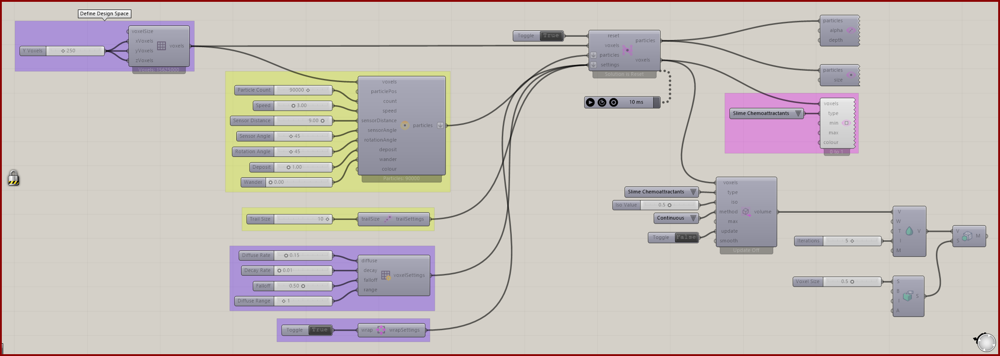

# 3D Intro

Explore a volumetric slime simulation and convert its field for meshing.

[Download 15_3D Intro.gh](files/15-3d-intro.gh)

*The saved definition, with its layout and values preserved. The capture is a canvas reference, not a newly simulated result.*

## Follow the definition

The definition uses a 250 × 250 × 250 domain and includes **Nuclei4 to Dendro Volume**, Dendro volume controls, and meshing components. Inspect the scalar preview and pause before rebuilding a heavy conversion.

## Components to inspect

- [Construct Voxels](../components/construct-voxels.md)
- [Nuclei4 Solver GPU](../components/nuclei4-solver-gpu.md)
- [Voxel Preview](../components/voxel-preview.md)
- [Voxel Wrap Settings](../components/voxel-wrap-settings.md)
- [Construct Slime Particles](../components/construct-slime-particles.md)
- [Voxel Settings Slime](../components/voxel-settings-slime.md)
- [Nuclei4 to Dendro Volume](../components/nuclei4-to-dendro-volume.md)
- [Particle Trail Settings](../components/particle-trail-settings.md)
- [Particle Preview](../components/particle-preview.md)
- [Particle Trail Preview](../components/particle-trail-preview.md)

## Saved controls

These are directly connected slider and value-list settings read from this file. Other inputs may come from geometry, expressions, or values stored on the component. Repeated rows refer to separate instances.

| Component | Input | Saved control |
| --- | --- | --- |
| Construct Voxels | X Voxels | 250 |
| Construct Voxels | Y Voxels | 250 |
| Construct Voxels | Z Voxels | 250 |
| Nuclei4 Solver GPU | Reset | True |
| Voxel Preview | Type | Slime Chemoattractants |
| Voxel Wrap Settings | Wrap | True |
| Construct Slime Particles | Particle Count | 90000 |
| Construct Slime Particles | Speed | 3 |
| Construct Slime Particles | Sensor Distance | 9 |
| Construct Slime Particles | Sensor Angle | 45 |
| Construct Slime Particles | Rotation Angle | 45 |
| Construct Slime Particles | Deposit | 1 |
| Construct Slime Particles | Wander | 0 |
| Voxel Settings Slime | Diffuse Rate | 0.15 |
| Voxel Settings Slime | Decay Rate | 0.01 |
| Voxel Settings Slime | Falloff | 0.5 |
| Voxel Settings Slime | Diffuse Range | 1 |
| Nuclei4 to Dendro Volume | Type | Slime Chemoattractants |
| Nuclei4 to Dendro Volume | Iso Value | 0.5 |
| Nuclei4 to Dendro Volume | Method | Continuous |
| Nuclei4 to Dendro Volume | Update | False |
| Particle Trail Settings | Trail Size | 10 |

## Run the example

Open it in Rhino 9 with Nuclei V4, pause the existing Trigger, and inspect the mapped field. Reset once with True, return reset to False, and start the Trigger. Pause before editing several inputs or extracting a large result.

This file also uses **Dendro** components. Those require Dendro to be installed; the Nuclei volume-conversion fallback does not replace missing downstream Dendro components.

## Try a comparison

Compare Iso Value and smoothing on a retained simulation state. Keep the particle simulation paused so changes in the mesh come from conversion settings.

## Example result

*Original result image supplied with this example. Your result depends on initial conditions and simulation duration.*

[Back to examples](README.md)
