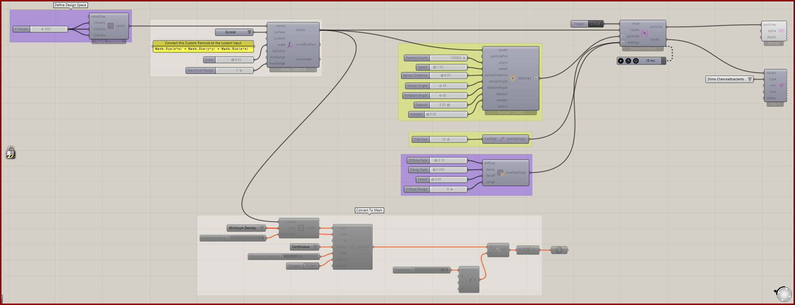

# Function Voxels

Use an implicit function to select a volumetric region and feed it into a simulation and volume conversion.

[Download 16_Function Voxels.gh](files/16-function-voxels.gh)

*The saved definition, with its layout and values preserved. The capture is a canvas reference, not a newly simulated result.*

## Follow the definition

The saved grid is 300 × 300 × 300. **Function Attractor** selects the region; **Define Voxel Values** assigns **Minimum Density** with multiplier 1. Follow that field to the solver and volume conversion.

## Components to inspect

- [Construct Voxels](../components/construct-voxels.md)
- [Nuclei4 Solver GPU](../components/nuclei4-solver-gpu.md)
- [Construct Slime Particles](../components/construct-slime-particles.md)
- [Voxel Settings Slime](../components/voxel-settings-slime.md)
- [Particle Trail Preview](../components/particle-trail-preview.md)
- [Particle Trail Settings](../components/particle-trail-settings.md)
- [Function Attractor](../components/function-attractor.md)
- [Define Voxel Values](../components/define-voxel-values.md)
- [Nuclei4 to Dendro Volume](../components/nuclei4-to-dendro-volume.md)
- [Voxel Preview](../components/voxel-preview.md)

## Saved controls

These are directly connected slider and value-list settings read from this file. Other inputs may come from geometry, expressions, or values stored on the component. Repeated rows refer to separate instances.

| Component | Input | Saved control |
| --- | --- | --- |
| Construct Voxels | X Voxels | 300 |
| Construct Voxels | Y Voxels | 300 |
| Construct Voxels | Z Voxels | 300 |
| Nuclei4 Solver GPU | Reset | True |
| Construct Slime Particles | Particle Count | 100000 |
| Construct Slime Particles | Speed | 1.3 |
| Construct Slime Particles | Sensor Distance | 6 |
| Construct Slime Particles | Sensor Angle | 45 |
| Construct Slime Particles | Rotation Angle | 45 |
| Construct Slime Particles | Deposit | 5 |
| Construct Slime Particles | Wander | 0 |
| Voxel Settings Slime | Diffuse Rate | 0.1 |
| Voxel Settings Slime | Decay Rate | 0.005 |
| Voxel Settings Slime | Falloff | 0 |
| Voxel Settings Slime | Diffuse Range | 6 |
| Particle Trail Settings | Trail Size | 10 |
| Function Attractor | Surface | Gyroid |
| Function Attractor | Scale | 9 |
| Function Attractor | Maximum Range | 7 |
| Define Voxel Values | Type | Minimum Density |
| Define Voxel Values | Multiplier Value | 1 |
| Nuclei4 to Dendro Volume | Type | Minimum Density |
| Nuclei4 to Dendro Volume | Method | Continuous |
| Nuclei4 to Dendro Volume | Maximum Elements | 50000000 |
| Nuclei4 to Dendro Volume | Update | True |
| Voxel Preview | Type | Slime Chemoattractants |

## Run the example

Open it in Rhino 9 with Nuclei V4, pause the existing Trigger, and inspect the mapped field. Reset once with True, return reset to False, and start the Trigger. Pause before editing several inputs or extracting a large result.

This file also uses **Dendro** components. Those require Dendro to be installed; the Nuclei volume-conversion fallback does not replace missing downstream Dendro components.

## Try a comparison

Change the preset or function range in a copy, then inspect selected voxels before running. Small changes in Iso Value can change topology, not merely move the same surface.

[Back to examples](README.md)
