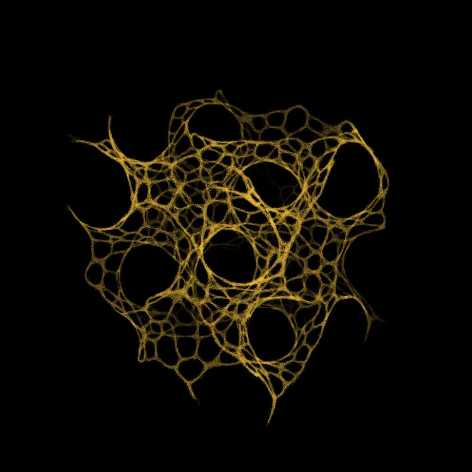
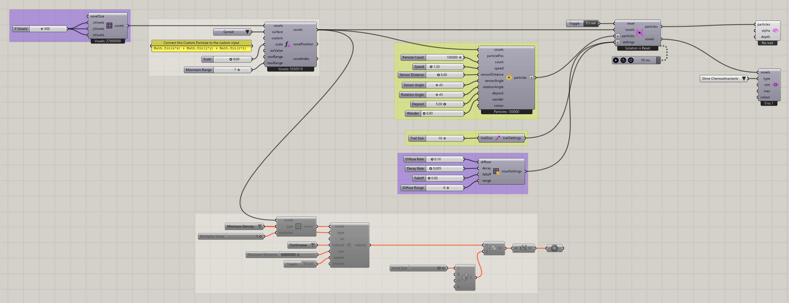

# Function Voxels

Use a mathematical pattern to organize a three-dimensional slime environment. Function Attractor is set to Gyroid, a repeating spatial form, and selects voxels according to the function and its range. The selected cells receive a minimum chemoattractant density of 1, creating a persistent attraction pattern for the particles to respond to.

The definition also converts the mapped minimum-density field to a volume, allowing you to inspect the geometry of the supplied pattern alongside the simulation. Use this example to explore how function choice, scale, and selection range change the attraction geometry, then observe how the particle trails respond to that environment.



[Download 15_Function Voxels.gh](files/16-function-voxels.gh)



## Follow the definition

The saved grid is 300 × 300 × 300. [Function Attractor](../components/function-attractor.md) selects the region; [Define Voxel Values](../components/define-voxel-values.md) assigns **Minimum Density** with multiplier 1. Follow that field to the solver and volume conversion.

<details>
<summary>Components used</summary>

- [Construct Voxels](../components/construct-voxels.md)
- [Nuclei4 Solver GPU](../components/nuclei4-solver-gpu.md)
- [Construct Slime Particles](../components/construct-slime-particles.md)
- [Voxel Settings Slime](../components/voxel-settings-slime.md)
- [Particle Trail Preview](../components/particle-trail-preview.md)
- [Particle Trail Settings](../components/particle-trail-settings.md)
- [Function Attractor](../components/function-attractor.md)
- [Define Voxel Values](../components/define-voxel-values.md)
- [Nuclei4 to Dendro Volume](../components/nuclei4-to-dendro-volume.md)
- [Voxel Preview](../components/voxel-preview.md)

</details>

<details>
<summary>Saved controls</summary>

Slider and value-list settings saved in this definition. Repeated rows belong to different component instances.

| Component | Input | Saved control |
| --- | --- | --- |
| Construct Voxels | X Voxels | 300 |
| Construct Voxels | Y Voxels | 300 |
| Construct Voxels | Z Voxels | 300 |
| Nuclei4 Solver GPU | Reset | True |
| Construct Slime Particles | Particle Count | 100000 |
| Construct Slime Particles | Speed | 1.3 |
| Construct Slime Particles | Sensor Distance | 6 |
| Construct Slime Particles | Sensor Angle | 45 |
| Construct Slime Particles | Rotation Angle | 45 |
| Construct Slime Particles | Deposit | 5 |
| Construct Slime Particles | Wander | 0 |
| Voxel Settings Slime | Diffuse Rate | 0.1 |
| Voxel Settings Slime | Decay Rate | 0.005 |
| Voxel Settings Slime | Falloff | 0 |
| Voxel Settings Slime | Diffuse Range | 6 |
| Particle Trail Settings | Trail Size | 10 |
| Function Attractor | Surface | Gyroid |
| Function Attractor | Scale | 9 |
| Function Attractor | Maximum Range | 7 |
| Define Voxel Values | Type | Minimum Density |
| Define Voxel Values | Multiplier Value | 1 |
| Nuclei4 to Dendro Volume | Type | Minimum Density |
| Nuclei4 to Dendro Volume | Method | Continuous |
| Nuclei4 to Dendro Volume | Maximum Elements | 50000000 |
| Nuclei4 to Dendro Volume | Update | True |
| Voxel Preview | Type | Slime Chemoattractants |

</details>

## Run the example

Open it in Rhino 9 with Nuclei V4, pause the existing Trigger, and inspect the mapped field. Reset once with True, return reset to False, and start the Trigger. Pause before editing several inputs or extracting a large result.

This file also uses **Dendro** components. Those require Dendro to be installed; the Nuclei volume-conversion fallback does not replace missing downstream Dendro components.

## Try a comparison

Change the preset or function range in a copy, then inspect selected voxels before running. Small changes in Iso Value can change topology, not merely move the same surface.

[Back to examples](README.md)

<details>
<summary>Grasshopper definition (JSON)</summary>

[Download JSON](data/16-function-voxels.json) · [JSON Schema](../reference/definition.schema.json) · [How to read this JSON](../reference/reading-json.md)

This records the saved definition. Geometry and other binary payloads remain in the original `.gh` file.

```json
{
  "$schema": "../../reference/definition.schema.json",
  "schemaVersion": 1,
  "title": "Function Voxels",
  "source": {"file":"../files/16-function-voxels.gh","sha256":"a1ec7e92ef8d62affe28f14370528ef668516ca0128bb3f612ff8caebe048949","documentId":"014084e4-ea51-4fb6-8b8f-2d10c8914d28"},
  "extraction": {"method":"GH_IO archive read without loading components or solving","coverage":"All saved top-level objects and Source wires; not an executable replacement for the .gh file","limitations":["Binary geometry and image payloads are omitted and identified by archive XML hashes.","External files and Rhino document geometry are not bundled. Inspect saved paths and references.","Runtime outputs, nested cluster internals and plugin-specific behavior are not reconstructed.","Saved library versions describe the archive, not a guarantee of compatibility with newer components."],"omittedBinaryPaths":[],"unresolvedGroupMembers":[{"groupId":"042bab6e-7f62-41c7-857e-ba559bf4c14d","memberId":"8556110e-65cb-45d8-8f8e-df992fd08398"},{"groupId":"042bab6e-7f62-41c7-857e-ba559bf4c14d","memberId":"bc7cc803-8295-4f3b-a832-39169eb93427"},{"groupId":"042bab6e-7f62-41c7-857e-ba559bf4c14d","memberId":"ff4ca24e-df15-4e88-ae0e-ecd129da2cb6"},{"groupId":"042bab6e-7f62-41c7-857e-ba559bf4c14d","memberId":"53a0c2d2-2ff9-4c1e-8901-37df0857d199"},{"groupId":"042bab6e-7f62-41c7-857e-ba559bf4c14d","memberId":"7cc78014-29cb-4d05-8d69-3d78b9425d2e"},{"groupId":"042bab6e-7f62-41c7-857e-ba559bf4c14d","memberId":"a21a7462-ef0d-49de-880c-cf3895e4c435"},{"groupId":"e54d32b5-2035-4709-9fcc-d2c06fda826f","memberId":"2378d602-76a0-4f40-b308-76534908e36f"},{"groupId":"e54d32b5-2035-4709-9fcc-d2c06fda826f","memberId":"6e7d0e3a-8904-43cc-b06e-be6bc4bf0a15"},{"groupId":"d3802ee2-1074-4715-8dfc-282053c5e13b","memberId":"659075c6-0bff-4e87-875c-6b9e27f45268"},{"groupId":"d3802ee2-1074-4715-8dfc-282053c5e13b","memberId":"ea8ca145-08c3-4a46-a6b4-0f43a5b3dbfb"},{"groupId":"52c1cbc1-37ef-4053-8547-c87eb55de275","memberId":"57bd719d-177d-4272-91f1-92a5305c1626"},{"groupId":"39aaa0e2-df1a-45f2-b9da-e94bfcd24ec4","memberId":"8a28dff1-8666-4e22-8aa8-f6f3e4c8fd9a"},{"groupId":"542d2a07-6ffa-4c71-8856-f21f1cd37dc1","memberId":"d08536e2-9eeb-4860-b9bf-4e03cedd3b51"},{"groupId":"960f9eae-0913-4cc5-8f66-3b0c093aa17d","memberId":"803219f4-1514-4359-9b4e-ca02f1a373e8"},{"groupId":"1bf186d4-3066-480f-adf4-f451c4c8416a","memberId":"a0535faf-3fb5-42fe-9409-c4e732fa9d83"},{"groupId":"326c7f50-6821-4950-82fd-ce8fa14a6ac3","memberId":"3595d71b-1733-4d54-a50f-85da0a949fde"},{"groupId":"326c7f50-6821-4950-82fd-ce8fa14a6ac3","memberId":"33e66867-d0f7-4ed6-bf2e-05a5d47be5ba"},{"groupId":"326c7f50-6821-4950-82fd-ce8fa14a6ac3","memberId":"710f20a2-e74a-4f48-9eeb-16a716b8f69e"},{"groupId":"326c7f50-6821-4950-82fd-ce8fa14a6ac3","memberId":"3c34396b-f62a-4c86-92ff-92cd93c44497"},{"groupId":"326c7f50-6821-4950-82fd-ce8fa14a6ac3","memberId":"2a78054a-4d37-4bdb-bb20-0e0b8ecd25cd"},{"groupId":"326c7f50-6821-4950-82fd-ce8fa14a6ac3","memberId":"6f811524-edd2-492a-a342-170f2d4863c0"},{"groupId":"326c7f50-6821-4950-82fd-ce8fa14a6ac3","memberId":"729cb0ee-a652-4d9b-a126-8f4a70098555"},{"groupId":"326c7f50-6821-4950-82fd-ce8fa14a6ac3","memberId":"9d5ce7c9-4a6a-4878-999e-7da03d25094f"},{"groupId":"326c7f50-6821-4950-82fd-ce8fa14a6ac3","memberId":"3a078fb8-b274-420e-b89b-ab10e90e1777"}]},
  "libraries": [{"name":"Library","items":[{"name":"Author","type":"gh_string","value":"Robert McNeel & Associates"},{"name":"Id","type":"gh_guid","value":"00000000-0000-0000-0000-000000000000"},{"name":"Name","type":"gh_string","value":"Grasshopper"},{"name":"Version","type":"gh_string","value":"9.0.26251.12303"}],"chunks":[],"index":0},{"name":"Library","items":[{"name":"AssemblyFullName","type":"gh_string","value":"Meshedit2000, Version=2.0.0.0, Culture=neutral, PublicKeyToken=null"},{"name":"AssemblyVersion","type":"gh_string","value":"2.0.0.0"},{"name":"Author","type":"gh_string","value":"[uto]"},{"name":"Id","type":"gh_guid","value":"14601aeb-b64f-9304-459d-d5d06df91218"},{"name":"Name","type":"gh_string","value":"MeshEdit Components"},{"name":"Version","type":"gh_string","value":"2.0.0.0"}],"chunks":[],"index":1},{"name":"Library","items":[{"name":"AssemblyFullName","type":"gh_string","value":"Nuclei4, Version=4.1.0.0, Culture=neutral, PublicKeyToken=null"},{"name":"AssemblyVersion","type":"gh_string","value":"4.1.0.0"},{"name":"Author","type":"gh_string","value":"Madalin Gheorghe"},{"name":"Id","type":"gh_guid","value":"a4810f34-10b6-480c-a6d0-607aac4e8d2a"},{"name":"Name","type":"gh_string","value":"Nuclei4"},{"name":"Version","type":"gh_string","value":""}],"chunks":[],"index":2},{"name":"Library","items":[{"name":"AssemblyFullName","type":"gh_string","value":"DendroGH, Version=0.9.0.0, Culture=neutral, PublicKeyToken=null"},{"name":"AssemblyVersion","type":"gh_string","value":"0.9.0.0"},{"name":"Author","type":"gh_string","value":"ecr labs"},{"name":"Id","type":"gh_guid","value":"e355f38c-064c-4317-a17c-499c5a2fcded"},{"name":"Name","type":"gh_string","value":"DendroGH"},{"name":"Version","type":"gh_string","value":"0.9.1-alpha"}],"chunks":[],"index":3}],
  "nodes": [
    {"id":"042bab6e-7f62-41c7-857e-ba559bf4c14d","componentGuid":"c552a431-af5b-46a9-a8a4-0fcbc27ef596","name":"Group","nickname":"","libraryId":null,"inputs":[],"outputs":[],"savedState":{"name":"Container","items":[{"name":"Border","type":"gh_int32","value":"1"},{"name":"Colour","type":"gh_drawing_color","xmlValue":"<item name=\"Colour\" type_name=\"gh_drawing_color\" type_code=\"36\">\n                      <ARGB>75;234;0;255</ARGB>\n                    </item>"},{"name":"Description","type":"gh_string","value":"A group of Grasshopper objects"},{"name":"ID","type":"gh_guid","index":0,"value":"8556110e-65cb-45d8-8f8e-df992fd08398"},{"name":"ID","type":"gh_guid","index":1,"value":"bc7cc803-8295-4f3b-a832-39169eb93427"},{"name":"ID","type":"gh_guid","index":2,"value":"ff4ca24e-df15-4e88-ae0e-ecd129da2cb6"},{"name":"ID","type":"gh_guid","index":3,"value":"53a0c2d2-2ff9-4c1e-8901-37df0857d199"},{"name":"ID","type":"gh_guid","index":4,"value":"7cc78014-29cb-4d05-8d69-3d78b9425d2e"},{"name":"ID","type":"gh_guid","index":5,"value":"a21a7462-ef0d-49de-880c-cf3895e4c435"},{"name":"ID_Count","type":"gh_int32","value":"6"},{"name":"InstanceGuid","type":"gh_guid","value":"042bab6e-7f62-41c7-857e-ba559bf4c14d"},{"name":"Name","type":"gh_string","value":"Group"},{"name":"NickName","type":"gh_string","value":""}],"chunks":[]},"canvas":{"name":"Attributes","items":[],"chunks":[]},"groupMembers":["8556110e-65cb-45d8-8f8e-df992fd08398","bc7cc803-8295-4f3b-a832-39169eb93427","ff4ca24e-df15-4e88-ae0e-ecd129da2cb6","53a0c2d2-2ff9-4c1e-8901-37df0857d199","7cc78014-29cb-4d05-8d69-3d78b9425d2e","a21a7462-ef0d-49de-880c-cf3895e4c435"]},
    {"id":"e54d32b5-2035-4709-9fcc-d2c06fda826f","componentGuid":"c552a431-af5b-46a9-a8a4-0fcbc27ef596","name":"Group","nickname":"","libraryId":null,"inputs":[],"outputs":[],"savedState":{"name":"Container","items":[{"name":"Border","type":"gh_int32","value":"1"},{"name":"Colour","type":"gh_drawing_color","xmlValue":"<item name=\"Colour\" type_name=\"gh_drawing_color\" type_code=\"36\">\n                      <ARGB>75;221;255;0</ARGB>\n                    </item>"},{"name":"Description","type":"gh_string","value":"A group of Grasshopper objects"},{"name":"ID","type":"gh_guid","index":0,"value":"2378d602-76a0-4f40-b308-76534908e36f"},{"name":"ID","type":"gh_guid","index":1,"value":"6e7d0e3a-8904-43cc-b06e-be6bc4bf0a15"},{"name":"ID","type":"gh_guid","index":2,"value":"8568bf0c-38c9-4a7e-ae7f-88efa3ae3f86"},{"name":"ID","type":"gh_guid","index":3,"value":"83e98b8b-3a0b-4ff7-aac6-3c9d58ed329a"},{"name":"ID","type":"gh_guid","index":4,"value":"dd477585-0409-4221-8264-78f2a0810aa5"},{"name":"ID","type":"gh_guid","index":5,"value":"0f2cb393-7903-4178-ae01-2b8335d55963"},{"name":"ID","type":"gh_guid","index":6,"value":"064a85b7-0a65-48be-9614-48bc6b48791a"},{"name":"ID","type":"gh_guid","index":7,"value":"1b233e21-ebe3-4bb3-ace8-b74648abf4fe"},{"name":"ID","type":"gh_guid","index":8,"value":"f2a30ffe-2093-42f3-80a6-2ea75c6cbb0a"},{"name":"ID","type":"gh_guid","index":9,"value":"00bf381f-43ca-40cf-9183-383f1e0137ea"},{"name":"ID_Count","type":"gh_int32","value":"10"},{"name":"InstanceGuid","type":"gh_guid","value":"e54d32b5-2035-4709-9fcc-d2c06fda826f"},{"name":"Name","type":"gh_string","value":"Group"},{"name":"NickName","type":"gh_string","value":""}],"chunks":[]},"canvas":{"name":"Attributes","items":[],"chunks":[]},"groupMembers":["2378d602-76a0-4f40-b308-76534908e36f","6e7d0e3a-8904-43cc-b06e-be6bc4bf0a15","8568bf0c-38c9-4a7e-ae7f-88efa3ae3f86","83e98b8b-3a0b-4ff7-aac6-3c9d58ed329a","dd477585-0409-4221-8264-78f2a0810aa5","0f2cb393-7903-4178-ae01-2b8335d55963","064a85b7-0a65-48be-9614-48bc6b48791a","1b233e21-ebe3-4bb3-ace8-b74648abf4fe","f2a30ffe-2093-42f3-80a6-2ea75c6cbb0a","00bf381f-43ca-40cf-9183-383f1e0137ea"]},
    {"id":"d3802ee2-1074-4715-8dfc-282053c5e13b","componentGuid":"c552a431-af5b-46a9-a8a4-0fcbc27ef596","name":"Group","nickname":"","libraryId":null,"inputs":[],"outputs":[],"savedState":{"name":"Container","items":[{"name":"Border","type":"gh_int32","value":"1"},{"name":"Colour","type":"gh_drawing_color","xmlValue":"<item name=\"Colour\" type_name=\"gh_drawing_color\" type_code=\"36\">\n                      <ARGB>75;76;0;255</ARGB>\n                    </item>"},{"name":"Description","type":"gh_string","value":"A group of Grasshopper objects"},{"name":"ID","type":"gh_guid","index":0,"value":"659075c6-0bff-4e87-875c-6b9e27f45268"},{"name":"ID","type":"gh_guid","index":1,"value":"ea8ca145-08c3-4a46-a6b4-0f43a5b3dbfb"},{"name":"ID","type":"gh_guid","index":2,"value":"4ee7f808-1186-49b5-b57e-170dd0b6e7f2"},{"name":"ID","type":"gh_guid","index":3,"value":"27ac07d0-2d80-4988-a952-78b2f0db6f24"},{"name":"ID","type":"gh_guid","index":4,"value":"a433c6b4-1602-4bbe-9540-2210b4d357b9"},{"name":"ID","type":"gh_guid","index":5,"value":"660a213e-1091-4f1f-bd82-68370b8690e1"},{"name":"ID_Count","type":"gh_int32","value":"6"},{"name":"InstanceGuid","type":"gh_guid","value":"d3802ee2-1074-4715-8dfc-282053c5e13b"},{"name":"Name","type":"gh_string","value":"Group"},{"name":"NickName","type":"gh_string","value":""}],"chunks":[]},"canvas":{"name":"Attributes","items":[],"chunks":[]},"groupMembers":["659075c6-0bff-4e87-875c-6b9e27f45268","ea8ca145-08c3-4a46-a6b4-0f43a5b3dbfb","4ee7f808-1186-49b5-b57e-170dd0b6e7f2","27ac07d0-2d80-4988-a952-78b2f0db6f24","a433c6b4-1602-4bbe-9540-2210b4d357b9","660a213e-1091-4f1f-bd82-68370b8690e1"]},
    {"id":"52c1cbc1-37ef-4053-8547-c87eb55de275","componentGuid":"c552a431-af5b-46a9-a8a4-0fcbc27ef596","name":"Group","nickname":"Colour Swatch","libraryId":null,"inputs":[],"outputs":[],"savedState":{"name":"Container","items":[{"name":"Border","type":"gh_int32","value":"1"},{"name":"Colour","type":"gh_drawing_color","xmlValue":"<item name=\"Colour\" type_name=\"gh_drawing_color\" type_code=\"36\">\n                      <ARGB>0;100;150;75</ARGB>\n                    </item>"},{"name":"Description","type":"gh_string","value":"A group of Grasshopper objects"},{"name":"ID","type":"gh_guid","index":0,"value":"57bd719d-177d-4272-91f1-92a5305c1626"},{"name":"ID_Count","type":"gh_int32","value":"1"},{"name":"InstanceGuid","type":"gh_guid","value":"52c1cbc1-37ef-4053-8547-c87eb55de275"},{"name":"Name","type":"gh_string","value":"Group"},{"name":"NickName","type":"gh_string","value":"Colour Swatch"}],"chunks":[]},"canvas":{"name":"Attributes","items":[],"chunks":[]},"groupMembers":["57bd719d-177d-4272-91f1-92a5305c1626"]},
    {"id":"39aaa0e2-df1a-45f2-b9da-e94bfcd24ec4","componentGuid":"c552a431-af5b-46a9-a8a4-0fcbc27ef596","name":"Group","nickname":"Nuclei3 Solver","libraryId":null,"inputs":[],"outputs":[],"savedState":{"name":"Container","items":[{"name":"Border","type":"gh_int32","value":"1"},{"name":"Colour","type":"gh_drawing_color","xmlValue":"<item name=\"Colour\" type_name=\"gh_drawing_color\" type_code=\"36\">\n                      <ARGB>0;100;150;75</ARGB>\n                    </item>"},{"name":"Description","type":"gh_string","value":"A group of Grasshopper objects"},{"name":"ID","type":"gh_guid","index":0,"value":"8a28dff1-8666-4e22-8aa8-f6f3e4c8fd9a"},{"name":"ID_Count","type":"gh_int32","value":"1"},{"name":"InstanceGuid","type":"gh_guid","value":"39aaa0e2-df1a-45f2-b9da-e94bfcd24ec4"},{"name":"Name","type":"gh_string","value":"Group"},{"name":"NickName","type":"gh_string","value":"Nuclei3 Solver"}],"chunks":[]},"canvas":{"name":"Attributes","items":[],"chunks":[]},"groupMembers":["8a28dff1-8666-4e22-8aa8-f6f3e4c8fd9a"]},
    {"id":"542d2a07-6ffa-4c71-8856-f21f1cd37dc1","componentGuid":"c552a431-af5b-46a9-a8a4-0fcbc27ef596","name":"Group","nickname":"Construct Slime Particle Groups","libraryId":null,"inputs":[],"outputs":[],"savedState":{"name":"Container","items":[{"name":"Border","type":"gh_int32","value":"1"},{"name":"Colour","type":"gh_drawing_color","xmlValue":"<item name=\"Colour\" type_name=\"gh_drawing_color\" type_code=\"36\">\n                      <ARGB>0;100;150;75</ARGB>\n                    </item>"},{"name":"Description","type":"gh_string","value":"A group of Grasshopper objects"},{"name":"ID","type":"gh_guid","index":0,"value":"d08536e2-9eeb-4860-b9bf-4e03cedd3b51"},{"name":"ID_Count","type":"gh_int32","value":"1"},{"name":"InstanceGuid","type":"gh_guid","value":"542d2a07-6ffa-4c71-8856-f21f1cd37dc1"},{"name":"Name","type":"gh_string","value":"Group"},{"name":"NickName","type":"gh_string","value":"Construct Slime Particle Groups"}],"chunks":[]},"canvas":{"name":"Attributes","items":[],"chunks":[]},"groupMembers":["d08536e2-9eeb-4860-b9bf-4e03cedd3b51"]},
    {"id":"960f9eae-0913-4cc5-8f66-3b0c093aa17d","componentGuid":"c552a431-af5b-46a9-a8a4-0fcbc27ef596","name":"Group","nickname":"Construct Ant Particles","libraryId":null,"inputs":[],"outputs":[],"savedState":{"name":"Container","items":[{"name":"Border","type":"gh_int32","value":"1"},{"name":"Colour","type":"gh_drawing_color","xmlValue":"<item name=\"Colour\" type_name=\"gh_drawing_color\" type_code=\"36\">\n                      <ARGB>0;100;150;75</ARGB>\n                    </item>"},{"name":"Description","type":"gh_string","value":"A group of Grasshopper objects"},{"name":"ID","type":"gh_guid","index":0,"value":"803219f4-1514-4359-9b4e-ca02f1a373e8"},{"name":"ID_Count","type":"gh_int32","value":"1"},{"name":"InstanceGuid","type":"gh_guid","value":"960f9eae-0913-4cc5-8f66-3b0c093aa17d"},{"name":"Name","type":"gh_string","value":"Group"},{"name":"NickName","type":"gh_string","value":"Construct Ant Particles"}],"chunks":[]},"canvas":{"name":"Attributes","items":[],"chunks":[]},"groupMembers":["803219f4-1514-4359-9b4e-ca02f1a373e8"]},
    {"id":"1bf186d4-3066-480f-adf4-f451c4c8416a","componentGuid":"c552a431-af5b-46a9-a8a4-0fcbc27ef596","name":"Group","nickname":"Voxel Settings Slime","libraryId":null,"inputs":[],"outputs":[],"savedState":{"name":"Container","items":[{"name":"Border","type":"gh_int32","value":"1"},{"name":"Colour","type":"gh_drawing_color","xmlValue":"<item name=\"Colour\" type_name=\"gh_drawing_color\" type_code=\"36\">\n                      <ARGB>0;100;150;75</ARGB>\n                    </item>"},{"name":"Description","type":"gh_string","value":"A group of Grasshopper objects"},{"name":"ID","type":"gh_guid","index":0,"value":"a0535faf-3fb5-42fe-9409-c4e732fa9d83"},{"name":"ID_Count","type":"gh_int32","value":"1"},{"name":"InstanceGuid","type":"gh_guid","value":"1bf186d4-3066-480f-adf4-f451c4c8416a"},{"name":"Name","type":"gh_string","value":"Group"},{"name":"NickName","type":"gh_string","value":"Voxel Settings Slime"}],"chunks":[]},"canvas":{"name":"Attributes","items":[],"chunks":[]},"groupMembers":["a0535faf-3fb5-42fe-9409-c4e732fa9d83"]},
    {"id":"d0a77602-7d5b-4ee5-bc21-e38c3bed4f5f","componentGuid":"a3940a4d-9015-411c-9ffa-e38ecc90d394","name":"Construct Voxels","nickname":"Construct Voxels","libraryId":"a4810f34-10b6-480c-a6d0-607aac4e8d2a","inputs":[{"id":"cb2c7f63-b03f-44be-8435-014c3886c90e","index":0,"name":"Voxel Size","nickname":"voxelSize","savedState":{"name":"param_input","items":[{"name":"Description","type":"gh_string","value":"Size of one voxel in x,y,z"},{"name":"InstanceGuid","type":"gh_guid","value":"cb2c7f63-b03f-44be-8435-014c3886c90e"},{"name":"Name","type":"gh_string","value":"Voxel Size"},{"name":"NickName","type":"gh_string","value":"voxelSize"},{"name":"Optional","type":"gh_bool","value":"false"},{"name":"SourceCount","type":"gh_int32","value":"0"}],"chunks":[{"name":"PersistentData","items":[{"name":"Count","type":"gh_int32","value":"1"}],"chunks":[{"name":"Branch","items":[{"name":"Count","type":"gh_int32","value":"1"},{"name":"Path","type":"gh_string","value":"{0}"}],"chunks":[{"name":"Item","items":[{"name":"number","type":"gh_double","value":"1"}],"chunks":[],"index":0}],"index":0}]}],"index":0}},{"id":"2c1d2d33-18ee-4d69-85aa-aabf53fba03c","index":1,"name":"X Voxels","nickname":"xVoxels","savedState":{"name":"param_input","items":[{"name":"Description","type":"gh_string","value":"Number of voxels in X"},{"name":"InstanceGuid","type":"gh_guid","value":"2c1d2d33-18ee-4d69-85aa-aabf53fba03c"},{"name":"Name","type":"gh_string","value":"X Voxels"},{"name":"NickName","type":"gh_string","value":"xVoxels"},{"name":"Optional","type":"gh_bool","value":"false"},{"name":"Source","type":"gh_guid","index":0,"value":"520ff89f-f0a9-4e7c-8b11-13bce7ad432b"},{"name":"SourceCount","type":"gh_int32","value":"1"}],"chunks":[{"name":"PersistentData","items":[{"name":"Count","type":"gh_int32","value":"1"}],"chunks":[{"name":"Branch","items":[{"name":"Count","type":"gh_int32","value":"1"},{"name":"Path","type":"gh_string","value":"{0}"}],"chunks":[{"name":"Item","items":[{"name":"number","type":"gh_int32","value":"100"}],"chunks":[],"index":0}],"index":0}]}],"index":1}},{"id":"4e9c2b2f-5d67-4536-8091-bd521f001e4e","index":2,"name":"Y Voxels","nickname":"yVoxels","savedState":{"name":"param_input","items":[{"name":"Description","type":"gh_string","value":"Number of voxels in Y"},{"name":"InstanceGuid","type":"gh_guid","value":"4e9c2b2f-5d67-4536-8091-bd521f001e4e"},{"name":"Name","type":"gh_string","value":"Y Voxels"},{"name":"NickName","type":"gh_string","value":"yVoxels"},{"name":"Optional","type":"gh_bool","value":"false"},{"name":"Source","type":"gh_guid","index":0,"value":"520ff89f-f0a9-4e7c-8b11-13bce7ad432b"},{"name":"SourceCount","type":"gh_int32","value":"1"}],"chunks":[{"name":"PersistentData","items":[{"name":"Count","type":"gh_int32","value":"1"}],"chunks":[{"name":"Branch","items":[{"name":"Count","type":"gh_int32","value":"1"},{"name":"Path","type":"gh_string","value":"{0}"}],"chunks":[{"name":"Item","items":[{"name":"number","type":"gh_int32","value":"100"}],"chunks":[],"index":0}],"index":0}]}],"index":2}},{"id":"eabbf358-2e6b-445a-ace5-64440161fbaa","index":3,"name":"Z Voxels","nickname":"zVoxels","savedState":{"name":"param_input","items":[{"name":"Description","type":"gh_string","value":"Number of voxels in Z"},{"name":"InstanceGuid","type":"gh_guid","value":"eabbf358-2e6b-445a-ace5-64440161fbaa"},{"name":"Name","type":"gh_string","value":"Z Voxels"},{"name":"NickName","type":"gh_string","value":"zVoxels"},{"name":"Optional","type":"gh_bool","value":"false"},{"name":"Source","type":"gh_guid","index":0,"value":"520ff89f-f0a9-4e7c-8b11-13bce7ad432b"},{"name":"SourceCount","type":"gh_int32","value":"1"}],"chunks":[{"name":"PersistentData","items":[{"name":"Count","type":"gh_int32","value":"1"}],"chunks":[{"name":"Branch","items":[{"name":"Count","type":"gh_int32","value":"1"},{"name":"Path","type":"gh_string","value":"{0}"}],"chunks":[{"name":"Item","items":[{"name":"number","type":"gh_int32","value":"1"}],"chunks":[],"index":0}],"index":0}]}],"index":3}}],"outputs":[{"id":"79c5924f-cf37-488d-a649-73b119ffd673","index":0,"name":"Output Voxels","nickname":"voxels","savedState":{"name":"param_output","items":[{"name":"Description","type":"gh_string","value":"Output Voxels"},{"name":"InstanceGuid","type":"gh_guid","value":"79c5924f-cf37-488d-a649-73b119ffd673"},{"name":"Name","type":"gh_string","value":"Output Voxels"},{"name":"NickName","type":"gh_string","value":"voxels"},{"name":"Optional","type":"gh_bool","value":"false"},{"name":"SourceCount","type":"gh_int32","value":"0"}],"chunks":[],"index":0}}],"savedState":{"name":"Container","items":[{"name":"Description","type":"gh_string","value":"Construct Empty Voxel Field Environment"},{"name":"Hidden","type":"gh_bool","value":"true"},{"name":"InstanceGuid","type":"gh_guid","value":"d0a77602-7d5b-4ee5-bc21-e38c3bed4f5f"},{"name":"Name","type":"gh_string","value":"Construct Voxels"},{"name":"NickName","type":"gh_string","value":"Construct Voxels"}],"chunks":[]},"canvas":{"name":"Attributes","items":[{"name":"Bounds","type":"gh_drawing_rectanglef","xmlValue":"<item name=\"Bounds\" type_name=\"gh_drawing_rectanglef\" type_code=\"35\">\n                          <X>408</X>\n                          <Y>61</Y>\n                          <W>125</W>\n                          <H>84</H>\n                        </item>"},{"name":"Pivot","type":"gh_drawing_pointf","xmlValue":"<item name=\"Pivot\" type_name=\"gh_drawing_pointf\" type_code=\"31\">\n                          <X>476</X>\n                          <Y>103</Y>\n                        </item>"}],"chunks":[]},"groupMembers":[]},
    {"id":"326c7f50-6821-4950-82fd-ce8fa14a6ac3","componentGuid":"c552a431-af5b-46a9-a8a4-0fcbc27ef596","name":"Group","nickname":"Define Design Space","libraryId":null,"inputs":[],"outputs":[],"savedState":{"name":"Container","items":[{"name":"Border","type":"gh_int32","value":"1"},{"name":"Colour","type":"gh_drawing_color","xmlValue":"<item name=\"Colour\" type_name=\"gh_drawing_color\" type_code=\"36\">\n                      <ARGB>75;76;0;255</ARGB>\n                    </item>"},{"name":"Description","type":"gh_string","value":"A group of Grasshopper objects"},{"name":"ID","type":"gh_guid","index":0,"value":"3595d71b-1733-4d54-a50f-85da0a949fde"},{"name":"ID","type":"gh_guid","index":1,"value":"520ff89f-f0a9-4e7c-8b11-13bce7ad432b"},{"name":"ID","type":"gh_guid","index":2,"value":"33e66867-d0f7-4ed6-bf2e-05a5d47be5ba"},{"name":"ID","type":"gh_guid","index":3,"value":"710f20a2-e74a-4f48-9eeb-16a716b8f69e"},{"name":"ID","type":"gh_guid","index":4,"value":"3c34396b-f62a-4c86-92ff-92cd93c44497"},{"name":"ID","type":"gh_guid","index":5,"value":"2a78054a-4d37-4bdb-bb20-0e0b8ecd25cd"},{"name":"ID","type":"gh_guid","index":6,"value":"6f811524-edd2-492a-a342-170f2d4863c0"},{"name":"ID","type":"gh_guid","index":7,"value":"729cb0ee-a652-4d9b-a126-8f4a70098555"},{"name":"ID","type":"gh_guid","index":8,"value":"9d5ce7c9-4a6a-4878-999e-7da03d25094f"},{"name":"ID","type":"gh_guid","index":9,"value":"3a078fb8-b274-420e-b89b-ab10e90e1777"},{"name":"ID","type":"gh_guid","index":10,"value":"d0a77602-7d5b-4ee5-bc21-e38c3bed4f5f"},{"name":"ID_Count","type":"gh_int32","value":"11"},{"name":"InstanceGuid","type":"gh_guid","value":"326c7f50-6821-4950-82fd-ce8fa14a6ac3"},{"name":"Name","type":"gh_string","value":"Group"},{"name":"NickName","type":"gh_string","value":"Define Design Space"}],"chunks":[]},"canvas":{"name":"Attributes","items":[],"chunks":[]},"groupMembers":["3595d71b-1733-4d54-a50f-85da0a949fde","520ff89f-f0a9-4e7c-8b11-13bce7ad432b","33e66867-d0f7-4ed6-bf2e-05a5d47be5ba","710f20a2-e74a-4f48-9eeb-16a716b8f69e","3c34396b-f62a-4c86-92ff-92cd93c44497","2a78054a-4d37-4bdb-bb20-0e0b8ecd25cd","6f811524-edd2-492a-a342-170f2d4863c0","729cb0ee-a652-4d9b-a126-8f4a70098555","9d5ce7c9-4a6a-4878-999e-7da03d25094f","3a078fb8-b274-420e-b89b-ab10e90e1777","d0a77602-7d5b-4ee5-bc21-e38c3bed4f5f"]},
    {"id":"520ff89f-f0a9-4e7c-8b11-13bce7ad432b","componentGuid":"57da07bd-ecab-415d-9d86-af36d7073abc","name":"Number Slider","nickname":"","libraryId":null,"inputs":[],"outputs":[],"savedState":{"name":"Container","items":[{"name":"Description","type":"gh_string","value":"Numeric slider for single values"},{"name":"InstanceGuid","type":"gh_guid","value":"520ff89f-f0a9-4e7c-8b11-13bce7ad432b"},{"name":"Name","type":"gh_string","value":"Number Slider"},{"name":"NickName","type":"gh_string","value":""},{"name":"Optional","type":"gh_bool","value":"false"},{"name":"SourceCount","type":"gh_int32","value":"0"}],"chunks":[{"name":"Slider","items":[{"name":"Digits","type":"gh_int32","value":"3"},{"name":"GripDisplay","type":"gh_int32","value":"1"},{"name":"Interval","type":"gh_int32","value":"1"},{"name":"Max","type":"gh_double","value":"1000"},{"name":"Min","type":"gh_double","value":"0"},{"name":"SnapCount","type":"gh_int32","value":"0"},{"name":"Value","type":"gh_double","value":"300"}],"chunks":[]}]},"canvas":{"name":"Attributes","items":[{"name":"Bounds","type":"gh_drawing_rectanglef","xmlValue":"<item name=\"Bounds\" type_name=\"gh_drawing_rectanglef\" type_code=\"35\">\n                          <X>165</X>\n                          <Y>103</Y>\n                          <W>174</W>\n                          <H>20</H>\n                        </item>"},{"name":"Pivot","type":"gh_drawing_pointf","xmlValue":"<item name=\"Pivot\" type_name=\"gh_drawing_pointf\" type_code=\"31\">\n                          <X>165.3976</X>\n                          <Y>103.164505</Y>\n                        </item>"}],"chunks":[]},"groupMembers":[]},
    {"id":"8568bf0c-38c9-4a7e-ae7f-88efa3ae3f86","componentGuid":"57da07bd-ecab-415d-9d86-af36d7073abc","name":"Number Slider","nickname":"","libraryId":null,"inputs":[],"outputs":[],"savedState":{"name":"Container","items":[{"name":"Description","type":"gh_string","value":"Numeric slider for single values"},{"name":"InstanceGuid","type":"gh_guid","value":"8568bf0c-38c9-4a7e-ae7f-88efa3ae3f86"},{"name":"Name","type":"gh_string","value":"Number Slider"},{"name":"NickName","type":"gh_string","value":""},{"name":"Optional","type":"gh_bool","value":"false"},{"name":"SourceCount","type":"gh_int32","value":"0"}],"chunks":[{"name":"Slider","items":[{"name":"Digits","type":"gh_int32","value":"3"},{"name":"GripDisplay","type":"gh_int32","value":"1"},{"name":"Interval","type":"gh_int32","value":"1"},{"name":"Max","type":"gh_double","value":"100000"},{"name":"Min","type":"gh_double","value":"0"},{"name":"SnapCount","type":"gh_int32","value":"0"},{"name":"Value","type":"gh_double","value":"100000"}],"chunks":[]}]},"canvas":{"name":"Attributes","items":[{"name":"Bounds","type":"gh_drawing_rectanglef","xmlValue":"<item name=\"Bounds\" type_name=\"gh_drawing_rectanglef\" type_code=\"35\">\n                          <X>1410</X>\n                          <Y>195</Y>\n                          <W>201</W>\n                          <H>20</H>\n                        </item>"},{"name":"Pivot","type":"gh_drawing_pointf","xmlValue":"<item name=\"Pivot\" type_name=\"gh_drawing_pointf\" type_code=\"31\">\n                          <X>1410.4169</X>\n                          <Y>195.24196</Y>\n                        </item>"}],"chunks":[]},"groupMembers":[]},
    {"id":"4ee7f808-1186-49b5-b57e-170dd0b6e7f2","componentGuid":"57da07bd-ecab-415d-9d86-af36d7073abc","name":"Number Slider","nickname":"","libraryId":null,"inputs":[],"outputs":[],"savedState":{"name":"Container","items":[{"name":"Description","type":"gh_string","value":"Numeric slider for single values"},{"name":"InstanceGuid","type":"gh_guid","value":"4ee7f808-1186-49b5-b57e-170dd0b6e7f2"},{"name":"Name","type":"gh_string","value":"Number Slider"},{"name":"NickName","type":"gh_string","value":""},{"name":"Optional","type":"gh_bool","value":"false"},{"name":"SourceCount","type":"gh_int32","value":"0"}],"chunks":[{"name":"Slider","items":[{"name":"Digits","type":"gh_int32","value":"2"},{"name":"GripDisplay","type":"gh_int32","value":"1"},{"name":"Interval","type":"gh_int32","value":"0"},{"name":"Max","type":"gh_double","value":"1"},{"name":"Min","type":"gh_double","value":"0"},{"name":"SnapCount","type":"gh_int32","value":"0"},{"name":"Value","type":"gh_double","value":"0.1"}],"chunks":[]}]},"canvas":{"name":"Attributes","items":[{"name":"Bounds","type":"gh_drawing_rectanglef","xmlValue":"<item name=\"Bounds\" type_name=\"gh_drawing_rectanglef\" type_code=\"35\">\n                          <X>1419</X>\n                          <Y>522</Y>\n                          <W>192</W>\n                          <H>20</H>\n                        </item>"},{"name":"Pivot","type":"gh_drawing_pointf","xmlValue":"<item name=\"Pivot\" type_name=\"gh_drawing_pointf\" type_code=\"31\">\n                          <X>1419.4169</X>\n                          <Y>522.42535</Y>\n                        </item>"}],"chunks":[]},"groupMembers":[]},
    {"id":"27ac07d0-2d80-4988-a952-78b2f0db6f24","componentGuid":"57da07bd-ecab-415d-9d86-af36d7073abc","name":"Number Slider","nickname":"","libraryId":null,"inputs":[],"outputs":[],"savedState":{"name":"Container","items":[{"name":"Description","type":"gh_string","value":"Numeric slider for single values"},{"name":"InstanceGuid","type":"gh_guid","value":"27ac07d0-2d80-4988-a952-78b2f0db6f24"},{"name":"Name","type":"gh_string","value":"Number Slider"},{"name":"NickName","type":"gh_string","value":""},{"name":"Optional","type":"gh_bool","value":"false"},{"name":"SourceCount","type":"gh_int32","value":"0"}],"chunks":[{"name":"Slider","items":[{"name":"Digits","type":"gh_int32","value":"3"},{"name":"GripDisplay","type":"gh_int32","value":"1"},{"name":"Interval","type":"gh_int32","value":"1"},{"name":"Max","type":"gh_double","value":"10"},{"name":"Min","type":"gh_double","value":"0"},{"name":"SnapCount","type":"gh_int32","value":"0"},{"name":"Value","type":"gh_double","value":"6"}],"chunks":[]}]},"canvas":{"name":"Attributes","items":[{"name":"Bounds","type":"gh_drawing_rectanglef","xmlValue":"<item name=\"Bounds\" type_name=\"gh_drawing_rectanglef\" type_code=\"35\">\n                          <X>1410</X>\n                          <Y>614</Y>\n                          <W>201</W>\n                          <H>20</H>\n                        </item>"},{"name":"Pivot","type":"gh_drawing_pointf","xmlValue":"<item name=\"Pivot\" type_name=\"gh_drawing_pointf\" type_code=\"31\">\n                          <X>1410.4169</X>\n                          <Y>614.5072</Y>\n                        </item>"}],"chunks":[]},"groupMembers":[]},
    {"id":"a433c6b4-1602-4bbe-9540-2210b4d357b9","componentGuid":"57da07bd-ecab-415d-9d86-af36d7073abc","name":"Number Slider","nickname":"","libraryId":null,"inputs":[],"outputs":[],"savedState":{"name":"Container","items":[{"name":"Description","type":"gh_string","value":"Numeric slider for single values"},{"name":"InstanceGuid","type":"gh_guid","value":"a433c6b4-1602-4bbe-9540-2210b4d357b9"},{"name":"Name","type":"gh_string","value":"Number Slider"},{"name":"NickName","type":"gh_string","value":""},{"name":"Optional","type":"gh_bool","value":"false"},{"name":"SourceCount","type":"gh_int32","value":"0"}],"chunks":[{"name":"Slider","items":[{"name":"Digits","type":"gh_int32","value":"3"},{"name":"GripDisplay","type":"gh_int32","value":"1"},{"name":"Interval","type":"gh_int32","value":"0"},{"name":"Max","type":"gh_double","value":"0.1"},{"name":"Min","type":"gh_double","value":"0"},{"name":"SnapCount","type":"gh_int32","value":"0"},{"name":"Value","type":"gh_double","value":"0.005"}],"chunks":[]}]},"canvas":{"name":"Attributes","items":[{"name":"Bounds","type":"gh_drawing_rectanglef","xmlValue":"<item name=\"Bounds\" type_name=\"gh_drawing_rectanglef\" type_code=\"35\">\n                          <X>1424</X>\n                          <Y>552</Y>\n                          <W>187</W>\n                          <H>20</H>\n                        </item>"},{"name":"Pivot","type":"gh_drawing_pointf","xmlValue":"<item name=\"Pivot\" type_name=\"gh_drawing_pointf\" type_code=\"31\">\n                          <X>1424.9427</X>\n                          <Y>552.4864</Y>\n                        </item>"}],"chunks":[]},"groupMembers":[]},
    {"id":"775fe0d2-5ebe-4b85-82b0-1d7f38732e81","componentGuid":"e794ab27-6d27-4107-929f-b88e16209976","name":"Nuclei3 Solver","nickname":"Solver","libraryId":"a4810f34-10b6-480c-a6d0-607aac4e8d2a","inputs":[{"id":"2378058e-e80a-4e04-8738-084ec25ea699","index":0,"name":"Reset","nickname":"reset","savedState":{"name":"param_input","items":[{"name":"Description","type":"gh_string","value":"Reset Boolean"},{"name":"InstanceGuid","type":"gh_guid","value":"2378058e-e80a-4e04-8738-084ec25ea699"},{"name":"Name","type":"gh_string","value":"Reset"},{"name":"NickName","type":"gh_string","value":"reset"},{"name":"Optional","type":"gh_bool","value":"false"},{"name":"Source","type":"gh_guid","index":0,"value":"ba4a5ea4-5168-49e5-b5bd-318af87dbe16"},{"name":"SourceCount","type":"gh_int32","value":"1"}],"chunks":[],"index":0}},{"id":"7cdfda40-dee4-4e0e-8952-3c6d4da75328","index":1,"name":"Voxels","nickname":"voxels","savedState":{"name":"param_input","items":[{"name":"Description","type":"gh_string","value":"Connects to Voxel Constructor"},{"name":"InstanceGuid","type":"gh_guid","value":"7cdfda40-dee4-4e0e-8952-3c6d4da75328"},{"name":"Name","type":"gh_string","value":"Voxels"},{"name":"NickName","type":"gh_string","value":"voxels"},{"name":"Optional","type":"gh_bool","value":"false"},{"name":"Source","type":"gh_guid","index":0,"value":"b7d52f81-6cb1-4b21-a08b-420b6947f212"},{"name":"SourceCount","type":"gh_int32","value":"1"}],"chunks":[],"index":1}},{"id":"b5b069f6-44c3-4642-ae16-ecbabdabca5a","index":2,"name":"Particles","nickname":"particles","savedState":{"name":"param_input","items":[{"name":"Access","type":"gh_int32","value":"1"},{"name":"Description","type":"gh_string","value":"Connects to Particle Constructors"},{"name":"InstanceGuid","type":"gh_guid","value":"b5b069f6-44c3-4642-ae16-ecbabdabca5a"},{"name":"Mapping","type":"gh_int32","value":"1"},{"name":"Name","type":"gh_string","value":"Particles"},{"name":"NickName","type":"gh_string","value":"particles"},{"name":"Optional","type":"gh_bool","value":"false"},{"name":"Source","type":"gh_guid","index":0,"value":"31786220-97be-4942-9a3b-b4fe5d982616"},{"name":"SourceCount","type":"gh_int32","value":"1"}],"chunks":[],"index":2}},{"id":"542089e2-dd2a-4763-8f6e-4614cca6142b","index":3,"name":"Solver Settings","nickname":"settings","savedState":{"name":"param_input","items":[{"name":"Access","type":"gh_int32","value":"1"},{"name":"Description","type":"gh_string","value":"Connects to Settings"},{"name":"InstanceGuid","type":"gh_guid","value":"542089e2-dd2a-4763-8f6e-4614cca6142b"},{"name":"Mapping","type":"gh_int32","value":"1"},{"name":"Name","type":"gh_string","value":"Solver Settings"},{"name":"NickName","type":"gh_string","value":"settings"},{"name":"Optional","type":"gh_bool","value":"true"},{"name":"Source","type":"gh_guid","index":0,"value":"a19484d2-f0b3-46cd-8cde-c16efae0189c"},{"name":"Source","type":"gh_guid","index":1,"value":"85670385-8d3f-4cbf-a5f5-185488efda1b"},{"name":"SourceCount","type":"gh_int32","value":"2"}],"chunks":[],"index":3}}],"outputs":[{"id":"4ef86d80-6ec2-4225-94d7-357d741f6353","index":0,"name":"Output Particles","nickname":"particles","savedState":{"name":"param_output","items":[{"name":"Description","type":"gh_string","value":"Output Particles"},{"name":"InstanceGuid","type":"gh_guid","value":"4ef86d80-6ec2-4225-94d7-357d741f6353"},{"name":"Name","type":"gh_string","value":"Output Particles"},{"name":"NickName","type":"gh_string","value":"particles"},{"name":"Optional","type":"gh_bool","value":"false"},{"name":"SourceCount","type":"gh_int32","value":"0"}],"chunks":[],"index":0}},{"id":"46f33f96-85b3-4ff6-9de7-41a967c7d088","index":1,"name":"Output Voxels","nickname":"voxels","savedState":{"name":"param_output","items":[{"name":"Description","type":"gh_string","value":"Output Voxels"},{"name":"InstanceGuid","type":"gh_guid","value":"46f33f96-85b3-4ff6-9de7-41a967c7d088"},{"name":"Name","type":"gh_string","value":"Output Voxels"},{"name":"NickName","type":"gh_string","value":"voxels"},{"name":"Optional","type":"gh_bool","value":"false"},{"name":"SourceCount","type":"gh_int32","value":"0"}],"chunks":[],"index":1}},{"id":"15e0a6ff-1034-5a29-8583-505375fe2c06","index":2,"name":"GPU Status","nickname":"status","savedState":{"name":"param_output","items":[{"name":"Description","type":"gh_string","value":"GPU compute status"},{"name":"InstanceGuid","type":"gh_guid","value":"15e0a6ff-1034-5a29-8583-505375fe2c06"},{"name":"Name","type":"gh_string","value":"GPU Status"},{"name":"NickName","type":"gh_string","value":"status"},{"name":"Optional","type":"gh_bool","value":"false"},{"name":"SourceCount","type":"gh_int32","value":"0"}],"chunks":[],"index":2}}],"savedState":{"name":"Container","items":[{"name":"Description","type":"gh_string","value":"Where the magic happens"},{"name":"Hidden","type":"gh_bool","value":"true"},{"name":"InstanceGuid","type":"gh_guid","value":"775fe0d2-5ebe-4b85-82b0-1d7f38732e81"},{"name":"Name","type":"gh_string","value":"Nuclei3 Solver"},{"name":"NickName","type":"gh_string","value":"Solver"}],"chunks":[]},"canvas":{"name":"Attributes","items":[{"name":"Bounds","type":"gh_drawing_rectanglef","xmlValue":"<item name=\"Bounds\" type_name=\"gh_drawing_rectanglef\" type_code=\"35\">\n                          <X>2097</X>\n                          <Y>84</Y>\n                          <W>147</W>\n                          <H>84</H>\n                        </item>"},{"name":"Pivot","type":"gh_drawing_pointf","xmlValue":"<item name=\"Pivot\" type_name=\"gh_drawing_pointf\" type_code=\"31\">\n                          <X>2177</X>\n                          <Y>126</Y>\n                        </item>"}],"chunks":[]},"groupMembers":[]},
    {"id":"ba4a5ea4-5168-49e5-b5bd-318af87dbe16","componentGuid":"2e78987b-9dfb-42a2-8b76-3923ac8bd91a","name":"Boolean Toggle","nickname":"Toggle","libraryId":null,"inputs":[],"outputs":[],"savedState":{"name":"Container","items":[{"name":"Description","type":"gh_string","value":"Boolean (true/false) toggle"},{"name":"InstanceGuid","type":"gh_guid","value":"ba4a5ea4-5168-49e5-b5bd-318af87dbe16"},{"name":"Name","type":"gh_string","value":"Boolean Toggle"},{"name":"NickName","type":"gh_string","value":"Toggle"},{"name":"Optional","type":"gh_bool","value":"false"},{"name":"SourceCount","type":"gh_int32","value":"0"},{"name":"ToggleValue","type":"gh_bool","value":"true"}],"chunks":[]},"canvas":{"name":"Attributes","items":[{"name":"Bounds","type":"gh_drawing_rectanglef","xmlValue":"<item name=\"Bounds\" type_name=\"gh_drawing_rectanglef\" type_code=\"35\">\n                          <X>1941</X>\n                          <Y>85</Y>\n                          <W>104</W>\n                          <H>22</H>\n                        </item>"}],"chunks":[]},"groupMembers":[]},
    {"id":"8dec4d27-4509-412d-86ab-bf8293c2e1dd","componentGuid":"5a2b0735-ba98-4b7d-a7d3-c1dfc04475ad","name":"Trigger","nickname":"","libraryId":null,"inputs":[],"outputs":[],"savedState":{"name":"Container","items":[{"name":"Description","type":"gh_string","value":"Manually or cyclically trigger updates of certain components."},{"name":"InstanceGuid","type":"gh_guid","value":"8dec4d27-4509-412d-86ab-bf8293c2e1dd"},{"name":"Interval","type":"gh_int32","value":"10"},{"name":"LockTargets","type":"gh_bool","value":"false"},{"name":"Locked","type":"gh_bool","value":"true"},{"name":"Name","type":"gh_string","value":"Trigger"},{"name":"NickName","type":"gh_string","value":""},{"name":"Target","type":"gh_guid","index":0,"value":"775fe0d2-5ebe-4b85-82b0-1d7f38732e81"},{"name":"TargetCount","type":"gh_int32","value":"1"},{"name":"TimerInterval","type":"gh_int32","value":"10"}],"chunks":[]},"canvas":{"name":"Attributes","items":[{"name":"Bounds","type":"gh_drawing_rectanglef","xmlValue":"<item name=\"Bounds\" type_name=\"gh_drawing_rectanglef\" type_code=\"35\">\n                          <X>2088</X>\n                          <Y>202</Y>\n                          <W>156</W>\n                          <H>24</H>\n                        </item>"}],"chunks":[]},"groupMembers":[]},
    {"id":"83e98b8b-3a0b-4ff7-aac6-3c9d58ed329a","componentGuid":"24ede5e7-2957-4f98-8f83-80c6f5dfd31f","name":"Construct Slime Particles","nickname":"Construct Slime Particles","libraryId":"a4810f34-10b6-480c-a6d0-607aac4e8d2a","inputs":[{"id":"f88c3fd8-6dab-4911-a0b0-365548c0d537","index":0,"name":"Voxel Field","nickname":"voxels","savedState":{"name":"param_input","items":[{"name":"Description","type":"gh_string","value":"Voxel field used for internal particle generation"},{"name":"InstanceGuid","type":"gh_guid","value":"f88c3fd8-6dab-4911-a0b0-365548c0d537"},{"name":"Name","type":"gh_string","value":"Voxel Field"},{"name":"NickName","type":"gh_string","value":"voxels"},{"name":"Optional","type":"gh_bool","value":"false"},{"name":"Source","type":"gh_guid","index":0,"value":"b7d52f81-6cb1-4b21-a08b-420b6947f212"},{"name":"SourceCount","type":"gh_int32","value":"1"}],"chunks":[],"index":0}},{"id":"0ddef77b-f599-40de-a60e-8b610f5d0c44","index":1,"name":"Initial Particle Positions","nickname":"particlePos","savedState":{"name":"param_input","items":[{"name":"Access","type":"gh_int32","value":"1"},{"name":"Description","type":"gh_string","value":"Initial Particle Positions"},{"name":"InstanceGuid","type":"gh_guid","value":"0ddef77b-f599-40de-a60e-8b610f5d0c44"},{"name":"Name","type":"gh_string","value":"Initial Particle Positions"},{"name":"NickName","type":"gh_string","value":"particlePos"},{"name":"Optional","type":"gh_bool","value":"true"},{"name":"SourceCount","type":"gh_int32","value":"0"}],"chunks":[],"index":1}},{"id":"230ff0da-630a-457c-83e2-0d9066495fcf","index":2,"name":"Particle Count","nickname":"count","savedState":{"name":"param_input","items":[{"name":"Description","type":"gh_string","value":"Number of particles to generate at random voxel centers when no initial positions are supplied"},{"name":"InstanceGuid","type":"gh_guid","value":"230ff0da-630a-457c-83e2-0d9066495fcf"},{"name":"Name","type":"gh_string","value":"Particle Count"},{"name":"NickName","type":"gh_string","value":"count"},{"name":"Optional","type":"gh_bool","value":"false"},{"name":"Source","type":"gh_guid","index":0,"value":"8568bf0c-38c9-4a7e-ae7f-88efa3ae3f86"},{"name":"SourceCount","type":"gh_int32","value":"1"}],"chunks":[{"name":"PersistentData","items":[{"name":"Count","type":"gh_int32","value":"1"}],"chunks":[{"name":"Branch","items":[{"name":"Count","type":"gh_int32","value":"1"},{"name":"Path","type":"gh_string","value":"{0}"}],"chunks":[{"name":"Item","items":[{"name":"number","type":"gh_int32","value":"0"}],"chunks":[],"index":0}],"index":0}]}],"index":2}},{"id":"beaf319f-beb1-4f75-b5ae-edd545defa58","index":3,"name":"Speed","nickname":"speed","savedState":{"name":"param_input","items":[{"name":"Description","type":"gh_string","value":"Speed of particle movement"},{"name":"InstanceGuid","type":"gh_guid","value":"beaf319f-beb1-4f75-b5ae-edd545defa58"},{"name":"Name","type":"gh_string","value":"Speed"},{"name":"NickName","type":"gh_string","value":"speed"},{"name":"Optional","type":"gh_bool","value":"false"},{"name":"Source","type":"gh_guid","index":0,"value":"dd477585-0409-4221-8264-78f2a0810aa5"},{"name":"SourceCount","type":"gh_int32","value":"1"}],"chunks":[{"name":"PersistentData","items":[{"name":"Count","type":"gh_int32","value":"1"}],"chunks":[{"name":"Branch","items":[{"name":"Count","type":"gh_int32","value":"1"},{"name":"Path","type":"gh_string","value":"{0}"}],"chunks":[{"name":"Item","items":[{"name":"number","type":"gh_double","value":"1.3"}],"chunks":[],"index":0}],"index":0}]}],"index":3}},{"id":"f987bfab-6b57-459e-97e2-21d18732c7dd","index":4,"name":"Sensor Distance","nickname":"sensorDistance","savedState":{"name":"param_input","items":[{"name":"Description","type":"gh_string","value":"Maximum distance for sensing surrounding voxel values"},{"name":"InstanceGuid","type":"gh_guid","value":"f987bfab-6b57-459e-97e2-21d18732c7dd"},{"name":"Name","type":"gh_string","value":"Sensor Distance"},{"name":"NickName","type":"gh_string","value":"sensorDistance"},{"name":"Optional","type":"gh_bool","value":"false"},{"name":"Source","type":"gh_guid","index":0,"value":"0f2cb393-7903-4178-ae01-2b8335d55963"},{"name":"SourceCount","type":"gh_int32","value":"1"}],"chunks":[{"name":"PersistentData","items":[{"name":"Count","type":"gh_int32","value":"1"}],"chunks":[{"name":"Branch","items":[{"name":"Count","type":"gh_int32","value":"1"},{"name":"Path","type":"gh_string","value":"{0}"}],"chunks":[{"name":"Item","items":[{"name":"number","type":"gh_double","value":"6"}],"chunks":[],"index":0}],"index":0}]}],"index":4}},{"id":"025492c1-0770-445b-a9b9-fa0c8f63dbdf","index":5,"name":"Sensor Angle","nickname":"sensorAngle","savedState":{"name":"param_input","items":[{"name":"Description","type":"gh_string","value":"Angle of sensing surrounding voxel values"},{"name":"InstanceGuid","type":"gh_guid","value":"025492c1-0770-445b-a9b9-fa0c8f63dbdf"},{"name":"Name","type":"gh_string","value":"Sensor Angle"},{"name":"NickName","type":"gh_string","value":"sensorAngle"},{"name":"Optional","type":"gh_bool","value":"false"},{"name":"Source","type":"gh_guid","index":0,"value":"064a85b7-0a65-48be-9614-48bc6b48791a"},{"name":"SourceCount","type":"gh_int32","value":"1"}],"chunks":[{"name":"PersistentData","items":[{"name":"Count","type":"gh_int32","value":"1"}],"chunks":[{"name":"Branch","items":[{"name":"Count","type":"gh_int32","value":"1"},{"name":"Path","type":"gh_string","value":"{0}"}],"chunks":[{"name":"Item","items":[{"name":"number","type":"gh_double","value":"45"}],"chunks":[],"index":0}],"index":0}]}],"index":5}},{"id":"04bb0ea5-6ce3-4a85-9b53-c5e80cc9f03b","index":6,"name":"Rotation Angle","nickname":"rotationAngle","savedState":{"name":"param_input","items":[{"name":"Description","type":"gh_string","value":"Angle of rotation for the particles"},{"name":"InstanceGuid","type":"gh_guid","value":"04bb0ea5-6ce3-4a85-9b53-c5e80cc9f03b"},{"name":"Name","type":"gh_string","value":"Rotation Angle"},{"name":"NickName","type":"gh_string","value":"rotationAngle"},{"name":"Optional","type":"gh_bool","value":"false"},{"name":"Source","type":"gh_guid","index":0,"value":"1b233e21-ebe3-4bb3-ace8-b74648abf4fe"},{"name":"SourceCount","type":"gh_int32","value":"1"}],"chunks":[{"name":"PersistentData","items":[{"name":"Count","type":"gh_int32","value":"1"}],"chunks":[{"name":"Branch","items":[{"name":"Count","type":"gh_int32","value":"1"},{"name":"Path","type":"gh_string","value":"{0}"}],"chunks":[{"name":"Item","items":[{"name":"number","type":"gh_double","value":"45"}],"chunks":[],"index":0}],"index":0}]}],"index":6}},{"id":"53c05373-c6a3-4e23-b566-b4760c4e5a10","index":7,"name":"Deposit","nickname":"deposit","savedState":{"name":"param_input","items":[{"name":"Description","type":"gh_string","value":"The Amount of Chemoattractants Each Particle Deposits in the Environment"},{"name":"InstanceGuid","type":"gh_guid","value":"53c05373-c6a3-4e23-b566-b4760c4e5a10"},{"name":"Name","type":"gh_string","value":"Deposit"},{"name":"NickName","type":"gh_string","value":"deposit"},{"name":"Optional","type":"gh_bool","value":"false"},{"name":"Source","type":"gh_guid","index":0,"value":"f2a30ffe-2093-42f3-80a6-2ea75c6cbb0a"},{"name":"SourceCount","type":"gh_int32","value":"1"}],"chunks":[{"name":"PersistentData","items":[{"name":"Count","type":"gh_int32","value":"1"}],"chunks":[{"name":"Branch","items":[{"name":"Count","type":"gh_int32","value":"1"},{"name":"Path","type":"gh_string","value":"{0}"}],"chunks":[{"name":"Item","items":[{"name":"number","type":"gh_double","value":"1"}],"chunks":[],"index":0}],"index":0}]}],"index":7}},{"id":"65e26b02-e750-4db4-a1e7-3872d9bcc51d","index":8,"name":"Wander","nickname":"wander","savedState":{"name":"param_input","items":[{"name":"Description","type":"gh_string","value":"Frequency of random directions from 0 (off) to 1 (most frequent)"},{"name":"InstanceGuid","type":"gh_guid","value":"65e26b02-e750-4db4-a1e7-3872d9bcc51d"},{"name":"Name","type":"gh_string","value":"Wander"},{"name":"NickName","type":"gh_string","value":"wander"},{"name":"Optional","type":"gh_bool","value":"false"},{"name":"Source","type":"gh_guid","index":0,"value":"00bf381f-43ca-40cf-9183-383f1e0137ea"},{"name":"SourceCount","type":"gh_int32","value":"1"}],"chunks":[{"name":"PersistentData","items":[{"name":"Count","type":"gh_int32","value":"1"}],"chunks":[{"name":"Branch","items":[{"name":"Count","type":"gh_int32","value":"1"},{"name":"Path","type":"gh_string","value":"{0}"}],"chunks":[{"name":"Item","items":[{"name":"number","type":"gh_double","value":"0"}],"chunks":[],"index":0}],"index":0}]}],"index":8}},{"id":"fbfd4efd-07d0-4d25-a0df-9a4e23be4858","index":9,"name":"Colour","nickname":"colour","savedState":{"name":"param_input","items":[{"name":"Description","type":"gh_string","value":"The Display Color of The Particles"},{"name":"InstanceGuid","type":"gh_guid","value":"fbfd4efd-07d0-4d25-a0df-9a4e23be4858"},{"name":"Name","type":"gh_string","value":"Colour"},{"name":"NickName","type":"gh_string","value":"colour"},{"name":"Optional","type":"gh_bool","value":"true"},{"name":"SourceCount","type":"gh_int32","value":"0"}],"chunks":[{"name":"PersistentData","items":[{"name":"Count","type":"gh_int32","value":"1"}],"chunks":[{"name":"Branch","items":[{"name":"Count","type":"gh_int32","value":"1"},{"name":"Path","type":"gh_string","value":"{0}"}],"chunks":[{"name":"Item","items":[{"name":"color","type":"gh_drawing_color","xmlValue":"<item name=\"color\" type_name=\"gh_drawing_color\" type_code=\"36\">\n                                      <ARGB>125;220;255;0</ARGB>\n                                    </item>"}],"chunks":[],"index":0}],"index":0}]}],"index":9}}],"outputs":[{"id":"31786220-97be-4942-9a3b-b4fe5d982616","index":0,"name":"Output Particle Group","nickname":"particles","savedState":{"name":"param_output","items":[{"name":"Description","type":"gh_string","value":"OutputParticles"},{"name":"InstanceGuid","type":"gh_guid","value":"31786220-97be-4942-9a3b-b4fe5d982616"},{"name":"Mapping","type":"gh_int32","value":"1"},{"name":"Name","type":"gh_string","value":"Output Particle Group"},{"name":"NickName","type":"gh_string","value":"particles"},{"name":"Optional","type":"gh_bool","value":"false"},{"name":"SourceCount","type":"gh_int32","value":"0"}],"chunks":[],"index":0}}],"savedState":{"name":"Container","items":[{"name":"Description","type":"gh_string","value":"Construct and Define Slime Particle Properties"},{"name":"Hidden","type":"gh_bool","value":"true"},{"name":"InstanceGuid","type":"gh_guid","value":"83e98b8b-3a0b-4ff7-aac6-3c9d58ed329a"},{"name":"Name","type":"gh_string","value":"Construct Slime Particles"},{"name":"NickName","type":"gh_string","value":"Construct Slime Particles"}],"chunks":[]},"canvas":{"name":"Attributes","items":[{"name":"Bounds","type":"gh_drawing_rectanglef","xmlValue":"<item name=\"Bounds\" type_name=\"gh_drawing_rectanglef\" type_code=\"35\">\n                          <X>1660</X>\n                          <Y>168</Y>\n                          <W>180</W>\n                          <H>204</H>\n                        </item>"},{"name":"Pivot","type":"gh_drawing_pointf","xmlValue":"<item name=\"Pivot\" type_name=\"gh_drawing_pointf\" type_code=\"31\">\n                          <X>1757</X>\n                          <Y>270</Y>\n                        </item>"}],"chunks":[]},"groupMembers":[]},
    {"id":"660a213e-1091-4f1f-bd82-68370b8690e1","componentGuid":"dc1f1c7b-2376-487d-a4ac-d14d9cad856d","name":"Voxel Settings Slime","nickname":"Voxel Settings Slime","libraryId":"a4810f34-10b6-480c-a6d0-607aac4e8d2a","inputs":[{"id":"6194f34f-36c7-4090-8bf4-194b570ed286","index":0,"name":"Diffuse Rate","nickname":"diffuse","savedState":{"name":"param_input","items":[{"name":"Description","type":"gh_string","value":"The rate of diffusion of the deposited values"},{"name":"InstanceGuid","type":"gh_guid","value":"6194f34f-36c7-4090-8bf4-194b570ed286"},{"name":"Name","type":"gh_string","value":"Diffuse Rate"},{"name":"NickName","type":"gh_string","value":"diffuse"},{"name":"Optional","type":"gh_bool","value":"true"},{"name":"Source","type":"gh_guid","index":0,"value":"4ee7f808-1186-49b5-b57e-170dd0b6e7f2"},{"name":"SourceCount","type":"gh_int32","value":"1"}],"chunks":[{"name":"PersistentData","items":[{"name":"Count","type":"gh_int32","value":"1"}],"chunks":[{"name":"Branch","items":[{"name":"Count","type":"gh_int32","value":"1"},{"name":"Path","type":"gh_string","value":"{0}"}],"chunks":[{"name":"Item","items":[{"name":"number","type":"gh_double","value":"0.1"}],"chunks":[],"index":0}],"index":0}]}],"index":0}},{"id":"13059307-2c02-443f-96c2-cd955407a38b","index":1,"name":"Decay Rate","nickname":"decay","savedState":{"name":"param_input","items":[{"name":"Description","type":"gh_string","value":"The rate of decay of the deposited values"},{"name":"InstanceGuid","type":"gh_guid","value":"13059307-2c02-443f-96c2-cd955407a38b"},{"name":"Name","type":"gh_string","value":"Decay Rate"},{"name":"NickName","type":"gh_string","value":"decay"},{"name":"Optional","type":"gh_bool","value":"true"},{"name":"Source","type":"gh_guid","index":0,"value":"a433c6b4-1602-4bbe-9540-2210b4d357b9"},{"name":"SourceCount","type":"gh_int32","value":"1"}],"chunks":[{"name":"PersistentData","items":[{"name":"Count","type":"gh_int32","value":"1"}],"chunks":[{"name":"Branch","items":[{"name":"Count","type":"gh_int32","value":"1"},{"name":"Path","type":"gh_string","value":"{0}"}],"chunks":[{"name":"Item","items":[{"name":"number","type":"gh_double","value":"0.03"}],"chunks":[],"index":0}],"index":0}]}],"index":1}},{"id":"29f23990-d33d-4948-9a84-765aaaef5cb8","index":2,"name":"Falloff","nickname":"falloff","savedState":{"name":"param_input","items":[{"name":"Description","type":"gh_string","value":"The rate at which the diffusion is spread around the nearby voxels. VALUES FROM 0 TO 1"},{"name":"InstanceGuid","type":"gh_guid","value":"29f23990-d33d-4948-9a84-765aaaef5cb8"},{"name":"Name","type":"gh_string","value":"Falloff"},{"name":"NickName","type":"gh_string","value":"falloff"},{"name":"Optional","type":"gh_bool","value":"true"},{"name":"Source","type":"gh_guid","index":0,"value":"988cdbb4-f58b-4a08-b617-bd3f093d6514"},{"name":"SourceCount","type":"gh_int32","value":"1"}],"chunks":[{"name":"PersistentData","items":[{"name":"Count","type":"gh_int32","value":"1"}],"chunks":[{"name":"Branch","items":[{"name":"Count","type":"gh_int32","value":"1"},{"name":"Path","type":"gh_string","value":"{0}"}],"chunks":[{"name":"Item","items":[{"name":"number","type":"gh_double","value":"0"}],"chunks":[],"index":0}],"index":0}]}],"index":2}},{"id":"9b328d4d-6abb-430c-a1eb-add358822666","index":3,"name":"Diffuse Range","nickname":"range","savedState":{"name":"param_input","items":[{"name":"Description","type":"gh_string","value":"The range of diffusion of the deposited values"},{"name":"InstanceGuid","type":"gh_guid","value":"9b328d4d-6abb-430c-a1eb-add358822666"},{"name":"Name","type":"gh_string","value":"Diffuse Range"},{"name":"NickName","type":"gh_string","value":"range"},{"name":"Optional","type":"gh_bool","value":"true"},{"name":"Source","type":"gh_guid","index":0,"value":"27ac07d0-2d80-4988-a952-78b2f0db6f24"},{"name":"SourceCount","type":"gh_int32","value":"1"}],"chunks":[{"name":"PersistentData","items":[{"name":"Count","type":"gh_int32","value":"1"}],"chunks":[{"name":"Branch","items":[{"name":"Count","type":"gh_int32","value":"1"},{"name":"Path","type":"gh_string","value":"{0}"}],"chunks":[{"name":"Item","items":[{"name":"number","type":"gh_int32","value":"1"}],"chunks":[],"index":0}],"index":0}]}],"index":3}}],"outputs":[{"id":"a19484d2-f0b3-46cd-8cde-c16efae0189c","index":0,"name":"Voxel Settings","nickname":"voxelSettings","savedState":{"name":"param_output","items":[{"name":"Access","type":"gh_int32","value":"1"},{"name":"Description","type":"gh_string","value":"Settings For How The Environment and Data Is Interpreted"},{"name":"InstanceGuid","type":"gh_guid","value":"a19484d2-f0b3-46cd-8cde-c16efae0189c"},{"name":"Name","type":"gh_string","value":"Voxel Settings"},{"name":"NickName","type":"gh_string","value":"voxelSettings"},{"name":"Optional","type":"gh_bool","value":"false"},{"name":"SourceCount","type":"gh_int32","value":"0"}],"chunks":[],"index":0}}],"savedState":{"name":"Container","items":[{"name":"Description","type":"gh_string","value":"Sets Up How The Environment Data Is Interpreted for Slime Particles"},{"name":"Input2StoresLegacyGradual","type":"gh_bool","value":"false"},{"name":"InstanceGuid","type":"gh_guid","value":"660a213e-1091-4f1f-bd82-68370b8690e1"},{"name":"Name","type":"gh_string","value":"Voxel Settings Slime"},{"name":"NickName","type":"gh_string","value":"Voxel Settings Slime"},{"name":"VoxelSettingsSlimeSchema","type":"gh_int32","value":"2"}],"chunks":[]},"canvas":{"name":"Attributes","items":[{"name":"Bounds","type":"gh_drawing_rectanglef","xmlValue":"<item name=\"Bounds\" type_name=\"gh_drawing_rectanglef\" type_code=\"35\">\n                          <X>1660</X>\n                          <Y>529</Y>\n                          <W>148</W>\n                          <H>84</H>\n                        </item>"},{"name":"Pivot","type":"gh_drawing_pointf","xmlValue":"<item name=\"Pivot\" type_name=\"gh_drawing_pointf\" type_code=\"31\">\n                          <X>1717</X>\n                          <Y>571</Y>\n                        </item>"}],"chunks":[]},"groupMembers":[]},
    {"id":"988cdbb4-f58b-4a08-b617-bd3f093d6514","componentGuid":"57da07bd-ecab-415d-9d86-af36d7073abc","name":"Number Slider","nickname":"","libraryId":null,"inputs":[],"outputs":[],"savedState":{"name":"Container","items":[{"name":"Description","type":"gh_string","value":"Numeric slider for single values"},{"name":"InstanceGuid","type":"gh_guid","value":"988cdbb4-f58b-4a08-b617-bd3f093d6514"},{"name":"Name","type":"gh_string","value":"Number Slider"},{"name":"NickName","type":"gh_string","value":""},{"name":"Optional","type":"gh_bool","value":"false"},{"name":"SourceCount","type":"gh_int32","value":"0"}],"chunks":[{"name":"Slider","items":[{"name":"Digits","type":"gh_int32","value":"2"},{"name":"GripDisplay","type":"gh_int32","value":"1"},{"name":"Interval","type":"gh_int32","value":"0"},{"name":"Max","type":"gh_double","value":"1"},{"name":"Min","type":"gh_double","value":"0"},{"name":"SnapCount","type":"gh_int32","value":"0"},{"name":"Value","type":"gh_double","value":"0"}],"chunks":[]}]},"canvas":{"name":"Attributes","items":[{"name":"Bounds","type":"gh_drawing_rectanglef","xmlValue":"<item name=\"Bounds\" type_name=\"gh_drawing_rectanglef\" type_code=\"35\">\n                          <X>1448</X>\n                          <Y>583</Y>\n                          <W>163</W>\n                          <H>20</H>\n                        </item>"},{"name":"Pivot","type":"gh_drawing_pointf","xmlValue":"<item name=\"Pivot\" type_name=\"gh_drawing_pointf\" type_code=\"31\">\n                          <X>1448.486</X>\n                          <Y>583.85345</Y>\n                        </item>"}],"chunks":[]},"groupMembers":[]},
    {"id":"4cbbb373-21e2-42cb-b7ce-a8881c8b3c10","componentGuid":"b17ecf97-0425-4ae2-a6b0-b3f869a5bc72","name":"Particle Trail Preview","nickname":"Particle Trail Preview","libraryId":"a4810f34-10b6-480c-a6d0-607aac4e8d2a","inputs":[{"id":"c50d4dd1-6c05-4ac2-bcb7-ddb49f44bebd","index":0,"name":"Particles","nickname":"particles","savedState":{"name":"param_input","items":[{"name":"Description","type":"gh_string","value":"Input Particles"},{"name":"InstanceGuid","type":"gh_guid","value":"c50d4dd1-6c05-4ac2-bcb7-ddb49f44bebd"},{"name":"Name","type":"gh_string","value":"Particles"},{"name":"NickName","type":"gh_string","value":"particles"},{"name":"Optional","type":"gh_bool","value":"false"},{"name":"Source","type":"gh_guid","index":0,"value":"4ef86d80-6ec2-4225-94d7-357d741f6353"},{"name":"SourceCount","type":"gh_int32","value":"1"}],"chunks":[],"index":0}},{"id":"e857654e-cd10-4aee-a60e-711e3854aa3c","index":1,"name":"Alpha","nickname":"alpha","savedState":{"name":"param_input","items":[{"name":"Description","type":"gh_string","value":"Trail opacity multiplier"},{"name":"InstanceGuid","type":"gh_guid","value":"e857654e-cd10-4aee-a60e-711e3854aa3c"},{"name":"Name","type":"gh_string","value":"Alpha"},{"name":"NickName","type":"gh_string","value":"alpha"},{"name":"Optional","type":"gh_bool","value":"true"},{"name":"SourceCount","type":"gh_int32","value":"0"}],"chunks":[{"name":"PersistentData","items":[{"name":"Count","type":"gh_int32","value":"1"}],"chunks":[{"name":"Branch","items":[{"name":"Count","type":"gh_int32","value":"1"},{"name":"Path","type":"gh_string","value":"{0}"}],"chunks":[{"name":"Item","items":[{"name":"number","type":"gh_double","value":"0.35"}],"chunks":[],"index":0}],"index":0}]}],"index":1}},{"id":"07859f87-e068-4bdb-8df0-175e08c6f894","index":2,"name":"Depth Focus","nickname":"depth","savedState":{"name":"param_input","items":[{"name":"Description","type":"gh_string","value":"Camera-depth fading for 3D trail readability. 0 disables it, 1 is strongest."},{"name":"InstanceGuid","type":"gh_guid","value":"07859f87-e068-4bdb-8df0-175e08c6f894"},{"name":"Name","type":"gh_string","value":"Depth Focus"},{"name":"NickName","type":"gh_string","value":"depth"},{"name":"Optional","type":"gh_bool","value":"true"},{"name":"SourceCount","type":"gh_int32","value":"0"}],"chunks":[{"name":"PersistentData","items":[{"name":"Count","type":"gh_int32","value":"1"}],"chunks":[{"name":"Branch","items":[{"name":"Count","type":"gh_int32","value":"1"},{"name":"Path","type":"gh_string","value":"{0}"}],"chunks":[{"name":"Item","items":[{"name":"number","type":"gh_double","value":"0.55"}],"chunks":[],"index":0}],"index":0}]}],"index":2}}],"outputs":[],"savedState":{"name":"Container","items":[{"name":"Description","type":"gh_string","value":"Displays particle trails in the Rhino viewport"},{"name":"InstanceGuid","type":"gh_guid","value":"4cbbb373-21e2-42cb-b7ce-a8881c8b3c10"},{"name":"Name","type":"gh_string","value":"Particle Trail Preview"},{"name":"NickName","type":"gh_string","value":"Particle Trail Preview"}],"chunks":[]},"canvas":{"name":"Attributes","items":[{"name":"Bounds","type":"gh_drawing_rectanglef","xmlValue":"<item name=\"Bounds\" type_name=\"gh_drawing_rectanglef\" type_code=\"35\">\n                          <X>2548</X>\n                          <Y>87</Y>\n                          <W>78</W>\n                          <H>64</H>\n                        </item>"},{"name":"Pivot","type":"gh_drawing_pointf","xmlValue":"<item name=\"Pivot\" type_name=\"gh_drawing_pointf\" type_code=\"31\">\n                          <X>2612</X>\n                          <Y>119</Y>\n                        </item>"}],"chunks":[]},"groupMembers":[]},
    {"id":"cc94d8b2-1e57-48e1-bd77-da6ea763d83f","componentGuid":"57da07bd-ecab-415d-9d86-af36d7073abc","name":"Number Slider","nickname":"","libraryId":null,"inputs":[],"outputs":[],"savedState":{"name":"Container","items":[{"name":"Description","type":"gh_string","value":"Numeric slider for single values"},{"name":"InstanceGuid","type":"gh_guid","value":"cc94d8b2-1e57-48e1-bd77-da6ea763d83f"},{"name":"Name","type":"gh_string","value":"Number Slider"},{"name":"NickName","type":"gh_string","value":""},{"name":"Optional","type":"gh_bool","value":"false"},{"name":"SourceCount","type":"gh_int32","value":"0"}],"chunks":[{"name":"Slider","items":[{"name":"Digits","type":"gh_int32","value":"3"},{"name":"GripDisplay","type":"gh_int32","value":"1"},{"name":"Interval","type":"gh_int32","value":"1"},{"name":"Max","type":"gh_double","value":"20"},{"name":"Min","type":"gh_double","value":"0"},{"name":"SnapCount","type":"gh_int32","value":"0"},{"name":"Value","type":"gh_double","value":"10"}],"chunks":[]}]},"canvas":{"name":"Attributes","items":[{"name":"Bounds","type":"gh_drawing_rectanglef","xmlValue":"<item name=\"Bounds\" type_name=\"gh_drawing_rectanglef\" type_code=\"35\">\n                          <X>1435</X>\n                          <Y>455</Y>\n                          <W>176</W>\n                          <H>20</H>\n                        </item>"},{"name":"Pivot","type":"gh_drawing_pointf","xmlValue":"<item name=\"Pivot\" type_name=\"gh_drawing_pointf\" type_code=\"31\">\n                          <X>1435.9427</X>\n                          <Y>455.79083</Y>\n                        </item>"}],"chunks":[]},"groupMembers":[]},
    {"id":"f93a6801-3967-4687-ba7f-ffcaeb047db8","componentGuid":"cd0bb03c-2b66-4dbb-864e-02015f0255e7","name":"Particle Trail Settings","nickname":"Particle Trail Settings","libraryId":"a4810f34-10b6-480c-a6d0-607aac4e8d2a","inputs":[{"id":"2f686235-0880-4349-b100-7b837cd096a0","index":0,"name":"Trail Size","nickname":"trailSize","savedState":{"name":"param_input","items":[{"name":"Description","type":"gh_string","value":"Size Of Particle Trail"},{"name":"InstanceGuid","type":"gh_guid","value":"2f686235-0880-4349-b100-7b837cd096a0"},{"name":"Name","type":"gh_string","value":"Trail Size"},{"name":"NickName","type":"gh_string","value":"trailSize"},{"name":"Optional","type":"gh_bool","value":"true"},{"name":"Source","type":"gh_guid","index":0,"value":"cc94d8b2-1e57-48e1-bd77-da6ea763d83f"},{"name":"SourceCount","type":"gh_int32","value":"1"}],"chunks":[{"name":"PersistentData","items":[{"name":"Count","type":"gh_int32","value":"1"}],"chunks":[{"name":"Branch","items":[{"name":"Count","type":"gh_int32","value":"1"},{"name":"Path","type":"gh_string","value":"{0}"}],"chunks":[{"name":"Item","items":[{"name":"number","type":"gh_int32","value":"5"}],"chunks":[],"index":0}],"index":0}]}],"index":0}}],"outputs":[{"id":"85670385-8d3f-4cbf-a5f5-185488efda1b","index":0,"name":"Trail Settings","nickname":"trailSettings","savedState":{"name":"param_output","items":[{"name":"Access","type":"gh_int32","value":"1"},{"name":"Description","type":"gh_string","value":"Settings For Particle Trail"},{"name":"InstanceGuid","type":"gh_guid","value":"85670385-8d3f-4cbf-a5f5-185488efda1b"},{"name":"Name","type":"gh_string","value":"Trail Settings"},{"name":"NickName","type":"gh_string","value":"trailSettings"},{"name":"Optional","type":"gh_bool","value":"false"},{"name":"SourceCount","type":"gh_int32","value":"0"}],"chunks":[],"index":0}}],"savedState":{"name":"Container","items":[{"name":"Description","type":"gh_string","value":"Sets Up Dynamic Trail Settings"},{"name":"InstanceGuid","type":"gh_guid","value":"f93a6801-3967-4687-ba7f-ffcaeb047db8"},{"name":"Name","type":"gh_string","value":"Particle Trail Settings"},{"name":"NickName","type":"gh_string","value":"Particle Trail Settings"}],"chunks":[]},"canvas":{"name":"Attributes","items":[{"name":"Bounds","type":"gh_drawing_rectanglef","xmlValue":"<item name=\"Bounds\" type_name=\"gh_drawing_rectanglef\" type_code=\"35\">\n                          <X>1660</X>\n                          <Y>450</Y>\n                          <W>147</W>\n                          <H>28</H>\n                        </item>"},{"name":"Pivot","type":"gh_drawing_pointf","xmlValue":"<item name=\"Pivot\" type_name=\"gh_drawing_pointf\" type_code=\"31\">\n                          <X>1722</X>\n                          <Y>464</Y>\n                        </item>"}],"chunks":[]},"groupMembers":[]},
    {"id":"49e8a910-7ff9-4a09-a7f4-514bc04d6a26","componentGuid":"c552a431-af5b-46a9-a8a4-0fcbc27ef596","name":"Group","nickname":"","libraryId":null,"inputs":[],"outputs":[],"savedState":{"name":"Container","items":[{"name":"Border","type":"gh_int32","value":"1"},{"name":"Colour","type":"gh_drawing_color","xmlValue":"<item name=\"Colour\" type_name=\"gh_drawing_color\" type_code=\"36\">\n                      <ARGB>75;221;255;0</ARGB>\n                    </item>"},{"name":"Description","type":"gh_string","value":"A group of Grasshopper objects"},{"name":"ID","type":"gh_guid","index":0,"value":"cc94d8b2-1e57-48e1-bd77-da6ea763d83f"},{"name":"ID","type":"gh_guid","index":1,"value":"f93a6801-3967-4687-ba7f-ffcaeb047db8"},{"name":"ID_Count","type":"gh_int32","value":"2"},{"name":"InstanceGuid","type":"gh_guid","value":"49e8a910-7ff9-4a09-a7f4-514bc04d6a26"},{"name":"Name","type":"gh_string","value":"Group"},{"name":"NickName","type":"gh_string","value":""}],"chunks":[]},"canvas":{"name":"Attributes","items":[],"chunks":[]},"groupMembers":["cc94d8b2-1e57-48e1-bd77-da6ea763d83f","f93a6801-3967-4687-ba7f-ffcaeb047db8"]},
    {"id":"dd477585-0409-4221-8264-78f2a0810aa5","componentGuid":"57da07bd-ecab-415d-9d86-af36d7073abc","name":"Number Slider","nickname":"","libraryId":null,"inputs":[],"outputs":[],"savedState":{"name":"Container","items":[{"name":"Description","type":"gh_string","value":"Numeric slider for single values"},{"name":"InstanceGuid","type":"gh_guid","value":"dd477585-0409-4221-8264-78f2a0810aa5"},{"name":"Name","type":"gh_string","value":"Number Slider"},{"name":"NickName","type":"gh_string","value":""},{"name":"Optional","type":"gh_bool","value":"false"},{"name":"SourceCount","type":"gh_int32","value":"0"}],"chunks":[{"name":"Slider","items":[{"name":"Digits","type":"gh_int32","value":"2"},{"name":"GripDisplay","type":"gh_int32","value":"1"},{"name":"Interval","type":"gh_int32","value":"0"},{"name":"Max","type":"gh_double","value":"20"},{"name":"Min","type":"gh_double","value":"0"},{"name":"SnapCount","type":"gh_int32","value":"0"},{"name":"Value","type":"gh_double","value":"1.3"}],"chunks":[]}]},"canvas":{"name":"Attributes","items":[{"name":"Bounds","type":"gh_drawing_rectanglef","xmlValue":"<item name=\"Bounds\" type_name=\"gh_drawing_rectanglef\" type_code=\"35\">\n                          <X>1448</X>\n                          <Y>225</Y>\n                          <W>163</W>\n                          <H>20</H>\n                        </item>"},{"name":"Pivot","type":"gh_drawing_pointf","xmlValue":"<item name=\"Pivot\" type_name=\"gh_drawing_pointf\" type_code=\"31\">\n                          <X>1448.2533</X>\n                          <Y>225.09084</Y>\n                        </item>"}],"chunks":[]},"groupMembers":[]},
    {"id":"0f2cb393-7903-4178-ae01-2b8335d55963","componentGuid":"57da07bd-ecab-415d-9d86-af36d7073abc","name":"Number Slider","nickname":"","libraryId":null,"inputs":[],"outputs":[],"savedState":{"name":"Container","items":[{"name":"Description","type":"gh_string","value":"Numeric slider for single values"},{"name":"InstanceGuid","type":"gh_guid","value":"0f2cb393-7903-4178-ae01-2b8335d55963"},{"name":"Name","type":"gh_string","value":"Number Slider"},{"name":"NickName","type":"gh_string","value":""},{"name":"Optional","type":"gh_bool","value":"false"},{"name":"SourceCount","type":"gh_int32","value":"0"}],"chunks":[{"name":"Slider","items":[{"name":"Digits","type":"gh_int32","value":"2"},{"name":"GripDisplay","type":"gh_int32","value":"1"},{"name":"Interval","type":"gh_int32","value":"0"},{"name":"Max","type":"gh_double","value":"20"},{"name":"Min","type":"gh_double","value":"0"},{"name":"SnapCount","type":"gh_int32","value":"0"},{"name":"Value","type":"gh_double","value":"6"}],"chunks":[]}]},"canvas":{"name":"Attributes","items":[{"name":"Bounds","type":"gh_drawing_rectanglef","xmlValue":"<item name=\"Bounds\" type_name=\"gh_drawing_rectanglef\" type_code=\"35\">\n                          <X>1401</X>\n                          <Y>251</Y>\n                          <W>210</W>\n                          <H>20</H>\n                        </item>"},{"name":"Pivot","type":"gh_drawing_pointf","xmlValue":"<item name=\"Pivot\" type_name=\"gh_drawing_pointf\" type_code=\"31\">\n                          <X>1401.2533</X>\n                          <Y>251.49083</Y>\n                        </item>"}],"chunks":[]},"groupMembers":[]},
    {"id":"064a85b7-0a65-48be-9614-48bc6b48791a","componentGuid":"57da07bd-ecab-415d-9d86-af36d7073abc","name":"Number Slider","nickname":"","libraryId":null,"inputs":[],"outputs":[],"savedState":{"name":"Container","items":[{"name":"Description","type":"gh_string","value":"Numeric slider for single values"},{"name":"InstanceGuid","type":"gh_guid","value":"064a85b7-0a65-48be-9614-48bc6b48791a"},{"name":"Name","type":"gh_string","value":"Number Slider"},{"name":"NickName","type":"gh_string","value":""},{"name":"Optional","type":"gh_bool","value":"false"},{"name":"SourceCount","type":"gh_int32","value":"0"}],"chunks":[{"name":"Slider","items":[{"name":"Digits","type":"gh_int32","value":"3"},{"name":"GripDisplay","type":"gh_int32","value":"1"},{"name":"Interval","type":"gh_int32","value":"1"},{"name":"Max","type":"gh_double","value":"180"},{"name":"Min","type":"gh_double","value":"0"},{"name":"SnapCount","type":"gh_int32","value":"0"},{"name":"Value","type":"gh_double","value":"45"}],"chunks":[]}]},"canvas":{"name":"Attributes","items":[{"name":"Bounds","type":"gh_drawing_rectanglef","xmlValue":"<item name=\"Bounds\" type_name=\"gh_drawing_rectanglef\" type_code=\"35\">\n                          <X>1414</X>\n                          <Y>284</Y>\n                          <W>197</W>\n                          <H>20</H>\n                        </item>"},{"name":"Pivot","type":"gh_drawing_pointf","xmlValue":"<item name=\"Pivot\" type_name=\"gh_drawing_pointf\" type_code=\"31\">\n                          <X>1414.2533</X>\n                          <Y>284.8908</Y>\n                        </item>"}],"chunks":[]},"groupMembers":[]},
    {"id":"1b233e21-ebe3-4bb3-ace8-b74648abf4fe","componentGuid":"57da07bd-ecab-415d-9d86-af36d7073abc","name":"Number Slider","nickname":"","libraryId":null,"inputs":[],"outputs":[],"savedState":{"name":"Container","items":[{"name":"Description","type":"gh_string","value":"Numeric slider for single values"},{"name":"InstanceGuid","type":"gh_guid","value":"1b233e21-ebe3-4bb3-ace8-b74648abf4fe"},{"name":"Name","type":"gh_string","value":"Number Slider"},{"name":"NickName","type":"gh_string","value":""},{"name":"Optional","type":"gh_bool","value":"false"},{"name":"SourceCount","type":"gh_int32","value":"0"}],"chunks":[{"name":"Slider","items":[{"name":"Digits","type":"gh_int32","value":"3"},{"name":"GripDisplay","type":"gh_int32","value":"1"},{"name":"Interval","type":"gh_int32","value":"1"},{"name":"Max","type":"gh_double","value":"180"},{"name":"Min","type":"gh_double","value":"0"},{"name":"SnapCount","type":"gh_int32","value":"0"},{"name":"Value","type":"gh_double","value":"45"}],"chunks":[]}]},"canvas":{"name":"Attributes","items":[{"name":"Bounds","type":"gh_drawing_rectanglef","xmlValue":"<item name=\"Bounds\" type_name=\"gh_drawing_rectanglef\" type_code=\"35\">\n                          <X>1405</X>\n                          <Y>315</Y>\n                          <W>206</W>\n                          <H>20</H>\n                        </item>"},{"name":"Pivot","type":"gh_drawing_pointf","xmlValue":"<item name=\"Pivot\" type_name=\"gh_drawing_pointf\" type_code=\"31\">\n                          <X>1405.2533</X>\n                          <Y>315.4167</Y>\n                        </item>"}],"chunks":[]},"groupMembers":[]},
    {"id":"f2a30ffe-2093-42f3-80a6-2ea75c6cbb0a","componentGuid":"57da07bd-ecab-415d-9d86-af36d7073abc","name":"Number Slider","nickname":"","libraryId":null,"inputs":[],"outputs":[],"savedState":{"name":"Container","items":[{"name":"Description","type":"gh_string","value":"Numeric slider for single values"},{"name":"InstanceGuid","type":"gh_guid","value":"f2a30ffe-2093-42f3-80a6-2ea75c6cbb0a"},{"name":"Name","type":"gh_string","value":"Number Slider"},{"name":"NickName","type":"gh_string","value":""},{"name":"Optional","type":"gh_bool","value":"false"},{"name":"SourceCount","type":"gh_int32","value":"0"}],"chunks":[{"name":"Slider","items":[{"name":"Digits","type":"gh_int32","value":"2"},{"name":"GripDisplay","type":"gh_int32","value":"1"},{"name":"Interval","type":"gh_int32","value":"0"},{"name":"Max","type":"gh_double","value":"10"},{"name":"Min","type":"gh_double","value":"0"},{"name":"SnapCount","type":"gh_int32","value":"0"},{"name":"Value","type":"gh_double","value":"5"}],"chunks":[]}]},"canvas":{"name":"Attributes","items":[{"name":"Bounds","type":"gh_drawing_rectanglef","xmlValue":"<item name=\"Bounds\" type_name=\"gh_drawing_rectanglef\" type_code=\"35\">\n                          <X>1441</X>\n                          <Y>345</Y>\n                          <W>170</W>\n                          <H>20</H>\n                        </item>"},{"name":"Pivot","type":"gh_drawing_pointf","xmlValue":"<item name=\"Pivot\" type_name=\"gh_drawing_pointf\" type_code=\"31\">\n                          <X>1441.9427</X>\n                          <Y>345.29083</Y>\n                        </item>"}],"chunks":[]},"groupMembers":[]},
    {"id":"00bf381f-43ca-40cf-9183-383f1e0137ea","componentGuid":"57da07bd-ecab-415d-9d86-af36d7073abc","name":"Number Slider","nickname":"","libraryId":null,"inputs":[],"outputs":[],"savedState":{"name":"Container","items":[{"name":"Description","type":"gh_string","value":"Numeric slider for single values"},{"name":"InstanceGuid","type":"gh_guid","value":"00bf381f-43ca-40cf-9183-383f1e0137ea"},{"name":"Name","type":"gh_string","value":"Number Slider"},{"name":"NickName","type":"gh_string","value":""},{"name":"Optional","type":"gh_bool","value":"false"},{"name":"SourceCount","type":"gh_int32","value":"0"}],"chunks":[{"name":"Slider","items":[{"name":"Digits","type":"gh_int32","value":"2"},{"name":"GripDisplay","type":"gh_int32","value":"1"},{"name":"Interval","type":"gh_int32","value":"0"},{"name":"Max","type":"gh_double","value":"1"},{"name":"Min","type":"gh_double","value":"0"},{"name":"SnapCount","type":"gh_int32","value":"0"},{"name":"Value","type":"gh_double","value":"0"}],"chunks":[]}]},"canvas":{"name":"Attributes","items":[{"name":"Bounds","type":"gh_drawing_rectanglef","xmlValue":"<item name=\"Bounds\" type_name=\"gh_drawing_rectanglef\" type_code=\"35\">\n                          <X>1424</X>\n                          <Y>375</Y>\n                          <W>188</W>\n                          <H>20</H>\n                        </item>"},{"name":"Pivot","type":"gh_drawing_pointf","xmlValue":"<item name=\"Pivot\" type_name=\"gh_drawing_pointf\" type_code=\"31\">\n                          <X>1424.4808</X>\n                          <Y>375.59833</Y>\n                        </item>"}],"chunks":[]},"groupMembers":[]},
    {"id":"2a345af5-379d-4cec-815e-1c46e7e6704e","componentGuid":"99408ead-53f2-4ecb-8d3d-afd2f4dca58c","name":"Function Attractor","nickname":"Function Attractor","libraryId":"a4810f34-10b6-480c-a6d0-607aac4e8d2a","inputs":[{"id":"35089cb1-f892-4284-9acf-9549de57d35c","index":0,"name":"Voxels","nickname":"voxels","savedState":{"name":"param_input","items":[{"name":"Description","type":"gh_string","value":"Voxels from Construct Voxels or a voxel selection; preserves voxel settings"},{"name":"InstanceGuid","type":"gh_guid","value":"35089cb1-f892-4284-9acf-9549de57d35c"},{"name":"Name","type":"gh_string","value":"Voxels"},{"name":"NickName","type":"gh_string","value":"voxels"},{"name":"Optional","type":"gh_bool","value":"false"},{"name":"Source","type":"gh_guid","index":0,"value":"79c5924f-cf37-488d-a649-73b119ffd673"},{"name":"SourceCount","type":"gh_int32","value":"1"}],"chunks":[],"index":0}},{"id":"9e25ee9d-3fb2-4d3d-a5f4-b0278c5a4902","index":1,"name":"Surface","nickname":"surface","savedState":{"name":"param_input","items":[{"name":"Description","type":"gh_string","value":"Predefined function from the value list. A connected Custom formula overrides this selection. Disconnect Custom to use the preset again."},{"name":"InstanceGuid","type":"gh_guid","value":"9e25ee9d-3fb2-4d3d-a5f4-b0278c5a4902"},{"name":"Name","type":"gh_string","value":"Surface"},{"name":"NickName","type":"gh_string","value":"surface"},{"name":"Optional","type":"gh_bool","value":"true"},{"name":"Source","type":"gh_guid","index":0,"value":"d0c2452c-e251-4288-9a72-a9b30929f08b"},{"name":"SourceCount","type":"gh_int32","value":"1"}],"chunks":[{"name":"PersistentData","items":[{"name":"Count","type":"gh_int32","value":"1"}],"chunks":[{"name":"Branch","items":[{"name":"Count","type":"gh_int32","value":"1"},{"name":"Path","type":"gh_string","value":"{0}"}],"chunks":[{"name":"Item","items":[{"name":"number","type":"gh_int32","value":"1"}],"chunks":[],"index":0}],"index":0}]}],"index":1}},{"id":"6c3a811c-ad75-400e-9bd2-1301989c8cb5","index":2,"name":"Custom","nickname":"custom","savedState":{"name":"param_input","items":[{"name":"Description","type":"gh_string","value":"f(x,y,z) -> here I input the formula. Connect a panel to override Surface automatically, for example: Math.Cos(x) * Math.Sin(y) + Math.Cos(y) * Math.Sin(z) + Math.Cos(z) * Math.Sin(x). Supports arithmetic and Math.Sin/Cos/Tan, inverse and hyperbolic trig, Abs, Sqrt, Pow, Exp, Log, Log10, Floor, Ceiling, Min, Max, PI and E. No assignment or semicolon."},{"name":"InstanceGuid","type":"gh_guid","value":"6c3a811c-ad75-400e-9bd2-1301989c8cb5"},{"name":"Name","type":"gh_string","value":"Custom"},{"name":"NickName","type":"gh_string","value":"custom"},{"name":"Optional","type":"gh_bool","value":"true"},{"name":"SourceCount","type":"gh_int32","value":"0"}],"chunks":[{"name":"PersistentData","items":[{"name":"Count","type":"gh_int32","value":"1"}],"chunks":[{"name":"Branch","items":[{"name":"Count","type":"gh_int32","value":"1"},{"name":"Path","type":"gh_string","value":"{0}"}],"chunks":[{"name":"Item","items":[{"name":"null_string","type":"gh_bool","value":"false"},{"name":"string","type":"gh_string","value":""}],"chunks":[],"index":0}],"index":0}]}],"index":2}},{"id":"a5b3190f-8c77-4931-95e1-46ee1c7352bc","index":3,"name":"Scale","nickname":"scale","savedState":{"name":"param_input","items":[{"name":"Description","type":"gh_string","value":"Coordinate span across each grid axis. Original periodic presets, IWP, Fischer-Koch S, Lidinoid and Custom: x = scale * indexX / resX (similarly y, z); 2*pi gives one period. Twisted Sheets through Warped Caves are centered: x = scale * (indexX - (resX-1)/2) / resX."},{"name":"InstanceGuid","type":"gh_guid","value":"a5b3190f-8c77-4931-95e1-46ee1c7352bc"},{"name":"Name","type":"gh_string","value":"Scale"},{"name":"NickName","type":"gh_string","value":"scale"},{"name":"Optional","type":"gh_bool","value":"false"},{"name":"Source","type":"gh_guid","index":0,"value":"74982cb5-f238-4489-b703-091c4603e392"},{"name":"SourceCount","type":"gh_int32","value":"1"}],"chunks":[{"name":"PersistentData","items":[{"name":"Count","type":"gh_int32","value":"1"}],"chunks":[{"name":"Branch","items":[{"name":"Count","type":"gh_int32","value":"1"},{"name":"Path","type":"gh_string","value":"{0}"}],"chunks":[{"name":"Item","items":[{"name":"number","type":"gh_double","value":"6.283185307179586"}],"chunks":[],"index":0}],"index":0}]}],"index":3}},{"id":"1c6f2766-1f68-482b-9295-09804ba77b97","index":4,"name":"Iso Value","nickname":"isoValue","savedState":{"name":"param_input","items":[{"name":"Description","type":"gh_string","value":"Function level defining the surface: f(x,y,z) = isoValue"},{"name":"InstanceGuid","type":"gh_guid","value":"1c6f2766-1f68-482b-9295-09804ba77b97"},{"name":"Name","type":"gh_string","value":"Iso Value"},{"name":"NickName","type":"gh_string","value":"isoValue"},{"name":"Optional","type":"gh_bool","value":"false"},{"name":"SourceCount","type":"gh_int32","value":"0"}],"chunks":[{"name":"PersistentData","items":[{"name":"Count","type":"gh_int32","value":"1"}],"chunks":[{"name":"Branch","items":[{"name":"Count","type":"gh_int32","value":"1"},{"name":"Path","type":"gh_string","value":"{0}"}],"chunks":[{"name":"Item","items":[{"name":"number","type":"gh_double","value":"0"}],"chunks":[],"index":0}],"index":0}]}],"index":4}},{"id":"f5f891c2-354a-44e7-9c7d-ad017866423f","index":5,"name":"Minimum Range","nickname":"minRange","savedState":{"name":"param_input","items":[{"name":"Description","type":"gh_string","value":"Minimum distance in model units. Supplied reversed ranges are sorted. Thin walls retain neighboring voxels bracketing the wall; rasterized centers can extend beyond the requested interval. Function distances are approximate, on both sides of the surface."},{"name":"InstanceGuid","type":"gh_guid","value":"f5f891c2-354a-44e7-9c7d-ad017866423f"},{"name":"Name","type":"gh_string","value":"Minimum Range"},{"name":"NickName","type":"gh_string","value":"minRange"},{"name":"Optional","type":"gh_bool","value":"false"},{"name":"SourceCount","type":"gh_int32","value":"0"}],"chunks":[{"name":"PersistentData","items":[{"name":"Count","type":"gh_int32","value":"1"}],"chunks":[{"name":"Branch","items":[{"name":"Count","type":"gh_int32","value":"1"},{"name":"Path","type":"gh_string","value":"{0}"}],"chunks":[{"name":"Item","items":[{"name":"number","type":"gh_double","value":"0"}],"chunks":[],"index":0}],"index":0}]}],"index":5}},{"id":"8dad41de-f36f-41bd-88f6-6b27adb487da","index":6,"name":"Maximum Range","nickname":"maxRange","savedState":{"name":"param_input","items":[{"name":"Description","type":"gh_string","value":"Maximum distance in model units. An omitted maximum grows from minRange if needed. Range width is at least one voxel size; thin walls additionally retain bracketing voxel pairs for at least two neighboring layers total, subject to available input voxels. Function distances are approximate. Limited to available input voxels and grid-resolved features."},{"name":"InstanceGuid","type":"gh_guid","value":"8dad41de-f36f-41bd-88f6-6b27adb487da"},{"name":"Name","type":"gh_string","value":"Maximum Range"},{"name":"NickName","type":"gh_string","value":"maxRange"},{"name":"Optional","type":"gh_bool","value":"false"},{"name":"Source","type":"gh_guid","index":0,"value":"43ea8987-6424-4cac-8c63-8acc153cfa90"},{"name":"SourceCount","type":"gh_int32","value":"1"}],"chunks":[{"name":"PersistentData","items":[{"name":"Count","type":"gh_int32","value":"1"}],"chunks":[{"name":"Branch","items":[{"name":"Count","type":"gh_int32","value":"1"},{"name":"Path","type":"gh_string","value":"{0}"}],"chunks":[{"name":"Item","items":[{"name":"number","type":"gh_double","value":"2"}],"chunks":[],"index":0}],"index":0}]}],"index":6}}],"outputs":[{"id":"b7d52f81-6cb1-4b21-a08b-420b6947f212","index":0,"name":"Output Voxels","nickname":"voxels","savedState":{"name":"param_output","items":[{"name":"Description","type":"gh_string","value":"Selected voxels"},{"name":"InstanceGuid","type":"gh_guid","value":"b7d52f81-6cb1-4b21-a08b-420b6947f212"},{"name":"Name","type":"gh_string","value":"Output Voxels"},{"name":"NickName","type":"gh_string","value":"voxels"},{"name":"Optional","type":"gh_bool","value":"false"},{"name":"SourceCount","type":"gh_int32","value":"0"}],"chunks":[],"index":0}},{"id":"72ed9de4-3ab7-404b-8ed5-e908c3e2360d","index":1,"name":"Output Voxel Positions","nickname":"voxelPosition","savedState":{"name":"param_output","items":[{"name":"Access","type":"gh_int32","value":"1"},{"name":"Description","type":"gh_string","value":"Selected centers; hidden and computed only when connected"},{"name":"Hidden","type":"gh_bool","value":"true"},{"name":"InstanceGuid","type":"gh_guid","value":"72ed9de4-3ab7-404b-8ed5-e908c3e2360d"},{"name":"Name","type":"gh_string","value":"Output Voxel Positions"},{"name":"NickName","type":"gh_string","value":"voxelPosition"},{"name":"Optional","type":"gh_bool","value":"false"},{"name":"SourceCount","type":"gh_int32","value":"0"}],"chunks":[],"index":1}},{"id":"ba8bb6a3-2457-4d28-8ad1-344584bd05c6","index":2,"name":"Output Voxel Indices","nickname":"voxelIndex","savedState":{"name":"param_output","items":[{"name":"Access","type":"gh_int32","value":"1"},{"name":"Description","type":"gh_string","value":"Zero-based ordinals in the output selection, matching Curve Attractor; computed only when connected"},{"name":"InstanceGuid","type":"gh_guid","value":"ba8bb6a3-2457-4d28-8ad1-344584bd05c6"},{"name":"Name","type":"gh_string","value":"Output Voxel Indices"},{"name":"NickName","type":"gh_string","value":"voxelIndex"},{"name":"Optional","type":"gh_bool","value":"false"},{"name":"SourceCount","type":"gh_int32","value":"0"}],"chunks":[],"index":2}}],"savedState":{"name":"Container","items":[{"name":"Description","type":"gh_string","value":"Select voxels by approximate physical distance to f(x,y,z) = isoValue on the GPU."},{"name":"FunctionAttractorInputOrder","type":"gh_int32","value":"1"},{"name":"Hidden","type":"gh_bool","value":"true"},{"name":"InstanceGuid","type":"gh_guid","value":"2a345af5-379d-4cec-815e-1c46e7e6704e"},{"name":"Name","type":"gh_string","value":"Function Attractor"},{"name":"NickName","type":"gh_string","value":"Function Attractor"}],"chunks":[]},"canvas":{"name":"Attributes","items":[{"name":"Bounds","type":"gh_drawing_rectanglef","xmlValue":"<item name=\"Bounds\" type_name=\"gh_drawing_rectanglef\" type_code=\"35\">\n                          <X>974</X>\n                          <Y>91</Y>\n                          <W>166</W>\n                          <H>144</H>\n                        </item>"},{"name":"Pivot","type":"gh_drawing_pointf","xmlValue":"<item name=\"Pivot\" type_name=\"gh_drawing_pointf\" type_code=\"31\">\n                          <X>1049</X>\n                          <Y>163</Y>\n                        </item>"}],"chunks":[]},"groupMembers":[]},
    {"id":"d0c2452c-e251-4288-9a72-a9b30929f08b","componentGuid":"00027467-0d24-4fa7-b178-8dc0ac5f42ec","name":"Value List","nickname":"List","libraryId":null,"inputs":[],"outputs":[],"savedState":{"name":"Container","items":[{"name":"Description","type":"gh_string","value":"Provides a list of preset values to choose from"},{"name":"Hidden","type":"gh_bool","value":"true"},{"name":"InstanceGuid","type":"gh_guid","value":"d0c2452c-e251-4288-9a72-a9b30929f08b"},{"name":"ListCount","type":"gh_int32","value":"15"},{"name":"ListMode","type":"gh_int32","value":"1"},{"name":"Name","type":"gh_string","value":"Value List"},{"name":"NickName","type":"gh_string","value":"List"},{"name":"Optional","type":"gh_bool","value":"false"},{"name":"SourceCount","type":"gh_int32","value":"0"}],"chunks":[{"name":"ListItem","items":[{"name":"Expression","type":"gh_string","value":"1"},{"name":"Name","type":"gh_string","value":"Gyroid"},{"name":"Selected","type":"gh_bool","value":"true"}],"chunks":[],"index":0},{"name":"ListItem","items":[{"name":"Expression","type":"gh_string","value":"2"},{"name":"Name","type":"gh_string","value":"Schwarz D"},{"name":"Selected","type":"gh_bool","value":"false"}],"chunks":[],"index":1},{"name":"ListItem","items":[{"name":"Expression","type":"gh_string","value":"3"},{"name":"Name","type":"gh_string","value":"Schwarz G"},{"name":"Selected","type":"gh_bool","value":"false"}],"chunks":[],"index":2},{"name":"ListItem","items":[{"name":"Expression","type":"gh_string","value":"4"},{"name":"Name","type":"gh_string","value":"Schwarz P"},{"name":"Selected","type":"gh_bool","value":"false"}],"chunks":[],"index":3},{"name":"ListItem","items":[{"name":"Expression","type":"gh_string","value":"5"},{"name":"Name","type":"gh_string","value":"Neovius"},{"name":"Selected","type":"gh_bool","value":"false"}],"chunks":[],"index":4},{"name":"ListItem","items":[{"name":"Expression","type":"gh_string","value":"6"},{"name":"Name","type":"gh_string","value":"Diamond"},{"name":"Selected","type":"gh_bool","value":"false"}],"chunks":[],"index":5},{"name":"ListItem","items":[{"name":"Expression","type":"gh_string","value":"7"},{"name":"Name","type":"gh_string","value":"P W Hybrid"},{"name":"Selected","type":"gh_bool","value":"false"}],"chunks":[],"index":6},{"name":"ListItem","items":[{"name":"Expression","type":"gh_string","value":"9"},{"name":"Name","type":"gh_string","value":"IWP"},{"name":"Selected","type":"gh_bool","value":"false"}],"chunks":[],"index":7},{"name":"ListItem","items":[{"name":"Expression","type":"gh_string","value":"10"},{"name":"Name","type":"gh_string","value":"Fischer-Koch S"},{"name":"Selected","type":"gh_bool","value":"false"}],"chunks":[],"index":8},{"name":"ListItem","items":[{"name":"Expression","type":"gh_string","value":"11"},{"name":"Name","type":"gh_string","value":"Lidinoid"},{"name":"Selected","type":"gh_bool","value":"false"}],"chunks":[],"index":9},{"name":"ListItem","items":[{"name":"Expression","type":"gh_string","value":"12"},{"name":"Name","type":"gh_string","value":"Twisted Sheets"},{"name":"Selected","type":"gh_bool","value":"false"}],"chunks":[],"index":10},{"name":"ListItem","items":[{"name":"Expression","type":"gh_string","value":"14"},{"name":"Name","type":"gh_string","value":"Interference Field"},{"name":"Selected","type":"gh_bool","value":"false"}],"chunks":[],"index":11},{"name":"ListItem","items":[{"name":"Expression","type":"gh_string","value":"15"},{"name":"Name","type":"gh_string","value":"Tanglecube"},{"name":"Selected","type":"gh_bool","value":"false"}],"chunks":[],"index":12},{"name":"ListItem","items":[{"name":"Expression","type":"gh_string","value":"16"},{"name":"Name","type":"gh_string","value":"Trefoil Knot"},{"name":"Selected","type":"gh_bool","value":"false"}],"chunks":[],"index":13},{"name":"ListItem","items":[{"name":"Expression","type":"gh_string","value":"18"},{"name":"Name","type":"gh_string","value":"Warped Caves"},{"name":"Selected","type":"gh_bool","value":"false"}],"chunks":[],"index":14}]},"canvas":{"name":"Attributes","items":[{"name":"Bounds","type":"gh_drawing_rectanglef","xmlValue":"<item name=\"Bounds\" type_name=\"gh_drawing_rectanglef\" type_code=\"35\">\n                          <X>809</X>\n                          <Y>112</Y>\n                          <W>120</W>\n                          <H>22</H>\n                        </item>"}],"chunks":[]},"groupMembers":[]},
    {"id":"fbfb3fe5-b1f7-4746-b198-d6061965c7f4","componentGuid":"59e0b89a-e487-49f8-bab8-b5bab16be14c","name":"Panel","nickname":"Connect this Custom Formula to the custom input","libraryId":null,"inputs":[],"outputs":[],"savedState":{"name":"Container","items":[{"name":"Description","type":"gh_string","value":"A panel for custom notes and text values"},{"name":"InstanceGuid","type":"gh_guid","value":"fbfb3fe5-b1f7-4746-b198-d6061965c7f4"},{"name":"Name","type":"gh_string","value":"Panel"},{"name":"NickName","type":"gh_string","value":"Connect this Custom Formula to the custom input"},{"name":"Optional","type":"gh_bool","value":"false"},{"name":"ScrollRatio","type":"gh_double","value":"0"},{"name":"SourceCount","type":"gh_int32","value":"0"},{"name":"UserText","type":"gh_string","value":"Math.Sin(x*x) + Math.Sin(y*y) + Math.Sin(z*z)"}],"chunks":[{"name":"PanelProperties","items":[{"name":"Colour","type":"gh_drawing_color","xmlValue":"<item name=\"Colour\" type_name=\"gh_drawing_color\" type_code=\"36\">\n                          <ARGB>255;255;250;90</ARGB>\n                        </item>"},{"name":"DrawIndices","type":"gh_bool","value":"true"},{"name":"DrawPaths","type":"gh_bool","value":"true"},{"name":"Multiline","type":"gh_bool","value":"true"},{"name":"SpecialCodes","type":"gh_bool","value":"false"},{"name":"Stream","type":"gh_bool","value":"false"},{"name":"Wrap","type":"gh_bool","value":"true"}],"chunks":[]}]},"canvas":{"name":"Attributes","items":[{"name":"Bounds","type":"gh_drawing_rectanglef","xmlValue":"<item name=\"Bounds\" type_name=\"gh_drawing_rectanglef\" type_code=\"35\">\n                          <X>611</X>\n                          <Y>149</Y>\n                          <W>320</W>\n                          <H>38</H>\n                        </item>"},{"name":"MarginLeft","type":"gh_int32","value":"0"},{"name":"MarginRight","type":"gh_int32","value":"0"},{"name":"MarginTop","type":"gh_int32","value":"0"},{"name":"Pivot","type":"gh_drawing_pointf","xmlValue":"<item name=\"Pivot\" type_name=\"gh_drawing_pointf\" type_code=\"31\">\n                          <X>611.03564</X>\n                          <Y>149.12381</Y>\n                        </item>"}],"chunks":[]},"groupMembers":[]},
    {"id":"74982cb5-f238-4489-b703-091c4603e392","componentGuid":"57da07bd-ecab-415d-9d86-af36d7073abc","name":"Number Slider","nickname":"","libraryId":null,"inputs":[],"outputs":[],"savedState":{"name":"Container","items":[{"name":"Description","type":"gh_string","value":"Numeric slider for single values"},{"name":"InstanceGuid","type":"gh_guid","value":"74982cb5-f238-4489-b703-091c4603e392"},{"name":"Name","type":"gh_string","value":"Number Slider"},{"name":"NickName","type":"gh_string","value":""},{"name":"Optional","type":"gh_bool","value":"false"},{"name":"SourceCount","type":"gh_int32","value":"0"}],"chunks":[{"name":"Slider","items":[{"name":"Digits","type":"gh_int32","value":"2"},{"name":"GripDisplay","type":"gh_int32","value":"1"},{"name":"Interval","type":"gh_int32","value":"0"},{"name":"Max","type":"gh_double","value":"20"},{"name":"Min","type":"gh_double","value":"0"},{"name":"SnapCount","type":"gh_int32","value":"0"},{"name":"Value","type":"gh_double","value":"9"}],"chunks":[]}]},"canvas":{"name":"Attributes","items":[{"name":"Bounds","type":"gh_drawing_rectanglef","xmlValue":"<item name=\"Bounds\" type_name=\"gh_drawing_rectanglef\" type_code=\"35\">\n                          <X>771</X>\n                          <Y>201</Y>\n                          <W>160</W>\n                          <H>20</H>\n                        </item>"},{"name":"Pivot","type":"gh_drawing_pointf","xmlValue":"<item name=\"Pivot\" type_name=\"gh_drawing_pointf\" type_code=\"31\">\n                          <X>771.16</X>\n                          <Y>201.3168</Y>\n                        </item>"}],"chunks":[]},"groupMembers":[]},
    {"id":"8048b3ef-17a8-408a-ac41-497165cc4f21","componentGuid":"6a35ef3b-11f7-4d48-8103-683e82b2dd5d","name":"Define Voxel Values","nickname":"Define Voxel Values","libraryId":"a4810f34-10b6-480c-a6d0-607aac4e8d2a","inputs":[{"id":"51dd5ebc-7ecd-48cd-b0fa-4082dbc8a0dd","index":0,"name":"Voxels","nickname":"voxels","savedState":{"name":"param_input","items":[{"name":"Description","type":"gh_string","value":"Connects to Voxel Constructor"},{"name":"InstanceGuid","type":"gh_guid","value":"51dd5ebc-7ecd-48cd-b0fa-4082dbc8a0dd"},{"name":"Locked","type":"gh_bool","value":"true"},{"name":"Name","type":"gh_string","value":"Voxels"},{"name":"NickName","type":"gh_string","value":"voxels"},{"name":"Optional","type":"gh_bool","value":"false"},{"name":"Source","type":"gh_guid","index":0,"value":"b7d52f81-6cb1-4b21-a08b-420b6947f212"},{"name":"SourceCount","type":"gh_int32","value":"1"}],"chunks":[],"index":0}},{"id":"e12c6b29-a328-427d-91e2-c4e11ffba0c8","index":1,"name":"Type","nickname":"type","savedState":{"name":"param_input","items":[{"name":"Description","type":"gh_string","value":"Type of Voxel Value"},{"name":"InstanceGuid","type":"gh_guid","value":"e12c6b29-a328-427d-91e2-c4e11ffba0c8"},{"name":"Locked","type":"gh_bool","value":"true"},{"name":"Name","type":"gh_string","value":"Type"},{"name":"NickName","type":"gh_string","value":"type"},{"name":"Optional","type":"gh_bool","value":"false"},{"name":"Source","type":"gh_guid","index":0,"value":"aa5ef6bb-43af-4041-968d-635ea7f560ec"},{"name":"SourceCount","type":"gh_int32","value":"1"}],"chunks":[{"name":"PersistentData","items":[{"name":"Count","type":"gh_int32","value":"1"}],"chunks":[{"name":"Branch","items":[{"name":"Count","type":"gh_int32","value":"1"},{"name":"Path","type":"gh_string","value":"{0}"}],"chunks":[{"name":"Item","items":[{"name":"number","type":"gh_int32","value":"0"}],"chunks":[],"index":0}],"index":0}]}],"index":1}},{"id":"156c2c1b-fb6b-4356-b827-135807916e9c","index":2,"name":"Multiplier Value","nickname":"multiplier","savedState":{"name":"param_input","items":[{"name":"Access","type":"gh_int32","value":"2"},{"name":"Description","type":"gh_string","value":"Value Assigned to Voxel will Multiply the Particle Settings"},{"name":"InstanceGuid","type":"gh_guid","value":"156c2c1b-fb6b-4356-b827-135807916e9c"},{"name":"Locked","type":"gh_bool","value":"true"},{"name":"Name","type":"gh_string","value":"Multiplier Value"},{"name":"NickName","type":"gh_string","value":"multiplier"},{"name":"Optional","type":"gh_bool","value":"false"},{"name":"Source","type":"gh_guid","index":0,"value":"9dd4a072-0221-4ef6-803c-1233dccdb01c"},{"name":"SourceCount","type":"gh_int32","value":"1"}],"chunks":[],"index":2}}],"outputs":[{"id":"0a827248-2d65-41ac-97c9-58d4bb69432a","index":0,"name":"Output Voxels","nickname":"voxels","savedState":{"name":"param_output","items":[{"name":"Description","type":"gh_string","value":"Output Voxels"},{"name":"InstanceGuid","type":"gh_guid","value":"0a827248-2d65-41ac-97c9-58d4bb69432a"},{"name":"Locked","type":"gh_bool","value":"true"},{"name":"Name","type":"gh_string","value":"Output Voxels"},{"name":"NickName","type":"gh_string","value":"voxels"},{"name":"Optional","type":"gh_bool","value":"false"},{"name":"SourceCount","type":"gh_int32","value":"0"}],"chunks":[],"index":0}}],"savedState":{"name":"Container","items":[{"name":"Description","type":"gh_string","value":"Define Voxel Differentiated Values"},{"name":"Hidden","type":"gh_bool","value":"true"},{"name":"InstanceGuid","type":"gh_guid","value":"8048b3ef-17a8-408a-ac41-497165cc4f21"},{"name":"Locked","type":"gh_bool","value":"true"},{"name":"Name","type":"gh_string","value":"Define Voxel Values"},{"name":"NickName","type":"gh_string","value":"Define Voxel Values"}],"chunks":[]},"canvas":{"name":"Attributes","items":[{"name":"Bounds","type":"gh_drawing_rectanglef","xmlValue":"<item name=\"Bounds\" type_name=\"gh_drawing_rectanglef\" type_code=\"35\">\n                          <X>1012</X>\n                          <Y>716</Y>\n                          <W>127</W>\n                          <H>64</H>\n                        </item>"},{"name":"Pivot","type":"gh_drawing_pointf","xmlValue":"<item name=\"Pivot\" type_name=\"gh_drawing_pointf\" type_code=\"31\">\n                          <X>1082</X>\n                          <Y>748</Y>\n                        </item>"}],"chunks":[]},"groupMembers":[]},
    {"id":"aa5ef6bb-43af-4041-968d-635ea7f560ec","componentGuid":"00027467-0d24-4fa7-b178-8dc0ac5f42ec","name":"Value List","nickname":"List","libraryId":null,"inputs":[],"outputs":[],"savedState":{"name":"Container","items":[{"name":"Description","type":"gh_string","value":"Provides a list of preset values to choose from"},{"name":"Hidden","type":"gh_bool","value":"true"},{"name":"InstanceGuid","type":"gh_guid","value":"aa5ef6bb-43af-4041-968d-635ea7f560ec"},{"name":"ListCount","type":"gh_int32","value":"8"},{"name":"ListMode","type":"gh_int32","value":"1"},{"name":"Locked","type":"gh_bool","value":"true"},{"name":"Name","type":"gh_string","value":"Value List"},{"name":"NickName","type":"gh_string","value":"List"},{"name":"Optional","type":"gh_bool","value":"false"},{"name":"SourceCount","type":"gh_int32","value":"0"}],"chunks":[{"name":"ListItem","items":[{"name":"Expression","type":"gh_string","value":"0"},{"name":"Name","type":"gh_string","value":"Minimum Density"},{"name":"Selected","type":"gh_bool","value":"true"}],"chunks":[],"index":0},{"name":"ListItem","items":[{"name":"Expression","type":"gh_string","value":"1"},{"name":"Name","type":"gh_string","value":"Maximum Density"},{"name":"Selected","type":"gh_bool","value":"false"}],"chunks":[],"index":1},{"name":"ListItem","items":[{"name":"Expression","type":"gh_string","value":"2"},{"name":"Name","type":"gh_string","value":"Speed"},{"name":"Selected","type":"gh_bool","value":"false"}],"chunks":[],"index":2},{"name":"ListItem","items":[{"name":"Expression","type":"gh_string","value":"3"},{"name":"Name","type":"gh_string","value":"Sensor Distance"},{"name":"Selected","type":"gh_bool","value":"false"}],"chunks":[],"index":3},{"name":"ListItem","items":[{"name":"Expression","type":"gh_string","value":"4"},{"name":"Name","type":"gh_string","value":"Sensor Angle"},{"name":"Selected","type":"gh_bool","value":"false"}],"chunks":[],"index":4},{"name":"ListItem","items":[{"name":"Expression","type":"gh_string","value":"5"},{"name":"Name","type":"gh_string","value":"Rotation Angle"},{"name":"Selected","type":"gh_bool","value":"false"}],"chunks":[],"index":5},{"name":"ListItem","items":[{"name":"Expression","type":"gh_string","value":"6"},{"name":"Name","type":"gh_string","value":"Slime Food"},{"name":"Selected","type":"gh_bool","value":"false"}],"chunks":[],"index":6},{"name":"ListItem","items":[{"name":"Expression","type":"gh_string","value":"13"},{"name":"Name","type":"gh_string","value":"Ant Food"},{"name":"Selected","type":"gh_bool","value":"false"}],"chunks":[],"index":7}]},"canvas":{"name":"Attributes","items":[{"name":"Bounds","type":"gh_drawing_rectanglef","xmlValue":"<item name=\"Bounds\" type_name=\"gh_drawing_rectanglef\" type_code=\"35\">\n                          <X>846</X>\n                          <Y>737</Y>\n                          <W>123</W>\n                          <H>22</H>\n                        </item>"}],"chunks":[]},"groupMembers":[]},
    {"id":"9dd4a072-0221-4ef6-803c-1233dccdb01c","componentGuid":"57da07bd-ecab-415d-9d86-af36d7073abc","name":"Number Slider","nickname":"","libraryId":null,"inputs":[],"outputs":[],"savedState":{"name":"Container","items":[{"name":"Description","type":"gh_string","value":"Numeric slider for single values"},{"name":"InstanceGuid","type":"gh_guid","value":"9dd4a072-0221-4ef6-803c-1233dccdb01c"},{"name":"Locked","type":"gh_bool","value":"true"},{"name":"Name","type":"gh_string","value":"Number Slider"},{"name":"NickName","type":"gh_string","value":""},{"name":"Optional","type":"gh_bool","value":"false"},{"name":"SourceCount","type":"gh_int32","value":"0"}],"chunks":[{"name":"Slider","items":[{"name":"Digits","type":"gh_int32","value":"3"},{"name":"GripDisplay","type":"gh_int32","value":"1"},{"name":"Interval","type":"gh_int32","value":"1"},{"name":"Max","type":"gh_double","value":"1"},{"name":"Min","type":"gh_double","value":"0"},{"name":"SnapCount","type":"gh_int32","value":"0"},{"name":"Value","type":"gh_double","value":"1"}],"chunks":[]}]},"canvas":{"name":"Attributes","items":[{"name":"Bounds","type":"gh_drawing_rectanglef","xmlValue":"<item name=\"Bounds\" type_name=\"gh_drawing_rectanglef\" type_code=\"35\">\n                          <X>760</X>\n                          <Y>770</Y>\n                          <W>210</W>\n                          <H>20</H>\n                        </item>"},{"name":"Pivot","type":"gh_drawing_pointf","xmlValue":"<item name=\"Pivot\" type_name=\"gh_drawing_pointf\" type_code=\"31\">\n                          <X>760.1708</X>\n                          <Y>770.2408</Y>\n                        </item>"}],"chunks":[]},"groupMembers":[]},
    {"id":"9f431b02-7f9a-4aa1-b426-c74a94ed058f","componentGuid":"2cc99696-1f20-4add-82d5-a317c252edb8","name":"Nuclei4 to Dendro Volume","nickname":"Nuclei4 to Dendro Volume","libraryId":"a4810f34-10b6-480c-a6d0-607aac4e8d2a","inputs":[{"id":"6f480f40-c8de-4e11-a1d1-bb124807013d","index":0,"name":"Voxels","nickname":"voxels","savedState":{"name":"param_input","items":[{"name":"Description","type":"gh_string","value":"Nuclei4 voxel field"},{"name":"InstanceGuid","type":"gh_guid","value":"6f480f40-c8de-4e11-a1d1-bb124807013d"},{"name":"Locked","type":"gh_bool","value":"true"},{"name":"Name","type":"gh_string","value":"Voxels"},{"name":"NickName","type":"gh_string","value":"voxels"},{"name":"Optional","type":"gh_bool","value":"false"},{"name":"Source","type":"gh_guid","index":0,"value":"0a827248-2d65-41ac-97c9-58d4bb69432a"},{"name":"SourceCount","type":"gh_int32","value":"1"}],"chunks":[],"index":0}},{"id":"64e5f60a-0818-48b6-9f73-fd401bf76372","index":1,"name":"Type","nickname":"type","savedState":{"name":"param_input","items":[{"name":"Description","type":"gh_string","value":"Type of Voxel Value, matching Voxel Preview"},{"name":"InstanceGuid","type":"gh_guid","value":"64e5f60a-0818-48b6-9f73-fd401bf76372"},{"name":"Locked","type":"gh_bool","value":"true"},{"name":"Name","type":"gh_string","value":"Type"},{"name":"NickName","type":"gh_string","value":"type"},{"name":"Optional","type":"gh_bool","value":"false"},{"name":"Source","type":"gh_guid","index":0,"value":"aa5ef6bb-43af-4041-968d-635ea7f560ec"},{"name":"SourceCount","type":"gh_int32","value":"1"}],"chunks":[{"name":"PersistentData","items":[{"name":"Count","type":"gh_int32","value":"1"}],"chunks":[{"name":"Branch","items":[{"name":"Count","type":"gh_int32","value":"1"},{"name":"Path","type":"gh_string","value":"{0}"}],"chunks":[{"name":"Item","items":[{"name":"number","type":"gh_int32","value":"7"}],"chunks":[],"index":0}],"index":0}]}],"index":1}},{"id":"3cb468f7-44ef-4993-8a56-cb40229dc3b7","index":2,"name":"Iso Value","nickname":"iso","savedState":{"name":"param_input","items":[{"name":"Description","type":"gh_string","value":"Scalar level used to select the volume"},{"name":"InstanceGuid","type":"gh_guid","value":"3cb468f7-44ef-4993-8a56-cb40229dc3b7"},{"name":"Locked","type":"gh_bool","value":"true"},{"name":"Name","type":"gh_string","value":"Iso Value"},{"name":"NickName","type":"gh_string","value":"iso"},{"name":"Optional","type":"gh_bool","value":"false"},{"name":"SourceCount","type":"gh_int32","value":"0"}],"chunks":[{"name":"PersistentData","items":[{"name":"Count","type":"gh_int32","value":"1"}],"chunks":[{"name":"Branch","items":[{"name":"Count","type":"gh_int32","value":"1"},{"name":"Path","type":"gh_string","value":"{0}"}],"chunks":[{"name":"Item","items":[{"name":"number","type":"gh_double","value":"0.8"}],"chunks":[],"index":0}],"index":0}]}],"index":2}},{"id":"4ab89353-629a-46b3-aed3-596ac216ba00","index":3,"name":"Method","nickname":"method","savedState":{"name":"param_input","items":[{"name":"Description","type":"gh_string","value":"Continuous uses marching tetrahedra; Discrete uses selected voxel centres as Dendro point kernels"},{"name":"InstanceGuid","type":"gh_guid","value":"4ab89353-629a-46b3-aed3-596ac216ba00"},{"name":"Locked","type":"gh_bool","value":"true"},{"name":"Name","type":"gh_string","value":"Method"},{"name":"NickName","type":"gh_string","value":"method"},{"name":"Optional","type":"gh_bool","value":"false"},{"name":"Source","type":"gh_guid","index":0,"value":"fe377a93-048a-41db-871f-06af12fa3e5d"},{"name":"SourceCount","type":"gh_int32","value":"1"}],"chunks":[{"name":"PersistentData","items":[{"name":"Count","type":"gh_int32","value":"1"}],"chunks":[{"name":"Branch","items":[{"name":"Count","type":"gh_int32","value":"1"},{"name":"Path","type":"gh_string","value":"{0}"}],"chunks":[{"name":"Item","items":[{"name":"number","type":"gh_int32","value":"0"}],"chunks":[],"index":0}],"index":0}]}],"index":3}},{"id":"6ef9338d-56d8-4e42-ab3a-24f207da7045","index":4,"name":"Maximum Elements","nickname":"max","savedState":{"name":"param_input","items":[{"name":"Description","type":"gh_string","value":"Safety limit for triangles in Continuous mode or selected voxel centres in Discrete mode"},{"name":"InstanceGuid","type":"gh_guid","value":"6ef9338d-56d8-4e42-ab3a-24f207da7045"},{"name":"Locked","type":"gh_bool","value":"true"},{"name":"Name","type":"gh_string","value":"Maximum Elements"},{"name":"NickName","type":"gh_string","value":"max"},{"name":"Optional","type":"gh_bool","value":"false"},{"name":"Source","type":"gh_guid","index":0,"value":"ed45c637-1f5b-4d1f-8be3-e5dd2f37e933"},{"name":"SourceCount","type":"gh_int32","value":"1"}],"chunks":[{"name":"PersistentData","items":[{"name":"Count","type":"gh_int32","value":"1"}],"chunks":[{"name":"Branch","items":[{"name":"Count","type":"gh_int32","value":"1"},{"name":"Path","type":"gh_string","value":"{0}"}],"chunks":[{"name":"Item","items":[{"name":"number","type":"gh_int32","value":"5000000"}],"chunks":[],"index":0}],"index":0}]}],"index":4}},{"id":"14810cdd-e119-4dba-939e-5a80c999965e","index":5,"name":"Update","nickname":"update","savedState":{"name":"param_input","items":[{"name":"Description","type":"gh_string","value":"When true, rebuilds the cached output whenever the component receives updated data"},{"name":"InstanceGuid","type":"gh_guid","value":"14810cdd-e119-4dba-939e-5a80c999965e"},{"name":"Locked","type":"gh_bool","value":"true"},{"name":"Name","type":"gh_string","value":"Update"},{"name":"NickName","type":"gh_string","value":"update"},{"name":"Optional","type":"gh_bool","value":"false"},{"name":"Source","type":"gh_guid","index":0,"value":"efda8575-254c-4dc5-9452-4d817dc5ea00"},{"name":"SourceCount","type":"gh_int32","value":"1"}],"chunks":[{"name":"PersistentData","items":[{"name":"Count","type":"gh_int32","value":"1"}],"chunks":[{"name":"Branch","items":[{"name":"Count","type":"gh_int32","value":"1"},{"name":"Path","type":"gh_string","value":"{0}"}],"chunks":[{"name":"Item","items":[{"name":"boolean","type":"gh_bool","value":"false"}],"chunks":[],"index":0}],"index":0}]}],"index":5}},{"id":"1b9dc869-09a2-4918-8e8a-c15a56e99f49","index":6,"name":"Smoothing Iterations","nickname":"smooth","savedState":{"name":"param_input","items":[{"name":"Description","type":"gh_string","value":"Volume-smoothing passes used by Continuous mode; 0 disables smoothing"},{"name":"InstanceGuid","type":"gh_guid","value":"1b9dc869-09a2-4918-8e8a-c15a56e99f49"},{"name":"Locked","type":"gh_bool","value":"true"},{"name":"Name","type":"gh_string","value":"Smoothing Iterations"},{"name":"NickName","type":"gh_string","value":"smooth"},{"name":"Optional","type":"gh_bool","value":"false"},{"name":"SourceCount","type":"gh_int32","value":"0"}],"chunks":[{"name":"PersistentData","items":[{"name":"Count","type":"gh_int32","value":"1"}],"chunks":[{"name":"Branch","items":[{"name":"Count","type":"gh_int32","value":"1"},{"name":"Path","type":"gh_string","value":"{0}"}],"chunks":[{"name":"Item","items":[{"name":"number","type":"gh_int32","value":"1"}],"chunks":[],"index":0}],"index":0}]}],"index":6}}],"outputs":[{"id":"2b1daa4b-bb38-4746-bc29-1b63ffb14651","index":0,"name":"Dendro Volume / Mesh","nickname":"volume","savedState":{"name":"param_output","items":[{"name":"Description","type":"gh_string","value":"Native Dendro volume, or a Rhino mesh when Dendro is unavailable"},{"name":"InstanceGuid","type":"gh_guid","value":"2b1daa4b-bb38-4746-bc29-1b63ffb14651"},{"name":"Locked","type":"gh_bool","value":"true"},{"name":"Name","type":"gh_string","value":"Dendro Volume / Mesh"},{"name":"NickName","type":"gh_string","value":"volume"},{"name":"Optional","type":"gh_bool","value":"false"},{"name":"SourceCount","type":"gh_int32","value":"0"}],"chunks":[],"index":0}}],"savedState":{"name":"Container","items":[{"name":"Description","type":"gh_string","value":"Converts a selected voxel scalar field to a Dendro volume; outputs a Rhino mesh when Dendro is unavailable"},{"name":"Hidden","type":"gh_bool","value":"true"},{"name":"InstanceGuid","type":"gh_guid","value":"9f431b02-7f9a-4aa1-b426-c74a94ed058f"},{"name":"Locked","type":"gh_bool","value":"true"},{"name":"Name","type":"gh_string","value":"Nuclei4 to Dendro Volume"},{"name":"NickName","type":"gh_string","value":"Nuclei4 to Dendro Volume"}],"chunks":[]},"canvas":{"name":"Attributes","items":[{"name":"Bounds","type":"gh_drawing_rectanglef","xmlValue":"<item name=\"Bounds\" type_name=\"gh_drawing_rectanglef\" type_code=\"35\">\n                          <X>1184</X>\n                          <Y>736</Y>\n                          <W>125</W>\n                          <H>144</H>\n                        </item>"},{"name":"Pivot","type":"gh_drawing_pointf","xmlValue":"<item name=\"Pivot\" type_name=\"gh_drawing_pointf\" type_code=\"31\">\n                          <X>1246</X>\n                          <Y>808</Y>\n                        </item>"}],"chunks":[]},"groupMembers":[]},
    {"id":"fe377a93-048a-41db-871f-06af12fa3e5d","componentGuid":"00027467-0d24-4fa7-b178-8dc0ac5f42ec","name":"Value List","nickname":"List","libraryId":null,"inputs":[],"outputs":[],"savedState":{"name":"Container","items":[{"name":"Description","type":"gh_string","value":"Provides a list of preset values to choose from"},{"name":"Hidden","type":"gh_bool","value":"true"},{"name":"InstanceGuid","type":"gh_guid","value":"fe377a93-048a-41db-871f-06af12fa3e5d"},{"name":"ListCount","type":"gh_int32","value":"2"},{"name":"ListMode","type":"gh_int32","value":"1"},{"name":"Locked","type":"gh_bool","value":"true"},{"name":"Name","type":"gh_string","value":"Value List"},{"name":"NickName","type":"gh_string","value":"List"},{"name":"Optional","type":"gh_bool","value":"false"},{"name":"SourceCount","type":"gh_int32","value":"0"}],"chunks":[{"name":"ListItem","items":[{"name":"Expression","type":"gh_string","value":"0"},{"name":"Name","type":"gh_string","value":"Continuous"},{"name":"Selected","type":"gh_bool","value":"true"}],"chunks":[],"index":0},{"name":"ListItem","items":[{"name":"Expression","type":"gh_string","value":"1"},{"name":"Name","type":"gh_string","value":"Discrete"},{"name":"Selected","type":"gh_bool","value":"false"}],"chunks":[],"index":1}]},"canvas":{"name":"Attributes","items":[{"name":"Bounds","type":"gh_drawing_rectanglef","xmlValue":"<item name=\"Bounds\" type_name=\"gh_drawing_rectanglef\" type_code=\"35\">\n                          <X>1047</X>\n                          <Y>797</Y>\n                          <W>92</W>\n                          <H>22</H>\n                        </item>"}],"chunks":[]},"groupMembers":[]},
    {"id":"efda8575-254c-4dc5-9452-4d817dc5ea00","componentGuid":"2e78987b-9dfb-42a2-8b76-3923ac8bd91a","name":"Boolean Toggle","nickname":"Toggle","libraryId":null,"inputs":[],"outputs":[],"savedState":{"name":"Container","items":[{"name":"Description","type":"gh_string","value":"Boolean (true/false) toggle"},{"name":"InstanceGuid","type":"gh_guid","value":"efda8575-254c-4dc5-9452-4d817dc5ea00"},{"name":"Locked","type":"gh_bool","value":"true"},{"name":"Name","type":"gh_string","value":"Boolean Toggle"},{"name":"NickName","type":"gh_string","value":"Toggle"},{"name":"Optional","type":"gh_bool","value":"false"},{"name":"SourceCount","type":"gh_int32","value":"0"},{"name":"ToggleValue","type":"gh_bool","value":"true"}],"chunks":[]},"canvas":{"name":"Attributes","items":[{"name":"Bounds","type":"gh_drawing_rectanglef","xmlValue":"<item name=\"Bounds\" type_name=\"gh_drawing_rectanglef\" type_code=\"35\">\n                          <X>1035</X>\n                          <Y>858</Y>\n                          <W>104</W>\n                          <H>22</H>\n                        </item>"}],"chunks":[]},"groupMembers":[]},
    {"id":"ed45c637-1f5b-4d1f-8be3-e5dd2f37e933","componentGuid":"57da07bd-ecab-415d-9d86-af36d7073abc","name":"Number Slider","nickname":"","libraryId":null,"inputs":[],"outputs":[],"savedState":{"name":"Container","items":[{"name":"Description","type":"gh_string","value":"Numeric slider for single values"},{"name":"InstanceGuid","type":"gh_guid","value":"ed45c637-1f5b-4d1f-8be3-e5dd2f37e933"},{"name":"Locked","type":"gh_bool","value":"true"},{"name":"Name","type":"gh_string","value":"Number Slider"},{"name":"NickName","type":"gh_string","value":""},{"name":"Optional","type":"gh_bool","value":"false"},{"name":"SourceCount","type":"gh_int32","value":"0"}],"chunks":[{"name":"Slider","items":[{"name":"Digits","type":"gh_int32","value":"3"},{"name":"GripDisplay","type":"gh_int32","value":"1"},{"name":"Interval","type":"gh_int32","value":"1"},{"name":"Max","type":"gh_double","value":"100000000"},{"name":"Min","type":"gh_double","value":"0"},{"name":"SnapCount","type":"gh_int32","value":"0"},{"name":"Value","type":"gh_double","value":"50000000"}],"chunks":[]}]},"canvas":{"name":"Attributes","items":[{"name":"Bounds","type":"gh_drawing_rectanglef","xmlValue":"<item name=\"Bounds\" type_name=\"gh_drawing_rectanglef\" type_code=\"35\">\n                          <X>913</X>\n                          <Y>829</Y>\n                          <W>228</W>\n                          <H>20</H>\n                        </item>"},{"name":"Pivot","type":"gh_drawing_pointf","xmlValue":"<item name=\"Pivot\" type_name=\"gh_drawing_pointf\" type_code=\"31\">\n                          <X>913.06696</X>\n                          <Y>829.18524</Y>\n                        </item>"}],"chunks":[]},"groupMembers":[]},
    {"id":"43ea8987-6424-4cac-8c63-8acc153cfa90","componentGuid":"57da07bd-ecab-415d-9d86-af36d7073abc","name":"Number Slider","nickname":"","libraryId":null,"inputs":[],"outputs":[],"savedState":{"name":"Container","items":[{"name":"Description","type":"gh_string","value":"Numeric slider for single values"},{"name":"InstanceGuid","type":"gh_guid","value":"43ea8987-6424-4cac-8c63-8acc153cfa90"},{"name":"Name","type":"gh_string","value":"Number Slider"},{"name":"NickName","type":"gh_string","value":""},{"name":"Optional","type":"gh_bool","value":"false"},{"name":"SourceCount","type":"gh_int32","value":"0"}],"chunks":[{"name":"Slider","items":[{"name":"Digits","type":"gh_int32","value":"3"},{"name":"GripDisplay","type":"gh_int32","value":"1"},{"name":"Interval","type":"gh_int32","value":"1"},{"name":"Max","type":"gh_double","value":"10"},{"name":"Min","type":"gh_double","value":"0"},{"name":"SnapCount","type":"gh_int32","value":"0"},{"name":"Value","type":"gh_double","value":"7"}],"chunks":[]}]},"canvas":{"name":"Attributes","items":[{"name":"Bounds","type":"gh_drawing_rectanglef","xmlValue":"<item name=\"Bounds\" type_name=\"gh_drawing_rectanglef\" type_code=\"35\">\n                          <X>715</X>\n                          <Y>235</Y>\n                          <W>215</W>\n                          <H>20</H>\n                        </item>"},{"name":"Pivot","type":"gh_drawing_pointf","xmlValue":"<item name=\"Pivot\" type_name=\"gh_drawing_pointf\" type_code=\"31\">\n                          <X>715.6973</X>\n                          <Y>235.3764</Y>\n                        </item>"}],"chunks":[]},"groupMembers":[]},
    {"id":"9c63f608-e67d-459e-ac07-4937db8e7085","componentGuid":"fb2ea9fc-5963-4587-b09b-0422f61174db","name":"Voxel Preview","nickname":"Voxel Preview","libraryId":"a4810f34-10b6-480c-a6d0-607aac4e8d2a","inputs":[{"id":"5c09449b-657d-457e-bfd1-a394f8592c17","index":0,"name":"Voxels","nickname":"voxels","savedState":{"name":"param_input","items":[{"name":"Description","type":"gh_string","value":"Connects to Voxel Constructor"},{"name":"InstanceGuid","type":"gh_guid","value":"5c09449b-657d-457e-bfd1-a394f8592c17"},{"name":"Name","type":"gh_string","value":"Voxels"},{"name":"NickName","type":"gh_string","value":"voxels"},{"name":"Optional","type":"gh_bool","value":"false"},{"name":"Source","type":"gh_guid","index":0,"value":"46f33f96-85b3-4ff6-9de7-41a967c7d088"},{"name":"SourceCount","type":"gh_int32","value":"1"}],"chunks":[],"index":0}},{"id":"1707537f-57d8-4ca5-b264-9e61eee3e55e","index":1,"name":"Type","nickname":"type","savedState":{"name":"param_input","items":[{"name":"Description","type":"gh_string","value":"Type of Voxel Value"},{"name":"InstanceGuid","type":"gh_guid","value":"1707537f-57d8-4ca5-b264-9e61eee3e55e"},{"name":"Name","type":"gh_string","value":"Type"},{"name":"NickName","type":"gh_string","value":"type"},{"name":"Optional","type":"gh_bool","value":"false"},{"name":"Source","type":"gh_guid","index":0,"value":"28e41454-20d4-47ca-9605-595b99a902c0"},{"name":"SourceCount","type":"gh_int32","value":"1"}],"chunks":[{"name":"PersistentData","items":[{"name":"Count","type":"gh_int32","value":"1"}],"chunks":[{"name":"Branch","items":[{"name":"Count","type":"gh_int32","value":"1"},{"name":"Path","type":"gh_string","value":"{0}"}],"chunks":[{"name":"Item","items":[{"name":"number","type":"gh_int32","value":"0"}],"chunks":[],"index":0}],"index":0}]}],"index":1}},{"id":"5cdaf4b5-82df-4408-8668-73a17e194897","index":2,"name":"Minimum Treshold","nickname":"min","savedState":{"name":"param_input","items":[{"name":"Description","type":"gh_string","value":"Minimum Voxel Value for Preview"},{"name":"InstanceGuid","type":"gh_guid","value":"5cdaf4b5-82df-4408-8668-73a17e194897"},{"name":"Name","type":"gh_string","value":"Minimum Treshold"},{"name":"NickName","type":"gh_string","value":"min"},{"name":"Optional","type":"gh_bool","value":"true"},{"name":"SourceCount","type":"gh_int32","value":"0"}],"chunks":[{"name":"PersistentData","items":[{"name":"Count","type":"gh_int32","value":"1"}],"chunks":[{"name":"Branch","items":[{"name":"Count","type":"gh_int32","value":"1"},{"name":"Path","type":"gh_string","value":"{0}"}],"chunks":[{"name":"Item","items":[{"name":"number","type":"gh_double","value":"0"}],"chunks":[],"index":0}],"index":0}]}],"index":2}},{"id":"61382f07-27d1-4e79-bfd3-5fc50bfd8c3e","index":3,"name":"Maximum Treshold","nickname":"max","savedState":{"name":"param_input","items":[{"name":"Description","type":"gh_string","value":"Maximum Voxel Value for Preview"},{"name":"InstanceGuid","type":"gh_guid","value":"61382f07-27d1-4e79-bfd3-5fc50bfd8c3e"},{"name":"Name","type":"gh_string","value":"Maximum Treshold"},{"name":"NickName","type":"gh_string","value":"max"},{"name":"Optional","type":"gh_bool","value":"true"},{"name":"SourceCount","type":"gh_int32","value":"0"}],"chunks":[{"name":"PersistentData","items":[{"name":"Count","type":"gh_int32","value":"1"}],"chunks":[{"name":"Branch","items":[{"name":"Count","type":"gh_int32","value":"1"},{"name":"Path","type":"gh_string","value":"{0}"}],"chunks":[{"name":"Item","items":[{"name":"number","type":"gh_double","value":"1"}],"chunks":[],"index":0}],"index":0}]}],"index":3}},{"id":"ccab1f4f-9579-42db-8a5e-fcab1ca5d82f","index":4,"name":"Colour","nickname":"colour","savedState":{"name":"param_input","items":[{"name":"Description","type":"gh_string","value":"The Display Colour of Voxel Values"},{"name":"InstanceGuid","type":"gh_guid","value":"ccab1f4f-9579-42db-8a5e-fcab1ca5d82f"},{"name":"Name","type":"gh_string","value":"Colour"},{"name":"NickName","type":"gh_string","value":"colour"},{"name":"Optional","type":"gh_bool","value":"true"},{"name":"SourceCount","type":"gh_int32","value":"0"}],"chunks":[{"name":"PersistentData","items":[{"name":"Count","type":"gh_int32","value":"1"}],"chunks":[{"name":"Branch","items":[{"name":"Count","type":"gh_int32","value":"1"},{"name":"Path","type":"gh_string","value":"{0}"}],"chunks":[{"name":"Item","items":[{"name":"color","type":"gh_drawing_color","xmlValue":"<item name=\"color\" type_name=\"gh_drawing_color\" type_code=\"36\">\n                                      <ARGB>0;0;0;0</ARGB>\n                                    </item>"}],"chunks":[],"index":0}],"index":0}]}],"index":4}}],"outputs":[],"savedState":{"name":"Container","items":[{"name":"Description","type":"gh_string","value":"Displays voxel values in the Rhino viewport"},{"name":"Hidden","type":"gh_bool","value":"true"},{"name":"HighResolutionPreview","type":"gh_bool","value":"false"},{"name":"InstanceGuid","type":"gh_guid","value":"9c63f608-e67d-459e-ac07-4937db8e7085"},{"name":"Name","type":"gh_string","value":"Voxel Preview"},{"name":"NickName","type":"gh_string","value":"Voxel Preview"}],"chunks":[]},"canvas":{"name":"Attributes","items":[{"name":"Bounds","type":"gh_drawing_rectanglef","xmlValue":"<item name=\"Bounds\" type_name=\"gh_drawing_rectanglef\" type_code=\"35\">\n                          <X>2557</X>\n                          <Y>241</Y>\n                          <W>69</W>\n                          <H>104</H>\n                        </item>"},{"name":"Pivot","type":"gh_drawing_pointf","xmlValue":"<item name=\"Pivot\" type_name=\"gh_drawing_pointf\" type_code=\"31\">\n                          <X>2612</X>\n                          <Y>293</Y>\n                        </item>"}],"chunks":[]},"groupMembers":[]},
    {"id":"28e41454-20d4-47ca-9605-595b99a902c0","componentGuid":"00027467-0d24-4fa7-b178-8dc0ac5f42ec","name":"Value List","nickname":"List","libraryId":null,"inputs":[],"outputs":[],"savedState":{"name":"Container","items":[{"name":"Description","type":"gh_string","value":"Provides a list of preset values to choose from"},{"name":"InstanceGuid","type":"gh_guid","value":"28e41454-20d4-47ca-9605-595b99a902c0"},{"name":"ListCount","type":"gh_int32","value":"13"},{"name":"ListMode","type":"gh_int32","value":"1"},{"name":"Name","type":"gh_string","value":"Value List"},{"name":"NickName","type":"gh_string","value":"List"},{"name":"Optional","type":"gh_bool","value":"false"},{"name":"SourceCount","type":"gh_int32","value":"0"}],"chunks":[{"name":"ListItem","items":[{"name":"Expression","type":"gh_string","value":"0"},{"name":"Name","type":"gh_string","value":"Minimum Density"},{"name":"Selected","type":"gh_bool","value":"false"}],"chunks":[],"index":0},{"name":"ListItem","items":[{"name":"Expression","type":"gh_string","value":"1"},{"name":"Name","type":"gh_string","value":"Maximum Density"},{"name":"Selected","type":"gh_bool","value":"false"}],"chunks":[],"index":1},{"name":"ListItem","items":[{"name":"Expression","type":"gh_string","value":"2"},{"name":"Name","type":"gh_string","value":"Speed"},{"name":"Selected","type":"gh_bool","value":"false"}],"chunks":[],"index":2},{"name":"ListItem","items":[{"name":"Expression","type":"gh_string","value":"3"},{"name":"Name","type":"gh_string","value":"Sensor Distance"},{"name":"Selected","type":"gh_bool","value":"false"}],"chunks":[],"index":3},{"name":"ListItem","items":[{"name":"Expression","type":"gh_string","value":"4"},{"name":"Name","type":"gh_string","value":"Sensor Angle"},{"name":"Selected","type":"gh_bool","value":"false"}],"chunks":[],"index":4},{"name":"ListItem","items":[{"name":"Expression","type":"gh_string","value":"5"},{"name":"Name","type":"gh_string","value":"Rotation Angle"},{"name":"Selected","type":"gh_bool","value":"false"}],"chunks":[],"index":5},{"name":"ListItem","items":[{"name":"Expression","type":"gh_string","value":"6"},{"name":"Name","type":"gh_string","value":"Slime Food"},{"name":"Selected","type":"gh_bool","value":"false"}],"chunks":[],"index":6},{"name":"ListItem","items":[{"name":"Expression","type":"gh_string","value":"13"},{"name":"Name","type":"gh_string","value":"Ant Food"},{"name":"Selected","type":"gh_bool","value":"false"}],"chunks":[],"index":7},{"name":"ListItem","items":[{"name":"Expression","type":"gh_string","value":"7"},{"name":"Name","type":"gh_string","value":"Slime Chemoattractants"},{"name":"Selected","type":"gh_bool","value":"true"}],"chunks":[],"index":8},{"name":"ListItem","items":[{"name":"Expression","type":"gh_string","value":"8"},{"name":"Name","type":"gh_string","value":"Ant Food Pheromones"},{"name":"Selected","type":"gh_bool","value":"false"}],"chunks":[],"index":9},{"name":"ListItem","items":[{"name":"Expression","type":"gh_string","value":"9"},{"name":"Name","type":"gh_string","value":"Ant Base Pheromones"},{"name":"Selected","type":"gh_bool","value":"false"}],"chunks":[],"index":10},{"name":"ListItem","items":[{"name":"Expression","type":"gh_string","value":"10"},{"name":"Name","type":"gh_string","value":"Ant Pheromones"},{"name":"Selected","type":"gh_bool","value":"false"}],"chunks":[],"index":11},{"name":"ListItem","items":[{"name":"Expression","type":"gh_string","value":"11"},{"name":"Name","type":"gh_string","value":"Ants and Slime"},{"name":"Selected","type":"gh_bool","value":"false"}],"chunks":[],"index":12}]},"canvas":{"name":"Attributes","items":[{"name":"Bounds","type":"gh_drawing_rectanglef","xmlValue":"<item name=\"Bounds\" type_name=\"gh_drawing_rectanglef\" type_code=\"35\">\n                          <X>2370</X>\n                          <Y>262</Y>\n                          <W>152</W>\n                          <H>22</H>\n                        </item>"}],"chunks":[]},"groupMembers":[]},
    {"id":"ab1c2a52-8188-40ba-81bf-8672af8aac90","componentGuid":"858d89ff-5854-4e5f-aeb2-0e43e580835e","name":"Volume to Mesh","nickname":"mVolume","libraryId":"e355f38c-064c-4317-a17c-499c5a2fcded","inputs":[{"id":"9f1773d8-2c27-4e18-b4a9-fc30a352c606","index":0,"name":"Volume","nickname":"V","savedState":{"name":"param_input","items":[{"name":"Description","type":"gh_string","value":"Volume geometry"},{"name":"InstanceGuid","type":"gh_guid","value":"9f1773d8-2c27-4e18-b4a9-fc30a352c606"},{"name":"Locked","type":"gh_bool","value":"true"},{"name":"Name","type":"gh_string","value":"Volume"},{"name":"NickName","type":"gh_string","value":"V"},{"name":"Optional","type":"gh_bool","value":"false"},{"name":"Source","type":"gh_guid","index":0,"value":"2b1daa4b-bb38-4746-bc29-1b63ffb14651"},{"name":"SourceCount","type":"gh_int32","value":"1"}],"chunks":[],"index":0}},{"id":"a81eb2b0-888e-4b4a-b88f-f52cdf702968","index":1,"name":"Volume Settings","nickname":"S","savedState":{"name":"param_input","items":[{"name":"Description","type":"gh_string","value":"Global Volume Settings to be used"},{"name":"InstanceGuid","type":"gh_guid","value":"a81eb2b0-888e-4b4a-b88f-f52cdf702968"},{"name":"Locked","type":"gh_bool","value":"true"},{"name":"Name","type":"gh_string","value":"Volume Settings"},{"name":"NickName","type":"gh_string","value":"S"},{"name":"Optional","type":"gh_bool","value":"false"},{"name":"Source","type":"gh_guid","index":0,"value":"bd4b461f-d78d-4afa-9fa0-879e0ce36a5c"},{"name":"SourceCount","type":"gh_int32","value":"1"}],"chunks":[],"index":1}}],"outputs":[{"id":"9373ebba-9095-4fea-89b1-055b3ae49362","index":0,"name":"Mesh","nickname":"M","savedState":{"name":"param_output","items":[{"name":"Description","type":"gh_string","value":"Mesh conversion of volume"},{"name":"InstanceGuid","type":"gh_guid","value":"9373ebba-9095-4fea-89b1-055b3ae49362"},{"name":"Locked","type":"gh_bool","value":"true"},{"name":"Name","type":"gh_string","value":"Mesh"},{"name":"NickName","type":"gh_string","value":"M"},{"name":"Optional","type":"gh_bool","value":"false"},{"name":"SourceCount","type":"gh_int32","value":"0"}],"chunks":[],"index":0}}],"savedState":{"name":"Container","items":[{"name":"Description","type":"gh_string","value":"Create a mesh that approximates volume geometry"},{"name":"Hidden","type":"gh_bool","value":"true"},{"name":"InstanceGuid","type":"gh_guid","value":"ab1c2a52-8188-40ba-81bf-8672af8aac90"},{"name":"Locked","type":"gh_bool","value":"true"},{"name":"Name","type":"gh_string","value":"Volume to Mesh"},{"name":"NickName","type":"gh_string","value":"mVolume"}],"chunks":[]},"canvas":{"name":"Attributes","items":[{"name":"Bounds","type":"gh_drawing_rectanglef","xmlValue":"<item name=\"Bounds\" type_name=\"gh_drawing_rectanglef\" type_code=\"35\">\n                          <X>1676</X>\n                          <Y>796</Y>\n                          <W>68</W>\n                          <H>44</H>\n                        </item>"},{"name":"Pivot","type":"gh_drawing_pointf","xmlValue":"<item name=\"Pivot\" type_name=\"gh_drawing_pointf\" type_code=\"31\">\n                          <X>1707</X>\n                          <Y>818</Y>\n                        </item>"}],"chunks":[]},"groupMembers":[]},
    {"id":"02c72b1c-f15e-4c0a-910e-6aff2e25a744","componentGuid":"6db84a8d-28e4-4ebe-bf2f-c954caf319b9","name":"Create Settings","nickname":"vSettings","libraryId":"e355f38c-064c-4317-a17c-499c5a2fcded","inputs":[{"id":"da277f6d-0c35-4745-8eb2-5c89c34909dc","index":0,"name":"Voxel Size","nickname":"S","savedState":{"name":"param_input","items":[{"name":"Description","type":"gh_string","value":"Size of voxels in the output volume"},{"name":"InstanceGuid","type":"gh_guid","value":"da277f6d-0c35-4745-8eb2-5c89c34909dc"},{"name":"Locked","type":"gh_bool","value":"true"},{"name":"Name","type":"gh_string","value":"Voxel Size"},{"name":"NickName","type":"gh_string","value":"S"},{"name":"Optional","type":"gh_bool","value":"false"},{"name":"Source","type":"gh_guid","index":0,"value":"2d0b8e96-74be-45b8-bd82-45027810cebf"},{"name":"SourceCount","type":"gh_int32","value":"1"}],"chunks":[{"name":"PersistentData","items":[{"name":"Count","type":"gh_int32","value":"1"}],"chunks":[{"name":"Branch","items":[{"name":"Count","type":"gh_int32","value":"1"},{"name":"Path","type":"gh_string","value":"{0}"}],"chunks":[{"name":"Item","items":[{"name":"number","type":"gh_double","value":"1"}],"chunks":[],"index":0}],"index":0}]}],"index":0}},{"id":"5a61016d-a7c3-4278-8c9a-524047d2d1b0","index":1,"name":"Bandwidth","nickname":"B","savedState":{"name":"param_input","items":[{"name":"Description","type":"gh_string","value":"Desired radius in voxel units around the surface"},{"name":"InstanceGuid","type":"gh_guid","value":"5a61016d-a7c3-4278-8c9a-524047d2d1b0"},{"name":"Locked","type":"gh_bool","value":"true"},{"name":"Name","type":"gh_string","value":"Bandwidth"},{"name":"NickName","type":"gh_string","value":"B"},{"name":"Optional","type":"gh_bool","value":"false"},{"name":"SourceCount","type":"gh_int32","value":"0"}],"chunks":[{"name":"PersistentData","items":[{"name":"Count","type":"gh_int32","value":"1"}],"chunks":[{"name":"Branch","items":[{"name":"Count","type":"gh_int32","value":"1"},{"name":"Path","type":"gh_string","value":"{0}"}],"chunks":[{"name":"Item","items":[{"name":"number","type":"gh_double","value":"1"}],"chunks":[],"index":0}],"index":0}]}],"index":1}},{"id":"f4299df9-f49f-4106-93fe-a9b3cf66d3c5","index":2,"name":"Isovalue","nickname":"I","savedState":{"name":"param_input","items":[{"name":"Description","type":"gh_string","value":"Crossing point of the volume that is considered the surface"},{"name":"InstanceGuid","type":"gh_guid","value":"f4299df9-f49f-4106-93fe-a9b3cf66d3c5"},{"name":"Locked","type":"gh_bool","value":"true"},{"name":"Name","type":"gh_string","value":"Isovalue"},{"name":"NickName","type":"gh_string","value":"I"},{"name":"Optional","type":"gh_bool","value":"false"},{"name":"SourceCount","type":"gh_int32","value":"0"}],"chunks":[{"name":"PersistentData","items":[{"name":"Count","type":"gh_int32","value":"1"}],"chunks":[{"name":"Branch","items":[{"name":"Count","type":"gh_int32","value":"1"},{"name":"Path","type":"gh_string","value":"{0}"}],"chunks":[{"name":"Item","items":[{"name":"number","type":"gh_double","value":"0"}],"chunks":[],"index":0}],"index":0}]}],"index":2}},{"id":"d903b4e5-220f-4c7c-8dfc-5dd6985c44b1","index":3,"name":"Adaptivity","nickname":"A","savedState":{"name":"param_input","items":[{"name":"Description","type":"gh_string","value":"Value range from 0-1. Higher adaptivities will allow more variation in polygon size, resulting in fewer polygons."},{"name":"InstanceGuid","type":"gh_guid","value":"d903b4e5-220f-4c7c-8dfc-5dd6985c44b1"},{"name":"Locked","type":"gh_bool","value":"true"},{"name":"Name","type":"gh_string","value":"Adaptivity"},{"name":"NickName","type":"gh_string","value":"A"},{"name":"Optional","type":"gh_bool","value":"false"},{"name":"SourceCount","type":"gh_int32","value":"0"}],"chunks":[{"name":"PersistentData","items":[{"name":"Count","type":"gh_int32","value":"1"}],"chunks":[{"name":"Branch","items":[{"name":"Count","type":"gh_int32","value":"1"},{"name":"Path","type":"gh_string","value":"{0}"}],"chunks":[{"name":"Item","items":[{"name":"number","type":"gh_double","value":"0.1"}],"chunks":[],"index":0}],"index":0}]}],"index":3}}],"outputs":[{"id":"bd4b461f-d78d-4afa-9fa0-879e0ce36a5c","index":0,"name":"Volume Settings","nickname":"S","savedState":{"name":"param_output","items":[{"name":"Description","type":"gh_string","value":"Global Volume Settings to be used"},{"name":"InstanceGuid","type":"gh_guid","value":"bd4b461f-d78d-4afa-9fa0-879e0ce36a5c"},{"name":"Locked","type":"gh_bool","value":"true"},{"name":"Name","type":"gh_string","value":"Volume Settings"},{"name":"NickName","type":"gh_string","value":"S"},{"name":"Optional","type":"gh_bool","value":"false"},{"name":"SourceCount","type":"gh_int32","value":"0"}],"chunks":[],"index":0}}],"savedState":{"name":"Container","items":[{"name":"Description","type":"gh_string","value":"Settings for converting different geometry types to and from volumes"},{"name":"Hidden","type":"gh_bool","value":"true"},{"name":"InstanceGuid","type":"gh_guid","value":"02c72b1c-f15e-4c0a-910e-6aff2e25a744"},{"name":"Locked","type":"gh_bool","value":"true"},{"name":"Name","type":"gh_string","value":"Create Settings"},{"name":"NickName","type":"gh_string","value":"vSettings"}],"chunks":[]},"canvas":{"name":"Attributes","items":[{"name":"Bounds","type":"gh_drawing_rectanglef","xmlValue":"<item name=\"Bounds\" type_name=\"gh_drawing_rectanglef\" type_code=\"35\">\n                          <X>1585</X>\n                          <Y>870</Y>\n                          <W>64</W>\n                          <H>84</H>\n                        </item>"},{"name":"Pivot","type":"gh_drawing_pointf","xmlValue":"<item name=\"Pivot\" type_name=\"gh_drawing_pointf\" type_code=\"31\">\n                          <X>1616</X>\n                          <Y>912</Y>\n                        </item>"}],"chunks":[]},"groupMembers":[]},
    {"id":"2d0b8e96-74be-45b8-bd82-45027810cebf","componentGuid":"57da07bd-ecab-415d-9d86-af36d7073abc","name":"Number Slider","nickname":"","libraryId":null,"inputs":[],"outputs":[],"savedState":{"name":"Container","items":[{"name":"Description","type":"gh_string","value":"Numeric slider for single values"},{"name":"InstanceGuid","type":"gh_guid","value":"2d0b8e96-74be-45b8-bd82-45027810cebf"},{"name":"Locked","type":"gh_bool","value":"true"},{"name":"Name","type":"gh_string","value":"Number Slider"},{"name":"NickName","type":"gh_string","value":""},{"name":"Optional","type":"gh_bool","value":"false"},{"name":"SourceCount","type":"gh_int32","value":"0"}],"chunks":[{"name":"Slider","items":[{"name":"Digits","type":"gh_int32","value":"3"},{"name":"GripDisplay","type":"gh_int32","value":"1"},{"name":"Interval","type":"gh_int32","value":"1"},{"name":"Max","type":"gh_double","value":"20"},{"name":"Min","type":"gh_double","value":"0"},{"name":"SnapCount","type":"gh_int32","value":"0"},{"name":"Value","type":"gh_double","value":"20"}],"chunks":[]}]},"canvas":{"name":"Attributes","items":[{"name":"Bounds","type":"gh_drawing_rectanglef","xmlValue":"<item name=\"Bounds\" type_name=\"gh_drawing_rectanglef\" type_code=\"35\">\n                          <X>1375</X>\n                          <Y>872</Y>\n                          <W>182</W>\n                          <H>20</H>\n                        </item>"},{"name":"Pivot","type":"gh_drawing_pointf","xmlValue":"<item name=\"Pivot\" type_name=\"gh_drawing_pointf\" type_code=\"31\">\n                          <X>1375.3738</X>\n                          <Y>872.7376</Y>\n                        </item>"}],"chunks":[]},"groupMembers":[]},
    {"id":"b2678975-7849-47f5-973e-899ef5da612b","componentGuid":"98c2a1f2-5ba6-4be0-8999-c540097406c5","name":"Mesh UnifyNormals","nickname":"UnifyNormals","libraryId":"14601aeb-b64f-9304-459d-d5d06df91218","inputs":[{"id":"c54f9f9b-2a17-4d68-8cad-34704a145876","index":0,"name":"Mesh","nickname":"M","savedState":{"name":"param_input","items":[{"name":"Description","type":"gh_string","value":"The open or closed mesh"},{"name":"Hidden","type":"gh_bool","value":"true"},{"name":"InstanceGuid","type":"gh_guid","value":"c54f9f9b-2a17-4d68-8cad-34704a145876"},{"name":"Locked","type":"gh_bool","value":"true"},{"name":"Name","type":"gh_string","value":"Mesh"},{"name":"NickName","type":"gh_string","value":"M"},{"name":"Optional","type":"gh_bool","value":"false"},{"name":"Source","type":"gh_guid","index":0,"value":"9373ebba-9095-4fea-89b1-055b3ae49362"},{"name":"SourceCount","type":"gh_int32","value":"1"}],"chunks":[],"index":0}}],"outputs":[{"id":"65584dcc-89f6-4bfd-b21a-b00bcb3b9fee","index":0,"name":"Mesh","nickname":"M","savedState":{"name":"param_output","items":[{"name":"Description","type":"gh_string","value":"The constructed mesh"},{"name":"InstanceGuid","type":"gh_guid","value":"65584dcc-89f6-4bfd-b21a-b00bcb3b9fee"},{"name":"Locked","type":"gh_bool","value":"true"},{"name":"Name","type":"gh_string","value":"Mesh"},{"name":"NickName","type":"gh_string","value":"M"},{"name":"Optional","type":"gh_bool","value":"false"},{"name":"SourceCount","type":"gh_int32","value":"0"}],"chunks":[],"index":0}}],"savedState":{"name":"Container","items":[{"name":"Description","type":"gh_string","value":"Attempts to fix inconsistencies in the directions of meshfaces for a mesh"},{"name":"Hidden","type":"gh_bool","value":"true"},{"name":"InstanceGuid","type":"gh_guid","value":"b2678975-7849-47f5-973e-899ef5da612b"},{"name":"Locked","type":"gh_bool","value":"true"},{"name":"Name","type":"gh_string","value":"Mesh UnifyNormals"},{"name":"NickName","type":"gh_string","value":"UnifyNormals"}],"chunks":[]},"canvas":{"name":"Attributes","items":[{"name":"Bounds","type":"gh_drawing_rectanglef","xmlValue":"<item name=\"Bounds\" type_name=\"gh_drawing_rectanglef\" type_code=\"35\">\n                          <X>1769</X>\n                          <Y>804</Y>\n                          <W>71</W>\n                          <H>28</H>\n                        </item>"},{"name":"Pivot","type":"gh_drawing_pointf","xmlValue":"<item name=\"Pivot\" type_name=\"gh_drawing_pointf\" type_code=\"31\">\n                          <X>1803</X>\n                          <Y>818</Y>\n                        </item>"}],"chunks":[]},"groupMembers":[]},
    {"id":"a967749d-0baf-4d13-b0d3-f17954347d65","componentGuid":"1e936df3-0eea-4246-8549-514cb8862b7a","name":"Mesh","nickname":"Mesh","libraryId":null,"inputs":[],"outputs":[],"savedState":{"name":"Container","items":[{"name":"Description","type":"gh_string","value":"Contains a collection of polygon meshes"},{"name":"Hidden","type":"gh_bool","value":"true"},{"name":"InstanceGuid","type":"gh_guid","value":"a967749d-0baf-4d13-b0d3-f17954347d65"},{"name":"Locked","type":"gh_bool","value":"true"},{"name":"Name","type":"gh_string","value":"Mesh"},{"name":"NickName","type":"gh_string","value":"Mesh"},{"name":"Optional","type":"gh_bool","value":"false"},{"name":"Source","type":"gh_guid","index":0,"value":"65584dcc-89f6-4bfd-b21a-b00bcb3b9fee"},{"name":"SourceCount","type":"gh_int32","value":"1"}],"chunks":[]},"canvas":{"name":"Attributes","items":[{"name":"Bounds","type":"gh_drawing_rectanglef","xmlValue":"<item name=\"Bounds\" type_name=\"gh_drawing_rectanglef\" type_code=\"35\">\n                          <X>1879</X>\n                          <Y>806</Y>\n                          <W>50</W>\n                          <H>24</H>\n                        </item>"},{"name":"Pivot","type":"gh_drawing_pointf","xmlValue":"<item name=\"Pivot\" type_name=\"gh_drawing_pointf\" type_code=\"31\">\n                          <X>1904.7988</X>\n                          <Y>818.6497</Y>\n                        </item>"}],"chunks":[]},"groupMembers":[]},
    {"id":"87b942c8-ced5-4fa0-a29e-565ad70f3969","componentGuid":"c552a431-af5b-46a9-a8a4-0fcbc27ef596","name":"Group","nickname":"Convert To Mesh","libraryId":null,"inputs":[],"outputs":[],"savedState":{"name":"Container","items":[{"name":"Border","type":"gh_int32","value":"1"},{"name":"Colour","type":"gh_drawing_color","xmlValue":"<item name=\"Colour\" type_name=\"gh_drawing_color\" type_code=\"36\">\n                      <ARGB>75;255;255;255</ARGB>\n                    </item>"},{"name":"Description","type":"gh_string","value":"A group of Grasshopper objects"},{"name":"ID","type":"gh_guid","index":0,"value":"8048b3ef-17a8-408a-ac41-497165cc4f21"},{"name":"ID","type":"gh_guid","index":1,"value":"aa5ef6bb-43af-4041-968d-635ea7f560ec"},{"name":"ID","type":"gh_guid","index":2,"value":"9dd4a072-0221-4ef6-803c-1233dccdb01c"},{"name":"ID","type":"gh_guid","index":3,"value":"9f431b02-7f9a-4aa1-b426-c74a94ed058f"},{"name":"ID","type":"gh_guid","index":4,"value":"fe377a93-048a-41db-871f-06af12fa3e5d"},{"name":"ID","type":"gh_guid","index":5,"value":"efda8575-254c-4dc5-9452-4d817dc5ea00"},{"name":"ID","type":"gh_guid","index":6,"value":"ed45c637-1f5b-4d1f-8be3-e5dd2f37e933"},{"name":"ID","type":"gh_guid","index":7,"value":"ab1c2a52-8188-40ba-81bf-8672af8aac90"},{"name":"ID","type":"gh_guid","index":8,"value":"02c72b1c-f15e-4c0a-910e-6aff2e25a744"},{"name":"ID","type":"gh_guid","index":9,"value":"2d0b8e96-74be-45b8-bd82-45027810cebf"},{"name":"ID","type":"gh_guid","index":10,"value":"b2678975-7849-47f5-973e-899ef5da612b"},{"name":"ID_Count","type":"gh_int32","value":"11"},{"name":"InstanceGuid","type":"gh_guid","value":"87b942c8-ced5-4fa0-a29e-565ad70f3969"},{"name":"Name","type":"gh_string","value":"Group"},{"name":"NickName","type":"gh_string","value":"Convert To Mesh"}],"chunks":[]},"canvas":{"name":"Attributes","items":[],"chunks":[]},"groupMembers":["8048b3ef-17a8-408a-ac41-497165cc4f21","aa5ef6bb-43af-4041-968d-635ea7f560ec","9dd4a072-0221-4ef6-803c-1233dccdb01c","9f431b02-7f9a-4aa1-b426-c74a94ed058f","fe377a93-048a-41db-871f-06af12fa3e5d","efda8575-254c-4dc5-9452-4d817dc5ea00","ed45c637-1f5b-4d1f-8be3-e5dd2f37e933","ab1c2a52-8188-40ba-81bf-8672af8aac90","02c72b1c-f15e-4c0a-910e-6aff2e25a744","2d0b8e96-74be-45b8-bd82-45027810cebf","b2678975-7849-47f5-973e-899ef5da612b"]},
    {"id":"0779949c-e126-4cdd-9874-5cfc6d80e5e1","componentGuid":"c552a431-af5b-46a9-a8a4-0fcbc27ef596","name":"Group","nickname":"","libraryId":null,"inputs":[],"outputs":[],"savedState":{"name":"Container","items":[{"name":"Border","type":"gh_int32","value":"1"},{"name":"Colour","type":"gh_drawing_color","xmlValue":"<item name=\"Colour\" type_name=\"gh_drawing_color\" type_code=\"36\">\n                      <ARGB>75;255;255;255</ARGB>\n                    </item>"},{"name":"Description","type":"gh_string","value":"A group of Grasshopper objects"},{"name":"ID","type":"gh_guid","index":0,"value":"2a345af5-379d-4cec-815e-1c46e7e6704e"},{"name":"ID","type":"gh_guid","index":1,"value":"d0c2452c-e251-4288-9a72-a9b30929f08b"},{"name":"ID","type":"gh_guid","index":2,"value":"fbfb3fe5-b1f7-4746-b198-d6061965c7f4"},{"name":"ID","type":"gh_guid","index":3,"value":"74982cb5-f238-4489-b703-091c4603e392"},{"name":"ID","type":"gh_guid","index":4,"value":"43ea8987-6424-4cac-8c63-8acc153cfa90"},{"name":"ID_Count","type":"gh_int32","value":"5"},{"name":"InstanceGuid","type":"gh_guid","value":"0779949c-e126-4cdd-9874-5cfc6d80e5e1"},{"name":"Name","type":"gh_string","value":"Group"},{"name":"NickName","type":"gh_string","value":""}],"chunks":[]},"canvas":{"name":"Attributes","items":[],"chunks":[]},"groupMembers":["2a345af5-379d-4cec-815e-1c46e7e6704e","d0c2452c-e251-4288-9a72-a9b30929f08b","fbfb3fe5-b1f7-4746-b198-d6061965c7f4","74982cb5-f238-4489-b703-091c4603e392","43ea8987-6424-4cac-8c63-8acc153cfa90"]}
  ],
  "connections": [
    {"from":{"nodeId":"520ff89f-f0a9-4e7c-8b11-13bce7ad432b","parameterId":"520ff89f-f0a9-4e7c-8b11-13bce7ad432b","portIndex":null},"to":{"nodeId":"d0a77602-7d5b-4ee5-bc21-e38c3bed4f5f","parameterId":"2c1d2d33-18ee-4d69-85aa-aabf53fba03c","portIndex":1},"sourceOrder":0},
    {"from":{"nodeId":"520ff89f-f0a9-4e7c-8b11-13bce7ad432b","parameterId":"520ff89f-f0a9-4e7c-8b11-13bce7ad432b","portIndex":null},"to":{"nodeId":"d0a77602-7d5b-4ee5-bc21-e38c3bed4f5f","parameterId":"4e9c2b2f-5d67-4536-8091-bd521f001e4e","portIndex":2},"sourceOrder":0},
    {"from":{"nodeId":"520ff89f-f0a9-4e7c-8b11-13bce7ad432b","parameterId":"520ff89f-f0a9-4e7c-8b11-13bce7ad432b","portIndex":null},"to":{"nodeId":"d0a77602-7d5b-4ee5-bc21-e38c3bed4f5f","parameterId":"eabbf358-2e6b-445a-ace5-64440161fbaa","portIndex":3},"sourceOrder":0},
    {"from":{"nodeId":"ba4a5ea4-5168-49e5-b5bd-318af87dbe16","parameterId":"ba4a5ea4-5168-49e5-b5bd-318af87dbe16","portIndex":null},"to":{"nodeId":"775fe0d2-5ebe-4b85-82b0-1d7f38732e81","parameterId":"2378058e-e80a-4e04-8738-084ec25ea699","portIndex":0},"sourceOrder":0},
    {"from":{"nodeId":"2a345af5-379d-4cec-815e-1c46e7e6704e","parameterId":"b7d52f81-6cb1-4b21-a08b-420b6947f212","portIndex":0},"to":{"nodeId":"775fe0d2-5ebe-4b85-82b0-1d7f38732e81","parameterId":"7cdfda40-dee4-4e0e-8952-3c6d4da75328","portIndex":1},"sourceOrder":0},
    {"from":{"nodeId":"83e98b8b-3a0b-4ff7-aac6-3c9d58ed329a","parameterId":"31786220-97be-4942-9a3b-b4fe5d982616","portIndex":0},"to":{"nodeId":"775fe0d2-5ebe-4b85-82b0-1d7f38732e81","parameterId":"b5b069f6-44c3-4642-ae16-ecbabdabca5a","portIndex":2},"sourceOrder":0},
    {"from":{"nodeId":"660a213e-1091-4f1f-bd82-68370b8690e1","parameterId":"a19484d2-f0b3-46cd-8cde-c16efae0189c","portIndex":0},"to":{"nodeId":"775fe0d2-5ebe-4b85-82b0-1d7f38732e81","parameterId":"542089e2-dd2a-4763-8f6e-4614cca6142b","portIndex":3},"sourceOrder":0},
    {"from":{"nodeId":"f93a6801-3967-4687-ba7f-ffcaeb047db8","parameterId":"85670385-8d3f-4cbf-a5f5-185488efda1b","portIndex":0},"to":{"nodeId":"775fe0d2-5ebe-4b85-82b0-1d7f38732e81","parameterId":"542089e2-dd2a-4763-8f6e-4614cca6142b","portIndex":3},"sourceOrder":1},
    {"from":{"nodeId":"2a345af5-379d-4cec-815e-1c46e7e6704e","parameterId":"b7d52f81-6cb1-4b21-a08b-420b6947f212","portIndex":0},"to":{"nodeId":"83e98b8b-3a0b-4ff7-aac6-3c9d58ed329a","parameterId":"f88c3fd8-6dab-4911-a0b0-365548c0d537","portIndex":0},"sourceOrder":0},
    {"from":{"nodeId":"8568bf0c-38c9-4a7e-ae7f-88efa3ae3f86","parameterId":"8568bf0c-38c9-4a7e-ae7f-88efa3ae3f86","portIndex":null},"to":{"nodeId":"83e98b8b-3a0b-4ff7-aac6-3c9d58ed329a","parameterId":"230ff0da-630a-457c-83e2-0d9066495fcf","portIndex":2},"sourceOrder":0},
    {"from":{"nodeId":"dd477585-0409-4221-8264-78f2a0810aa5","parameterId":"dd477585-0409-4221-8264-78f2a0810aa5","portIndex":null},"to":{"nodeId":"83e98b8b-3a0b-4ff7-aac6-3c9d58ed329a","parameterId":"beaf319f-beb1-4f75-b5ae-edd545defa58","portIndex":3},"sourceOrder":0},
    {"from":{"nodeId":"0f2cb393-7903-4178-ae01-2b8335d55963","parameterId":"0f2cb393-7903-4178-ae01-2b8335d55963","portIndex":null},"to":{"nodeId":"83e98b8b-3a0b-4ff7-aac6-3c9d58ed329a","parameterId":"f987bfab-6b57-459e-97e2-21d18732c7dd","portIndex":4},"sourceOrder":0},
    {"from":{"nodeId":"064a85b7-0a65-48be-9614-48bc6b48791a","parameterId":"064a85b7-0a65-48be-9614-48bc6b48791a","portIndex":null},"to":{"nodeId":"83e98b8b-3a0b-4ff7-aac6-3c9d58ed329a","parameterId":"025492c1-0770-445b-a9b9-fa0c8f63dbdf","portIndex":5},"sourceOrder":0},
    {"from":{"nodeId":"1b233e21-ebe3-4bb3-ace8-b74648abf4fe","parameterId":"1b233e21-ebe3-4bb3-ace8-b74648abf4fe","portIndex":null},"to":{"nodeId":"83e98b8b-3a0b-4ff7-aac6-3c9d58ed329a","parameterId":"04bb0ea5-6ce3-4a85-9b53-c5e80cc9f03b","portIndex":6},"sourceOrder":0},
    {"from":{"nodeId":"f2a30ffe-2093-42f3-80a6-2ea75c6cbb0a","parameterId":"f2a30ffe-2093-42f3-80a6-2ea75c6cbb0a","portIndex":null},"to":{"nodeId":"83e98b8b-3a0b-4ff7-aac6-3c9d58ed329a","parameterId":"53c05373-c6a3-4e23-b566-b4760c4e5a10","portIndex":7},"sourceOrder":0},
    {"from":{"nodeId":"00bf381f-43ca-40cf-9183-383f1e0137ea","parameterId":"00bf381f-43ca-40cf-9183-383f1e0137ea","portIndex":null},"to":{"nodeId":"83e98b8b-3a0b-4ff7-aac6-3c9d58ed329a","parameterId":"65e26b02-e750-4db4-a1e7-3872d9bcc51d","portIndex":8},"sourceOrder":0},
    {"from":{"nodeId":"4ee7f808-1186-49b5-b57e-170dd0b6e7f2","parameterId":"4ee7f808-1186-49b5-b57e-170dd0b6e7f2","portIndex":null},"to":{"nodeId":"660a213e-1091-4f1f-bd82-68370b8690e1","parameterId":"6194f34f-36c7-4090-8bf4-194b570ed286","portIndex":0},"sourceOrder":0},
    {"from":{"nodeId":"a433c6b4-1602-4bbe-9540-2210b4d357b9","parameterId":"a433c6b4-1602-4bbe-9540-2210b4d357b9","portIndex":null},"to":{"nodeId":"660a213e-1091-4f1f-bd82-68370b8690e1","parameterId":"13059307-2c02-443f-96c2-cd955407a38b","portIndex":1},"sourceOrder":0},
    {"from":{"nodeId":"988cdbb4-f58b-4a08-b617-bd3f093d6514","parameterId":"988cdbb4-f58b-4a08-b617-bd3f093d6514","portIndex":null},"to":{"nodeId":"660a213e-1091-4f1f-bd82-68370b8690e1","parameterId":"29f23990-d33d-4948-9a84-765aaaef5cb8","portIndex":2},"sourceOrder":0},
    {"from":{"nodeId":"27ac07d0-2d80-4988-a952-78b2f0db6f24","parameterId":"27ac07d0-2d80-4988-a952-78b2f0db6f24","portIndex":null},"to":{"nodeId":"660a213e-1091-4f1f-bd82-68370b8690e1","parameterId":"9b328d4d-6abb-430c-a1eb-add358822666","portIndex":3},"sourceOrder":0},
    {"from":{"nodeId":"775fe0d2-5ebe-4b85-82b0-1d7f38732e81","parameterId":"4ef86d80-6ec2-4225-94d7-357d741f6353","portIndex":0},"to":{"nodeId":"4cbbb373-21e2-42cb-b7ce-a8881c8b3c10","parameterId":"c50d4dd1-6c05-4ac2-bcb7-ddb49f44bebd","portIndex":0},"sourceOrder":0},
    {"from":{"nodeId":"cc94d8b2-1e57-48e1-bd77-da6ea763d83f","parameterId":"cc94d8b2-1e57-48e1-bd77-da6ea763d83f","portIndex":null},"to":{"nodeId":"f93a6801-3967-4687-ba7f-ffcaeb047db8","parameterId":"2f686235-0880-4349-b100-7b837cd096a0","portIndex":0},"sourceOrder":0},
    {"from":{"nodeId":"d0a77602-7d5b-4ee5-bc21-e38c3bed4f5f","parameterId":"79c5924f-cf37-488d-a649-73b119ffd673","portIndex":0},"to":{"nodeId":"2a345af5-379d-4cec-815e-1c46e7e6704e","parameterId":"35089cb1-f892-4284-9acf-9549de57d35c","portIndex":0},"sourceOrder":0},
    {"from":{"nodeId":"d0c2452c-e251-4288-9a72-a9b30929f08b","parameterId":"d0c2452c-e251-4288-9a72-a9b30929f08b","portIndex":null},"to":{"nodeId":"2a345af5-379d-4cec-815e-1c46e7e6704e","parameterId":"9e25ee9d-3fb2-4d3d-a5f4-b0278c5a4902","portIndex":1},"sourceOrder":0},
    {"from":{"nodeId":"74982cb5-f238-4489-b703-091c4603e392","parameterId":"74982cb5-f238-4489-b703-091c4603e392","portIndex":null},"to":{"nodeId":"2a345af5-379d-4cec-815e-1c46e7e6704e","parameterId":"a5b3190f-8c77-4931-95e1-46ee1c7352bc","portIndex":3},"sourceOrder":0},
    {"from":{"nodeId":"43ea8987-6424-4cac-8c63-8acc153cfa90","parameterId":"43ea8987-6424-4cac-8c63-8acc153cfa90","portIndex":null},"to":{"nodeId":"2a345af5-379d-4cec-815e-1c46e7e6704e","parameterId":"8dad41de-f36f-41bd-88f6-6b27adb487da","portIndex":6},"sourceOrder":0},
    {"from":{"nodeId":"2a345af5-379d-4cec-815e-1c46e7e6704e","parameterId":"b7d52f81-6cb1-4b21-a08b-420b6947f212","portIndex":0},"to":{"nodeId":"8048b3ef-17a8-408a-ac41-497165cc4f21","parameterId":"51dd5ebc-7ecd-48cd-b0fa-4082dbc8a0dd","portIndex":0},"sourceOrder":0},
    {"from":{"nodeId":"aa5ef6bb-43af-4041-968d-635ea7f560ec","parameterId":"aa5ef6bb-43af-4041-968d-635ea7f560ec","portIndex":null},"to":{"nodeId":"8048b3ef-17a8-408a-ac41-497165cc4f21","parameterId":"e12c6b29-a328-427d-91e2-c4e11ffba0c8","portIndex":1},"sourceOrder":0},
    {"from":{"nodeId":"9dd4a072-0221-4ef6-803c-1233dccdb01c","parameterId":"9dd4a072-0221-4ef6-803c-1233dccdb01c","portIndex":null},"to":{"nodeId":"8048b3ef-17a8-408a-ac41-497165cc4f21","parameterId":"156c2c1b-fb6b-4356-b827-135807916e9c","portIndex":2},"sourceOrder":0},
    {"from":{"nodeId":"8048b3ef-17a8-408a-ac41-497165cc4f21","parameterId":"0a827248-2d65-41ac-97c9-58d4bb69432a","portIndex":0},"to":{"nodeId":"9f431b02-7f9a-4aa1-b426-c74a94ed058f","parameterId":"6f480f40-c8de-4e11-a1d1-bb124807013d","portIndex":0},"sourceOrder":0},
    {"from":{"nodeId":"aa5ef6bb-43af-4041-968d-635ea7f560ec","parameterId":"aa5ef6bb-43af-4041-968d-635ea7f560ec","portIndex":null},"to":{"nodeId":"9f431b02-7f9a-4aa1-b426-c74a94ed058f","parameterId":"64e5f60a-0818-48b6-9f73-fd401bf76372","portIndex":1},"sourceOrder":0},
    {"from":{"nodeId":"fe377a93-048a-41db-871f-06af12fa3e5d","parameterId":"fe377a93-048a-41db-871f-06af12fa3e5d","portIndex":null},"to":{"nodeId":"9f431b02-7f9a-4aa1-b426-c74a94ed058f","parameterId":"4ab89353-629a-46b3-aed3-596ac216ba00","portIndex":3},"sourceOrder":0},
    {"from":{"nodeId":"ed45c637-1f5b-4d1f-8be3-e5dd2f37e933","parameterId":"ed45c637-1f5b-4d1f-8be3-e5dd2f37e933","portIndex":null},"to":{"nodeId":"9f431b02-7f9a-4aa1-b426-c74a94ed058f","parameterId":"6ef9338d-56d8-4e42-ab3a-24f207da7045","portIndex":4},"sourceOrder":0},
    {"from":{"nodeId":"efda8575-254c-4dc5-9452-4d817dc5ea00","parameterId":"efda8575-254c-4dc5-9452-4d817dc5ea00","portIndex":null},"to":{"nodeId":"9f431b02-7f9a-4aa1-b426-c74a94ed058f","parameterId":"14810cdd-e119-4dba-939e-5a80c999965e","portIndex":5},"sourceOrder":0},
    {"from":{"nodeId":"775fe0d2-5ebe-4b85-82b0-1d7f38732e81","parameterId":"46f33f96-85b3-4ff6-9de7-41a967c7d088","portIndex":1},"to":{"nodeId":"9c63f608-e67d-459e-ac07-4937db8e7085","parameterId":"5c09449b-657d-457e-bfd1-a394f8592c17","portIndex":0},"sourceOrder":0},
    {"from":{"nodeId":"28e41454-20d4-47ca-9605-595b99a902c0","parameterId":"28e41454-20d4-47ca-9605-595b99a902c0","portIndex":null},"to":{"nodeId":"9c63f608-e67d-459e-ac07-4937db8e7085","parameterId":"1707537f-57d8-4ca5-b264-9e61eee3e55e","portIndex":1},"sourceOrder":0},
    {"from":{"nodeId":"9f431b02-7f9a-4aa1-b426-c74a94ed058f","parameterId":"2b1daa4b-bb38-4746-bc29-1b63ffb14651","portIndex":0},"to":{"nodeId":"ab1c2a52-8188-40ba-81bf-8672af8aac90","parameterId":"9f1773d8-2c27-4e18-b4a9-fc30a352c606","portIndex":0},"sourceOrder":0},
    {"from":{"nodeId":"02c72b1c-f15e-4c0a-910e-6aff2e25a744","parameterId":"bd4b461f-d78d-4afa-9fa0-879e0ce36a5c","portIndex":0},"to":{"nodeId":"ab1c2a52-8188-40ba-81bf-8672af8aac90","parameterId":"a81eb2b0-888e-4b4a-b88f-f52cdf702968","portIndex":1},"sourceOrder":0},
    {"from":{"nodeId":"2d0b8e96-74be-45b8-bd82-45027810cebf","parameterId":"2d0b8e96-74be-45b8-bd82-45027810cebf","portIndex":null},"to":{"nodeId":"02c72b1c-f15e-4c0a-910e-6aff2e25a744","parameterId":"da277f6d-0c35-4745-8eb2-5c89c34909dc","portIndex":0},"sourceOrder":0},
    {"from":{"nodeId":"ab1c2a52-8188-40ba-81bf-8672af8aac90","parameterId":"9373ebba-9095-4fea-89b1-055b3ae49362","portIndex":0},"to":{"nodeId":"b2678975-7849-47f5-973e-899ef5da612b","parameterId":"c54f9f9b-2a17-4d68-8cad-34704a145876","portIndex":0},"sourceOrder":0},
    {"from":{"nodeId":"b2678975-7849-47f5-973e-899ef5da612b","parameterId":"65584dcc-89f6-4bfd-b21a-b00bcb3b9fee","portIndex":0},"to":{"nodeId":"a967749d-0baf-4d13-b0d3-f17954347d65","parameterId":"a967749d-0baf-4d13-b0d3-f17954347d65","portIndex":null},"sourceOrder":0}
  ]
}
```

</details>
