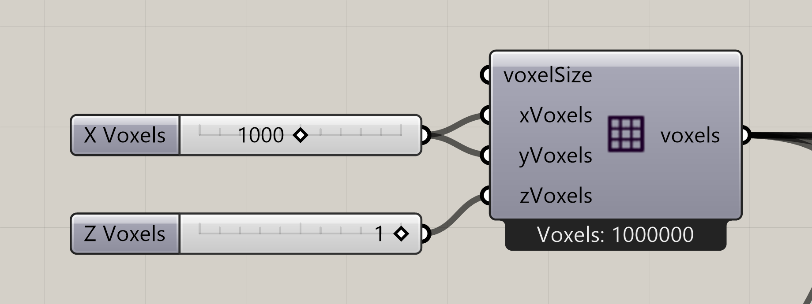
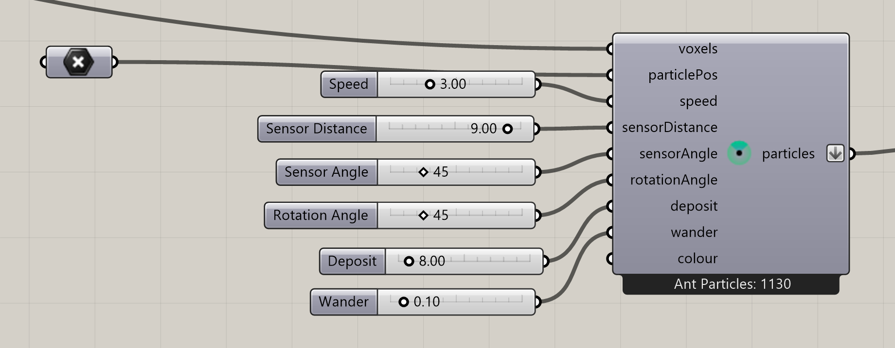
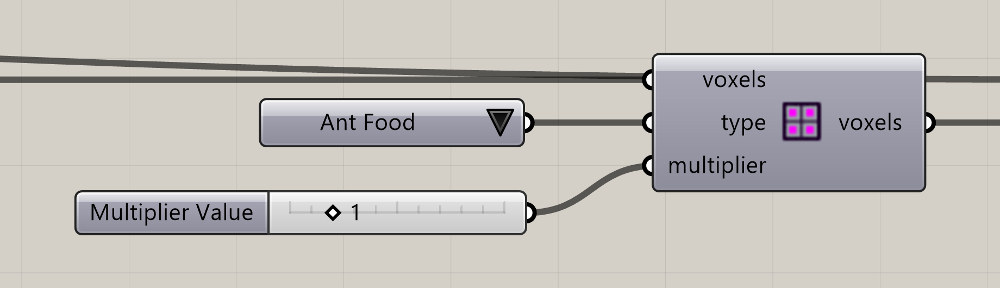
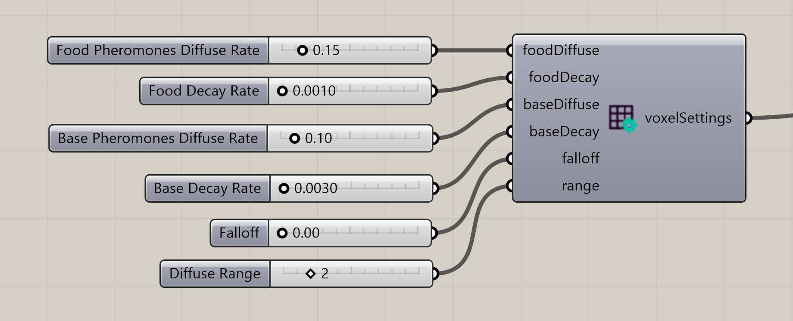
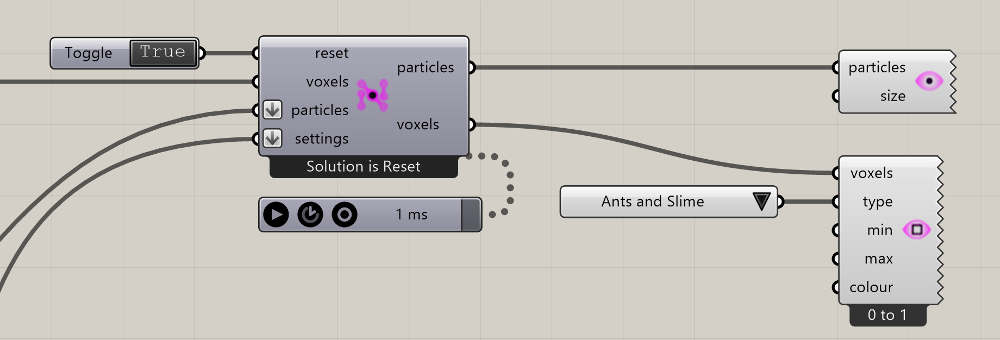

# Your first ant simulation

Follow **16\_Ants Intro.gh**, the original 2D ant example. You will identify the colony positions, map food, inspect the pheromone settings, and run the foraging simulation.

Install [Nuclei V4 in Rhino 9](../installation.md), then [download the original Ants Intro definition](../examples/files/13-ants-intro.gh). Keep its groups and connections as supplied.

## 1. Inspect the environment

**Construct Voxels** creates a **1000 × 1000 × 1** field. Z = 1 keeps the study planar. Its output connects to the point-attractor branches and the ant constructor.

One point-attractor branch uses **Maximum Range = 15** and feeds the food mapping. The other uses **Maximum Range = 60** and feeds the chain of voxel positions and selection used to initialize the colony.

## 2. Find the initial colony

Follow the lower attractor branch through the point-selection chain to **particlePos** on **Construct Ant Particles**. These nest positions are required: the ant constructor creates ants only at supplied points.

Those starting positions establish where ants begin and remember home. The constructor’s **particles** output connects to the solver.

| Ant control     | Saved value |
| --------------- | ----------- |
| Speed           | 3           |
| Sensor Distance | 9           |
| Sensor Angle    | 45          |
| Rotation Angle  | 45          |
| Deposit         | 8           |
| Wander          | 0.1         |

These are this example’s settings, not the defaults of a newly placed constructor.

## 3. Locate the food map

The upper mapping branch uses **Define Voxel Values** with **Type = Ant Food** and **Multiplier Value = 1**. Its field is combined through **Voxel Selection Union** before entering the solver.

Ant Food is edible material that stays in place until ants consume it. It also emits food pheromone. The food itself, the pheromone it emits, and the trail left by returning ants are related but distinct parts of the simulation.

## 4. Read the pheromone settings

The **Voxel Settings Ant** group controls two signals. Searching ants leave a base trail; returning ants leave a food trail. Its **voxelSettings** output connects to the solver’s **settings** input.

| Control                      | Saved value |
| ---------------------------- | ----------- |
| Food Pheromones Diffuse Rate | 0.15        |
| Food Decay Rate              | 0.001       |
| Base Pheromones Diffuse Rate | 0.1         |
| Base Decay Rate              | 0.003       |
| Falloff                      | 0           |
| Diffuse Range                | 2           |

Diffusion spreads the signal into neighboring cells. Decay fades it. Food and base trails have separate rates, so they can persist differently. Both share Falloff and Range. Falloff 0 keeps local weighted diffusion; increasing it spreads the scent more evenly across the range, like slime. Leave the saved values unchanged for the first run.

## 5. Initialize and run

The Boolean Toggle connects to **reset**. The Trigger advances the solver, and the solver’s **voxels** output feeds Voxel Preview. Its **particles** output also connects to Particle Preview.

1. Pause the existing Trigger while inspecting the graph.
2. Set the solver’s reset toggle to **True**, then back to **False**.
3. Start the existing Trigger attached to the solver.
4. Use a Top view in Rhino and zoom to the field. Enable Grasshopper preview.
5. Pause the Trigger when you want to inspect the state or change controls.

The saved **Voxel Preview** is connected to the solver’s voxels output and uses **Ants and Slime**. This shows environmental signals; it is not the same display as particle points or particle trails. Use the named Type choices when you want to inspect an individual pheromone field.

## Check that it worked

* The ant constructor reports particles from the supplied colony positions.
* The solver’s iteration increases while the Trigger runs.
* Pheromone paths develop as ants explore and return home.
* Pausing the Trigger stops the iteration count; Reset returns it to zero.

## 6. Read the result

Ants first spread out and search. When they detect food scent, their movement becomes directed toward it. On reaching food, they take some and return toward home, leaving food pheromone along the route. Other ants can reinforce the route over repeated trips.

## 7. Compare one change

Pause and reset between comparisons. Try changing **Food Decay Rate** while keeping the food regions and ant controls fixed. Observe how long unused signals remain visible. Then restore the saved value before experimenting with **Wander**.

Do not change food strength, sensing, and decay together for the first comparison: it becomes difficult to tell which change caused the result.

Continue with [Ant behavior](../core-concepts/ant-behavior.md) for the full search-and-return loop, or [Ants Complex](../examples/14-ants-complex.md) for multiple food regions and a restrictive map.
