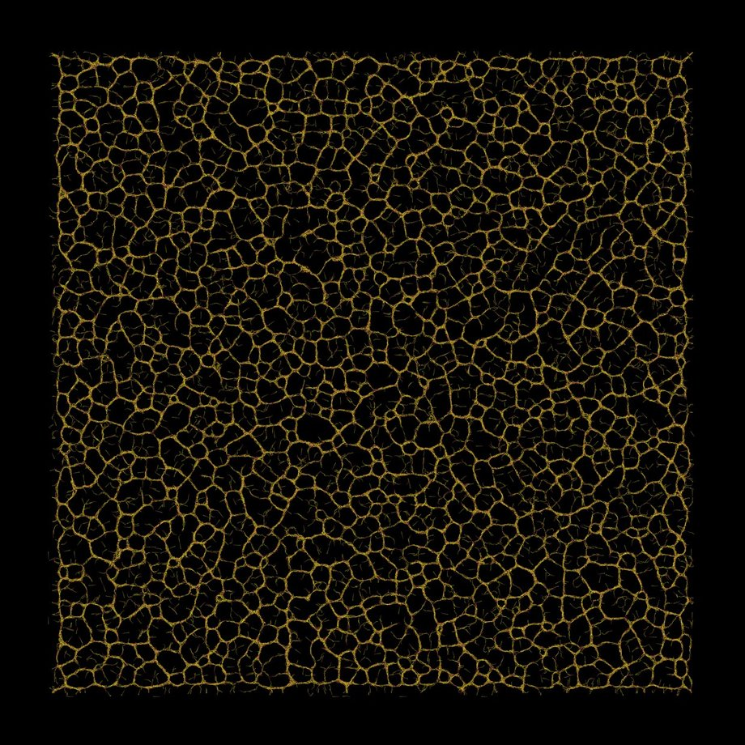
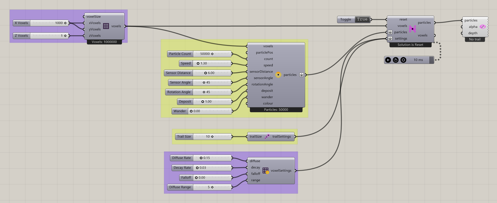
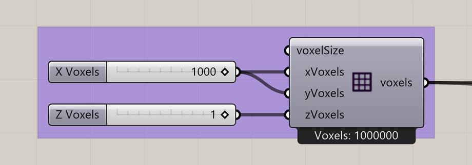
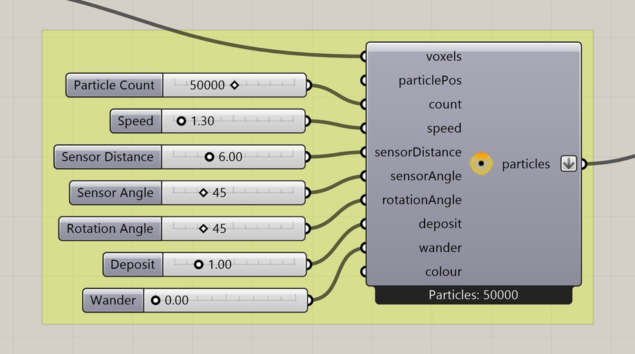
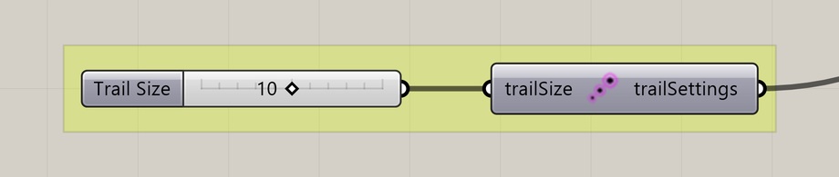
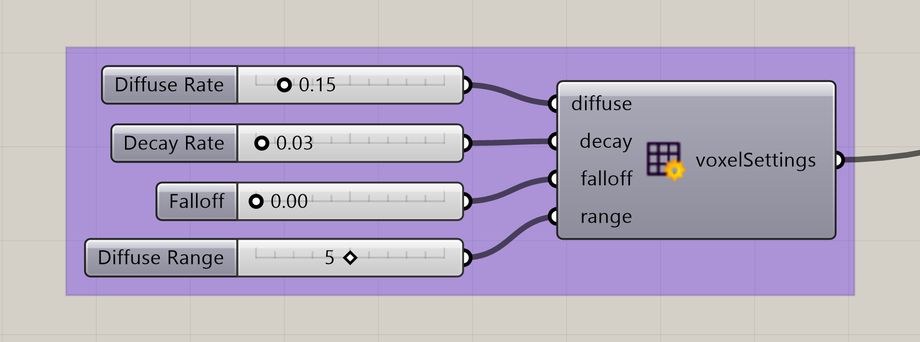
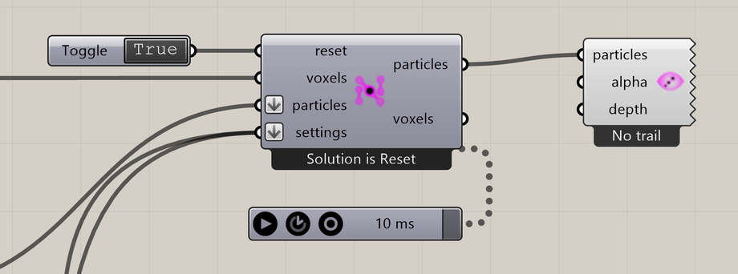

# Your first slime simulation

Explore how slime particles organize into connected paths using **01\_Slime Intro.gh**, the original Nuclei V4 example. This walkthrough follows its saved layout, groups, and slider values.

**Before you begin:** use [Nuclei V4 in Rhino 9 on Windows](../installation.md).

[Download the Slime Intro definition](../examples/first-slime-simulation.gh) and open it in Grasshopper. The download is a copy of the original example, not a rebuilt starter.

## 1. Define the design space

The purple **Define Design Space** group contains **Construct Voxels** and the sliders that set the field dimensions. A voxel is one cell of the simulation environment.

| Input      | Example setting                    | Meaning                                                 |
| ---------- | ---------------------------------- | ------------------------------------------------------- |
| X Voxels   | 1000                               | Cells along X.                                          |
| Y Voxels   | 1000                               | The same slider also feeds Y, keeping the field square. |
| Z Voxels   | 1                                  | A single layer for a 2D simulation.                     |
| Voxel Size | 1, stored on the unconnected input | One model unit per cell edge.                           |

The field contains **1,000,000 voxels**. Its output feeds both the particle constructor and the solver. Keep these existing connections.

## 2. Understand the particles

The large yellow-green group contains **Construct Slime Particles** and its behavior sliders.

| Slider          | Saved value | What it controls                                    |
| --------------- | ----------- | --------------------------------------------------- |
| Particle Count  | 50,000      | Requested initial particle population.              |
| Speed           | 1.30        | Movement distance.                                  |
| Sensor Distance | 6.00        | How far away particles sample the field.            |
| Sensor Angle    | 45          | How widely the sensing directions spread.           |
| Rotation Angle  | 45          | The steering angle.                                 |
| Deposit         | 1.00        | Signal deposited after moving into a new voxel.     |
| Wander          | 0.00        | Frequency of random turns; zero disables wandering. |

The voxel field is connected to **voxels**. **particlePos** is empty, so positions are generated within the field. The **particles** output supplies the solver.

Count is the requested starting population. The solver can retain fewer particles after applying boundaries and occupancy rules; this is different from changing the Count slider. See [requested and retained particles](../components/construct-slime-particles.md#requested-and-retained-particles).

Leave the values as saved for your first run. Each particle senses nearby signals, turns, moves, and deposits a signal that other particles can follow.

## 3. Set the visible trail length

The smaller yellow-green group contains **Particle Trail Settings**.

**Trail Size = 10** controls the recent particle history retained for trail display. Its **trailSettings** output is connected to the solver's **settings** input.

The visible particle trail and the deposited slime signal are different: this group controls trail history, while the next group controls how the signal in the environment spreads and fades.

## 4. Understand diffusion and decay

The lower purple group contains **Voxel Settings Slime**.

| Slider        | Saved value | What it controls                           |
| ------------- | ----------- | ------------------------------------------ |
| Diffuse Rate  | 0.15        | Spreading of the deposited signal.         |
| Decay Rate    | 0.03        | Fading of that signal.                     |
| Falloff       | 0.00        | Falloff of diffusion across nearby voxels. |
| Diffuse Range | 5           | Neighborhood range used for diffusion.     |

The **voxelSettings** output joins **trailSettings** at the solver's **settings** input. Hold **Shift** when adding the second settings wire to keep the first connected.

Busy routes receive repeated deposits. Diffusion spreads those deposits to nearby cells, while decay lets unused signals fade. Together with particle sensing, these processes allow paths to emerge.

## 5. Run and pause the simulation

The Boolean Toggle connects to **reset** on the solver to initialize the simulation. The Trigger requests repeated simulation steps, and **Particle Trail Preview** displays the trails.

1. Keep the Trigger paused while checking the definition.
2. Set **reset** to **True** to initialize the simulation.
3. Set **reset** to **False**. Leaving it True resets the simulation on each solution.
4. Start the existing Trigger beneath the solver. It is already linked to the solver; you do not need another Timer/Trigger.
5. In Rhino, use a **Top** view and zoom to the field. Make sure Grasshopper preview and **Particle Trail Preview** are enabled.
6. Pause the Trigger to stop advancing the simulation. To begin again, pause, switch reset to True and then False, and restart the Trigger.

The Trigger requests repeated solutions. Its interval is not a guarantee of the actual simulation frame rate; the work per step and your hardware also affect update speed.

The solver's **particles** output feeds **Particle Trail Preview**. The **voxels** output is available for other workflows and is unused here. The current solver has no status output or status Panel.

## Check that it worked

* Construct Voxels reports **1,000,000 cells**, with a 1000 × 1000 × 1 domain and Voxel Size 1.
* The particle constructor reports **50,000 generated particles**. The solver may retain fewer at reset.
* After Reset becomes False, the solver's **Iteration** message increases when solutions are requested.
* Trails appear after several steps; pause the Trigger and check that the iteration stops increasing.
* Reset returns the iteration to zero and clears accumulated history.

## 6. Watch the network develop

Initially, particles are scattered and have little movement history. As they move, look for local alignments and paths. Trail preview makes their recent movement visible.

## 7. Explore one change at a time

Pause and reset between comparisons. Keep the other settings unchanged so you can see what each change does.

* Try **Sensor Distance** at 3 and then 12. Compare sensing closer to the particle with sensing farther away.
* Try **Wander** at 0.1. Observe the effect of occasional random turns.
* Try **Decay Rate** at 0.06. Observe what happens when the deposited signal fades faster.
* Change **Trail Size** to compare shorter and longer visible particle histories.

These are experiments, not guaranteed presets. Return to the saved values whenever you want to start from the original example again.

## If something is wrong

| Symptom                          | Check                                                                                    |
| -------------------------------- | ---------------------------------------------------------------------------------------- |
| No movement                      | Reset is False and the existing Trigger is running.                                      |
| No trail immediately after reset | Let the particles advance for several steps to accumulate movement history.              |
| Empty Rhino viewport             | Trail preview and Grasshopper preview are enabled, and the field is in view.             |
| Red solver or component          | Read its runtime error message and confirm you have the matching V4 installation.        |
| Slow updates                     | Pause first. In a working copy, try a smaller field and particle population, then reset. |

For more examples, explore the [V4 example collection](../../../Nuclei%20Definitions/v4/).
